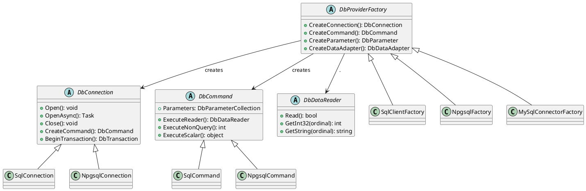

# 9.7. DbProviderFactory — провайдер-незалежний код

## Вступ: Коли один додаток — багато баз

Досі ми працювали виключно з `SqlConnection`, `SqlCommand`, `SqlDataReader` — класами, прив'язаними до MS SQL Server. Але що робити, якщо ваш додаток повинен працювати з **різними** СУБД? Наприклад:

- Клієнт А використовує **SQL Server**, клієнт Б — **PostgreSQL**, клієнт В — **MySQL**.
- Для розробки використовується **SQLite** (легка, без інсталяції), а для production — **SQL Server**.
- Ви створюєте **бібліотеку доступу до даних**, яку інші розробники будуть використовувати з різними СУБД.

Якщо ваш код жорстко прив'язаний до `SqlConnection`, для підтримки PostgreSQL вам доведеться дублювати **весь** код з `NpgsqlConnection`. А потім ще раз для MySQL. І знову для Oracle. Це порушення принципу **DRY** (Don't Repeat Yourself) і кошмар для підтримки.

**DbProviderFactory** — це паттерн **Абстрактна Фабрика** (Abstract Factory), вбудований в ADO.NET, який вирішує цю проблему. Він дозволяє писати код, що працює з **будь-якою** СУБД, не знаючи конкретного провайдера на етапі _компіляції_.

**Аналогія**: DbProviderFactory — це як **адаптер для розеток** в подорожі. Ви берете з собою один зарядний пристрій (ваш код) і адаптер (factory). В Україні адаптер дає вам українську розетку (`SqlConnection`), в Японії — японську (`NpgsqlConnection`). Ваш зарядний пристрій не змінюється — змінюється лише адаптер.

::note
**Передумови**: Статті [9.1. Введення](/1.csharp/09.ado-net/01.introduction-to-adonet) (архітектура інтерфейсів/абстрактних класів) та [9.5. Параметри](/1.csharp/09.ado-net/05.parameters-and-sql-injection). Розуміння патернів Abstract Factory та Dependency Inversion Principle.

::

---

## Проблема: Жорстка прив'язка до провайдера

Подивимось на типовий код, прив'язаний до SQL Server:

```csharp showLineNumbers
using Microsoft.Data.SqlClient; // ← Жорстка залежність від SQL Server!

public class ProductRepository
{
    private readonly string _connectionString;

    public ProductRepository(string connectionString)
    {
        _connectionString = connectionString;
    }

    public List<Product> GetAll()
    {
        var products = new List<Product>();

        // Усі типи — конкретні реалізації SQL Server
        using SqlConnection connection = new SqlConnection(_connectionString);
        connection.Open();

        using SqlCommand command = new SqlCommand(
            "SELECT Id, Name, Price FROM Products", connection);
        using SqlDataReader reader = command.ExecuteReader();

        while (reader.Read())
        {
            products.Add(new Product
            {
                Id = reader.GetInt32(0),
                Name = reader.GetString(1),
                Price = reader.GetDecimal(2)
            });
        }

        return products;
    }
}
```

Цей код **працює**, але має критичний недолік: він **намертво зав'язаний** на `Microsoft.Data.SqlClient`. Щоб підтримати PostgreSQL, потрібно:
1. Створити `ProductRepositoryPgsql` з `NpgsqlConnection`, `NpgsqlCommand`...
2. Або засмітити код `if/else` конструкціями: `if (dbType == "pgsql") ... else if (dbType == "mssql") ...`

Обидва варіанти — антипаттерни.

---

## Рішення: Абстрактні класи DbConnection, DbCommand

ADO.NET вже має вирішення — **абстрактні базові класи** у `System.Data.Common`:

::plant-uml



::

Замість `SqlConnection` використовуємо `DbConnection`, замість `SqlCommand` — `DbCommand`. Але є проблема: хто **створить** конкретний об'єкт (`SqlConnection` чи `NpgsqlConnection`)? Ми ж не можемо написати `new DbConnection()` — це абстрактний клас.

Тут і приходить на допомогу **DbProviderFactory**.

---

## DbProviderFactory: Абстрактна фабрика

`DbProviderFactory` — це абстрактний клас з фабричними методами для створення всіх основних ADO.NET-об'єктів. Кожен провайдер має свою реалізацію:

| Провайдер | Клас фабрики | Singleton-інстанс |
|:---|:---|:---|
| **SQL Server** | `SqlClientFactory` | `SqlClientFactory.Instance` |
| **PostgreSQL** | `NpgsqlFactory` | `NpgsqlFactory.Instance` |
| **MySQL** | `MySqlConnectorFactory` | `MySqlConnectorFactory.Instance` |
| **SQLite** | `SqliteFactory` | `SqliteFactory.Instance` |

### Методи DbProviderFactory

::field-group

::field{name="CreateConnection()" type="DbConnection"}
Створює з'єднання відповідного типу (`SqlConnection`, `NpgsqlConnection` тощо).

::

::field{name="CreateCommand()" type="DbCommand"}
Створює команду відповідного типу.

::

::field{name="CreateParameter()" type="DbParameter"}
Створює параметр відповідного типу.

::

::field{name="CreateDataAdapter()" type="DbDataAdapter"}
Створює DataAdapter відповідного типу. Може повернути `null`, якщо провайдер не підтримує DataAdapter.

::

::field{name="CreateConnectionStringBuilder()" type="DbConnectionStringBuilder"}
Створює ConnectionStringBuilder для провайдера.

::

::field{name="CanCreateDataAdapter" type="bool"}
Чи підтримує провайдер DataAdapter.

::

::

---

## Провайдер-незалежний ProductRepository

Перепишемо наш `ProductRepository` з використанням `DbProviderFactory`:

```csharp showLineNumbers
using System;
using System.Collections.Generic;
using System.Data;
using System.Data.Common;

// Провайдер-незалежний репозиторій
public class ProductRepository
{
    private readonly string _connectionString;
    private readonly DbProviderFactory _factory;

    public ProductRepository(string connectionString, DbProviderFactory factory)
    {
        _connectionString = connectionString;
        _factory = factory;
    }

    public List<Product> GetAll()
    {
        var products = new List<Product>();

        // Використовуємо АБСТРАКТНІ типи — жодної прив'язки до конкретного провайдера!
        using DbConnection connection = _factory.CreateConnection()!;
        connection.ConnectionString = _connectionString;
        connection.Open();

        using DbCommand command = connection.CreateCommand();
        command.CommandText = "SELECT Id, Name, Price FROM Products ORDER BY Name";

        using DbDataReader reader = command.ExecuteReader();
        while (reader.Read())
        {
            products.Add(new Product
            {
                Id = reader.GetInt32(0),
                Name = reader.GetString(1),
                Price = reader.GetDecimal(2)
            });
        }

        return products;
    }

    public int Insert(string name, decimal price, int quantity)
    {
        using DbConnection connection = _factory.CreateConnection()!;
        connection.ConnectionString = _connectionString;
        connection.Open();

        using DbCommand command = connection.CreateCommand();
        command.CommandText = @"
            INSERT INTO Products (Name, Price, Quantity)
            VALUES (@Name, @Price, @Quantity)";

        // Створюємо параметри через фабрику
        DbParameter nameParam = _factory.CreateParameter()!;
        nameParam.ParameterName = "@Name";
        nameParam.DbType = DbType.String;
        nameParam.Size = 100;
        nameParam.Value = name;
        command.Parameters.Add(nameParam);

        DbParameter priceParam = _factory.CreateParameter()!;
        priceParam.ParameterName = "@Price";
        priceParam.DbType = DbType.Decimal;
        priceParam.Value = price;
        command.Parameters.Add(priceParam);

        DbParameter qtyParam = _factory.CreateParameter()!;
        qtyParam.ParameterName = "@Qty";
        qtyParam.DbType = DbType.Int32;
        qtyParam.Value = quantity;
        command.Parameters.Add(qtyParam);

        return command.ExecuteNonQuery();
    }
}
```

**Розбір коду:**

- **Рядки 10-11**: Репозиторій залежить від **абстракцій**: `string` (Connection String) та `DbProviderFactory` (фабрика). Жодного `using Microsoft.Data.SqlClient`!
- **Рядок 23**: `_factory.CreateConnection()` — фабрика створює **конкретний** тип з'єднання. Якщо factory — це `SqlClientFactory.Instance`, створюється `SqlConnection`. Якщо `NpgsqlFactory.Instance` — `NpgsqlConnection`.
- **Рядок 27**: `connection.CreateCommand()` — ще один спосіб створити команду, автоматично прив'язану до з'єднання.
- **Рядки 57-73**: Параметри створюються через `_factory.CreateParameter()`. Зверніть увагу: замість `SqlDbType` використовується **платформо-незалежний** `DbType`.

### Використання з різними провайдерами

```csharp showLineNumbers
using Microsoft.Data.SqlClient;
using Npgsql; // NuGet: Npgsql

// SQL Server
var sqlServerRepo = new ProductRepository(
    "Server=localhost;Database=ShopDb;Trusted_Connection=True;TrustServerCertificate=True;",
    SqlClientFactory.Instance  // ← Фабрика SQL Server
);

// PostgreSQL (той самий клас ProductRepository!)
var pgsqlRepo = new ProductRepository(
    "Host=localhost;Database=shopdb;Username=postgres;Password=secret",
    NpgsqlFactory.Instance     // ← Фабрика PostgreSQL
);

// Код використання ІДЕНТИЧНИЙ:
var products = sqlServerRepo.GetAll();
var pgProducts = pgsqlRepo.GetAll();
```

Один і той самий `ProductRepository` працює з **будь-якою** СУБД. Зміна бази — лише зміна Connection String та фабрики в конфігурації, **без зміни коду** репозиторію.

---

## Реєстрація та пошук провайдерів

У .NET Core / .NET 5+ для використання `DbProviderFactory` потрібно **реєструвати** провайдери через `DbProviderFactories`:

```csharp showLineNumbers
using System.Data.Common;
using Microsoft.Data.SqlClient;

// Реєстрація провайдерів (зазвичай при старті додатка)
DbProviderFactories.RegisterFactory("Microsoft.Data.SqlClient", SqlClientFactory.Instance);
// DbProviderFactories.RegisterFactory("Npgsql", NpgsqlFactory.Instance);

// Отримання фабрики за назвою (з конфігурації)
string providerName = "Microsoft.Data.SqlClient"; // Може братися з appsettings.json
DbProviderFactory factory = DbProviderFactories.GetFactory(providerName);

// Перевірка зареєстрованих провайдерів
DataTable providers = DbProviderFactories.GetFactoryClasses();
foreach (DataRow row in providers.Rows)
{
    Console.WriteLine($"  {row["InvariantName"]}: {row["Name"]}");
}
```

### Конфігурація через appsettings.json

```json [appsettings.json]
{
  "Database": {
    "ProviderName": "Microsoft.Data.SqlClient",
    "ConnectionString": "Server=localhost;Database=ShopDb;Trusted_Connection=True;TrustServerCertificate=True;"
  }
}
```

```csharp showLineNumbers
using System.Data.Common;
using Microsoft.Extensions.Configuration;

IConfiguration config = new ConfigurationBuilder()
    .AddJsonFile("appsettings.json")
    .Build();

string providerName = config["Database:ProviderName"]!;
string connectionString = config["Database:ConnectionString"]!;

// Реєстрація (один раз при старті)
DbProviderFactories.RegisterFactory("Microsoft.Data.SqlClient", SqlClientFactory.Instance);

// Отримання фабрики за ім'ям з конфігурації
DbProviderFactory factory = DbProviderFactories.GetFactory(providerName);

// Створення репозиторію
var repository = new ProductRepository(connectionString, factory);
```

Тепер зміна бази даних — це **лише** зміна `appsettings.json`, без перекомпіляції коду!

---

## Обмеження провайдер-незалежного підходу

Провайдер-незалежний код — це потужна концепція, але вона має обмеження, які потрібно знати:

### SQL-діалекти

Кожна СУБД має свій **діалект SQL**. Наприклад, пагінація:

::code-group

```sql [SQL Server]
-- SQL Server: OFFSET ... FETCH
SELECT * FROM Products
ORDER BY Id
OFFSET 10 ROWS
FETCH NEXT 5 ROWS ONLY;
```

```sql [PostgreSQL]
-- PostgreSQL: LIMIT ... OFFSET
SELECT * FROM Products
ORDER BY Id
LIMIT 5
OFFSET 10;
```

```sql [MySQL]
-- MySQL: LIMIT offset, count
SELECT * FROM Products
ORDER BY Id
LIMIT 10, 5;
```

::

Якщо ваш SQL використовує специфічні функції СУБД (наприклад, `SCOPE_IDENTITY()` у SQL Server vs `RETURNING Id` у PostgreSQL), провайдер-незалежний код не допоможе з SQL-запитами. Він вирішує лише проблему **інфраструктурного коду** (створення з'єднань, команд, параметрів).

### Рішення: Паттерн Strategy для SQL

```csharp showLineNumbers
// Інтерфейс для SQL-діалектів
public interface ISqlDialect
{
    string SelectPaged(string tableName, string orderBy, int offset, int count);
    string InsertReturningId(string tableName, string columns, string values);
    string CurrentTimestamp { get; }
}

// Реалізація для SQL Server
public class SqlServerDialect : ISqlDialect
{
    public string SelectPaged(string table, string orderBy, int offset, int count) =>
        $"SELECT * FROM {table} ORDER BY {orderBy} OFFSET {offset} ROWS FETCH NEXT {count} ROWS ONLY";

    public string InsertReturningId(string table, string columns, string values) =>
        $"INSERT INTO {table} ({columns}) VALUES ({values}); SELECT CAST(SCOPE_IDENTITY() AS INT);";

    public string CurrentTimestamp => "GETDATE()";
}

// Реалізація для PostgreSQL
public class PostgreSqlDialect : ISqlDialect
{
    public string SelectPaged(string table, string orderBy, int offset, int count) =>
        $"SELECT * FROM {table} ORDER BY {orderBy} LIMIT {count} OFFSET {offset}";

    public string InsertReturningId(string table, string columns, string values) =>
        $"INSERT INTO {table} ({columns}) VALUES ({values}) RETURNING Id;";

    public string CurrentTimestamp => "NOW()";
}
```

---

## Повний приклад: Мультипровайдерний додаток

```csharp showLineNumbers
using System;
using System.Collections.Generic;
using System.Data;
using System.Data.Common;
using Microsoft.Data.SqlClient;

// === Модель ===
public class Product
{
    public int Id { get; set; }
    public string Name { get; set; } = "";
    public decimal Price { get; set; }
    public int Quantity { get; set; }

    public override string ToString() =>
        $"[{Id}] {Name}: {Price:C} (x{Quantity})";
}

// === Провайдер-незалежний репозиторій ===
public class UniversalProductRepository
{
    private readonly string _connectionString;
    private readonly DbProviderFactory _factory;

    public UniversalProductRepository(string connectionString, DbProviderFactory factory)
    {
        _connectionString = connectionString;
        _factory = factory;
    }

    private DbConnection CreateOpenConnection()
    {
        DbConnection connection = _factory.CreateConnection()
            ?? throw new InvalidOperationException("Factory returned null connection.");
        connection.ConnectionString = _connectionString;
        connection.Open();
        return connection;
    }

    private DbParameter CreateParameter(string name, DbType type, object value, int size = 0)
    {
        DbParameter param = _factory.CreateParameter()
            ?? throw new InvalidOperationException("Factory returned null parameter.");
        param.ParameterName = name;
        param.DbType = type;
        param.Value = value ?? DBNull.Value;
        if (size > 0) param.Size = size;
        return param;
    }

    public List<Product> GetAll()
    {
        var products = new List<Product>();

        using DbConnection conn = CreateOpenConnection();
        using DbCommand cmd = conn.CreateCommand();
        cmd.CommandText = "SELECT Id, Name, Price, Quantity FROM Products ORDER BY Name";

        using DbDataReader reader = cmd.ExecuteReader();
        while (reader.Read())
        {
            products.Add(new Product
            {
                Id = reader.GetInt32(0),
                Name = reader.GetString(1),
                Price = reader.GetDecimal(2),
                Quantity = reader.GetInt32(3)
            });
        }

        return products;
    }

    public Product? GetById(int id)
    {
        using DbConnection conn = CreateOpenConnection();
        using DbCommand cmd = conn.CreateCommand();
        cmd.CommandText = "SELECT Id, Name, Price, Quantity FROM Products WHERE Id = @Id";
        cmd.Parameters.Add(CreateParameter("@Id", DbType.Int32, id));

        using DbDataReader reader = cmd.ExecuteReader();
        if (reader.Read())
        {
            return new Product
            {
                Id = reader.GetInt32(0),
                Name = reader.GetString(1),
                Price = reader.GetDecimal(2),
                Quantity = reader.GetInt32(3)
            };
        }
        return null;
    }

    public int Insert(Product product)
    {
        using DbConnection conn = CreateOpenConnection();
        using DbCommand cmd = conn.CreateCommand();
        cmd.CommandText = @"
            INSERT INTO Products (Name, Price, Quantity)
            VALUES (@Name, @Price, @Quantity)";

        cmd.Parameters.Add(CreateParameter("@Name", DbType.String, product.Name, 100));
        cmd.Parameters.Add(CreateParameter("@Price", DbType.Decimal, product.Price));
        cmd.Parameters.Add(CreateParameter("@Quantity", DbType.Int32, product.Quantity));

        return cmd.ExecuteNonQuery();
    }

    public string GetServerInfo()
    {
        using DbConnection conn = CreateOpenConnection();
        return $"Provider: {conn.GetType().Name}, Version: {conn.ServerVersion}";
    }
}

// === Запуск ===
DbProviderFactories.RegisterFactory("Microsoft.Data.SqlClient", SqlClientFactory.Instance);

string providerName = "Microsoft.Data.SqlClient";
string connectionString = "Server=localhost;Database=ShopDb;Trusted_Connection=True;TrustServerCertificate=True;";

DbProviderFactory factory = DbProviderFactories.GetFactory(providerName);
var repo = new UniversalProductRepository(connectionString, factory);

Console.WriteLine(repo.GetServerInfo());
Console.WriteLine("\nУсі товари:");
foreach (var p in repo.GetAll())
{
    Console.WriteLine($"  {p}");
}
```

---

## Практичні завдання

### Рівень 1: Базовий

::steps

### Завдання 1.1: Фабрика з'єднань

Напишіть метод `DbConnection CreateConnection(string providerName, string connectionString)`, який:
1. Отримує фабрику через `DbProviderFactories.GetFactory()`.
2. Створює і повертає відкрите з'єднання.
3. Обробляє `ArgumentException` (невідомий провайдер).

### Завдання 1.2: Діагностика провайдерів

Створіть програму, яка:
1. Реєструє всі доступні провайдери.
2. Виводить таблицю всіх зареєстрованих провайдерів.
3. Для кожного перевіряє підтримку DataAdapter (`CanCreateDataAdapter`).

::

### Рівень 2: Логіка та обробка даних

::steps

### Завдання 2.1: Провайдер-незалежний CRUD

Реалізуйте повний CRUD через `DbProviderFactory`:
1. Клас `GenericRepository<T>` з методами `GetAll()`, `GetById()`, `Insert()`, `Update()`, `Delete()`.
2. Конструктор приймає `DbProviderFactory`, Connection String, та `Func<DbDataReader, T>` для маппінгу.
3. Всі SQL-запити передаються як параметри (не хардкодяться).
4. Протестуйте з `SqlClientFactory`.

### Завдання 2.2: Database Explorer

Створіть утиліту, яка підключається до будь-якої СУБД через `DbProviderFactory` і виводить:
1. Версію сервера.
2. Список баз даних (для SQL Server: `SELECT name FROM sys.databases`).
3. Перелік таблиць рандомної бази.

::

### Рівень 3: Архітектура

::steps

### Завдання 3.1: Мульти-провайдерний тестер

Створіть програму, яка:
1. Зчитує з конфігурації список баз даних (provider + connection string).
2. Перевіряє підключення до кожної.
3. Виконує простий запит (`SELECT 1`) для верифікації.
4. Виводить зведену таблицю: провайдер, статус, версія сервера, час підключення.

### Завдання 3.2: Abstract Data Layer

Спроєктуйте та реалізуйте модульну архітектуру:
1. Інтерфейс `IDataLayer` з методами `Query<T>()`, `Execute()`, `Scalar<T>()`.
2. Реалізація `AdoNetDataLayer`, що приймає `DbProviderFactory`.
3. Хелпер-методи для створення параметрів.
4. Обгортка для транзакцій.
5. Продемонструйте, що зміна СУБД — лише зміна конфігурації.

::

---

## Резюме

::card-group

::card{title="DbProviderFactory" icon="i-heroicons-cog-6-tooth"}
Абстрактна фабрика для створення ADO.NET-об'єктів. Дозволяє писати код, який працює з будь-якою СУБД без зміни логіки.

::

::card{title="DbConnection / DbCommand" icon="i-heroicons-puzzle-piece"}
Абстрактні класи замість конкретних SqlConnection/SqlCommand. Ваш код залежить від абстракцій, а не від реалізацій (Dependency Inversion).

::

::card{title="DbType замість SqlDbType" icon="i-heroicons-tag"}
Платформо-незалежний enum для типів параметрів. `DbType.String` замість `SqlDbType.NVarChar`.

::

::card{title="Обмеження: SQL-діалекти" icon="i-heroicons-exclamation-triangle"}
DbProviderFactory вирішує інфраструктурну проблему, але SQL-запити можуть бути СУБД-специфічні. Для SQL-діалектів використовуйте паттерн Strategy.

::

::

### Ключові поняття

- **DbProviderFactory** — абстрактна фабрика для створення ADO.NET-об'єктів
- **Abstract Factory pattern** — створення сімейств пов'язаних об'єктів без вказівки конкретних класів
- **Dependency Inversion** — залежність від абстракцій (DbConnection), а не конкретних реалізацій (SqlConnection)
- **DbType** — платформо-незалежний enum для типів параметрів
- **DbProviderFactories.RegisterFactory()** — реєстрація провайдера для пошуку за ім'ям

::tip
**Наступний крок**: У наступній статті ми розглянемо **асинхронний ADO.NET** — `OpenAsync()`, `ExecuteReaderAsync()`, `ReadAsync()` та паттерни ефективного використання async/await при роботі з базами даних.

::
