# 9.8. Асинхронний доступ до даних

## Вступ: Чому синхронний код — це проблема?

У попередніх статтях ми використовували синхронні методи: `connection.Open()`, `command.ExecuteReader()`, `reader.Read()`. Вони працюють чудово для консольних додатків, але в контексті **веб-серверів** та **UI-додатків** синхронний код може стати серйозною проблемою.

Уявіть веб-сервер ASP.NET Core, який обробляє 1000 запитів на секунду. Кожен запит потребує звернення до бази даних. Синхронний `connection.Open()` **блокує потік** на 50-200 мс, поки встановлюється TCP-з'єднання. `command.ExecuteReader()` блокує потік ще на 10-500 мс, поки SQL Server виконує запит. Весь цей час потік просто **стоїть і чекає** — він не може обробити інші запити.

ThreadPool у .NET має обмежену кількість потоків (зазвичай ~1000 на процесор). Якщо всі потоки зайняті очікуванням відповіді від SQL Server — нові HTTP-запити стоять у черзі, час відповіді зростає, а сервер стає нечутливим. Це класична проблема **thread starvation** (голодування потоків).

**Аналогія**: Уявіть ресторан з 10 офіціантами (потоками). Синхронний підхід: офіціант приймає замовлення, йде на кухню і **стоїть там**, поки кухар не приготує страву. Потім несе страву клієнту. Поки він стоїть на кухні — 9 інших клієнтів чекають. Асинхронний підхід: офіціант приймає замовлення, відносить його на кухню і **одразу йде обслуговувати** інших клієнтів. Коли страва готова, кухня дзвонить у дзвіночок (callback), і звільнений офіціант несе страву.

::note
**Передумови**: Знання `async/await` у C#, `Task`, `CancellationToken`. Статті [9.2. DbConnection](/1.csharp/09.ado-net/02.connection) та [9.3. DbCommand](/1.csharp/09.ado-net/03.command-and-queries).

::

---

## Синхронний vs Асинхронний: Візуалізація

::mermaid

```mermaid
gantt
    title Обробка 3 запитів: Синхронний підхід
    dateFormat x
    axisFormat %L ms

    section Потік 1
    Запит 1 — Open()        :a1, 0, 100
    Запит 1 — Execute()     :a2, after a1, 200
    Запит 1 — Read()        :a3, after a2, 50

    section Потік 2
    Запит 2 — Open()        :b1, 0, 100
    Запит 2 — Execute()     :b2, after b1, 200
    Запит 2 — Read()        :b3, after b2, 50

    section Потік 3
    Запит 3 — Open()        :c1, 0, 100
    Запит 3 — Execute()     :c2, after c1, 200
    Запит 3 — Read()        :c3, after c2, 50
```



::

У синхронному підході **3 потоки зайняті** на весь час обробки. Поки потік «чекає» відповіді від SQL Server — він нічого не робить, але й не доступний для інших задач.

В асинхронному підході один потік може обслуговувати **всі 3 запити**: поки один чекає відповіді від бази, потік обробляє інші.

---

## Async-методи в ADO.NET

ADO.NET надає асинхронні версії для **всіх** основних операцій:

| Синхронний | Асинхронний | Повертає |
|:---|:---|:---|
| `connection.Open()` | `connection.OpenAsync()` | `Task` |
| `command.ExecuteReader()` | `command.ExecuteReaderAsync()` | `Task<DbDataReader>` |
| `command.ExecuteNonQuery()` | `command.ExecuteNonQueryAsync()` | `Task<int>` |
| `command.ExecuteScalar()` | `command.ExecuteScalarAsync()` | `Task<object?>` |
| `reader.Read()` | `reader.ReadAsync()` | `Task<bool>` |
| `reader.NextResult()` | `reader.NextResultAsync()` | `Task<bool>` |
| `reader.IsDBNull(i)` | `reader.IsDBNullAsync(i)` | `Task<bool>` |
| `reader.GetFieldValue<T>(i)` | `reader.GetFieldValueAsync<T>(i)` | `Task<T>` |

Усі асинхронні методи приймають опціональний `CancellationToken` для скасування операції.

---

## Базовий асинхронний приклад

Перепишемо синхронний код з попередніх статей на async:

::tabs

::tabs-item{label="Синхронний"}

```csharp showLineNumbers
// Синхронний — блокує потік на кожній операції
using SqlConnection connection = new SqlConnection(connectionString);
connection.Open(); // Блокує ~100 мс

using SqlCommand command = new SqlCommand(sql, connection);
using SqlDataReader reader = command.ExecuteReader(); // Блокує ~10-200 мс

while (reader.Read()) // Блокує на кожному рядку
{
    // ... обробка ...
}
```

::

::tabs-item{label="Асинхронний"}

```csharp showLineNumbers
// Асинхронний — звільняє потік під час очікування
using SqlConnection connection = new SqlConnection(connectionString);
await connection.OpenAsync(); // Потік вільний під час очікування TCP

using SqlCommand command = new SqlCommand(sql, connection);
await using SqlDataReader reader = await command.ExecuteReaderAsync();

while (await reader.ReadAsync()) // Потік вільний під час читання з мережі
{
    // ... обробка ...
}
```

::

::

Зверніть увагу на ключові зміни:

1. **`await connection.OpenAsync()`** замість `connection.Open()` — під час встановлення TCP-з'єднання потік повертається в ThreadPool.
2. **`await command.ExecuteReaderAsync()`** замість `ExecuteReader()` — під час виконання SQL-запиту потік вільний.
3. **`await reader.ReadAsync()`** замість `Read()` — під час отримання наступної порції даних з мережі потік вільний.
4. **`await using`** замість `using` для `SqlDataReader` — асинхронний `Dispose` (C# 8.0+).

---

## Повний асинхронний CRUD

```csharp showLineNumbers
using System;
using System.Collections.Generic;
using System.Data;
using System.Threading;
using System.Threading.Tasks;
using Microsoft.Data.SqlClient;

public class AsyncProductRepository
{
    private readonly string _connectionString;

    public AsyncProductRepository(string connectionString)
    {
        _connectionString = connectionString;
    }

    // GET ALL — асинхронне читання списку
    public async Task<List<Product>> GetAllAsync(CancellationToken ct = default)
    {
        var products = new List<Product>();

        await using SqlConnection connection = new SqlConnection(_connectionString);
        await connection.OpenAsync(ct);

        await using SqlCommand command = new SqlCommand(
            "SELECT Id, Name, Price, Quantity FROM Products ORDER BY Name",
            connection);

        await using SqlDataReader reader = await command.ExecuteReaderAsync(ct);

        while (await reader.ReadAsync(ct))
        {
            products.Add(new Product
            {
                Id = reader.GetInt32(0),
                Name = reader.GetString(1),
                Price = reader.GetDecimal(2),
                Quantity = reader.GetInt32(3)
            });
        }

        return products;
    }

    // GET BY ID — асинхронне отримання одного об'єкта
    public async Task<Product?> GetByIdAsync(int id, CancellationToken ct = default)
    {
        await using SqlConnection connection = new SqlConnection(_connectionString);
        await connection.OpenAsync(ct);

        await using SqlCommand command = new SqlCommand(
            "SELECT Id, Name, Price, Quantity FROM Products WHERE Id = @Id",
            connection);
        command.Parameters.Add("@Id", SqlDbType.Int).Value = id;

        await using SqlDataReader reader = await command.ExecuteReaderAsync(ct);

        if (await reader.ReadAsync(ct))
        {
            return new Product
            {
                Id = reader.GetInt32(0),
                Name = reader.GetString(1),
                Price = reader.GetDecimal(2),
                Quantity = reader.GetInt32(3)
            };
        }

        return null;
    }

    // INSERT — асинхронна вставка з поверненням ID
    public async Task<int> InsertAsync(Product product, CancellationToken ct = default)
    {
        await using SqlConnection connection = new SqlConnection(_connectionString);
        await connection.OpenAsync(ct);

        await using SqlCommand command = new SqlCommand(@"
            INSERT INTO Products (Name, Price, Quantity)
            VALUES (@Name, @Price, @Quantity);
            SELECT CAST(SCOPE_IDENTITY() AS INT);",
            connection);

        command.Parameters.Add("@Name", SqlDbType.NVarChar, 100).Value = product.Name;
        command.Parameters.Add("@Price", SqlDbType.Decimal).Value = product.Price;
        command.Parameters.Add("@Quantity", SqlDbType.Int).Value = product.Quantity;

        object? result = await command.ExecuteScalarAsync(ct);
        return Convert.ToInt32(result);
    }

    // UPDATE — асинхронне оновлення
    public async Task<int> UpdateAsync(Product product, CancellationToken ct = default)
    {
        await using SqlConnection connection = new SqlConnection(_connectionString);
        await connection.OpenAsync(ct);

        await using SqlCommand command = new SqlCommand(
            "UPDATE Products SET Name = @Name, Price = @Price, Quantity = @Qty WHERE Id = @Id",
            connection);

        command.Parameters.Add("@Id", SqlDbType.Int).Value = product.Id;
        command.Parameters.Add("@Name", SqlDbType.NVarChar, 100).Value = product.Name;
        command.Parameters.Add("@Price", SqlDbType.Decimal).Value = product.Price;
        command.Parameters.Add("@Qty", SqlDbType.Int).Value = product.Quantity;

        return await command.ExecuteNonQueryAsync(ct);
    }

    // DELETE — асинхронне видалення
    public async Task<int> DeleteAsync(int id, CancellationToken ct = default)
    {
        await using SqlConnection connection = new SqlConnection(_connectionString);
        await connection.OpenAsync(ct);

        await using SqlCommand command = new SqlCommand(
            "DELETE FROM Products WHERE Id = @Id", connection);
        command.Parameters.Add("@Id", SqlDbType.Int).Value = id;

        return await command.ExecuteNonQueryAsync(ct);
    }
}
```

**Розбір коду:**

- **Кожен метод**: Приймає `CancellationToken ct = default` — це дозволяє **скасувати** операцію ззовні (наприклад, якщо клієнт закрив браузер).
- **`await using`**: Гарантує асинхронне звільнення ресурсів.
- **Кожен метод відкриває і закриває з'єднання самостійно**: Це правильний підхід — з'єднання береться з пулу, використовується мінімальний час і повертається назад.

---

## CancellationToken: Скасування операцій

`CancellationToken` — це механізм кооперативного скасування в .NET. Він особливо важливий для ADO.NET, бо дозволяє скасувати **довгий SQL-запит**, якщо користувач пішов або таймаут вичерпано:

```csharp showLineNumbers
using System;
using System.Threading;
using System.Threading.Tasks;
using Microsoft.Data.SqlClient;

string connectionString = "Server=localhost;Database=ShopDb;Trusted_Connection=True;TrustServerCertificate=True;";

// Створюємо CancellationTokenSource з таймаутом 5 секунд
using CancellationTokenSource cts = new CancellationTokenSource(TimeSpan.FromSeconds(5));

try
{
    await using SqlConnection connection = new SqlConnection(connectionString);
    await connection.OpenAsync(cts.Token);

    // Тривалий запит
    await using SqlCommand command = new SqlCommand(
        "WAITFOR DELAY '00:00:10'; SELECT * FROM Products", // 10 секунд затримки
        connection);

    // Цей запит буде скасовано через 5 секунд (CancellationToken)
    await using SqlDataReader reader = await command.ExecuteReaderAsync(cts.Token);

    while (await reader.ReadAsync(cts.Token))
    {
        Console.WriteLine(reader.GetString(1));
    }
}
catch (OperationCanceledException)
{
    Console.WriteLine("⏱️ Операцію скасовано (таймаут або CancellationToken).");
}
catch (SqlException ex) when (ex.Number == -2)
{
    Console.WriteLine("⏱️ SQL Server timeout.");
}
```

**Розбір коду:**

- **Рядок 9**: `CancellationTokenSource(TimeSpan.FromSeconds(5))` — автоматичне скасування через 5 секунд.
- **Рядок 22**: Передаємо `cts.Token` у `ExecuteReaderAsync()`. Коли token скасовується, ADO.NET надсилає `ATTENTION` сигнал на SQL Server, який **зупиняє** виконання запиту.
- **Рядок 29**: `OperationCanceledException` — виняток, який кидається при скасуванні через `CancellationToken`.

::tip
У ASP.NET Core кожен HTTP-запит автоматично отримує `CancellationToken` через `HttpContext.RequestAborted`. Якщо клієнт закриває браузер — token скасовується, і довгий SQL-запит зупиняється. Передавайте його у ваш репозиторій.

::

---

## Async-транзакції

Транзакції також мають асинхронні версії:

```csharp showLineNumbers
using System;
using System.Data;
using System.Threading;
using System.Threading.Tasks;
using Microsoft.Data.SqlClient;

async Task TransferAsync(
    string connectionString,
    int fromId, int toId,
    decimal amount,
    CancellationToken ct = default)
{
    await using SqlConnection connection = new SqlConnection(connectionString);
    await connection.OpenAsync(ct);

    // BeginTransactionAsync доступний з .NET 6+
    await using SqlTransaction transaction = (SqlTransaction)
        await connection.BeginTransactionAsync(IsolationLevel.ReadCommitted, ct);

    try
    {
        // Списання
        await using SqlCommand debitCmd = new SqlCommand(
            "UPDATE Accounts SET Balance = Balance - @Amount WHERE Id = @Id AND Balance >= @Amount",
            connection, transaction);
        debitCmd.Parameters.Add("@Amount", SqlDbType.Decimal).Value = amount;
        debitCmd.Parameters.Add("@Id", SqlDbType.Int).Value = fromId;

        int debitRows = await debitCmd.ExecuteNonQueryAsync(ct);
        if (debitRows == 0)
            throw new InvalidOperationException("Недостатньо коштів або рахунок не знайдено.");

        // Зарахування
        await using SqlCommand creditCmd = new SqlCommand(
            "UPDATE Accounts SET Balance = Balance + @Amount WHERE Id = @Id",
            connection, transaction);
        creditCmd.Parameters.Add("@Amount", SqlDbType.Decimal).Value = amount;
        creditCmd.Parameters.Add("@Id", SqlDbType.Int).Value = toId;

        int creditRows = await creditCmd.ExecuteNonQueryAsync(ct);
        if (creditRows == 0)
            throw new InvalidOperationException("Рахунок отримувача не знайдено.");

        await transaction.CommitAsync(ct);
        Console.WriteLine($"✅ Переказано {amount:C} з #{fromId} на #{toId}");
    }
    catch
    {
        await transaction.RollbackAsync(ct);
        throw;
    }
}
```

---

## Anti-patterns: Що НЕ робити з async

### Anti-pattern 1: .Result / .Wait() — Deadlock!

```csharp showLineNumbers
// ❌ НІКОЛИ НЕ РОБІТЬ ТАК!
// .Result та .Wait() можуть спричинити deadlock у ASP.NET та UI
public List<Product> GetProducts()
{
    // Синхронний виклик async-методу — DEADLOCK!
    return GetProductsAsync().Result;
}

// ✅ ПРАВИЛЬНО: використовуйте async "all the way down"
public async Task<List<Product>> GetProductsAsync()
{
    // ...
}
```

Виклик `.Result` або `.Wait()` на async-методі **блокує потік** і може спричинити deadlock в контекстах з SynchronizationContext (ASP.NET, WPF, WinForms). Правило: якщо метод async — **весь ланцюг викликів** повинен бути async.

### Anti-pattern 2: Забути await

```csharp showLineNumbers
// ❌ Без await — ExecuteNonQuery починається, але ніхто не чекає результату!
// Виняток буде "проковтнутий", а з'єднання може закритися до завершення запиту
connection.OpenAsync();  // Забули await!
command.ExecuteNonQueryAsync();  // Забули await!

// ✅ ПРАВИЛЬНО
await connection.OpenAsync();
await command.ExecuteNonQueryAsync();
```

### Anti-pattern 3: Паралельне використання з'єднання

```csharp showLineNumbers
// ❌ SqlConnection НЕ є thread-safe!
// Паралельні запити на одному з'єднанні — undefined behavior
await using SqlConnection connection = new SqlConnection(connectionString);
await connection.OpenAsync();

// ДВА паралельних запити на ОДНОМУ з'єднанні — ПОМИЛКА!
Task<int> task1 = cmd1.ExecuteNonQueryAsync();
Task<int> task2 = cmd2.ExecuteNonQueryAsync(); // InvalidOperationException!
await Task.WhenAll(task1, task2);

// ✅ ПРАВИЛЬНО: окреме з'єднання для кожного паралельного запиту
async Task<int> RunQueryAsync(string sql)
{
    await using SqlConnection conn = new SqlConnection(connectionString);
    await conn.OpenAsync();
    await using SqlCommand cmd = new SqlCommand(sql, conn);
    return await cmd.ExecuteNonQueryAsync();
}

// Кожна задача використовує СВОЄ з'єднання
await Task.WhenAll(
    RunQueryAsync("UPDATE Products SET Price = Price * 1.1 WHERE Id = 1"),
    RunQueryAsync("UPDATE Products SET Price = Price * 1.1 WHERE Id = 2")
);
```

---

## Паралельне виконання з Task.WhenAll

Коли потрібно виконати кілька **незалежних** запитів, можна запустити їх паралельно з окремими з'єднаннями:

```csharp showLineNumbers
using System;
using System.Diagnostics;
using System.Threading.Tasks;
using Microsoft.Data.SqlClient;

string connectionString = "Server=localhost;Database=ShopDb;Trusted_Connection=True;TrustServerCertificate=True;";

// Три незалежних запити
async Task<int> GetCountAsync() {
    await using var conn = new SqlConnection(connectionString);
    await conn.OpenAsync();
    await using var cmd = new SqlCommand("SELECT COUNT(*) FROM Products", conn);
    return Convert.ToInt32(await cmd.ExecuteScalarAsync());
}

async Task<decimal> GetAvgPriceAsync() {
    await using var conn = new SqlConnection(connectionString);
    await conn.OpenAsync();
    await using var cmd = new SqlCommand("SELECT AVG(Price) FROM Products", conn);
    return Convert.ToDecimal(await cmd.ExecuteScalarAsync());
}

async Task<decimal> GetTotalValueAsync() {
    await using var conn = new SqlConnection(connectionString);
    await conn.OpenAsync();
    await using var cmd = new SqlCommand("SELECT SUM(Price * Quantity) FROM Products", conn);
    return Convert.ToDecimal(await cmd.ExecuteScalarAsync());
}

// Послідовне виконання (~300 мс)
Stopwatch sw1 = Stopwatch.StartNew();
int count1 = await GetCountAsync();
decimal avg1 = await GetAvgPriceAsync();
decimal total1 = await GetTotalValueAsync();
sw1.Stop();
Console.WriteLine($"Послідовно: {sw1.ElapsedMilliseconds} мс");

// Паралельне виконання (~100 мс — всі три одночасно!)
Stopwatch sw2 = Stopwatch.StartNew();
Task<int> countTask = GetCountAsync();
Task<decimal> avgTask = GetAvgPriceAsync();
Task<decimal> totalTask = GetTotalValueAsync();

await Task.WhenAll(countTask, avgTask, totalTask);

int count2 = countTask.Result;       // Безпечно після WhenAll
decimal avg2 = avgTask.Result;
decimal total2 = totalTask.Result;
sw2.Stop();
Console.WriteLine($"Паралельно: {sw2.ElapsedMilliseconds} мс");
```

**Розбір коду:**

- **Рядки 9-28**: Кожен метод створює **окреме** з'єднання — це безпечно для паралельного виконання.
- **Рядки 31-36**: Послідовне виконання — total time = sum of all queries.
- **Рядки 39-50**: Паралельне виконання — total time = max of all queries (набагато швидше!).
- **Рядок 47**: Після `Task.WhenAll` безпечно використовувати `.Result` — задачі вже завершені.

---

## IAsyncEnumerable: Стримінг результатів (.NET 8+)

Починаючи з .NET 8, `DbDataReader` підтримує `IAsyncEnumerable` для потокового читання без Buffer-ування:

```csharp showLineNumbers
using System;
using System.Collections.Generic;
using System.Runtime.CompilerServices;
using System.Threading;
using Microsoft.Data.SqlClient;

// Extension-метод для асинхронного стримінгу
static async IAsyncEnumerable<Product> StreamProductsAsync(
    string connectionString,
    string sql,
    [EnumeratorCancellation] CancellationToken ct = default)
{
    await using SqlConnection connection = new SqlConnection(connectionString);
    await connection.OpenAsync(ct);

    await using SqlCommand command = new SqlCommand(sql, connection);
    await using SqlDataReader reader = await command.ExecuteReaderAsync(ct);

    while (await reader.ReadAsync(ct))
    {
        yield return new Product
        {
            Id = reader.GetInt32(0),
            Name = reader.GetString(1),
            Price = reader.GetDecimal(2),
            Quantity = reader.GetInt32(3)
        };
    }
}

// Використання — обробка по одному, без List<>
string cs = "Server=localhost;Database=ShopDb;Trusted_Connection=True;TrustServerCertificate=True;";

await foreach (var product in StreamProductsAsync(cs, "SELECT Id, Name, Price, Quantity FROM Products"))
{
    Console.WriteLine(product);

    if (product.Price > 50000)
    {
        Console.WriteLine("Найдено дорогий товар, зупиняємо стримінг.");
        break; // Зупинка стримінгу — з'єднання закривається автоматично
    }
}
```

**Розбір коду:**

- **Рядки 8-29**: `IAsyncEnumerable<Product>` — метод повертає елементи **по одному**, не завантажуючи всі в пам'ять.
- **Рядок 21**: `yield return` — кожне виклик `ReadAsync()` повертає наступний елемент.
- **Рядок 35**: `await foreach` — споживає елементи по одному.
- **Рядок 40-42**: `break` — автоматично звільняє ресурси (з'єднання, DataReader) завдяки `await using`.

::tip
`IAsyncEnumerable` особливо корисний для:
- **Великих наборів даних** — не потрібно завантажувати мільйони рядків у List
- **gRPC / SignalR streaming** — дані надсилаються клієнту по мірі їх зчитування
- **Pipeline-обробка** — кожен елемент проходить через ланцюг обробки без буферизації

::

---

## Практичні завдання

### Рівень 1: Базовий

::steps

### Завдання 1.1: Async CRUD

Перепишіть ваш `ProductRepository` (зі статті 9.5) на асинхронний. Усі методи повинні:
1. Бути `async Task<T>`.
2. Використовувати `OpenAsync()`, `ExecuteReaderAsync()`, `ReadAsync()`, `ExecuteNonQueryAsync()`.
3. Приймати `CancellationToken`.

### Завдання 1.2: Async з таймаутом

Напишіть метод `Task<List<Product>> GetProductsWithTimeoutAsync(int timeoutMs)`, який:
1. Створює `CancellationTokenSource` з таймаутом.
2. Виконує SELECT-запит асинхронно.
3. Якщо запит не завершується за `timeoutMs` — скасовує його.
4. Обробляє `OperationCanceledException` з інформативним повідомленням.

::

### Рівень 2: Логіка та обробка даних

::steps

### Завдання 2.1: Паралельна статистика

Створіть метод `Task<DashboardData> GetDashboardAsync()`, який **паралельно** виконує:
1. `SELECT COUNT(*) FROM Products`
2. `SELECT AVG(Price) FROM Products`
3. `SELECT SUM(Price * Quantity) FROM Products`
4. `SELECT TOP 5 Name, Price FROM Products ORDER BY Price DESC`

Використайте `Task.WhenAll()` для паралельного виконання. Порівняйте час з послідовним виконанням.

### Завдання 2.2: Async TransferService

Реалізуйте `TransferService` з:
1. `TransferAsync(fromId, toId, amount, CancellationToken)` — переказ у транзакції.
2. `GetBalanceAsync(accountId, CancellationToken)` — баланс рахунку.
3. `GetHistoryAsync(accountId, CancellationToken)` — історія переказів.
4. Retry-логіка для transient errors (асинхронна, з `Task.Delay`).

::

### Рівень 3: Архітектура

::steps

### Завдання 3.1: Async Repository з IAsyncEnumerable

Реалізуйте `IAsyncEnumerable<T>` варіант Repository:
1. Метод `IAsyncEnumerable<Product> StreamAllAsync(CancellationToken ct)`.
2. Метод `IAsyncEnumerable<Product> StreamFilteredAsync(decimal minPrice, CancellationToken ct)`.
3. Продемонструйте обробку з `await foreach` і дострокову зупинку через `break`.
4. Порівняйте використання пам'яті з `List<T>` для 10000 рядків.

### Завдання 3.2: Async Pipeline

Створіть pipeline для обробки даних:
1. **Source**: `IAsyncEnumerable<RawOrder>` — стрімінг замовлень з бази.
2. **Transform**: Для кожного замовлення асинхронно завантажити клієнта.
3. **Filter**: Пропустити замовлення з нульовою сумою.
4. **Sink**: Записати оброблені замовлення в іншу таблицю (batch INSERT).
5. Кожний крок — асинхронний, весь pipeline працює без завантаження всіх даних у пам'ять.

::

---

## Резюме

::card-group

::card{title="async/await для ADO.NET" icon="i-heroicons-bolt"}
Асинхронні методи (`OpenAsync`, `ExecuteReaderAsync`, `ReadAsync`) звільняють потік під час очікування I/O, забезпечуючи масштабованість.

::

::card{title="CancellationToken" icon="i-heroicons-x-circle"}
Дозволяє скасувати довгі операції. Передавайте token у кожен async-метод. В ASP.NET Core використовуйте `HttpContext.RequestAborted`.

::

::card{title="Task.WhenAll" icon="i-heroicons-squares-2x2"}
Паралельне виконання незалежних запитів з окремими з'єднаннями. Зменшує загальний час у рази.

::

::card{title="IAsyncEnumerable" icon="i-heroicons-arrow-down-tray"}
Потокове читання без буферизації. Ідеальне для великих наборів даних та streaming-сценаріїв (.NET 8+).

::

::

### Ключові поняття

- **async/await** — неблокуюче виконання I/O-операцій
- **OpenAsync, ExecuteReaderAsync, ReadAsync** — асинхронні методи ADO.NET
- **CancellationToken** — кооперативне скасування операцій
- **Task.WhenAll** — паралельне виконання незалежних Task
- **IAsyncEnumerable** — асинхронний потік елементів з `yield return`
- **Thread starvation** — проблема вичерпання потоків при синхронному I/O

::tip
**Наступний крок**: У наступній статті ми розглянемо **від'єднаний режим** (Disconnected Mode) — `DataSet`, `DataTable`, `DataRow` та `DataColumn` — для роботи з даними в пам'яті без постійного з'єднання.

::
