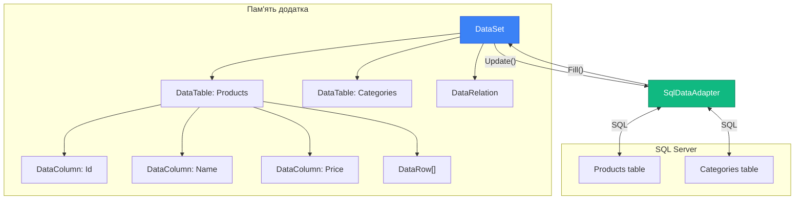
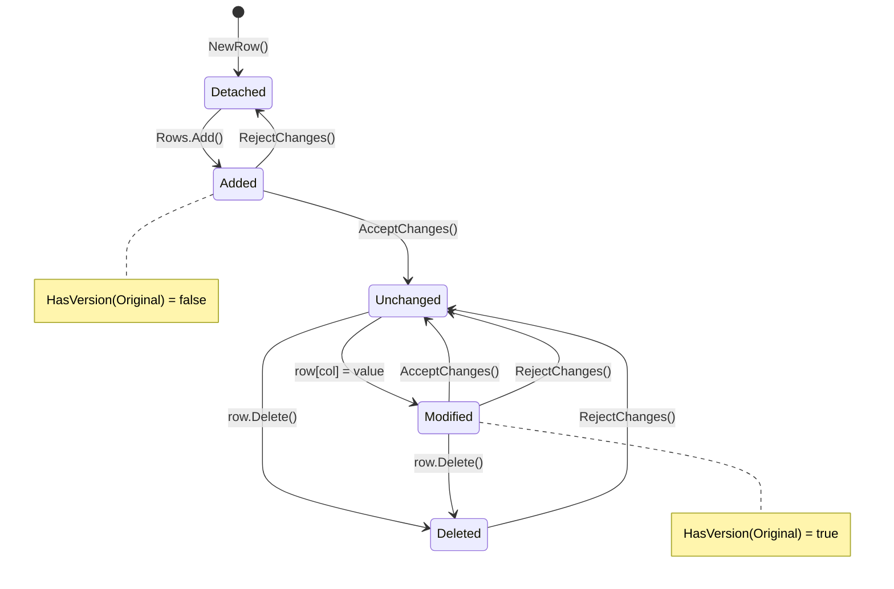

# 9.9. Від'єднаний режим: DataSet, DataTable, DataRow

## Вступ: Два режими роботи ADO.NET

У першій статті ми згадували, що ADO.NET має два режими роботи: **з'єднаний** (connected) та **від'єднаний** (disconnected). Усі попередні статті були присвячені з'єднаному режиму — `SqlConnection` → `SqlCommand` → `SqlDataReader`. DataReader працює, поки з'єднання відкрите, і після закриття дані недоступні.

**Від'єднаний режим** пропонує інший підхід: ви завантажуєте дані з бази в **об'єкт у пам'яті** (`DataSet` / `DataTable`), закриваєте з'єднання і працюєте з даними **офлайн** — переглядаєте, фільтруєте, сортуєте, змінюєте. Потім, коли готові, відкриваєте з'єднання знову і синхронізуєте зміни назад у базу.

**Аналогія**: З'єднаний режим (DataReader) — це як переглядати відео **онлайн** (streaming). Від'єднаний режим (DataSet) — це як **завантажити** відео на телефон і дивитися офлайн. Ви можете перемотувати, зупиняти, повертатися — все це без інтернету.

::card-group

::card{title="📡 Connected Mode" icon="i-heroicons-signal"}
DataReader: forward-only, read-only. З'єднання відкрите увесь час. Мінімум пам'яті. Для читання великих потоків.

::

::card{title="📦 Disconnected Mode" icon="i-heroicons-archive-box"}
DataSet/DataTable: random access, read/write. З'єднання закрите більшу частину часу. Дані в пам'яті. Для CRUD-операцій, офлайн-роботи.

::

::

::note
**Передумови**: Статті [9.1. Введення](/1.csharp/09.ado-net/01.introduction-to-adonet) (архітектура), [9.4. DataReader](/1.csharp/09.ado-net/04.datareader) (для порівняння), [9.5. Параметри](/1.csharp/09.ado-net/05.parameters-and-sql-injection).

::

---

## Архітектура від'єднаного режиму

::mermaid



::

Ключові об'єкти:

- **DataSet** — контейнер для кількох DataTable. Аналог «міні-бази даних» у пам'яті.
- **DataTable** — одна таблиця з рядками (DataRow) та стовпцями (DataColumn).
- **DataRow** — один рядок даних у DataTable.
- **DataColumn** — визначення стовпця (ім'я, тип, обмеження).
- **DataRelation** — зв'язок між DataTable (аналог FK у базі даних).
- **DataAdapter** — «міст» між DataSet і базою даних (Fill + Update).

---

## DataTable: Таблиця в пам'яті

`DataTable` — це центральний об'єкт від'єднаного режиму. Він представляє **одну таблицю** з рядками та стовпцями, подібно до таблиці в базі даних.

### Створення DataTable програмно

```csharp showLineNumbers
using System;
using System.Data;

// Створюємо DataTable
DataTable productsTable = new DataTable("Products");

// Додаємо стовпці (DataColumn)
DataColumn idColumn = new DataColumn("Id", typeof(int))
{
    AutoIncrement = true,       // AUTO_INCREMENT
    AutoIncrementSeed = 1,      // Початкове значення
    AutoIncrementStep = 1,      // Крок
    AllowDBNull = false,
    Unique = true
};
productsTable.Columns.Add(idColumn);

productsTable.Columns.Add(new DataColumn("Name", typeof(string))
{
    MaxLength = 100,
    AllowDBNull = false
});

productsTable.Columns.Add(new DataColumn("Price", typeof(decimal))
{
    AllowDBNull = false,
    DefaultValue = 0m
});

productsTable.Columns.Add(new DataColumn("Quantity", typeof(int))
{
    AllowDBNull = false,
    DefaultValue = 0
});

productsTable.Columns.Add(new DataColumn("Description", typeof(string))
{
    MaxLength = 500,
    AllowDBNull = true    // nullable
});

// Встановлюємо первинний ключ
productsTable.PrimaryKey = new[] { idColumn };

Console.WriteLine($"Таблиця: {productsTable.TableName}");
Console.WriteLine($"Стовпців: {productsTable.Columns.Count}");
Console.WriteLine($"Рядків: {productsTable.Rows.Count}");
```

**Розбір коду:**

- **Рядок 5**: Конструктор `DataTable("Products")` — ім'я таблиці (аналог `CREATE TABLE Products`).
- **Рядки 8-15**: `DataColumn` з властивостями `AutoIncrement`, `AllowDBNull`, `Unique` — це аналоги SQL-обмежень `IDENTITY`, `NOT NULL`, `UNIQUE`.
- **Рядок 43**: `PrimaryKey` — масив DataColumn, що складають первинний ключ.

### Додавання та читання даних

```csharp showLineNumbers
// Спосіб 1: NewRow() + Add()
DataRow row1 = productsTable.NewRow();
row1["Name"] = "Ноутбук ASUS";
row1["Price"] = 32999.99m;
row1["Quantity"] = 15;
row1["Description"] = "15.6\", i7, 16GB RAM";
productsTable.Rows.Add(row1);

// Спосіб 2: Add() з масивом значень
// null для AutoIncrement стовпця — значення згенерується автоматично
productsTable.Rows.Add(null, "Мишка Logitech", 1299.99m, 50, null);
productsTable.Rows.Add(null, "Монітор LG", 12500m, 8, "27\", 4K IPS");

// Читання даних
Console.WriteLine("\n=== Усі товари ===");
foreach (DataRow row in productsTable.Rows)
{
    int id = (int)row["Id"];  // Приведення типу обов'язкове!
    string name = (string)row["Name"];
    decimal price = (decimal)row["Price"];
    int qty = (int)row["Quantity"];

    // Перевірка NULL
    string description = row["Description"] == DBNull.Value
        ? "(без опису)"
        : (string)row["Description"];

    Console.WriteLine($"  [{id}] {name}: {price:C} x{qty} — {description}");
}
```

### Пошук за первинним ключем

```csharp showLineNumbers
// Find() шукає за PrimaryKey — O(1) завдяки внутрішньому індексу
DataRow? found = productsTable.Rows.Find(2); // Id = 2
if (found != null)
{
    Console.WriteLine($"Знайдено: {found["Name"]}");
}
else
{
    Console.WriteLine("Товар не знайдено.");
}
```

### Фільтрація та сортування: Select()

```csharp showLineNumbers
// Select() з фільтром та сортуванням
DataRow[] expensive = productsTable.Select(
    "Price > 5000",        // фільтр (синтаксис Expression)
    "Price DESC"           // сортування
);

Console.WriteLine($"\nТовари дорожче 5000 ₴ ({expensive.Length}):");
foreach (DataRow row in expensive)
{
    Console.WriteLine($"  {row["Name"]}: {row["Price"]:C}");
}

// Складніші фільтри
DataRow[] filtered = productsTable.Select(
    "Name LIKE 'Ноутбук*' AND Quantity > 10");

// Обчислювані вирази
object totalValue = productsTable.Compute("SUM(Price * Quantity)", "");
Console.WriteLine($"\nЗагальна вартість складу: {totalValue:C}");

object avgPrice = productsTable.Compute("AVG(Price)", "Price > 1000");
Console.WriteLine($"Середня ціна (> 1000 ₴): {avgPrice:C}");
```

---

## Зміна даних та RowState

Кожен `DataRow` має властивість `RowState`, яка відстежує **стан** рядка:

::field-group

::field{name="Detached" type="DataRowState"}
Рядок створено через `NewRow()`, але ще **не додано** до таблиці.

::

::field{name="Added" type="DataRowState"}
Рядок **додано** до таблиці, але ще не збережено в базу (немає оригінального значення).

::

::field{name="Unchanged" type="DataRowState"}
Рядок **не змінювався** після завантаження з бази або після `AcceptChanges()`.

::

::field{name="Modified" type="DataRowState"}
рядок **змінено** — є і оригінальне, і поточне значення.

::

::field{name="Deleted" type="DataRowState"}
Рядок **позначено для видалення**, але ще фізично присутній у колекції.

::

::

```csharp showLineNumbers
// Демонстрація RowState
DataRow newRow = productsTable.NewRow();
Console.WriteLine($"Після NewRow(): {newRow.RowState}");        // Detached

productsTable.Rows.Add(newRow);
Console.WriteLine($"Після Add(): {newRow.RowState}");           // Added

productsTable.AcceptChanges(); // "Прийняти" зміни — скинути стан
Console.WriteLine($"Після AcceptChanges(): {newRow.RowState}"); // Unchanged

newRow["Name"] = "Нова назва";
Console.WriteLine($"Після зміни: {newRow.RowState}");           // Modified

// Перегляд оригінального та поточного значення
Console.WriteLine($"  Original: {newRow["Name", DataRowVersion.Original]}");
Console.WriteLine($"  Current: {newRow["Name", DataRowVersion.Current]}");

newRow.Delete();
Console.WriteLine($"Після Delete(): {newRow.RowState}");        // Deleted

// RejectChanges() — скасувати всі зміни, повернутися до Original
// productsTable.RejectChanges();
```

::mermaid



::

**Чому це важливо?** DataAdapter (наступна стаття) використовує `RowState` для визначення, які SQL-команди виконати: `Added` → INSERT, `Modified` → UPDATE, `Deleted` → DELETE, `Unchanged` → пропустити.

---

## DataSet: Кілька таблиць та зв'язки

`DataSet` — це контейнер для кількох `DataTable` з підтримкою **зв'язків** (DataRelation) між ними:

```csharp showLineNumbers
using System;
using System.Data;

// Створюємо DataSet — "міні-базу даних"
DataSet shopDb = new DataSet("ShopDB");

// Таблиця Categories
DataTable categories = new DataTable("Categories");
categories.Columns.Add("Id", typeof(int));
categories.Columns.Add("Name", typeof(string));
categories.PrimaryKey = new[] { categories.Columns["Id"]! };

// Таблиця Products
DataTable products = new DataTable("Products");
products.Columns.Add("Id", typeof(int));
products.Columns.Add("Name", typeof(string));
products.Columns.Add("Price", typeof(decimal));
products.Columns.Add("CategoryId", typeof(int)); // FK
products.PrimaryKey = new[] { products.Columns["Id"]! };

// Додаємо таблиці до DataSet
shopDb.Tables.Add(categories);
shopDb.Tables.Add(products);

// Створюємо зв'язок (DataRelation) — аналог FOREIGN KEY
DataRelation relation = new DataRelation(
    "FK_Products_Categories",                // Ім'я зв'язку
    categories.Columns["Id"]!,               // Parent column (PK)
    products.Columns["CategoryId"]!,         // Child column (FK)
    createConstraints: true                   // Автоматично створити ForeignKeyConstraint
);
shopDb.Relations.Add(relation);

// Заповнюємо даними
categories.Rows.Add(1, "Ноутбуки");
categories.Rows.Add(2, "Периферія");
categories.Rows.Add(3, "Монітори");

products.Rows.Add(1, "ASUS ZenBook", 32000m, 1);
products.Rows.Add(2, "Dell XPS", 45000m, 1);
products.Rows.Add(3, "Мишка Logitech", 1300m, 2);
products.Rows.Add(4, "LG 27\" 4K", 15000m, 3);

// AcceptChanges — скинути RowState всіх рядків на Unchanged
shopDb.AcceptChanges();

// Навігація по зв'язку: Category → Products
Console.WriteLine("=== Категорії та їхні товари ===");
foreach (DataRow catRow in categories.Rows)
{
    Console.WriteLine($"\n📁 {catRow["Name"]}:");

    // GetChildRows() повертає дочірні рядки за зв'язком
    DataRow[] childProducts = catRow.GetChildRows("FK_Products_Categories");
    foreach (DataRow prodRow in childProducts)
    {
        Console.WriteLine($"  📦 {prodRow["Name"]}: {prodRow["Price"]:C}");
    }
}

// Навігація у зворотному напрямку: Product → Category
DataRow laptop = products.Rows.Find(1)!;
DataRow parentCategory = laptop.GetParentRow("FK_Products_Categories")!;
Console.WriteLine($"\n{laptop["Name"]} належить до категорії: {parentCategory["Name"]}");
```

**Розбір коду:**

- **Рядки 26-32**: `DataRelation` — зв'язок між `Categories.Id` (батьківський) та `Products.CategoryId` (дочірній). `createConstraints: true` додає `ForeignKeyConstraint`, яке не дозволить додати продукт з неіснуючою категорією.
- **Рядок 53**: `catRow.GetChildRows("FK_Products_Categories")` — повертає всі продукти цієї категорії. Це аналог `JOIN` у SQL, але виконується **в пам'яті**.
- **Рядок 60**: `GetParentRow()` — зворотна навігація: від продукту до його категорії.

---

## Обмеження (Constraints)

DataTable підтримує два типи обмежень:

```csharp showLineNumbers
using System.Data;

DataTable employees = new DataTable("Employees");
employees.Columns.Add("Id", typeof(int));
employees.Columns.Add("Email", typeof(string));
employees.Columns.Add("DepartmentId", typeof(int));

// UniqueConstraint — аналог UNIQUE у SQL
employees.Constraints.Add(
    new UniqueConstraint("UQ_Email", employees.Columns["Email"]!));

// PrimaryKey неявно створює UniqueConstraint

// ForeignKeyConstraint — створюється автоматично через DataRelation
// Але можна створити вручну:
DataTable departments = new DataTable("Departments");
departments.Columns.Add("Id", typeof(int));
departments.PrimaryKey = new[] { departments.Columns["Id"]! };

ForeignKeyConstraint fk = new ForeignKeyConstraint(
    "FK_Employees_Departments",
    departments.Columns["Id"]!,         // parent
    employees.Columns["DepartmentId"]!  // child
);

// Правила каскадного видалення/оновлення
fk.DeleteRule = Rule.Cascade;        // Видалити department → видалити employees
fk.UpdateRule = Rule.Cascade;        // Змінити department.Id → оновити employees.DeptId
fk.AcceptRejectRule = AcceptRejectRule.Cascade;

employees.Constraints.Add(fk);
```

---

## Серіалізація: XML та JSON

### XML-серіалізація (вбудована)

DataSet має вбудовану підтримку XML:

```csharp showLineNumbers
// Запис у XML
shopDb.WriteXml("shop_data.xml", XmlWriteMode.WriteSchema);
Console.WriteLine("✅ Дані збережено у shop_data.xml");

// Читання з XML
DataSet loaded = new DataSet();
loaded.ReadXml("shop_data.xml", XmlReadMode.ReadSchema);
Console.WriteLine($"Завантажено таблиць: {loaded.Tables.Count}");

foreach (DataTable table in loaded.Tables)
{
    Console.WriteLine($"  {table.TableName}: {table.Rows.Count} рядків");
}
```

### Конвертація DataTable → JSON (через System.Text.Json)

```csharp showLineNumbers
using System.Text.Json;

static string DataTableToJson(DataTable table)
{
    var rows = new List<Dictionary<string, object?>>();

    foreach (DataRow row in table.Rows)
    {
        var dict = new Dictionary<string, object?>();
        foreach (DataColumn col in table.Columns)
        {
            dict[col.ColumnName] = row[col] == DBNull.Value ? null : row[col];
        }
        rows.Add(dict);
    }

    return JsonSerializer.Serialize(rows, new JsonSerializerOptions
    {
        WriteIndented = true,
        Encoder = System.Text.Encodings.Web.JavaScriptEncoder.UnsafeRelaxedJsonEscaping
    });
}

string json = DataTableToJson(products);
Console.WriteLine(json);
```

---

## Завантаження DataTable з бази даних

До цього моменту ми заповнювали DataTable вручну. У реальних додатках дані завантажуються з бази через `SqlDataReader`:

```csharp showLineNumbers
using System;
using System.Data;
using Microsoft.Data.SqlClient;

string connectionString = "Server=localhost;Database=ShopDb;Trusted_Connection=True;TrustServerCertificate=True;";

DataTable LoadProducts()
{
    DataTable table = new DataTable("Products");

    using SqlConnection connection = new SqlConnection(connectionString);
    connection.Open();

    using SqlCommand command = new SqlCommand(
        "SELECT Id, Name, Price, Quantity, Description FROM Products ORDER BY Name",
        connection);
    using SqlDataReader reader = command.ExecuteReader();

    // Load() заповнює DataTable з DataReader
    table.Load(reader);

    return table;
}

DataTable products = LoadProducts();
Console.WriteLine($"Завантажено {products.Rows.Count} товарів:");

foreach (DataRow row in products.Rows)
{
    Console.WriteLine($"  [{row["Id"]}] {row["Name"]}: {row["Price"]:C}");
}

// Фільтрація та сортування в пам'яті — без SQL!
DataRow[] cheap = products.Select("Price < 5000", "Name ASC");
Console.WriteLine($"\nДешеві товари ({cheap.Length}):");
foreach (DataRow row in cheap)
{
    Console.WriteLine($"  {row["Name"]}: {row["Price"]:C}");
}
```

**Розбір коду:**

- **Рядок 20**: `table.Load(reader)` — **ключовий метод**. Він автоматично:
  - Створює `DataColumn` для кожного стовпця в результатах (з правильними типами).
  - Завантажує всі рядки з DataReader у DataTable.
  - Закриває DataReader після завантаження.
- Після `Load()` з'єднання можна закрити — дані вже в пам'яті.

---

## DataView: Віртуальне подання даних

`DataView` — це «лінза» для DataTable, що дозволяє фільтрувати та сортувати дані **без зміни** оригінальної таблиці:

```csharp showLineNumbers
using System.Data;

// Створюємо DataView для таблиці Products
DataView view = new DataView(products);

// Фільтр і сортування
view.RowFilter = "Price > 1000 AND Quantity > 0";
view.Sort = "Price DESC";

Console.WriteLine($"Відфільтровано {view.Count} рядків з {products.Rows.Count}:");
foreach (DataRowView rowView in view)
{
    Console.WriteLine($"  {rowView["Name"]}: {rowView["Price"]:C}");
}

// Пошук у DataView (якщо Sort встановлено)
int idx = view.Find(15000m); // Шукає значення Price = 15000 у відсортованому view
if (idx >= 0)
{
    Console.WriteLine($"\nЗнайдено: {view[idx]["Name"]}");
}

// DataView підтримує прив'язку до UI (DataBinding)
// dataGridView.DataSource = view; // WinForms
// productsListView.ItemsSource = view; // WPF
```

---

## Обчислювані стовпці (Expression Columns)

DataColumn може містити **вираз**, який обчислюється автоматично:

```csharp showLineNumbers
// Вартість = Price * Quantity (обчислюється автоматично)
DataColumn totalColumn = new DataColumn("TotalValue", typeof(decimal))
{
    Expression = "Price * Quantity"
};
products.Columns.Add(totalColumn);

// Знижка (умовна)
DataColumn discountColumn = new DataColumn("DiscountedPrice", typeof(decimal))
{
    Expression = "IIF(Price > 10000, Price * 0.9, Price)"
};
products.Columns.Add(discountColumn);

// Відображення
foreach (DataRow row in products.Rows)
{
    Console.WriteLine($"  {row["Name"]}: {row["Price"]:C} → {row["DiscountedPrice"]:C} (всього: {row["TotalValue"]:C})");
}
```

---

## Коли використовувати DataSet / DataTable?

::tabs

::tabs-item{label="✅ Коли підходить"}

- **Desktop-додатки** (WinForms, WPF) з DataBinding
- **Робота з XML** — DataSet має вбудовану серіалізацію
- **Офлайн-сценарії** — завантажити дані, працювати без з'єднання
- **Множинні пов'язані таблиці** з DataRelation
- **Динамічні дані** — структура таблиці невідома заздалегідь
- **Legacy-код** — велика кількість існуючого .NET Framework коду

::

::tabs-item{label="❌ Коли НЕ підходить"}

- **Веб-додатки** (ASP.NET Core) — занадто «важкий» для stateless HTTP
- **Великі набори даних** — мільйони рядків не влізуть у пам'ять
- **Строго типізований код** — DataRow повертає `object`, потрібне приведення типу
- **Мікросервіси** — DataSet не серіалізується ефективно
- **Сучасний .NET** — ORM (Entity Framework, Dapper) значно зручніші

::

::

---

## Практичні завдання

### Рівень 1: Базовий

::steps

### Завдання 1.1: DataTable In-Memory

Створіть DataTable `Students` (Id, FirstName, LastName, BirthDate, GPA) програмно. Додайте 5 студентів. Реалізуйте: пошук за Id, фільтрацію за GPA > 3.5, обчислення середнього GPA через `Compute()`.

### Завдання 1.2: Завантаження з бази

Завантажте таблицю Products з бази в DataTable через `DataReader` + `Load()`. Використайте `DataView` для відображення: (1) усіх товарів за ціною DESC, (2) товарів з ціною > 1000, (3) пошук за ім'ям.

::

### Рівень 2: Логіка та обробка даних

::steps

### Завдання 2.1: DataSet зі зв'язками

Створіть DataSet з трьома таблицями: `Departments`, `Employees`, `Projects`. Налаштуйте DataRelation між ними. Реалізуйте навігацію: «Всі працівники відділу X», «Відділ працівника Y», «Проєкти відділу Z».

### Завдання 2.2: XML Import/Export

Завантажте дані з бази в DataSet, збережіть у XML (`WriteXml`). Модифікуйте XML-файл вручну (додайте рядок). Завантажте назад через `ReadXml`. Виведіть різницю між оригіналом і завантаженими даними.

::

### Рівень 3: Архітектура

::steps

### Завдання 3.1: Change Tracker

Реалізуйте систему відстеження змін на базі RowState:
1. Завантажте DataTable з бази.
2. Зробіть кілька Insert/Update/Delete.
3. Метод `GetChanges()` повертає нову DataTable лише зі зміненими рядками.
4. Виведіть звіт: «3 додано, 2 змінено, 1 видалено».

### Завдання 3.2: In-Memory Query Engine

Створіть клас `QueryEngine`, що працює з DataTable:
1. Fluent API: `engine.From("Products").Where("Price > 1000").OrderBy("Name").Top(10).Execute()`
2. Підтримка `Select()` та `Compute()` під капотом.
3. Повернення результату як `IEnumerable<DataRow>` або нового `DataTable`.

::

---

## Резюме

::card-group

::card{title="DataTable" icon="i-heroicons-table-cells"}
Таблиця в пам'яті: DataColumn (схема), DataRow (дані), Constraints (обмеження). Підтримує фільтрацію Select(), обчислення Compute(), DataView.

::

::card{title="DataSet" icon="i-heroicons-circle-stack"}
Контейнер для кількох DataTable з DataRelation між ними. «Міні-база даних» у пам'яті з підтримкою XML-серіалізації.

::

::card{title="RowState" icon="i-heroicons-arrow-path"}
Кожен DataRow відстежує свій стан: Added, Modified, Deleted, Unchanged. DataAdapter використовує RowState для генерації INSERT/UPDATE/DELETE.

::

::card{title="DataView" icon="i-heroicons-funnel"}
Фільтрування та сортування DataTable без зміни оригінальних даних. Ідеальний для DataBinding в UI-додатках.

::

::

### Ключові поняття

- **DataTable** — таблиця в пам'яті зі схемою та даними
- **DataColumn** — визначення стовпця (тип, обмеження, AutoIncrement)
- **DataRow** — один рядок даних, зберігає RowState та версії значень
- **DataSet** — контейнер DataTable + DataRelation
- **RowState** — стан рядка (Added, Modified, Deleted, Unchanged, Detached)
- **DataView** — фільтрований/відсортований «вигляд» DataTable
- **Expression Column** — стовпець з обчислюваним значенням

::tip
**Наступний крок**: У наступній, фінальній, статті ми розглянемо **DataAdapter** — «міст» між від'єднаним DataSet та базою даних. Дізнаємось про `Fill()`, `Update()`, автоматичне генерування INSERT/UPDATE/DELETE команд через `SqlCommandBuilder`, та batch-оновлення.

::
