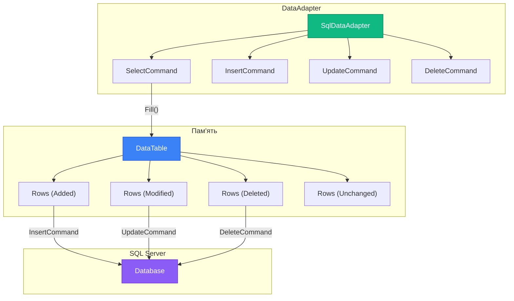

# 9.10. DataAdapter — міст між DataSet та базою даних

## Вступ: Як синхронізувати DataSet з базою?

У попередній статті ми навчилися працювати з `DataTable` та `DataSet` — завантажувати дані в пам'ять, фільтрувати, сортувати, змінювати. Але залишилось критичне питання: як **зберегти** зміни назад у базу даних?

Ми знаємо, що `DataRow` зберігає свій `RowState`: `Added` (нові рядки), `Modified` (змінені), `Deleted` (видалені). Але DataTable сама по собі не знає, як спілкуватися з SQL Server. Їй потрібен **посередник** — `DataAdapter`.

**DataAdapter** — це «міст» між від'єднаним `DataSet`/`DataTable` та базою даних. Він виконує дві основні операції:
- **Fill()** — завантажує дані з бази в DataTable (виконує SELECT).
- **Update()** — синхронізує зміни з DataTable назад у базу (виконує INSERT, UPDATE, DELETE на основі RowState).

**Аналогія**: DataAdapter — це як **кур'єрська служба** між вашим офісом (DataTable) та складом (база даних). `Fill()` — кур'єр привозить товари зі складу у ваш офіс. `Update()` — кур'єр забирає замовлення з офісу та доставляє їх на склад. Кур'єр не зберігає товари — він лише **транспортує**.

::note
**Передумови**: Стаття [9.9. DataSet та DataTable](/1.csharp/09.ado-net/09.disconnected-mode-dataset) (RowState, DataRelation). Статті [9.3. DbCommand](/1.csharp/09.ado-net/03.command-and-queries) та [9.5. Параметри](/1.csharp/09.ado-net/05.parameters-and-sql-injection).
::

---

## Архітектура DataAdapter

::mermaid



::

DataAdapter містить **чотири команди**:

::field-group

::field{name="SelectCommand" type="SqlCommand"}
SQL-запит для **завантаження** даних (`Fill()`). Зазвичай `SELECT * FROM Table`.
::

::field{name="InsertCommand" type="SqlCommand"}
SQL-запит для **вставки** нових рядків (RowState = `Added`). Зазвичай `INSERT INTO Table (...) VALUES (...)`.
::

::field{name="UpdateCommand" type="SqlCommand"}
SQL-запит для **оновлення** змінених рядків (RowState = `Modified`). Зазвичай `UPDATE Table SET ... WHERE Id = @Id`.
::

::field{name="DeleteCommand" type="SqlCommand"}
SQL-запит для **видалення** рядків (RowState = `Deleted`). Зазвичай `DELETE FROM Table WHERE Id = @Id`.
::

::

---

## Fill(): Завантаження даних

`Fill()` виконує `SelectCommand` і заповнює DataTable результатами:

```csharp showLineNumbers
using System;
using System.Data;
using Microsoft.Data.SqlClient;

string connectionString = "Server=localhost;Database=ShopDb;Trusted_Connection=True;TrustServerCertificate=True;";

// Створюємо DataAdapter з SELECT-запитом
SqlDataAdapter adapter = new SqlDataAdapter(
    "SELECT Id, Name, Price, Quantity FROM Products ORDER BY Name",
    connectionString);

// Створюємо DataTable та заповнюємо
DataTable products = new DataTable("Products");
int rowsLoaded = adapter.Fill(products);

Console.WriteLine($"Завантажено {rowsLoaded} рядків.");
Console.WriteLine($"Стовпців: {products.Columns.Count}");

foreach (DataRow row in products.Rows)
{
    Console.WriteLine($"  [{row["Id"]}] {row["Name"]}: {row["Price"]:C} — RowState: {row.RowState}");
}
```

**Розбір коду:**

- **Рядки 8-10**: Конструктор `SqlDataAdapter(sql, connectionString)` — зручна перевантажка, яка автоматично створює `SelectCommand` та `SqlConnection`.
- **Рядок 14**: `adapter.Fill(products)` — виконує SELECT, створює стовпці в DataTable (якщо їх немає), завантажує рядки. Повертає кількість завантажених рядків.
- **Рядок 22**: Після `Fill()` всі рядки мають `RowState = Unchanged` — DataAdapter автоматично викликає `AcceptChanges()`.

### Fill DataSet з кількома таблицями

```csharp showLineNumbers
DataSet shopDb = new DataSet("ShopDB");

// Адаптер для Products
SqlDataAdapter productAdapter = new SqlDataAdapter(
    "SELECT * FROM Products", connectionString);
productAdapter.Fill(shopDb, "Products"); // Ім'я таблиці в DataSet

// Адаптер для Categories
SqlDataAdapter categoryAdapter = new SqlDataAdapter(
    "SELECT * FROM Categories", connectionString);
categoryAdapter.Fill(shopDb, "Categories");

Console.WriteLine($"Таблиць у DataSet: {shopDb.Tables.Count}");
foreach (DataTable table in shopDb.Tables)
{
    Console.WriteLine($"  {table.TableName}: {table.Rows.Count} рядків");
}
```

---

## Update(): Збереження змін

`Update()` — найцікавіший метод DataAdapter. Він проходить по всіх рядках DataTable і виконує відповідну SQL-команду на основі `RowState`:

| RowState | Команда DataAdapter |
|:---|:---|
| `Added` | `InsertCommand` |
| `Modified` | `UpdateCommand` |
| `Deleted` | `DeleteCommand` |
| `Unchanged` | Пропускається |

### Ручне налаштування команд

```csharp showLineNumbers
using System;
using System.Data;
using Microsoft.Data.SqlClient;

string connectionString = "Server=localhost;Database=ShopDb;Trusted_Connection=True;TrustServerCertificate=True;";
SqlConnection connection = new SqlConnection(connectionString);

// Адаптер з SELECT
SqlDataAdapter adapter = new SqlDataAdapter(
    "SELECT Id, Name, Price, Quantity FROM Products ORDER BY Name",
    connection);

// INSERT-команда
adapter.InsertCommand = new SqlCommand(@"
    INSERT INTO Products (Name, Price, Quantity)
    VALUES (@Name, @Price, @Quantity);
    SET @Id = SCOPE_IDENTITY();",
    connection);
adapter.InsertCommand.Parameters.Add("@Name", SqlDbType.NVarChar, 100, "Name");
adapter.InsertCommand.Parameters.Add("@Price", SqlDbType.Decimal, 0, "Price");
adapter.InsertCommand.Parameters.Add("@Quantity", SqlDbType.Int, 0, "Quantity");
// OUTPUT-параметр для отримання нового Id
SqlParameter idOutParam = adapter.InsertCommand.Parameters.Add("@Id", SqlDbType.Int);
idOutParam.Direction = ParameterDirection.Output;
idOutParam.SourceColumn = "Id";

// UPDATE-команда
adapter.UpdateCommand = new SqlCommand(@"
    UPDATE Products
    SET Name = @Name, Price = @Price, Quantity = @Quantity
    WHERE Id = @Id",
    connection);
adapter.UpdateCommand.Parameters.Add("@Name", SqlDbType.NVarChar, 100, "Name");
adapter.UpdateCommand.Parameters.Add("@Price", SqlDbType.Decimal, 0, "Price");
adapter.UpdateCommand.Parameters.Add("@Quantity", SqlDbType.Int, 0, "Quantity");
adapter.UpdateCommand.Parameters.Add("@Id", SqlDbType.Int, 0, "Id");

// DELETE-команда
adapter.DeleteCommand = new SqlCommand(
    "DELETE FROM Products WHERE Id = @Id",
    connection);
adapter.DeleteCommand.Parameters.Add("@Id", SqlDbType.Int, 0, "Id");

// Завантажуємо дані
DataTable products = new DataTable("Products");
adapter.Fill(products);

Console.WriteLine($"Завантажено {products.Rows.Count} товарів.");

// Вносимо зміни в пам'яті
DataRow newRow = products.NewRow();
newRow["Name"] = "Клавіатура механічна";
newRow["Price"] = 2500m;
newRow["Quantity"] = 25;
products.Rows.Add(newRow);

// Змінюємо існуючий рядок
DataRow? existingRow = products.Rows.Find(1); // Потребує PrimaryKey
if (existingRow != null)
{
    existingRow["Price"] = Convert.ToDecimal(existingRow["Price"]) * 1.1m; // +10%
}

// Видаляємо рядок
if (products.Rows.Count > 3)
{
    products.Rows[products.Rows.Count - 1].Delete();
}

// Синхронізуємо з базою — один виклик!
int affectedRows = adapter.Update(products);
Console.WriteLine($"\n✅ Синхронізовано {affectedRows} рядків з базою.");
```

**Розбір коду:**

- **Рядки 19, 33, 35**: Четвертий параметр `Add()` — це `SourceColumn`. Він вказує, з якого стовпця DataTable брати значення для параметра. Наприклад, `"Name"` означає: для кожного рядка значення `@Name` береться з `row["Name"]`.
- **Рядки 22-25**: OUTPUT-параметр `@Id` з `SourceColumn = "Id"` — після INSERT нове значення Id записується назад у DataRow.
- **Рядок 67**: `adapter.Update(products)` — DataAdapter ітерує по рядках:
  - `newRow` (Added) → виконує InsertCommand
  - `existingRow` (Modified) → виконує UpdateCommand
  - видалений рядок (Deleted) → виконує DeleteCommand
  - Після успішного Update автоматично викликає `AcceptChanges()`.

---

## SqlCommandBuilder: Автоматична генерація команд

Ручне створення InsertCommand/UpdateCommand/DeleteCommand — це багато коду. `SqlCommandBuilder` може **автоматично** згенерувати ці команди на основі SelectCommand:

```csharp showLineNumbers
using System;
using System.Data;
using Microsoft.Data.SqlClient;

string connectionString = "Server=localhost;Database=ShopDb;Trusted_Connection=True;TrustServerCertificate=True;";

// Адаптер з SELECT
SqlDataAdapter adapter = new SqlDataAdapter(
    "SELECT Id, Name, Price, Quantity FROM Products",
    connectionString);

// CommandBuilder автоматично генерує INSERT, UPDATE, DELETE!
SqlCommandBuilder builder = new SqlCommandBuilder(adapter);

// Перегляд згенерованих команд
Console.WriteLine("INSERT: " + builder.GetInsertCommand().CommandText);
Console.WriteLine("UPDATE: " + builder.GetUpdateCommand().CommandText);
Console.WriteLine("DELETE: " + builder.GetDeleteCommand().CommandText);

// Завантажуємо дані
DataTable products = new DataTable("Products");
adapter.Fill(products);

// Встановлюємо PrimaryKey (для Find())
products.PrimaryKey = new[] { products.Columns["Id"]! };

// Додаємо новий товар
DataRow newRow = products.NewRow();
newRow["Name"] = "Веб-камера HD";
newRow["Price"] = 1500m;
newRow["Quantity"] = 30;
products.Rows.Add(newRow);

// Оновлюємо існуючий
DataRow? row = products.Rows.Find(1);
if (row != null) row["Price"] = 99999m;

// Синхронізуємо — CommandBuilder забезпечує все автоматично!
int affected = adapter.Update(products);
Console.WriteLine($"\n✅ Оновлено {affected} рядків.");
```

**Розбір коду:**

- **Рядок 13**: `SqlCommandBuilder(adapter)` — аналізує `SelectCommand` і генерує INSERT/UPDATE/DELETE. Вимоги:
  - SELECT повинен включати **первинний ключ** (або UNIQUE стовпець).
  - SELECT повинен бути з **однієї таблиці** (без JOIN).
- **Рядки 16-18**: Перегляд згенерованих команд — корисно для розуміння та дебагу.

### Обмеження CommandBuilder

::warning
`SqlCommandBuilder` має обмеження:
1. **Одна таблиця** — SELECT не може містити JOIN.
2. **Потрібен PK/UNIQUE** — CommandBuilder повинен знати, як ідентифікувати рядки.
3. **Оптимістичне блокування** — UPDATE перевіряє ВСІ стовпці у WHERE, що може бути повільно.
4. **Немає кастомної логіки** — не можна додати аудит-записи, тригери на стороні C#.
5. **Для складних сценаріїв** — краще писати команди вручну або використовувати ORM.
::

---

## Table Mapping: Перейменування стовпців

DataAdapter може перейменувати стовпці при завантаженні з бази в DataTable:

```csharp showLineNumbers
SqlDataAdapter adapter = new SqlDataAdapter(
    "SELECT ProductID, ProductName, UnitPrice FROM Products",
    connectionString);

// Маппінг: стовпці SQL → стовпці DataTable
adapter.TableMappings.Add("Table", "Products");
adapter.TableMappings[0].ColumnMappings.Add("ProductID", "Id");
adapter.TableMappings[0].ColumnMappings.Add("ProductName", "Name");
adapter.TableMappings[0].ColumnMappings.Add("UnitPrice", "Price");

DataTable products = new DataTable("Products");
adapter.Fill(products);

// У DataTable стовпці мають «чисті» імена
foreach (DataColumn col in products.Columns)
{
    Console.WriteLine($"  {col.ColumnName} ({col.DataType.Name})");
    // Id (Int32), Name (String), Price (Decimal)
}
```

---

## Обробка конфліктів

Коли два користувачі одночасно змінюють один рядок, виникає конфлікт. DataAdapter обробляє це через подію `RowUpdated`:

```csharp showLineNumbers
using System;
using System.Data;
using Microsoft.Data.SqlClient;

string connectionString = "Server=localhost;Database=ShopDb;Trusted_Connection=True;TrustServerCertificate=True;";

SqlDataAdapter adapter = new SqlDataAdapter(
    "SELECT Id, Name, Price FROM Products", connectionString);
SqlCommandBuilder builder = new SqlCommandBuilder(adapter);

// Обробка помилок під час Update
adapter.RowUpdated += (sender, e) =>
{
    if (e.Status == UpdateStatus.ErrorsOccurred)
    {
        Console.WriteLine($"❌ Помилка при оновленні рядка: {e.Errors?.Message}");
        Console.WriteLine($"   Рядок: {e.Row["Name"]}");

        // Варіанти обробки:
        e.Status = UpdateStatus.SkipCurrentRow;   // Пропустити цей рядок
        // e.Status = UpdateStatus.Continue;       // Продовжити решту
        // e.Status = UpdateStatus.SkipAllRemainingRows; // Зупинити все
    }
    else if (e.RecordsAffected == 0 && e.StatementType == StatementType.Update)
    {
        // Жоден рядок не оновлено — конфлікт (рядок змінився/видалився)
        Console.WriteLine($"⚠️ Конфлікт оновлення для: {e.Row["Name"]}");
        e.Status = UpdateStatus.SkipCurrentRow;
    }
};

// Завантажуємо та модифікуємо
DataTable products = new DataTable();
adapter.Fill(products);

// Симулюємо конфлікт — змінюємо рядок, який хтось інший вже змінив
if (products.Rows.Count > 0)
{
    products.Rows[0]["Price"] = 999999m;
    adapter.Update(products);
}
```

---

## Повний приклад: CRUD через DataAdapter

```csharp showLineNumbers
using System;
using System.Data;
using Microsoft.Data.SqlClient;

string connectionString = "Server=localhost;Database=ShopDb;Trusted_Connection=True;TrustServerCertificate=True;";

// Створюємо адаптер з автогенерацією команд
SqlDataAdapter adapter = new SqlDataAdapter(
    "SELECT Id, Name, Price, Quantity FROM Products ORDER BY Name",
    connectionString);
SqlCommandBuilder builder = new SqlCommandBuilder(adapter);

// Завантажуємо
DataTable products = new DataTable("Products");
adapter.Fill(products);
products.PrimaryKey = new[] { products.Columns["Id"]! };

PrintTable(products, "Початковий стан");

// === CREATE ===
DataRow newRow = products.NewRow();
newRow["Name"] = "USB-хаб";
newRow["Price"] = 750m;
newRow["Quantity"] = 100;
products.Rows.Add(newRow);

// === UPDATE ===
DataRow? laptop = products.Select("Name LIKE 'Ноутбук*'").FirstOrDefault();
if (laptop != null)
{
    laptop["Price"] = Convert.ToDecimal(laptop["Price"]) * 0.9m; // -10%
    Console.WriteLine($"\n💰 Знижка на {laptop["Name"]}: нова ціна {laptop["Price"]:C}");
}

// === DELETE ===
DataRow[] cheapItems = products.Select("Price < 500");
foreach (DataRow row in cheapItems)
{
    Console.WriteLine($"\n🗑️ Видаляємо: {row["Name"]} ({row["Price"]:C})");
    row.Delete();
}

// Перегляд змін перед збереженням
DataTable? changes = products.GetChanges();
if (changes != null)
{
    Console.WriteLine($"\n📝 Зміни для збереження ({changes.Rows.Count} рядків):");
    foreach (DataRow row in changes.Rows)
    {
        Console.WriteLine($"  RowState: {row.RowState}");
    }
}

// === ЗБЕРЕЖЕННЯ в базу ===
int affected = adapter.Update(products);
Console.WriteLine($"\n✅ Збережено {affected} змін у базі.");

// Перезавантаження для підтвердження
products.Clear();
adapter.Fill(products);
PrintTable(products, "Після збереження");

// Хелпер для виводу таблиці
void PrintTable(DataTable table, string title)
{
    Console.WriteLine($"\n=== {title} ({table.Rows.Count} рядків) ===");
    foreach (DataRow row in table.Rows)
    {
        Console.WriteLine($"  [{row["Id"]}] {row["Name"]}: {row["Price"]:C} x{row["Quantity"]}");
    }
}
```

**Розбір коду:**

- **Рядок 43**: `products.GetChanges()` — повертає **нову DataTable** лише зі зміненими рядками. Корисно для перегляду або логування перед збереженням.
- **Рядок 55**: `adapter.Update(products)` — один виклик синхронізує всі три типи змін (INSERT, UPDATE, DELETE).
- **Рядки 58-59**: Перезавантаження підтверджує, що зміни дійсно збережені в базі.

---

## Batch Update: Пакетне оновлення

За замовчуванням DataAdapter виконує **окрему** SQL-команду для кожного рядка. Для великої кількості змін це повільно. Властивість `UpdateBatchSize` дозволяє об'єднати кілька команд у один batch:

```csharp showLineNumbers
SqlDataAdapter adapter = new SqlDataAdapter(
    "SELECT Id, Name, Price FROM Products", connectionString);
SqlCommandBuilder builder = new SqlCommandBuilder(adapter);

// Пакетне оновлення — до 50 команд за раз
adapter.UpdateBatchSize = 50;
// 0 = необмежений розмір batch
// 1 = по одному рядку (за замовчуванням)

DataTable products = new DataTable();
adapter.Fill(products);

// Додаємо 200 нових рядків
for (int i = 0; i < 200; i++)
{
    DataRow row = products.NewRow();
    row["Name"] = $"Товар {i + 1}";
    row["Price"] = 100m + i * 10;
    products.Rows.Add(row);
}

// Batch update — набагато швидше!
int affected = adapter.Update(products);
Console.WriteLine($"Batch update: {affected} рядків за менше звернень до бази.");
```

---

## DataAdapter та транзакції

```csharp showLineNumbers
using System;
using System.Data;
using Microsoft.Data.SqlClient;

string connectionString = "Server=localhost;Database=ShopDb;Trusted_Connection=True;TrustServerCertificate=True;";
using SqlConnection connection = new SqlConnection(connectionString);
connection.Open();

SqlDataAdapter adapter = new SqlDataAdapter(
    "SELECT Id, Name, Price, Quantity FROM Products", connection);
SqlCommandBuilder builder = new SqlCommandBuilder(adapter);

DataTable products = new DataTable();
adapter.Fill(products);

// Вносимо зміни
products.Rows.Add(null, "Тест-транзакція-1", 100m, 10);
products.Rows.Add(null, "Тест-транзакція-2", 200m, 20);

// Update у транзакції
using SqlTransaction transaction = connection.BeginTransaction();

try
{
    // Прив'язуємо всі команди до транзакції
    adapter.InsertCommand = builder.GetInsertCommand();
    adapter.UpdateCommand = builder.GetUpdateCommand();
    adapter.DeleteCommand = builder.GetDeleteCommand();

    adapter.InsertCommand.Transaction = transaction;
    adapter.UpdateCommand.Transaction = transaction;
    adapter.DeleteCommand.Transaction = transaction;

    int affected = adapter.Update(products);
    transaction.Commit();
    Console.WriteLine($"✅ {affected} рядків збережено в транзакції.");
}
catch (Exception ex)
{
    transaction.Rollback();
    products.RejectChanges(); // Повертаємо DataTable до стану до змін
    Console.WriteLine($"❌ Rollback: {ex.Message}");
}
```

---

## Практичні завдання

### Рівень 1: Базовий

::steps

### Завдання 1.1: Fill та відображення

Створіть програму, яка:
1. Завантажує таблицю `Products` через `SqlDataAdapter.Fill()`.
2. Виводить усі рядки в форматованій таблиці.
3. Використовує `DataView` для відображення: (а) за ціною DESC, (б) лише дорогі (> 5000).

### Завдання 1.2: CRUD через CommandBuilder

Створіть інтерактивну консольну програму з меню:
1. Показати всі товари.
2. Додати товар.
3. Змінити ціну товару.
4. Видалити товар.
5. Зберегти зміни в базу (`adapter.Update()`).
6. Скасувати зміни (`RejectChanges()`).
Використовуйте `SqlCommandBuilder` для автогенерації команд.

::

### Рівень 2: Логіка та обробка даних

::steps

### Завдання 2.1: Майстер-деталь

Завантажте `Categories` та `Products` в один `DataSet`. Налаштуйте `DataRelation`. Реалізуйте навігацію: вибір категорії → показ товарів категорії. Дозвольте додавати товари до обраної категорії та зберігати через DataAdapter.

### Завдання 2.2: Batch Import

Створіть метод `ImportFromCsv(string csvPath, string tableName)`:
1. Читає CSV-файл.
2. Додає кожен рядок у DataTable.
3. Використовує `adapter.Update()` з `UpdateBatchSize = 100`.
4. Виводить статистику: кількість імпортованих, час виконання.
5. Все в транзакції — якщо будь-який рядок з помилкою → rollback.

::

### Рівень 3: Архітектура

::steps

### Завдання 3.1: Offline-first Repository

Реалізуйте Repository, що працює офлайн:
1. При старті — `Fill()` всіх даних у DataSet.
2. CRUD-операції працюють з DataTable (без з'єднання).
3. Метод `Sync()` — відкриває з'єднання та `Update()`.
4. Метод `Refresh()` — перезавантажує дані з бази.
5. Обробка конфліктів через `RowUpdated`.

### Завдання 3.2: DataSet Change Report

Створіть систему звітування про зміни:
1. Завантажте DataSet.
2. Зробіть кілька операцій (INSERT, UPDATE, DELETE).
3. Метод `GenerateChangeReport()` аналізує `GetChanges()` та повертає звіт:
   - Скільки рядків додано, змінено, видалено.
   - Для Modified — які стовпці змінилися (порівняння Original vs Current).
   - Для Deleted — які рядки видалено (через DataRowVersion.Original).
4. Збережіть звіт у JSON.

::

---

## Резюме

::card-group

::card{title="SqlDataAdapter" icon="i-heroicons-arrows-right-left"}
Міст між DataTable та базою. Fill() завантажує дані, Update() синхронізує зміни (INSERT/UPDATE/DELETE) на основі RowState.
::

::card{title="SqlCommandBuilder" icon="i-heroicons-wrench-screwdriver"}
Автоматично генерує INSERT/UPDATE/DELETE команди з SelectCommand. Зручно для простих сценаріїв, але має обмеження (одна таблиця, потрібен PK).
::

::card{title="Batch Update" icon="i-heroicons-bolt"}
UpdateBatchSize об'єднує кілька SQL-команд в один batch. Значно прискорює масове оновлення.
::

::card{title="Обробка конфліктів" icon="i-heroicons-shield-exclamation"}
Подія RowUpdated дозволяє обробити помилки та конфлікти при Update. Можна пропустити рядок, зупинити оновлення або продовжити.
::

::

### Ключові поняття

- **DataAdapter** — посередник між DataTable та базою (Fill + Update)
- **SelectCommand / InsertCommand / UpdateCommand / DeleteCommand** — чотири SQL-команди
- **SqlCommandBuilder** — автоматична генерація команд з SelectCommand
- **SourceColumn** — прив'язка параметра команди до стовпця DataTable
- **UpdateBatchSize** — кількість команд в одному batch
- **RowUpdated** — подія для обробки конфліктів та помилок
- **GetChanges()** — отримання DataTable лише зі зміненими рядками

---

## Підсумок модуля ADO.NET

Ви пройшли повний шлях від базових концепцій до advanced-патернів ADO.NET:

::steps

### 1. Введення — архітектура ADO.NET

Зрозуміли two-tier архітектуру: Connected (DataReader) та Disconnected (DataSet) режими.

### 2. Connection — з'єднання та пул

Навчилися створювати, налаштовувати та ефективно використовувати з'єднання з Connection Pooling.

### 3. Command — виконання запитів

Освоїли ExecuteReader, ExecuteNonQuery, ExecuteScalar для всіх типів SQL-операцій.

### 4. DataReader — потокове читання

Зрозуміли forward-only cursor, типізований доступ, маппінг на POCO.

### 5. Параметри — захист від SQL Injection

Навчились безпечній передачі даних через SqlParameter та виклику збережених процедур.

### 6. Транзакції — ACID та надійність

Освоїли транзакції, рівні ізоляції, savepoints та обробку deadlock.

### 7. Provider Factory — провайдер-незалежний код

Зрозуміли паттерн Abstract Factory для роботи з будь-якою СУБД.

### 8. Async — масштабованість

Навчились використовувати async/await для ефективного I/O та IAsyncEnumerable.

### 9. DataSet — від'єднаний режим

Освоїли DataTable, DataRow, RowState для роботи з даними в пам'яті.

### 10. DataAdapter — синхронізація

Зрозуміли Fill/Update механізм для двосторонньої синхронізації DataSet з базою.

::

::tip
**Наступні кроки**: ADO.NET — це фундамент. На цій основі побудовані всі популярні ORM: **Entity Framework Core** (повнофункціональний ORM), **Dapper** (мікро-ORM), **LINQ to SQL** (легковагий маппер). Розуміння ADO.NET допоможе вам зрозуміти, як ці інструменти працюють «під капотом», та ефективно вирішувати проблеми з продуктивністю та дебагом.
::
