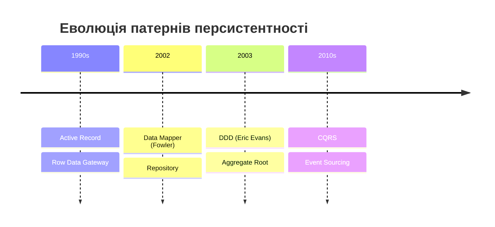
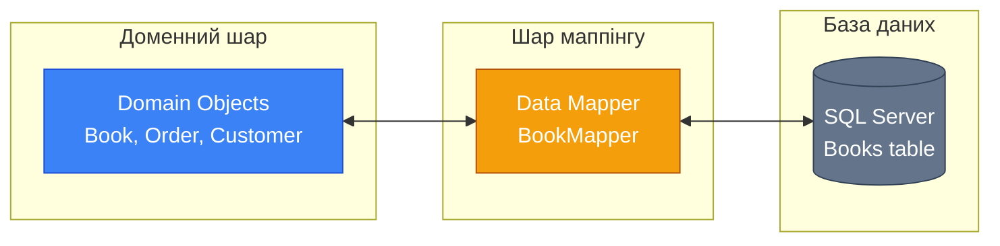
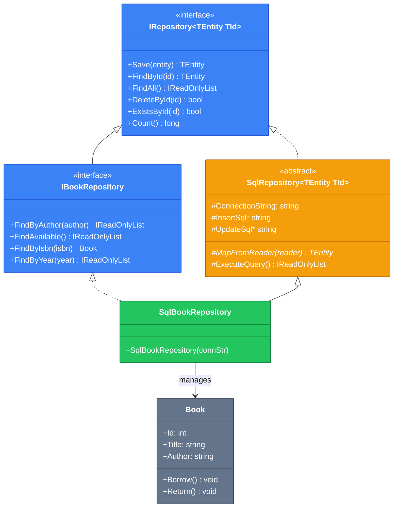

# 9.11. Data Mapper та Repository: Архітектура доступу до даних

## Вступ: Від «спагетті з SQL» до чистої архітектури

У попередніх статтях ми освоїли всі інструменти ADO.NET: з'єднання, команди, DataReader, параметри, транзакції, асинхронність. Але якщо подивитися на код більшості прикладів, він має одну спільну проблему — **SQL-запити, об'єкти з'єднання та бізнес-логіка перемішані в одному місці**.

Уявіть реальний проєкт — інтернет-магазин. Потрібно вивести каталог товарів, обробити замовлення, перевірити залишки. Якщо кожен метод контролера чи сервісу самостійно створює `SqlConnection`, пише SQL, парсить `SqlDataReader` — код перетворюється на «спагетті»:

```csharp showLineNumbers
// ❌ Антипаттерн: SQL розсипаний по бізнес-логіці
public class OrderService
{
    public void PlaceOrder(int productId, int customerId, int quantity)
    {
        // Перевірка залишків — SQL тут
        using var conn1 = new SqlConnection(_connectionString);
        conn1.Open();
        using var cmd1 = new SqlCommand(
            "SELECT Quantity FROM Products WHERE Id = @Id", conn1);
        cmd1.Parameters.Add("@Id", SqlDbType.Int).Value = productId;
        int stock = (int)cmd1.ExecuteScalar()!;

        if (stock < quantity)
            throw new InvalidOperationException("Недостатньо товару");

        // Створення замовлення — ще SQL тут
        using var conn2 = new SqlConnection(_connectionString);
        conn2.Open();
        using var cmd2 = new SqlCommand(
            "INSERT INTO Orders (CustomerId, ProductId, Qty, OrderDate) VALUES (@CustId, @ProdId, @Qty, @Date)",
            conn2);
        cmd2.Parameters.Add("@CustId", SqlDbType.Int).Value = customerId;
        cmd2.Parameters.Add("@ProdId", SqlDbType.Int).Value = productId;
        cmd2.Parameters.Add("@Qty", SqlDbType.Int).Value = quantity;
        cmd2.Parameters.Add("@Date", SqlDbType.DateTime).Value = DateTime.Now;
        cmd2.ExecuteNonQuery();

        // Оновлення залишків — і ще SQL тут
        using var conn3 = new SqlConnection(_connectionString);
        conn3.Open();
        using var cmd3 = new SqlCommand(
            "UPDATE Products SET Quantity = Quantity - @Qty WHERE Id = @Id", conn3);
        cmd3.Parameters.Add("@Qty", SqlDbType.Int).Value = quantity;
        cmd3.Parameters.Add("@Id", SqlDbType.Int).Value = productId;
        cmd3.ExecuteNonQuery();
    }
}
```

::warning
**Проблеми цього підходу:**

- **Дублювання**: Один і той самий `SELECT * FROM Products` повторюється в десятках місць
- **Крихкість**: Зміна назви стовпця в БД → пошук та заміна в усьому коді
- **Нетестованість**: Неможливо протестувати бізнес-логіку без бази даних
- **Змішання відповідальностей**: `OrderService` знає і про SQL, і про бізнес-правила
- **Немає повторного використання**: Маппінг `SqlDataReader → Product` копіюється

::

Архітектурні патерни **Data Mapper** та **Repository** вирішують ці проблеми, створюючи чіткий поділ між доменною логікою та інфраструктурою доступу до даних.

::note
**Передумови**: Усі попередні статті модуля ADO.NET (особливо [9.3. DbCommand](/1.csharp/09.ado-net/03.command-and-queries), [9.4. DataReader](/1.csharp/09.ado-net/04.datareader), [9.5. Параметри](/1.csharp/09.ado-net/05.parameters-and-sql-injection), [9.6. Транзакції](/1.csharp/09.ado-net/06.transactions)). Базове розуміння ООП (інтерфейси, абстрактні класи, спадкування).

::

---

## Теоретичні основи: Патерни персистентності

### Еволюція підходів

::mermaid



::

Мартін Фаулер у книзі **«Patterns of Enterprise Application Architecture» (2002)** описав кілька фундаментальних підходів до персистентності:

| Патерн | Суть | Приклад | Недолік |
|:---|:---|:---|:---|
| **Active Record** | Об'єкт сам знає, як себе зберігати | `book.Save()` | Порушує SRP |
| **Table Data Gateway** | Один клас для всіх операцій з таблицею | `ProductGateway.FindAll()` | Не об'єктно-орієнтований |
| **Row Data Gateway** | Об'єкт-обгортка для одного рядка | `row.Update()` | Не має бізнес-логіки |
| **Data Mapper** | Окремий шар маппінгу між об'єктами та БД | `mapper.Save(book)` | Більше коду |
| **Repository** | Колекція доменних об'єктів | `repository.FindAvailable()` | Потребує UoW |

### Що таке Data Mapper?

**Data Mapper** — це шар коду, який **переносить дані** між доменними об'єктами (ваші C#-класи) та базою даних, зберігаючи їх **незалежними** одне від одного.

> «A layer of Mappers that moves data between objects and a database while keeping them independent of each other and the mapper itself.»
> — Martin Fowler, [P of EAA](https://martinfowler.com/eaaCatalog/dataMapper.html)

Ключове слово — **independent** (незалежні). Ваш клас `Book` не повинен знати, що він зберігається в SQL Server. А ваш SQL-код не повинен знати про бізнес-правила книги.

::mermaid



::

### Repository vs DAO

Два патерни часто плутають, але вони мають різну філософію:

| Аспект | DAO (Data Access Object) | Repository |
|:---|:---|:---|
| **Походження** | Core J2EE Patterns (Sun, 2001) | Domain-Driven Design (Evans, 2003) |
| **Мова інтерфейсу** | Технічна: `Insert`, `Update`, `Delete` | Доменна: `FindAvailable`, `FindByAuthor` |
| **Фокус** | Технічний доступ до даних | Колекція доменних об'єктів |
| **Семантика** | «Записую/читаю дані зі сховища» | «Додаю/отримую об'єкти з колекції» |

::tip
У сучасній розробці ці терміни часто використовуються як синоніми. Головне — розуміти принцип: **відокремлення доменної логіки від логіки персистентності**.

::

---

## Крок 1: Доменна модель (Persistence Ignorance)

Головний принцип — **Persistence Ignorance** (невідання про персистентність). Доменна модель не повинна мати жодних залежностей від ADO.NET, SQL, файлів або будь-якої іншої інфраструктури:

```csharp showLineNumbers
namespace Library.Domain;

/// <summary>
/// Доменна модель книги.
/// Цей клас нічого не знає про базу даних, SQL, ADO.NET.
/// Він містить лише дані та бізнес-логіку.
/// </summary>
public class Book
{
    public int Id { get; set; }
    public string Title { get; set; } = "";
    public string Author { get; set; } = "";
    public int Year { get; set; }
    public string Isbn { get; set; } = "";
    public bool IsAvailable { get; private set; } = true;

    // Конструктор для створення нової книги
    public Book(string title, string author, int year, string isbn)
    {
        Title = title;
        Author = author;
        Year = year;
        Isbn = isbn;
        IsAvailable = true;
    }

    // Конструктор для відновлення з бази даних (DataMapper передає всі поля)
    public Book(int id, string title, string author, int year, string isbn, bool isAvailable)
    {
        Id = id;
        Title = title;
        Author = author;
        Year = year;
        Isbn = isbn;
        IsAvailable = isAvailable;
    }

    // Бізнес-логіка
    public void Borrow()
    {
        if (!IsAvailable)
            throw new InvalidOperationException("Книга вже видана");
        IsAvailable = false;
    }

    public void Return()
    {
        if (IsAvailable)
            throw new InvalidOperationException("Книга не була видана");
        IsAvailable = true;
    }

    public override string ToString() =>
        $"[{Id}] {Title} — {Author} ({Year}), {(IsAvailable ? "доступна" : "видана")}";
}
```

**Розбір коду:**

- **Рядки 10-15**: Властивості — чисті дані, жодних `[Column]`, `[Table]` або інших атрибутів ORM.
- **Рядки 18-26**: Конструктор для **нових** книг — `Id` не задається, бо його згенерує БД (`IDENTITY`).
- **Рядки 29-37**: Конструктор для **відновлення** з бази — Data Mapper передає всі поля, включаючи `Id`.
- **Рядки 40-51**: Бізнес-логіка інкапсульована в методах. `Borrow()` та `Return()` — це не просто set, а **правила домену**.

Зверніть увагу: жодного `using Microsoft.Data.SqlClient`, жодного `SqlConnection`. Клас `Book` можна тестувати без бази даних:

```csharp showLineNumbers
// Тест бізнес-логіки — без SQL, без з'єднань
var book = new Book("Чистий код", "Роберт Мартін", 2008, "978-0132350884");
book.Borrow();
Assert.False(book.IsAvailable);
Assert.Throws<InvalidOperationException>(() => book.Borrow()); // Повторна видача
```

---

## Крок 2: Найпростіший Data Mapper з ADO.NET

Тепер створимо Data Mapper — клас, який **відображає** доменну модель `Book` на таблицю `Books` у SQL Server:

### SQL-таблиця

```sql showLineNumbers
CREATE TABLE Books (
    Id          INT IDENTITY(1,1) PRIMARY KEY,
    Title       NVARCHAR(200)   NOT NULL,
    Author      NVARCHAR(200)   NOT NULL,
    Year        INT             NOT NULL,
    Isbn        NVARCHAR(20)    NOT NULL UNIQUE,
    IsAvailable BIT             NOT NULL DEFAULT 1
);
```

### BookMapper

```csharp showLineNumbers
using System.Data;
using Microsoft.Data.SqlClient;
using Library.Domain;

namespace Library.Persistence;

/// <summary>
/// Data Mapper для книг.
/// Відповідає за перетворення між доменним об'єктом Book та таблицею Books.
/// </summary>
public class BookMapper
{
    private readonly string _connectionString;

    public BookMapper(string connectionString)
    {
        _connectionString = connectionString;
    }

    /// <summary>
    /// Зберігає книгу. Якщо Id == 0 — INSERT, інакше — UPDATE.
    /// </summary>
    public Book Save(Book book)
    {
        if (book.Id == 0)
            return Insert(book);
        else
            return Update(book);
    }

    private Book Insert(Book book)
    {
        using SqlConnection connection = new SqlConnection(_connectionString);
        connection.Open();

        using SqlCommand command = new SqlCommand(@"
            INSERT INTO Books (Title, Author, Year, Isbn, IsAvailable)
            VALUES (@Title, @Author, @Year, @Isbn, @IsAvailable);
            SELECT CAST(SCOPE_IDENTITY() AS INT);",
            connection);

        command.Parameters.Add("@Title", SqlDbType.NVarChar, 200).Value = book.Title;
        command.Parameters.Add("@Author", SqlDbType.NVarChar, 200).Value = book.Author;
        command.Parameters.Add("@Year", SqlDbType.Int).Value = book.Year;
        command.Parameters.Add("@Isbn", SqlDbType.NVarChar, 20).Value = book.Isbn;
        command.Parameters.Add("@IsAvailable", SqlDbType.Bit).Value = book.IsAvailable;

        // SCOPE_IDENTITY() повертає Id, згенерований IDENTITY
        int newId = (int)command.ExecuteScalar()!;
        book.Id = newId;

        return book;
    }

    private Book Update(Book book)
    {
        using SqlConnection connection = new SqlConnection(_connectionString);
        connection.Open();

        using SqlCommand command = new SqlCommand(@"
            UPDATE Books
            SET Title = @Title, Author = @Author, Year = @Year,
                Isbn = @Isbn, IsAvailable = @IsAvailable
            WHERE Id = @Id",
            connection);

        command.Parameters.Add("@Id", SqlDbType.Int).Value = book.Id;
        command.Parameters.Add("@Title", SqlDbType.NVarChar, 200).Value = book.Title;
        command.Parameters.Add("@Author", SqlDbType.NVarChar, 200).Value = book.Author;
        command.Parameters.Add("@Year", SqlDbType.Int).Value = book.Year;
        command.Parameters.Add("@Isbn", SqlDbType.NVarChar, 20).Value = book.Isbn;
        command.Parameters.Add("@IsAvailable", SqlDbType.Bit).Value = book.IsAvailable;

        int affected = command.ExecuteNonQuery();
        if (affected == 0)
            throw new InvalidOperationException($"Книгу з Id={book.Id} не знайдено в базі.");

        return book;
    }

    /// <summary>
    /// Знаходить книгу за Id.
    /// </summary>
    public Book? FindById(int id)
    {
        using SqlConnection connection = new SqlConnection(_connectionString);
        connection.Open();

        using SqlCommand command = new SqlCommand(
            "SELECT Id, Title, Author, Year, Isbn, IsAvailable FROM Books WHERE Id = @Id",
            connection);
        command.Parameters.Add("@Id", SqlDbType.Int).Value = id;

        using SqlDataReader reader = command.ExecuteReader();
        if (reader.Read())
        {
            return MapFromReader(reader);
        }
        return null;
    }

    /// <summary>
    /// Повертає всі книги.
    /// </summary>
    public List<Book> FindAll()
    {
        var books = new List<Book>();

        using SqlConnection connection = new SqlConnection(_connectionString);
        connection.Open();

        using SqlCommand command = new SqlCommand(
            "SELECT Id, Title, Author, Year, Isbn, IsAvailable FROM Books ORDER BY Title",
            connection);
        using SqlDataReader reader = command.ExecuteReader();

        while (reader.Read())
        {
            books.Add(MapFromReader(reader));
        }

        return books;
    }

    /// <summary>
    /// Видаляє книгу за Id.
    /// </summary>
    public bool Delete(int id)
    {
        using SqlConnection connection = new SqlConnection(_connectionString);
        connection.Open();

        using SqlCommand command = new SqlCommand(
            "DELETE FROM Books WHERE Id = @Id", connection);
        command.Parameters.Add("@Id", SqlDbType.Int).Value = id;

        return command.ExecuteNonQuery() > 0;
    }

    /// <summary>
    /// Маппінг SqlDataReader → Book.
    /// Центральний метод Data Mapper — саме тут відбувається "переклад"
    /// між реляційним та об'єктним світом.
    /// </summary>
    private static Book MapFromReader(SqlDataReader reader)
    {
        return new Book(
            id:          reader.GetInt32(reader.GetOrdinal("Id")),
            title:       reader.GetString(reader.GetOrdinal("Title")),
            author:      reader.GetString(reader.GetOrdinal("Author")),
            year:        reader.GetInt32(reader.GetOrdinal("Year")),
            isbn:        reader.GetString(reader.GetOrdinal("Isbn")),
            isAvailable: reader.GetBoolean(reader.GetOrdinal("IsAvailable"))
        );
    }
}
```

**Розбір коду:**

- **Рядки 25-29**: Метод `Save()` реалізує **upsert-логіку**: якщо `Id == 0` (нова книга) — INSERT, інакше — UPDATE.
- **Рядки 40-41**: `SCOPE_IDENTITY()` повертає Id, згенерований `IDENTITY(1,1)`. Ми записуємо його назад у `book.Id`.
- **Рядки 76-77**: Перевірка `affected == 0` — якщо UPDATE не зачепив жоден рядок, значить книга була видалена іншим процесом.
- **Рядки 141-149**: `MapFromReader()` — **серце Data Mapper**. Цей метод перетворює один рядок `SqlDataReader` на доменний об'єкт `Book`. Використовуємо `GetOrdinal()` для надійного маппінгу за ім'ям стовпця.

---

## Крок 3: Проблема — і еволюція до Repository

Наш `BookMapper` працює, але має проблеми:

1. **Клієнтський код прив'язаний до конкретного класу** — неможливо замінити реалізацію
2. **Методи пошуку обмежені** — лише `FindById` та `FindAll`
3. **Немає абстракції** — кожна нова сутність потребує повного дублювання коду

**Repository Pattern** вирішує це через **інтерфейси**. Клієнтський код залежить від абстракції, а не від конкретної реалізації.

### Базовий інтерфейс IRepository

```csharp showLineNumbers
namespace Library.Repository;

/// <summary>
/// Базовий інтерфейс Repository.
/// Визначає стандартні CRUD-операції для будь-якої сутності.
/// </summary>
/// <typeparam name="TEntity">Тип сутності</typeparam>
/// <typeparam name="TId">Тип ідентифікатора</typeparam>
public interface IRepository<TEntity, in TId> where TEntity : class
{
    TEntity Save(TEntity entity);
    TEntity? FindById(TId id);
    IReadOnlyList<TEntity> FindAll();
    bool DeleteById(TId id);
    bool ExistsById(TId id);
    long Count();
}
```

### Специфічний інтерфейс IBookRepository

```csharp showLineNumbers
using Library.Domain;

namespace Library.Repository;

/// <summary>
/// Репозиторій книг з доменними методами пошуку.
/// Зверніть увагу на мову: FindByAuthor, FindAvailable —
/// це доменна мова (Ubiquitous Language), не технічна.
/// </summary>
public interface IBookRepository : IRepository<Book, int>
{
    IReadOnlyList<Book> FindByAuthor(string author);
    IReadOnlyList<Book> FindByTitleContaining(string title);
    IReadOnlyList<Book> FindAvailable();
    Book? FindByIsbn(string isbn);
    IReadOnlyList<Book> FindByYear(int year);
    IReadOnlyList<Book> FindByYearBetween(int startYear, int endYear);
}
```

Порівняйте мову інтерфейсу:

```csharp
// Технічний стиль (DAO) — «що робити з БД»
IList<Book> Select(string whereClause);
void Insert(Book book);

// Доменний стиль (Repository) — «що є в колекції»
IReadOnlyList<Book> FindAvailable();
IReadOnlyList<Book> FindByAuthor(string author);
```

---

## Крок 4: Абстрактний SqlRepository

Створимо абстрактний базовий клас, який інкапсулює спільну логіку ADO.NET для будь-якого репозиторію:

```csharp showLineNumbers
using System.Data;
using Microsoft.Data.SqlClient;

namespace Library.Repository.Sql;

/// <summary>
/// Абстрактний базовий Repository для SQL Server.
/// Інкапсулює спільну логіку ADO.NET: з'єднання, виконання запитів, маппінг.
/// Конкретні репозиторії надають SQL-запити та маппінг.
/// </summary>
/// <typeparam name="TEntity">Тип доменної сутності</typeparam>
/// <typeparam name="TId">Тип ідентифікатора</typeparam>
public abstract class SqlRepository<TEntity, TId> : IRepository<TEntity, TId>
    where TEntity : class
{
    protected readonly string ConnectionString;

    protected SqlRepository(string connectionString)
    {
        ConnectionString = connectionString;
    }

    // ===== Абстрактні методи, які надає конкретний репозиторій =====

    /// <summary>Маппінг одного рядка SqlDataReader → TEntity</summary>
    protected abstract TEntity MapFromReader(SqlDataReader reader);

    /// <summary>SQL для INSERT (повинен повертати новий Id через SCOPE_IDENTITY)</summary>
    protected abstract string InsertSql { get; }

    /// <summary>SQL для UPDATE</summary>
    protected abstract string UpdateSql { get; }

    /// <summary>SQL для SELECT всіх</summary>
    protected abstract string SelectAllSql { get; }

    /// <summary>SQL для SELECT за Id</summary>
    protected abstract string SelectByIdSql { get; }

    /// <summary>SQL для DELETE за Id</summary>
    protected abstract string DeleteByIdSql { get; }

    /// <summary>SQL для COUNT</summary>
    protected abstract string CountSql { get; }

    /// <summary>Додає параметри для INSERT</summary>
    protected abstract void AddInsertParameters(SqlCommand command, TEntity entity);

    /// <summary>Додає параметри для UPDATE (включаючи Id)</summary>
    protected abstract void AddUpdateParameters(SqlCommand command, TEntity entity);

    /// <summary>Отримує Id з сутності</summary>
    protected abstract TId GetId(TEntity entity);

    /// <summary>Встановлює Id сутності (після INSERT)</summary>
    protected abstract void SetId(TEntity entity, object generatedId);

    /// <summary>Чи є сутність новою (ще не збережена в БД)</summary>
    protected abstract bool IsNew(TEntity entity);

    // ===== Реалізація CRUD =====

    public virtual TEntity Save(TEntity entity)
    {
        if (IsNew(entity))
            return Insert(entity);
        else
            return Update(entity);
    }

    private TEntity Insert(TEntity entity)
    {
        using SqlConnection conn = new SqlConnection(ConnectionString);
        conn.Open();
        using SqlCommand cmd = new SqlCommand(InsertSql, conn);
        AddInsertParameters(cmd, entity);

        object newId = cmd.ExecuteScalar()!;
        SetId(entity, newId);
        return entity;
    }

    private TEntity Update(TEntity entity)
    {
        using SqlConnection conn = new SqlConnection(ConnectionString);
        conn.Open();
        using SqlCommand cmd = new SqlCommand(UpdateSql, conn);
        AddUpdateParameters(cmd, entity);

        int affected = cmd.ExecuteNonQuery();
        if (affected == 0)
            throw new InvalidOperationException(
                $"Сутність з Id={GetId(entity)} не знайдено.");
        return entity;
    }

    public virtual TEntity? FindById(TId id)
    {
        using SqlConnection conn = new SqlConnection(ConnectionString);
        conn.Open();
        using SqlCommand cmd = new SqlCommand(SelectByIdSql, conn);
        cmd.Parameters.Add("@Id", SqlDbType.Int).Value = id;

        using SqlDataReader reader = cmd.ExecuteReader();
        return reader.Read() ? MapFromReader(reader) : default;
    }

    public virtual IReadOnlyList<TEntity> FindAll()
    {
        return ExecuteQuery(SelectAllSql);
    }

    public virtual bool DeleteById(TId id)
    {
        using SqlConnection conn = new SqlConnection(ConnectionString);
        conn.Open();
        using SqlCommand cmd = new SqlCommand(DeleteByIdSql, conn);
        cmd.Parameters.Add("@Id", SqlDbType.Int).Value = id;
        return cmd.ExecuteNonQuery() > 0;
    }

    public virtual bool ExistsById(TId id)
    {
        return FindById(id) != null;
    }

    public virtual long Count()
    {
        using SqlConnection conn = new SqlConnection(ConnectionString);
        conn.Open();
        using SqlCommand cmd = new SqlCommand(CountSql, conn);
        return Convert.ToInt64(cmd.ExecuteScalar());
    }

    // ===== Хелпер-методи для нащадків =====

    /// <summary>
    /// Виконує SELECT-запит і повертає список сутностей.
    /// Використовується конкретними репозиторіями для кастомних запитів.
    /// </summary>
    protected IReadOnlyList<TEntity> ExecuteQuery(
        string sql, Action<SqlCommand>? addParameters = null)
    {
        var results = new List<TEntity>();

        using SqlConnection conn = new SqlConnection(ConnectionString);
        conn.Open();
        using SqlCommand cmd = new SqlCommand(sql, conn);
        addParameters?.Invoke(cmd);

        using SqlDataReader reader = cmd.ExecuteReader();
        while (reader.Read())
        {
            results.Add(MapFromReader(reader));
        }

        return results.AsReadOnly();
    }

    /// <summary>
    /// Виконує SELECT-запит і повертає першу сутність або null.
    /// </summary>
    protected TEntity? ExecuteQuerySingle(
        string sql, Action<SqlCommand>? addParameters = null)
    {
        using SqlConnection conn = new SqlConnection(ConnectionString);
        conn.Open();
        using SqlCommand cmd = new SqlCommand(sql, conn);
        addParameters?.Invoke(cmd);

        using SqlDataReader reader = cmd.ExecuteReader();
        return reader.Read() ? MapFromReader(reader) : default;
    }
}
```

**Розбір коду:**

- **Рядки 25-57**: Серія абстрактних членів — це **контракт**, який конкретний репозиторій повинен реалізувати. Абстрактний клас надає **алгоритм** (Template Method pattern), а нащадок — **деталі**.
- **Рядки 63-68**: `Save()` вирішує: INSERT чи UPDATE. Це upsert-логіка, спільна для всіх сутностей.
- **Рядки 124-141**: `ExecuteQuery()` — захищений хелпер. Конкретний репозиторій передає SQL та параметри, а базовий клас обробляє з'єднання, виконання та маппінг.

---

## Крок 5: Конкретний SqlBookRepository

```csharp showLineNumbers
using System.Data;
using Microsoft.Data.SqlClient;
using Library.Domain;

namespace Library.Repository.Sql;

/// <summary>
/// SQL Server реалізація репозиторію книг.
/// Надає SQL-запити, маппінг та доменні методи пошуку.
/// </summary>
public class SqlBookRepository : SqlRepository<Book, int>, IBookRepository
{
    public SqlBookRepository(string connectionString)
        : base(connectionString) { }

    // ===== Маппінг =====

    protected override Book MapFromReader(SqlDataReader reader) => new Book(
        id:          reader.GetInt32(reader.GetOrdinal("Id")),
        title:       reader.GetString(reader.GetOrdinal("Title")),
        author:      reader.GetString(reader.GetOrdinal("Author")),
        year:        reader.GetInt32(reader.GetOrdinal("Year")),
        isbn:        reader.GetString(reader.GetOrdinal("Isbn")),
        isAvailable: reader.GetBoolean(reader.GetOrdinal("IsAvailable"))
    );

    // ===== SQL-запити =====

    protected override string InsertSql => @"
        INSERT INTO Books (Title, Author, Year, Isbn, IsAvailable)
        VALUES (@Title, @Author, @Year, @Isbn, @IsAvailable);
        SELECT CAST(SCOPE_IDENTITY() AS INT);";

    protected override string UpdateSql => @"
        UPDATE Books
        SET Title = @Title, Author = @Author, Year = @Year,
            Isbn = @Isbn, IsAvailable = @IsAvailable
        WHERE Id = @Id";

    protected override string SelectAllSql =>
        "SELECT Id, Title, Author, Year, Isbn, IsAvailable FROM Books ORDER BY Title";

    protected override string SelectByIdSql =>
        "SELECT Id, Title, Author, Year, Isbn, IsAvailable FROM Books WHERE Id = @Id";

    protected override string DeleteByIdSql =>
        "DELETE FROM Books WHERE Id = @Id";

    protected override string CountSql =>
        "SELECT COUNT(*) FROM Books";

    // ===== Параметри =====

    protected override void AddInsertParameters(SqlCommand cmd, Book book)
    {
        cmd.Parameters.Add("@Title", SqlDbType.NVarChar, 200).Value = book.Title;
        cmd.Parameters.Add("@Author", SqlDbType.NVarChar, 200).Value = book.Author;
        cmd.Parameters.Add("@Year", SqlDbType.Int).Value = book.Year;
        cmd.Parameters.Add("@Isbn", SqlDbType.NVarChar, 20).Value = book.Isbn;
        cmd.Parameters.Add("@IsAvailable", SqlDbType.Bit).Value = book.IsAvailable;
    }

    protected override void AddUpdateParameters(SqlCommand cmd, Book book)
    {
        cmd.Parameters.Add("@Id", SqlDbType.Int).Value = book.Id;
        AddInsertParameters(cmd, book);
    }

    protected override int GetId(Book book) => book.Id;
    protected override void SetId(Book book, object id) => book.Id = (int)id;
    protected override bool IsNew(Book book) => book.Id == 0;

    // ===== Доменні методи пошуку (IBookRepository) =====

    public IReadOnlyList<Book> FindByAuthor(string author) =>
        ExecuteQuery(
            "SELECT Id, Title, Author, Year, Isbn, IsAvailable FROM Books WHERE Author LIKE @Pattern ORDER BY Title",
            cmd => cmd.Parameters.Add("@Pattern", SqlDbType.NVarChar, 200).Value = $"%{author}%");

    public IReadOnlyList<Book> FindByTitleContaining(string title) =>
        ExecuteQuery(
            "SELECT Id, Title, Author, Year, Isbn, IsAvailable FROM Books WHERE Title LIKE @Pattern ORDER BY Title",
            cmd => cmd.Parameters.Add("@Pattern", SqlDbType.NVarChar, 200).Value = $"%{title}%");

    public IReadOnlyList<Book> FindAvailable() =>
        ExecuteQuery(
            "SELECT Id, Title, Author, Year, Isbn, IsAvailable FROM Books WHERE IsAvailable = 1 ORDER BY Title");

    public Book? FindByIsbn(string isbn) =>
        ExecuteQuerySingle(
            "SELECT Id, Title, Author, Year, Isbn, IsAvailable FROM Books WHERE Isbn = @Isbn",
            cmd => cmd.Parameters.Add("@Isbn", SqlDbType.NVarChar, 20).Value = isbn);

    public IReadOnlyList<Book> FindByYear(int year) =>
        ExecuteQuery(
            "SELECT Id, Title, Author, Year, Isbn, IsAvailable FROM Books WHERE Year = @Year ORDER BY Title",
            cmd => cmd.Parameters.Add("@Year", SqlDbType.Int).Value = year);

    public IReadOnlyList<Book> FindByYearBetween(int startYear, int endYear) =>
        ExecuteQuery(
            "SELECT Id, Title, Author, Year, Isbn, IsAvailable FROM Books WHERE Year BETWEEN @Start AND @End ORDER BY Title",
            cmd =>
            {
                cmd.Parameters.Add("@Start", SqlDbType.Int).Value = startYear;
                cmd.Parameters.Add("@End", SqlDbType.Int).Value = endYear;
            });
}
```

**Розбір коду:**

- **Рядки 18-25**: `MapFromReader` — єдине місце маппінгу `SqlDataReader → Book`. Це **серце Data Mapper**.
- **Рядки 29-50**: SQL-запити як `string`-властивості. Вони ізольовані від бізнес-логіки.
- **Рядки 66-67**: `AddUpdateParameters` перевикористовує `AddInsertParameters` та додає `@Id`.
- **Рядки 73-101**: Доменні методи використовують `ExecuteQuery()` з базового класу — мінімум коду, максимум виразності.

---

## Крок 6: Практичне використання

```csharp showLineNumbers
using Library.Domain;
using Library.Repository;
using Library.Repository.Sql;

// Залежність від ІНТЕРФЕЙСУ, не від реалізації!
IBookRepository repository = new SqlBookRepository(
    "Server=localhost;Database=LibraryDb;Trusted_Connection=True;TrustServerCertificate=True;");

// Створюємо книги
var book1 = new Book("Чистий код", "Роберт Мартін", 2008, "978-0132350884");
var book2 = new Book("Рефакторинг", "Мартін Фаулер", 1999, "978-0201485677");
var book3 = new Book("Domain-Driven Design", "Ерік Еванс", 2003, "978-0321125217");

repository.Save(book1);
repository.Save(book2);
repository.Save(book3);

Console.WriteLine($"Всього книг: {repository.Count()}");

// Доменні запити
Console.WriteLine("\nКниги Мартіна:");
foreach (var book in repository.FindByAuthor("Мартін"))
    Console.WriteLine($"  {book}");

// Бізнес-операція + збереження
var foundBook = repository.FindByIsbn("978-0132350884");
if (foundBook != null)
{
    foundBook.Borrow();           // Бізнес-логіка
    repository.Save(foundBook);   // Персистентність
}

Console.WriteLine("\nДоступні книги:");
foreach (var book in repository.FindAvailable())
    Console.WriteLine($"  {book}");
```

**Ключовий момент: заміна реалізації**

Якщо завтра ви вирішите використовувати PostgreSQL або JSON-файли, потрібно змінити **один рядок**:

```csharp
// SQL Server
IBookRepository repo = new SqlBookRepository(connectionString);

// PostgreSQL (нова реалізація)
// IBookRepository repo = new PgsqlBookRepository(connectionString);

// JSON-файли (ще одна реалізація)
// IBookRepository repo = new JsonBookRepository("books.json");
```

Решта коду залишається **абсолютно незмінною**. Це і є сила Dependency Inversion.

---

## Архітектура рішення

::mermaid



::

---

## Обробка помилок

Створимо ієрархію винятків для репозиторіїв:

```csharp showLineNumbers
namespace Library.Repository.Exceptions;

/// <summary>Базовий виняток репозиторію</summary>
public class RepositoryException : Exception
{
    public RepositoryException(string message) : base(message) { }
    public RepositoryException(string message, Exception inner) : base(message, inner) { }
}

/// <summary>Сутність не знайдено</summary>
public class EntityNotFoundException : RepositoryException
{
    public object? Id { get; }
    public EntityNotFoundException(object? id)
        : base($"Сутність з Id='{id}' не знайдена") { Id = id; }
}

/// <summary>Порушення унікальності</summary>
public class DuplicateEntityException : RepositoryException
{
    public string Field { get; }
    public DuplicateEntityException(string field, object? value)
        : base($"Сутність з {field}='{value}' вже існує") { Field = field; }
}
```

Обробка `SqlException` у базовому класі:

```csharp showLineNumbers
// Додаємо до SqlRepository:
private TEntity Insert(TEntity entity)
{
    try
    {
        using SqlConnection conn = new SqlConnection(ConnectionString);
        conn.Open();
        using SqlCommand cmd = new SqlCommand(InsertSql, conn);
        AddInsertParameters(cmd, entity);

        object newId = cmd.ExecuteScalar()!;
        SetId(entity, newId);
        return entity;
    }
    catch (SqlException ex) when (ex.Number == 2627 || ex.Number == 2601)
    {
        // 2627 = PRIMARY KEY violation, 2601 = UNIQUE INDEX violation
        throw new DuplicateEntityException("UNIQUE constraint", entity);
    }
    catch (SqlException ex)
    {
        throw new RepositoryException($"Помилка SQL при вставці: {ex.Message}", ex);
    }
}
```

---

## Практичні завдання

### Рівень 1: Базовий

::steps

### Завдання 1.1: CustomerRepository

Створіть повний цикл для сутності `Customer`:
1. Доменна модель `Customer` (Id, Name, Email, Phone, CreatedAt).
2. SQL-таблиця `Customers`.
3. Інтерфейс `ICustomerRepository` з `FindByEmail`, `FindByName`.
4. Реалізація `SqlCustomerRepository`.

### Завдання 1.2: OrderRepository

Створіть репозиторій замовлень:
1. `Order` (Id, CustomerId, OrderDate, TotalAmount, Status).
2. `IOrderRepository` з `FindByCustomer`, `FindByStatus`, `FindByDateRange`.
3. `SqlOrderRepository` з маппінгом та параметризованими запитами.

::

### Рівень 2: Логіка та обробка даних

::steps

### Завдання 2.1: LibraryService

Реалізуйте `LibraryService`, що залежить від `IBookRepository`:
1. `BorrowBook(int bookId)` — видача книги (перевірка доступності + оновлення).
2. `ReturnBook(int bookId)` — повернення.
3. `GetStatistics()` — кількість усіх, доступних, виданих.
4. Бізнес-логіка **не містить** жодного SQL або ADO.NET.

### Завдання 2.2: Обробка помилок

Розширте `SqlBookRepository`:
1. Обробка `SqlException` (duplicate ISBN, connection failure).
2. Retry-логіка для transient errors.
3. Логування кожної операції (SQL-запит, час виконання).

::

### Рівень 3: Архітектура

::steps

### Завдання 3.1: Друга реалізація

Створіть `JsonBookRepository : IBookRepository`, що зберігає книги в JSON-файл. Продемонструйте, що клієнтський код (`LibraryService`) працює без змін з обома реалізаціями.

### Завдання 3.2: Async Repository

Створіть `IAsyncBookRepository` з методами `SaveAsync`, `FindByIdAsync`, `FindAllAsync`. Реалізуйте `SqlAsyncBookRepository` з `OpenAsync`, `ExecuteReaderAsync`, `ReadAsync`. Усі методи приймають `CancellationToken`.

::

---

## Резюме

::card-group

::card{title="Data Mapper" icon="i-heroicons-arrows-right-left"}
Окремий шар маппінгу між доменними об'єктами та SQL. MapFromReader() — «серце» маппера.

::

::card{title="Repository Pattern" icon="i-heroicons-archive-box"}
Абстракція колекції доменних об'єктів. Клієнтський код залежить від IBookRepository, не від SqlBookRepository.

::

::card{title="SqlRepository<T, TId>" icon="i-heroicons-server-stack"}
Абстрактний базовий клас з Template Method pattern. Інкапсулює ADO.NET, нащадок надає SQL та маппінг.

::

::card{title="Persistence Ignorance" icon="i-heroicons-eye-slash"}
Доменна модель не знає про SQL, ADO.NET, файли. Її можна тестувати ізольовано без інфраструктури.

::

::

### Ключові поняття

- **Data Mapper** — шар перетворення між об'єктами та БД
- **Repository** — абстракція колекції доменних об'єктів
- **Persistence Ignorance** — доменна модель не знає про сховище
- **Template Method** — базовий клас надає алгоритм, нащадок — деталі
- **Dependency Inversion** — залежність від абстракцій, не від реалізацій

::tip
**Наступний крок**: У наступній статті ми розглянемо **Identity Map** (кешування сутностей), **Unit of Work** (групування змін у транзакцію) та **Specification Pattern** (гнучкий комбінований пошук).

::
