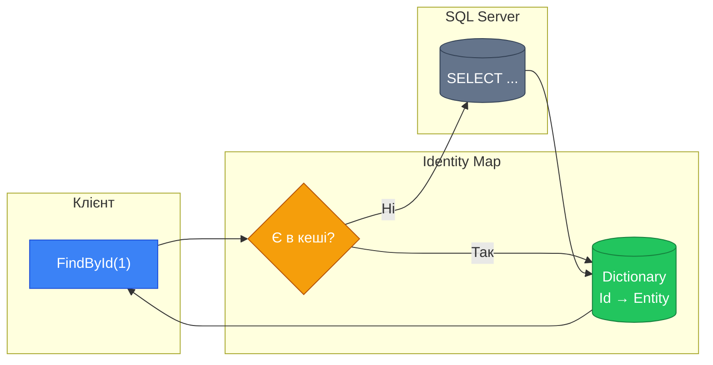
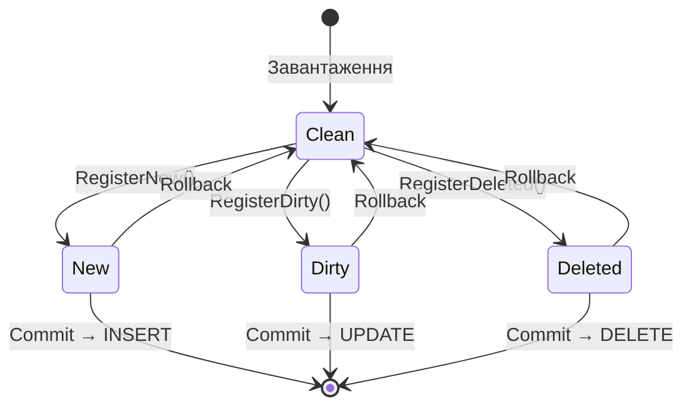

# 9.12. Identity Map, Unit of Work та Specification Pattern

## Вступ: Від Repository до повноцінної інфраструктури

У [попередній статті](/1.csharp/09.ado-net/11.data-mapper-repository) ми побудували фундамент — Data Mapper та Repository з ADO.NET. Тепер ми піднімемо архітектуру на наступний рівень, додавши три потужних патерни:

- **Identity Map** — кеш завантажених сутностей, який гарантує, що кожен об'єкт існує в пам'яті лише в одному екземплярі
- **Unit of Work** — групування кількох операцій в одну транзакцію з відстеженням змін
- **Specification Pattern** — гнучкий комбінований пошук без вибуху кількості методів

Ці три патерни — не просто академічна теорія. Вони лежать в основі **кожного ORM**: Entity Framework Core реалізує Identity Map через `DbContext`, Unit of Work через `SaveChanges()`, а Specification — через `IQueryable<T>`. Розуміючи ці патерни в «чистому» ADO.NET, ви зрозумієте, **як працює EF Core під капотом**.

::note
**Передумови**: Стаття [9.11. Data Mapper та Repository](/1.csharp/09.ado-net/11.data-mapper-repository) — `IBookRepository`, `SqlRepository<T, TId>`, `SqlBookRepository`. Стаття [9.6. Транзакції](/1.csharp/09.ado-net/06.transactions).

::

---

## Identity Map: Кешування завантажених сутностей

### Проблема дублікатів

Розглянемо типовий сценарій з поточною реалізацією:

```csharp showLineNumbers
var repository = new SqlBookRepository(connectionString);

// Два виклики FindById з однаковим Id
var book1 = repository.FindById(1);
var book2 = repository.FindById(1);

// Це РІЗНІ об'єкти в пам'яті!
Console.WriteLine(ReferenceEquals(book1, book2)); // false!

// Зміна в book1 НЕ видна в book2
book1!.Borrow();
Console.WriteLine(book1.IsAvailable);  // false
Console.WriteLine(book2!.IsAvailable); // true (!)
```

Кожен виклик `FindById` виконує SQL-запит та створює **новий** об'єкт. Це призводить до:

1. **Зайвих SQL-запитів** — один і той самий рядок читається багаторазово
2. **Неконсистентності** — два об'єкти представляють одну сутність, але мають різний стан
3. **Витрат пам'яті** — дублікати об'єктів
4. **Порушення ідентичності** — `book1 != book2`, хоча це одна книга

::warning
**Проблема ідентичності об'єктів** — фундаментальна проблема в системах з персистентністю. Якщо два об'єкти представляють одну сутність, вони повинні бути **одним об'єктом** у пам'яті.

::

### Концепція Identity Map

> «Ensures that each object gets loaded only once by keeping every loaded object in a map. Looks up objects using the map when referring to them.»
> — Martin Fowler, [P of EAA](https://martinfowler.com/eaaCatalog/identityMap.html)

**Identity Map** — це `Dictionary<TId, TEntity>`, який зберігає всі завантажені сутності. Перед зверненням до бази перевіряємо кеш:

::mermaid



::

### Реалізація Identity Map

```csharp showLineNumbers
namespace Library.Repository;

/// <summary>
/// Identity Map — кеш завантажених сутностей.
/// Гарантує, що кожна сутність існує в пам'яті лише в одному екземплярі.
/// </summary>
/// <typeparam name="TId">Тип ідентифікатора</typeparam>
/// <typeparam name="TEntity">Тип сутності</typeparam>
public class IdentityMap<TId, TEntity> where TId : notnull
{
    private readonly Dictionary<TId, TEntity> _cache = new();

    /// <summary>Спроба отримати сутність з кешу.</summary>
    public bool TryGet(TId id, out TEntity? entity)
    {
        return _cache.TryGetValue(id, out entity);
    }

    /// <summary>Додати/оновити сутність у кеші.</summary>
    public void Put(TId id, TEntity entity)
    {
        _cache[id] = entity;
    }

    /// <summary>Видалити сутність з кешу.</summary>
    public void Remove(TId id)
    {
        _cache.Remove(id);
    }

    /// <summary>Очистити весь кеш.</summary>
    public void Clear() => _cache.Clear();

    /// <summary>Перевірити наявність у кеші.</summary>
    public bool Contains(TId id) => _cache.ContainsKey(id);

    /// <summary>Кількість закешованих сутностей.</summary>
    public int Count => _cache.Count;
}
```

### Інтеграція Identity Map у Repository

Доповнимо наш `SqlBookRepository` підтримкою Identity Map:

```csharp showLineNumbers
using System.Data;
using Microsoft.Data.SqlClient;
using Library.Domain;

namespace Library.Repository.Sql;

/// <summary>
/// SqlBookRepository з підтримкою Identity Map.
/// Кешує завантажені книги для уникнення дублікатів та зайвих SQL-запитів.
/// </summary>
public class CachedSqlBookRepository : SqlBookRepository
{
    private readonly IdentityMap<int, Book> _identityMap = new();

    public CachedSqlBookRepository(string connectionString)
        : base(connectionString) { }

    public override Book Save(Book book)
    {
        var saved = base.Save(book);
        _identityMap.Put(saved.Id, saved); // Оновлюємо кеш
        return saved;
    }

    public override Book? FindById(int id)
    {
        // Спочатку — кеш
        if (_identityMap.TryGet(id, out var cached) && cached != null)
        {
            return cached;
        }

        // Якщо немає в кеші — SQL
        var found = base.FindById(id);
        if (found != null)
        {
            _identityMap.Put(id, found);
        }
        return found;
    }

    public override bool DeleteById(int id)
    {
        _identityMap.Remove(id);
        return base.DeleteById(id);
    }

    /// <summary>Очищає кеш. Корисно для тестування.</summary>
    public void ClearCache() => _identityMap.Clear();
}
```

Тепер повторне завантаження повертає **той самий об'єкт**:

```csharp showLineNumbers
var repo = new CachedSqlBookRepository(connectionString);

var book1 = repo.FindById(1); // SQL-запит → кеш
var book2 = repo.FindById(1); // Кеш (без SQL)

Console.WriteLine(ReferenceEquals(book1, book2)); // true!

book1!.Borrow();
Console.WriteLine(book2!.IsAvailable); // false — це той самий об'єкт
```

---

## Unit of Work: Групування змін у транзакцію

### Проблема множинних збережень

Поточна реалізація виконує SQL при кожному виклику `Save()`:

```csharp showLineNumbers
// Кожен Save() — окреме з'єднання та окремий SQL
repository.Save(book1);  // → SQL INSERT
repository.Save(book2);  // → SQL INSERT
repository.Save(book3);  // → SQL INSERT
// 3 окремих операції. Якщо друга впаде — перша вже збережена, третя — ні.
```

Це порушує **атомарність**: якщо другий INSERT впаде, перший вже збережений, а третій не виконався. Дані в неконсистентному стані.

### Концепція Unit of Work

> «Maintains a list of objects affected by a business transaction and coordinates the writing out of changes.»
> — Martin Fowler, [P of EAA](https://martinfowler.com/eaaCatalog/unitOfWork.html)

**Unit of Work** накопичує зміни в пам'яті і зберігає їх **одним коммітом** у транзакції:

::mermaid



::

### Реалізація Unit of Work з SqlTransaction

```csharp showLineNumbers
using System.Data;
using Microsoft.Data.SqlClient;
using Library.Domain;

namespace Library.Repository;

/// <summary>
/// Unit of Work — відстежує зміни та зберігає їх у одній транзакції.
/// Використовує SqlTransaction для забезпечення атомарності.
/// </summary>
public class UnitOfWork : IDisposable
{
    private readonly string _connectionString;
    private readonly IBookRepository _repository;

    private readonly List<Book> _newEntities = new();
    private readonly List<Book> _dirtyEntities = new();
    private readonly List<int> _deletedIds = new();

    public UnitOfWork(string connectionString, IBookRepository repository)
    {
        _connectionString = connectionString;
        _repository = repository;
    }

    /// <summary>Зареєструвати нову сутність для INSERT.</summary>
    public void RegisterNew(Book entity)
    {
        _deletedIds.Remove(entity.Id);
        _dirtyEntities.Remove(entity);
        _newEntities.Add(entity);
    }

    /// <summary>Зареєструвати змінену сутність для UPDATE.</summary>
    public void RegisterDirty(Book entity)
    {
        if (!_newEntities.Contains(entity) && !_deletedIds.Contains(entity.Id))
        {
            _dirtyEntities.Add(entity);
        }
    }

    /// <summary>Зареєструвати сутність для DELETE.</summary>
    public void RegisterDeleted(Book entity)
    {
        if (_newEntities.Remove(entity)) return; // Була нова — просто забираємо
        _dirtyEntities.Remove(entity);
        _deletedIds.Add(entity.Id);
    }

    /// <summary>
    /// Зберігає ВСІ зміни в одній SQL-транзакції.
    /// Або всі операції виконуються успішно, або жодна.
    /// </summary>
    public void Commit()
    {
        using SqlConnection connection = new SqlConnection(_connectionString);
        connection.Open();
        using SqlTransaction transaction = connection.BeginTransaction();

        try
        {
            // INSERT нових
            foreach (var entity in _newEntities)
            {
                InsertInTransaction(entity, connection, transaction);
            }

            // UPDATE змінених
            foreach (var entity in _dirtyEntities)
            {
                UpdateInTransaction(entity, connection, transaction);
            }

            // DELETE видалених
            foreach (var id in _deletedIds)
            {
                DeleteInTransaction(id, connection, transaction);
            }

            transaction.Commit();
            Clear();
        }
        catch
        {
            transaction.Rollback();
            throw;
        }
    }

    /// <summary>Скасувати всі незбережені зміни.</summary>
    public void Rollback() => Clear();

    /// <summary>Є незбережені зміни?</summary>
    public bool HasChanges =>
        _newEntities.Count > 0 || _dirtyEntities.Count > 0 || _deletedIds.Count > 0;

    /// <summary>Статистика змін.</summary>
    public string ChangesSummary =>
        $"New: {_newEntities.Count}, Dirty: {_dirtyEntities.Count}, Deleted: {_deletedIds.Count}";

    private void Clear()
    {
        _newEntities.Clear();
        _dirtyEntities.Clear();
        _deletedIds.Clear();
    }

    private void InsertInTransaction(Book book, SqlConnection conn, SqlTransaction tx)
    {
        using SqlCommand cmd = new SqlCommand(@"
            INSERT INTO Books (Title, Author, Year, Isbn, IsAvailable)
            VALUES (@Title, @Author, @Year, @Isbn, @IsAvailable);
            SELECT CAST(SCOPE_IDENTITY() AS INT);", conn, tx);

        cmd.Parameters.Add("@Title", SqlDbType.NVarChar, 200).Value = book.Title;
        cmd.Parameters.Add("@Author", SqlDbType.NVarChar, 200).Value = book.Author;
        cmd.Parameters.Add("@Year", SqlDbType.Int).Value = book.Year;
        cmd.Parameters.Add("@Isbn", SqlDbType.NVarChar, 20).Value = book.Isbn;
        cmd.Parameters.Add("@IsAvailable", SqlDbType.Bit).Value = book.IsAvailable;

        book.Id = (int)cmd.ExecuteScalar()!;
    }

    private void UpdateInTransaction(Book book, SqlConnection conn, SqlTransaction tx)
    {
        using SqlCommand cmd = new SqlCommand(@"
            UPDATE Books
            SET Title = @Title, Author = @Author, Year = @Year,
                Isbn = @Isbn, IsAvailable = @IsAvailable
            WHERE Id = @Id", conn, tx);

        cmd.Parameters.Add("@Id", SqlDbType.Int).Value = book.Id;
        cmd.Parameters.Add("@Title", SqlDbType.NVarChar, 200).Value = book.Title;
        cmd.Parameters.Add("@Author", SqlDbType.NVarChar, 200).Value = book.Author;
        cmd.Parameters.Add("@Year", SqlDbType.Int).Value = book.Year;
        cmd.Parameters.Add("@Isbn", SqlDbType.NVarChar, 20).Value = book.Isbn;
        cmd.Parameters.Add("@IsAvailable", SqlDbType.Bit).Value = book.IsAvailable;

        cmd.ExecuteNonQuery();
    }

    private void DeleteInTransaction(int id, SqlConnection conn, SqlTransaction tx)
    {
        using SqlCommand cmd = new SqlCommand(
            "DELETE FROM Books WHERE Id = @Id", conn, tx);
        cmd.Parameters.Add("@Id", SqlDbType.Int).Value = id;
        cmd.ExecuteNonQuery();
    }

    public void Dispose() => Clear();
}
```

**Розбір коду:**

- **Рядки 16-18**: Три списки — «нові», «змінені» та «видалені» — зберігають стан змін у пам'яті.
- **Рядки 57-86**: `Commit()` — відкриває **одне з'єднання** і **одну транзакцію**, виконує всі операції послідовно. Якщо будь-яка впаде — `catch` → `Rollback()`.
- **Рядки 104-117**: `InsertInTransaction` приймає `SqlConnection` та `SqlTransaction` ззовні — всі операції працюють в **одному контексті**.

### Використання Unit of Work

```csharp showLineNumbers
var repository = new SqlBookRepository(connectionString);
using var uow = new UnitOfWork(connectionString, repository);

// Реєструємо зміни (без SQL!)
var book1 = new Book("C# in Depth", "Jon Skeet", 2019, "978-1617294532");
var book2 = new Book("CLR via C#", "Jeffrey Richter", 2012, "978-0735667457");

uow.RegisterNew(book1);
uow.RegisterNew(book2);

// Модифікуємо існуючу книгу
var existing = repository.FindById(1);
if (existing != null)
{
    existing.Borrow();
    uow.RegisterDirty(existing);
}

Console.WriteLine($"Зміни: {uow.ChangesSummary}");
// New: 2, Dirty: 1, Deleted: 0

// Один Commit = одна транзакція = атомарність!
uow.Commit();
Console.WriteLine("✅ Усі зміни збережено.");
```

---

## Specification Pattern: Гнучкий пошук

### Проблема вибуху методів

Подивіться на наш `IBookRepository`:

```csharp
FindByAuthor(string author)
FindByYear(int year)
FindByTitleContaining(string title)
FindAvailable()
```

А тепер уявіть, що потрібно знайти «доступні книги автора X, видані після 2020 року». Потрібно додати `FindByAuthorAndYearAndAvailable()`? А якщо ще й з частиною назви? Кількість комбінацій зростає **експоненціально**:

| Критеріїв | Комбінацій методів |
|:---|:---|
| 2 | 4 |
| 4 | 16 |
| 6 | 64 |

### Рішення: Specification Pattern

> «A Specification is a predicate that determines if an object does or does not satisfy some criteria.»
> — Eric Evans, Domain-Driven Design

**Specification** — це об'єкт, що представляє умову. Специфікації можна **комбінувати** через AND, OR, NOT:

```csharp showLineNumbers
namespace Library.Repository.Specification;

/// <summary>
/// Базовий інтерфейс специфікації.
/// Specialty — предикат, що перевіряє, чи відповідає сутність критерію.
/// </summary>
public interface ISpecification<T>
{
    bool IsSatisfiedBy(T entity);
}

/// <summary>
/// Абстрактна специфікація з підтримкою комбінування.
/// </summary>
public abstract class Specification<T> : ISpecification<T>
{
    public abstract bool IsSatisfiedBy(T entity);

    public Specification<T> And(ISpecification<T> other)
        => new AndSpecification<T>(this, other);

    public Specification<T> Or(ISpecification<T> other)
        => new OrSpecification<T>(this, other);

    public Specification<T> Not()
        => new NotSpecification<T>(this);
}

internal class AndSpecification<T> : Specification<T>
{
    private readonly ISpecification<T> _left, _right;
    public AndSpecification(ISpecification<T> left, ISpecification<T> right)
    { _left = left; _right = right; }

    public override bool IsSatisfiedBy(T entity)
        => _left.IsSatisfiedBy(entity) && _right.IsSatisfiedBy(entity);
}

internal class OrSpecification<T> : Specification<T>
{
    private readonly ISpecification<T> _left, _right;
    public OrSpecification(ISpecification<T> left, ISpecification<T> right)
    { _left = left; _right = right; }

    public override bool IsSatisfiedBy(T entity)
        => _left.IsSatisfiedBy(entity) || _right.IsSatisfiedBy(entity);
}

internal class NotSpecification<T> : Specification<T>
{
    private readonly ISpecification<T> _spec;
    public NotSpecification(ISpecification<T> spec) { _spec = spec; }

    public override bool IsSatisfiedBy(T entity)
        => !_spec.IsSatisfiedBy(entity);
}
```

### Конкретні специфікації для Book

```csharp showLineNumbers
using Library.Domain;

namespace Library.Repository.Specification;

/// <summary>
/// Фабрика специфікацій для книг.
/// Статичні методи створюють типові умови пошуку.
/// </summary>
public static class BookSpecifications
{
    public static Specification<Book> HasAuthor(string author)
        => new AuthorSpec(author);

    public static Specification<Book> TitleContains(string text)
        => new TitleSpec(text);

    public static Specification<Book> PublishedIn(int year)
        => new YearSpec(year);

    public static Specification<Book> PublishedBetween(int start, int end)
        => new YearRangeSpec(start, end);

    public static Specification<Book> IsAvailable()
        => new AvailableSpec();

    public static Specification<Book> IsBorrowed()
        => IsAvailable().Not();
}

// Конкретні реалізації
internal class AuthorSpec : Specification<Book>
{
    private readonly string _author;
    public AuthorSpec(string author) => _author = author;
    public override bool IsSatisfiedBy(Book b)
        => b.Author.Contains(_author, StringComparison.OrdinalIgnoreCase);
}

internal class TitleSpec : Specification<Book>
{
    private readonly string _text;
    public TitleSpec(string text) => _text = text;
    public override bool IsSatisfiedBy(Book b)
        => b.Title.Contains(_text, StringComparison.OrdinalIgnoreCase);
}

internal class YearSpec : Specification<Book>
{
    private readonly int _year;
    public YearSpec(int year) => _year = year;
    public override bool IsSatisfiedBy(Book b) => b.Year == _year;
}

internal class YearRangeSpec : Specification<Book>
{
    private readonly int _start, _end;
    public YearRangeSpec(int start, int end) { _start = start; _end = end; }
    public override bool IsSatisfiedBy(Book b) => b.Year >= _start && b.Year <= _end;
}

internal class AvailableSpec : Specification<Book>
{
    public override bool IsSatisfiedBy(Book b) => b.IsAvailable;
}
```

### Розширення Repository для Specification

```csharp showLineNumbers
using Library.Repository.Specification;

namespace Library.Repository;

/// <summary>
/// Розширений інтерфейс Repository з підтримкою Specification.
/// </summary>
public interface ISpecificationRepository<TEntity, TId> : IRepository<TEntity, TId>
    where TEntity : class
{
    IReadOnlyList<TEntity> FindAll(ISpecification<TEntity> spec);
    TEntity? FindOne(ISpecification<TEntity> spec);
    long Count(ISpecification<TEntity> spec);
    bool Exists(ISpecification<TEntity> spec);
}
```

Реалізація в `SqlBookRepository`:

```csharp showLineNumbers
// Додаємо до SqlBookRepository:

public IReadOnlyList<Book> FindAll(ISpecification<Book> spec)
{
    // Завантажуємо всі книги та фільтруємо в пам'яті
    return FindAll()
        .Where(spec.IsSatisfiedBy)
        .ToList()
        .AsReadOnly();
}

public Book? FindOne(ISpecification<Book> spec)
{
    return FindAll().FirstOrDefault(spec.IsSatisfiedBy);
}

public long Count(ISpecification<Book> spec)
{
    return FindAll().Count(spec.IsSatisfiedBy);
}

public bool Exists(ISpecification<Book> spec)
{
    return FindAll().Any(spec.IsSatisfiedBy);
}
```

### Використання Specification

```csharp showLineNumbers
using static Library.Repository.Specification.BookSpecifications;

// Прості запити
var martinBooks = repository.FindAll(HasAuthor("Мартін"));
var available = repository.FindAll(IsAvailable());

// Комбіновані запити — без нових методів!
var spec = HasAuthor("Мартін")
    .And(PublishedBetween(2000, 2020))
    .And(IsAvailable());

var result = repository.FindAll(spec);

// Складніший приклад
var complexSpec = TitleContains("Clean")
    .Or(TitleContains("Чистий"))
    .And(IsAvailable())
    .And(PublishedIn(2008).Not());

var filtered = repository.FindAll(complexSpec);

// Перевірки
bool hasAvailable = repository.Exists(IsAvailable());
long borrowedCount = repository.Count(IsBorrowed());
```

**Переваги:**
- Немає комбінаторного вибуху методів
- Умови комбінуються **динамічно**
- Читабельний код: `HasAuthor("X").And(IsAvailable())`
- Специфікації можна тестувати **ізольовано**

---

## Як це все пов'язано з ORM

::card-group

::card{title="Entity Framework Core" icon="i-heroicons-circle-stack"}
**DbContext** = Identity Map + Unit of Work. `SaveChanges()` = `Commit()`. `ChangeTracker` відстежує Added/Modified/Deleted — так само, як наш UoW.

::

::card{title="Dapper" icon="i-heroicons-bolt"}
Мікро-ORM, що реалізує лише **Data Mapper** (маппінг SqlDataReader → POCO). Без Identity Map та Unit of Work — ви їх додаєте самі.

::

::card{title="NHibernate" icon="i-heroicons-server-stack"}
Повна реалізація всіх патернів: Identity Map (`Session`), Unit of Work (`Transaction`), Specification (Criteria API).

::

::card{title="Ваш ADO.NET код" icon="i-heroicons-wrench-screwdriver"}
Ви щойно побудували те ж саме вручну! Тепер ви розумієте, що робить ORM «під капотом» і чому він працює саме так.

::

::

---

## Практичні завдання

### Рівень 1: Базовий

::steps

### Завдання 1.1: Identity Map для Customer

Реалізуйте `CachedSqlCustomerRepository`:
1. Identity Map для `Customer` (Id, Name, Email).
2. `FindById` спочатку перевіряє кеш.
3. `Save` оновлює кеш.
4. Метод `ClearCache()`.

### Завдання 1.2: Специфікації для Customer

Створіть специфікації:
1. `HasEmail(string pattern)` — пошук за email.
2. `RegisteredAfter(DateTime date)` — зареєстровані після дати.
3. Комбінована: `HasEmail("@gmail.com").And(RegisteredAfter(new DateTime(2024,1,1)))`.

::

### Рівень 2: Логіка та обробка даних

::steps

### Завдання 2.1: Unit of Work для бібліотеки

Реалізуйте бізнес-сценарій:
1. Створити нового клієнта.
2. Додати 3 книги.
3. Видати 2 книги клієнту.
4. Все — в одній транзакції через `UnitOfWork.Commit()`.
5. Якщо будь-яка операція впаде — Rollback усіх.

### Завдання 2.2: Generic Unit of Work

Зробіть `UnitOfWork<TEntity, TId>` generic:
1. Працює з будь-яким `IRepository<TEntity, TId>`.
2. Метод `RegisterNew`, `RegisterDirty`, `RegisterDeleted`.
3. `Commit()` з `SqlTransaction`.
4. Протестуйте з `Book` та `Customer`.

::

### Рівень 3: Архітектура

::steps

### Завдання 3.1: SQL-генерація зі Specification

Розширте Specification Pattern:
1. Інтерфейс `ISqlSpecification<T>` з методом `string ToWhereClause()`.
2. `HasAuthor("X")` → `WHERE Author LIKE '%X%'`.
3. `And(spec1, spec2)` → `WHERE (condition1) AND (condition2)`.
4. Repository виконує SQL з цим WHERE замість фільтрації в пам'яті.
5. Порівняйте продуктивність: in-memory vs SQL-фільтрація для 10000 рядків.

### Завдання 3.2: Повна архітектура

Побудуйте повноцінну систему:
1. `LibraryService` залежить від `IBookRepository` та `ICustomerRepository`.
2. `UnitOfWork` координує зміни.
3. `Identity Map` кешує сутності.
4. `Specification` для пошуку.
5. Тести бізнес-логіки без SQL.
6. Підмінна реалізація `InMemoryBookRepository : IBookRepository` для тестів.

::

---

## Резюме

::card-group

::card{title="Identity Map" icon="i-heroicons-map"}
Кеш `Dictionary<TId, TEntity>`. Гарантія: один об'єкт у базі = один об'єкт у пам'яті. Основа ChangeTracker в EF Core.

::

::card{title="Unit of Work" icon="i-heroicons-clipboard-document-check"}
Накопичення змін (New/Dirty/Deleted) і збереження одним Commit у SqlTransaction. Забезпечує атомарність бізнес-операцій.

::

::card{title="Specification Pattern" icon="i-heroicons-funnel"}
Об'єкт-предикат з комбінуванням через And/Or/Not. Замінює комбінаторний вибух методів пошуку.

::

::card{title="Шлях до ORM" icon="i-heroicons-arrow-trending-up"}
Data Mapper + Identity Map + UoW + Specification = фундамент EF Core, NHibernate, Dapper. Тепер ви розумієте ORM зсередини.

::

::

### Ключові поняття

- **Identity Map** — кеш завантажених сутностей для уникнення дублікатів
- **Unit of Work** — групування змін у одну транзакцію
- **Specification** — об'єкт-предикат з комбінуванням (And, Or, Not)
- **SqlTransaction** — ADO.NET-механізм для атомарних операцій
- **ChangeTracker** — аналог UoW в Entity Framework Core

::tip
**Підсумок модуля ADO.NET**: Ви пройшли повний шлях від `SqlConnection.Open()` до архітектурних патернів рівня Enterprise. Ви розумієте, як ORM працює «під капотом». Наступний крок — вивчити **Entity Framework Core**, де ці патерни вже реалізовані за вас, і зосередитися на бізнес-логіці замість інфраструктури.

::
