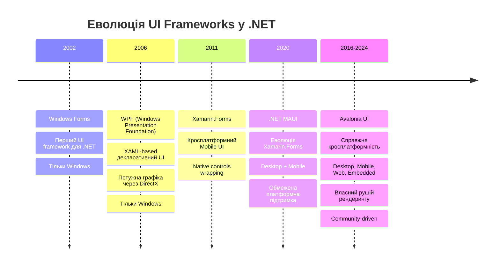
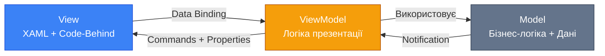
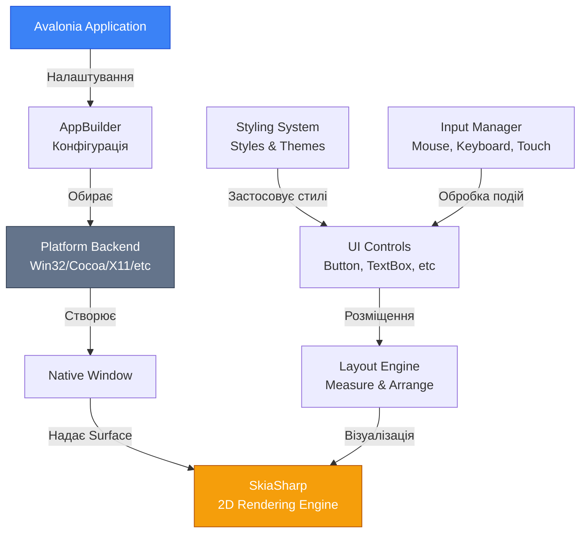
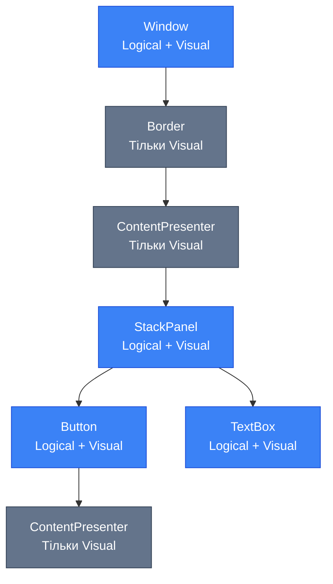
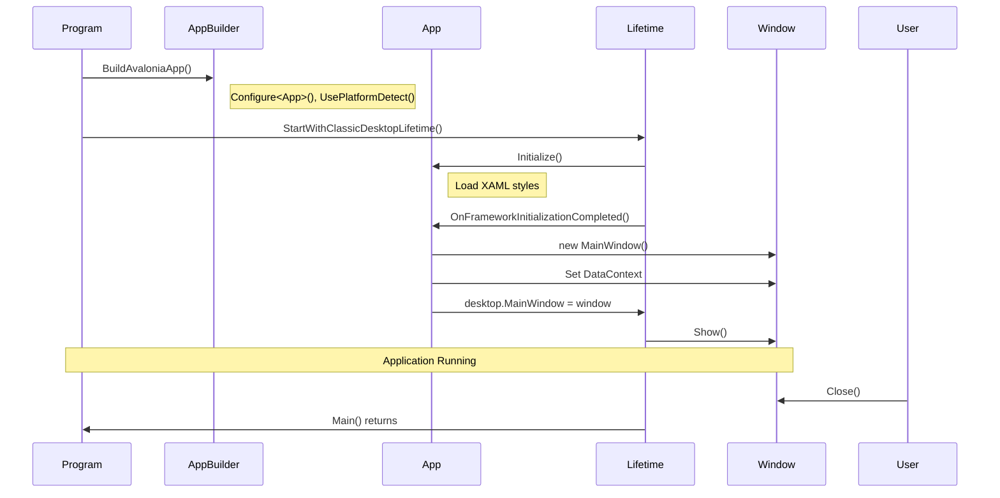

# Вступ та Налаштування Avalonia UI

## Вступ: Навіщо Нам Потрібен Ще Один UI Framework?

Уявіть ситуацію: ви створили чудовий застосунок для Windows, але тепер вам потрібно запустити його на macOS, Linux, а можливо навіть на мобільних платформах або у веб-браузері. Традиційний шлях вимагав би повного переписування інтерфейсу для кожної платформи. Саме цю проблему і вирішує **Avalonia UI** (Avalonia User Interface) — сучасний кросплатформний UI framework для .NET.

### Еволюція Desktop UI у .NET Екосистемі

Щоб зрозуміти місце Avalonia в екосистемі .NET, розгляньмо історичний контекст:

::mermaid



::

Кожен з цих frameworks мав свої переваги та обмеження. **Avalonia UI** вирішив ключову проблему: як створити **один** інтерфейс, який працюватиме **всюди** з **консистентною** поведінкою.

### Мотивація: "Write Once, Run Anywhere" Для UI

> "Чому ми не можемо написати UI один раз і запустити його на всіх платформах?"

Саме це питання стояло перед розробниками Avalonia. Відповіддю став framework, який:

-   **Не залежить від нативних контролів** операційної системи
-   **Малює UI самостійно** використовуючи SkiaSharp (потужну 2D графічну бібліотеку)
-   **Надає консистентний look & feel** на всіх платформах
-   **Дозволяє кастомізацію** на рівні, недосяжному для систем з нативними контролями

### Цілі Цього Розділу

Після завершення цього розділу ви зможете:

1. ✅ Розуміти архітектуру Avalonia та як вона працює "під капотом"
2. ✅ Пояснити відмінності між Avalonia, WPF та MAUI
3. ✅ Налаштувати середовище розробки для Avalonia
4. ✅ Створити та запустити свій перший Avalonia застосунок
5. ✅ Розуміти життєвий цикл Avalonia застосунку
6. ✅ Використовувати Live Preview для швидкої розробки

::tip
**Увага для новачків у Desktop розробці:** Якщо ви раніше працювали тільки з веб або консольними застосунками, не хвилюйтесь! Avalonia має схожості з веб-розробкою (XAML нагадує HTML, стилі схожі на CSS), тому багато концепцій будуть вам знайомими.
::

---

## Фундаментальні Концепції

### Що Таке Avalonia UI?

**Avalonia UI** — це **безкоштовний**, **відкритий** (MIT ліцензія) та **кросплатформний UI framework** для .NET, який дозволяє створювати графічні застосунки з використанням **XAML** (eXtensible Application Markup Language) та **C#**.

**Ключові характеристики:**

| Характеристика           | Опис                                                                               |
| :----------------------- | :--------------------------------------------------------------------------------- |
| **Кросплатформність**    | Windows, macOS, Linux, iOS, Android, WebAssembly, Embedded (Raspberry Pi, DRM/KMS) |
| **Рушій рендерингу**     | SkiaSharp (cross-platform 2D graphics library від Google)                          |
| **Мова розмітки**        | XAML (декларативний опис UI)                                                       |
| **Архітектурний патерн** | MVVM (Model-View-ViewModel) — рекомендований, але не обов'язковий                  |
| **Styled Properties**    | Власна система властивостей, схожа на WPF Dependency Properties                    |
| **Ліцензія**             | MIT (повністю безкоштовно для комерційного використання)                           |

### Кросплатформна Природа

На відміну від інших frameworks, Avalonia підтримує **найширший спектр платформ**:

::tabs
::tabs-item{label="Desktop"}

-   **Windows** (7, 8, 10, 11) — Win32 API
-   **macOS** (10.13+) — Cocoa API
-   **Linux** — X11, Wayland (preview), Framebuffer (DRM/KMS для embedded)

Один код працює на всіх цих платформах без змин!
::

::tabs-item{label="Mobile"}

-   **iOS** (11.0+)
-   **Android** (API 21+, Android 5.0+)

Повна інтеграція з мобільними API через platform-specific код.
::

::tabs-item{label="Web"}

-   **WebAssembly** (WASM)

Ваш Avalonia застосунок може працювати безпосередньо у браузері!
::

::tabs-item{label="Embedded"}

-   **Raspberry Pi** (Linux Framebuffer)
-   **DRM/KMS** (Direct Rendering Manager / Kernel Mode Setting)

Для кіосків, POS-терміналів, IoT пристроїв.
::
::

::note
**Важливо:** На відміну від MAUI, який використовує нативні контроли кожної платформи, Avalonia **малює UI самостійно**. Це означає, що ваш Button на Windows виглядатиме **так само**, як на macOS або Linux (якщо ви не застосуєте platform-specific стилізацію).
::

### Порівняння з Іншими Frameworks

Розгляньмо детальне порівняння Avalonia з іншими популярними UI frameworks:

| Критерій             | WPF                        | .NET MAUI                               | Avalonia UI                                         |
| :------------------- | :------------------------- | :-------------------------------------- | :-------------------------------------------------- |
| **Платформи**        | Тільки Windows             | Windows, macOS (Catalyst), iOS, Android | Windows, macOS, Linux, iOS, Android, WASM, Embedded |
| **Рушій рендерингу** | DirectX (Windows)          | Нативні контроли ОС                     | SkiaSharp (власний рендеринг)                       |
| **Look & Feel**      | Windows-native             | Platform-native (різний на кожній ОС)   | Консистентний (однаковий всюди)                     |
| **XAML**             | ✅ Так (оригінальний)      | ✅ Так (спрощений)                      | ✅ Так (розширений, схожий на WPF)                  |
| **Кастомізація UI**  | Висока                     | Середня (обмежена нативними контролами) | Дуже висока (повний контроль)                       |
| **Продуктивність**   | Висока (на Windows)        | Залежить від платформи                  | Висока (власний рендеринг оптимізований)            |
| **Community**        | Офіційний Microsoft        | Офіційний Microsoft                     | Community-driven (активна спільнота)                |
| **Ліцензія**         | Proprietary (частина .NET) | MIT (частина .NET)                      | MIT (повністю відкритий)                            |
| **Linux підтримка**  | ❌ Ні                      | ❌ Ні                                   | ✅ Так (нативна)                                    |
| **Browser (WASM)**   | ❌ Ні                      | ❌ Ні (є Blazor, але це інше)           | ✅ Так                                              |

::tip
**Коли обирати Avalonia?**

-   Потрібна **справжня** кросплатформність (включаючи Linux)
-   Важливий **консистентний UI** на всіх платформах
-   Потрібен **повний контроль** над рендерингом та стилізацією
-   Ви вже знайомі з **WPF** і хочете перенести досвід на інші платформи
-   Потрібна підтримка **embedded/IoT** сценаріїв

::

::warning
**Коли MAUI може бути кращим вибором?**

-   Потрібен **platform-native** вигляд (кнопки iOS виглядають як iOS, Android як Android)
-   Критично важлива офіційна підтримка від Microsoft
-   Працюєте тільки з Windows/macOS/iOS/Android (без Linux/WASM)

::

### XAML-Based UI vs Code-Based UI

Avalonia підтримує **два підходи** до створення інтерфейсу:

**1. XAML-Based (Декларативний підхід) — Рекомендований**

```xml [MainWindow.axaml] showLineNumbers
<Window xmlns="https://github.com/avaloniaui"
        xmlns:x="http://schemas.microsoft.com/winfx/2006/xaml"
        x:Class="MyApp.MainWindow"
        Title="Hello Avalonia"
        Width="400" Height="300">

    <StackPanel Margin="20">
        <TextBlock Text="Введіть ваше ім'я:" />
        <TextBox x:Name="NameTextBox" Margin="0,10" />
        <Button Content="Привітати" Click="OnGreetClick" />
        <TextBlock x:Name="GreetingText" FontSize="18" Foreground="Blue" />
    </StackPanel>

</Window>
```

**Переваги XAML:**

-   ✅ Візуальна структура UI зрозуміла з першого погляду
-   ✅ Підтримка **Live Preview** в IDE (миттєвий перегляд змін)
-   ✅ **Separation of Concerns** (розділення UI і логіки)
-   ✅ Інтеграція з **Data Binding** та **MVVM**
-   ✅ Designer tools (візуальне редагування)

**2. Code-Based (Імперативний підхід)**

```csharp [MainWindow.axaml.cs] showLineNumbers
public partial class MainWindow : Window
{
    public MainWindow()
    {
        Width = 400;
        Height = 300;
        Title = "Hello Avalonia";

        var nameTextBox = new TextBox { Margin = new Thickness(0, 10) };
        var greetingText = new TextBlock { FontSize = 18, Foreground = Brushes.Blue };

        var button = new Button { Content = "Привітати" };
        button.Click += (s, e) =>
        {
            greetingText.Text = $"Привіт, {nameTextBox.Text}!";
        };

        var stack = new StackPanel
        {
            Margin = new Thickness(20),
            Children =
            {
                new TextBlock { Text = "Введіть ваше ім'я:" },
                nameTextBox,
                button,
                greetingText
            }
        };

        Content = stack;
    }
}
```

**Переваги Code-Based:**

-   ✅ Повний контроль через C#
-   ✅ Легше для програмістів без досвіду з XAML
-   ✅ Динамічна генерація UI в runtime
-   ✅ Краща підтримка IntelliSense

::note
**Для новачків:** Ми рекомендуємо почати з **XAML-based** підходу, оскільки він краще інтегрується з інструментами розробки та є стандартом в Avalonia/WPF спільноті.
::

### MVVM Pattern як Основа Архітектури

**MVVM** (Model-View-ViewModel) — це рекомендований архітектурний патерн для Avalonia застосунків.

::mermaid



::

**Компоненти MVVM:**

-   **Model** — бізнес-логіка, доступ до даних, entities
-   **View** — XAML розмітка, візуальне представлення
-   **ViewModel** — "посередник" між View та Model, містить UI логіку

**Чому MVVM важливий для Avalonia?**

1. **Data Binding** — автоматична синхронізація даних між View та ViewModel
2. **Testability** — ViewModel легко тестувати без UI
3. **Separation of Concerns** — кожен компонент має свою відповідальність
4. **Designer Support** — можна передивлятись UI з mock даними

::tip
Avalonia не нав'язує MVVM — ви можете використовувати **code-behind**, **MVC**, або будь-який інший патерн. Однак MVVM найкраще розкриває можливості фреймворку.
::

---

## Архітектура та Механіка

Тепер, коли ми розуміємо "навіщо" потрібен Avalonia, давайте розберемо "як" він працює під капотом.

### Як Працює Avalonia: Архітектурний Огляд

::mermaid



::

**Ключові компоненти архітектури:**

#### 1. **SkiaSharp — Серце Рендерингу**

**SkiaSharp** — це .NET обгортка навколо **Skia** (2D графічної бібліотеки від Google, яка використовується в Chrome, Android, Flutter).

**Чому Skia?**

-   ✅ **Кросплатформна** — працює однаково на всіх ОС
-   ✅ **Швидка** — hardware-accelerated рендеринг (GPU)
-   ✅ **Потужна** — підтримка векторної графіки, складних ефектів, анімацій
-   ✅ **Перевірена** — використовується мільярдами пристроїв через Android

**Як це працює:**

1. Avalonia **описує UI** через controls (Button, TextBox, etc.)
2. Layout Engine **обчислює позиції** та розміри
3. Rendering System **перетворює controls у графічні примітиви** (rectangles, paths, text)
4. SkiaSharp **малює** ці примітиви на canvas
5. Canvas **відображається** у нативному вікні ОС

::code-group

```csharp [Псевдокод Рендерингу] showLineNumbers
// Це спрощена ілюстрація того, як Avalonia малює Button

public class Button : Control
{
    public override void Render(DrawingContext context)
    {
        // 1. Малюємо фон кнопки
        context.DrawRectangle(
            brush: Background,
            pen: new Pen(BorderBrush),
            rect: new Rect(0, 0, Width, Height),
            radiusX: CornerRadius.TopLeft,
            radiusY: CornerRadius.TopRight
        );

        // 2. Малюємо текст
        context.DrawText(
            foreground: Foreground,
            origin: new Point(Padding.Left, Padding.Top),
            text: Content?.ToString()
        );
    }
}

// SkiaSharp під капотом перетворює це в команди для GPU
```

```csharp [Використання SkiaSharp (Low-Level)] showLineNumbers
// Приклад прямого використання Skia (рідко потрібно в Avalonia)

using SkiaSharp;

public void DrawCustomShape(SKCanvas canvas)
{
    using var paint = new SKPaint
    {
        Color = SKColors.Blue,
        IsAntialias = true,
        Style = SKPaintStyle.Fill
    };

    // Малюємо коло
    canvas.DrawCircle(x: 100, y: 100, radius: 50, paint);
}
```

::

::note
**Важливо:** Ви **рідко** будете працювати безпосередньо з SkiaSharp в Avalonia. Фреймворк надає високорівневі контроли, а Skia працює "під капотом".
::

#### 2. **Windowing Protocol — Абстракція Платформ**

Avalonia використовує **Platform Abstraction Layer** для роботи з нативними вікнами різних ОС:

| Платформа           | Windowing API    | Опис                                   |
| :------------------ | :--------------- | :------------------------------------- |
| **Windows**         | Win32 API        | Створення вікон через `CreateWindowEx` |
| **macOS**           | Cocoa (NSWindow) | Objective-C runtime integration        |
| **Linux (X11)**     | Xlib/XCB         | X Window System protocol               |
| **Linux (Wayland)** | Wayland Protocol | Сучасна альтернатива X11 (preview)     |
| **iOS**             | UIKit (UIWindow) | Інтеграція з iOS lifecycle             |
| **Android**         | Android Views    | Activity-based windowing               |
| **WASM**            | Browser Canvas   | HTML5 Canvas API                       |

**Як це працює:**

```csharp [Абстракція Платформи (Спрощено)] showLineNumbers {5,9,13}
// Avalonia визначає інтерфейс для вікна
public interface IWindowImpl
{
    void Show();
    void SetTitle(string title);
    void Resize(Size size);
}

// Кожна платформа надає свою реалізацію
public class Win32WindowImpl : IWindowImpl
{
    private IntPtr _hwnd; // Windows window handle

    public void SetTitle(string title)
    {
        // Викликаємо Win32 API
        SetWindowText(_hwnd, title);
    }
}

public class CocoaWindowImpl : IWindowImpl
{
    private NSWindow _nsWindow; // macOS window

    public void SetTitle(string title)
    {
        // Викликаємо Cocoa API
        _nsWindow.Title = title;
    }
}

// Ваш код працює з абстракцією, не знаючи про платформу
window.Title = "My App"; // Працює на всіх ОС!
```

::tip
**Для розробника це означає:** Ви пишете код **один раз**, а Avalonia автоматично викликає правильні нативні API для кожної платформи.
::

#### 3. **Visual Tree та Logical Tree**

Avalonia (як і WPF) має **дві ієрархії елементів**:

**Logical Tree** — структура ваших контролів, як ви описали в XAML:

```xml
<Window>
    <StackPanel>
        <Button />
        <TextBox />
    </StackPanel>
</Window>
```

**Visual Tree** — фактична структура рендерингу (включає внутрішні елементи контролів):

```
Window
└── Border (частина Window template)
    └── ContentPresenter
        └── StackPanel
            ├── Button
            │   └── ContentPresenter (внутрішня частина Button)
            │       └── TextBlock (Content кнопки)
            └── TextBox
                ├── Border (фон TextBox)
                └── TextPresenter (текстовий рендерер)
```

::mermaid



::

**Навіщо дві ієрархії?**

-   **Logical Tree** — для **вашої логіки** (navigation, data binding)
-   **Visual Tree** — для **рендерингу та стилізації** (themes, animations)

::note
**Практичне значення:** Коли ви шукаєте елемент (наприклад, через `FindControl`), ви працюєте з Logical Tree. Коли застосовується тема, вона модифікує Visual Tree.
::

---

## Налаштування Середовища Розробки

Перед тим як створити перший Avalonia застосунок, потрібно налаштувати середовище розробки.

### Вимоги до Системи

::tabs
::tabs-item{label="Windows"}

-   **ОС:** Windows 7 SP1 або новіша (рекомендовано Windows 10/11)
-   **.NET SDK:** .NET 6.0 або новіший (рекомендовано .NET 8.0)
-   **RAM:** Мінімум 4 GB (рекомендовано 8 GB+)
-   **IDE:** Visual Studio 2022 / JetBrains Rider / VS Code

::

::tabs-item{label="macOS"}

-   **ОС:** macOS 10.13 (High Sierra) або новіша
-   **.NET SDK:** .NET 6.0 або новіший
-   **Xcode:** Для iOS розробки (опціонально)
-   **IDE:** JetBrains Rider (рекомендовано) / VS Code / Visual Studio for Mac

::

::tabs-item{label="Linux"}

-   **ОС:** Ubuntu 20.04+, Fedora 36+, Debian 11+, або інші сучасні дистрибутиви
-   **.NET SDK:** .NET 6.0 або новіший
-   **X11 або Wayland:** Для Desktop застосунків
-   **IDE:** JetBrains Rider (рекомендовано) / VS Code
-   **Залежності:** `libx11-dev`, `libxrandr-dev` (зазвичай вже встановлені)

::

::

### Встановлення .NET SDK

Якщо у вас ще не встановлений .NET SDK:

::steps

#### Завантаження SDK

Перейдіть на офіційний сайт: [https://dotnet.microsoft.com/download](https://dotnet.microsoft.com/download)

Оберіть **.NET 8.0 SDK** (або новішу версію).

#### Встановлення

::tabs
::tabs-item{label="Windows"}
Запустіть завантажений `.exe` інсталятор та слідуйте інструкціям.
::

::tabs-item{label="macOS"}
Відкрийте завантажений `.pkg` файл або використайте Homebrew:

```bash
brew install dotnet-sdk
```

::

::tabs-item{label="Linux (Ubuntu/Debian)"}

```bash
wget https://dot.net/v1/dotnet-install.sh
chmod +x dotnet-install.sh
sudo ./dotnet-install.sh --channel 8.0
```

Або через package manager:

```bash
sudo apt-get update
sudo apt-get install -y dotnet-sdk-8.0
```

::
::

#### Перевірка Встановлення

Відкрийте термінал/командний рядок та виконайте:

```bash
dotnet --version
```

Ви маєте побачити версію SDK (наприклад, `8.0.100`).

::

### Встановлення Avalonia Templates

Avalonia надає **офіційні шаблони проєктів** через .NET CLI.

```bash
dotnet new install Avalonia.Templates
```

**Що це робить:**

-   Додає шаблони Avalonia до `dotnet new`
-   Дозволяє створювати проєкти з командного рядка
-   Оновлює існуючі шаблони (якщо вже встановлені)

**Перевірка встановлення:**

```bash
dotnet new list | grep -i avalonia
```

Ви маєте побачити список доступних шаблонів:

```
avalonia.app              Avalonia .NET App
avalonia.mvvm             Avalonia .NET MVVM App
avalonia.xplat            Avalonia Cross-Platform Application
avalonia.usercontrol      Avalonia UserControl
avalonia.window           Avalonia Window
avalonia.resource         Avalonia Resource Dictionary
avalonia.styles           Avalonia Styles
```

::tip
**Найважливіші шаблони:**

-   `avalonia.mvvm` — для Desktop застосунків з MVVM (рекомендовано для навчання)
-   `avalonia.xplat` — для Multi-platform застосунків (Desktop + Mobile + Web)
-   `avalonia.app` — простий Desktop застосунок без MVVM

::

### Налаштування IDE

Avalonia підтримує три основні IDE. Розгляньмо кожен:

::tabs
::tabs-item{label="JetBrains Rider (Рекомендовано)"}

**Чому Rider?**

-   ✅ **Найкраща підтримка Avalonia** (нативна, без розширень)
-   ✅ **Потужний XAML IntelliSense**
-   ✅ **Live Preview** з Hot Reload
-   ✅ **Кросплатформний** (Windows, macOS, Linux)
-   ✅ **Вбудований дебаггер** XAML

**Встановлення:**

1. Завантажте Rider: [https://www.jetbrains.com/rider/download/](https://www.jetbrains.com/rider/download/)
2. Встановіть та запустіть
3. **Avalonia підтримка вбудована** — додаткових плагінів не потрібно!

**Перша конфігурація:**

-   При створенні Avalonia проєкту Rider автоматично визначить його
-   Live Preview активується автоматично при відкритті `.axaml` файлів


<!-- Search Query: "JetBrains Rider Avalonia XAML Live Preview demonstration" -->

::tip
Студентам та викладачам доступна **безкоштовна ліцензія** через [JetBrains Education Program](https://www.jetbrains.com/community/education/).
::

::

::tabs-item{label="Visual Studio 2022"}

**Переваги:**

-   ✅ Безкоштовний (Community Edition)
-   ✅ Потужна підтримка .NET
-   ✅ Інтеграція з Azure та іншими Microsoft сервісами

**Недоліки:**

-   ⚠️ Тільки для Windows
-   ⚠️ Avalonia підтримка через розширення (не так потужна як Rider)

**Встановлення:**

1. Завантажте Visual Studio 2022: [https://visualstudio.microsoft.com/](https://visualstudio.microsoft.com/)
2. При встановленні оберіть workload: **.NET desktop development**

3. Встановіть **Avalonia for Visual Studio** extension:
    - `Extensions` → `Manage Extensions`
    - Пошук: "Avalonia for Visual Studio 2022"
    - Натисніть `Download` та перезапустіть VS


<!-- Search Query: "Visual Studio 2022 installing Avalonia extension step by step" -->

**Використання Live Preview:**

-   Подвійний клік на `.axaml` файл
-   XAML Previewer має відкритись автоматично
-   Якщо замість Avalonia Previewer бачите WPF Designer, правий клік → `Open With...` → `Avalonia XAML Editor`

::

::tabs-item{label="Visual Studio Code"}

**Переваги:**

-   ✅ Безкоштовний та легкий
-   ✅ Кросплатформний
-   ✅ Швидкий

**Недоліки:**

-   ⚠️ Базова підтримка Avalonia
-   ⚠️ Live Preview обмежений
-   ⚠️ Менше tools порівняно з Rider/VS

**Встановлення:**

1. Завантажте VS Code: [https://code.visualstudio.com/](https://code.visualstudio.com/)

2. Встановіть розширення:
    - **C# Dev Kit** (Microsoft)
    - **Avalonia for VSCode** (AvaloniaUI)

```bash
code --install-extension ms-dotnettools.csdevkit
code --install-extension AvaloniaTeam.vscode-avalonia
```

3. Налаштуйте XAML Previewer:
    - Відкрийте `.axaml` файл
    - `Ctrl+Shift+P` → `Avalonia: Preview XAML`

::note
**Для новачків:** Якщо бюджет дозволяє, **Rider** — найкращий вибір для Avalonia розробки. Якщо потрібне безкоштовне рішення, **Visual Studio 2022** (Windows) краще підходить ніж VS Code.
::

::
::

### Перевірка Встановлення

Давайте переконаємось, що все налаштовано правильно:

```bash
# 1. Перевірка .NET SDK
dotnet --version

# 2. Перевірка Avalonia Templates
dotnet new list | grep avalonia

# 3. Створення тестового проєкту
dotnet new avalonia.mvvm -o AvaloniaTest
cd AvaloniaTest

# 4. Запуск проєкту
dotnet run
```

Якщо все налаштовано коректно, має відкритися вікно з написом "Welcome to Avalonia!".


<!-- Search Query: "Default Avalonia MVVM template application running screenshot" -->

---

## Створення Першого Проєкту

Тепер, коли середовище налаштоване, створимо наш перший Avalonia застосунок та детально розберемо його структуру.

### Використання `dotnet new avalonia`

Avalonia надає кілька шаблонів. Почнемо з **MVVM template**, оскільки він демонструє рекомендовану архітектуру.

::steps

#### Створення Проєкту

Відкрийте термінал у папці, де хочете створити проєкт:

```bash
dotnet new avalonia.mvvm -o MyFirstAvaloniaApp
```

**Параметри:**

-   `avalonia.mvvm` — шаблон з MVVM архітектурою
-   `-o MyFirstAvaloniaApp` — назва директорії проєкту

#### Навігація до Проєкту

```bash
cd MyFirstAvaloniaApp
```

#### Відкриття в IDE

::tabs
::tabs-item{label="Rider"}

```bash
rider .
```

Або: `File` → `Open` → оберіть папку `MyFirstAvaloniaApp`
::

::tabs-item{label="Visual Studio"}
Подвійний клік на `MyFirstAvaloniaApp.sln`
::

::tabs-item{label="VS Code"}

```bash
code .
```

::
::

::

### Структура Створеного Проєкту

Давайте детально розберемо структуру згенерованого проєкту:

::code-tree

```plaintext [Структура Проєкту]
MyFirstAvaloniaApp/
├── App.axaml                  # Application XAML (стилі, ресурси)
├── App.axaml.cs               # Application code-behind (lifecycle)
├── Program.cs                 # Entry point (Main method)
├── ViewLocator.cs             # MVVM helper (зв'язує Views з ViewModels)
├── Assets/                    # Ресурси (зображення, шрифти, іконки)
│   └── avalonia-logo.ico
├── Models/                    # Domain models (бізнес-логіка)
├── ViewModels/                # ViewModels (презентаційна логіка)
│   ├── MainWindowViewModel.cs
│   └── ViewModelBase.cs
├── Views/                     # Views (XAML розмітка)
│   └── MainWindow.axaml
│   └── MainWindow.axaml.cs
└── MyFirstAvaloniaApp.csproj  # MSBuild project file
```

::

Розгляньмо кожен ключовий файл детально:

#### 1. `Program.cs` — Точка Входу

Це стандартна точка входу для будь-якого .NET застосунку.

```csharp [Program.cs] showLineNumbers
using Avalonia;
using System;

namespace MyFirstAvaloniaApp;

class Program
{
    // Initialization code. Don't use any Avalonia, third-party APIs or any
    // SynchronizationContext-reliant code before AppMain is called: things aren't initialized
    // yet and stuff might break.
    [STAThread]
    public static void Main(string[] args) => BuildAvaloniaApp()
        .StartWithClassicDesktopLifetime(args);

    // Avalonia configuration, don't remove; also used by visual designer.
    public static AppBuilder BuildAvaloniaApp()
        => AppBuilder.Configure<App>()
            .UsePlatformDetect()
            .WithInterFont()
            .LogToTrace()
            .UseReactiveUI();
}
```

**Аналіз коду:**

-   `Main`: Викликає `BuildAvaloniaApp()` і стартує життєвий цикл `ClassicDesktopLifetime` (стандартний для Desktop).
-   `BuildAvaloniaApp`:
    -   `Configure<App>()`: Вказує, який клас Application використовувати.
    -   `UsePlatformDetect()`: Магія, яка визначає ОС (Windows, Linux, macOS) і завантажує відповідні підсистеми.
    -   `WithInterFont()`: Вмикає вбудований кросплатформний шрифт (щоб текст виглядав однаково всюди).
    -   `LogToTrace()`: Логування помилок у вікно Output IDE.
    -   `UseReactiveUI()`: Підключає ReactiveUI (оскільки ми обрали MVVM шаблон).

#### 2. `App.axaml` та `App.axaml.cs` — Глобальна Конфігурація

**App.axaml (XAML):** Тут визначаються глобальні стилі та ресурси.

```xml [App.axaml]
<Application xmlns="https://github.com/avaloniaui"
             xmlns:x="http://schemas.microsoft.com/winfx/2006/xaml"
             x:Class="MyFirstAvaloniaApp.App"
             RequestedThemeVariant="Default">
             <!-- "Default" detected from system theme (Light or Dark) -->

    <Application.Styles>
        <FluentTheme />
    </Application.Styles>
</Application>
```

-   `FluentTheme`: Вмикає сучасний стиль (схожий на Windows 11), який чудово виглядає на всіх платформах.
-   `RequestedThemeVariant`: Може бути `Default` (системна), `Light` або `Dark`.

**App.axaml.cs (Code-behind):** Тут відбувається ініціалізація.

```csharp [App.axaml.cs] showLineNumbers
public override void OnFrameworkInitializationCompleted()
{
    if (ApplicationLifetime is IClassicDesktopStyleApplicationLifetime desktop)
    {
        // Desktop startup logic
        desktop.MainWindow = new MainWindow
        {
            DataContext = new MainWindowViewModel(),
        };
    }
    // Mobile/Plugin startup logic (optional)
    /*
    else if (ApplicationLifetime is ISingleViewApplicationLifetime singleViewPlatform)
    {
        singleViewPlatform.MainView = new MainView
        {
            DataContext = new MainViewModel()
        };
    }
    */

    base.OnFrameworkInitializationCompleted();
}
```

**Важливий момент:** `OnFrameworkInitializationCompleted` — це місце, де ви вирішуєте, **що** показати користувачу.

-   Якщо це Desktop (`IClassicDesktopStyleApplicationLifetime`) — ми створюємо `MainWindow`.
-   Ми також встановлюємо `DataContext` (зв'язуємо ViewModel з View).

#### 3. `ViewLocator.cs` — Магія MVVM

Цей клас допомагає Avalonia знаходити View для кожної ViewModel.

```csharp
// Якщо у вас є MyViewModel, ViewLocator шукатиме MyView
// Це дозволяє писати у XAML просто <ContentControl Content="{Binding CurrentViewModel}" />
```

---

## Application Lifecycle (Життєвий Цикл)

Розуміння життєвого циклу критично важливе для уникнення помилок при старті та закритті.

### Схема Запуску

::mermaid



::

### Application Lifetimes

Avalonia підтримує різні моделі життя, щоб працювати і на Desktop (де є вікна), і на Mobile (де є тільки один екран/View).

| Інтерфейс                                 | Платформи             | Опис                                                                                                     |
| :---------------------------------------- | :-------------------- | :------------------------------------------------------------------------------------------------------- |
| `IClassicDesktopStyleApplicationLifetime` | Windows, macOS, Linux | Класичний десктоп. Є доступ до `MainWindow`, списку `Windows`, та подій `Exit`.                          |
| `ISingleViewApplicationLifetime`          | Android, iOS, Browser | Мобільний/Веб стиль. Немає вікон, є тільки `MainView`. При зміні сторінок змінюється контент `MainView`. |
| `IControlledApplicationLifetime`          | Headless, Console     | Для тестів або специфічних сценаріїв без UI.                                                             |

::warning
**Типова помилка новачка:** Намагатися звернутися до `desktop.MainWindow` в мобільному застосунку. Це призведе до краху, бо `ApplicationLifetime` буде іншого типу. Завжди перевіряйте тип через `is` (як у прикладі `App.axaml.cs`).
::

---

## Перший Запуск та Live Preview

Прийшов час побачити результат!

1. Натисніть `Run` (або `F5`) у вашій IDE.
2. Зачекайте компіляції.
3. Вуаля! Ви маєте працюючий кросплатформний застосунок.

### Використання Hot Reload (Live Preview)

Одна з найсильніших сторін Avalonia — можливість бачити зміни UI **без перезапуску**, прямо під час написання коду.

::steps

#### Відкрийте `MainWindow.axaml`

Знайдіть цей файл у папці `Views`.

#### Запустіть застосунок (якщо ще ні)

Або просто відкрийте Preview панель в Rider/Visual Studio.

#### Змініть текст

Знайдіть рядок:

```xml
<TextBlock Text="{Binding Greeting}" HorizontalAlignment="Center" VerticalAlignment="Center"/>
```

Змініть на:

```xml
<TextBlock Text="Hello from Hot Reload!" Foreground="Red" FontSize="30" ... />
```

#### Спостерігайте магію

Зміни мають відобразитися **миттєво** у вікні Previewer або навіть у запущеному застосунку (залежно від налаштувань).

::


<!-- Search Query: "Avalonia UI Hot Reload demonstration visual studio rider" -->

---

## "Hello, Avalonia!" — Перша Модифікація

Давайте перетворимо стандартний шаблон на щось інтерактивне. Ми створимо простий лічильник кліків, щоб зрозуміти, як працює зв'язок між UI та кодом.

### Крок 1: Зміна View (`Views/MainWindow.axaml`)

Ми змінимо XAML, додавши кнопку і текстовий блок для відображення лічильника. Зверніть увагу на використання `Binding`.

```xml [Views/MainWindow.axaml] showLineNumbers
<Window xmlns="https://github.com/avaloniaui"
        xmlns:x="http://schemas.microsoft.com/winfx/2006/xaml"
        xmlns:vm="using:MyFirstAvaloniaApp.ViewModels"
        x:Class="MyFirstAvaloniaApp.Views.MainWindow"
        x:DataType="vm:MainWindowViewModel"
        Icon="/Assets/avalonia-logo.ico"
        Title="MyFirstAvaloniaApp">

    <Design.DataContext>
        <vm:MainWindowViewModel/>
    </Design.DataContext>

    <!-- StackPanel розміщує елементи один під одним -->
    <StackPanel Margin="30" Spacing="20" HorizontalAlignment="Center" VerticalAlignment="Center">

        <TextBlock Text="{Binding Greeting}"
                   HorizontalAlignment="Center"
                   FontSize="24"/>

        <!-- Прив'язка до властивості CountString -->
        <TextBlock Text="{Binding CountString}"
                   HorizontalAlignment="Center"
                   FontSize="40"
                   FontWeight="Bold"
                   Foreground="#6366f1"/>

        <!-- Прив'язка команди до кнопки -->
        <Button Command="{Binding IncrementCommand}"
                Content="Натисни мене!"
                HorizontalAlignment="Center"
                Padding="20,10"
                FontSize="16"/>

    </StackPanel>

</Window>
```

**Аналіз змін:**

-   `x:DataType="vm:MainWindowViewModel"`: Ця директива вмикає **Compiled Bindings**. Це критично важливо, бо дозволяє IDE перевіряти назви властивостей (наприклад, `Greeting`) під час компіляції, а не падати в runtime, якщо ви зробили одруківку.
-   `{Binding CountString}`: Каже Avalonia взяти значення з властивості `CountString` у ViewModel.
-   `Command="{Binding IncrementCommand}"`: Каже виконувати метод `Increment` при кліку. Це "чистіший" спосіб, ніж `Click="Button_OnClick"`, бо логіка залишається у ViewModel.

### Крок 2: Зміна ViewModel (`ViewModels/MainWindowViewModel.cs`)

Тепер додамо логіку в ViewModel. Оскільки шаблон використовує пакет `CommunityToolkit.Mvvm`, ми можемо писати дуже лаконічний код.

```csharp [ViewModels/MainWindowViewModel.cs] showLineNumbers
using CommunityToolkit.Mvvm.ComponentModel;
using CommunityToolkit.Mvvm.Input;

namespace MyFirstAvaloniaApp.ViewModels;

public partial class MainWindowViewModel : ViewModelBase
{
    // [ObservableProperty] автоматично генерує публічну властивість Greeting
    // та реалізує сповіщення про зміни (INotifyPropertyChanged).
    // Поле _greeting стає властивістю Greeting.
    [ObservableProperty]
    private string _greeting = "Welcome to Avalonia!";

    // Лічильник. Коли він змінюється, ми також хочемо оновити рядок CountString.
    [ObservableProperty]
    [NotifyPropertyChangedFor(nameof(CountString))]
    private int _count = 0;

    // Властивість, яка залежить від _count.
    // Завдяки атрибуту вище, View дізнається, що CountString змінився, коли змінюється _count.
    public string CountString => $"Кліків: {Count}";

    // [RelayCommand] перетворює цей метод на ICommand, який можна прив'язати до кнопки.
    [RelayCommand]
    private void Increment()
    {
        Count++;
    }
}
```

::tip
**Магія Source Generators:** Ви можете помітити, що ми пишемо `private int _count`, а звертаємось до `Count`. Це можливо завдяки атрибуту `[ObservableProperty]`, який під час компіляції генерує код для публічної властивості `Count` з усією необхідною логікою сповіщення UI.
::

### Крок 3: Запуск та Перевірка

Запустіть застосунок. Тепер при натисканні на кнопку число має збільшуватись.


<!-- Search Query: "Avalonia UI counter app example screenshot" -->

---

## Best Practices для Початківців

Щоб ваш код залишався чистим та професійним, дотримуйтесь цих правил з самого початку:

### 1. Структура Проєкту

Тримайте файли організовано:

-   `Views/`: Тільки `.axaml` та `.axaml.cs` файли.
-   `ViewModels/`: Тільки класи ViewModel.
-   `Models/`: Бізнес-логіка та дані.
-   `Styles/`: Глобальні стилі.
-   `Services/`: Сервіси для доступу до даних, API тощо.

### 2. ViewLocator

У шаблоні проєкту ви могли помітити файл `ViewLocator.cs`. Це механізм, який дозволяє Avalonia автоматично знаходити View для ViewModel.
Наприклад, якщо у вас є список об'єктів `ProductViewModel`, ви можете просто відобразити його, а Avalonia сама підставить `ProductView` для кожного елементу.

::code-collapse

```csharp [ViewLocator.cs (Спрощено)]
public class ViewLocator : IDataTemplate
{
    public Control Build(object data)
    {
        var name = data.GetType().FullName!.Replace("ViewModel", "View");
        var type = Type.GetType(name);
        return (Control)Activator.CreateInstance(type)!;
    }
    // ...
}
```

::

### 3. Уникайте Code-Behind

Намагайтеся **не писати логіку** в файлах `.axaml.cs`.

-   ❌ **Погано:** Змінювати `TextBlock.Text` в `Button_Click` handler.
-   ✅ **Добре:** Змінювати властивість у ViewModel, до якої прив'язаний TextBlock.

### 4. Стилізація

Не пишіть стилі (кольори, шрифти) прямо в тегах `Button` чи `TextBlock`, якщо вони повторюються. Виносьте їх у `<Window.Styles>` або `App.axaml`.

---

## Troubleshooting та Поширені Проблеми

Навіть у професіоналів бувають проблеми. Ось як вирішити найпоширеніші з них на старті.

::collapsible{title="Designer (Preview) не відображається або показує помилку"}

1.  **Спробуйте перекомпілювати проєкт** (`Build -> Build Solution`). Designer потребує скомпільованих dll для відображення ваших ViewModels.
2.  Переконайтесь, що в конфігурації збірки вибрано **Debug** і **Any CPU** (або x64).
3.  Перевірте, чи немає **синтаксичних помилок у XAML**. Навіть одна зайва дужка може зламати прев'ю.
4.  Якщо використовуєте Rider, спробуйте перезапустити його (Invalidate Caches / Restart), якщо проблема персистентна.

::

::collapsible{title="Помилка: The type or namespace name 'Avalonia' could not be found"}
Це зазвичай означає, що **NuGet пакети не завантажились**.

1.  Відкрийте термінал.
2.  Виконайте `dotnet restore`.
3.  Якщо не допомагає, перевірте файл `.csproj` — чи правильні версії пакетів вказані.

::

::collapsible{title="Картинки не відображаються (File not found)"}

1.  Переконайтесь, що файл картинки додано у проєкт (зазвичай папка `Assets`).
2.  Клікніть на файл правою кнопкою -> Properties.
3.  **Build Action** має бути **AvaloniaResource** (не Resource, не Content, не EmbeddedResource).
4.  Перевірте шлях: `/Assets/image.png` — це відносний шлях від кореня проєкту.

::

::collapsible{title="Помилка при використанні [ObservableProperty]"}
Якщо компілятор "не бачить" `Greeting` (хоча є `_greeting`), переконайтесь, що:

1.  Клас `MainWindowViewModel` має модифікатор `partial`.
2.  Встановлено пакет `CommunityToolkit.Mvvm` версії 8.0 або вище.

::

---

## Практичні Завдання

Закріпіть отримані знання, виконавши завдання. Не бійтеся експериментувати!

### Рівень 1: "Кольоровий Привіт" (Легкий)

**Мета:** Робота з Binding та простими Styles.

1.  Створіть застосунок з полем вводу (`TextBox`) для імені.
2.  Додайте кнопку "Змінити колір".
3.  Нижче відобразіть текст "Привіт, [Ім'я]".
4.  При натисканні кнопки, колір тексту має змінюватись на випадковий (червоний, зелений або синій).
    -   _Підказка:_ Створіть у ViewModel властивість `Brush TextColor` і прив'яжіть її до `Foreground` у TextBlock.

### Рівень 2: "Список Справ" (Середній)

**Мета:** Робота з колекціями (`ObservableCollection`).

1.  Створіть простий **To-Do List**.
2.  Додайте `TextBox` для тексту завдання і кнопку "Додати".
3.  Використовуйте `ListBox` (або `ItemsControl`) для відображення списку.
4.  Прив'яжіть `Items` до `ObservableCollection<string>` у вашій ViewModel.
5.  _(Бонус)_ Додайте кнопку "Очистити все".

### Рівень 3: "Навігатор" (Складний)

**Мета:** Розуміння підміни контенту (симуляція навігації).

1.  Створіть дві окремі UserControl (Views): `LoginView` та `HomeView`.
2.  У `MainWindowViewModel` створіть властивість `ViewModelBase CurrentPage`.
3.  У `MainWindow` використовуйте `<ContentControl Content="{Binding CurrentPage}" />`.
4.  Зробіть так, щоб при натисканні кнопки "Login" на першому екрані, `CurrentPage` змінювалась на `HomeViewModel`.
    -   _Підказка:_ Це демонструє силу `ViewLocator`.

---

## Перевірка Знань

Перевірте, наскільки добре ви зрозуміли основи Avalonia UI.

::tally-embed{id="YOUR_FORM_ID" title="Avalonia UI Introduction Quiz"}
::

::note
**Примітка**: Якщо тест не відображається коректно, спробуйте оновити сторінку або перевірити підключення до інтернету.
::

---

## Додаткові Ресурси

-   **Офіційна Документація:** [docs.avaloniaui.net](https://docs.avaloniaui.net/) — основне джерело істини.
-   **Avalonia GitHub:** [github.com/AvaloniaUI/Avalonia](https://github.com/AvaloniaUI/Avalonia) — вихідний код та Issues.
-   **Awesome Avalonia:** [github.com/AvaloniaCommunity/awesome-avalonia](https://github.com/AvaloniaCommunity/awesome-avalonia) — добірка бібліотек.
-   **Telegram Форум:** [t.me/Avalonia](https://t.me/Avalonia) — українська та міжнародна спільнота.

Тепер ви створили свій перший Avalonia застосунок! У наступному розділі ми заглибимось у **XAML**, **Binding** та **Layouts** детальніше.

👉 **Перейти до наступної теми:** [10.2. Core Concepts (Основні Концепції)](./2.core-concepts.md)
