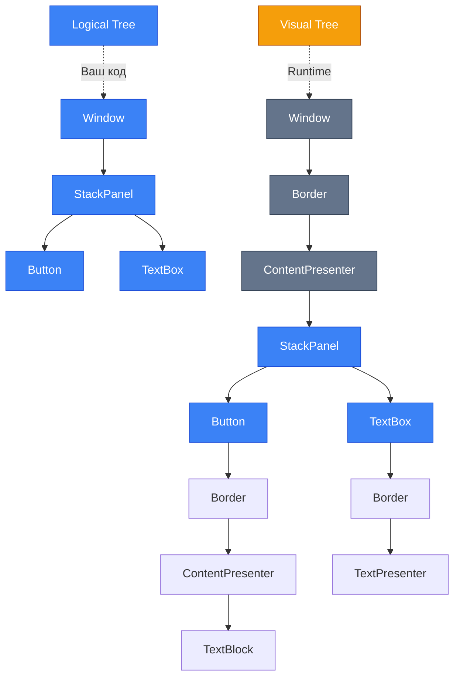
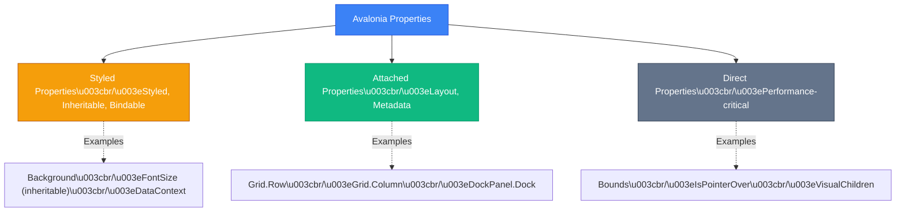
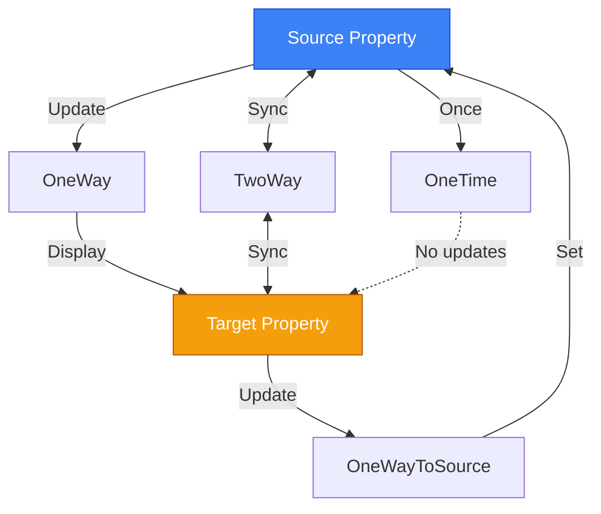
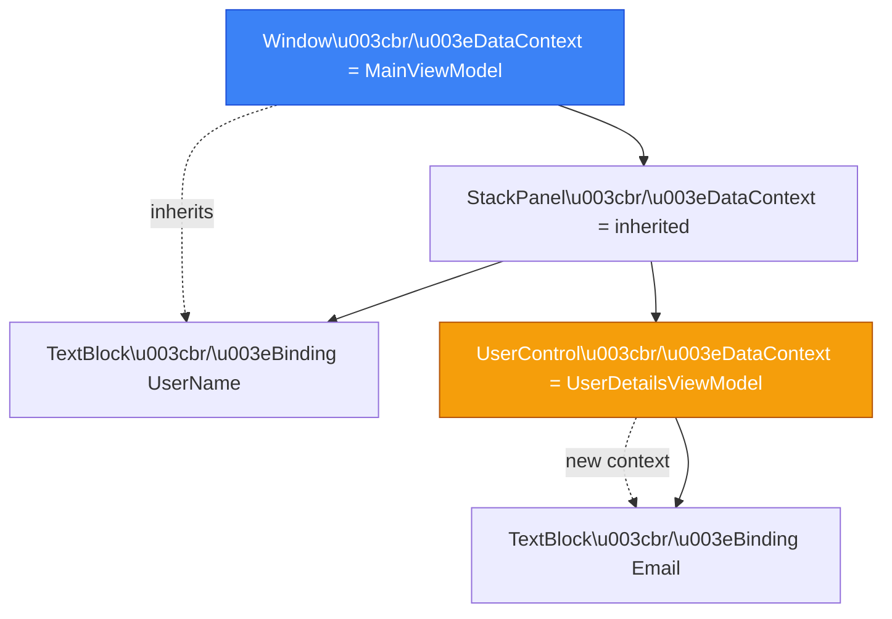

```mermaid
graph LR
    XAML[MainWindow.axaml\u003cbr/\u003eXAML файл]
    Compiler[Avalonia\u003cbr/\u003eXAML Compiler]
    Generated[MainWindow.g.cs\u003cbr/\u003eGenerated код]
    Final[Скомпільований\u003cbr/\u003eAssembly]
    
    XAML -->|Build Time| Compiler
    Compiler -->|Генерує| Generated
    Generated -->|C# Compiler| Final
    
    style XAML fill:#3b82f6,stroke:#1d4ed8,color:#ffffff
    style Compiler fill:#f59e0b,stroke:#b45309,color:#ffffff
    style Generated fill:#64748b,stroke:#334155,color:#ffffff
    style Final fill:#3b82f6,stroke:#1d4ed8,color:#ffffff
```

# Базові Концепції Avalonia UI

## Вступ: Чотири Стовпи Avalonia

Уявіть, що ви будуєте будинок. Вам потрібна **мова** для опису архітектури (креслення), **структура** для організації кімнат, **система комунікацій** (електрика, водопровід) та **механізм синхронізації** між кімнатами. 

В Avalonia UI ці чотири фундаментальні компоненти є:

1. **XAML** — декларативна мова для опису інтерфейсу
2. **Trees** (Logical Tree та Visual Tree) — структура організації елементів
3. **Properties System** — система властивостей для комунікації та стилізації
4. **Data Binding** — механізм синхронізації між UI та даними

Без розуміння цих концепцій ви будете **копіювати код**, не розуміючи його. З цим розумінням — **створювати складні UI** з впевненістю.

### Передумови

Перед вивченням цього матеріалу ви маєте:

- ✅ Знати основи C# (класи, властивості, події)
- ✅ Завершити розділ [Вступ та Налаштування](./1.introduction-setup.md)
- ✅ Мати встановлене середовище розробки з Avalonia Templates

### Цілі Розділу

Після завершення ви зможете:

1. ✅ Писати XAML розмітку з повним розумінням синтаксису
2. ✅ Пояснити різницю між Logical Tree та Visual Tree
3. ✅ Обрати правильний тип властивості (Styled/Attached/Direct)
4. ✅ Створювати reactive UI через Data Binding
5. ✅ Використовувати Compiled Bindings для максимальної продуктивності

---

## 1. XAML Basics: Мова Опису Інтерфейсу

### Проблема: Імперативний UI Код

Спочатку — **навіщо** XAML? Розгляньмо проблему.

**Імперативний підхід (C# код):**

```csharp [ImperativeUI.cs] showLineNumbers
public class MainWindow : Window
{
    public MainWindow()
    {
        var grid = new Grid();
        grid.RowDefinitions.Add(new RowDefinition { Height = GridLength.Auto });
        grid.RowDefinitions.Add(new RowDefinition { Height = GridLength.Star });
        
        var header = new TextBlock 
        { 
            Text = "Заголовок",
            FontSize = 24,
            FontWeight = FontWeight.Bold,
            Margin = new Thickness(10)
        };
        Grid.SetRow(header, 0);
        grid.Children.Add(header);
        
        var content = new TextBox 
        { 
            Margin = new Thickness(10) 
        };
        Grid.SetRow(content, 1);
        grid.Children.Add(content);
        
        Content = grid;
    }
}
```

**Проблеми:**
- ❌ Багато коду для простого UI
- ❌ Важко уявити візуальну структуру
- ❌ Змішування UI і логіки
- ❌ Немає дизайнерів/превью
- ❌ Складно підтримувати

**Декларативний підхід (XAML):**

```xml [DeclarativeUI.axaml] showLineNumbers
<Window xmlns="https://github.com/avaloniaui"
        xmlns:x="http://schemas.microsoft.com/winfx/2006/xaml">
    <Grid RowDefinitions="Auto,*">
        <TextBlock Text="Заголовок" 
                   FontSize="24" 
                   FontWeight="Bold" 
                   Margin="10" />
        <TextBox Grid.Row="1" Margin="10" />
    </Grid>
</Window>
```

**Переваги:**
- ✅ 8 рядків замість 30
- ✅ Структура очевидна з першого погляду
- ✅ Розділення UI та логіки
- ✅ Live Preview в IDE
- ✅ Легко читати та редагувати

::tip
**Аналогія:** XAML відноситься до C# як HTML до JavaScript. Можна створити весь сайт через `document.createElement()`, але HTML набагато зручніший для розмітки.
::

### Що Таке XAML?

**XAML** (eXtensible Application Markup Language, вимовляється "zammel") — це **XML-based** декларативна мова розмітки для опису об'єктів .NET.

**Ключові факти:**

| Аспект             | Опис                                                                  |
|:-------------------|:----------------------------------------------------------------------|
| **Формат**         | XML (теги, атрибути, вкладеність)                                     |
| **Компіляція**     | Перетворюється в C# код під час build                                 |
| **Еквівалентність** | Все, що можна написати в XAML, можна написати в C# (і навпаки)       |
| **Розширення**     | `.axaml` в Avalonia (`.xaml` в WPF/MAUI)                              |
| **Інтеграція**     | Code-behind файл `.axaml.cs` для логіки                               |

### Фундаментальний Синтаксис

#### Елементи як Об'єкти

Кожен XML елемент створює екземпляр .NET класу:

::code-group

```xml [XAML Синтаксис] showLineNumbers
<Button Content="Натисни мене" />
```

```csharp [Еквівалент в C#] showLineNumbers
var button = new Button();
button.Content = "Натисни мене";
```

::

#### Атрибути як Властивості

XML атрибути встановлюють властивості об'єктів:

::code-group

```xml [XAML] showLineNumbers
<TextBlock Text="Hello" 
           FontSize="16" 
           Foreground="Blue" />
```

```csharp [C#] showLineNumbers
var textBlock = new TextBlock();
textBlock.Text = "Hello";
textBlock.FontSize = 16;
textBlock.Foreground = Brushes.Blue;
```

::

::note
**Type Conversion:** XAML автоматично конвертує рядки в відповідні типи. `"16"` стає `double`, `"Blue"` стає `IBrush` через **TypeConverter**.
::

#### Property Element Syntax (Складні Властивості)

Коли значення не можна виразити простим рядком:

```xml [PropertyElement.axaml] showLineNumbers
<Button>
    <!-- Property Element Syntax для Content -->
    <Button.Content>
        <StackPanel>
            <Image Source="/Assets/icon.png" />
            <TextBlock Text="Іконка + Текст" />
        </StackPanel>
    </Button.Content>
</Button>
```

**Правило:** `<ClassName.PropertyName>` використовується для складних значень.

#### Вкладеність та Content Property

Багато контролів мають **Content Property** — властивість за замовчуванням для вкладеного контенту:

::code-group

```xml [Скорочений Синтаксис] showLineNumbers
<Button>
    <TextBlock Text="Контент" />
</Button>
```

```xml [Повний Синтаксис (Еквівалент)] showLineNumbers
<Button>
    <Button.Content>
        <TextBlock Text="Контент" />
    </Button.Content>
</Button>
```

::

**Для `Button` Content Property це `Content`, для `Panel` — `Children`.**

### Namespaces в XAML

XML namespaces визначають, звідки беруться класи:

```xml [Namespaces.axaml] showLineNumbers {1-4}
<Window xmlns="https://github.com/avaloniaui"
        xmlns:x="http://schemas.microsoft.com/winfx/2006/xaml"
        xmlns:vm="using:MyApp.ViewModels"
        xmlns:local="clr-namespace:MyApp.Views">
    
    <!-- xmlns - default namespace (Avalonia контроли) -->
    <TextBlock Text="Це Avalonia.Controls.TextBlock" />
    
    <!-- xmlns:vm - ViewModels з нашого проєкту -->
    <vm:MainViewModel />
    
    <!-- xmlns:local - Наші кастомні контроли -->
    <local:CustomUserControl />
    
</Window>
```

**Розбір namespaces:**

| Декларація | Значення |
|:-----------|:---------|
| `xmlns="https://github.com/avaloniaui"` | **Default namespace** — всі Avalonia контроли (`Button`, `TextBlock`, тощо) |
| `xmlns:x="http://schemas.microsoft.com/winfx/2006/xaml"` | **XAML runtime features** — директиви як `x:Name`, `x:Class` |
| `xmlns:vm="using:MyApp.ViewModels"` | **CLR namespace mapping** — доступ до класів з C# namespace |

::tip
**Best Practice:** Використовуйте короткі префікси (`vm`, `local`, `m`) для кращої читабельності.
::

### `x:Name` vs `Name`: Критична Різниця

Один з найбільш заплутаних моментів для новачків.

**`Name` Property (Avalonia-specific):**

```xml [NameProperty.axaml] showLineNumbers
<TextBox Name="UserNameBox" />
```

**`x:Name` Directive (XAML Directive):**

```xml [XNameDirective.axaml] showLineNumbers
<TextBox x:Name="UserNameBox" />
```

::warning
**Важливо:** В Avalonia ці дві концепції **різні**, хоча часто працюють однаково.
::

**Порівняння:**

| Критерій              | `Name` Property                       | `x:Name` Directive                        |
|:----------------------|:--------------------------------------|:------------------------------------------|
| **Природа**           | Звичайна властивість класу            | XAML compiler directive                   |
| **Доступ в C#**       | Через `FindControl<T>("Name")`        | Прямий доступ як поле класу               |
| **Доступ в XAML**     | Через `{Binding #Name}`               | Через `{Binding #Name}`                   |
| **Compiled Bindings** | Не працює                             | Працює ✅                                 |
| **Видимість**         | Локальна (в межах Name Scope)         | Глобальна (в межах класу)                 |

**Практичний приклад:**

::code-group

```xml [MainWindow.axaml] showLineNumbers
<Window x:Class="MyApp.MainWindow">
    
    <!-- x:Name створює поле в класі -->
    <TextBox x:Name="InputBox" />
    
    <!-- Name використовується для XAML bindings -->
    <TextBlock Text="{Binding #InputBox.Text}" />
    
</Window>
```

```csharp [MainWindow.axaml.cs] showLineNumbers {6-7}
public partial class MainWindow : Window
{
    public MainWindow()
    {
        InitializeComponent();
        
        // InputBox доступний як поле завдяки x:Name
        InputBox.Text = "Початкове значення";
    }
}
```

::

::tip
**Рекомендація:** Завжди використовуйте **`x:Name`** для елементів, до яких потрібен доступ з C# або Compiled Bindings. `Name` резервуйте для випадків, коли потрібна лише локальна XAML видимість.
::

### Як XAML Компілюється

Цікавий момент: XAML — це не інтерпретована мова. Вона **компілюється** в C# код!

::mermaid



::

**Приклад генерованого коду:**

::code-group

```xml [Source.axaml] showLineNumbers
<Window x:Class="MyApp.MainWindow"
        x:Name="RootWindow">
    <TextBox x:Name="InputBox" />
</Window>
```

```csharp [Generated.g.cs (Спрощено)] showLineNumbers
public partial class MainWindow : Window
{
    // Поля для x:Name елементів
    internal TextBox InputBox;
    internal Window RootWindow;
    
    private void InitializeComponent()
    {
        AvaloniaXamlLoader.Load(this); // Завантаження XAML
        
        // Присвоєння полям елементів з дерева
        InputBox = this.FindNameScope()
            ?.Find<TextBox>("InputBox");
        RootWindow = this;
    }
}
```

::

::note
**Практичне значення:** Коли ви використовуєте `x:Name`, компілятор створює поле в класі. Тому ви можете звертатись до `InputBox` безпосередньо в code-behind.
::

### Markup Extensions

**Markup Extensions** — це спеціальний синтаксис `{ExtensionName}` для динамічних значень:

```xml [MarkupExtensions.axaml] showLineNumbers
<!-- Binding до властивості -->
<TextBlock Text="{Binding UserName}" />

<!-- StaticResource (стилі, кольори) -->
<Button Background="{StaticResource PrimaryBrush}" />

<!-- DynamicResource (може змінюватись в runtime) -->
<TextBlock Foreground="{DynamicResource ThemeTextColor}" />

<!-- Compiled Binding (type-safe, швидші) -->
<TextBlock Text="{CompiledBinding User.FullName}" />

<!-- x:Static (статичні поля класів) -->
<Rectangle Fill="{x:Static Brushes.Red}" />
```

**Вони вирішують проблему:** як передати не літеральне значення, а посилання на ресурс, binding чи статичний член.

---

## 2. Trees: Logical Tree vs Visual Tree

### Проблема: Чому Одного Дерева Недостатньо?

Коли ви пишете XAML, ви описуєте **Logical Tree** — логічну структуру вашого UI:

```xml
<StackPanel>
    <Button Content="Click" />
    <TextBox />
</StackPanel>
```

**Але!** Коли Avalonia **рендерить** цей UI, кожен контрол складається з **багатьох внутрішніх елементів**:

```
Button
├── Border (фон та рамка)
│   └── ContentPresenter (для Content властивості)
│       └── TextBlock (текст "Click")
└── ...інші internal елементи для hover/pressed states
```

Якби у нас було **лише одне дерево**, ми не змогли б:
- ❌ Відокремити **вашу логіку** від **внутрішніх деталей контролів**
- ❌ Застосовувати **стилі та теми** до внутрішніх частин
- ❌ Навігувати по **логічній структурі** без знання внутрішньої реалізації кожного контролу

**Рішення:** Avalonia має **дві паралельні ієрархії**.

### Logical Tree: Що Ви Написали

**Logical Tree** — це структура, яку **ви** визначили в XAML або C#.

```xml [LogicalStructure.axaml] showLineNumbers
<Window>
    <Grid>
        <Grid.RowDefinitions>
            <RowDefinition Height="Auto" />
            <RowDefinition Height="*" />
        </Grid.RowDefinitions>
        
        <TextBlock Text="Header" Grid.Row="0" />
        <Button Content="Action" Grid.Row="1" />
    </Grid>
</Window>
```

**Logical Tree:**
```
Window
└── Grid
    ├── TextBlock
    └── Button
```

**Для чого використовується:**
- ✅ **Navigation** — пошук батьківських/дочірніх елементів
- ✅ **Data Binding** — inheritance context (DataContext)
- ✅ **Events** — routing (bubbling/tunneling)
- ✅ **Resources** — пошук ресурсів вгору по дереву

::tip
**Практичне правило:** Якщо ви **створили** елемент в XAML, він в Logical Tree.
::

### Visual Tree: Що Насправді Рендериться

**Visual Tree** включає **всі** візуальні елементи, включно з внутрішніми частинами контролів.

**Visual Tree для того ж UI:**
```
Window
└── Border (Window template)
    └── ContentPresenter (Window.Content)
        └── Grid
            ├── TextBlock
            │   └── TextPresenter (internal renderer)
            └── Button
                └── ContentPresenter (Button.Content)
                    └── TextBlock ("Action" text)
                        └── TextPresenter
```

**Для чого використовується:**
- ✅ **Rendering** — що малювати на екрані
- ✅ **Styling** — застосування Control Templates
- ✅ **Hit Testing** — визначення, на який елемент клікнули
- ✅ **Animations** — анімації застосовуються до visual elements

::mermaid



::

### VisualTreeHelper: Робота з Visual Tree

Avalonia надає API для навігації по Visual Tree:

```csharp [VisualTreeNavigation.cs] showLineNumbers
using Avalonia.VisualTree;

public class TreeExamples
{
    public void NavigateVisualTree(Control control)
    {
        // Отримати візуального батьківського елемента
        var parent = control.GetVisualParent();
        
        // Отримати всіх візуальних дітей
        var children = control.GetVisualChildren();
        
        // Знайти батьківський елемент певного типу
        var window = control.FindAncestorOfType<Window>();
        
        // Знайти всіх нащадків певного типу
        var allButtons = control.GetVisualDescendants()
            .OfType<Button>();
        
        // Перевірка, чи елемент є нащадком іншого
        bool isChild = control.IsVisualAncestorOf(otherControl);
    }
    
    public void FindControlInTree(Panel panel)
    {
        // Пошук по Logical Tree (швидше, для ваших контролів)
        var logicalButton = panel.LogicalChildren
            .OfType<Button>()
            .FirstOrDefault();
        
        // Пошук по Visual Tree (для внутрішніх елементів)
        var visualTextBlock = panel.GetVisualDescendants()
            .OfType<TextBlock>()
            .FirstOrDefault();
    }
}
```

::warning
**Performance:** Навігація по Visual Tree **дорожча**, ніж по Logical Tree. Використовуйте Logical Tree, коли це можливо.
::

### Практичний Приклад: Пошук Елементів

**Задача:** Знайти всі TextBox в Window, які мають помилки валідації.

::code-group

```csharp [Через Logical Tree (Рекомендовано)] showLineNumbers
public IEnumerable<TextBox> FindInvalidTextBoxes(Window window)
{
    return window.GetLogicalDescendants()
        .OfType<TextBox>()
        .Where(tb => DataValidationErrors.GetHasErrors(tb));
}

// Швидко, оскільки TextBox в вашому XAML (Logical Tree)
```

```csharp [Через Visual Tree (Якщо потрібні внутрішні елементи)] showLineNumbers
public IEnumerable<TextPresenter> FindAllTextPresenters(Window window)
{
    return window.GetVisualDescendants()
        .OfType<TextPresenter>();
}

// Потрібно для styling/animation внутрішніх частин
```

::

### Коли Використовувати Кожне Дерево

| Сценарій | Яке дерево | API |
|:---------|:-----------|:----|
| Пошук контролів, які ви створили | Logical Tree | `GetLogicalChildren()`, `LogicalChildren` |
| Data Context inheritance | Logical Tree | Автоматично через Logical Tree |
| Resources lookup | Logical Tree | `TryFindResource()` |
| Styling внутрішніх частин контролів | Visual Tree | `GetVisualChildren()`, `GetVisualDescendants()` |
| Hit testing (визначення кліку) | Visual Tree | Avalonia робить автоматично |
| Animations на template elements | Visual Tree | `VisualTreeHelper` |

::tip
**Золоте правило:** Починайте з **Logical Tree**. Переходьте до Visual Tree тільки коли потрібно працювати з **Control Templates** чи внутрішньою структурою контролів.
::

---

## 3. Properties System: Три Типи Властивостей

### Проблема: Чому Звичайні C# Properties Недостатні?

У звичайному C# класі властивість виглядає так:

```csharp
public class SimpleClass
{
    private string _name;
    public string Name
    {
        get => _name;
        set => _name = value;
    }
}
```

**Що не так для UI framework?**

❌ **Немає підтримки styling** — як застосувати тему?
❌ **Немає data binding** — як auto-sync з ViewModel?
❌ **Немає change notification** — як оновити UI при зміні?
❌ **Немає inheritance** — як передати `FontSize` від Window до всіх дітей?
❌ **Немає animation** — як анімувати значення?
❌ **Пам'ять**: якщо у вас 1000 контролів з 50 властивостями, це 50,000 полів (багато неви використовуються)

**Рішення:** Avalonia використовує **Styled Properties** — спеціальну систему властивостей з усіма цими можливостями.

### Styled Properties: Основа Avalonia

**Styled Property** (в WPF називається Dependency Property) — це властивість з розширеними можливостями.

**Декларація:**

```csharp [StyledPropertyExample.cs] showLineNumbers
public class MyControl : Control
{
    // 1. Реєстрація Styled Property
    public static readonly StyledProperty<string> TitleProperty =
        AvaloniaProperty.Register<MyControl, string>(
            nameof(Title),
            defaultValue: "Default Title");
    
    // 2. CLR Wrapper (зручний доступ)
    public string Title
    {
        get => GetValue(TitleProperty);
        set => SetValue(TitleProperty, value);
    }
}
```

**Використання:**

```xml [Usage.axaml]
<!-- Property Syntax -->
<local:MyControl Title="Hello Avalonia" />

<!-- Binding -->
<local:MyControl Title="{Binding CurrentTitle}" />

<!-- Style -->
<Style Selector="local|MyControl">
    <Setter Property="Title" Value="Styled Value" />
</Style>
```

::note
**Важливо:** `StyledProperty<T>` — це **статичне поле**, яке зберігає метадані, але не значення. Реальні значення зберігаються в **internal dictionary** всередині кожного контролу.
::

### Три Типи Properties

Avalonia має **три типи** властивостей для різних сценаріїв:

::mermaid



::

#### 1. Styled Properties (Найпоширеніші)

**Призначення:** Властивості, які можуть бути **стилізовані**, **анімовані**, **bindable**.

**Характеристики:**
- ✅ Підтримка styling через `<Style>` або themes
- ✅ Data binding (OneWay, TwoWay)
- ✅ Value inheritance (наприклад, `FontSize` від батьківського до дочірнього)
- ✅ Animations
- ✅ Default values та value coercion

**Приклад з інфраструктурою:**

```csharp [FullStyledProperty.cs] showLineNumbers
public class ProgressControl : Control
{
    // Реєстрація з додатковими опціями
    public static readonly StyledProperty<double> ProgressProperty =
        AvaloniaProperty.Register<ProgressControl, double>(
            nameof(Progress),
            defaultValue: 0.0,
            coerce: CoerceProgress,  // Обмеження значення
            validate: ValidateProgress); // Валідація
    
    public double Progress
    {
        get => GetValue(ProgressProperty);
        set => SetValue(ProgressProperty, value);
    }
    
    // Coercion: обмежуємо 0-100
    private static double CoerceProgress(AvaloniaObject obj, double value)
    {
        return Math.Clamp(value, 0, 100);
    }
    
    // Validation
    private static bool ValidateProgress(double value)
    {
        return !double.IsNaN(value) && !double.IsInfinity(value);
    }
    
    protected override void OnPropertyChanged(AvaloniaPropertyChangedEventArgs change)
    {
        base.OnPropertyChanged(change);
        
        if (change.Property == ProgressProperty)
        {
            // Реакція на зміну Progress
            InvalidateVisual(); // Перемалювати контрол
        }
    }
}
```

#### 2. Attached Properties (Метадані для Інших Контролів)

**Проблема:** Як `Grid` каже `Button`, в якому рядку він має бути? Button не знає про Grid!

**Рішення:** **Attached Properties** — властивості, які один контрол "прикріплює" до іншого.

**Декларація:**

```csharp [AttachedPropertyExample.cs] showLineNumbers
public class Grid : Panel
{
    // Attached Property для Row
    public static readonly AttachedProperty<int> RowProperty =
        AvaloniaProperty.RegisterAttached<Grid, Control, int>(
            "Row",
            defaultValue: 0);
    
    // Getter (статичний метод)
    public static int GetRow(Control control)
    {
        return control.GetValue(RowProperty);
    }
    
    // Setter (статичний метод)
    public static void SetRow(Control control, int value)
    {
        control.SetValue(RowProperty, value);
    }
}
```

**Використання в XAML:**

```xml [AttachedPropertyUsage.axaml] showLineNumbers
<Grid>
    <Grid.RowDefinitions>
        <RowDefinition />
        <RowDefinition />
    </Grid.RowDefinitions>
    
    <!-- Button не має властивості Row, але Grid прикріплює її -->
    <Button Grid.Row="0" Content="Row 0" />
    <TextBox Grid.Row="1" />
</Grid>
```

**Використання в C#:**

```csharp [AttachedPropertyCode.cs] showLineNumbers
var button = new Button();

// Встановлення через статичний метод
Grid.SetRow(button, 1);

// Читання
int row = Grid.GetRow(button);

// Альтернативно (lower-level API)
button.SetValue(Grid.RowProperty, 1);
```

**Поширені Attached Properties:**

| Клас              | Attached Properties                 | Призначення                |
|:------------------|:------------------------------------|:---------------------------|
| `Grid`            | `Row`, `Column`, `RowSpan`, `ColumnSpan` | Позиціонування в сітці   |
| `DockPanel`       | `Dock` (Top/Bottom/Left/Right)      | Докування до сторін        |
| `Canvas`          | `Left`, `Top`, `Right`, `Bottom`    | Абсолютне позиціонування   |
| `ToolTip`         | `Tip`, `ShowDelay`                  | Tooltip для будь-якого контролу |

#### 3. Direct Properties (Для Продуктивності)

**Проблема:** Styled Properties зберігають значення в dictionary — це **overhead** для часто змінюваних властивостей.

**Рішення:** **Direct Properties** — працюють як стандартні C# properties, але з підтримкою binding.

**Характеристики:**
- ✅ **Швидкість** — прямий доступ до backing field (без dictionary lookup)
- ✅ Data Binding підтримка
- ❌ Немає styling
- ❌ Немає animation
- ❌ Немає value inheritance

**Використання:**

```csharp [DirectPropertyExample.cs] showLineNumbers
public class FastControl : Control
{
    // Backing field
    private bool _isPointerOver;
    
    // Direct Property Registration
    public static readonly DirectProperty<FastControl, bool> IsPointerOverProperty =
        AvaloniaProperty.RegisterDirect<FastControl, bool>(
            nameof(IsPointerOver),
            o => o.IsPointerOver);  // Getter
    
    // Property з manual notification
    public bool IsPointerOver
    {
        get => _isPointerOver;
        private set => SetAndRaise(IsPointerOverProperty, ref _isPointerOver, value);
    }
}
```

::tip
**Коли використовувати Direct Properties:**
- Властивості, які змінюються **дуже часто** (наприклад, mouse position, selection state)
- Властивості, які **ніколи** не стилізуються
- **Read-only** властивості, обчислювані з інших даних
::

### Порівняльна Таблиця

| Критерій               | Styled Property | Attached Property        | Direct Property      |
|:-----------------------|:----------------|:-------------------------|:---------------------|
| **Styling**            | ✅ Так          | ✅ Так                   | ❌ Ні                |
| **Data Binding**       | ✅ Так          | ✅ Так                   | ✅ Так               |
| **Animation**          | ✅ Так          | ✅ Так                   | ❌ Ні                |
| **Value Inheritance**  | ✅ Так          | ❌ Ні                    | ❌ Ні                |
| **Продуктивність**     | Середня         | Середня                  | Висока ✅            |
| **Пам'ять**            | Dictionary      | Dictionary               | Field                |
| **Прикріплення до інших** | ❌ Ні        | ✅ Так (це їх мета)      | ❌ Ні                |
| **Типовий Use Case**   | UI properties   | Layout metadata          | State, frequently changed |

### Практичний Приклад: Створення Кастомного Контролу

Давайте створимо контрол `RatingControl` з кількістю зірок:

::code-tree

```csharp [RatingControl.cs]
using Avalonia;
using Avalonia.Controls;
using Avalonia.Media;

namespace MyApp.Controls;

public class RatingControl : Control
{
    // Styled Property - може стилізуватись і bindable
    public static readonly StyledProperty<int> RatingProperty =
        AvaloniaProperty.Register<RatingControl, int>(
            nameof(Rating),
            defaultValue: 0,
            coerce: (o, v) => Math.Clamp(v, 0, 5));
    
    public int Rating
    {
        get => GetValue(RatingProperty);
        set => SetValue(RatingProperty, value);
    }
    
    // Direct Property - для внутрішнього стану (read-only)
    private bool _isHovering;
    public static readonly DirectProperty<RatingControl, bool> IsHoveringProperty =
        AvaloniaProperty.RegisterDirect<RatingControl, bool>(
            nameof(IsHovering),
            o => o.IsHovering);
    
    public bool IsHovering
    {
        get => _isHovering;
        private set => SetAndRaise(IsHoveringProperty, ref _isHovering, value);
    }
    
    // Reaction to property changes
    protected override void OnPropertyChanged(AvaloniaPropertyChangedEventArgs change)
    {
        base.OnPropertyChanged(change);
        
        if (change.Property == RatingProperty)
        {
            InvalidateVisual(); // Перемалювати при зміні рейтингу
        }
    }
    
    public override void Render(DrawingContext context)
    {
        base.Render(context);
        
        // Малювання зірок на основі Rating
        for (int i = 0; i < 5; i++)
        {
            var brush = i < Rating ? Brushes.Gold : Brushes.Gray;
            // ... код малювання зірки
        }
    }
}
```

```xml [Usage.axaml]
<Window xmlns:local="using:MyApp.Controls">
    
    <!-- Styled Property - можна bind -->
    <local:RatingControl Rating="{Binding UserRating}" />
    
    <!-- Styled Property - можна стилізувати -->
    <local:RatingControl>
        <local:RatingControl.Styles>
            <Style Selector="local|RatingControl">
                <Setter Property="Rating" Value="4" />
            </Style>
        </local:RatingControl.Styles>
    </local:RatingControl>
    
</Window>
```

::

---

## 4. Data Binding: Синхронізація UI та Даних

### Проблема: Manual Synchronization

Уявіть застосунок без data binding:

```csharp [WithoutBinding.cs] showLineNumbers
public partial class MainWindow : Window
{
    private string _userName;
    
    public MainWindow()
    {
        InitializeComponent();
        
        // Оновлення UI при зміні даних (MANUAL!)
        NameTextBox.PropertyChanged += (s, e) =>
        {
            if (e.Property == TextBox.TextProperty)
            {
                _userName = NameTextBox.Text;
                GreetingLabel.Text = $"Привіт, {_userName}!";
            }
        };
    }
    
    public void LoadUser()
    {
        _userName = "Іван";
        NameTextBox.Text = _userName; // MANUAL sync!
        GreetingLabel.Text = $"Привіт, {_userName}!"; // MANUAL sync!
    }
}
```

**Проблеми:**
- ❌ Потрібно вручну синхронізувати всі залежні UI елементи
- ❌ Код швидко стає спагетті при збільшенні логіки
- ❌ Тестування складне (UI та логіка змішані)
- ❌ Дублювання коду

**Рішення:** **Data Binding** автоматично синхронізує UI та дані.

### Що Таке Data Binding?

**Data Binding** — це механізм **автоматичної** синхронізації між:
- **Source** — джерело даних (ViewModel, Property, Resource)
- **Target** — UI властивість (Text, IsEnabled, ItemsSource)

::mermaid


::

**Приклад:**

::code-group

```xml [XAML] showLineNumbers
<TextBox Text="{Binding UserName}" />
```

```csharp [ViewModel] showLineNumbers
public class MainViewModel : INotifyPropertyChanged
{
    private string _userName;
    public string UserName
    {
        get => _userName;
        set
        {
            _userName = value;
            PropertyChanged?.Invoke(this, 
                new PropertyChangedEventArgs(nameof(UserName)));
        }
    }
    
    public event PropertyChangedEventHandler PropertyChanged;
}
```

::

**Що відбувається:**
1. При зміні `UserName` в ViewModel → викликається `PropertyChanged`
2. Binding Engine **слухає** цю подію
3. Автоматично оновлює `TextBox.Text`
4. При редагуванні TextBox → автоматично оновлює `UserName` (якщо TwoWay binding)

### Binding Modes: Напрямок Синхронізації

Avalonia підтримує кілька режимів binding:

| Mode           | Напрямок                    | Типовий Use Case                          |
|:---------------|:----------------------------|:------------------------------------------|
| **OneWay**     | Source → Target             | Відображення даних (Labels, Read-only)    |
| **TwoWay**     | Source ⇄ Target             | Редагування (TextBox, Checkbox)           |
| **OneTime**    | Source → Target (один раз)  | Статичні дані, що не змінюються           |
| **OneWayToSource** | Target → Source        | Рідко (зворотній зв'язок)                 |

**Схема:**

::mermaid



::

**Приклади:**

```xml [BindingModes.axaml] showLineNumbers
<!-- OneWay - дані тільки читаються -->
<TextBlock Text="{Binding UserName, Mode=OneWay}" />

<!-- TwoWay - користувач може редагувати -->
<TextBox Text="{Binding UserName, Mode=TwoWay}" />

<!-- OneTime - встановлюється при завантаженні, не оновлюється -->
<TextBlock Text="{Binding AppTitle, Mode=OneTime}" />

<!-- Default Mode (залежить від Property) -->
<TextBox Text="{Binding UserName}" />
<!-- TextBox.TextProperty має default mode = TwoWay -->

<TextBlock Text="{Binding UserName}" />
<!-- TextBlock.TextProperty має default mode = OneWay -->
```

::tip
**Оптимізація:** Використовуйте `OneTime` для статичних даних (titles, labels), щоб уникнути overhead binding у runtime.
::

### DataContext: Джерело Даних

**DataContext** — це властивість, яка зберігає **джерело даних** для bindings.

**Ключові правила:**
1. DataContext **успадковується** вниз по Logical Tree
2. Дочірні елементи використовують DataContext батьківського
3. Можна перевизначити DataContext для конкретного елемента

**Приклад:**

```xml [DataContextInheritance.axaml] showLineNumbers
<Window xmlns="https://github.com/avaloniaui"
        xmlns:vm="using:MyApp.ViewModels">
    
    <!-- Window DataContext - корінь -->
    <Window.DataContext>
        <vm:MainViewModel />
    </Window.DataContext>
    
    <!-- Binding до MainViewModel.Title -->
    <TextBlock Text="{Binding Title}" />
    
    <StackPanel>
        <!-- Успадковує DataContext від Window -->
        <TextBlock Text="{Binding UserName}" />
        
        <!-- Nested ViewModel -->
        <UserControl DataContext="{Binding UserDetailsViewModel}">
            <!-- Тепер bindings до UserDetailsViewModel -->
            <TextBlock Text="{Binding Email}" />
        </UserControl>
    </StackPanel>
    
</Window>
```

::mermaid



::

### Binding to Commands: MVVM Pattern

В MVVM логіка кнопок реалізується через **Commands** замість event handlers.

**Традиційний підхід (Code-Behind):**

```xml
<Button Content="Save" Click="SaveButton_Click" />
```

```csharp
private void SaveButton_Click(object sender, RoutedEventArgs e)
{
    // Logic here - НЕ testable!
}
```

**MVVM підхід (Command Binding):**

::code-group

```xml [View] showLineNumbers
<Button Content="Save" 
        Command="{Binding SaveCommand}"
        CommandParameter="{Binding CurrentUser}" />
```

```csharp [ViewModel] showLineNumbers
using System.Windows.Input;
using CommunityToolkit.Mvvm.Input;

public partial class MainViewModel : ObservableObject
{
    // Command з CommunityToolkit.Mvvm
    [RelayCommand]
    private void Save(User user)
    {
        // Логіка збереження - TESTABLE!
        _userService.SaveUser(user);
    }
    
    // Compiled manual command (альтернатива)
    public ICommand SaveCommand { get; }
    
    public MainViewModel()
    {
        SaveCommand = new RelayCommand<User>(
            execute: user => _userService.SaveUser(user),
            canExecute: user => user?.IsValid == true);
    }
}
```

::

**Переваги Commands:**
- ✅ **Testability** — можна тестувати логіку без UI
- ✅ **Separation** — логіка відокремлена від View
- ✅ **CanExecute** — автоматичне Enable/Disable кнопки
- ✅ **Reusability** — одна команда для кількох кнопок

### Compiled Bindings: Продуктивність + Type Safety

**Проблема Reflection Bindings:**

```xml
<TextBlock Text="{Binding UserName}" />
```

- ❌ Використовує **Reflection** в runtime (повільно)
- ❌ Немає compile-time перевірки типів
- ❌ Помилки в property names виявляються тільки в runtime

**Рішення: Compiled Bindings**

```xml [CompiledBindings.axaml] showLineNumbers {4}
<Window xmlns="https://github.com/avaloniaui"
        xmlns:vm="using:MyApp.ViewModels"
        x:Class="MyApp.MainWindow"
        x:DataType="vm:MainViewModel">
    
    <!-- Compiled Binding - type-safe! -->
    <TextBlock Text="{CompiledBinding UserName}" />
    
    <!-- Nested properties -->
    <TextBlock Text="{CompiledBinding User.FullName}" />
    
    <!-- Collections -->
    <ListBox ItemsSource="{CompiledBinding Users}"
             SelectedItem="{CompiledBinding SelectedUser}" />
    
</Window>
```

**Ключові відмінності:**

| Аспект                  | Reflection Binding            | Compiled Binding              |
|:------------------------|:------------------------------|:------------------------------|
| **Синтаксис**           | `{Binding PropertyName}`      | `{CompiledBinding PropertyName}` + `x:DataType` |
| **Продуктивність**      | Повільніше (Reflection)       | Швидше (Generated code)       |
| **Type Safety**         | ❌ Runtime errors             | ✅ Compile-time errors        |
| **IntelliSense**        | ❌ Немає                      | ✅ Так                        |
| **Refactoring**         | ❌ Breaks silently            | ✅ Compiler error             |

::warning
**Важливо:** `x:DataType` має вказувати на **тип ViewModel**, а не на View!
::

**Включення Compiled Bindings глобально:**

```xml [App.axaml] showLineNumbers {3}
<Application xmlns="https://github.com/avaloniaui"
             xmlns:x="http://schemas.microsoft.com/winfx/2006/xaml"
             x:CompileBindings="True">
    <!-- Всі bindings в застосунку тепер compiled -->
</Application>
```

::tip
**Best Practice:** Завжди використовуйте **Compiled Bindings** для нових проєктів. Це швидше і безпечніше.
::

### Повний MVVM Приклад

Створимо простий застосунок з Data Binding:

::code-tree

```csharp [ViewModels/MainViewModel.cs]
using CommunityToolkit.Mvvm.ComponentModel;
using CommunityToolkit.Mvvm.Input;
using System.Collections.ObjectModel;

namespace MyApp.ViewModels;

public partial class MainViewModel : ObservableObject
{
    // Observable Property (auto-generates PropertyChanged)
    [ObservableProperty]
    private string _userName = string.Empty;
    
    [ObservableProperty]
    private string _greeting = "Введіть ваше ім'я";
    
    // Observable Collection (auto-notifies on add/remove)
    public ObservableCollection<string> Messages { get; } = new();
    
    // Command with automatic CanExecute
    [RelayCommand(CanExecute = nameof(CanGreet))]
    private void Greet()
    {
        Greeting = $"Привіт, {UserName}!";
        Messages.Add(Greeting);
    }
    
    private bool CanGreet() => !string.IsNullOrWhiteSpace(UserName);
    
    // OnPropertyChanged для UserName викликає RaiseCanExecuteChanged
    partial void OnUserNameChanged(string value)
    {
        GreetCommand.NotifyCanExecuteChanged();
    }
}
```

```xml [Views/MainWindow.axaml]
<Window xmlns="https://github.com/avaloniaui"
        xmlns:x="http://schemas.microsoft.com/winfx/2006/xaml"
        xmlns:vm="using:MyApp.ViewModels"
        x:Class="MyApp.Views.MainWindow"
        x:DataType="vm:MainViewModel"
        Width="400" Height="300"
        Title="Data Binding Demo">
    
    <Window.DataContext>
        <vm:MainViewModel />
    </Window.DataContext>
    
    <Grid RowDefinitions="Auto,Auto,Auto,*" Margin="20">
        
        <!-- TwoWay Binding для TextBox -->
        <TextBox Grid.Row="0"
                 Text="{CompiledBinding UserName, Mode=TwoWay}"
                 Watermark="Введіть ваше ім'я..." />
        
        <!-- Command Binding для Button -->
        <Button Grid.Row="1"
                Margin="0,10"
                Content="Привітати"
                Command="{CompiledBinding GreetCommand}" />
        
        <!-- OneWay Binding для відображення -->
        <TextBlock Grid.Row="2"
                   FontSize="18"
                   Text="{CompiledBinding Greeting}" />
        
        <!-- ItemsSource Binding для списку -->
        <ListBox Grid.Row="3"
                 Margin="0,10,0,0"
                 ItemsSource="{CompiledBinding Messages}" />
        
    </Grid>
    
</Window>
```

```csharp [Views/MainWindow.axaml.cs]
using Avalonia.Controls;

namespace MyApp.Views;

public partial class MainWindow : Window
{
    public MainWindow()
    {
        InitializeComponent();
    }
}
```

::

**Як це працює:**

::steps

#### Користувач вводить текст у TextBox
- `TwoWay` binding автоматично оновлює `MainViewModel.UserName`
- `OnUserNameChanged` викликає `GreetCommand.NotifyCanExecuteChanged()`
- Кнопка **Enable**, якщо `UserName` не пустий

#### Натискання кнопки "Привітати"
- Викликається `GreetCommand` (через Command Binding)
- `Greet()` метод оновлює `Greeting` property
- Додає message до `Messages` collection

#### UI автоматично оновлюється
- `TextBlock.Text` оновлюється через `OneWay` binding до `Greeting`
- `ListBox` додає новий елемент (ObservableCollection notify)

::


<!-- Search Query: "Avalonia MVVM data binding demonstration with TextBox and Button" -->

---

## Перевірка Знань

Закріпіть отримані знання, пройшовши короткий тест:

::tally-embed{id="YOUR_FORM_ID" title="Тест: Базові Концепції Avalonia UI"}
::

::note
**Інструкція для проходження тесту:**

1. Перейдіть на [Tally.so](https://tally.so/create) та створіть нову форму
2. Додайте 7-10 питань з варіантами відповідей, що охоплюють:
   - XAML синтаксис та namespaces
   - Різницю між Logical Tree та Visual Tree
   - Типи Properties (Styled, Attached, Direct)
   - Binding Modes та їх застосування
   - Compiled vs Reflection Bindings
3. Налаштуйте підрахунок балів (Scoring):
   - Calculated field "Score" (початкове значення: 0)
   - Для правильних відповідей: Add 10 to Score
4. Створіть Thank You pages:
   - Score >= 70: "Вітаємо! Ви чудово засвоїли матеріал"
   - Score < 70: "Рекомендуємо повторити матеріал"
5. Опублікуйте форму та замініть `YOUR_FORM_ID` на ваш Embed ID

**Примітка**: Якщо тест не відображається, перейдіть за [прямим посиланням](https://tally.so/r/YOUR_FORM_ID).
::

---

## Підсумок

У цьому розділі ви вивчили **чотири фундаментальні концепції** Avalonia UI:

### 1. XAML Basics
- ✅ XAML — декларативна мова для опису UI (XML-based)
- ✅ Елементи = Об'єкти, Атрибути = Властивості
- ✅ Namespaces визначають джерела класів
- ✅ `x:Name` створює поля в класі для доступу з C#
- ✅ XAML компілюється в C# код (не інтерпретується)

### 2. Trees (Logical vs Visual)
- ✅ **Logical Tree** — ваша структура (що ви описали в XAML)
- ✅ **Visual Tree** — повна структура рендерингу (включає template elements)
- ✅ Logical Tree для навігації, Data Binding, Resources
- ✅ Visual Tree для styling, animations, hit testing
- ✅ `VisualTreeHelper` для навігації по Visual Tree

### 3. Properties System
- ✅ **Styled Properties** — основні властивості (styling, binding, animation)
- ✅ **Attached Properties** — метадані від інших контролів (Grid.Row)
- ✅ **Direct Properties** — performance-critical властивості (backing field)
- ✅ Використовуйте Styled для більшості UI properties
- ✅ Direct для часто змінюваних/read-only властивостей

### 4. Data Binding
- ✅ Автоматична синхронізація між UI та даними
- ✅ **Binding Modes**: OneWay (display), TwoWay (edit), OneTime (static)
- ✅ **DataContext** успадковується вниз по дереву
- ✅ **Commands** замість event handlers для MVVM
- ✅ **Compiled Bindings** для type safety та продуктивності

### Що Далі?

Тепер, маючи розуміння базових концепцій, ви готові до:

- [Layout та Controls](./3.layout-controls.md) — створення складних інтерфейсів
- [Styling та Theming](./4.styling-theming.md) — кастомізація вигляду застосунку
- [MVVM in Avalonia](./5.mvvm-avalonia.md) — архітектурні патерни та best practices

::tip
**Практика:** Створіть простий застосунок "Todo List" використовуючи всі вивчені концепції:
- XAML для UI
- Styled Properties для кастомних контролів
- Data Binding для синхронізації
- Commands для дій (Add/Remove/Complete)

Це закріпить ваше розуміння!
::
