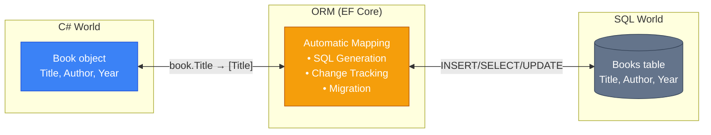
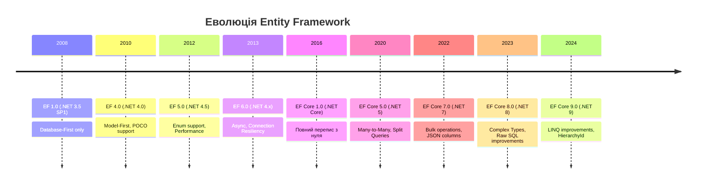
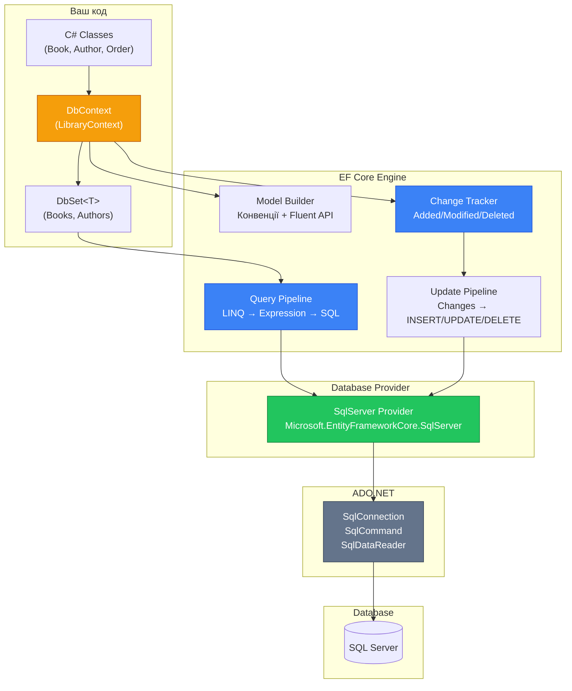

# 10.1. Введення в ORM та Entity Framework Core

## Вступ: Від ADO.NET до автоматичного маппінгу

У попередньому модулі ми пройшли повний шлях роботи з базами даних через ADO.NET: від `SqlConnection.Open()` до архітектурних патернів Data Mapper, Repository та Unit of Work. Ви навчилися створювати з'єднання, писати SQL-запити, маппити `SqlDataReader` на C#-об'єкти, керувати транзакціями. І, напевно, помітили закономірність — **багато коду повторюється**.

Подивіться на типовий метод збереження книги з ADO.NET:

```csharp showLineNumbers
public Book Save(Book book)
{
    using SqlConnection connection = new SqlConnection(_connectionString);
    connection.Open();

    using SqlCommand command = new SqlCommand(@"
        INSERT INTO Books (Title, Author, Year, Isbn, IsAvailable)
        VALUES (@Title, @Author, @Year, @Isbn, @IsAvailable);
        SELECT CAST(SCOPE_IDENTITY() AS INT);", connection);

    command.Parameters.Add("@Title", SqlDbType.NVarChar, 200).Value = book.Title;
    command.Parameters.Add("@Author", SqlDbType.NVarChar, 200).Value = book.Author;
    command.Parameters.Add("@Year", SqlDbType.Int).Value = book.Year;
    command.Parameters.Add("@Isbn", SqlDbType.NVarChar, 20).Value = book.Isbn;
    command.Parameters.Add("@IsAvailable", SqlDbType.Bit).Value = book.IsAvailable;

    book.Id = (int)command.ExecuteScalar()!;
    return book;
}
```

А тепер подивіться на еквівалент у Entity Framework Core:

```csharp showLineNumbers
public Book Save(Book book)
{
    _context.Books.Add(book);
    _context.SaveChanges();
    return book;
}
```

Три рядки замість двадцяти. Немає SQL, немає параметрів, немає маппінгу. EF Core робить **все це за вас**. Але де ж подівся весь цей код? Він нікуди не зник — він **генерується автоматично** на основі ваших C#-класів. І саме розуміння того, **як** це відбувається, відрізняє розробника, який просто використовує ORM, від розробника, який **розуміє** його.

::note
**Передумови**: Модуль [9. ADO.NET](/1.csharp/09.ado-net/01.introduction-to-adonet) — особливо статті про [DbCommand](/1.csharp/09.ado-net/03.command-and-queries), [DataReader](/1.csharp/09.ado-net/04.datareader), [транзакції](/1.csharp/09.ado-net/06.transactions) та [архітектурні патерни](/1.csharp/09.ado-net/11.data-mapper-repository). Базове знання SQL.

::

---

## Що таке ORM і яку проблему він вирішує?

### Object-Relational Impedance Mismatch

Між світом об'єктно-орієнтованого програмування (C#) та світом реляційних баз даних (SQL Server) існує фундаментальна невідповідність, яку називають **Object-Relational Impedance Mismatch** (невідповідність об'єктно-реляційних моделей). Ці два світи «думають» по-різному:

| Аспект | C# (об'єкти) | SQL (таблиці) |
|:---|:---|:---|
| **Ідентичність** | Reference equality (`ReferenceEquals`) | Primary Key (числовий Id) |
| **Зв'язки** | Навігаційні властивості (`book.Author`) | Foreign Keys (числовий AuthorId) |
| **Наслідування** | Ієрархія класів | Немає (потрібні хитрощі) |
| **Інкапсуляція** | `private set`, методи | Усе відкрите (стовпці) |
| **Колекції** | `List<Book>`, `IEnumerable<T>` | JOIN-запити |
| **Null** | `string?` (nullable reference) | `NULL` у будь-якому стовпці |
| **Поліморфізм** | `override`, `virtual` | Discriminator column |

**ORM** (Object-Relational Mapping) — це техніка, яка автоматизує «переклад» між цими двома світами. Замість ручного маппінгу `SqlDataReader → Book` (як ми робили в ADO.NET), ORM аналізує ваші C#-класи та **автоматично**:

1. **Генерує SQL** для CRUD-операцій
2. **Маппить результати** SQL-запитів на C#-об'єкти
3. **Відстежує зміни** в об'єктах (Change Tracker)
4. **Керує зв'язками** між об'єктами (навігаційні властивості)
5. **Створює та оновлює схему** бази даних (міграції)

::mermaid



::

### Аналогія

Уявіть, що ви — дипломат, який спілкується з іноземним партнером. У ADO.NET ви самі перекладаєте кожне слово: дістаєте словник, шукаєте переклад, складаєте речення. У EF Core — у вас є **перекладач-синхроніст**, який слухає вашу мову (C#) і миттєво перекладає на мову партнера (SQL), і навпаки. Ви говорите `context.Books.Add(book)`, а перекладач вимовляє `INSERT INTO Books (Title, Author, Year) VALUES ('Clean Code', 'Robert Martin', 2008)`.

Але хороший дипломат **знає мову партнера** хоча б базово — щоб перевірити перекладача. Саме тому модуль ADO.NET ішов **першим**: ви вже знаєте SQL та ручний маппінг, і тепер зможете оцінити, що робить ORM «під капотом».

---

## Entity Framework Core: Історія та позиціонування

### Еволюція

::mermaid



::

**Entity Framework Core** (EF Core) — це повний перепис оригінального Entity Framework, створений для кросплатформного .NET. Ключові відмінності від старого EF 6:

| Аспект | EF 6 (Legacy) | EF Core 9 |
|:---|:---|:---|
| **Платформа** | .NET Framework only | .NET 8/9, кросплатформний |
| **EDMX** | Так (візуальний дизайнер) | Ні (тільки Code-First) |
| **Продуктивність** | Повільний | Значно швидший |
| **Провайдери** | SQL Server, Oracle | SQL Server, PostgreSQL, SQLite, MySQL, Cosmos DB... |
| **LINQ** | Часта client evaluation | Строга server evaluation |
| **Bulk ops** | Тільки через сторонні бібліотеки | `ExecuteUpdate`, `ExecuteDelete` (вбудовані) |

### EF Core vs ADO.NET vs Dapper

Це три основних інструменти для роботи з БД у .NET:

::card-group

::card{title="ADO.NET" icon="i-heroicons-wrench-screwdriver"}
**Рівень**: Низький (ручний SQL + маппінг)
**Контроль**: Максимальний
**Продуктивність**: Найвищий (немає накладних витрат)
**Код**: Найбільше
**Коли**: Критична продуктивність, складний SQL, legacy

::

::card{title="Dapper" icon="i-heroicons-bolt"}
**Рівень**: Мікро-ORM (SQL + автомаппінг)
**Контроль**: Високий (ви пишете SQL)
**Продуктивність**: ~ADO.NET (мінімальні витрати)
**Код**: Середньо
**Коли**: Хочете SQL, але не хочете ручний маппінг

::

::card{title="EF Core" icon="i-heroicons-circle-stack"}
**Рівень**: Повний ORM (автоматичний SQL + маппінг + Change Tracking)
**Контроль**: Середній (LINQ замість SQL)
**Продуктивність**: Хороша (але є overhead)
**Код**: Мінімально
**Коли**: Більшість бізнес-додатків

::

::

::tip
**Правило вибору**: Починайте з EF Core. Якщо виявляєте проблеми з продуктивністю в конкретних запитах — переходьте на Raw SQL в EF Core або Dapper **для цих конкретних запитів**. Повний ADO.NET — тільки для крайніх випадків.

::

---

## Архітектура EF Core

### Ключові компоненти

EF Core складається з кількох ключових компонентів, кожен з яких відповідає за свою частину «магії»:

::mermaid



::

Розглянемо кожен компонент:

**1. DbContext** — центральний клас EF Core. Це **одночасно** Unit of Work та Identity Map (ті самі патерни, що ми реалізовували вручну в [статті 9.12](/1.csharp/09.ado-net/12.advanced-patterns)):
- Відстежує **всі** завантажені об'єкти (Identity Map)
- Накопичує **зміни** і зберігає їх одним `SaveChanges()` (Unit of Work)
- Керує **з'єднанням** з БД і **транзакціями**

**2. DbSet\<T\>** — це «колекція» доменних об'єктів конкретного типу. Це ваш **Repository** — ви додаєте, видаляєте, шукаєте об'єкти через `DbSet`. Але, на відміну від `List<T>`, операції з `DbSet` транслюються в SQL.

**3. Query Pipeline** — ланцюг перетворень LINQ → Expression Tree → SQL:
- Ви пишете: `context.Books.Where(b => b.Year > 2020)`
- EF Core будує: Expression Tree
- Провайдер генерує: `SELECT * FROM Books WHERE Year > 2020`
- ADO.NET виконує: `SqlCommand.ExecuteReader()`
- EF Core маппить: `SqlDataReader → List<Book>`

**4. Change Tracker** — компонент, який відстежує стан кожного об'єкта:
- `Added` — новий, буде INSERT
- `Modified` — змінений, буде UPDATE
- `Deleted` — позначений для видалення, буде DELETE
- `Unchanged` — не змінювався з моменту завантаження
- `Detached` — не відстежується

**5. Database Provider** — адаптер для конкретної СУБД. EF Core підтримує:
- SQL Server (`Microsoft.EntityFrameworkCore.SqlServer`)
- PostgreSQL (`Npgsql.EntityFrameworkCore.PostgreSQL`)
- SQLite (`Microsoft.EntityFrameworkCore.Sqlite`)
- MySQL (`Pomelo.EntityFrameworkCore.MySql`)
- Cosmos DB (`Microsoft.EntityFrameworkCore.Cosmos`)

### EF Core «під капотом» — це ADO.NET

Це критично важливий факт: **EF Core використовує ADO.NET** для всіх операцій з базою даних. Коли ви пишете `context.SaveChanges()`, за лаштунками EF Core:

1. Аналізує Change Tracker — що змінилося?
2. Генерує SQL-команди (INSERT, UPDATE, DELETE)
3. Створює `SqlConnection` та `SqlCommand`
4. Додає `SqlParameter` для кожного значення
5. Виконує `ExecuteNonQuery()` або `ExecuteReader()`
6. Обгортає все в `SqlTransaction`

Вся та робота, яку ви робили **вручну** в модулі ADO.NET, тепер виконується **автоматично**. Ось чому розуміння ADO.NET так важливе — ви знаєте, що відбувається на рівень нижче.

---

## Перший проєкт з EF Core

### Встановлення пакетів

::steps

### Створення проєкту

```bash
dotnet new console -n Library.EfCore
cd Library.EfCore
```

### Додавання NuGet-пакетів

```bash
# Основний пакет EF Core + провайдер SQL Server
dotnet add package Microsoft.EntityFrameworkCore.SqlServer

# Інструменти для міграцій (CLI)
dotnet add package Microsoft.EntityFrameworkCore.Design

# Глобальний інструмент EF CLI (якщо ще не встановлено)
dotnet tool install --global dotnet-ef
```

### Перевірка

```bash
dotnet ef --version
# Entity Framework Core .NET Command-line Tools 9.x.x
```

::

::field-group

::field{name="Microsoft.EntityFrameworkCore.SqlServer" type="NuGet"}
Провайдер для SQL Server. Містить генерацію SQL, типи даних, специфічні функції (HierarchyId, spatial тощо).

::

::field{name="Microsoft.EntityFrameworkCore.Design" type="NuGet"}
Необхідний для команд `dotnet ef` (міграції, scaffolding). Потрібен лише під час розробки.

::

::field{name="dotnet-ef" type="CLI Tool"}
Глобальний інструмент для роботи з міграціями з командного рядка.

::

::

### Доменна модель

Створимо просту модель книги. Зверніть увагу — вона **ідентична** тій, що ми використовували в ADO.NET. Принцип Persistence Ignorance залишається:

```csharp showLineNumbers
namespace Library.EfCore;

/// <summary>
/// Доменна модель книги.
/// EF Core автоматично маппить цей клас на таблицю Books.
/// </summary>
public class Book
{
    public int Id { get; set; }           // → PRIMARY KEY IDENTITY(1,1)
    public string Title { get; set; } = "";    // → NVARCHAR(MAX) NOT NULL
    public string Author { get; set; } = "";   // → NVARCHAR(MAX) NOT NULL
    public int Year { get; set; }              // → INT NOT NULL
    public string Isbn { get; set; } = "";     // → NVARCHAR(MAX) NOT NULL
    public bool IsAvailable { get; set; } = true; // → BIT NOT NULL DEFAULT 1
}
```

**Конвенції EF Core** — як він «розуміє» ваш клас:

- Властивість `Id` або `BookId` → автоматично стає **Primary Key**
- `int Id` → `IDENTITY(1,1)` (автоінкремент)
- `string` → `NVARCHAR(MAX)` (за замовчуванням)
- `bool` → `BIT`
- Ім'я класу `Book` → таблиця `Books` (множина)

::note
EF Core використовує **Convention over Configuration** — якщо ви дотримуєтесь конвенцій іменування, він правильно маппить класи без додаткової конфігурації. У наступних статтях ми побачимо, як це налаштувати через Fluent API.

::

### DbContext — серце додатку

```csharp showLineNumbers
using Microsoft.EntityFrameworkCore;

namespace Library.EfCore;

/// <summary>
/// Контекст бази даних бібліотеки.
/// DbContext = Unit of Work + Identity Map.
/// </summary>
public class LibraryContext : DbContext
{
    // DbSet<Book> — це "колекція" книг у базі даних (Repository)
    public DbSet<Book> Books => Set<Book>();

    // Конфігурація підключення до бази даних
    protected override void OnConfiguring(DbContextOptionsBuilder optionsBuilder)
    {
        optionsBuilder.UseSqlServer(
            "Server=localhost;Database=LibraryEfCore;Trusted_Connection=True;TrustServerCertificate=True;");

        // Логування SQL-запитів у консоль (для навчання)
        optionsBuilder.LogTo(Console.WriteLine, LogLevel.Information);
        optionsBuilder.EnableSensitiveDataLogging(); // Показувати значення параметрів
    }
}
```

**Розбір коду:**

- **Рядок 9**: `LibraryContext` наслідує `DbContext` — це ваша «сесія» з базою даних.
- **Рядок 12**: `DbSet<Book> Books` — оголошує, що в базі є таблиця для книг. Через `Books` ви додаєте, шукаєте, видаляєте книги.
- **Рядки 15-21**: `OnConfiguring` — налаштування підключення. `UseSqlServer()` вказує провайдер та Connection String.
- **Рядок 22**: `LogTo(Console.WriteLine)` — EF Core виводитиме **генерований SQL** у консоль. Це безцінно для навчання!

::warning
`OnConfiguring` з хардкодженим Connection String — підхід для навчання. У реальних додатках Connection String зберігається у `appsettings.json` або Environment Variables, а `DbContext` реєструється через DI. Ми розглянемо це в наступній статті.

::

### Створення бази даних через міграції

::steps

### Створення першої міграції

```bash
dotnet ef migrations add InitialCreate
```

EF Core проаналізує ваші `DbSet` та створить файл міграції з SQL для створення таблиці `Books`.

### Застосування міграції до бази даних

```bash
dotnet ef database update
```

Ця команда виконає згенерований SQL і створить базу даних `LibraryEfCore` з таблицею `Books`.

::

### CRUD-операції

Тепер подивимося, як виглядають операції створення, читання, оновлення та видалення з EF Core:

```csharp showLineNumbers
using Library.EfCore;

using var context = new LibraryContext();

// ===== CREATE =====
var book1 = new Book
{
    Title = "Чистий код",
    Author = "Роберт Мартін",
    Year = 2008,
    Isbn = "978-0132350884"
};

var book2 = new Book
{
    Title = "Domain-Driven Design",
    Author = "Ерік Еванс",
    Year = 2003,
    Isbn = "978-0321125217"
};

context.Books.Add(book1);
context.Books.Add(book2);
context.SaveChanges(); // INSERT INTO Books ...
Console.WriteLine($"Збережено. book1.Id = {book1.Id}, book2.Id = {book2.Id}");

// ===== READ =====
// Find за Primary Key (найшвидший спосіб)
var found = context.Books.Find(book1.Id);
Console.WriteLine($"Знайдено: {found?.Title}");

// LINQ-запит → SQL SELECT
var martinBooks = context.Books
    .Where(b => b.Author.Contains("Мартін"))
    .OrderBy(b => b.Year)
    .ToList();
// SQL: SELECT ... FROM Books WHERE Author LIKE N'%Мартін%' ORDER BY Year

Console.WriteLine($"Книг Мартіна: {martinBooks.Count}");

// ===== UPDATE =====
if (found != null)
{
    found.IsAvailable = false;  // Просто змінюємо властивість!
    context.SaveChanges();      // UPDATE Books SET IsAvailable = 0 WHERE Id = @Id
}

// ===== DELETE =====
var toDelete = context.Books.Find(book2.Id);
if (toDelete != null)
{
    context.Books.Remove(toDelete);
    context.SaveChanges();       // DELETE FROM Books WHERE Id = @Id
}

// Підрахунок
Console.WriteLine($"Всього книг: {context.Books.Count()}");
```

**Порівняйте з ADO.NET:**

| Операція | ADO.NET | EF Core |
|:---|:---|:---|
| **INSERT** | `SqlCommand` + 5 параметрів + `ExecuteScalar` | `Add(book)` + `SaveChanges()` |
| **SELECT** | `SqlCommand` + `ExecuteReader` + `MapFromReader()` | `Books.Where(...)` або `Books.Find(id)` |
| **UPDATE** | `SqlCommand` + 6 параметрів + `ExecuteNonQuery` | Зміна властивості + `SaveChanges()` |
| **DELETE** | `SqlCommand` + 1 параметр + `ExecuteNonQuery` | `Remove(entity)` + `SaveChanges()` |

Зверніть увагу на **UPDATE** — ви просто змінюєте значення властивості `found.IsAvailable = false`. EF Core **автоматично** відстежує цю зміну через Change Tracker і генерує `UPDATE ... SET IsAvailable = 0 WHERE Id = @Id` при виклику `SaveChanges()`.

---

## Що відбувається «під капотом»

Увімкнувши логування (`LogTo(Console.WriteLine)`), ви побачите в консолі приблизно таке:

```sql
-- При context.SaveChanges() після Add(book1), Add(book2):
info: Executed DbCommand (15ms)
      SET IMPLICIT_TRANSACTIONS OFF;
      SET NOCOUNT ON;
      INSERT INTO [Books] ([Author], [Isbn], [IsAvailable], [Title], [Year])
      VALUES (@p0, @p1, @p2, @p3, @p4);
      SELECT [Id]
      FROM [Books]
      WHERE @@ROWCOUNT = 1 AND [Id] = scope_identity();

-- При context.Books.Where(b => b.Author.Contains("Мартін")).ToList():
info: Executed DbCommand (3ms)
      SELECT [b].[Id], [b].[Author], [b].[Isbn], [b].[IsAvailable], [b].[Title], [b].[Year]
      FROM [Books] AS [b]
      WHERE [b].[Author] LIKE N'%Мартін%'
      ORDER BY [b].[Year]
```

Це **той самий SQL**, який ви писали вручну в ADO.NET! EF Core згенерував його автоматично. Зверніть увагу:
- `SET IMPLICIT_TRANSACTIONS OFF` — оптимізація для одиночних INSERT
- `scope_identity()` — отримання згенерованого Id (як ми робили через `SCOPE_IDENTITY()`)
- `LIKE N'%Мартін%'` — EF Core перетворив `Contains("Мартін")` на SQL LIKE
- Параметризовані запити (`@p0`, `@p1`) — захист від SQL Injection (як ми вчили в [статті 9.5](/1.csharp/09.ado-net/05.parameters-and-sql-injection))

---

## Зв'язок з патернами ADO.NET

У модулі ADO.NET ми **вручну** реалізували патерни, які EF Core надає **«з коробки»**:

::card-group

::card{title="Data Mapper → EF Core Engine" icon="i-heroicons-arrows-right-left"}
Ми писали `MapFromReader(SqlDataReader)`. EF Core робить це автоматично: аналізує `DbSet<Book>`, знаходить властивості, генерує маппінг.

::

::card{title="Repository → DbSet<T>" icon="i-heroicons-archive-box"}
Ми створювали `IBookRepository` з `FindById`, `FindByAuthor`. `DbSet<Book>` — це вбудований Repository з LINQ.

::

::card{title="Identity Map → Change Tracker" icon="i-heroicons-map"}
Ми писали `IdentityMap<TId, TEntity>` з `Dictionary`. `DbContext` робить це через `ChangeTracker` — кожен завантажений об'єкт кешується.

::

::card{title="Unit of Work → SaveChanges()" icon="i-heroicons-clipboard-document-check"}
Ми писали `UnitOfWork` з `RegisterNew`, `RegisterDirty`, `Commit(SqlTransaction)`. `SaveChanges()` — це той самий Commit, але автоматичний.

::

::

Ось конкретне порівняння:

```csharp showLineNumbers
// Наш ручний Repository + UoW (ADO.NET)
var repository = new SqlBookRepository(connectionString);
using var uow = new UnitOfWork(connectionString, repository);

var book = new Book("Clean Code", "Martin", 2008, "ISBN");
uow.RegisterNew(book);
uow.Commit(); // BEGIN TRAN → INSERT → COMMIT

// EF Core (еквівалент)
using var context = new LibraryContext();

var book = new Book { Title = "Clean Code", Author = "Martin", Year = 2008, Isbn = "ISBN" };
context.Books.Add(book);    // RegisterNew
context.SaveChanges();       // Commit
```

---

## Коли НЕ використовувати EF Core

EF Core — потужний інструмент, але не універсальний. Є сценарії, де він **не підходить**:

1. **Bulk-операції на мільйони рядків** — `INSERT INTO ... SELECT` або `BULK INSERT` ефективніші за EF Core (хоча `ExecuteUpdate/ExecuteDelete` в EF Core 7+ значно допомогли)
2. **Складні аналітичні запити** — багаторівневі GROUP BY, PIVOT, оконні функції краще писати на чистому SQL
3. **Stored Procedures з складною логікою** — EF Core підтримує їх виклик, але не генерує
4. **Максимальна продуктивність** — в hot paths (тисячі запитів на секунду) overhead EF Core може бути помітним

::tip
**Практичний підхід**: Використовуйте EF Core для 90% запитів. Для решти 10% — `FromSqlRaw()` або Dapper поруч з EF Core. Ці інструменти **не є взаємовиключними**.

::

---

## Практичні завдання

### Рівень 1: Базовий

::steps

### Завдання 1.1: Перший EF Core проєкт

1. Створіть консольний проєкт з EF Core та SQL Server.
2. Модель `Product` (Id, Name, Price, Category, InStock).
3. `ShopContext : DbContext` з `DbSet<Product>`.
4. Створіть міграцію та базу.
5. Додайте 5 продуктів, виведіть усі.

### Завдання 1.2: CRUD

На основі попереднього завдання:
1. Додайте продукт.
2. Знайдіть за Id (`Find`).
3. Оновіть ціну (`Price`).
4. Видаліть продукт.
5. Виведіть кількість (`Count()`).
6. Увімкніть логування SQL та перевірте згенеровані запити.

::

### Рівень 2: Логіка

::steps

### Завдання 2.1: LINQ-запити

1. Знайдіть усі продукти з ціною > 100.
2. Знайдіть продукти в наявності (`InStock == true`).
3. Відсортуйте за ціною (від дешевих до дорогих).
4. Виведіть середню ціну (`Average()`).

### Завдання 2.2: Порівняння ADO.NET та EF Core

Реалізуйте ті самі CRUD-операції з `Product` на чистому ADO.NET (без EF Core). Порівняйте кількість рядків коду.

::

### Рівень 3: Архітектура

::steps

### Завдання 3.1: Множинні DbSet

Розширте контекст:
1. `Customer` (Id, Name, Email, RegistrationDate).
2. `Order` (Id, CustomerId, ProductId, Quantity, OrderDate).
3. Створіть міграцію з усіма трьома таблицями.
4. Додайте тестові дані.

### Завдання 3.2: Логування та аналіз

1. Увімкніть `LogTo` та `EnableSensitiveDataLogging`.
2. Виконайте 5 різних LINQ-запитів.
3. Запишіть згенерований SQL у текстовий файл.
4. Порівняйте SQL, який ви б написали вручну, зі згенерованим.

::

---

## Резюме

::card-group

::card{title="ORM" icon="i-heroicons-arrows-right-left"}
Автоматичний «переклад» між C#-об'єктами та реляційною БД. Вирішує Object-Relational Impedance Mismatch.

::

::card{title="EF Core" icon="i-heroicons-circle-stack"}
Повний ORM для .NET: Code-First, LINQ to Entities, Change Tracker, Migrations. Використовує ADO.NET під капотом.

::

::card{title="DbContext" icon="i-heroicons-cog-6-tooth"}
Unit of Work + Identity Map. Відстежує зміни, зберігає одним SaveChanges(), кешує завантажені об'єкти.

::

::card{title="Convention over Configuration" icon="i-heroicons-light-bulb"}
EF Core автоматично маппить класи на таблиці за конвенціями. Явна конфігурація — тільки коли потрібно щось нестандартне.

::

::

## Корисні посилання

- [EF Core Documentation](https://learn.microsoft.com/en-us/ef/core/) — офіційна документація Microsoft
- [EF Core GitHub](https://github.com/dotnet/efcore) — вихідний код
- [Martin Fowler — ORM Hate](https://martinfowler.com/bliki/OrmHate.html) — чесний погляд на ORM
- [EF Core vs Dapper](https://learn.microsoft.com/en-us/ef/core/performance/efficient-querying) — гайд по продуктивності
