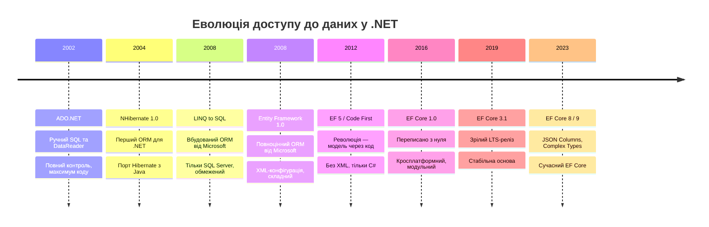
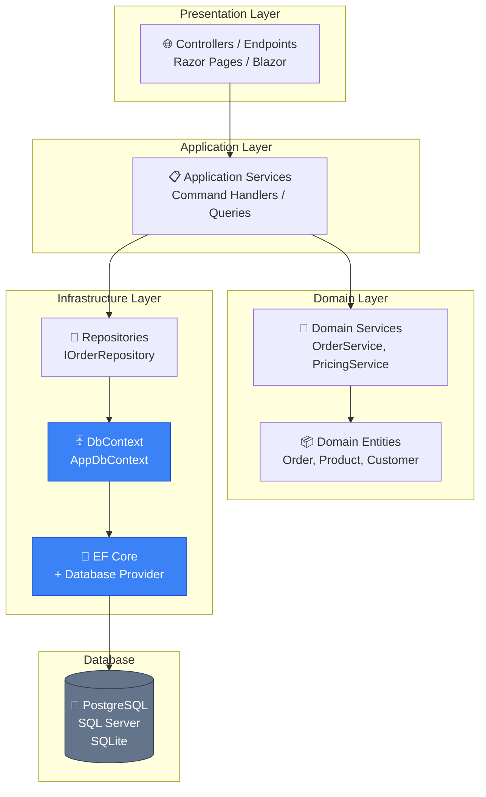

# Що таке ORM? Від SQL до об'єктів

## Код, якого ви хотіли б уникнути

Уявіть звичайне завдання: отримати список активних замовлень конкретного клієнта разом з інформацією про продукти. Ви вже пройшли розділ ADO.NET, тому знаєте, як це виглядає насправді:

```csharp [OrderRepository.cs]
public async Task<List<OrderDto>> GetActiveOrdersAsync(int customerId)
{
    var orders = new List<OrderDto>();

    const string sql = @"
        SELECT o.Id, o.CreatedAt, o.TotalAmount, o.Status,
               oi.Id AS ItemId, oi.Quantity, oi.UnitPrice,
               p.Id AS ProductId, p.Name AS ProductName, p.Sku
        FROM Orders o
        INNER JOIN OrderItems oi ON oi.OrderId = o.Id
        INNER JOIN Products p ON p.Id = oi.ProductId
        WHERE o.CustomerId = @customerId
          AND o.Status = 'Active'
        ORDER BY o.CreatedAt DESC";

    await using var connection = new SqlConnection(_connectionString);
    await connection.OpenAsync();

    await using var command = new SqlCommand(sql, connection);
    command.Parameters.AddWithValue("@customerId", customerId);

    await using var reader = await command.ExecuteReaderAsync();

    var orderMap = new Dictionary<int, OrderDto>();

    while (await reader.ReadAsync())
    {
        var orderId = reader.GetInt32(reader.GetOrdinal("Id"));

        if (!orderMap.TryGetValue(orderId, out var order))
        {
            order = new OrderDto
            {
                Id        = orderId,
                CreatedAt = reader.GetDateTime(reader.GetOrdinal("CreatedAt")),
                Total     = reader.GetDecimal(reader.GetOrdinal("TotalAmount")),
                Status    = reader.GetString(reader.GetOrdinal("Status")),
                Items     = new List<OrderItemDto>()
            };
            orderMap[orderId] = order;
        }

        order.Items.Add(new OrderItemDto
        {
            Id          = reader.GetInt32(reader.GetOrdinal("ItemId")),
            Quantity    = reader.GetInt32(reader.GetOrdinal("Quantity")),
            UnitPrice   = reader.GetDecimal(reader.GetOrdinal("UnitPrice")),
            ProductId   = reader.GetInt32(reader.GetOrdinal("ProductId")),
            ProductName = reader.GetString(reader.GetOrdinal("ProductName")),
            Sku         = reader.GetString(reader.GetOrdinal("Sku"))
        });
    }

    return orderMap.Values.ToList();
}
```

Цей код правильний. Він працює. Але подивіться, скільки тут роботи, яка не має жодного відношення до бізнес-логіки: відкрити connection, написати SQL-рядок вручну, передати параметри, прочитати рядки через `reader.GetInt32()`, вручну зібрати об'єктний граф із плоского набору рядків. І це лише **один** запит.

Тепер уявіть, що таких запитів у проєкті сотні. Кожного разу — одне й те саме: з'єднання, параметри, ручне маппінг. А якщо поле в базі перейменовано — доведеться переписати всі рядки-рядки в кожному методі.

Саме з цієї проблеми виросла концепція **Object-Relational Mapping**.

---

## Impedance Mismatch: корінь усіх бід

У 1990-х роках, коли об'єктно-орієнтоване програмування стало мейнстрімом, а реляційні бази даних вже міцно стояли в індустрії, розробники зіткнулися із фундаментальним протиріччям. У програмуванні ми мислимо **об'єктами** — сутностями зі стан, поведінкою і зв'язками. Реляційні бази даних зберігають дані у вигляді **таблиць і рядків** — плоских, нормалізованих структур без поведінки.

Це протиріччя отримало назву **Object-Relational Impedance Mismatch** — невідповідності між об'єктною та реляційною моделями даних. Термін популяризував Мартін Фаулер у своїй фундаментальній книзі _«Patterns of Enterprise Application Architecture»_ (2002).

::note
**Impedance** (імпеданс) — термін запозичений з електротехніки, де він описує опір змінному струму. В контексті програмування він метафорично описує «тертя» між двома принципово різними парадигмами, що не можуть бути з'єднані без адаптера.
::

Ця невідповідність проявляється у п'яти конкретних проблемах, кожна з яких щодня нагадує про себе в коді без ORM:

### Проблема 1: Типи даних

У C# є `DateTime`, `Guid`, `decimal`, `enum`, nullable types, value types. У SQL — `DATETIME`, `UNIQUEIDENTIFIER`, `NUMERIC(18,2)`, `INT`. Перетворення між ними не завжди тривіальне: SQL Server зберігає `DateTime` з точністю до мілісекунди, але може відрізатися від `DateTime` у CLR через округлення. PostgreSQL має окремий тип `timestamptz` з інформацією про часовий пояс. Enum у C# зберігається як ціле число, але у базі може бути і `INT`, і `VARCHAR`.

### Проблема 2: Ідентичність

У C# ідентичність об'єкта визначається за посиланням (reference equality): два різних об'єкти з однаковими даними — це два різних об'єкти. У реляційній базі ідентичність визначається первинним ключем: два рядки з однаковим PK — це один і той самий рядок. Якщо ви двічі запитаєте один рядок з БД, ви отримаєте два різних C#-об'єкти, і це може призвести до неочікуваної поведінки при порівнянні.

### Проблема 3: Зв'язки

У C# зв'язки виражаються через навігаційні властивості: `Order.Customer`, `Customer.Orders`. Це двосторонні посилання. У SQL зв'язки виражаються через зовнішні ключі — числові значення в одній таблиці, що вказують на рядок в іншій. JOIN у SQL є явним і виконується при запиті. У C# доступ до `order.Customer` виглядає як просте звернення до властивості.

### Проблема 4: Навігація (N+1 проблема)

Якщо у вас є список з 100 замовлень і ви хочете дізнатися ім'я клієнта для кожного, в SQL ви зробите один JOIN. В об'єктній моделі без ORM ви можете ненавмисно написати цикл, що робить 100 окремих запитів до бази — по одному на кожне замовлення. Це класична **N+1 проблема**, яка руйнує продуктивність.

### Проблема 5: Гранулярність

В ООП є смисл виділити дрібні класи з відповідальністю — наприклад, окремий клас `Address` з полями `Street`, `City`, `ZipCode`. Але у базі це зазвичай зберігається як набір окремих стовпців у таблиці `Customers`: `Street`, `City`, `ZipCode`. Тобто одна C# властивість (`Address`) відповідає декільком стовпцям БД.

::tip
Усі п'ять проблем — це не баги, а фундаментальні архітектурні розбіжності між двома технологіями, кожна з яких за окремим призначенням. ORM є адаптером між ними — але, як і будь-який адаптер, він додає шар абстракції зі своїми компромісами.
::

---

## Визначення: що таке ORM?

**Object-Relational Mapping (ORM)** — це патерн і технологія, що автоматизує перетворення між об'єктною моделлю застосунку та реляційною моделлю бази даних, зберігаючи при цьому семантику обох.

Мартін Фаулер у _«P of EAA»_ описує ORM як підклас патерну **Data Mapper** — об'єкта, що відповідає за переміщення даних між об'єктами та базою даних, зберігаючи їх незалежними один від одного та від mapper'а.

Ключове слово тут — **незалежними**. Це означає, що ваш клас `Order` не повинен знати, як він зберігається в базі. Він є чистою C#-сутністю з властивостями і поведінкою. ORM-фреймворк відповідає за те, щоб «перекласти» цю сутність у SQL при збереженні і «перекласти назад» при читанні.

Розберемо, як виглядає та сама операція з ORM (Entity Framework Core):

```csharp [OrderRepository.cs]
public async Task<List<Order>> GetActiveOrdersAsync(int customerId)
{
    return await _context.Orders
        .Where(o => o.CustomerId == customerId && o.Status == OrderStatus.Active)
        .Include(o => o.Items)
            .ThenInclude(item => item.Product)
        .OrderByDescending(o => o.CreatedAt)
        .ToListAsync();
}
```

Це — той самий запит. Той самий JOIN. Той самий фільтр і сортування. Але тепер ми працюємо з об'єктами C# безпосередньо. ORM автоматично транслює LINQ-вираз у SQL, виконує запит і матеріалізує результат у повноцінний граф об'єктів `Order → Items → Product`.

---

## Еволюція доступу до даних у .NET

Щоб зрозуміти, чому і як з'явились ORM-фреймворки, варто простежити хронологію:

::mermaid



::

**ADO.NET** (2002) — фундамент, який ви вже знаєте. Він дає максимальний контроль над кожним SQL-запитом. Але це означає максимум ручної роботи: з'єднання, команди, reader, маппінг.

**LINQ to SQL** (2008) — перший ORM від Microsoft, але обмежений тільки SQL Server і з часом фактично припинив розвиток.

**Entity Framework** (2008–2012) — початкові версії мали репутацію «важкого» фреймворку з XML-конфігурацією і незрілим генератором SQL. Версія з Code First (2012) стала переломним моментом.

**EF Core** (2016–досі) — повна переробка з нуля. Кросплатформний (Linux, macOS), модульний, з підтримкою безлічі провайдерів БД. Саме EF Core є предметом цього курсу.

---

## Патерни доступу до даних: Active Record vs Data Mapper

Перш ніж говорити про конкретні інструменти, важливо розуміти два фундаментальних патерни — вони визначають архітектурний підхід ORM-фреймворку.

::card-group

::card{title="Active Record" icon="i-lucide-circle-user"}

Сутність **сама** відповідає за своє збереження. Методи `Save()`, `Delete()`, `Find()` знаходяться в самому класі моделі.

```csharp
// Rails-стиль Active Record
var order = Order.Find(42);
order.Status = "Completed";
order.Save(); // зберігає себе сам
```

**Плюси:** Простота, менше коду, інтуїтивно  
**Мінуси:** Порушення SRP, складно тестувати, сутність залежить від БД

::

::card{title="Data Mapper" icon="i-lucide-git-branch"}

Сутність **не знає** про базу. Окремий Mapper відповідає за переміщення даних між об'єктами та БД.

```csharp
// Data Mapper стиль
var order = await _context.Orders.FindAsync(42); // mapper читає
order.Status = OrderStatus.Completed;
await _context.SaveChangesAsync(); // mapper зберігає
```

**Плюси:** Чиста модель, легко тестувати, гнучкість  
**Мінуси:** Більше коду, складніше для маленьких проєктів

::

::

**Entity Framework Core реалізує патерн Data Mapper.** `DbContext` — це і є той самий mapper, який читає і зберігає ваші чисті POCO-класи (Plain Old CLR Objects). Самі класи `Order`, `Product`, `Customer` нічого не знають про базу даних — вони є чистими C#-об'єктами.

Це критично важливо для **тестування**: ваші сервіси та доменні класи можна тестувати без жодної реальної бази даних.

---

## Ландшафт ORM у .NET: що обирати?

Сьогодні в екосистемі .NET є кілька зрілих варіантів для доступу до даних. Розберемо кожен:

### Entity Framework Core

Офіційний ORM від Microsoft, частина .NET екосистеми. Підтримує Code First, Database First, міграції, LINQ-запити, зміну відслідковування (change tracking).

**Підходить для:** більшості корпоративних застосунків, CRUD-інтенсивних проєктів, команд зі стандартними вимогами.

### Dapper

Мікро-ORM, написаний командою Stack Overflow. Фактично є extension methods для `IDbConnection`, що дозволяє зручно виконати SQL і отримати результат як C#-об'єкти.

```csharp [OrderRepository.cs]
// Dapper: все ще SQL, але маппінг автоматичний
var orders = await connection.QueryAsync<Order>(
    "SELECT * FROM Orders WHERE CustomerId = @id AND Status = 'Active'",
    new { id = customerId }
);
```

**Підходить для:** high-performance сценаріїв, коли потрібен повний контроль над SQL, legacy-бази зі складною схемою, аналітичні запити.

### NHibernate

Зрілий, дуже функціональний ORM — порт Hibernate з Java. Має більший feature set, ніж EF Core (наприклад, second-level cache, більш гнучке маппінгу). Але значно складніший у налаштуванні.

**Підходить для:** складних доменних моделей (DDD), коли потрібні можливості, яких немає в EF Core.

### LINQ to DB

Lightweight ORM з детальним контролем над SQL та відмінною підтримкою різних провайдерів.

---

## EF Core vs Dapper: детальне порівняння

Це найчастіше питання в .NET-спільноті. Правильна відповідь: **обидва можна використовувати в одному проєкті** — для різних задач.

::tabs

::tabs-item{label="Developer Experience"}

**EF Core** — ви пишете C# LINQ, фреймворк генерує SQL:
```csharp
var expensive = await _context.Products
    .Where(p => p.Price > 1000 && p.Category == "Electronics")
    .OrderBy(p => p.Name)
    .Select(p => new { p.Id, p.Name, p.Price })
    .ToListAsync();
```
Немає SQL-рядків. Компілятор перевіряє синтаксис. Рефакторинг безпечний.

**Dapper** — ви пишете SQL, отримуєте об'єкти:
```csharp
var expensive = await connection.QueryAsync<ProductDto>(
    @"SELECT Id, Name, Price FROM Products
      WHERE Price > @minPrice AND Category = @category
      ORDER BY Name",
    new { minPrice = 1000, category = "Electronics" }
);
```
Повний контроль над SQL. Але рядки — не типізовані. Помилки виявляються лише в runtime.

::

::tabs-item{label="Performance"}

**Dapper** у мікробенчмарках зазвичай швидший — тут немає шару побудови Expression Tree та change tracking overhead.

Але різниця є суттєвою лише для дуже частих простих запитів (тисячі RPS). Для більшості застосунків різниця незначна.

**EF Core** з `AsNoTracking()` та проєкцією через `Select()` наближається до Dapper за швидкістю читання.

::

::tabs-item{label="Можливості"}

| Можливість | EF Core | Dapper |
|---|---|---|
| LINQ-запити | ✅ | ❌ |
| Change Tracking | ✅ | ❌ |
| Міграції | ✅ | ❌ |
| Lazy Loading | ✅ опційно | ❌ |
| Raw SQL | ✅ | ✅ (основа) |
| Stored Procedures | ✅ | ✅ |
| Bulk operations (native) | EF Core 7+ | ❌ |
| Контроль над SQL | Частковий | Повний |

::

::tabs-item{label="Коли що обирати"}

**Оберіть EF Core, якщо:**
- Стандартний CRUD-інтенсивний застосунок
- Команда хоче швидко рухатись без ручного SQL
- Потрібні міграції та version control для схеми БД
- DDD-підхід з доменними сутностями

**Оберіть Dapper (або обоє), якщо:**
- Складні аналітичні запити, що потребують оптимізованого SQL
- Legacy database з нестандартною схемою
- Потрібна максимальна продуктивність на конкретних endpoints
- Команда добре знає SQL і хоче залишитися "близько до металу"

::

::

::tip
Прагматичний підхід у великих проєктах: використовувати EF Core для стандартних операцій із доменними сутностями, а Dapper — для складних звітних запитів або масових операцій. Обидва можуть жити в одному застосунку.
::

---

## Чому Entity Framework Core?

З усіх варіантів ми вивчатимемо саме EF Core. Ось чому:

**1. Офіційна підтримка Microsoft.** EF Core є частиною .NET-екосистеми, розвивається тією ж командою. Кожен реліз .NET супроводжується новим мажорним релізом EF Core.

**2. Найширший функціонал серед .NET ORM.** Change Tracking, міграції, LINQ-трансляція, Owned Types, JSON Columns, Interceptors, Compiled Queries — EF Core є найбільш повнофункціональним інструментом.

**3. Кросплатформність.** Підтримує будь-який .NET-провайдер баз даних: PostgreSQL (Npgsql), SQL Server, MySQL, SQLite, Cosmos DB.

**4. Стандарт індустрії.** Переважна більшість вакансій .NET-розробника вимагає знання EF Core. Це загальна мова команди.

**5. Активна спільнота та документація.** Офіційна документація Microsoft — одна з найкращих у .NET-просторі.

---

## Де живе EF Core в архітектурі?

Перш ніж зануритись у код, важливо зрозуміти, яке місце EF Core займає в типовій архітектурі .NET-застосунку:

::mermaid



::

EF Core живе в **Infrastructure Layer** (шарі інфраструктури). Він є деталлю реалізації, яку можна замінити (наприклад, перейти з SQL Server на PostgreSQL), не зачіпаючи доменну логіку. Доменні сутності (`Order`, `Product`) — у Domain Layer і нічого не знають про EF Core.

Ця архітектурна ізоляція є принципово важливою. Саме тому EF Core реалізує патерн Data Mapper, а не Active Record: ваш `Order` — чиста C# модель без жодного атрибуту чи залежності від фреймворку доступу до даних.

---

## Концепція "Code First": модель через код

EF Core підтримує два основних підходи:

**Code First** — ви описуєте модель у C# класах, EF Core генерує схему бази даних (через міграції). Це рекомендований підхід для нових проєктів.

**Database First** — ви маєте існуючу базу, EF Core scaffold-ує C# класи з неї. Підходить для роботи з legacy-базами.

У цьому курсі ми зосередимось на **Code First** як основному підході. Ось як виглядає проста модель:

```csharp [Models/Order.cs]
public class Order
{
    public int Id { get; set; }
    public DateTime CreatedAt { get; set; }
    public decimal TotalAmount { get; set; }
    public OrderStatus Status { get; set; }

    public int CustomerId { get; set; }
    public Customer Customer { get; set; } = null!;

    public ICollection<OrderItem> Items { get; set; } = new List<OrderItem>();
}
```

```csharp [Data/AppDbContext.cs]
public class AppDbContext : DbContext
{
    public AppDbContext(DbContextOptions<AppDbContext> options) : base(options) { }

    public DbSet<Order> Orders => Set<Order>();
    public DbSet<Customer> Customers => Set<Customer>();
    public DbSet<Product> Products => Set<Product>();
}
```

Це — весь код, необхідний для початку роботи. EF Core за конвенцією визначить таблиці, первинні ключі, зовнішні ключі. Рядків XML-конфігурації — нуль.

::note
Клас `Order` — чистий C# об'єкт. Жодних атрибутів EF Core. Жодних базових класів. Жодних залежностей від NuGet-пакетів. Це і є сила патерну Data Mapper: ваша доменна модель залишається незалежною від інфраструктури.
::

---

## "Магічний" запит зсередини

Давайте подивимось, що насправді відбувається, коли EF Core виконує LINQ-запит:

```csharp
var orders = await _context.Orders
    .Where(o => o.CustomerId == 5 && o.Status == OrderStatus.Active)
    .Include(o => o.Items)
    .ToListAsync();
```

::steps

### Побудова Expression Tree

LINQ-оператори **не виконуються одразу**. Вони будують `IQueryable` — об'єкт, що містить дерево виразів (Expression Tree). Це C#-представлення вашого запиту у вигляді об'єктів, а не виконаний код.

### Трансляція в SQL

Коли ви викликаєте `ToListAsync()`, EF Core аналізує Expression Tree і транслює його у SQL-запит для конкретного провайдера бази даних:

```sql
SELECT o.Id, o.CreatedAt, o.TotalAmount, o.Status, o.CustomerId,
       oi.Id, oi.OrderId, oi.ProductId, oi.Quantity, oi.UnitPrice
FROM Orders AS o
LEFT JOIN OrderItems AS oi ON oi.OrderId = o.Id
WHERE o.CustomerId = 5 AND o.Status = 1
```

### Виконання та матеріалізація

EF Core відкриває з'єднання, виконує SQL, отримує `DbDataReader`. Потім **матеріалізує** рядки у C#-об'єкти — тобто з плоских рядків збирає граф об'єктів: список `Order` з заповненою колекцією `Items`.

### Реєстрація в Change Tracker

Кожен завантажений об'єкт реєструється у **Change Tracker** — внутрішньому механізмі відстеження змін. EF Core зберігає оригінальний знімок стану. Якщо ви змінюєте `order.Status` і викликаєте `SaveChanges()`, фреймворк автоматично генерує `UPDATE` лише для тих полів, що змінились.

::

Вся ця складна механіка прихована від вас. Ви пишете LINQ, отримуєте C#-об'єкти. Але розуміння того, що відбувається «під капотом», критично важливе для написання ефективного коду — і саме тому ми розберемо кожен з цих кроків детально в наступних статтях.

---

## Аргументи проти ORM (і відповіді на них)

Справедливість вимагає розглянути і критику ORM. Ці аргументи реальні, і їх важливо розуміти:

::accordion

::accordion-item{label="«ORM генерує неефективний SQL»" icon="i-lucide-zap"}
**Критика:** ORM-фреймворки часто генерують громіздкий SQL з зайвими JOIN-ами, SELECT *, або ж викликають N+1 проблеми.

**Відповідь:** Це правда для **неправильного** використання. З правильним застосуванням проєкцій через `Select()`, `AsNoTracking()`, `AsSplitQuery()` та свідомим підходом до Include — EF Core генерує ефективний SQL. Крім того, в критичних місцях завжди можна використати Raw SQL або Dapper.
::

::accordion-item{label="«ORM — це «чорна скриня»»" icon="i-lucide-eye-off"}
**Критика:** Розробник не завжди знає, який SQL виконується. Це ускладнює оптимізацію.

**Відповідь:** EF Core надає повноцінне логування SQL. `EnableSensitiveDataLogging()`, `LogTo()`, структуроване логування через ILogger — ви завжди можете побачити кожен SQL-запит у консолі або логах. Ця стаття ознайомлює з підходом; детальне логування — у статті про діагностику.
::

::accordion-item{label="«ORM погано масштабується»" icon="i-lucide-trending-up"}
**Критика:** При великих навантаженнях ORM є вузьким місцем.

**Відповідь:** Stack Overflow — один з найнавантаженіших сайтів у світі — використовує Dapper і не ORM з повним feature set. Але більшість проєктів **не є Stack Overflow**. Для 99% застосунків правильно налаштований EF Core з пулом контекстів, проєкціями і AsNoTracking не є вузьким місцем.
::

::accordion-item{label="«Міграції EF Core ламають продакшн»" icon="i-lucide-triangle-alert"}
**Критика:** Автоматичні міграції — це ризик при складних змінах схеми.

**Відповідь:** EF Core **не виконує** міграції автоматично в продакшні (якщо ви самі це не вмикаєте). Міграції є скриптами, які можна перевірити, протестувати і виконати контрольовано. Це детально розглянемо у Блоці 5.
::

::

---

## Що далі: дорожня карта цього курсу

Ви тепер розумієте, **звідки виникла проблема**, **що таке ORM концептуально** і **чому EF Core є правильним вибором** для більшості .NET-проєктів. Це — теоретичний фундамент.

Решта курсу — це послідовне заглиблення у практику:

::card-group

::card{title="Блок 1: Основи" icon="i-lucide-layers"}

Перший проєкт, DbContext, провайдери, конвенції — від нуля до робочого CRUD за кілька статей.

::

::card{title="Блок 2: Моделювання" icon="i-lucide-database"}

Fluent API, зв'язки, складні типи, успадкування, JSON Columns — повна карта можливостей EF Core.

::

::card{title="Блок 3: Запити" icon="i-lucide-search"}

LINQ-трансляція, завантаження даних, Raw SQL, compiled queries — ефективна робота з даними.

::

::card{title="Блок 4: Change Tracking" icon="i-lucide-git-commit-horizontal"}

Внутрішній механізм відстеження змін, збереження даних, конкурентний доступ.

::

::card{title="Блоки 5–7" icon="i-lucide-rocket"}

Міграції, продуктивність, interceptors, тестування та архітектурні патерни.

::

::

---

## Практичні завдання

::card-group

::card{title="Рівень 1: Розуміння" icon="i-lucide-brain"}

**Завдання 1.1** — Для наступного сценарію опишіть **усі п'ять** проблем Impedance Mismatch і як вони проявляються: маємо клас `Employee` з властивістю `Address` (тип `Address` з `Street`, `City`, `Country`), та `IList<Project>` (список проєктів, у кожному — `IList<Employee>` — зворотня навігація). Підказка: один об'єкт `Employee` може брати участь у кількох проєктах, і навпаки.

**Завдання 1.2** — Знайдіть 2–3 open source .NET репозиторії на GitHub (будь-яка область — від CMS до e-commerce). Перевірте, чи використовують вони ORM. Якщо так — який і де знаходиться `DbContext`. Що ви можете дізнатися про архітектуру проєкту лише з файлів контексту?

**Завдання 1.3** — Перепишіть наступний метод на ADO.NET у псевдо-EF Core стиль (не потрібно, щоб код реально компілювався — лише покажіть, як би виглядала ця операція з ORM): отримати 5 найдорожчих продуктів категорії «Electronics», що мають залишок на складі більше 10 одиниць, разом із назвою постачальника.

::

::card{title="Рівень 2: Аналіз" icon="i-lucide-bar-chart"}

**Завдання 2.1** — Розгляньте два підходи до реалізації методу `GetUserWithOrdersAndProducts(int userId)`. Перший підхід: один великий SQL JOIN. Другий: три окремі запити (users, orders for user, products for those orders) і ручне збирання в пам'яті. Проаналізуйте обидва: (а) кількість round-trips до БД, (б) обсяг переданих даних, (в) складність коду, (г) коли кожен підхід кращий.

**Завдання 2.2** — Складіть таблицю порівняння: для 5 різних типів проєктів (новий стартап, корпоративна ERP, аналітична система, мобільний backend, мікросервіс) визначте, який інструмент ви б обрали (EF Core, Dapper, обидва, NHibernate) і поясніть чому. Використовуйте конкретні аргументи з матеріалу статті.

**Завдання 2.3** — Наведено аргумент: «Ми великий proект з 10TB даних — нам не потрібен ORM, тільки ручний SQL». Підготуйте контраргументи (або підтримайте цю позицію) з урахуванням різних типів операцій: OLTP vs OLAP, читання vs запис, читабельність коду, продуктивність команди.

::

::card{title="Рівень 3: Практика" icon="i-lucide-rocket"}

**Завдання 3.1** — Реалізуйте повний CRUD для сутності `Library` (бібліотека з книгами) двома способами: (а) через ADO.NET з ручним маппінгом, (б) через EF Core `DbContext.SaveChanges()`. Порівняйте кількість рядків коду і знайдіть, де логіка виразніша. Модель: `Library { Id, Name, City }`, `Book { Id, Title, Author, Year, LibraryId }`.

**Завдання 3.2** — Опишіть архітектуру доступу до даних для інтернет-магазину: які сутності будуть, які зв'язки між ними (у вигляді словесного опису або простого псевдокоду C#), де ви бачите потенційні N+1 проблеми (назвіть конкретні сценарії запитів), і як Entity Framework Core допоміг би їх вирішити.

**Завдання 3.3** — Дослідження: запустіть будь-який .NET-проєкт з відкритим кодом, що використовує EF Core. Знайдіть у коді місце, де використовується `Include()`. Спробуйте зрозуміти: (а) чому тут обрано Eager Loading, (б) чи є ризик N+1, якщо прибрати Include, (в) напишіть відповідний SQL-запит вручну — щоб порівняти з тим, що генерує EF Core.

::

::

---

## Підсумок

::note
**Ключові думки цієї статті:**

- **Impedance Mismatch** — фундаментальне протиріччя між ООП та реляційними БД: відмінності у типах, ідентичності, зв'язках, навігації та гранулярності.
- **ORM** — це патерн і технологія, що автоматизує маппінг між об'єктами та SQL, зберігаючи їх незалежними один від одного.
- **Data Mapper** (реалізований у EF Core) відокремлює доменні сутності від логіки доступу до даних — це правильний підхід для тестованих, підтримуваних систем.
- **EF Core** — офіційний, кросплатформний, повнофункціональний ORM від Microsoft для всього .NET-екосистеми.
- **Dapper** — чудовий мікро-ORM для high-performance або складних SQL-запитів, але не замінює EF Core — вони доповнюють одне одного.
- EF Core LINQ-запити **компілюються у SQL** в runtime через Expression Trees — це не магія, а детермінована трансляція.
- **Критика ORM** (неефективний SQL, чорна скриня) є справедливою за умови невірного використання, але знімається правильними практиками.
::

Наступна стаття — [Перший проєкт: від нуля до CRUD](/csharp/ef-core/first-project) — практика: встановлення, перший `DbContext`, перші міграції та повноцінний CRUD з нуля.
