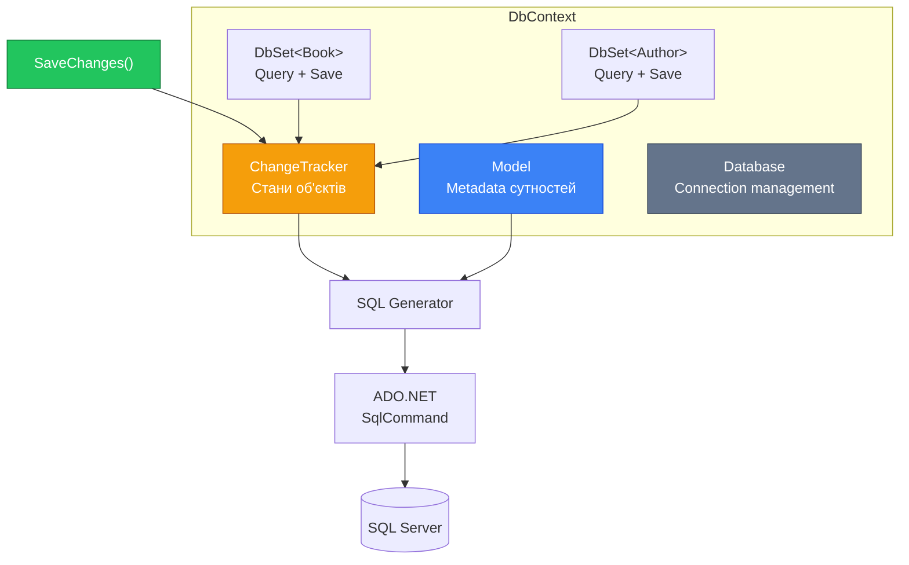
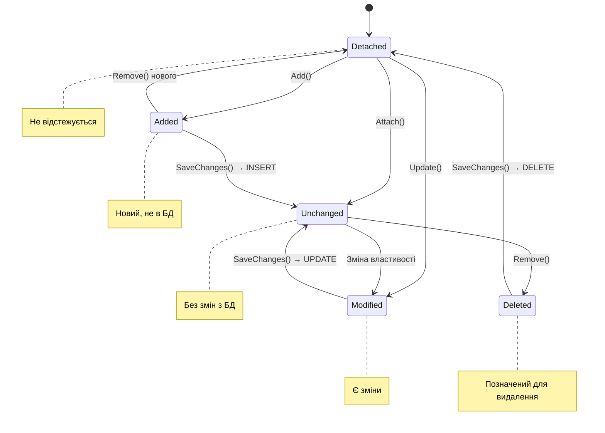
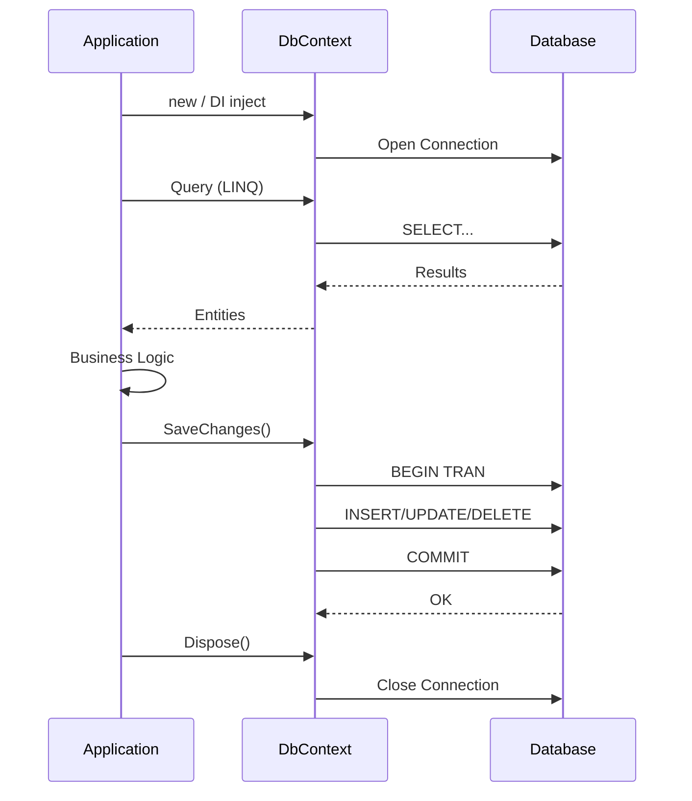

# 10.2. DbContext та DbSet — серце EF Core

## Вступ: Один клас, що керує всім

У попередній статті ми побачили EF Core «у дії» — три рядки коду замість двадцяти. Але за цією простотою стоїть складний механізм, який координує з'єднання з базою, відстежує зміни в об'єктах, генерує SQL та забезпечує транзакційність. Усе це робить один клас — **`DbContext`**.

Якщо ви пройшли модуль ADO.NET, то ви вже знаєте ці патерни під іншими іменами:
- **DbContext** = Unit of Work + Identity Map (які ми самостійно реалізовували в [статті 9.12](/1.csharp/09.ado-net/12.advanced-patterns))
- **DbSet\<T\>** = Repository (інтерфейс `IBookRepository` з [статті 9.11](/1.csharp/09.ado-net/11.data-mapper-repository))
- **SaveChanges()** = `UnitOfWork.Commit()` з `SqlTransaction`

Розуміння `DbContext` — це ключ до ефективного використання EF Core. Більшість проблем з продуктивністю та неочікуваною поведінкою пов'язані саме з неправильним використанням контексту.

::note
**Передумови**: [10.1. Введення в ORM та EF Core](/1.csharp/10.ef-core/01.introduction). Рекомендовано: [9.12. Identity Map, Unit of Work](/1.csharp/09.ado-net/12.advanced-patterns).

::

---

## DbContext: Теорія та архітектура

### Що таке DbContext?

`DbContext` — це **сесія** взаємодії з базою даних. Він інкапсулює:

1. **З'єднання** — керує `SqlConnection` (відкриття/закриття)
2. **Модель** — знає структуру всіх таблиць та зв'язків
3. **Change Tracker** — відстежує стан кожного завантаженого об'єкта
4. **Query Pipeline** — перетворює LINQ на SQL
5. **SaveChanges** — групує зміни та зберігає їх у транзакції

::mermaid



::

### Аналогія: кошик у інтернет-магазині

Уявіть `DbContext` як **кошик** в інтернет-магазині:

1. Ви додаєте товари в кошик (`Add`) — вони ще не куплені
2. Ви змінюєте кількість (`Update`) — зміни лише в кошику
3. Ви видаляєте товар (`Remove`) — знову лише в кошику
4. Ви натискаєте «Оформити замовлення» (`SaveChanges()`) — **усе** зберігається одним махом

Якщо щось іде не так при оформленні — **жодна** зміна не зберігається (атомарність транзакції).

---

## Конфігурація DbContext

### Спосіб 1: OnConfiguring (для навчання)

Найпростіший спосіб — перевизначити метод `OnConfiguring`:

```csharp showLineNumbers
public class LibraryContext : DbContext
{
    public DbSet<Book> Books => Set<Book>();

    protected override void OnConfiguring(DbContextOptionsBuilder optionsBuilder)
    {
        optionsBuilder.UseSqlServer(
            "Server=localhost;Database=LibraryDb;Trusted_Connection=True;TrustServerCertificate=True;");
    }
}
```

### Спосіб 2: Через конструктор (для DI — рекомендований)

У реальних додатках конфігурація передається ззовні через **Dependency Injection**:

```csharp showLineNumbers
public class LibraryContext : DbContext
{
    public DbSet<Book> Books => Set<Book>();

    // Конструктор приймає опції ззовні
    public LibraryContext(DbContextOptions<LibraryContext> options)
        : base(options)
    {
    }
}

// Реєстрація у Program.cs (ASP.NET Core або Generic Host)
builder.Services.AddDbContext<LibraryContext>(options =>
    options.UseSqlServer(
        builder.Configuration.GetConnectionString("DefaultConnection")));
```

**Розбір:**

- **Рядок 6**: Конструктор приймає `DbContextOptions<LibraryContext>` — типізовані опції саме для цього контексту.
- **Рядок 12**: `AddDbContext` реєструє контекст у DI-контейнері як **Scoped** сервіс (один екземпляр на HTTP-запит у веб-додатках).
- **Рядок 14**: Connection String читається з `appsettings.json` — не хардкодиться.

### Спосіб 3: DbContext Factory (для фонових сервісів)

Коли потрібен контекст поза DI scope (у `BackgroundService`, batch jobs):

```csharp showLineNumbers
builder.Services.AddDbContextFactory<LibraryContext>(options =>
    options.UseSqlServer(connectionString));

// Використання у фоновому сервісі
public class BookImportService
{
    private readonly IDbContextFactory<LibraryContext> _factory;

    public BookImportService(IDbContextFactory<LibraryContext> factory)
    {
        _factory = factory;
    }

    public async Task ImportBooksAsync(List<Book> books)
    {
        // Кожен виклик створює новий контекст
        await using var context = await _factory.CreateDbContextAsync();
        context.Books.AddRange(books);
        await context.SaveChangesAsync();
    }
}
```

### Connection String в appsettings.json

```json [appsettings.json]
{
    "ConnectionStrings": {
        "DefaultConnection": "Server=localhost;Database=LibraryDb;Trusted_Connection=True;TrustServerCertificate=True;"
    }
}
```

::warning
**Ніколи** не зберігайте Connection String з паролем у коді або в `appsettings.json`, який потрапляє в git. Для розробки — використовуйте `dotnet user-secrets`. Для продакшну — Environment Variables або Azure Key Vault.

::

---

## DbSet\<T\>: Колекція доменних об'єктів

### Що таке DbSet?

`DbSet<T>` — це **точка входу** для роботи з конкретним типом сутності. Він виконує дві ролі:

1. **Query** — інтерфейс для LINQ-запитів (реалізує `IQueryable<T>`)
2. **Persistence** — методи для додавання, видалення, зміни стану сутностей

Це ваш **Repository**, вбудований в EF Core.

### Основні методи DbSet

::field-group

::field{name="Add(entity)" type="void"}
Позначає сутність для вставки. Стан → `Added`. SQL: `INSERT`.

::

::field{name="AddRange(entities)" type="void"}
Масове додавання. Один `SaveChanges()` → batch INSERT.

::

::field{name="Find(key)" type="TEntity?"}
Пошук за Primary Key. **Спершу перевіряє Change Tracker** — без SQL, якщо об'єкт вже завантажений.

::

::field{name="Remove(entity)" type="void"}
Позначає сутність для видалення. Стан → `Deleted`. SQL: `DELETE`.

::

::field{name="Update(entity)" type="void"}
Позначає **усі** властивості як змінені. Стан → `Modified`. Корисно для disconnected entities.

::

::field{name="Attach(entity)" type="void"}
Прикріплює сутність до контексту зі станом `Unchanged`. Для disconnected сценаріїв.

::

::field{name="Entry(entity)" type="EntityEntry"}
Повертає інформацію про стан конкретної сутності в Change Tracker.

::

::field{name="AsNoTracking()" type="IQueryable<T>"}
Запит без відстеження змін. Швидше для read-only операцій.

::

::

### Find() vs FirstOrDefault()

Важлива різниця:

```csharp showLineNumbers
// Find — СПЕРШУ перевіряє кеш (Identity Map), потім SQL
var book1 = context.Books.Find(1);   // SQL SELECT (перший виклик)
var book2 = context.Books.Find(1);   // БЕЗ SQL! Повертає з кешу
Console.WriteLine(ReferenceEquals(book1, book2)); // true

// FirstOrDefault — ЗАВЖДИ виконує SQL
var book3 = context.Books.FirstOrDefault(b => b.Id == 1);  // SQL SELECT
var book4 = context.Books.FirstOrDefault(b => b.Id == 1);  // знову SQL SELECT
```

`Find()` — це аналог Identity Map, який ми реалізовували в ADO.NET. EF Core спочатку шукає об'єкт у Change Tracker, і тільки якщо не знаходить — звертається до бази.

---

## Change Tracker: Відстеження змін

### Стани сутностей

Кожна сутність, з якою працює `DbContext`, має один з п'яти станів:

::mermaid



::

| Стан | Опис | Дія при `SaveChanges()` |
|:---|:---|:---|
| **Detached** | Об'єкт не відстежується контекстом | Нічого |
| **Unchanged** | Завантажений з БД, не змінювався | Нічого |
| **Added** | Новий, ще не в БД | `INSERT` |
| **Modified** | Існуючий, змінено властивість | `UPDATE` |
| **Deleted** | Позначений для видалення | `DELETE` |

### Як працює відстеження змін

Коли ви завантажуєте сутність з бази, EF Core зберігає **snapshot** (знімок) її стану. При виклику `SaveChanges()` він порівнює поточні значення зі snapshot і визначає, що змінилося:

```csharp showLineNumbers
using var context = new LibraryContext();

// Завантажуємо книгу — стан Unchanged
var book = context.Books.Find(1)!;
Console.WriteLine(context.Entry(book).State); // Unchanged

// Змінюємо властивість — стан автоматично стає Modified
book.Title = "Новий заголовок";
Console.WriteLine(context.Entry(book).State); // Modified

// Дивимося, які властивості змінилися
foreach (var prop in context.Entry(book).Properties)
{
    if (prop.IsModified)
    {
        Console.WriteLine($"  {prop.Metadata.Name}: {prop.OriginalValue} → {prop.CurrentValue}");
        // Title: Старий заголовок → Новий заголовок
    }
}

// SaveChanges генерує UPDATE тільки для змінених стовпців
context.SaveChanges();
// SQL: UPDATE Books SET Title = @p0 WHERE Id = @p1
```

**Ключовий момент**: EF Core генерує `UPDATE` тільки для **змінених стовпців**. Якщо ви змінили тільки `Title`, SQL буде `SET Title = @p0`, а не `SET Title = @p0, Author = @p1, Year = @p2, ...`. Це значна оптимізація порівняно з нашим ADO.NET `Update()`, який завжди оновлював усі стовпці.

### EntityEntry — інспекція стану

`context.Entry(entity)` повертає `EntityEntry` — потужний інструмент для роботи зі станом:

```csharp showLineNumbers
var entry = context.Entry(book);

// Поточний і оригінальний стан
Console.WriteLine($"State: {entry.State}");
Console.WriteLine($"Original Title: {entry.OriginalValues["Title"]}");
Console.WriteLine($"Current Title: {entry.CurrentValues["Title"]}");

// Перевірка конкретної властивості
var titleProp = entry.Property(b => b.Title);
Console.WriteLine($"Title modified: {titleProp.IsModified}");

// Ручна зміна стану
entry.State = EntityState.Unchanged; // Скасувати зміни
entry.State = EntityState.Modified;  // Позначити як змінений
```

---

## SaveChanges: Атомарне збереження

### Як працює SaveChanges()

Метод `SaveChanges()` — це аналог `UnitOfWork.Commit()`, який ми реалізовували в ADO.NET. Він:

1. Викликає `DetectChanges()` — порівнює snapshot з поточними значеннями
2. Валідує зміни
3. Відкриває `SqlTransaction`
4. Генерує SQL-команди для всіх змін (INSERT, UPDATE, DELETE)
5. Виконує команди через ADO.NET
6. Робить `Commit` транзакції
7. Оновлює snapshot (нові значення стають «оригінальними»)
8. Повертає кількість зачеплених рядків

```csharp showLineNumbers
using var context = new LibraryContext();

// Накопичуємо кілька змін
var newBook = new Book { Title = "Нова книга", Author = "Автор", Year = 2024, Isbn = "ISBN-1" };
context.Books.Add(newBook);

var existing = context.Books.Find(1)!;
existing.Title = "Оновлений заголовок";

var toDelete = context.Books.Find(2)!;
context.Books.Remove(toDelete);

// ОДИН SaveChanges — ОДНА транзакція
int affected = context.SaveChanges();
Console.WriteLine($"Зачеплено рядків: {affected}"); // 3
```

Згенерований SQL (спрощено):

```sql
BEGIN TRANSACTION;
    INSERT INTO Books (Title, Author, Year, Isbn, IsAvailable) VALUES (@p0, @p1, @p2, @p3, @p4);
    UPDATE Books SET Title = @p5 WHERE Id = @p6;
    DELETE FROM Books WHERE Id = @p7;
COMMIT;
```

::tip
**Атомарність**: Якщо будь-яка операція впаде (наприклад, порушення UNIQUE constraint), **усі** зміни відкочуються. Це та сама транзакційна гарантія, яку ми реалізовували через `SqlTransaction` в ADO.NET.

::

### SaveChangesAsync

Для асинхронних сценаріїв (веб-додатки, API):

```csharp showLineNumbers
await using var context = new LibraryContext();

context.Books.Add(new Book { Title = "Async Book", Author = "Author", Year = 2024, Isbn = "ISBN" });
int affected = await context.SaveChangesAsync(); // Не блокує потік
```

---

## Lifecycle (Життєвий цикл) DbContext

### Рекомендації

`DbContext` — це **короткоживучий** об'єкт. Його потрібно створювати, використовувати та **якнайшвидше звільняти**:

::mermaid



::

### Правила

1. **Один контекст — одна операція** (або один HTTP-запит у веб-додатках)
2. **Завжди Dispose** — використовуйте `using` або DI (Scoped lifetime)
3. **Не кешуйте** DbContext як Singleton — це призведе до витоків пам'яті та конфліктів
4. **Не шаруйте** між потоками — `DbContext` **не thread-safe**

```csharp showLineNumbers
// ✅ Правильно — короткий lifetime
using (var context = new LibraryContext())
{
    var books = context.Books.ToList();
    // ... обробка
} // Dispose — з'єднання повернуто в пул

// ❌ Неправильно — довгий lifetime
public class BookService
{
    private readonly LibraryContext _context = new(); // Живе вічно! Memory leak!

    public List<Book> GetAll() => _context.Books.ToList();
}
```

### Connection Pooling

EF Core автоматично використовує **Connection Pooling** ADO.NET (який ми детально розглядали в [статті 9.2](/1.csharp/09.ado-net/02.connection)). Коли `DbContext` робить `Dispose()`, SQL-з'єднання **не закривається фізично** — воно повертається в пул для повторного використання.

### DbContext Pooling

EF Core також підтримує **пулінг самих контекстів** — замість створення нового `DbContext` при кожному запиті, він бере контекст з пулу:

```csharp showLineNumbers
// Замість AddDbContext — AddDbContextPool
builder.Services.AddDbContextPool<LibraryContext>(options =>
    options.UseSqlServer(connectionString),
    poolSize: 128); // Максимальна кількість контекстів у пулі
```

Це прибирає навантаження на GC (збиральник сміття) та прискорює створення контекстів.

---

## Логування SQL-запитів

### Базова конфігурація

Для навчання критично важливо бачити **згенерований SQL**:

```csharp showLineNumbers
protected override void OnConfiguring(DbContextOptionsBuilder optionsBuilder)
{
    optionsBuilder
        .UseSqlServer(connectionString)
        // Логування SQL у консоль
        .LogTo(Console.WriteLine, LogLevel.Information)
        // Показувати значення параметрів (тільки для розробки!)
        .EnableSensitiveDataLogging()
        // Детальні помилки
        .EnableDetailedErrors();
}
```

### Що ви побачите в консолі

```sql
-- context.Books.Where(b => b.Year > 2020).ToList()
info: Microsoft.EntityFrameworkCore.Database.Command
      Executed DbCommand (5ms) [Parameters=[@__p_0='2020'], CommandType='Text']
      SELECT [b].[Id], [b].[Author], [b].[Isbn], [b].[IsAvailable], [b].[Title], [b].[Year]
      FROM [Books] AS [b]
      WHERE [b].[Year] > @__p_0
```

::tip
Завжди тримайте логування увімкненим під час розробки. Це допоможе зрозуміти, скільки SQL-запитів виконується, та виявити проблеми продуктивності (N+1 problem).

::

### Логування у файл або через ILogger

```csharp showLineNumbers
// Логування у файл
optionsBuilder.LogTo(
    message => File.AppendAllText("ef-log.txt", message + "\n"),
    LogLevel.Information);

// Через ILoggerFactory (для ASP.NET Core)
// EF Core автоматично інтегрується з ILoggerFactory з DI
```

---

## Множинні DbSet — повна модель

Реальний `DbContext` зазвичай має кілька `DbSet`:

```csharp showLineNumbers
using Microsoft.EntityFrameworkCore;

public class LibraryContext : DbContext
{
    public DbSet<Book> Books => Set<Book>();
    public DbSet<Author> Authors => Set<Author>();
    public DbSet<Category> Categories => Set<Category>();

    public LibraryContext(DbContextOptions<LibraryContext> options)
        : base(options) { }

    protected override void OnModelCreating(ModelBuilder modelBuilder)
    {
        // Детальна конфігурація — у наступній статті
    }
}

public class Book
{
    public int Id { get; set; }
    public string Title { get; set; } = "";
    public int Year { get; set; }
    public string Isbn { get; set; } = "";
    public bool IsAvailable { get; set; } = true;

    // Навігаційні властивості (зв'язки)
    public int AuthorId { get; set; }     // Foreign Key
    public Author Author { get; set; } = null!;  // Navigation Property
}

public class Author
{
    public int Id { get; set; }
    public string Name { get; set; } = "";
    public string Country { get; set; } = "";

    // Колекція книг цього автора
    public List<Book> Books { get; set; } = new();
}

public class Category
{
    public int Id { get; set; }
    public string Name { get; set; } = "";
    public List<Book> Books { get; set; } = new();
}
```

Ми детально розглянемо навігаційні властивості та зв'язки в статтях 6 та 7. Зараз зверніть увагу на патерн: `Book.AuthorId` (Foreign Key) + `Book.Author` (Navigation Property) — це те, як EF Core маппить реляційний зв'язок на об'єктну модель.

---

## Практичні завдання

### Рівень 1: Базовий

::steps

### Завдання 1.1: Конфігурація DbContext

1. Створіть `SchoolContext` з `DbSet<Student>` та `DbSet<Course>`.
2. Налаштуйте OnConfiguring з логуванням SQL.
3. Створіть міграцію та базу.
4. Додайте тестові дані.

### Завдання 1.2: Change Tracker

1. Завантажте студента з бази.
2. Виведіть його стан (`Entry().State`).
3. Змініть ім'я — перевірте стан.
4. Виведіть `OriginalValues` та `CurrentValues`.
5. Зробіть `SaveChanges`, перевірте стан після.

::

### Рівень 2: Логіка

::steps

### Завдання 2.1: Batch-операції

1. Додайте 10 студентів через `AddRange`.
2. Подивіться в логах — скільки SQL-запитів згенеровано?
3. Оновіть 5 студентів одночасно.
4. Видаліть 3 через `RemoveRange`.
5. Один `SaveChanges()` — перевірте транзакційність.

### Завдання 2.2: Find vs FirstOrDefault

1. Виконайте `Find(1)` двічі — перевірте `ReferenceEquals` та кількість SQL.
2. Виконайте `FirstOrDefault(s => s.Id == 1)` двічі — порівняйте.
3. Зробіть висновок, коли використовувати кожен метод.

::

### Рівень 3: Архітектура

::steps

### Завдання 3.1: DI-конфігурація

1. Створіть hosted application (`Microsoft.Extensions.Hosting`).
2. Зареєструйте `SchoolContext` через `AddDbContext` з Connection String з `appsettings.json`.
3. Створіть `StudentService` що приймає `SchoolContext` через конструктор.

### Завдання 3.2: DbContext Factory

1. Зареєструйте `AddDbContextFactory<SchoolContext>`.
2. Створіть `BackgroundService` що імпортує дані кожні 30 секунд.
3. Використовуйте `_factory.CreateDbContext()` для кожної порції.

::

---

## Резюме

::card-group

::card{title="DbContext" icon="i-heroicons-cog-6-tooth"}
Центральний клас EF Core. Unit of Work + Identity Map. Керує з'єднанням, Change Tracker, транзакціями.

::

::card{title="DbSet<T>" icon="i-heroicons-archive-box"}
Repository для конкретного типу. IQueryable<T> для запитів, Add/Remove/Update для змін.

::

::card{title="Change Tracker" icon="i-heroicons-eye"}
Автоматичне відстеження змін через snapshot comparison. 5 станів: Detached, Unchanged, Added, Modified, Deleted.

::

::card{title="SaveChanges()" icon="i-heroicons-arrow-down-tray"}
Атомарне збереження: DetectChanges → SQL → Transaction → Commit. Оновлює тільки змінені стовпці.

::

::

## Корисні посилання

- [DbContext Lifetime, Configuration, and Initialization](https://learn.microsoft.com/en-us/ef/core/dbcontext-configuration/) — офіційна документація
- [Change Tracking](https://learn.microsoft.com/en-us/ef/core/change-tracking/) — детальний гайд
- [DbContext Pooling](https://learn.microsoft.com/en-us/ef/core/performance/advanced-performance-topics#dbcontext-pooling) — оптимізація
