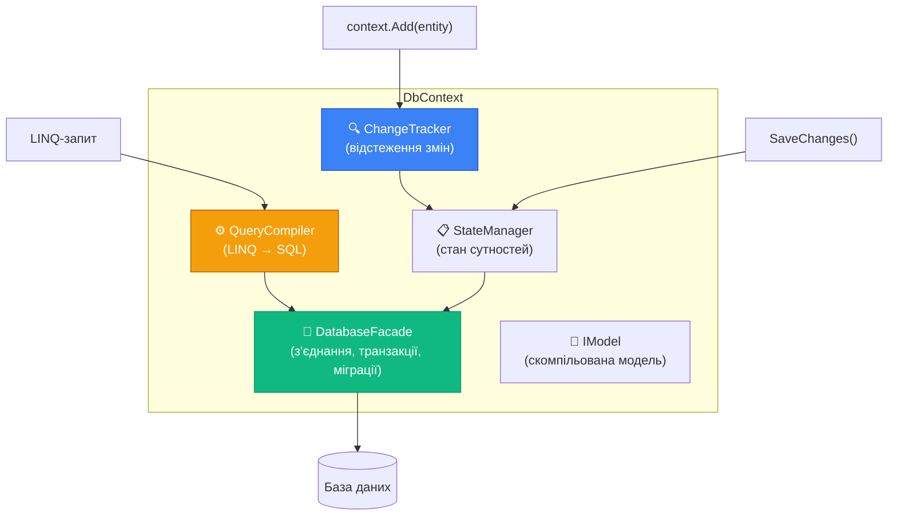
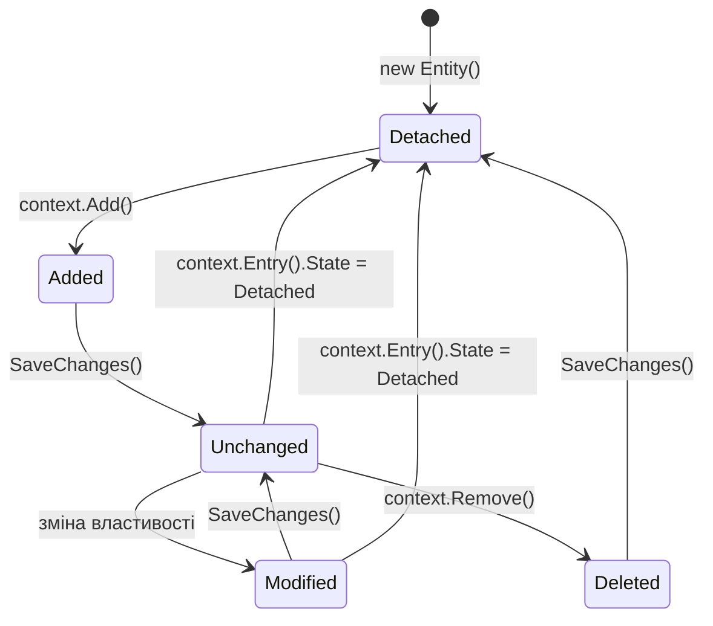
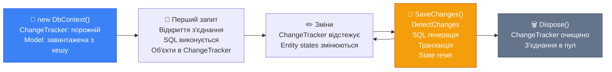

# DbContext: Серце EF Core

## Чому важливо розуміти DbContext зсередини

Більшість розробників, що починають з EF Core, ставляться до DbContext як до «чорної скриньки»: викликаєш `Add()`, `SaveChanges()` — і все якось зберігається. Поки проєкт простий — це працює. Але перші серйозні проблеми з'являються рівно тоді, коли ця внутрішня механіка стає несподіваною:

- Чому ж `DbContext` не можна використовувати в кількох потоках паралельно?
- Чому при Scoped-реєстрації два сервіси в одному HTTP-запиті отримують **один і той самий** контекст?
- Чому після `SaveChanges()` `author.Id` вже заповнений, а `book.Author` — може бути `null`?
- Чому `using var context = new AppDbContext()` у Scoped-середовищі — антипатерн?

Відповіді на всі ці питання — у внутрішній архітектурі `DbContext`. Ця стаття знімає «кришку» і показує, що всередині.

---

## DbContext як два класичних патерни

Перш ніж дивитись на код, розберемо концептуальну основу. `DbContext` реалізує два фундаментальні патерни з книги Мартіна Фаулера _«Patterns of Enterprise Application Architecture»_:

### Unit of Work

**Unit of Work** (одиниця роботи) — патерн, що відстежує всі об'єкти, модифіковані в межах однієї бізнес-транзакції, і координує запис змін до бази даних.

Ключова ідея: замість того щоб писати в базу при кожній зміні, ви накопичуєте всі зміни в пам'яті, а потім одним `SaveChanges()` атомарно зберігаєте все. Це гарантує узгодженість: або всі зміни зберігаються, або жодна.

```csharp
// DbContext як Unit of Work:
// - відстежує author (Added)
// - відстежує book (Added)
// - відстежує existingOrder зі зміненим Status (Modified)
// Один SaveChanges() зберігає всі три зміни в одній транзакції
context.Authors.Add(author);
context.Books.Add(book);
existingOrder.Status = OrderStatus.Completed;
await context.SaveChangesAsync(); // атомарно: або все, або нічого
```

### Repository

**Repository** — патерн, що надає колекційно-подібний інтерфейс для доступу до доменних об'єктів, приховуючи деталі доступу до даних.

`DbSet<T>` є реалізацією Repository: він виглядає і поводиться як колекція (`Add`, `Remove`, `Find`), але насправді — це абстракція над SQL-запитами.

::note
Деякі розробники додають ще один шар Repository поверх DbContext (наприклад, `IAuthorRepository`). Ми детально розглянемо питання «чи потрібен Repository над EF Core» у статті про архітектурні патерни (Блок 7). Там є нюанси, але коротка відповідь: у більшості випадків — ні, це зайвий шар.
::

---

## Анатомія DbContext: що всередині

DbContext — це не монолітний «менеджер бази даних». Він складається з кількох спеціалізованих підсистем:

::mermaid



::

**ChangeTracker** — реєструє всі завантажені та додані сутності, відстежує їх стан (`Added`, `Modified`, `Deleted`, `Unchanged`, `Detached`) і зберігає snapshot початкових значень.

**StateManager** — внутрішній менеджер, що управляє ідентичністю сутностей. Гарантує, що у межах одного DbContext завжди існує **тільки один** екземпляр сутності з конкретним Id (Identity Map).

**QueryCompiler** — транслює LINQ Expression Trees у SQL для конкретного провайдера. Кешує скомпільовані запити.

**DatabaseFacade** (`context.Database`) — API для з'єднань, транзакцій, виконання raw SQL, перевірки/застосування міграцій.

**IModel** — незмінна (immutable) скомпільована модель, що описує всі сутності, їх конфігурацію, зв'язки. Будується **один раз** при першому використанні і кешується.

---

## ChangeTracker: як EF Core бачить ваші об'єкти

ChangeTracker — це серце механізму збереження. Розберемо його детально.

### EntityState: п'ять станів сутності

Кожна сутність, що перебуває під наглядом DbContext, має один із п'яти станів:

::field-group

::field{name="Detached" type="EntityState"}
Сутність **не відстежується** контекстом. Нові об'єкти (створені через `new`) за замовчуванням є Detached. DbContext нічого не знає про них.
::

::field{name="Added" type="EntityState"}
Сутність буде **вставлена** при `SaveChanges()`. Встановлюється після `context.Add(entity)` або `context.DbSet.Add(entity)`.
::

::field{name="Unchanged" type="EntityState"}
Сутність завантажена з БД і **не змінювалась**. SaveChanges() не генерує для неї жодного SQL.
::

::field{name="Modified" type="EntityState"}
Одне або більше полів сутності **змінились** після завантаження. SaveChanges() згенерує `UPDATE`.
::

::field{name="Deleted" type="EntityState"}
Сутність буде **видалена** при SaveChanges(). Встановлюється після `context.Remove(entity)`.
::

::

### Як відбувається перехід між станами?

```csharp
// Починаємо — об'єкт Detached
var book = new Book { Title = "Нова книга", Price = 150m };
Console.WriteLine(context.Entry(book).State); // Detached

// Add() → стає Added
context.Books.Add(book);
Console.WriteLine(context.Entry(book).State); // Added

// SaveChanges() → стає Unchanged
await context.SaveChangesAsync();
Console.WriteLine(context.Entry(book).State); // Unchanged

// Змінюємо поле → стає Modified
book.Price = 200m;
Console.WriteLine(context.Entry(book).State); // Modified

// SaveChanges() → знову Unchanged
await context.SaveChangesAsync();
Console.WriteLine(context.Entry(book).State); // Unchanged

// Remove() → стає Deleted
context.Books.Remove(book);
Console.WriteLine(context.Entry(book).State); // Deleted

// SaveChanges() → об'єкт у Detached (видалений з БД і з трекера)
await context.SaveChangesAsync();
Console.WriteLine(context.Entry(book).State); // Detached
```

::mermaid



::

### Snapshot-based change detection

Коли EF Core завантажує сутність із бази, він збирає **snapshot** — точну копію всіх значень у момент завантаження. При `SaveChanges()` (або при явному виклику `ChangeTracker.DetectChanges()`) EF Core порівнює поточні значення зі snapshot:

```csharp
var book = await context.Books.FindAsync(1);
// ChangeTracker зберіг snapshot: { Title: "Захар Беркут", Price: 150 }

book.Price = 200m;
// Поточний стан: { Title: "Захар Беркут", Price: 200 }
// Snapshot:      { Title: "Захар Беркут", Price: 150 }
// DetectChanges знаходить: Price змінено → Modified

await context.SaveChangesAsync();
// UPDATE "Books" SET "Price" = 200 WHERE "Id" = 1
// Тільки змінене поле — не SELECT *!
```

### Інспекція ChangeTracker

Ви можете в будь-який момент перевірити, що відстежує контекст:

```csharp
// Переглянути всі відстежувані сутності
foreach (var entry in context.ChangeTracker.Entries())
{
    Console.WriteLine($"{entry.Entity.GetType().Name} [{entry.State}]");
}

// Або тільки у певному стані
var modifiedEntries = context.ChangeTracker
    .Entries<Book>()
    .Where(e => e.State == EntityState.Modified)
    .ToList();

// Отримати оригінальне значення конкретного поля
var bookEntry = context.Entry(book);
var originalPrice = bookEntry.Property(b => b.Price).OriginalValue;
var currentPrice  = bookEntry.Property(b => b.Price).CurrentValue;
Console.WriteLine($"Ціна: {originalPrice} → {currentPrice}");
```

### DebugView: ваш кращий друг при відлагодженні

EF Core 5+ надає зручний текстовий snapshot стану ChangeTracker:

```csharp
// Коротке представлення
Console.WriteLine(context.ChangeTracker.DebugView.ShortView);
// Book {Id: 1} Unchanged

// Розгорнуте представлення (всі властивості)
Console.WriteLine(context.ChangeTracker.DebugView.LongView);
// Book {Id: 1} Unchanged
//   Id: 1 PK
//   Title: 'Захар Беркут'
//   Price: 200 Modified Originally 150
//   AuthorId: 1 FK
```

---

## Identity Map: чому один об'єкт — один екземпляр

StateManager реалізує патерн **Identity Map**: у межах одного DbContext завжди існує лише **один** екземпляр конкретної сутності за її первинним ключем.

```csharp
// Обидва запити повертають один і той самий об'єкт у пам'яті
var book1 = await context.Books.FindAsync(1);
var book2 = await context.Books.FindAsync(1); // другий запит до БД не йде!

Console.WriteLine(ReferenceEquals(book1, book2)); // True!
```

`FindAsync` перевіряє ChangeTracker перед відправкою запиту: якщо сутність вже завантажена — повертає існуючий екземпляр. Це важливо для консистентності: якщо ви змінили `book1.Price`, то `book2.Price` відображає ту саму зміну, бо це один і той самий об'єкт.

::tip
LINQ-запити через `Where()`, `FirstOrDefault()` тощо **не мають** такої поведінки за замовчуванням — вони завжди ходять у БД. Але після отримання результату EF Core перевіряє Identity Map: якщо об'єкт із таким Id вже є в ChangeTracker — повертає **існуючий** відстежуваний об'єкт, а не новий. Це може здивувати, якщо ви очікуєте «свіжі» дані з БД.
::

---

## Lifecycle DbContext: від народження до dispose

Розуміння lifecycle критично для правильного використання DbContext.

```csharp
// --- НАРОДЖЕННЯ ---
using var context = new AppDbContext(options);
// IModel вже скомпільована (кешується між екземплярами)
// ChangeTracker порожній
// З'єднання з БД ще не відкрите (lazy)

// --- ПЕРШЕ ВИКОРИСТАННЯ ---
var books = await context.Books.ToListAsync();
// Відкривається з'єднання
// Виконується SQL
// Результати реєструються в ChangeTracker
// З'єднання повертається в пул (не закривається між операціями!)

// --- АКТИВНА РОБОТА ---
var book = books.First();
book.Price = 250m; // ChangeTracker фіксує зміну
context.Authors.Add(new Author { Name = "Леся Українка" }); // Added
await context.SaveChangesAsync(); // транзакція, SQL, state reset

// --- DISPOSE ---
// 'using' викликає context.Dispose()
// ChangeTracker очищується
// З'єднання повертається в пул (ConnectionPool)
// IModel НЕ видаляється — вона кешована статично
```

::mermaid



::

### З'єднання та Connection Pooling

EF Core **не тримає відкрите з'єднання** весь час. Він використовує **Connection Pool** — пул з'єднань, що керується ADO.NET під капотом. Це означає:

- При першому запиті з'єднання **береться з пулу** (або створюється)
- Між окремими SQL-командами з'єднання може **повертатись** у пул
- При `Dispose()` з'єднання повертається в пул, але **не закривається** фізично

Завдяки цьому ви не платите за накладні витрати фізичного TCP-з'єднання при кожному запиті.

---

## Thread Safety: чому DbContext не є потокобезпечним

> DbContext не є thread-safe. Ніколи не використовуйте один екземпляр DbContext у кількох паралельних операціях.

Це офіційне формулювання з документації Microsoft. Розберемо чому.

ChangeTracker, StateManager та інші внутрішні стани DbContext не захищені примітивами синхронізації (`lock`, `Mutex` тощо). Вони є простими колекціями і об'єктами в пам'яті. При паралельному доступі виникає **race condition**:

```csharp
// ❌ НЕПРАВИЛЬНО: два паралельних запити до одного контексту
var context = new AppDbContext(); // один екземпляр

var task1 = context.Books.Where(b => b.Price > 100).ToListAsync();
var task2 = context.Authors.ToListAsync();

// InvalidOperationException:
// "A second operation was started on this context instance before
//  a previous operation completed."
await Task.WhenAll(task1, task2);
```

EF Core навіть **детектує** цю ситуацію і кидає `InvalidOperationException`. Але не завжди — іноді ви отримаєте корупцію стану без явного exception.

### Правильний підхід: один DbContext на одну «одиницю роботи»

::tabs

::tabs-item{label="Консольний застосунок"}

```csharp
// ✅ Окремий контекст для кожної операції
async Task ProcessOrderAsync(int orderId)
{
    // Новий контекст для кожного виклику
    await using var context = new AppDbContext(options);
    var order = await context.Orders.FindAsync(orderId);
    order!.Status = OrderStatus.Processing;
    await context.SaveChangesAsync();
}

// Паралельне виконання — БЕЗПЕЧНО, бо різні екземпляри
await Task.WhenAll(
    ProcessOrderAsync(1),
    ProcessOrderAsync(2),
    ProcessOrderAsync(3)
);
```

::

::tabs-item{label="ASP.NET Core (Scoped)"}

У ASP.NET Core DbContext реєструється як **Scoped** — одна ітсанція на HTTP-запит. Кожен запит отримує свій контекст, але всередині одного запиту — один спільний:

```csharp
// Реєстрація (один раз, при старті застосунку)
builder.Services.AddDbContext<AppDbContext>(opts =>
    opts.UseNpgsql(connectionString));

// У Controller або Service — DbContext інжектується автоматично
public class BooksController : ControllerBase
{
    private readonly AppDbContext _context;

    public BooksController(AppDbContext context)
    {
        _context = context; // один екземпляр на весь HTTP-запит
    }

    [HttpGet]
    public async Task<IActionResult> GetAll()
    {
        var books = await _context.Books.ToListAsync();
        return Ok(books);
    }
}
```

::note
**Ремарка:** Dependency Injection (DI) та Scoped lifetime детально вивчатимуться у розділі ASP.NET Core. Наразі достатньо розуміти: Scoped означає «один екземпляр DbContext на один HTTP-запит» — це правильна гранулярність для веб-застосунків.
::

::

::tabs-item{label="Background Services"}

Background Services (фонові сервіси) реєструються як **Singleton**. Але DbContext — **Scoped**. Singleton не може напряму залежати від Scoped-сервісу!

```csharp
// ❌ НЕПРАВИЛЬНО: DbContext як конструктор-залежність у Singleton
public class BackgroundWorker : BackgroundService
{
    private readonly AppDbContext _context; // Scoped в Singleton — помилка!
    // ...
}

// ✅ ПРАВИЛЬНО: IDbContextFactory для фонових сервісів
public class BackgroundWorker : BackgroundService
{
    private readonly IDbContextFactory<AppDbContext> _factory;

    public BackgroundWorker(IDbContextFactory<AppDbContext> factory)
    {
        _factory = factory;
    }

    protected override async Task ExecuteAsync(CancellationToken stoppingToken)
    {
        while (!stoppingToken.IsCancellationRequested)
        {
            // Кожна ітерація — новий контекст
            await using var context = await _factory.CreateDbContextAsync();
            // ... робота з даними
            await Task.Delay(TimeSpan.FromMinutes(1), stoppingToken);
        }
    }
}
```

::

::

---

## DbContextFactory: коли Scoped недостатньо

`IDbContextFactory<T>` — фабрика, що дозволяє явно створювати і контролювати lifecycle DbContext. Реєструється через `AddDbContextFactory`:

```csharp [Program.cs]
// Реєстрація фабрики (замість або поряд з AddDbContext)
builder.Services.AddDbContextFactory<AppDbContext>(opts =>
    opts.UseNpgsql(connectionString));
```

Сценарії використання:

::accordion

::accordion-item{label="Blazor Server" icon="i-lucide-zap"}
У Blazor Server компоненти живуть довше, ніж один HTTP-запит. Scoped DbContext не підходить — через нього буде витік пам'яті (ChangeTracker накопичуватиме об'єкти весь час).

```csharp
@inject IDbContextFactory<AppDbContext> DbFactory

async Task LoadData()
{
    // Явно контролюємо lifecycle — новий контекст тільки для цієї операції
    await using var context = await DbFactory.CreateDbContextAsync();
    Books = await context.Books.ToListAsync();
}
```
::

::accordion-item{label="Паралельні операції" icon="i-lucide-git-branch"}
Коли потрібно виконати кілька незалежних операцій паралельно — кожна отримує свій контекст:

```csharp
await using var ctx1 = await factory.CreateDbContextAsync();
await using var ctx2 = await factory.CreateDbContextAsync();

// Паралельно і безпечно
var (authors, books) = await (
    ctx1.Authors.ToListAsync(),
    ctx2.Books.ToListAsync()
).WaitAsync(cancellationToken);
```
::

::accordion-item{label="Background Services" icon="i-lucide-settings"}
Як показано вище — фонові сервіси є Singleton, тому потребують фабрику для створення Scoped DbContext на кожну ітерацію.
::

::

---

## AddDbContext vs AddDbContextPool

`AddDbContext` і `AddDbContextPool` — два способи реєстрації DbContext у DI-контейнері. Між ними важлива різниця:

### AddDbContext (стандарт)

```csharp
builder.Services.AddDbContext<AppDbContext>(opts =>
    opts.UseNpgsql(connectionString));
```

При кожному HTTP-запиті (кожному Scope) створюється **новий** екземпляр `AppDbContext`. Після завершення запиту — `Dispose()` і збирання сміттям.

### AddDbContextPool (пул)

```csharp
builder.Services.AddDbContextPool<AppDbContext>(opts =>
    opts.UseNpgsql(connectionString), poolSize: 128);
```

DbContext-об'єкти **не знищуються** після `Dispose()` — вони повертаються в пул і перевикористовуються. При наступному HTTP-запиті береться готовий DbContext із пулу замість створення нового.

**Що скидається при поверненні в пул:** ChangeTracker, локальні дані, стани — все очищується до стану «свіжого» контексту.

**Що не скидається:** з'єднання з БД (воно і так у Connection Pool), скомпільована IModel.

::card-group

::card{title="Коли пул дає ефект" icon="i-lucide-trending-up"}

- Висока частота HTTP-запитів (тисячі RPS)
- `OnConfiguring` або `OnModelCreating` є дорогою операцією (рідко)
- Бенчмарки показали, що пул має ефект ~10–15% throughput при 10k+ RPS

::

::card{title="Обмеження пулу" icon="i-lucide-triangle-alert"}

- `AppDbContext` не повинен мати нічого, що не можна скинути (приватного стану)
- `OnConfiguring` не може залежати від Scoped-сервісів
- Не сумісний з деякими кастомними налаштуваннями lifecycle

::

::

**Практична порада:** для більшості застосунків з < 1000 RPS різниця між `AddDbContext` і `AddDbContextPool` є незначною. Починайте з `AddDbContext`.

---

## OnConfiguring vs OnModelCreating: різниця відповідальностей

Два методи, які часто плутають початківці:

```csharp
public class AppDbContext : DbContext
{
    public AppDbContext(DbContextOptions<AppDbContext> options) : base(options) { }

    // OnConfiguring: відповідає за ЯК підключатись
    // Викликається при кожній ініціалізації контексту
    // Може залежати від runtime-значень
    protected override void OnConfiguring(DbContextOptionsBuilder optionsBuilder)
    {
        // Зазвичай НЕ перевизначається, якщо options передаються через конструктор
        // Але можна додати додаткові налаштування поверх переданих options:
        optionsBuilder.EnableDetailedErrors();
    }

    // OnModelCreating: відповідає за ЯКА структура даних
    // Викликається ОДИН РАЗ і результат кешується у IModel
    // Тут конфігурується схема сутностей, зв'язки, індекси
    protected override void OnModelCreating(ModelBuilder modelBuilder)
    {
        // Конфігурація сутностей через Fluent API
        modelBuilder.Entity<Author>(entity =>
        {
            entity.ToTable("Authors");
            entity.HasKey(a => a.Id);
            entity.Property(a => a.Name).IsRequired().HasMaxLength(200);
            entity.HasMany(a => a.Books)
                  .WithOne(b => b.Author)
                  .HasForeignKey(b => b.AuthorId)
                  .OnDelete(DeleteBehavior.Cascade);
        });

        // Автоматичне підключення IEntityTypeConfiguration з асемблі
        modelBuilder.ApplyConfigurationsFromAssembly(typeof(AppDbContext).Assembly);
    }
}
```

::card-group

::card{title="OnConfiguring" icon="i-lucide-settings"}

**Відповідає за:** провайдер БД, рядок підключення, логування, додаткові runtime-опції.

**Викликається:** при кожній ініціалізації DbContext (але опції кешуються при використанні конструктора).

**Коли перевизначати:** рідко — у більшості випадків options передаються через конструктор із DI.

::

::card{title="OnModelCreating" icon="i-lucide-database"}

**Відповідає за:** схему сутностей, таблиці, стовпці, зв'язки, індекси, global query filters, конвертери.

**Викликається:** **один раз** при першому використанні DbContext. Результат (IModel) кешується статично.

**Коли перевизначати:** завжди, коли потрібна конфігурація, яку не покривають конвенції.

::

::

---

## DbContextOptions та DbContextOptionsBuilder

`DbContextOptions<TContext>` — immutable-об'єкт, що містить всі налаштування DbContext. Створюється через `DbContextOptionsBuilder`:

```csharp
// Ручне створення options (консольні застосунки, тести)
var options = new DbContextOptionsBuilder<AppDbContext>()
    .UseNpgsql("Host=localhost;Database=mydb;Username=postgres;Password=secret")
    .EnableSensitiveDataLogging()
    .EnableDetailedErrors()
    .LogTo(Console.WriteLine, LogLevel.Information)
    .Options; // повертає готовий DbContextOptions<AppDbContext>

await using var context = new AppDbContext(options);
```

У тестах це особливо зручно — ви можете підставити SQLite in-memory замість реального PostgreSQL:

```csharp [Tests/DatabaseFixture.cs]
public static AppDbContext CreateTestContext()
{
    var options = new DbContextOptionsBuilder<AppDbContext>()
        .UseSqlite("Data Source=:memory:") // in-memory для тестів
        .Options;

    var context = new AppDbContext(options);
    context.Database.EnsureCreated();
    return context;
}
```

---

## IDesignTimeDbContextFactory: для CLI-інструментів

Команди `dotnet ef migrations add` або `dotnet ef database update` потребують можливості **створити DbContext під час компіляції** — без запущеного застосунку, без DI-контейнера.

Якщо ваш DbContext конфігурується через DI і немає публічного конструктора без параметрів — CLI не зможе його створити. Для цього існує `IDesignTimeDbContextFactory<TContext>`:

```csharp [Data/AppDbContextFactory.cs]
public class AppDbContextFactory : IDesignTimeDbContextFactory<AppDbContext>
{
    public AppDbContext CreateDbContext(string[] args)
    {
        // Цей метод викликається ТІЛЬКИ CLI-інструментами
        // НЕ викликається при нормальній роботі застосунку
        var options = new DbContextOptionsBuilder<AppDbContext>()
            .UseNpgsql("Host=localhost;Database=mydb;Username=dev;Password=dev")
            .Options;

        return new AppDbContext(options);
    }
}
```

EF Core CLI автоматично знаходить цей клас в асемблі і використовує його. Файл зазвичай кладуть поруч із `AppDbContext.cs`.

::tip
Якщо ваш DbContext має конструктор `public AppDbContext(DbContextOptions<AppDbContext> options)` **і** DI-реєстрацію через `AddDbContext`, то для міграцій CLI зазвичай зможе самостійно визначити конфігурацію через `Program.cs`. `IDesignTimeDbContextFactory` потрібна переважно у нестандартних сценаріях (бібліотеки, складні конфігурації) або коли автовизначення не працює.
::

---

## ChangeTracker.Clear(): коли і навіщо

`context.ChangeTracker.Clear()` видаляє **всі** відстежувані сутності з ChangeTracker. Це переводить їх у стан `Detached`.

```csharp
// Завантажили 1000 сутностей — всі в ChangeTracker
var allBooks = await context.Books.ToListAsync();

// Обробили, зберегли
await context.SaveChangesAsync();

// Звільнили ChangeTracker — зменшили тиск на пам'ять
context.ChangeTracker.Clear();

// Тепер можна безпечно завантажити наступну партію
var nextBatch = await context.Books
    .Where(b => b.Year > 2020)
    .ToListAsync();
```

**Коли потрібен `Clear()`:**

- Пакетна обробка великих обсягів даних (batch processing), коли один контекст живе довго і ChangeTracker накопичує тисячі об'єктів
- Після `SaveChanges()` у довготривалих операціях, щоб звільнити пам'ять
- Коли треба «обнулити» контекст і завантажити свіжі дані з БД

Для read-only операцій краще одразу використовувати `AsNoTracking()`:

```csharp
// Не потрапляє в ChangeTracker — не потребує Clear()
var books = await context.Books.AsNoTracking().ToListAsync();
```

---

## Auto-DetectChanges: вплив на продуктивність

`DetectChanges()` — потенційно дорога операція. EF Core викликає її автоматично при:

- `SaveChanges()` / `SaveChangesAsync()`
- `context.Entry(entity)` (за замовчуванням)
- `context.ChangeTracker.Entries()`
- Деяких LINQ-операціях

При тисячах відстежуваних сутностей — кожен `Entry()` запускає `DetectChanges()`, що сканує всі сутності. Це може суттєво сповільнити роботу.

**Вимкнення авто-DetectChanges:**

```csharp
// Вимкнути AUTO-виклик DetectChanges
context.ChangeTracker.AutoDetectChangesEnabled = false;

// Тепер CRUD-операції не викликають DetectChanges автоматично
// Ви маєте викликати його вручну перед SaveChanges, якщо потрібно
context.ChangeTracker.DetectChanges();
await context.SaveChangesAsync();
```

::warning
Вимикати `AutoDetectChangesEnabled` варто лише якщо ви точно знаєте, що робите і профайлером підтверджено проблему. Забуте ручне `DetectChanges()` призведе до того, що зміни не збережуться — і це буде дуже складно відлагодити.
::

Для пакетної вставки великої кількості сутностей без читання — краще використовуйте `ExecuteUpdate/ExecuteDelete` (EF Core 7+) або спеціалізовані бібліотеки (`EFCore.BulkExtensions`).

---

## Множинні DbContext: Bounded Contexts

Великі застосунки іноді мають кілька DbContext. Це реалізація концепції **Bounded Context** із Domain-Driven Design — кожна область відповідальності має свою ізольовану модель.

```csharp
// Контекст для каталогу товарів (читання)
public class CatalogReadContext : DbContext
{
    public DbSet<ProductSummary> Products => Set<ProductSummary>();
    // Налаштований на read-only з AsNoTracking по дефолту
}

// Контекст для обробки замовлень (повна модель)
public class OrdersContext : DbContext
{
    public DbSet<Order> Orders => Set<Order>();
    public DbSet<OrderItem> OrderItems => Set<OrderItem>();
    public DbSet<Customer> Customers => Set<Customer>();
}

// Контекст для адміністрування (окрема схема)
public class AdminContext : DbContext
{
    public DbSet<User> Users => Set<User>();
    public DbSet<Role> Roles => Set<Role>();
}
```

Реєстрація кількох контекстів у DI:

```csharp
builder.Services.AddDbContext<CatalogReadContext>(opts =>
    opts.UseNpgsql(connectionString));

builder.Services.AddDbContext<OrdersContext>(opts =>
    opts.UseNpgsql(connectionString));

builder.Services.AddDbContext<AdminContext>(opts =>
    opts.UseNpgsql(connectionString));
```

Кожен контекст є незалежним — зі своїм ChangeTracker, своєю IModel, своїми транзакціями.

---

## Практичні завдання

::card-group

::card{title="Рівень 1: Дослідження" icon="i-lucide-brain"}

**Завдання 1.1** — Візьміть проєкт з попередньої статті (BookCatalog). Після кожної операції (Add, SaveChanges, зміна поля) виводьте у консоль `context.ChangeTracker.DebugView.ShortView`. Зафіксуйте, як змінюються стани сутностей протягом повного CRUD-циклу.

**Завдання 1.2** — Напишіть код, що демонструє Identity Map: завантажте книгу двічі (через `FindAsync` і через `Where().FirstAsync()`). Перевірте через `ReferenceEquals`, чи це один об'єкт. Поясніть, чому `FindAsync` не робить другий запит до БД.

**Завдання 1.3** — Спробуйте порушити thread safety: запустіть два паралельних `ToListAsync()` на одному контексті через `Task.WhenAll`. Запишіть, яке виключення отримаєте і що пояснює повідомлення про помилку.

::

::card{title="Рівень 2: Практика" icon="i-lucide-bar-chart"}

**Завдання 2.1** — Реалізуйте `IDesignTimeDbContextFactory<AppDbContext>` для проєкту BookCatalog. Переконайтесь, що `dotnet ef dbcontext info` успішно виводить інформацію про контекст і його модель.

**Завдання 2.2** — Вимкніть `AutoDetectChangesEnabled`. Змініть поле у сутності. Викличте `SaveChangesAsync()` — чи збережеться зміна? Потім викличте `context.ChangeTracker.DetectChanges()` і знову `SaveChangesAsync()`. Поясніть різницю.

**Завдання 2.3** — Напишіть метод `GetTrackerStats()`, що повертає кількість сутностей у кожному стані (`Added`, `Modified`, `Deleted`, `Unchanged`). Використайте `context.ChangeTracker.Entries()` і LINQ. Викликайте його у різні моменти CRUD-циклу і спостерігайте статистику.

::

::card{title="Рівень 3: Складні сценарії" icon="i-lucide-rocket"}

**Завдання 3.1 — DbContextFactory в дії:** Реалізуйте імітацію Background Service: клас `BookImportService` з методом `ImportBooksAsync(IEnumerable<BookDto> books)`. Сервіс повинен: (а) приймати дані партіями по 100 книжок, (б) використовувати `IDbContextFactory`, щоб кожна партія мала **свій** DbContext, (в) виводити кількість збережених книг після кожної партії. Протестуйте з 350 книгами.

**Завдання 3.2 — Bounded Context:** Розбийте модель BookCatalog на два контексти: `PublicCatalogContext` (тільки `Books` і `Authors` з `AsNoTracking` за замовчуванням через `OnModelCreating`) та `AdminContext` (всі сутності, повний доступ). Зареєструйте обидва. Напишіть сервіс, що з першого читає дані для відображення, а через другий — адмінські операції.

::

::

---

## Підсумок

::note
**Ключові думки цієї статті:**

- **DbContext** реалізує два патерни: **Unit of Work** (накопичення змін) та **Repository** (колекційний інтерфейс через DbSet)
- Внутрішня архітектура: **ChangeTracker** (стани), **StateManager** (Identity Map), **QueryCompiler** (LINQ→SQL), **DatabaseFacade** (з'єднання), **IModel** (скомпільована схема, кешується)
- **Snapshot-based change detection**: EF Core зберігає оригінальні значення і порівнює з поточними при `SaveChanges()`
- **Identity Map**: один DbContext → один C#-об'єкт на кожну сутність за PK
- **DbContext не є thread-safe** — один екземпляр для однієї одиниці роботи
- Для фонових сервісів і Blazor — `IDbContextFactory<T>` замість прямого інжекту DbContext
- `AddDbContextPool` дає ~10–15% поліпшення throughput при дуже високих навантаженнях
- **OnConfiguring** — провайдер і з'єднання; **OnModelCreating** — схема і конфігурація (кешується!)
- `ChangeTracker.Clear()` для довготривалих операцій; `AsNoTracking()` для read-only запитів
::

Наступна стаття — [Провайдери баз даних](/csharp/ef-core/database-providers) — розбирає архітектуру провайдерів EF Core, відмінності між PostgreSQL, SQL Server, SQLite та InMemory, і як один C#-код підтримує різні СУБД.
