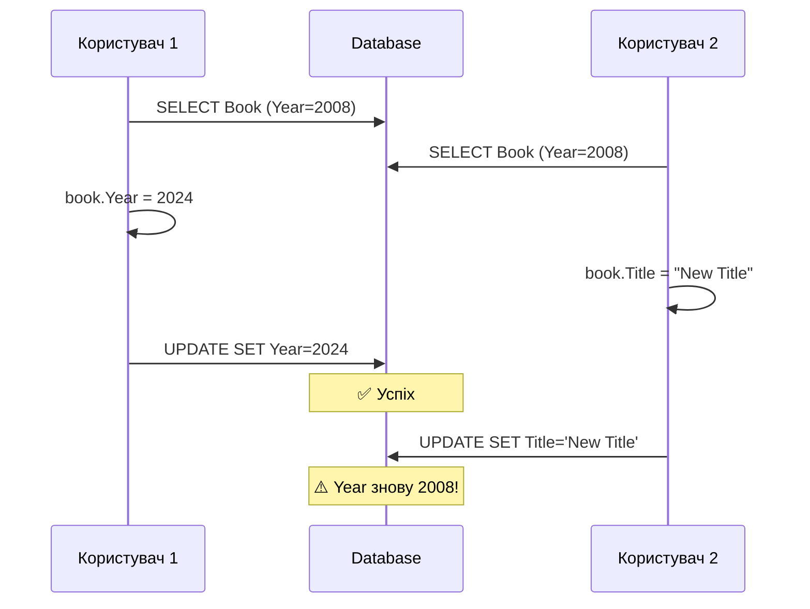

# 10.4. CRUD-операції та Change Tracker

## Вступ: Чотири базові операції

**CRUD** — Create, Read, Update, Delete — це чотири фундаментальні операції з даними. У ADO.NET кожна операція вимагала написання SQL, створення параметрів, виконання команди та маппінгу результатів. У EF Core все це **автоматизовано**, але розуміння того, що відбувається «під капотом», критично важливе.

У цій статті ми детально розглянемо кожну операцію, механізм Change Tracker, роботу з disconnected entities (типовий Web API сценарій) та оптимістичну конкурентність.

::note
**Передумови**: [10.2. DbContext та DbSet](/1.csharp/10.ef-core/02.dbcontext-dbset), [10.3. Entity Configuration](/1.csharp/10.ef-core/03.entity-configuration).

::

---

## Create (INSERT)

**Приклад додавання:**

::code-group

```csharp [Program.cs]
using var context = new LibraryContext();

var book = new Book
{
    Title = "Чистий код",
    Author = "Роберт Мартін",
    Year = 2008,
    Isbn = "978-0132350884"
};

// Стан ПЕРЕД Add: Detached
Console.WriteLine(context.Entry(book).State); // Detached

context.Books.Add(book);

// Стан ПІСЛЯ Add: Added
Console.WriteLine(context.Entry(book).State); // Added

// Id ще не присвоєний (тимчасовий)
Console.WriteLine($"Id перед Save: {book.Id}"); // 0

context.SaveChanges();

// Id присвоєний базою даних
Console.WriteLine($"Id після Save: {book.Id}"); // 1 (або інший)

// Стан після Save: Unchanged
Console.WriteLine(context.Entry(book).State); // Unchanged
```

```sql [Generated SQL]
-- SQL Server
INSERT INTO [Books] ([Author], [Isbn], [IsAvailable], [Title], [Year])
VALUES (@p0, @p1, @p2, @p3, @p4);

SELECT [Id]
FROM [Books]
WHERE @@ROWCOUNT = 1 AND [Id] = scope_identity();
```

::

**Що відбувається при `SaveChanges()`:**

1. EF Core знаходить усі сутності зі станом `Added`.
2. Генерує SQL `INSERT`.
3. Додає `SELECT scope_identity()` (для SQL Server) або `RETURNING` (для PostgreSQL/SQLite) для отримання згенерованого Id.
4. Виконує SQL в одній транзакції.
5. Записує отриманий Id назад у властивість об'єкта.
6. Змінює стан сутності на `Unchanged`.

### Додавання кількох сутностей (Batch)

::code-group

```csharp [Program.cs]
using var context = new LibraryContext();

var books = new List<Book>
{
    new() { Title = "Рефакторинг", Author = "Мартін Фаулер", Year = 1999, Isbn = "ISBN-1" },
    new() { Title = "DDD", Author = "Ерік Еванс", Year = 2003, Isbn = "ISBN-2" },
    new() { Title = "Clean Architecture", Author = "Роберт Мартін", Year = 2017, Isbn = "ISBN-3" },
};

context.Books.AddRange(books); // Batch Add (позначає всі як Added)
context.SaveChanges();         // Один виклик = batch INSERT
```

```sql [Generated SQL (EF Core 9)]
-- EF Core 9 генерує оптимізований batch через MERGE або багаторядковий INSERT
INSERT INTO [Books] ([Author], [Isbn], [IsAvailable], [Title], [Year])
OUTPUT INSERTED.[Id]
VALUES (@p0, @p1, @p2, @p3, @p4),
       (@p5, @p6, @p7, @p8, @p9),
       (@p10, @p11, @p12, @p13, @p14);
```

::

---

## Read (SELECT)

EF Core надає кілька способів читання даних:

### Find — пошук за Primary Key

`Find` — це спеціальний метод, який спочатку перевіряє **Change Tracker**. Якщо сутність з таким `Id` вже завантажена в пам'ять, EF Core поверне її **без запиту до БД**.

::code-group

```csharp [Program.cs]
using var context = new LibraryContext();

// Find спочатку перевіряє Change Tracker (Identity Map)
var book = context.Books.Find(1);
```

```sql [Generated SQL (якщо немає в кеші)]
SELECT TOP(1) [b].[Id], [b].[Author], [b].[Isbn], [b].[IsAvailable], [b].[Title], [b].[Year]
FROM [Books] AS [b]
WHERE [b].[Id] = 1;
```

::

### LINQ-запити

Будь-який LINQ-запит до `DbSet` транслюється в SQL (`IQueryable`). Запит виконується лише тоді, коли ви починаєте ітерувати результати або викликаєте методи завершення (`ToList`, `First`, `Count`).

::code-group

```csharp [Program.cs]
using var context = new LibraryContext();

// FirstOrDefault — завантаження однієї книги
var book = context.Books.FirstOrDefault(b => b.Title == "Чистий код");

// ToList — завантаження списку
var martinBooks = context.Books
    .Where(b => b.Author.Contains("Мартін"))
    .OrderBy(b => b.Year)
    .ToList();

// Any — перевірка існування (генерує EXISTS)
bool exists = context.Books.Any(b => b.Year > 2020);
```

```sql [Generated SQL]
-- FirstOrDefault
SELECT TOP(1) [b].[Id], [b].[Author], [b].[Isbn], [b].[IsAvailable], [b].[Title], [b].[Year]
FROM [Books] AS [b]
WHERE [b].[Title] = N'Чистий код';

-- ToList with Where and OrderBy
SELECT [b].[Id], [b].[Author], [b].[Isbn], [b].[IsAvailable], [b].[Title], [b].[Year]
FROM [Books] AS [b]
WHERE [b].[Author] LIKE N'%Мартін%'
ORDER BY [b].[Year];

-- Any
SELECT CASE
    WHEN EXISTS (
        SELECT 1 FROM [Books] AS [b]
        WHERE [b].[Year] > 2020) THEN CAST(1 AS bit)
    ELSE CAST(0 AS bit)
END;
```

::

### AsNoTracking — запити тільки для читання

Якщо ви **не плануєте змінювати** завантажені об'єкти, використовуйте `AsNoTracking()`:

```csharp showLineNumbers
// З відстеженням (за замовчуванням)
var tracked = context.Books.ToList(); // Об'єкти додаються в Change Tracker

// Без відстеження — швидше, менше пам'яті
var untracked = context.Books
    .AsNoTracking()
    .ToList(); // Об'єкти НЕ в Change Tracker

// Перевірка
Console.WriteLine(context.Entry(tracked[0]).State);   // Unchanged
Console.WriteLine(context.Entry(untracked[0]).State);  // Detached
```

::tip
**Правило**: Використовуйте `AsNoTracking()` для **read-only** операцій (список книг для відображення, звіти, пошук). Це значно прискорює запити та зменшує використання пам'яті, бо EF Core не створює snapshot об'єктів.

::

---

## Update (UPDATE)

### Connected update (стандартний)

::code-group

```csharp [Program.cs]
using var context = new LibraryContext();

// 1. Завантажуємо (стан: Unchanged)
var book = context.Books.Find(1)!;

// 2. Змінюємо (стан автоматично стає: Modified)
book.Title = "Чистий код: Оновлене видання";
book.Year = 2024;

// 3. Зберігаємо (UPDATE тільки змінених стовпців)
context.SaveChanges();
```

```sql [Generated SQL]
UPDATE [Books] SET [Title] = @p0, [Year] = @p1
WHERE [Id] = @p2;
```

::

**Ключовий момент**: EF Core генерує `UPDATE` тільки для **змінених стовпців** (`Title` і `Year`), а не для всіх.

### Disconnected update (Web API сценарій)

У веб-додатках об'єкт приходить від клієнта як JSON і не пов'язаний з контекстом:

::code-group

```csharp [Variant 1: Update()]
// Позначає ВСІ властивості як Modified
context.Books.Update(bookFromClient);
context.SaveChanges();

/* SQL: UPDATE Books SET Title=@p0, Author=@p1, Year=@p2, Isbn=@p3,
        IsAvailable=@p4 WHERE Id=@p5 */
```

```csharp [Variant 2: Attach + IsModified]
// Вибіркове оновлення конкретних полів
context.Books.Attach(bookFromClient); // Стан: Unchanged
context.Entry(bookFromClient).Property(b => b.Title).IsModified = true;
context.Entry(bookFromClient).Property(b => b.Year).IsModified = true;
context.SaveChanges();

/* SQL: UPDATE Books SET Title=@p0, Year=@p1 WHERE Id=@p2 */
```

```csharp [Variant 3: SetValues (найкращий)]
// Завантажити існуючий + скопіювати значення з DTO
var existing = context.Books.Find(bookFromClient.Id)!;

// Копіює всі властивості з bookFromClient в existing за збігом імен
context.Entry(existing).CurrentValues.SetValues(bookFromClient);

context.SaveChanges();
/* SQL: UPDATE Books SET ... (тільки ті, що дійсно змінилися) */
```

::

| Підхід | SQL | Коли використовувати |
|:---|:---|:---|
| `Update()` | Усі стовпці | Коли точно знаємо, що всі дані актуальні |
| `Attach + IsModified` | Вибрані стовпці | Для точкових оновлень без SELECT |
| `SetValues()` | Тільки змінені | **Рекомендовано** для Web API та DTO |

---

## Delete (DELETE)

### Стандартне видалення

::code-group

```csharp [Individual Remove]
var book = context.Books.Find(1)!;
context.Books.Remove(book);
context.SaveChanges();
```

```csharp [RemoveRange]
var oldBooks = context.Books.Where(b => b.Year < 1950);
context.Books.RemoveRange(oldBooks);
context.SaveChanges();
```

```sql [Generated SQL]
-- Individual
DELETE FROM [Books] WHERE [Id] = @p0;

-- Range (Batch Delete)
DELETE FROM [Books] WHERE [Id] IN (@p0, @p1, @p2...);
```

::

### Видалення без завантаження (Stub)

Якщо у вас є тільки `Id`, не обов'язково робити `SELECT`.

::code-group

```csharp [Program.cs]
var stub = new Book { Id = 5 }; 
context.Books.Remove(stub);
context.SaveChanges();
```

```sql [Generated SQL]
DELETE FROM [Books] WHERE [Id] = 5;
```

::

### Видалення через навігаційні властивості

Якщо налаштовано **Cascade Delete**, видалення з колекції може призвести до видалення з БД.

```csharp [Program.cs]
var author = context.Authors.Include(a => a.Books).First();
var bookToRemove = author.Books.First();

// Видаляємо книгу зі списку автора
author.Books.Remove(bookToRemove);

context.SaveChanges();
// Якщо зв'язок обов'язковий — EF Core згенерує DELETE для цієї книги
```

### Soft Delete (м'яке видалення)

Часто замість фізичного видалення використовують **soft delete** — позначення запису як видаленого:

```csharp showLineNumbers
public class Book
{
    public int Id { get; set; }
    public string Title { get; set; } = "";
    // ... інші властивості
    public bool IsDeleted { get; set; } // Soft delete flag
    public DateTime? DeletedAt { get; set; }
}

// Конфігурація: Global Query Filter
builder.HasQueryFilter(b => !b.IsDeleted);
```

З `HasQueryFilter` усі запити **автоматично** додають `WHERE IsDeleted = 0`:

```csharp showLineNumbers
using var context = new LibraryContext();

// "Видалення" — просто зміна прапорця
var book = context.Books.Find(1)!;
book.IsDeleted = true;
book.DeletedAt = DateTime.UtcNow;
context.SaveChanges();
// SQL: UPDATE Books SET IsDeleted = 1, DeletedAt = @p0 WHERE Id = @p1

// Звичайний запит — видалені не повертаються
var activeBooks = context.Books.ToList();
// SQL: SELECT ... FROM Books WHERE IsDeleted = 0

// Запит з видаленими (ігнорувати фільтр)
var allBooks = context.Books.IgnoreQueryFilters().ToList();
// SQL: SELECT ... FROM Books (без WHERE IsDeleted)
```

---

## Bulk Operations (EF Core 7+)

До EF Core 7 для масових операцій потрібно було завантажувати **всі** об'єкти, змінювати та зберігати. Це призводило до великої кількості SQL-запитів. З EF Core 7 з'явилися `ExecuteUpdate` та `ExecuteDelete`, які виконують один запит на сервері.

::code-group

```csharp [ExecuteUpdate]
// Синхронно
context.Books
    .Where(b => b.Year < 2000)
    .ExecuteUpdate(b => b.SetProperty(p => p.IsAvailable, false));

// Асинхронно (рекомендовано)
await context.Books
    .Where(b => b.Year < 2000)
    .ExecuteUpdateAsync(b => b.SetProperty(p => p.IsAvailable, false));
```

```csharp [ExecuteDelete]
// Синхронно
context.Books
    .Where(b => b.IsDeleted)
    .ExecuteDelete();

// Асинхронно
await context.Books
    .Where(b => b.IsDeleted)
    .ExecuteDeleteAsync();
```

```sql [Generated SQL]
-- ExecuteUpdate
UPDATE [b] SET [b].[IsAvailable] = CAST(0 AS bit)
FROM [Books] AS [b]
WHERE [b].[Year] < 2000;

-- ExecuteDelete
DELETE FROM [b]
FROM [Books] AS [b]
WHERE [b].[IsDeleted] = CAST(1 AS bit);
```

::

::warning
`ExecuteUpdate` та `ExecuteDelete` **обходять Change Tracker**. Об'єкти, які вже завантажені в контекст, **не знатимуть** про ці зміни. Використовуйте ці методи для масових операцій, коли вам не потрібна логіка відстеження.

::

---

## Raw SQL (Сирі SQL-запити)

Іноді LINQ недостатньо або ви хочете використати специфічні функції БД.

### 1. Запити (SELECT)

Для отримання даних як об'єктів або простих типів.

::code-group

```csharp [FromSql (Entities)]
// Повертає об'єкти Book, які відстежуються
var books = context.Books
    .FromSql($"SELECT * FROM Books WHERE Year > {2020}")
    .ToList();
```

```csharp [SqlQuery (Simple types)]
// Повертає список рядків (EF Core 8+)
var titles = context.Database
    .SqlQuery<string>($"SELECT Title FROM Books")
    .ToList();
```

::

### 2. Команди (INSERT, UPDATE, DELETE)

Для виконання команд, які не повертають сутності.

::code-group

```csharp [ExecuteSql]
// Інтерпольований рядок (безпечно від SQL Injection)
int year = 2000;
context.Database.ExecuteSql($"DELETE FROM Books WHERE Year < {year}");

// Асинхронна версія
await context.Database.ExecuteSqlAsync($"UPDATE Books SET IsAvailable = 1");
```

```csharp [ExecuteSqlRaw]
// Якщо рядок запиту формується динамічно
string sql = "UPDATE Books SET IsAvailable = @p0 WHERE Author = @p1";
context.Database.ExecuteSqlRaw(sql, true, "Роберт Мартін");
```

::

| Метод | Повертає | Використання |
|:---|:---|:---|
| `FromSql` | `IQueryable<T>` | Коли потрібні сутності (можна комбінувати з LINQ) |
| `SqlQuery` | `IEnumerable<T>` | Для скалярних значень або DTO |
| `ExecuteSql` | `int` (affected) | Для команд (INSERT/UPDATE/DELETE) |

::warning
Завжди використовуйте **інтерпольовані рядки** (з символом `$`) або параметри в `ExecuteSqlRaw`. Ніколи не зшивайте рядки через `+` або `string.Format`, щоб уникнути **SQL Injection**.

::

---

## Optimistic Concurrency (Оптимістична конкурентність)

### Проблема

Два користувачі одночасно редагують одну книгу:

::mermaid



::

Другий UPDATE перезаписує зміни першого — **lost update problem**.

### Рішення: RowVersion

```csharp showLineNumbers
public class Book
{
    public int Id { get; set; }
    public string Title { get; set; } = "";
    public string Author { get; set; } = "";
    public int Year { get; set; }

    [Timestamp] // SQL Server автоматично оновлює rowversion при кожному UPDATE
    public byte[] RowVersion { get; set; } = null!;
}

// Або через Fluent API:
builder.Property(b => b.RowVersion)
    .IsRowVersion();
```

Тепер EF Core додає `WHERE RowVersion = @oldVersion` до кожного UPDATE:

```sql
UPDATE Books
SET Title = @p0, Year = @p1
WHERE Id = @p2 AND RowVersion = @p3;

-- Якщо RowVersion змінився (інший користувач оновив) → 0 affected rows
-- EF Core кидає DbUpdateConcurrencyException
```

### Обробка конфлікту

```csharp showLineNumbers
using var context = new LibraryContext();
var book = context.Books.Find(1)!;

book.Title = "Оновлений заголовок";

try
{
    context.SaveChanges();
}
catch (DbUpdateConcurrencyException ex)
{
    var entry = ex.Entries.Single();
    var databaseValues = entry.GetDatabaseValues()!;
    var currentValues = entry.CurrentValues;

    // Варіант 1: «Клієнт перемагає» — перезаписати
    entry.OriginalValues.SetValues(databaseValues);
    context.SaveChanges(); // Спроба ще раз

    // Варіант 2: «База перемагає» — відкинути зміни клієнта
    entry.CurrentValues.SetValues(databaseValues);
    entry.State = EntityState.Unchanged;

    // Варіант 3: «Злиття» — показати обидва значення користувачу
    Console.WriteLine($"Ваше: {currentValues["Title"]}");
    Console.WriteLine($"У базі: {databaseValues["Title"]}");
}
```

---

## Практичні завдання

### Рівень 1: Базовий

::steps

### Завдання 1.1: CRUD цикл

1. Створіть `Product` (Name, Price, Category, InStock).
2. Додайте 5 продуктів через `AddRange`.
3. Знайдіть за Id, оновіть ціну.
4. Видаліть один продукт.
5. Увімкніть логування та перегляньте весь SQL.

### Завдання 1.2: Change Tracker

1. Завантажте продукт.
2. Після кожної дії виводьте `Entry().State`.
3. Змініть 2 властивості, виведіть `OriginalValues` та `CurrentValues`.
4. Зробіть `SaveChanges`, перевірте стан.

::

### Рівень 2: Практичний

::steps

### Завдання 2.1: Soft Delete

1. Додайте `IsDeleted` та `DeletedAt` до `Product`.
2. Налаштуйте `HasQueryFilter`.
3. Реалізуйте «видалення» (зміна прапорця).
4. Перевірте, що «видалені» не повертаються в звичайних запитах.
5. Покажіть, як отримати видалені через `IgnoreQueryFilters()`.

### Завдання 2.2: Disconnected Entity

Імітуйте Web API сценарій:
1. У першому контексті — завантажте продукт, серіалізуйте в JSON.
2. У другому контексті — десеріалізуйте та оновіть через `Update()`.
3. У третьому контексті — через `Attach` + `IsModified`.
4. Порівняйте згенерований SQL.

::

### Рівень 3: Архітектура

::steps

### Завдання 3.1: Bulk Operations

1. Додайте 100 продуктів.
2. Оновіть ціну всіх через `ExecuteUpdate`.
3. Видаліть усі з `InStock == false` через `ExecuteDelete`.
4. Порівняйте час виконання з циклом `foreach` + `SaveChanges`.

### Завдання 3.2: Optimistic Concurrency

1. Додайте `RowVersion` до `Product`.
2. Імітуйте конфлікт: два контексти завантажують один продукт.
3. Перший оновлює і зберігає.
4. Другий намагається зберегти — обробіть `DbUpdateConcurrencyException`.

::

---

## Резюме

::card-group

::card{title="Create" icon="i-heroicons-plus-circle"}
Add → Added → SaveChanges → INSERT. AddRange для batch. Id присвоюється базою після SaveChanges.

::

::card{title="Read" icon="i-heroicons-magnifying-glass"}
Find (з кешу) vs LINQ (завжди SQL). AsNoTracking для read-only — менше пам'яті, швидше.

::

::card{title="Update" icon="i-heroicons-pencil-square"}
Connected: зміна → Modified → SaveChanges. Disconnected: Update/Attach. EF Core оновлює тільки змінені стовпці.

::

::card{title="Delete" icon="i-heroicons-trash"}
Remove → Deleted → SaveChanges. Stub entity для видалення без SELECT. Soft Delete через HasQueryFilter.

::

::
