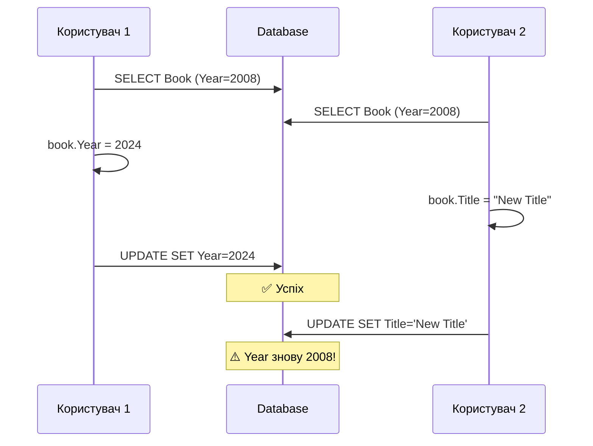

# 10.4. CRUD-операції та Change Tracker

## Вступ: Чотири базові операції

**CRUD** — Create, Read, Update, Delete — це чотири фундаментальні операції з даними. У ADO.NET кожна операція вимагала написання SQL, створення параметрів, виконання команди та маппінгу результатів. У EF Core все це **автоматизовано**, але розуміння того, що відбувається «під капотом», критично важливе.

У цій статті ми детально розглянемо кожну операцію, механізм Change Tracker, роботу з disconnected entities (типовий Web API сценарій) та оптимістичну конкурентність.

::note
**Передумови**: [10.2. DbContext та DbSet](/1.csharp/10.ef-core/02.dbcontext-dbset), [10.3. Entity Configuration](/1.csharp/10.ef-core/03.entity-configuration).

::

---

## Create (INSERT)

### Додавання однієї сутності

```csharp showLineNumbers
using var context = new LibraryContext();

var book = new Book
{
    Title = "Чистий код",
    Author = "Роберт Мартін",
    Year = 2008,
    Isbn = "978-0132350884"
};

// Стан ПЕРЕД Add: Detached
Console.WriteLine(context.Entry(book).State); // Detached

context.Books.Add(book);

// Стан ПІСЛЯ Add: Added
Console.WriteLine(context.Entry(book).State); // Added

// Id ще не присвоєний (тимчасовий)
Console.WriteLine($"Id перед Save: {book.Id}"); // 0

context.SaveChanges();

// Id присвоєний базою даних
Console.WriteLine($"Id після Save: {book.Id}"); // 1 (або інший)

// Стан після Save: Unchanged
Console.WriteLine(context.Entry(book).State); // Unchanged
```

**Що відбувається при `SaveChanges()`:**

1. EF Core знаходить усі сутності зі станом `Added`
2. Генерує SQL: `INSERT INTO Books (Title, Author, Year, Isbn, IsAvailable) VALUES (@p0, @p1, @p2, @p3, @p4)`
3. Додає `SELECT scope_identity()` для отримання згенерованого Id
4. Виконує SQL через ADO.NET
5. Записує отриманий Id у `book.Id`
6. Змінює стан на `Unchanged`

### Додавання кількох сутностей (Batch)

```csharp showLineNumbers
using var context = new LibraryContext();

var books = new List<Book>
{
    new() { Title = "Рефакторинг", Author = "Мартін Фаулер", Year = 1999, Isbn = "ISBN-1" },
    new() { Title = "DDD", Author = "Ерік Еванс", Year = 2003, Isbn = "ISBN-2" },
    new() { Title = "Clean Architecture", Author = "Роберт Мартін", Year = 2017, Isbn = "ISBN-3" },
};

context.Books.AddRange(books); // Batch Add
context.SaveChanges();         // Один виклик = batch INSERT

// Усі Id присвоєні
foreach (var book in books)
    Console.WriteLine($"{book.Title} → Id={book.Id}");
```

EF Core оптимізує batch операції. Замість трьох окремих INSERT, він може згрупувати їх:

```sql
-- EF Core 9 генерує оптимізований batch:
MERGE [Books] USING (
VALUES (@p0, @p1, @p2, @p3, @p4, 0),
       (@p5, @p6, @p7, @p8, @p9, 1),
       (@p10, @p11, @p12, @p13, @p14, 2))
AS i ([Author], [Isbn], [IsAvailable], [Title], [Year], _Position)
ON 1=0
WHEN NOT MATCHED THEN
INSERT ([Author], [Isbn], [IsAvailable], [Title], [Year])
VALUES (i.[Author], i.[Isbn], i.[IsAvailable], i.[Title], i.[Year])
OUTPUT INSERTED.[Id], i._Position;
```

---

## Read (SELECT)

EF Core надає кілька способів читання даних:

### Find — пошук за Primary Key

```csharp showLineNumbers
using var context = new LibraryContext();

// Find спочатку перевіряє Change Tracker (Identity Map)
var book = context.Books.Find(1);

if (book != null)
    Console.WriteLine(book.Title);
else
    Console.WriteLine("Книгу не знайдено");
```

### LINQ-запити

```csharp showLineNumbers
using var context = new LibraryContext();

// Where — фільтрація
var availableBooks = context.Books
    .Where(b => b.IsAvailable)
    .ToList();

// FirstOrDefault — перший або null
var firstMartin = context.Books
    .FirstOrDefault(b => b.Author.Contains("Мартін"));

// SingleOrDefault — один або null (кинe виняток, якщо більше одного)
var byIsbn = context.Books
    .SingleOrDefault(b => b.Isbn == "978-0132350884");

// Any — перевірка існування
bool hasBooks = context.Books.Any(b => b.Year > 2020);

// Count — кількість
int totalBooks = context.Books.Count();
int availableCount = context.Books.Count(b => b.IsAvailable);
```

### AsNoTracking — запити тільки для читання

Якщо ви **не плануєте змінювати** завантажені об'єкти, використовуйте `AsNoTracking()`:

```csharp showLineNumbers
// З відстеженням (за замовчуванням)
var tracked = context.Books.ToList(); // Об'єкти додаються в Change Tracker

// Без відстеження — швидше, менше пам'яті
var untracked = context.Books
    .AsNoTracking()
    .ToList(); // Об'єкти НЕ в Change Tracker

// Перевірка
Console.WriteLine(context.Entry(tracked[0]).State);   // Unchanged
Console.WriteLine(context.Entry(untracked[0]).State);  // Detached
```

::tip
**Правило**: Використовуйте `AsNoTracking()` для **read-only** операцій (список книг для відображення, звіти, пошук). Це значно прискорює запити та зменшує використання пам'яті, бо EF Core не створює snapshot об'єктів.

::

---

## Update (UPDATE)

### Connected update (стандартний)

```csharp showLineNumbers
using var context = new LibraryContext();

// 1. Завантажуємо (стан: Unchanged)
var book = context.Books.Find(1)!;

// 2. Змінюємо (стан автоматично стає: Modified)
book.Title = "Чистий код: Оновлене видання";
book.Year = 2024;

// 3. Зберігаємо (UPDATE тільки змінених стовпців)
context.SaveChanges();
// SQL: UPDATE Books SET Title = @p0, Year = @p1 WHERE Id = @p2
```

**Ключовий момент**: EF Core генерує `UPDATE` тільки для **змінених стовпців** (`Title` і `Year`), а не для всіх. Це оптимальніше за наш ручний ADO.NET `Update()`, який оновлював усе.

### Disconnected update (Web API сценарій)

У веб-додатках об'єкт приходить від клієнта як JSON і не пов'язаний з контекстом:

```csharp showLineNumbers
// Сценарій: API отримує Book від клієнта
public void UpdateBook(Book bookFromClient)
{
    using var context = new LibraryContext();

    // bookFromClient не відстежується (Detached)
    // Варіант 1: Update — позначити ВСІ властивості як Modified
    context.Books.Update(bookFromClient);
    context.SaveChanges();
    // SQL: UPDATE Books SET Title=@p0, Author=@p1, Year=@p2, Isbn=@p3,
    //      IsAvailable=@p4 WHERE Id=@p5
    // Оновить ВСІ стовпці, навіть незмінені!

    // Варіант 2: Attach + вибірковий Modified (оптимальніший)
    context.Books.Attach(bookFromClient);        // Стан: Unchanged
    context.Entry(bookFromClient).Property(b => b.Title).IsModified = true;
    context.Entry(bookFromClient).Property(b => b.Year).IsModified = true;
    context.SaveChanges();
    // SQL: UPDATE Books SET Title=@p0, Year=@p1 WHERE Id=@p2
    // Оновить тільки вказані стовпці!

    // Варіант 3: Завантажити + оновити (найнадійніший)
    var existing = context.Books.Find(bookFromClient.Id)!;
    existing.Title = bookFromClient.Title;
    existing.Year = bookFromClient.Year;
    context.SaveChanges();
    // SQL: UPDATE Books SET Title=@p0, Year=@p1 WHERE Id=@p2
}
```

| Підхід | SQL | Плюси | Мінуси |
|:---|:---|:---|:---|
| `Update()` | Усі стовпці | Просто | Зайве навантаження |
| `Attach + IsModified` | Вибрані стовпці | Оптимально | Більше коду |
| `Find + modify` | Змінені стовпці | Надійно, валідація | Додатковий SELECT |

---

## Delete (DELETE)

### Стандартне видалення

```csharp showLineNumbers
using var context = new LibraryContext();

// Варіант 1: Завантажити і видалити
var book = context.Books.Find(1)!;
context.Books.Remove(book);
context.SaveChanges();
// SQL: DELETE FROM Books WHERE Id = @p0

// Варіант 2: Видалити без завантаження (stub entity)
var stub = new Book { Id = 5 }; // Тільки Id, решта — дефолт
context.Books.Remove(stub);
context.SaveChanges();
// SQL: DELETE FROM Books WHERE Id = @p0 (без попереднього SELECT)
```

### Soft Delete (м'яке видалення)

Часто замість фізичного видалення використовують **soft delete** — позначення запису як видаленого:

```csharp showLineNumbers
public class Book
{
    public int Id { get; set; }
    public string Title { get; set; } = "";
    // ... інші властивості
    public bool IsDeleted { get; set; } // Soft delete flag
    public DateTime? DeletedAt { get; set; }
}

// Конфігурація: Global Query Filter
builder.HasQueryFilter(b => !b.IsDeleted);
```

З `HasQueryFilter` усі запити **автоматично** додають `WHERE IsDeleted = 0`:

```csharp showLineNumbers
using var context = new LibraryContext();

// "Видалення" — просто зміна прапорця
var book = context.Books.Find(1)!;
book.IsDeleted = true;
book.DeletedAt = DateTime.UtcNow;
context.SaveChanges();
// SQL: UPDATE Books SET IsDeleted = 1, DeletedAt = @p0 WHERE Id = @p1

// Звичайний запит — видалені не повертаються
var activeBooks = context.Books.ToList();
// SQL: SELECT ... FROM Books WHERE IsDeleted = 0

// Запит з видаленими (ігнорувати фільтр)
var allBooks = context.Books.IgnoreQueryFilters().ToList();
// SQL: SELECT ... FROM Books (без WHERE IsDeleted)
```

---

## Bulk Operations (EF Core 7+)

До EF Core 7 для масових операцій потрібно було завантажувати **всі** об'єкти, змінювати та зберігати. З EF Core 7 з'явилися `ExecuteUpdate` та `ExecuteDelete`:

```csharp showLineNumbers
using var context = new LibraryContext();

// ❌ До EF Core 7: завантажити ВСІ → змінити → зберегти
var oldBooks = context.Books.Where(b => b.Year < 2000).ToList();
foreach (var book in oldBooks)
    book.IsAvailable = false;
context.SaveChanges(); // N окремих UPDATE

// ✅ EF Core 7+: один SQL UPDATE без завантаження
int affected = context.Books
    .Where(b => b.Year < 2000)
    .ExecuteUpdate(b => b
        .SetProperty(p => p.IsAvailable, false));
// SQL: UPDATE Books SET IsAvailable = 0 WHERE Year < 2000
Console.WriteLine($"Оновлено: {affected} рядків");

// Масове видалення
int deleted = context.Books
    .Where(b => b.IsDeleted)
    .ExecuteDelete();
// SQL: DELETE FROM Books WHERE IsDeleted = 1
Console.WriteLine($"Видалено: {deleted} рядків");
```

::warning
`ExecuteUpdate` та `ExecuteDelete` **обходять Change Tracker**. Вони виконують SQL напряму. Об'єкти в Change Tracker **не оновлюються**. Після цих операцій рекомендується отримати нові дані або очистити контекст.

::

---

## Optimistic Concurrency (Оптимістична конкурентність)

### Проблема

Два користувачі одночасно редагують одну книгу:

::mermaid



::

Другий UPDATE перезаписує зміни першого — **lost update problem**.

### Рішення: RowVersion

```csharp showLineNumbers
public class Book
{
    public int Id { get; set; }
    public string Title { get; set; } = "";
    public string Author { get; set; } = "";
    public int Year { get; set; }

    [Timestamp] // SQL Server автоматично оновлює rowversion при кожному UPDATE
    public byte[] RowVersion { get; set; } = null!;
}

// Або через Fluent API:
builder.Property(b => b.RowVersion)
    .IsRowVersion();
```

Тепер EF Core додає `WHERE RowVersion = @oldVersion` до кожного UPDATE:

```sql
UPDATE Books
SET Title = @p0, Year = @p1
WHERE Id = @p2 AND RowVersion = @p3;

-- Якщо RowVersion змінився (інший користувач оновив) → 0 affected rows
-- EF Core кидає DbUpdateConcurrencyException
```

### Обробка конфлікту

```csharp showLineNumbers
using var context = new LibraryContext();
var book = context.Books.Find(1)!;

book.Title = "Оновлений заголовок";

try
{
    context.SaveChanges();
}
catch (DbUpdateConcurrencyException ex)
{
    var entry = ex.Entries.Single();
    var databaseValues = entry.GetDatabaseValues()!;
    var currentValues = entry.CurrentValues;

    // Варіант 1: «Клієнт перемагає» — перезаписати
    entry.OriginalValues.SetValues(databaseValues);
    context.SaveChanges(); // Спроба ще раз

    // Варіант 2: «База перемагає» — відкинути зміни клієнта
    entry.CurrentValues.SetValues(databaseValues);
    entry.State = EntityState.Unchanged;

    // Варіант 3: «Злиття» — показати обидва значення користувачу
    Console.WriteLine($"Ваше: {currentValues["Title"]}");
    Console.WriteLine($"У базі: {databaseValues["Title"]}");
}
```

---

## Практичні завдання

### Рівень 1: Базовий

::steps

### Завдання 1.1: CRUD цикл

1. Створіть `Product` (Name, Price, Category, InStock).
2. Додайте 5 продуктів через `AddRange`.
3. Знайдіть за Id, оновіть ціну.
4. Видаліть один продукт.
5. Увімкніть логування та перегляньте весь SQL.

### Завдання 1.2: Change Tracker

1. Завантажте продукт.
2. Після кожної дії виводьте `Entry().State`.
3. Змініть 2 властивості, виведіть `OriginalValues` та `CurrentValues`.
4. Зробіть `SaveChanges`, перевірте стан.

::

### Рівень 2: Практичний

::steps

### Завдання 2.1: Soft Delete

1. Додайте `IsDeleted` та `DeletedAt` до `Product`.
2. Налаштуйте `HasQueryFilter`.
3. Реалізуйте «видалення» (зміна прапорця).
4. Перевірте, що «видалені» не повертаються в звичайних запитах.
5. Покажіть, як отримати видалені через `IgnoreQueryFilters()`.

### Завдання 2.2: Disconnected Entity

Імітуйте Web API сценарій:
1. У першому контексті — завантажте продукт, серіалізуйте в JSON.
2. У другому контексті — десеріалізуйте та оновіть через `Update()`.
3. У третьому контексті — через `Attach` + `IsModified`.
4. Порівняйте згенерований SQL.

::

### Рівень 3: Архітектура

::steps

### Завдання 3.1: Bulk Operations

1. Додайте 100 продуктів.
2. Оновіть ціну всіх через `ExecuteUpdate`.
3. Видаліть усі з `InStock == false` через `ExecuteDelete`.
4. Порівняйте час виконання з циклом `foreach` + `SaveChanges`.

### Завдання 3.2: Optimistic Concurrency

1. Додайте `RowVersion` до `Product`.
2. Імітуйте конфлікт: два контексти завантажують один продукт.
3. Перший оновлює і зберігає.
4. Другий намагається зберегти — обробіть `DbUpdateConcurrencyException`.

::

---

## Резюме

::card-group

::card{title="Create" icon="i-heroicons-plus-circle"}
Add → Added → SaveChanges → INSERT. AddRange для batch. Id присвоюється базою після SaveChanges.

::

::card{title="Read" icon="i-heroicons-magnifying-glass"}
Find (з кешу) vs LINQ (завжди SQL). AsNoTracking для read-only — менше пам'яті, швидше.

::

::card{title="Update" icon="i-heroicons-pencil-square"}
Connected: зміна → Modified → SaveChanges. Disconnected: Update/Attach. EF Core оновлює тільки змінені стовпці.

::

::card{title="Delete" icon="i-heroicons-trash"}
Remove → Deleted → SaveChanges. Stub entity для видалення без SELECT. Soft Delete через HasQueryFilter.

::

::
