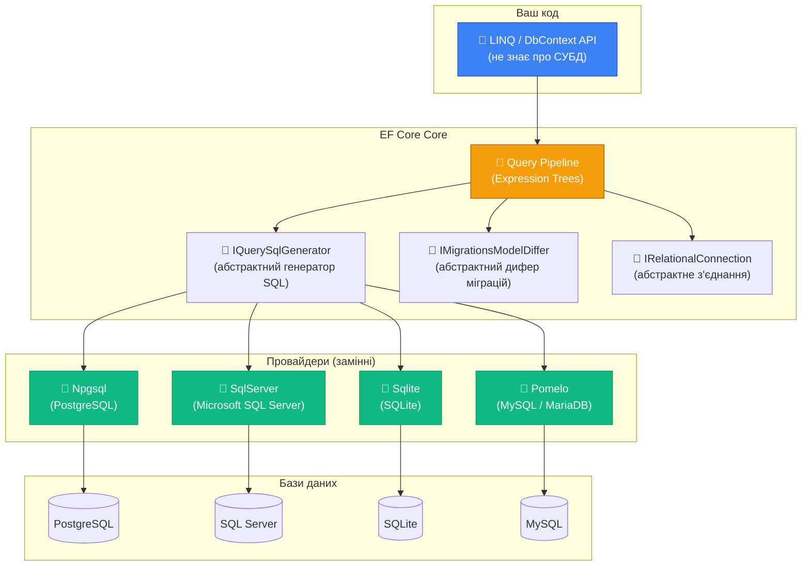

# Провайдери баз даних: Архітектура та Вибір СУБД

## Одна модель — чотири бази даних

Поставимо уявний експеримент. Є невеликий C#-проєкт: клас `Order` з кількома властивостями, DbContext, і п'ять рядків LINQ. Що станеться, якщо взяти цей код і просто змінити рядок підключення — з SQLite на PostgreSQL, потім на SQL Server, потім на MySQL?

Відповідь: здебільшого — нічого. Код скомпілюється та запрацює з будь-якою з цих баз даних без жодних змін у LINQ-запитах, класах сутностей або методах DbContext. Той самий `context.Orders.Where(o => o.Status == OrderStatus.Active).ToListAsync()` — і при PostgreSQL, і при SQL Server, і при SQLite.

Це не магія і не happy path у документації. Це результат свідомого архітектурного рішення: EF Core з самого початку проєктувався як **провайдер-агностичний ORM**. Вся SQL-специфіка ізольована у провайдерах — замінних модулях, що реалізують одні й ті самі абстракції по-різному для кожної СУБД.

Але «здебільшого» — ключове слово. Є типи даних, що поводяться по-різному. Є функції, доступні тільки в PostgreSQL. Є обмеження SQLite, про які треба знати. Є стратегії генерації Id, що відрізняються між providers. Розуміння цих меж — і є темою цієї статті.

---

## Архітектура провайдерів: як досягається незалежність від СУБД

EF Core побудований на принципі **абстракцій, що можна замінити**. Замість того щоб жорстко прив'язуватися до одного SQL-діалекту, ядро фреймворку визначає систему інтерфейсів і абстрактних класів — а конкретні СУБД реалізують їх по-своєму.

::mermaid



::

Ключові абстракції, які кожен провайдер зобов'язаний реалізувати:

**IQuerySqlGenerator** — відповідає за генерацію SQL-запитів. Саме тут PostgreSQL-провайдер генерує `::text` для cast-ів, а SQL Server — `CAST(... AS NVARCHAR)`. Ваш LINQ-вираз приходить сюди як готовий Expression Tree, і провайдер перетворює його у діалект свого SQL.

**IRelationalTypeMappingSource** — маппінг між C#-типами і SQL-типами конкретної СУБД. Саме тут `decimal` у C# перетворюється на `NUMERIC(18,2)` у PostgreSQL або `DECIMAL(18,2)` у SQL Server, а `Guid` — на `UUID` у PostgreSQL або `UNIQUEIDENTIFIER` у SQL Server.

**IMigrationsSqlGenerator** — генерує SQL для міграцій (`CREATE TABLE`, `ALTER TABLE`, `DROP INDEX`). Синтаксис суттєво відрізняється між СУБД.

**IRelationalConnection** та **IDbContextTransactionManager** — управління з'єднаннями і транзакціями відповідно до можливостей конкретної СУБД.

Розуміння цієї структури важливе з практичної точки зору: коли ви пишете `context.Books.Where(b => b.Year > 2000).ToListAsync()`, EF Core будує абстрактне дерево виразу. Лише перед виконанням провайдер «матеріалізує» це дерево у конкретний SQL. Це означає, що один і той самий LINQ-код може генерувати дещо різний SQL залежно від провайдера — і це нормально.

---

## Огляд провайдерів: хто є хто в екосистемі

Перед тим як заглибитись у кожен провайдер, розглянемо загальну картину:

| Провайдер | NuGet-пакет | СУБД | Підтримка |
|---|---|---|---|
| SQL Server | `Microsoft.EntityFrameworkCore.SqlServer` | Microsoft SQL Server 2012+ | Microsoft (офіційно) |
| SQLite | `Microsoft.EntityFrameworkCore.Sqlite` | SQLite 3 | Microsoft (офіційно) |
| PostgreSQL | `Npgsql.EntityFrameworkCore.PostgreSQL` | PostgreSQL 9.4+ | Спільнота (Npgsql) |
| MySQL | `Pomelo.EntityFrameworkCore.MySql` | MySQL 5.7+, MariaDB 10.2+ | Спільнота (Pomelo) |
| MySQL (Oracle) | `MySql.EntityFrameworkCore` | MySQL 5.6+ | Oracle |
| Cosmos DB | `Microsoft.EntityFrameworkCore.Cosmos` | Azure Cosmos DB | Microsoft (офіційно) |
| InMemory | `Microsoft.EntityFrameworkCore.InMemory` | (в пам'яті) | Microsoft (офіційно) |
| Oracle | `Oracle.EntityFrameworkCore` | Oracle Database | Oracle |

Найпоширеніші вибори в .NET-проєктах:
- **PostgreSQL (Npgsql)** — дуже популярний вибір завдяки потужним можливостям, відкритому коду та відмінній підтримці у Npgsql
- **SQL Server** — стандарт у корпоративному .NET-середовищі, особливо при роботі з Azure
- **SQLite** — ідеальний для розробки, тестування та вбудованих систем
- **MySQL/MariaDB (Pomelo)** — широко використовується у веб-стеках спільно з PHP, Python

---

## PostgreSQL (Npgsql): потужність відкритої СУБД

PostgreSQL є найпопулярнішим вибором для нових .NET-проєктів, що не прив'язані до Microsoft-стеку. Провайдер Npgsql — один з найбільш розвинених сторонніх EF Core-провайдерів, що підтримує майже всі специфічні можливості PostgreSQL та розробляється командою Npgsql незалежно від Microsoft.

### Встановлення та базова конфігурація

```csharp [Program.cs]
// NuGet: Npgsql.EntityFrameworkCore.PostgreSQL
builder.Services.AddDbContext<AppDbContext>(opts =>
    opts.UseNpgsql(
        builder.Configuration.GetConnectionString("Postgres"),
        npgsqlOptions =>
        {
            // Увімкнути ретраї при transient-помилках (network, deadlocks)
            npgsqlOptions.EnableRetryOnFailure(
                maxRetryCount: 5,
                maxRetryDelay: TimeSpan.FromSeconds(30),
                errorCodesToAdd: null);

            // Версія PostgreSQL (впливає на генерований SQL)
            npgsqlOptions.SetPostgresVersion(16, 0);

            // Timeout для команд
            npgsqlOptions.CommandTimeout(60);
        }));
```

```
# Формат рядка підключення PostgreSQL
Host=localhost;Port=5432;Database=mydb;Username=postgres;Password=secret;
```

### Типи даних PostgreSQL: що відрізняється від інших СУБД

PostgreSQL має значно багатшу систему типів, ніж SQL Server. Npgsql-провайдер дозволяє використовувати їх безпосередньо в C#-моделі:

**Масиви (Arrays)**

PostgreSQL нативно підтримує масиви в стовпцях. Це дозволяє зберігати список значень без окремої таблиці:

```csharp
public class Article
{
    public int Id { get; set; }
    public string Title { get; set; } = string.Empty;

    // Стовпець Tags зберігатиметься як TEXT[] у PostgreSQL
    public string[] Tags { get; set; } = Array.Empty<string>();

    // Можна фільтрувати за елементами масиву!
    // WHERE 'csharp' = ANY("Tags")
}

// LINQ-запит до масиву транслюється у PostgreSQL-специфічний SQL
var dotnetArticles = await context.Articles
    .Where(a => a.Tags.Contains("dotnet"))
    .ToListAsync();
// SQL: SELECT ... FROM "Articles" WHERE 'dotnet' = ANY("Tags")
```

Це потужна можливість, якої немає в SQL Server або SQLite. Але пам'ятайте: масиви у PostgreSQL не підходять для даних, по яких часто фільтруєте з великою кардинальністю — краще мати окрему таблицю зі зв'язком.

**JSONB — зберігання JSON з індексуванням**

`JSONB` (binary JSON) є одним з найпотужніших типів PostgreSQL. На відміну від `TEXT`, JSONB парситься при вставці, зберігається у бінарному форматі з підтримкою індексів і дозволяє виконувати запити до окремих полів JSON:

```csharp
public class Product
{
    public int Id { get; set; }
    public string Name { get; set; } = string.Empty;

    // Зберігається як JSONB — можна запитувати by property
    public Dictionary<string, string> Metadata { get; set; } = new();
}
```

Детально JSONB та `ToJson()` розглянемо у статті 11 (JSON Columns).

**Enum-типи PostgreSQL**

PostgreSQL дозволяє визначати кастомні enum-типи на рівні бази даних. Npgsql підтримує їх через C#-перерахування:

```csharp
// Визначаємо enum у C#
public enum OrderStatus { Pending, Processing, Shipped, Delivered, Cancelled }

// Реєструємо PostgreSQL-тип у DbContext
protected override void OnModelCreating(ModelBuilder modelBuilder)
{
    // EF Core створить тип "order_status" у PostgreSQL
    modelBuilder.HasPostgresEnum<OrderStatus>();

    modelBuilder.Entity<Order>()
        .Property(o => o.Status)
        .HasColumnType("order_status");
}
```

**HStore — key-value пари**

PostgreSQL-специфічний тип для зберігання пар ключ-значення:

```csharp
// Вимагає NpgsqlHStoreExtension у DbContext
public Dictionary<string, string?> Attributes { get; set; } = new();
```

**Range-типи**

PostgreSQL має вбудовані типи для діапазонів: `int4range`, `daterange`, `tstzrange` тощо:

```csharp
// NpgsqlRange<T> — C#-відображення PostgreSQL range types
public NpgsqlRange<DateTime> ValidityPeriod { get; set; }

// Запит: знайти записи, що перекриваються з вказаним діапазоном
var active = await context.Subscriptions
    .Where(s => s.ValidityPeriod.Contains(DateTime.Now))
    .ToListAsync();
```

### PostgreSQL-специфічні LINQ-функції

Npgsql розкриває PostgreSQL-функції через статичний клас `EF.Functions`:

```csharp
// Full-text search (набагато потужніший за LIKE)
var results = await context.Articles
    .Where(a => EF.Functions.ToTsVector("english", a.Title + " " + a.Body)
                             .Matches(EF.Functions.ToTsQuery("english", "entity & framework")))
    .ToListAsync();
// SQL: WHERE to_tsvector('english', "Title" || ' ' || "Body") @@ to_tsquery('english', 'entity & framework')

// ILIKE — регістронезалежний LIKE (PostgreSQL-специфічний)
var found = await context.Authors
    .Where(a => EF.Functions.ILike(a.Name, "%франко%"))
    .ToListAsync();

// pg_trgm — fuzzy search (вимагає розширення pg_trgm)
var similar = await context.Books
    .Where(b => EF.Functions.TrigramsSimilarity(b.Title, "захар берк") > 0.3)
    .ToListAsync();
```

### Стратегії генерації Id у PostgreSQL

PostgreSQL пропонує кілька підходів до генерації первинних ключів:

**Serial / Sequences (класичний підхід):**
EF Core за замовчуванням використовує `SERIAL` або `GENERATED ALWAYS AS IDENTITY` — автоінкрементний integer. Просто і надійно для більшості випадків.

**UUID v4 (random):**
```csharp
entity.Property(e => e.Id)
    .HasDefaultValueSql("gen_random_uuid()"); // PostgreSQL 13+
```

**HiLo (HighLow):**
Стратегія, де застосунок резервує блоки Id у БД, а потім розподіляє їх локально. Зменшує кількість round-trips до БД при bulk insert:
```csharp
optionsBuilder.UseNpgsql(connectionString, opts =>
    opts.UseHiLo("order_id_seq"));
```

---

## Microsoft SQL Server: корпоративний стандарт

SQL Server — природний вибір для .NET-команд, що вже використовують Microsoft-стек, Azure або мають корпоративні ліцензійні угоди. Провайдер від Microsoft є найбільш зрілим і отримує нові можливості одночасно з новими версіями SQL Server.

### Встановлення та конфігурація

```csharp [Program.cs]
// NuGet: Microsoft.EntityFrameworkCore.SqlServer
builder.Services.AddDbContext<AppDbContext>(opts =>
    opts.UseSqlServer(
        builder.Configuration.GetConnectionString("SqlServer"),
        sqlOptions =>
        {
            sqlOptions.EnableRetryOnFailure(
                maxRetryCount: 5,
                maxRetryDelay: TimeSpan.FromSeconds(30),
                errorNumbersToAdd: null);

            // Увімкнути підтримку Temporal Tables (SQL Server 2016+)
            sqlOptions.UseTemporalTables();
        }));
```

```
# SQL Server connection string варіанти
# SQL Server Authentication:
Server=localhost,1433;Database=MyDb;User Id=sa;Password=YourPassword;TrustServerCertificate=True;

# Windows Authentication:
Server=.\SQLEXPRESS;Database=MyDb;Trusted_Connection=True;TrustServerCertificate=True;

# Azure SQL:
Server=tcp:myserver.database.windows.net,1433;Initial Catalog=mydb;
Authentication=Active Directory Default;
```

### Специфічні можливості SQL Server

**Temporal Tables (System-Versioned Tables)**

Одна з найцікавіших можливостей SQL Server 2016+: база автоматично зберігає всю **історію змін** рядка. Кожен рядок у звичайній таблиці доповнюється рядками у таблиці-«архіві» з часовими мітками початку і кінця валідності.

```csharp
// Позначаємо сутність як Temporal у OnModelCreating
modelBuilder.Entity<Product>()
    .ToTable("Products", b => b.IsTemporal(t =>
    {
        t.HasPeriodStart("ValidFrom");
        t.HasPeriodEnd("ValidTo");
        t.UseHistoryTable("ProductsHistory");
    }));
```

Після цього можна робити запити до **минулих станів** даних прямо через LINQ:

```csharp
// Стан таблиці на конкретний момент у минулому
var productsAtDate = await context.Products
    .TemporalAsOf(new DateTime(2024, 1, 1))
    .ToListAsync();

// Вся історія змін конкретного продукту
var productHistory = await context.Products
    .TemporalAll()
    .Where(p => p.Id == 42)
    .Select(p => new
    {
        p.Name,
        p.Price,
        ValidFrom = EF.Property<DateTime>(p, "ValidFrom"),
        ValidTo   = EF.Property<DateTime>(p, "ValidTo")
    })
    .ToListAsync();

// Зміни за певний період
var changesInJanuary = await context.Products
    .TemporalBetween(new DateTime(2024, 1, 1), new DateTime(2024, 2, 1))
    .ToListAsync();
```

Temporal Tables є вбудованим механізмом аудиту без жодного додаткового коду в застосунку. Це значно потужніше за ручний аудит через тригери або Interceptors.

**HiLo — ефективна генерація Id**

SQL Server EF Core провайдер нативно підтримує стратегію HiLo через sequences:

```csharp
modelBuilder.Entity<Order>()
    .Property(o => o.Id)
    .UseHiLo("OrderIdSequence");
// SQL: CREATE SEQUENCE [OrderIdSequence] START WITH 1 INCREMENT BY 10
```

**Memory-Optimized Tables (Hekaton)**

SQL Server дозволяє тримати таблиці повністю в пам'яті для максимальної продуктивності:

```csharp
modelBuilder.Entity<SessionCache>()
    .ToTable(t => t.IsMemoryOptimized());
```

### SQL Server і типи даних

| C# тип | SQL Server тип | Особливості |
|---|---|---|
| `string` | `nvarchar(max)` | Unicode за замовчуванням |
| `string` з `HasMaxLength(n)` | `nvarchar(n)` | до 4000 символів |
| `decimal` | `decimal(18,2)` | Потрібно `HasPrecision()` для точного контролю |
| `DateTime` | `datetime2(7)` | EF Core використовує `datetime2`, а не `datetime` |
| `DateOnly` (.NET 6+) | `date` | Лише дата без часу |
| `TimeOnly` (.NET 6+) | `time` | Лише час без дати |
| `Guid` | `uniqueidentifier` | 16 байт, ускладнює кластерний індекс |
| `byte[]` | `varbinary(max)` | Бінарні дані |

::warning
Тип `datetime` (старий SQL Server тип) і `datetime2` відрізняються точністю і діапазоном. EF Core за замовчуванням використовує `datetime2`, але якщо у вас legacy-база з `datetime` — будьте уважні з округленням мілісекунд. Явно вкажіть `HasColumnType("datetime")` для сумісності.
::

---

## SQLite: легковісна база для розробки та тестування

SQLite — унікальна СУБД: вона не є сервером. Вся база зберігається в одному файлі на диску. Немає сервісу, немає мережевого з'єднання, немає адміністрування. Ідеальний вибір для:

- **Розробки**: швидкий старт без налаштування Docker чи Windows-сервісу
- **Тестів**: `Data Source=:memory:` — база повністю в пам'яті, швидше будь-якого сервера
- **Desktop-застосунків** та **мобільних** (через MAUI)
- **Вбудованих систем** (IoT, edge devices)

```csharp [Program.cs]
// NuGet: Microsoft.EntityFrameworkCore.Sqlite
builder.Services.AddDbContext<AppDbContext>(opts =>
    opts.UseSqlite(
        "Data Source=myapp.db",
        sqliteOptions =>
        {
            sqliteOptions.CommandTimeout(30);
        }));

// In-memory для тестів
services.AddDbContext<AppDbContext>(opts =>
    opts.UseSqlite("Data Source=:memory:"));
```

### Суттєві обмеження SQLite

SQLite — це trade-off: простота і легковісність в обмін на функціональність. Критично важливо знати обмеження:

**Обмеження ALTER TABLE**

SQLite не підтримує `ALTER TABLE ... ADD COLUMN` для стовпців з обмеженнями (NOT NULL без DEFAULT), `DROP COLUMN` (до SQLite 3.35.0), `RENAME COLUMN` (до SQLite 3.25.0). При деяких міграціях EF Core змушений виконувати «recreation» — створити нову таблицю, скопіювати дані, видалити стару:

```sql
-- Те, що EF Core робить при зміні типу стовпця у SQLite:
CREATE TABLE "Books_new" (...);
INSERT INTO "Books_new" SELECT ... FROM "Books";
DROP TABLE "Books";
ALTER TABLE "Books_new" RENAME TO "Books";
```

Це **не атомарна операція** за замовчуванням і може призвести до втрати даних при збої. Для продакшн-міграцій SQLite з великими таблицями цей момент потребує уваги.

**Відсутність Foreign Key Constraints за замовчуванням**

SQLite підтримує foreign keys, але вони **вимкнені за замовчуванням** (з міркувань зворотної сумісності). EF Core не вмикає їх автоматично — ви маєте зробити це явно:

```csharp
protected override void OnConfiguring(DbContextOptionsBuilder optionsBuilder)
{
    optionsBuilder.UseSqlite("Data Source=mydb.db",
        sqlite => sqlite.EnableForeignKeys()); // або через PRAGMA
}
```

Або через raw SQL при відкритті з'єднання:

```csharp
// Через DbContext event
context.Database.ExecuteSqlRaw("PRAGMA foreign_keys = ON;");
```

Без цього cascade delete і перевірки FK просто не спрацьовуватимуть, і ви можете отримати orphaned records — записи, що посилаються на неіснуючий батьківський рядок.

**Тільки один writer одночасно**

SQLite підтримує одночасно лише **один** write-з'єднання (на рівні файлу). При кількох паралельних записах один з них отримає `SQLITE_BUSY` / `SQLITE_LOCKED`. Для читань — одночасне читання можливе (WAL-режим).

Для серверних застосунків з паралельними запитами SQLite є анти-рішенням. Для тестів — не проблема, бо тести виконуються послідовно.

**Динамічна типізація**

SQLite використовує **dynamic typing**: тип стовпця є рекомендацією, а не суворим обмеженням. Ви можете записати рядок у стовпець з типом `INTEGER`. EF Core намагається обійти це, але дрібні несподіванки можливі.

### SQLite in-memory для тестування

In-memory баз даних SQLite для тестів — поширена практика. Але є нюанс: кожне **нове з'єднання** отримує нову, порожню in-memory базу. Якщо тест закриває та відкриває з'єднання — база «зникає».

```csharp [Tests/DbFixture.cs]
public class DbFixture : IDisposable
{
    private readonly SqliteConnection _connection;
    public AppDbContext Context { get; }

    public DbFixture()
    {
        // Одне з'єднання залишається відкритим весь час тесту
        // Завдяки цьому in-memory база "виживає" між операціями
        _connection = new SqliteConnection("Data Source=:memory:");
        _connection.Open();

        var options = new DbContextOptionsBuilder<AppDbContext>()
            .UseSqlite(_connection)
            .Options;

        Context = new AppDbContext(options);
        Context.Database.EnsureCreated();
    }

    public void Dispose()
    {
        Context.Dispose();
        _connection.Dispose();
    }
}
```

**Чому `SqliteConnection` тримається відкритим:** SQLite in-memory бази існують лише в межах одного з'єднання. Якщо з'єднання закрити — база зникне. Тому ми явно тримаємо відкрите `SqliteConnection` і передаємо його в `DbContextOptionsBuilder`.

---

## MySQL та MariaDB (Pomelo): веб-стек

MySQL є найпоширенішою СУБД у веб-середовищі завдяки великій базі існуючих проєктів на PHP/Python і хостинг-провайдерів, що надають MySQL «з коробки». MariaDB є fork MySQL з відкритим кодом і більш активним розвитком.

Є два EF Core провайдери для MySQL:

1. **Pomelo.EntityFrameworkCore.MySql** — рекомендований, активно підтримується спільнотою, підтримує MySQL 5.7+, MariaDB 10.2+
2. **MySql.EntityFrameworkCore** — офіційний від Oracle, менш функціональний

```csharp [Program.cs]
// NuGet: Pomelo.EntityFrameworkCore.MySql
builder.Services.AddDbContext<AppDbContext>(opts =>
    opts.UseMySql(
        builder.Configuration.GetConnectionString("MySql"),
        ServerVersion.AutoDetect(connectionString), // або явно: new MySqlServerVersion(new Version(8, 0, 30))
        mySqlOptions =>
        {
            mySqlOptions.EnableRetryOnFailure(5, TimeSpan.FromSeconds(30), null);
        }));
```

### Специфіка MySQL/MariaDB

**Case-insensitive collation за замовчуванням**

MySQL за замовчуванням використовує `utf8mb4_general_ci` (case-insensitive) collation. Це означає, що `WHERE Name = 'Іван'` та `WHERE Name = 'іван'` — еквівалентні запити. У PostgreSQL і SQL Server порівняння є case-sensitive за замовчуванням. Будьте обережні при міграції між СУБД.

**Відсутність повноцінного FULL OUTER JOIN**

MySQL не підтримує `FULL OUTER JOIN` нативно (MariaDB підтримує). EF Core може спробувати емулювати його через `UNION`, але результат не завжди оптимальний.

**GUID як CHAR(36)**

MySQL не має нативного UUID-типу. EF Core зберігає `Guid` як `CHAR(36)` (рядок), що є менш ефективним, ніж `UNIQUEIDENTIFIER` у SQL Server або `UUID` у PostgreSQL. Для PostgreSQL можна використовувати нативний `UUID`-тип і генерацію через `gen_random_uuid()`.

---

## InMemory: провайдер для тестів (і чому ним не варто зловживати)

`Microsoft.EntityFrameworkCore.InMemory` — провайдер, що зберігає всі дані у словниках в пам'яті (Dictionary). Він не виконує жодного SQL — навіть не генерує його. Це був популярний вибір для юніт-тестів у ранніх версіях EF Core.

```csharp
// NuGet: Microsoft.EntityFrameworkCore.InMemory
var options = new DbContextOptionsBuilder<AppDbContext>()
    .UseInMemoryDatabase("TestDatabase")
    .Options;
```

Але є серйозні проблеми, через які команда EF Core **не рекомендує** InMemory для тестування:

::caution
InMemory-провайдер не є реальною реляційною базою даних. Він не перевіряє Foreign Key constraints, не підтримує транзакції, не обробляє SQL (включаючи raw SQL запити), не емулює bagато SQL-поведінок. Тести, що пройшли з InMemory, можуть провалитись на реальній базі через ці різниці.
::

Конкретні приклади проблем:

```csharp
// Зовнішні ключі НЕ перевіряються InMemory!
var orphanBook = new Book { AuthorId = 9999 }; // Такого автора немає
context.Books.Add(orphanBook);
await context.SaveChangesAsync(); // Успіх! InMemory не перевіряє FK
// З реальною базою: FK violation exception

// Cascade delete НЕ виконується InMemory
context.Authors.Remove(author); // не видалить книги автора автоматично
await context.SaveChangesAsync();
// Книги залишаться (з недійсним FK)
```

**Що використовувати замість InMemory:**

- **SQLite in-memory** (`Data Source=:memory:`) — реальний SQL, реальні FK constraints, але в пам'яті
- **Testcontainers** — запускає реальний Docker-контейнер PostgreSQL/MySQL/SQL Server для інтеграційних тестів

```csharp [Tests/IntegrationTest.cs]
// Кращий варіант: SQLite in-memory
var connection = new SqliteConnection("Data Source=:memory:");
connection.Open();

var options = new DbContextOptionsBuilder<AppDbContext>()
    .UseSqlite(connection)
    .EnableSensitiveDataLogging()
    .Options;

using var context = new AppDbContext(options);
await context.Database.EnsureCreatedAsync();

// Тепер FK constraints, cascade delete, unique constraints — всі працюють
```

---

## Cosmos DB: EF Core у NoSQL-світі

`Microsoft.EntityFrameworkCore.Cosmos` — провайдер для Azure Cosmos DB. Це особливий випадок: Cosmos DB є NoSQL-базою (document store), і EF Core намагається надати звичний LINQ-інтерфейс поверх неї.

```csharp
builder.Services.AddDbContext<CosmosContext>(opts =>
    opts.UseCosmos(
        accountEndpoint: "https://myaccount.documents.azure.com:443/",
        accountKey: "myKey",
        databaseName: "MyDatabase"));
```

Важливо розуміти принципові відмінності Cosmos DB провайдера:

- Немає JOIN між «таблицями» (контейнерами) — Cosmos DB не підтримує JOIN
- Немає міграцій у звичному сенсі — схема в Cosmos DB гнучка
- `GroupBy` і деякі агрегатні функції не підтримуються або транслюються по-іншому
- `PartitionKey` є обов'язковою концепцією — потрібно явно налаштувати

Cosmos DB EF Core провайдер корисний переважно для Azure-проєктів, де вже є доступ до Cosmos DB як сервісу, і команда хоче знайому LINQ-модель для простих сценаріїв.

---

## Порівняння провайдерів: матриця вибору

::tabs

::tabs-item{label="Типи даних"}

| Тип | SQL Server | PostgreSQL | SQLite | MySQL |
|---|---|---|---|---|
| `string` | `nvarchar` | `text` | `TEXT` | `longtext` |
| `int` | `int` | `integer` | `INTEGER` | `int` |
| `decimal` | `decimal(18,2)` | `numeric(18,2)` | `TEXT`/`REAL` | `decimal(65,30)` |
| `DateTime` | `datetime2` | `timestamp` | `TEXT` | `datetime(6)` |
| `DateOnly` | `date` | `date` | `TEXT` | `date` |
| `Guid` | `uniqueidentifier` | `uuid` | `TEXT` | `char(36)` |
| `bool` | `bit` | `boolean` | `INTEGER` | `tinyint(1)` |
| `byte[]` | `varbinary(max)` | `bytea` | `BLOB` | `longblob` |

::

::tabs-item{label="Можливості"}

| Можливість | SQL Server | PostgreSQL | SQLite | MySQL |
|---|---|---|---|---|
| Array columns | ❌ | ✅ | ❌ | ❌ |
| JSONB | ❌ | ✅ | ❌ | JSON ✅ |
| Full-text search | ✅ | ✅ | ❌ | ✅ |
| Temporal Tables | ✅ | ❌ | ❌ | ❌ |
| Window Functions | ✅ | ✅ | ✅ 3.25+ | ✅ 8.0+ |
| CTEs (WITH) | ✅ | ✅ | ✅ | ✅ 8.0+ |
| UPSERT | MERGE | ON CONFLICT | INSERT OR REPLACE | ON DUPLICATE KEY |
| Sequences | ✅ | ✅ | ❌ | ❌ |
| HiLo strategy | ✅ | ✅ | ❌ | ❌ |
| Concurrent writes | ✅ (висока) | ✅ (висока) | ⚠️ (мала) | ✅ (висока) |
| Free / OS | ❌ (ліцензія) | ✅ | ✅ | ✅ |

::

::tabs-item{label="Коли обирати"}

**Обирайте PostgreSQL, якщо:**
- Нова розробка без обмежень стеку
- Потрібні масиви, JSONB, повнотекстовий пошук, range-типи
- Важлива відкритість і відсутність ліцензійних витрат
- Розгортання на Linux (AWS RDS, GCP Cloud SQL, Supabase, Neon)
- Команда цінує ACID-транзакції та складні аналітичні можливості

**Обирайте SQL Server, якщо:**
- Корпоративне .NET-середовище з Azure або Windows-інфраструктурою
- Потрібні Temporal Tables або специфічний enterprise-функціонал
- Є ліцензії або MSDN-підписка
- Інтеграція з іншими Microsoft-продуктами (SSRS, SSIS, Azure Synapse)

**Обирайте SQLite, якщо:**
- Локальна розробка і швидкий старт
- Desktop/MAUI/Blazor WebAssembly застосунки
- IoT та вбудовані системи
- Юніт і інтеграційні тести (in-memory mode)

**Обирайте MySQL/MariaDB, якщо:**
- Існуючий платформований стек (LAMP/LEMP) з MySQL
- MariaDB як MySQL-сумісна СУБД з відкритим кодом
- Дешевий shared-хостинг зі стандартним cPanel (де MySQL вже є)

::

::

---

## Конфігурація провайдера в деталях: UseNpgsql та інші extension methods

Кожен провайдер надає extension method до `DbContextOptionsBuilder`, що приймає як connection string, так і лямбду для додаткових опцій:

```csharp [Program.cs]
builder.Services.AddDbContext<AppDbContext>(opts =>
{
    opts.UseNpgsql(connectionString, npgsql =>
    {
        // --- Retry policy ---
        npgsql.EnableRetryOnFailure(
            maxRetryCount: 5,
            maxRetryDelay: TimeSpan.FromSeconds(30),
            errorCodesToAdd: null); // додаткові Postgres error codes для retry

        // --- Версія сервера (впливає на генерований SQL) ---
        npgsql.SetPostgresVersion(16, 0);

        // --- Command timeout (секунди) ---
        npgsql.CommandTimeout(120);

        // --- Migration history table ---
        npgsql.MigrationsHistoryTable("__EFMigrationsHistory", schema: "public");

        // --- Схема за замовчуванням для нових таблиць ---
        opts.UseNpgsql(connectionString); // .HasDefaultSchema() через ModelBuilder
    });

    // --- Загальні опції (не провайдерно-специфічні) ---
    opts.EnableDetailedErrors();         // детальніші повідомлення про помилки
    opts.EnableSensitiveDataLogging();   // показ значень параметрів (тільки dev!)
    opts.LogTo(Console.WriteLine, LogLevel.Information);
});
```

### Версія сервера: чому вона важлива

`SetPostgresVersion(16, 0)` — це підказка EF Core, яку версію PostgreSQL ви використовуєте. Від цього залежить, якими SQL-конструкціями скористається провайдер:

- PostgreSQL 9.5+ — `ON CONFLICT DO NOTHING` (UPSERT)
- PostgreSQL 12+ — generated columns
- PostgreSQL 13+ — `gen_random_uuid()`
- PostgreSQL 14+ — multirange types
- PostgreSQL 15+ — `MERGE`

Якщо не вказати версію — провайдер використовує консервативний мінімум, що може означати менш ефективний SQL.

---

## Provider-specific конфігурація через ModelBuilder

Деякі можливості провайдерів налаштовуються через `OnModelCreating`:

```csharp
protected override void OnModelCreating(ModelBuilder modelBuilder)
{
    // === PostgreSQL-специфічно ===

    // Реєстрація PostgreSQL enum-типів
    modelBuilder.HasPostgresEnum<OrderStatus>("order_status");
    modelBuilder.HasPostgresEnum<UserRole>("user_role");

    // PostgreSQL Extensions (у міграціях створиться CREATE EXTENSION)
    modelBuilder.HasPostgresExtension("uuid-ossp");
    modelBuilder.HasPostgresExtension("pg_trgm"); // для fuzzy search

    // Схема за замовчуванням
    modelBuilder.HasDefaultSchema("catalog");

    // === SQL Server-специфічно ===

    // UseHiLo для всіх int-ключів відразу
    modelBuilder.UseHiLo();

    // Або для конкретної entity
    modelBuilder.Entity<Order>()
        .Property(o => o.Id)
        .UseHiLo("OrderSequence");

    // === Загальне (але з provider-специфічними наслідками) ===

    // Sequence
    modelBuilder.HasSequence<int>("InvoiceNumberSeq")
        .StartsAt(1000)
        .IncrementsBy(1);

    modelBuilder.Entity<Invoice>()
        .Property(i => i.Number)
        .HasDefaultValueSql("NEXT VALUE FOR \"InvoiceNumberSeq\""); // SQL Server
        // або: .HasDefaultValueSql("nextval('\"InvoiceNumberSeq\"')"); // PostgreSQL
}
```

---

## Відмінності у поведінці між провайдерами

Є кілька поведінкових відмінностей, про які треба знати при порівнянні або міграції між провайдерами:

### LIKE: чутливість до регістру

```csharp
// На SQL Server і PostgreSQL: case-sensitive (повертає тільки "Іван")
// На MySQL з utf8_general_ci: case-insensitive (поверне "іван", "ІВАН", "Іван")
var authors = await context.Authors
    .Where(a => EF.Functions.Like(a.Name, "Іван%"))
    .ToListAsync();
```

**Рішення для PostgreSQL:** використовуйте `EF.Functions.ILike` (регістронезалежний LIKE без колаційних налаштувань):

```csharp
// PostgreSQL-специфічний ILIKE — завжди case-insensitive
var authors = await context.Authors
    .Where(a => EF.Functions.ILike(a.Name, "іван%"))
    .ToListAsync();
```

### Порівняння рядків: EF.Functions.Collate

Для переносимого регістронезалежного порівняння без прив'язки до провайдера використовуйте collation:

```csharp
// Регістронезалежний пошук, переносимий (але може не транслюватись у всіх провайдерах)
var result = await context.Authors
    .Where(a => EF.Functions.Collate(a.Name, "NOCASE") == "іван франко")
    .ToListAsync();
```

### NULL-обробка

SQL і C# обробляють `null` по-різному. У SQL `NULL != NULL` (порівняння з NULL завжди дає `UNKNOWN`). У C# `null == null` є `true`.

EF Core намагається „bridget" це протиріччя, але є нюанси:

```csharp
string? search = null;

// EF Core транслює це у правильний SQL з IS NULL
var books = await context.Books
    .Where(b => b.Description == search)  // якщо search == null → WHERE Description IS NULL
    .ToListAsync();
```

Але деякі провайдери можуть поводитись дещо по-різному у крайніх випадках. Завжди перевіряйте генерований SQL через логування.

### Десяткові числа і точність

```csharp
// Без явної конфігурації EF Core використовує провайдерні дефолти:
// SQL Server: decimal(18,2)
// PostgreSQL: numeric без обмежень (потрібне явне HasPrecision)
// MySQL: decimal(65,30)

// Завжди явно вказуйте точність!
modelBuilder.Entity<Product>()
    .Property(p => p.Price)
    .HasPrecision(10, 2); // 10 цифр, 2 після коми
```

---

## Перехід між провайдерами: що треба змінити

Якщо вам потрібно перейти з одного провайдера на інший (наприклад, розробка на SQLite, продакшн на PostgreSQL), ось що потребує уваги:

::steps

### Зміна NuGet-пакету

Видаліть старий провайдер, додайте новий:

```bash
dotnet remove package Microsoft.EntityFrameworkCore.Sqlite
dotnet add package Npgsql.EntityFrameworkCore.PostgreSQL
```

### Оновлення UseSqlite → UseNpgsql

```csharp
// Було:
opts.UseSqlite(connectionString);

// Стало:
opts.UseNpgsql(connectionString);
```

### Регенерація міграцій

Міграції є SQL-специфічними — вони містять SQL-синтаксис конкретної СУБД. При зміні провайдера потрібно або видалити та перегенерувати міграції, або вручну перевірити кожну:

```bash
dotnet ef migrations remove  # видалити останню
dotnet ef migrations add InitialCreate  # перегенерувати
```

### Перевірка provider-специфічного коду

Перевірте `OnModelCreating` на наявність provider-specific викликів (наприклад, `HasPostgresEnum`, `UseHiLo`), `HasColumnType` з конкретними SQL-типами, raw SQL у міграціях.

### Запуск тестів

Якщо тести використовують реальну СУБД — запустіть їх проти нового провайдера. Відмінності у поведінці (collation, NULL handling, точність) можуть проявитись саме тут.

::

---

## Практичні завдання

::card-group

::card{title="Рівень 1: Вивчення типів" icon="i-lucide-brain"}

**Завдання 1.1** — Створіть проєкт з двома DbContext: один для SQLite, другий для PostgreSQL (або SQL Server). Опишіть сутність `Product` з полями `Id`, `Name`, `Price` (`decimal`), `CreatedAt` (`DateTime`), `IsActive` (`bool`). Запустіть `dotnet ef migrations add Initial` для кожного контексту окремо (`--context SqliteContext` і `--context PgContext`). Порівняйте згенеровані міграції — як відрізняються SQL-типи?

**Завдання 1.2** — Напишіть тест (xUnit або nUnit), що використовує SQLite in-memory. Перевірте, що FK constraint **спрацьовує** (спробуйте зберегти `Book` з неіснуючим `AuthorId`). Переконайтесь, що без `EnableForeignKeys()` FK не перевіряється.

**Завдання 1.3** — Знайдіть у документації Npgsql список підтримуваних PostgreSQL-функцій через `EF.Functions`. Для кожного LINQ-виразу нижче визначте: чи він транслюється у SQL (server evaluation) чи виконується в пам'яті (client evaluation)?
  - `Where(a => a.Name.StartsWith("Іван"))`
  - `Where(a => a.Name.Length > 5)`
  - `Where(a => a.Tags.Contains("dotnet"))` (де Tags — масив)
  - `Where(a => a.BornAt.Year == 1856)`

::

::card{title="Рівень 2: Конфігурація" icon="i-lucide-bar-chart"}

**Завдання 2.1** — Налаштуйте PostgreSQL-контекст з наступними специфічними опціями: (а) enum-тип для `OrderStatus`, (б) PostgreSQL extension `pg_trgm`, (в) схема за замовчуванням `catalog`. Запустіть міграцію і переконайтесь, що SQL містить `CREATE TYPE`, `CREATE EXTENSION` та `CREATE SCHEMA`.

**Завдання 2.2** — Напишіть конфігурацію DbContext, що дозволяє запустити проєкт з **різними** провайдерами в залежності від змінної середовища: `DB_PROVIDER=sqlite` → UseSqlite, `DB_PROVIDER=postgres` → UseNpgsql. Використайте `Environment.GetEnvironmentVariable()` у `OnConfiguring`.

**Завдання 2.3** — Реалізуйте пошук статей через PostgreSQL full-text search (`ToTsVector` + `ToTsQuery`). Порівняйте результати з simple `LIKE` пошуком для запитів: "entity framework", "ef core query", "бази даних". Поясніть різницю в релевантності.

::

::card{title="Рівень 3: Дослідження" icon="i-lucide-rocket"}

**Завдання 3.1 — Cross-provider тест:** Напишіть набір інтеграційних тестів, де кожен тест запускається двічі — з SQLite in-memory і з реальним PostgreSQL (через Testcontainers або локальний Docker). Визначте, які тести дають різні результати між провайдерами. Задокументуйте причини розходжень.

**Завдання 3.2 — Performance benchmark:** Реалізуйте мікробенчмарк (BenchmarkDotNet або просто Stopwatch) для простого читання 1000 записів. Порівняйте: SQLite файл, SQLite in-memory, PostgreSQL локально, PostgreSQL + `AsNoTracking()`. Зробіть висновки про вплив накладних витрат з'єднання та Change Tracker.

**Завдання 3.3 — Temporal Tables:** Якщо є доступ до SQL Server 2016+, налаштуйте Temporal Table для сутності `Product`. Напишіть код, що: (а) змінює ціну продукту 5 разів, (б) запитує стан продукту на кожен момент змін через `TemporalAsOf`, (в) виводить повну історію змін через `TemporalAll`. Порівняйте з ручним аудит-логом через Interceptor.

::

::

---

## Підсумок

::note
**Ключові думки цієї статті:**

- EF Core є **провайдер-агностичним**: один LINQ-код — різні СУБД. Провайдери реалізують `IQuerySqlGenerator`, `IRelationalTypeMappingSource`, `IMigrationsSqlGenerator` для кожної СУБД.
- **PostgreSQL (Npgsql)** — найбагатший провайдер за функціоналом: arrays, JSONB, enums, range types, full-text search, pg_trgm.
- **SQL Server** — корпоративний стандарт з унікальними Temporal Tables та інтеграцією з Azure.
- **SQLite** — ідеальний для розробки та тестів. Обмеження: один writer, ALTER TABLE обмеження, FK вимкнені за замовчуванням.
- **InMemory-провайдер не рекомендований для тестів** — не перевіряє FK, не виконує SQL, не реалізує реляційну поведінку. Використовуйте SQLite in-memory або Testcontainers.
- Типи даних відрізняються між провайдерами: `decimal` потребує явного `HasPrecision()`, `Guid` є рядком у MySQL, `DateTime` зберігається по-різному.
- **Case sensitivity** відрізняється за замовчуванням: SQL Server і PostgreSQL — case-sensitive, MySQL — зазвичай case-insensitive.
- При зміні провайдера потрібно **перегенерувати міграції** — вони містять SQL-специфічний синтаксис.
::

Наступна стаття — [Конвенції EF Core](/csharp/ef-core/conventions) — розбирає повний перелік вбудованих конвенцій: як EF Core «знає» без конфігурації, що є первинним ключем, зовнішнім ключем, обов'язковим полем — і як цю магію перевизначати.
