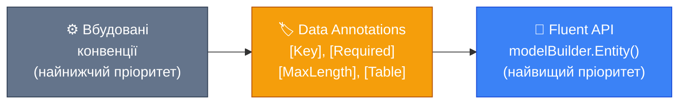

# Конвенції EF Core: Магія без конфігурації

## Чому код «просто працює»

Погляньте ще раз на сутність з попередньої статті:

```csharp
public class Book
{
    public int Id { get; set; }
    public string Title { get; set; } = string.Empty;
    public string? Description { get; set; }
    public decimal Price { get; set; }

    public int AuthorId { get; set; }
    public Author Author { get; set; } = null!;
}
```

Жодного атрибуту `[Key]`. Жодного `[Required]`. Жодного `[ForeignKey]`. Жодного виклику `.HasMaxLength()` чи `.IsRequired()`. Тим не менш, якщо запустити міграцію, EF Core створить таблицю з правильно налаштованим первинним ключем (`Id NOT NULL PRIMARY KEY AUTOINCREMENT`), зовнішнім ключем (`AuthorId` із FK constraint), обов'язковим стовпцем `Title` і необов'язковим `Description` (nullable в SQL).

Звідки він це знає? Відповідь — **конвенції** (conventions). Це набір правил, вбудованих у ядро EF Core, що автоматично визначають конфігурацію моделі на основі структури ваших C#-класів: назв властивостей, типів, наявності `?`, назв навігаційних властивостей.

Конвенції — це «мовчазна угода» між вами і EF Core. Ви дотримуєтесь певних паттернів іменування та типізації, а EF Core натомість конфігурує модель без написання рядків налаштувань. Це **Convention over Configuration** — принцип, що значно прискорює розробку.

Але за цією «магією» стоїть детермінований набір правил, кожне з яких можна вивчити і передбачити. Ця стаття знімає завісу і показує повний перелік вбудованих конвенцій — те, що EF Core «знає» про вашу модель, навіть якщо ви нічого не сказали явно.

---

## Принцип: Convention over Configuration

**Convention over Configuration** (CoC) — архітектурний принцип, що мінімізує кількість рішень, яких розробник повинен прийняти явно, шляхом встановлення «розумних замовчувань». Якщо ваш клас називається `Order` — таблиця буде `Orders`. Якщо поле називається `Id` — це первинний ключ. Якщо рядок не nullable — стовпець матиме `NOT NULL`.

Розробник повинен приймати рішення лише тоді, коли хоче відхилитися від конвенції. Це принципово відрізняється від підходу «configure everything» — де ви явно вказуєте кожен аспект, навіть той, що збігається з дефолтом.

EF Core — строгий прихильник CoC. Дефолти є розумними і покривають переважну більшість CRUD-застосунків. Кастомізація через Fluent API або Data Annotations застосовується лише там, де потрібно відхилитись від конвенцій.

---

## Конвенція 1: Виявлення сутностей

EF Core реєструє тип як сутність (тобто відображає його на таблицю) якщо:

**Умова 1:** Тип оголошений як `DbSet<T>` у DbContext:

```csharp
public class AppDbContext : DbContext
{
    public DbSet<Author> Authors => Set<Author>(); // Author → сутність
    public DbSet<Book> Books => Set<Book>();       // Book → сутність
    // ConversionHelper — не DbSet, не сутність
}
```

**Умова 2:** Тип є навігаційною властивістю вже зареєстрованої сутності — EF Core транзитивно включає його навіть без явного DbSet:

```csharp
public class AppDbContext : DbContext
{
    public DbSet<Author> Authors => Set<Author>(); // явно
    // Book НЕ оголошений як DbSet, але...
}

public class Author
{
    public ICollection<Book> Books { get; set; } = new List<Book>();
    // ...Book виявляється через навігаційну властивість Author.Books
    // Book стає сутністю автоматично!
}
```

**Виключення:** абстрактні класи не реєструються як окремі сутності (але можуть бути базовими для ієрархій — TPH, TPC, TPT, що розглядаються у відповідній статті).

---

## Конвенція 2: Іменування таблиць

EF Core за замовчуванням називає таблицю **у множині від імені DbSet-властивості**:

```csharp
public DbSet<Author> Authors => Set<Author>(); // таблиця: "Authors"
public DbSet<Book> Books => Set<Book>();       // таблиця: "Books"
public DbSet<OrderItem> OrderItems => Set<OrderItem>(); // таблиця: "OrderItems"
```

Якщо тип додається **тільки** через навігаційну властивість (без явного DbSet) — ім'я таблиці береться від **назви типу в множині**:

```csharp
// Немає DbSet<Book>, але Book знайдений через навігацію Author.Books
// Таблиця буде: "Books" (тип Book → Books)
```

Для нестандартного іменування:
```csharp
// Fluent API
modelBuilder.Entity<Author>().ToTable("tbl_Authors");

// Data Annotations
[Table("tbl_Authors")]
public class Author { ... }
```

---

## Конвенція 3: Іменування стовпців

Кожна публічна властивість класу, що має getter і setter, маппиться на стовпець. Ім'я стовпця за замовчуванням — назва властивості C#:

```csharp
public class Product
{
    public int Id { get; set; }           // стовпець: "Id"
    public string Name { get; set; }      // стовпець: "Name"
    public decimal UnitPrice { get; set; } // стовпець: "UnitPrice"
    public DateTime CreatedAt { get; set; } // стовпець: "CreatedAt"
}
```

**Що не маппиться:** читаючи-тільки властивості (без setter), обчислювані властивості (`get => ...`), приватні властивості (але є виключення при явній конфігурації), колекції примітивних типів (окрім провайдерів що підтримують array columns).

```csharp
public class Product
{
    public int Id { get; set; }                     // ✅ маппиться
    public string Name { get; set; } = string.Empty; // ✅ маппиться
    public string FullDescription => Name + " (product)"; // ❌ get-only, не маппиться
    private int InternalCode { get; set; }           // ❌ приватна, не маппиться (без конфігурації)
}
```

---

## Конвенція 4: Первинний ключ

Це одна з найвідоміших конвенцій. EF Core визначає первинний ключ за наступним алгоритмом:

**Крок 1:** Шукає властивість з назвою `Id` (регістронезалежно):

```csharp
public int id { get; set; }   // ✅ знайдено (нижній регістр теж OK)
public int ID { get; set; }   // ✅ знайдено
public int Id { get; set; }   // ✅ найкраща практика
```

**Крок 2:** Або властивість з назвою `{ClassName}Id`:

```csharp
public class Author
{
    public int AuthorId { get; set; } // ✅ знайдено як PK (AuthorId = "Author" + "Id")
}
```

**Пріоритет:** якщо є обидва — `Id` і `AuthorId` — як PK береться `Id`. Якщо є **тільки** `AuthorId` — він є PK.

**Тип ключа та стратегія генерації:**

| C# тип | Стратегія за замовчуванням |
|---|---|
| `int`, `long` | Database Generated (AUTOINCREMENT / IDENTITY) |
| `Guid` | Client Generated (new Guid() у клієнті) або DB Generated (залежить від провайдера) |
| `string` | Не генерується автоматично — потрібно задавати вручну |

::note
Для `int`-ключів EF Core автоматично налаштовує `ValueGeneratedOnAdd()` — значення генерується базою при INSERT. Для `Guid` за замовчуванням у деяких провайдерів — генерація на клієнті через `Guid.NewGuid()`. Це важливо розуміти для оцінки продуктивності: client-generated Guid не потребує round-trip до БД після INSERT.
::

Явне визначення PK:

```csharp
// Через атрибут
[Key]
public Guid Identifier { get; set; }

// Через Fluent API
modelBuilder.Entity<Author>().HasKey(a => a.Identifier);

// Складений ключ (ТІЛЬКИ через Fluent API, не через атрибути)
modelBuilder.Entity<OrderItem>().HasKey(oi => new { oi.OrderId, oi.ProductId });
```

---

## Конвенція 5: Обов'язковість (Required vs Optional)

Це конвенція, що найбільше змінилась зі введенням **Nullable Reference Types (NRT)** у C# 8+. EF Core враховує nullable-анотації типів для автоматичного визначення, чи може стовпець містити NULL.

### Value Types: завжди NOT NULL

Типи-значення (`int`, `decimal`, `bool`, `DateTime`, `Guid` тощо) не можуть бути `null` у C# (якщо не зроблені nullable явно). Відповідно, стовпці для них завжди `NOT NULL`:

```csharp
public int Age { get; set; }          // NOT NULL
public decimal Price { get; set; }    // NOT NULL
public bool IsActive { get; set; }    // NOT NULL
public DateTime CreatedAt { get; set; } // NOT NULL
```

### Nullable Value Types: дозволяє NULL

```csharp
public int? RetiredYear { get; set; }    // NULL дозволяється
public decimal? Discount { get; set; }   // NULL дозволяється
public DateTime? DeletedAt { get; set; } // NULL — soft delete
```

### Reference Types і Nullable Reference Types

Тут все залежить від того, чи увімкнені NRT у проєкті. У сучасних .NET-проєктах (.NET 6+) NRT увімкнені за замовчуванням через `<Nullable>enable</Nullable>` у `.csproj`.

**З увімкненими NRT:**

```csharp
public class Author
{
    public int Id { get; set; }

    // string без ? → NOT NULL (EF Core вважає обов'язковим)
    public string Name { get; set; } = string.Empty;

    // string? → NULL дозволяється
    public string? Biography { get; set; }

    // Navigation property: Author? → optional relationship
    public Author? MentorAuthor { get; set; }
}
```

**Без NRT (або з `<Nullable>disable</Nullable>`):**

EF Core не може покластись на nullable-анотації (бо `string` і `string?` є однаковим без NRT). Тому **всі** reference types вважаються nullable (можуть містити NULL):

```csharp
// Без NRT: string і string? є однаковими для компілятора
// EF Core вважатиме обидва NULLABLE!
public string Name { get; set; }     // буде NULL-able без NRT!
public string? Biography { get; set; } // теж NULL-able
```

::tip
Завжди використовуйте Nullable Reference Types (вони увімкнені за замовчуванням у нових .NET-проєктах). Це дозволяє EF Core правильно визначати обов'язковість без зайвих атрибутів `[Required]`, а також дає вам статичне попередження компілятора при спробі присвоїти null не-nullable полю.
::

Явне управління Required:

```csharp
// Примусово NOT NULL (навіть якщо тип є nullable reference)
[Required]
public string? Name { get; set; } // з атрибутом → NOT NULL у БД

// Через Fluent API
modelBuilder.Entity<Author>()
    .Property(a => a.Name)
    .IsRequired();

// Явно дозволити NULL для value type (через Fluent API або nullable тип)
modelBuilder.Entity<Author>()
    .Property(a => a.RetiredYear)
    .IsRequired(false);
```

---

## Конвенція 6: Типи стовпців

EF Core автоматично маппить C#-типи до SQL-типів провайдера. Точний маппінг описаний у статті про провайдерів, але ось загальна таблиця для SQL Server і PostgreSQL:

| C# тип | SQL Server | PostgreSQL |
|---|---|---|
| `bool` | `bit` | `boolean` |
| `byte` | `tinyint` | `smallint` |
| `short` | `smallint` | `smallint` |
| `int` | `int` | `integer` |
| `long` | `bigint` | `bigint` |
| `float` | `real` | `real` |
| `double` | `float` | `double precision` |
| `decimal` | `decimal(18,2)` | `numeric` |
| `char` | `nvarchar(1)` | `character(1)` |
| `string` | `nvarchar(max)` | `text` |
| `string` (HasMaxLength) | `nvarchar(n)` | `character varying(n)` |
| `DateTime` | `datetime2(7)` | `timestamp with time zone` |
| `DateTimeOffset` | `datetimeoffset(7)` | `timestamp with time zone` |
| `TimeSpan` | `time(7)` | `interval` |
| `DateOnly` | `date` | `date` |
| `TimeOnly` | `time(7)` | `time without time zone` |
| `Guid` | `uniqueidentifier` | `uuid` |
| `byte[]` | `varbinary(max)` | `bytea` |
| `enum` | `int` | `integer` (або власний тип) |

### Конвенція для string: MaxLength

За замовчуванням `string` маппиться на необмежений текстовий тип (`nvarchar(max)` у SQL Server, `text` у PostgreSQL). Якщо ви хочете обмежити довжину:

```csharp
// Атрибут
[MaxLength(200)]
public string Name { get; set; } = string.Empty;

// Fluent API
modelBuilder.Entity<Author>()
    .Property(a => a.Name)
    .HasMaxLength(200); // → nvarchar(200) або character varying(200)
```

Обмеження довжини важливе не тільки для SQL-структури, але й для продуктивності індексів: `nvarchar(max)` не може бути індексованим стовпцем у SQL Server.

### Конвенція для decimal: Precision

`decimal` без явної налаштування може мати різну точність залежно від провайдера. Рекомендовано завжди вказувати явно:

```csharp
modelBuilder.Entity<Product>()
    .Property(p => p.Price)
    .HasPrecision(18, 4); // 18 цифр, 4 після коми

// або через атрибут (EF Core 6+)
[Precision(18, 4)]
public decimal Price { get; set; }
```

---

## Конвенція 7: Зовнішні ключі та навігаційні властивості

Ця конвенція є однією з найскладніших, бо EF Core використовує кілька алгоритмів для визначення зовнішніх ключів.

### Алгоритм виявлення FK

EF Core шукає зовнішній ключ за такими патернами (у порядку пріоритету):

**Паттерн 1:** `{NavigationPropertyName}Id`

```csharp
public class Book
{
    public Author Author { get; set; } = null!;   // navigation
    public int AuthorId { get; set; }              // FK: "Author" + "Id" → AuthorId
}
```

**Паттерн 2:** `{PrincipalEntityName}Id`

```csharp
public class Book
{
    public Author WrittenBy { get; set; } = null!; // navigation named "WrittenBy"
    public int AuthorId { get; set; }              // FK: "Author" (тип) + "Id" → AuthorId
}
```

**Паттерн 3:** `{PrimaryKeyName}` (коли назви збігаються із назвою PK принципала)

```csharp
public class Author
{
    public int Id { get; set; } // PK
}

public class Book
{
    public Author Author { get; set; } = null!;
    public int Id { get; set; } // Це... PK для Book, не FK для Author
    // EF Core не переплутає, бо шукає за паттернами вище
}
```

### Shadow Foreign Keys

Якщо EF Core знаходить навігаційну властивість, але не знаходить відповідного FK-поля в класі — він **автоматично створює Shadow Property**: поле у моделі, що не має відповідника в C#-класі, але існує як стовпець у БД:

```csharp
public class Book
{
    public int Id { get; set; }
    public string Title { get; set; } = string.Empty;

    // Navigation property без явного FK-поля в класі
    public Author Author { get; set; } = null!;
    // EF Core створить shadow property "AuthorId" → стовпець "AuthorId" у таблиці
}
```

Shadow properties корисні, коли ви хочете зберегти чистоту доменної моделі — без FK-полів у класах:

```csharp
// Доступ до shadow property через Entry
var authorId = context.Entry(book).Property<int>("AuthorId").CurrentValue;
```

### Required vs Optional навігація (і кількість)

EF Core також визначає характеристику (cardinality) зв'язку з навігаційних властивостей:

```csharp
public class Book
{
    // Non-nullable navigation → REQUIRED (FK NOT NULL)
    public Author Author { get; set; } = null!;  // AuthorId NOT NULL

    // Nullable navigation → OPTIONAL (FK може бути NULL)
    public Publisher? Publisher { get; set; }     // PublisherId NULL
}

public class Author
{
    // Collection navigation → One-to-Many
    public ICollection<Book> Books { get; set; } = new List<Book>();
}
```

### Двосторонні та односторонні навігації

EF Core підтримує обидва варіанти:

```csharp
// Двостороння навігація (bidirectional)
public class Author
{
    public ICollection<Book> Books { get; set; } = new List<Book>(); // ← зворотня
}
public class Book
{
    public int AuthorId { get; set; }                // FK
    public Author Author { get; set; } = null!;      // → пряма
}

// Одностороння навігація (unidirectional) — БЕЗ зворотньої
public class Author
{
    // Немає Books — з боку Author немає навігації до Book
}
public class Book
{
    public int AuthorId { get; set; }
    public Author Author { get; set; } = null!; // тільки Book → Author
}
```

Обидва варіанти генерують однаковий DDL. Різниця лише у зручності C#-коду.

---

## Конвенція 8: Cascade Delete

За замовчуванням EF Core налаштовує каскадне видалення залежно від того, чи є зв'язок required (обов'язковим) чи optional (необов'язковим):

| Тип зв'язку | FK nullable | Поведінка за замовчуванням |
|---|---|---|
| Required (FK NOT NULL) | Ні | `Cascade` — видалення батька видаляє дочірні |
| Optional (FK nullable) | Так | `ClientSetNull` — EF Core обнуляє FK у відстежуваних об'єктах, але не в БД |

Пояснимо детально:

**Cascade:** якщо `Author` видаляється — всі його `Book` теж видаляються автоматично в транзакції. Це поведінка на рівні бази даних:

```sql
ALTER TABLE "Books" ADD CONSTRAINT "FK_Books_Authors_AuthorId"
    FOREIGN KEY ("AuthorId") REFERENCES "Authors" ("Id")
    ON DELETE CASCADE;
```

**ClientSetNull:** EF Core не налаштовує `ON DELETE` на рівні БД. Замість цього при видаленні батьківського об'єкта він **в пам'яті** обнуляє FK у відстежуваних дочірніх об'єктах. Але якщо дочірні об'єкти не завантажені в ChangeTracker — вони залишаться з недійсним FK! Для таких сценаріїв краще використовувати `Restrict` або `SetNull`.

Явне налаштування DeleteBehavior:

```csharp
modelBuilder.Entity<Book>()
    .HasOne(b => b.Author)
    .WithMany(a => a.Books)
    .HasForeignKey(b => b.AuthorId)
    .OnDelete(DeleteBehavior.Restrict); // не дозволяти видалення автора з книгами
```

Доступні варіанти `DeleteBehavior`:

::field-group

::field{name="Cascade" type="DeleteBehavior"}
Видалення батьківської сутності → автоматичне видалення дочірніх. Реалізується на рівні БД (ON DELETE CASCADE). Зручно, але може призвести до несподіваного масового видалення.
::

::field{name="Restrict" type="DeleteBehavior"}
Видалення батьківської сутності заборонене, якщо є дочірні. База кине FK violation error. Найбезпечніший варіант для бізнес-даних.
::

::field{name="SetNull" type="DeleteBehavior"}
Видалення батька → обнулення FK у дочірніх. Дочірні залишаються у БД з NULL у FK-стовпці. Вимагає nullable FK.
::

::field{name="NoAction" type="DeleteBehavior"}
База не виконує жодних дій (NO ACTION). Порушення FK дасть помилку при commit транзакції (відрізняється від RESTRICT до часу перевірки).
::

::field{name="ClientSetNull" type="DeleteBehavior"}
Тільки клієнтська сторона: EF Core обнуляє FK у відстежуваних об'єктах. На рівні БД — NO ACTION. Небезпечно при частково завантаженому графі об'єктів.
::

::field{name="ClientCascade" type="DeleteBehavior"}
Тільки клієнтська сторона: EF Core видаляє дочірні у відстежуваних об'єктах. Без DB-рівневого каскаду.
::

::

---

## Конвенція 9: Індекси

**Первинний ключ** автоматично отримує **Clustered index** (у SQL Server) або просто унікальний індекс (у PostgreSQL/SQLite). Це відбувається без будь-якої конфігурації.

**Зовнішні ключі** у деяких провайдерах (SQL Server) автоматично не отримують index — EF Core не додає FK-індекс автоматично. Це відомий момент, про який треба пам'ятати: JOIN по FK без індексу = full scan дочірньої таблиці.

::warning
EF Core **не створює автоматично** індекс на FK-стовпці (в більшості провайдерів). Для продуктивних JOIN-ів завжди додавайте індекс на FK вручну через `HasIndex`:

```csharp
modelBuilder.Entity<Book>()
    .HasIndex(b => b.AuthorId); // простий індекс на FK
```

Детально індекси розглядаються у статті 13 (Індекси та обмеження).
::

---

## Конвенція 10: Імена у різних провайдерах

У деяких провайдерах є специфічні конвенції іменування. Наприклад, PostgreSQL традиційно використовує `snake_case` замість `PascalCase`. EF Core за замовчуванням генерує `PascalCase` назви (відповідно до C#-стилю), що може не збігатись із PostgreSQL-конвенціями.

Для автоматичного перетворення на `snake_case` існує пакет EFCore.NamingConventions:

```csharp
// NuGet: EFCore.NamingConventions
opts.UseNpgsql(connectionString)
    .UseSnakeCaseNamingConvention();

// Author → table "authors", Property "FirstName" → column "first_name"
// AuthorId FK → "author_id"
```

Без цього ваші таблиці у PostgreSQL будуть з назвами в `PascalCase` (наприклад, `"Authors"` з лапками), а запити потребуватимуть лапок навколо назв.

---

## Ієрархія конфігурації: хто кого перекриває

EF Core застосовує конфігурацію у суворій ієрархії пріоритетів. Розуміти цей порядок важливо, щоб знати, яка конфігурація «переможе» при конфлікті:

::mermaid



::

Конкретний приклад: одна і та сама властивість, налаштована трьома способами — виграє Fluent API:

```csharp
// Конвенція визначила б: string → nvarchar(max), nullable
// Data Annotation: MaxLength 200, Required
[Required]
[MaxLength(200)]
public string Name { get; set; } = string.Empty;

// Fluent API перекриває обидва вище:
modelBuilder.Entity<Author>()
    .Property(a => a.Name)
    .HasMaxLength(500)      // перекриває [MaxLength(200)]
    .IsRequired(false);     // перекриває [Required]
// Фінальний результат: varchar(500), nullable
```

Рекомендований підхід для командної розробки: *або* Data Annotations, *або* Fluent API. Змішування ускладнює читаність — незрозуміло, де справжня конфігурація.

---

## Кастомні конвенції (EF Core 7+)

EF Core 7 ввів публічний API для написання **власних конвенцій**. Раніше кастомізація конвенцій потребувала складних workarounds через OnModelCreating; тепер є офіційний механізм.

Кастомна конвенція реалізує один з інтерфейсів `IConvention*`. Розглянемо практичний приклад: конвенція, що автоматично додає `_at` суфікс до всіх DateTime-властивостей:

```csharp [Conventions/DateTimeSuffixConvention.cs]
using Microsoft.EntityFrameworkCore.Metadata.Builders;
using Microsoft.EntityFrameworkCore.Metadata.Conventions;
using Microsoft.EntityFrameworkCore.Metadata.Conventions.Infrastructure;

public class DateTimeColumnNameConvention : IPropertyAddedConvention
{
    // Викликається кожний раз, коли нова Property додається до моделі
    public void ProcessPropertyAdded(
        IConventionPropertyBuilder propertyBuilder,
        IConventionContext<IConventionPropertyBuilder> context)
    {
        var property = propertyBuilder.Metadata;

        // Якщо тип Properties — DateTime або DateTime? — і назва не закінчується на "At"
        if ((property.ClrType == typeof(DateTime) || property.ClrType == typeof(DateTime?))
            && !property.Name.EndsWith("At"))
        {
            // Перейменовуємо стовпець (не властивість C# — лише стовпець у БД)
            propertyBuilder.HasColumnName(property.Name + "At");
        }
    }
}
```

Реєстрація кастомної конвенції:

```csharp [Data/AppDbContext.cs]
protected override void ConfigureConventions(ModelConfigurationBuilder configurationBuilder)
{
    configurationBuilder.Conventions.Add(_ => new DateTimeColumnNameConvention());
}
```

Інші корисні інтерфейси конвенцій:

::accordion

::accordion-item{label="IEntityTypeAddedConvention" icon="i-lucide-layers"}
Викликається при додаванні нового типу сутності до моделі. Корисний для автоматичного застосування налаштувань до всіх сутностей певного типу (наприклад, всі сутності, що реалізують `ISoftDeletable`, автоматично отримують `HasQueryFilter`).

```csharp
public class SoftDeleteConvention : IEntityTypeAddedConvention
{
    public void ProcessEntityTypeAdded(
        IConventionEntityTypeBuilder entityTypeBuilder,
        IConventionContext<IConventionEntityTypeBuilder> context)
    {
        var type = entityTypeBuilder.Metadata.ClrType;

        if (typeof(ISoftDeletable).IsAssignableFrom(type))
        {
            // Автоматично фільтруємо видалені записи
            entityTypeBuilder.HasQueryFilter(
                Expression.Lambda(
                    Expression.Not(Expression.Property(
                        Expression.Parameter(type, "e"), "IsDeleted")),
                    Expression.Parameter(type, "e")));
        }
    }
}
```
::

::accordion-item{label="IModelFinalizingConvention" icon="i-lucide-check-circle"}
Викликається після того, як вся модель побудована. Корисний для валідації або масових змін у вже побудованій моделі (наприклад, перевірити що всі сутності мають аудит-поля).

```csharp
public class AuditFieldsValidationConvention : IModelFinalizingConvention
{
    public void ProcessModelFinalizing(
        IConventionModelBuilder modelBuilder,
        IConventionContext<IConventionModelBuilder> context)
    {
        foreach (var entityType in modelBuilder.Metadata.GetEntityTypes())
        {
            if (!entityType.ClrType.GetInterfaces().Any(i => i == typeof(IAuditableEntity)))
            {
                // Попередження — не блокування
                Console.WriteLine($"WARNING: {entityType.Name} does not implement IAuditableEntity");
            }
        }
    }
}
```
::

::accordion-item{label="IPropertyAddedConvention" icon="i-lucide-plus-circle"}
Викликається при додаванні кожної нової властивості. Зручний для масової кастомізації типів. Наприклад, всі `decimal`-властивості автоматично отримують `HasPrecision(18, 4)`:

```csharp
public class DecimalPrecisionConvention : IPropertyAddedConvention
{
    public void ProcessPropertyAdded(
        IConventionPropertyBuilder propertyBuilder,
        IConventionContext<IConventionPropertyBuilder> context)
    {
        if (propertyBuilder.Metadata.ClrType == typeof(decimal)
            || propertyBuilder.Metadata.ClrType == typeof(decimal?))
        {
            propertyBuilder.HasPrecision(18, 4); // defaultна точність для всіх decimal
        }
    }
}
```
::

::

---

## ModelConfigurationBuilder: глобальні налаштування типів

EF Core 6+ ввів `ModelConfigurationBuilder` — зручний API для масових налаштувань типів без написання конвенцій:

```csharp [Data/AppDbContext.cs]
protected override void ConfigureConventions(ModelConfigurationBuilder configurationBuilder)
{
    // Для ВСІХ decimal властивостей у всіх сутностях: precision 18,4
    configurationBuilder
        .Properties<decimal>()
        .HavePrecision(18, 4);

    // Для ВСІХ string властивостей: Unicode (підтримка не-ASCII)
    configurationBuilder
        .Properties<string>()
        .AreUnicode(true);

    // Для ВСІХ DateTime (SQL Server): зберігати як datetime2(0) замість datetime2(7)
    configurationBuilder
        .Properties<DateTime>()
        .HaveColumnType("datetime2(0)");

    // Або через converter для всіх enum-ів: зберігати як string замість int
    configurationBuilder
        .Properties<Enum>()
        .HaveConversion<string>();

    // Додати кастомну конвенцію
    configurationBuilder.Conventions.Add(sp => new DecimalPrecisionConvention());
    configurationBuilder.Conventions.Remove<ForeignKeyIndexConvention>(); // видалити вбудовану
}
```

`ConfigureConventions` — це правильне місце для «глобальних» налаштувань, що застосовуються до всієї моделі, а не до конкретної сутності. Це чистіше, ніж дублювати `.HasPrecision(18, 4)` у кожній конфігурації.

---

## Практичні завдання

::card-group

::card{title="Рівень 1: Вивчення конвенцій" icon="i-lucide-brain"}

**Завдання 1.1** — Без будь-яких атрибутів або Fluent API напишіть сутності для наступної доменної моделі: `Student` (Id, FirstName, LastName, Email, EnrollmentDate), `Course` (Id, Title, Credits, DepartmentId), `Department` (Id, Name, Budget), `Enrollment` (StudentId, CourseId, Grade?). Запустіть `dotnet ef migrations add Initial` і прочитайте згенерований SQL. Для кожного рядка у міграції визначте: яка конвенція його спричинила?

**Завдання 1.2** — Увімкніть і вимкніть Nullable Reference Types у своєму проєкті (через `csproj`). Для однакового класу запустіть міграцію в кожному режимі. Порівняйте, які стовпці стали NOT NULL / NULL у кожному варіанті. Поясніть, чому NRT мають значення для EF Core.

**Завдання 1.3** — Знайдіть у своєму або будь-якому open-source EF Core проєкті клас DbContext. Перелічіть всі вбудовані конвенції, що «спрацьовують» для кожної DbSet-сутності. Скільки рядків Fluent API можна видалити, якщо дотримуватись конвенцій іменування?

::

::card{title="Рівень 2: Конфігурація та перекриття" icon="i-lucide-bar-chart"}

**Завдання 2.1** — Реалізуйте конвенцію `DecimalPrecisionConvention` через `ModelConfigurationBuilder` (глобально, `HasPrecision(18, 4)` для всіх decimal). Потім для одного конкретного поля `Product.Price` встановіть `HasPrecision(10, 2)` через Fluent API. Перевірте через міграцію, що Fluent API перекрив глобальну конвенцію.

**Завдання 2.2** — Реалізуйте і підключіть кастомну конвенцію `IPropertyAddedConvention`, що автоматично додає `.HasComment()` з назвою C#-типу властивості для всіх не-стандартних типів (не `string`, `int`, `bool`, `DateTime`, `decimal`). Перевірте у міграції — де з'явились коментарі?

**Завдання 2.3** — Продемонструйте різну поведінку DeleteBehavior: налаштуйте три різних зв'язки (Author→Books: Cascade, Publisher→Books: Restrict, Editor→Books: SetNull) і напишіть тест, що перевіряє поведінку кожного при видаленні батьківської сутності.

::

::card{title="Рівень 3: Складні конвенції" icon="i-lucide-rocket"}

**Завдання 3.1 — Auto-audit конвенція:** Реалізуйте `IEntityTypeAddedConvention`, що для всіх сутностей, які реалізують інтерфейс `IAuditable { DateTime CreatedAt; DateTime? UpdatedAt; string CreatedBy; }`, автоматично: (а) встановлює `HasDefaultValueSql("CURRENT_TIMESTAMP")` для `CreatedAt`, (б) додає `HasQueryFilter` щоб не повертати soft-deleted записи, (в) реєструє Shadow Property `"RowVersion"` з атрибутом `IsConcurrencyToken`.

**Завдання 3.2 — Snake_case конвенція без пакету:** Напишіть власну `IEntityTypeAddedConvention` та `IPropertyAddedConvention`, що перетворюють PascalCase назви таблиць і стовпців у snake_case (без зовнішнього пакету EFCore.NamingConventions). Функція перетворення: `"AuthorBooks"` → `"author_books"`, `"FirstName"` → `"first_name"`. Перевірте результат у міграції.

::

::

---

## Підсумок

::note
**Ключові думки цієї статті:**

- **Convention over Configuration:** EF Core автоматично конфігурує модель за стандартними C#-паттернами іменування та типізації
- **Виявлення сутностей:** через `DbSet<T>` або транзитивно через навігаційні властивості
- **Іменування:** таблиця = назва DbSet у множині; стовпець = назва C#-властивості
- **PK-конвенція:** властивість `Id` або `{ClassName}Id`; `int`-ключ → AUTO INCREMENT
- **Nullable Reference Types** є ключовим механізмом для визначення обов'язковості стовпців — завжди вмикайте NRT
- **FK-виявлення:** паттерни `{NavPropName}Id` або `{TypeName}Id`; навігація без FK → Shadow Property
- **DeleteBehavior** за замовчуванням: Required → Cascade, Optional → ClientSetNull
- **Ієрархія:** Конвенції → Data Annotations → Fluent API (вищий пріоритет перекриває нижчий)
- **Кастомні конвенції** (EF Core 7+) через `IEntityTypeAddedConvention`, `IPropertyAddedConvention`, `IModelFinalizingConvention`
- `**ConfigureConventions**` — місце для глобальних налаштувань типів (`HavePrecision`, `HaveConversion` тощо)
::

Наступна стаття — [Fluent API vs Data Annotations](/csharp/ef-core/fluent-api-vs-annotations) — детально розбирає два підходи до явної конфігурації моделі, коли що використовувати, і як організувати Fluent API через `IEntityTypeConfiguration<T>`.
