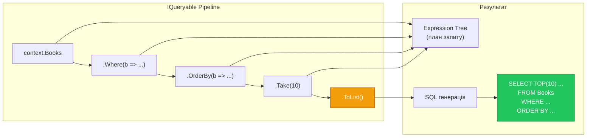

# 10.5. LINQ to Entities — запити до бази

## Вступ: LINQ як мова запитів

У ADO.NET ви писали SQL-рядки вручну: `SELECT * FROM Books WHERE Year > 2020 ORDER BY Title`. У EF Core ви пишете LINQ — типізовані, компільовані запити мовою C#:

```csharp
var books = context.Books
    .Where(b => b.Year > 2020)
    .OrderBy(b => b.Title)
    .ToList();
```

Обидва роблять одне й те саме — генерують SQL. Але LINQ дає **compile-time safety** (компілятор перевіряє імена властивостей), **IntelliSense** (автодоповнення) та **абстракцію** (один код працює з SQL Server, PostgreSQL, SQLite).

Але LINQ to Entities — це **не** LINQ to Objects. Відмінності фундаментальні, і їх нерозуміння — найчастіша причина проблем з продуктивністю.

::note
**Передумови**: [10.4. CRUD-операції](/1.csharp/10.ef-core/04.crud-operations). Базове знання LINQ to Objects.

::

---

## IQueryable vs IEnumerable

### Фундаментальна різниця

| Аспект | `IEnumerable<T>` (LINQ to Objects) | `IQueryable<T>` (LINQ to Entities) |
|:---|:---|:---|
| **Де виконується** | В пам'яті (C#) | На сервері БД (SQL) |
| **Що зберігає** | Дані | Expression Tree (план запиту) |
| **Коли виконується** | Негайно при ітерації | **Відкладено** до матеріалізації |
| **Фільтрація** | У C# | У SQL (WHERE) |
| **Сортування** | У C# | У SQL (ORDER BY) |
| **Pagination** | У C# (потрібні всі дані) | У SQL (OFFSET/FETCH) |

::mermaid



::

### Deferred Execution (відкладене виконання)

LINQ-запит **не виконується** при створенні. Він виконується тільки при **матеріалізації**:

```csharp showLineNumbers
using var context = new LibraryContext();

// Це НЕ виконує SQL — лише будує Expression Tree
IQueryable<Book> query = context.Books
    .Where(b => b.Year > 2020)
    .OrderBy(b => b.Title);

Console.WriteLine("SQL ще не виконано!");

// Матеріалізація — ТЕПЕР виконується SQL
List<Book> result = query.ToList(); // ← SQL виконується тут

Console.WriteLine($"Знайдено: {result.Count}");
```

Методи, що **викликають виконання** (матеріалізація):

| Метод | Що робить |
|:---|:---|
| `ToList()` | Завантажує всі результати |
| `ToArray()` | Те саме, але в масив |
| `First()` / `FirstOrDefault()` | Один елемент (TOP 1) |
| `Single()` / `SingleOrDefault()` | Один елемент, перевірка єдиності (TOP 2) |
| `Count()` / `LongCount()` | SQL COUNT |
| `Any()` | SQL EXISTS |
| `Sum()` / `Average()` / `Max()` | SQL агрегатні функції |
| `foreach` | Ітерація через DataReader |

---

## Як LINQ перетворюється на SQL

### Expression Trees

Коли ви пишете `context.Books.Where(b => b.Year > 2020)`, C# не компілює лямбду в звичайний делегат. Замість цього він створює **Expression Tree** — структуру даних, що описує лямбду:

```csharp showLineNumbers
// Це делегат (LINQ to Objects) — компільований код
Func<Book, bool> func = b => b.Year > 2020;

// Це Expression Tree (LINQ to Entities) — дані про код
Expression<Func<Book, bool>> expr = b => b.Year > 2020;
// expr каже: "Порівняти властивість Year зі значенням 2020 оператором >"
```

EF Core **аналізує** Expression Tree та генерує еквівалентний SQL.

---

## Основні операції

### Filtering (WHERE)

```csharp showLineNumbers
// Прості умови
var available = context.Books
    .Where(b => b.IsAvailable)
    .ToList();
// SQL: SELECT ... FROM Books WHERE IsAvailable = 1

// Кілька умов
var filtered = context.Books
    .Where(b => b.Year > 2010 && b.IsAvailable && b.Author.Contains("Мартін"))
    .ToList();
// SQL: SELECT ... FROM Books
//      WHERE Year > 2010 AND IsAvailable = 1 AND Author LIKE N'%Мартін%'

// Пошук по рядку
var search = context.Books
    .Where(b => b.Title.StartsWith("Clean"))
    .ToList();
// SQL: WHERE Title LIKE N'Clean%'

var searchEnd = context.Books
    .Where(b => b.Title.EndsWith("Code"))
    .ToList();
// SQL: WHERE Title LIKE N'%Code'

// EF.Functions для SQL-специфічних операцій
var like = context.Books
    .Where(b => EF.Functions.Like(b.Title, "%clean%code%"))
    .ToList();
// SQL: WHERE Title LIKE N'%clean%code%'
```

### Projection (SELECT)

Проєкція — вибір тільки потрібних стовпців замість `SELECT *`:

```csharp showLineNumbers
// Анонімний тип — тільки потрібні стовпці
var titles = context.Books
    .Where(b => b.IsAvailable)
    .Select(b => new { b.Title, b.Author })
    .ToList();
// SQL: SELECT Title, Author FROM Books WHERE IsAvailable = 1
// НЕ завантажує Id, Year, Isbn, IsAvailable → менше трафіку

// DTO (Data Transfer Object)
public record BookDto(string Title, string Author, int Year);

var dtos = context.Books
    .Select(b => new BookDto(b.Title, b.Author, b.Year))
    .ToList();
// SQL: SELECT Title, Author, Year FROM Books

// Обчислюване поле
var summaries = context.Books
    .Select(b => new
    {
        Info = b.Title + " (" + b.Author + ")",
        IsOld = b.Year < 2000
    })
    .ToList();
```

::tip
**Правило продуктивності**: Якщо вам потрібні лише 2-3 поля з таблиці у 20 стовпців — використовуйте `Select`. Це значно зменшує обсяг даних, що передаються з бази.

::

### Sorting (ORDER BY)

```csharp showLineNumbers
// Просте сортування
var byYear = context.Books
    .OrderBy(b => b.Year)
    .ToList();
// SQL: SELECT ... FROM Books ORDER BY Year

// Зворотне
var byYearDesc = context.Books
    .OrderByDescending(b => b.Year)
    .ToList();
// SQL: ORDER BY Year DESC

// Складене сортування
var complex = context.Books
    .OrderBy(b => b.Author)
    .ThenByDescending(b => b.Year)
    .ToList();
// SQL: ORDER BY Author, Year DESC
```

### Pagination (OFFSET/FETCH)

```csharp showLineNumbers
int pageNumber = 2;
int pageSize = 10;

var page = context.Books
    .OrderBy(b => b.Title)
    .Skip((pageNumber - 1) * pageSize)  // OFFSET
    .Take(pageSize)                      // FETCH NEXT
    .ToList();
// SQL: SELECT ... FROM Books ORDER BY Title
//      OFFSET 10 ROWS FETCH NEXT 10 ROWS ONLY
```

### Grouping (GROUP BY)

```csharp showLineNumbers
// Кількість книг за автором
var authorStats = context.Books
    .GroupBy(b => b.Author)
    .Select(g => new
    {
        Author = g.Key,
        BookCount = g.Count(),
        LatestYear = g.Max(b => b.Year)
    })
    .OrderByDescending(x => x.BookCount)
    .ToList();
// SQL: SELECT Author, COUNT(*) AS BookCount, MAX(Year) AS LatestYear
//      FROM Books GROUP BY Author ORDER BY COUNT(*) DESC
```

### Aggregation

```csharp showLineNumbers
// Прості агрегації
int totalBooks = context.Books.Count();
int availableCount = context.Books.Count(b => b.IsAvailable);
int maxYear = context.Books.Max(b => b.Year);
double avgYear = context.Books.Average(b => b.Year);
bool anyOld = context.Books.Any(b => b.Year < 1990);

// Кожен виклик — окремий SQL SELECT
// COUNT(*), MAX(Year), AVG(Year), EXISTS(...)
```

---

## Client vs Server Evaluation

### Проблема

Не кожен C#-вираз можна перекласти на SQL. Коли EF Core **не може** перекласти — він або кидає виняток, або виконує частину запиту в пам'яті:

```csharp showLineNumbers
// ✅ Серверна evaluation (транслюється в SQL)
var good = context.Books
    .Where(b => b.Year > 2020)
    .ToList();
// SQL: SELECT ... WHERE Year > 2020

// ❌ Клієнтська evaluation — EF Core кине виняток!
var bad = context.Books
    .Where(b => FormatTitle(b.Title).Contains("clean"))  // FormatTitle — C# метод!
    .ToList();
// InvalidOperationException: FormatTitle не може бути переведений у SQL

string FormatTitle(string title) => title.ToLower().Trim();
```

### Правило

EF Core 3.0+ **суворо** ставиться до client evaluation: якщо вираз у `Where`, `OrderBy`, `Select` (до матеріалізації) не може бути переведений у SQL — **виняток**.

Фільтрація в пам'яті — **тільки після** матеріалізації:

```csharp showLineNumbers
// ✅ Правильно: фільтрація в SQL, потім обробка в C#
var result = context.Books
    .Where(b => b.Year > 2020)     // SQL WHERE
    .AsEnumerable()                 // ← Порог: все після — в пам'яті
    .Where(b => FormatTitle(b.Title).Contains("clean"))  // C# фільтрація
    .ToList();

// ✅ Або через Select + ToList:
var result2 = context.Books
    .Where(b => b.Year > 2020)     // SQL WHERE
    .ToList()                       // Матеріалізація
    .Where(b => FormatTitle(b.Title).Contains("clean"))  // LINQ to Objects
    .ToList();
```

::warning
Будьте обережні з `AsEnumerable()` та `ToList()` посеред запиту. Після них **усі дані** завантажуються в пам'ять. Якщо таблиця має мільйон рядків — ви завантажите їх усі.

::

---

## Compiled Queries

Для запитів, що виконуються часто (hot paths), EF Core може **скомпілювати** Expression Tree заздалегідь:

```csharp showLineNumbers
// Звичайний запит — Expression Tree парситься КОЖЕН виклик
var book = context.Books.FirstOrDefault(b => b.Isbn == isbn);

// Compiled Query — Expression Tree парситься ОДИН раз
private static readonly Func<LibraryContext, string, Book?> GetByIsbn =
    EF.CompileQuery((LibraryContext ctx, string isbn) =>
        ctx.Books.FirstOrDefault(b => b.Isbn == isbn));

// Використання — без overhead парсингу Expression Tree
var book = GetByIsbn(context, "978-0132350884");
```

---

## Практичні завдання

### Рівень 1: Базовий

::steps

### Завдання 1.1: Фільтрація та сортування

1. Знайдіть усі книги після 2010 року.
2. Знайдіть книги, назва яких містить «Code».
3. Відсортуйте за автором, потім за роком (спадання).
4. Увімкніть логування та перевірте SQL кожного запиту.

### Завдання 1.2: Проєкція та агрегація

1. Виведіть тільки Title та Year (без решти стовпців).
2. Порахуйте кількість книг кожного автора (`GroupBy`).
3. Знайдіть середній рік видання.
4. Перевірте, чи є книги до 1990 року (`Any`).

::

### Рівень 2: Практичний

::steps

### Завдання 2.1: Пагінація

1. Реалізуйте метод `GetPage(int page, int size)`.
2. Додайте загальну кількість сторінок.
3. Перевірте SQL (OFFSET / FETCH NEXT).

### Завдання 2.2: Client vs Server

1. Спробуйте використати C#-метод у `Where()` — отримайте виняток.
2. Виправте через `AsEnumerable()` або `ToList()`.
3. Порівняйте кількість рядків, завантажених з бази в обох варіантах.

::

### Рівень 3: Оптимізація

::steps

### Завдання 3.1: Compiled Queries

1. Створіть `CompileQuery` для пошуку за ISBN.
2. Створіть для пошуку за автором з пагінацією.
3. Виміряйте різницю у часі між звичайним та compiled query (100 000 ітерацій).

### Завдання 3.2: Складний звіт

Побудуйте один LINQ-запит, що повертає:
- Кількість книг за кожним автором.
- Середній рік видання.
- Кількість доступних / виданих.
- Відсортований за кількістю книг (спадання).

::

---

## Резюме

::card-group

::card{title="IQueryable" icon="i-heroicons-funnel"}
Expression Tree, який транслюється в SQL на сервері. Deferred execution — SQL виконується тільки при матеріалізації.

::

::card{title="Projection" icon="i-heroicons-document-magnifying-glass"}
Select для вибору потрібних стовпців. DTO замість повних сутностей — менше трафіку, менше пам'яті.

::

::card{title="Client vs Server" icon="i-heroicons-exclamation-triangle"}
EF Core 3.0+ строго: C#-методи в Where → виняток. AsEnumerable/ToList — порог між сервером та клієнтом.

::

::card{title="Compiled Queries" icon="i-heroicons-bolt"}
EF.CompileQuery для hot paths. Expression Tree парситься один раз — швидше для repeated queries.

::

::
