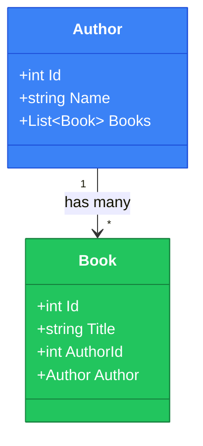

# 10.6. Відношення — Один-до-Багатьох (1:N)

## Вступ: Зв'язки між сутностями

Реальні бази даних рідко складаються з однієї таблиці. Книги мають авторів, автори — кілька книг, замовлення містять товари. Ці **зв'язки** — сама суть реляційних баз даних. У SQL вони реалізуються через **Foreign Keys**, а в EF Core — через **Navigation Properties** (навігаційні властивості).

У цій статті ми детально розглянемо найпоширеніший тип зв'язку — **One-to-Many** (один-до-багатьох): один автор → багато книг, одна категорія → багато товарів.

::note
**Передумови**: [10.3. Entity Configuration](/1.csharp/10.ef-core/03.entity-configuration), [10.5. LINQ to Entities](/1.csharp/10.ef-core/05.linq-to-entities).

::

---

## Теоретичні основи

### Foreign Key у SQL

У реляційних базах зв'язок реалізується через **зовнішній ключ** (Foreign Key):

```sql
CREATE TABLE Authors (
    Id   INT IDENTITY(1,1) PRIMARY KEY,
    Name NVARCHAR(200) NOT NULL
);

CREATE TABLE Books (
    Id       INT IDENTITY(1,1) PRIMARY KEY,
    Title    NVARCHAR(200) NOT NULL,
    AuthorId INT NOT NULL,
    CONSTRAINT FK_Books_Authors FOREIGN KEY (AuthorId) REFERENCES Authors(Id)
);
```

`AuthorId` у таблиці `Books` вказує «ця книга належить автору з Id = X».

### Navigation Properties у C#

EF Core маппить цей зв'язок через **два типи навігаційних властивостей**:

```csharp showLineNumbers
public class Author
{
    public int Id { get; set; }
    public string Name { get; set; } = "";
    public string Country { get; set; } = "";

    // Collection Navigation — колекція книг цього автора
    public List<Book> Books { get; set; } = new();
}

public class Book
{
    public int Id { get; set; }
    public string Title { get; set; } = "";
    public int Year { get; set; }
    public string Isbn { get; set; } = "";

    // Foreign Key Property — FK у C#-класі
    public int AuthorId { get; set; }

    // Reference Navigation — посилання на автора
    public Author Author { get; set; } = null!;
}
```

**Розбір:**

- **Рядок 8**: `List<Book> Books` — **collection navigation**. Автор «має» колекцію книг. Це C#-аналог JOIN.
- **Рядок 19**: `int AuthorId` — **Foreign Key property**. Зберігає значення FK у C#-об'єкті.
- **Рядок 22**: `Author Author` — **reference navigation**. Книга «має» посилання на свого автора.

::mermaid



::

---

## Конфігурація зв'язків

### Convention-based (автоматичне)

EF Core **автоматично** визначає зв'язок при наявності:
- `AuthorId` (FK property) + `Author` (navigation)
- `Author.Books` (collection navigation)

Конвенція працює за правилом: `{NavigationPropertyName}Id` → Foreign Key.

### Fluent API (явне)

```csharp showLineNumbers
public class BookConfiguration : IEntityTypeConfiguration<Book>
{
    public void Configure(EntityTypeBuilder<Book> builder)
    {
        builder.HasOne(b => b.Author)          // Book має одного Author
            .WithMany(a => a.Books)             // Author має багато Books
            .HasForeignKey(b => b.AuthorId)     // FK = AuthorId
            .OnDelete(DeleteBehavior.Cascade);  // Каскадне видалення
    }
}
```

### Cascade Delete

Що відбувається з книгами, коли видаляємо автора?

| `DeleteBehavior` | SQL | Ефект |
|:---|:---|:---|
| `Cascade` | `ON DELETE CASCADE` | Видалення автора → видалення всіх його книг |
| `Restrict` | `ON DELETE NO ACTION` | Заборона видалення автора, якщо є книги |
| `SetNull` | `ON DELETE SET NULL` | `AuthorId` стає `NULL` (FK має бути nullable: `int?`) |
| `ClientSetNull` | Нічого в SQL | EF Core ставить FK = null при Dispose |

::warning
`Cascade` за замовчуванням для required зв'язків (NOT NULL FK). Будьте обережні: видалення одного автора може каскадно видалити сотні книг!

::

---

## Завантаження зв'язаних даних

### Проблема N+1

Подивіться на цей код:

```csharp showLineNumbers
using var context = new LibraryContext();

var books = context.Books.ToList(); // SQL: SELECT * FROM Books (без Authors!)

foreach (var book in books)
{
    // Кожне звернення до book.Author → ОКРЕМИЙ SQL-запит!
    Console.WriteLine($"{book.Title} — {book.Author.Name}");
    // SQL: SELECT * FROM Authors WHERE Id = @p0  (для КОЖНОЇ книги!)
}
// 1 запит на Books + N запитів на Authors = N+1 problem
```

Якщо у вас 100 книг — це **101 SQL-запит** замість одного. Це класична **N+1 problem**.

### Eager Loading (Include)

Рішення — завантажувати зв'язані дані **разом** з основним запитом:

```csharp showLineNumbers
using var context = new LibraryContext();

// Include — один запит з JOIN
var books = context.Books
    .Include(b => b.Author)     // LEFT JOIN Authors ON ...
    .ToList();
// SQL: SELECT b.*, a.* FROM Books b
//      LEFT JOIN Authors a ON b.AuthorId = a.Id

foreach (var book in books)
{
    // Author вже завантажений — без додаткових SQL
    Console.WriteLine($"{book.Title} — {book.Author.Name}");
}
```

### ThenInclude — вкладені зв'язки

```csharp showLineNumbers
// Якщо Author має Country (навігаційна властивість)
var books = context.Books
    .Include(b => b.Author)
        .ThenInclude(a => a.Country)  // Вкладений Include
    .ToList();
```

### Include з фільтрацією (EF Core 5+)

```csharp showLineNumbers
// Завантажити автора разом з його ДОСТУПНИМИ книгами
var authors = context.Authors
    .Include(a => a.Books.Where(b => b.IsAvailable))  // Фільтрований Include
    .ToList();
// SQL: LEFT JOIN Books ON ... AND Books.IsAvailable = 1
```

### Explicit Loading

Завантаження зв'язаних даних **за потребою**:

```csharp showLineNumbers
using var context = new LibraryContext();

var author = context.Authors.Find(1)!;
// author.Books ще порожній

// Явне завантаження колекції
context.Entry(author)
    .Collection(a => a.Books)
    .Load();
// SQL: SELECT * FROM Books WHERE AuthorId = 1

Console.WriteLine($"Книг: {author.Books.Count}");

// З фільтрацією
context.Entry(author)
    .Collection(a => a.Books)
    .Query()
    .Where(b => b.Year > 2020)
    .Load();
```

### Lazy Loading

EF Core може завантажувати зв'язані дані **автоматично** при першому зверненні:

```csharp showLineNumbers
// 1. NuGet: Microsoft.EntityFrameworkCore.Proxies
// 2. Конфігурація:
optionsBuilder.UseLazyLoadingProxies();

// 3. Навігаційні властивості ПОВИННІ бути virtual
public class Book
{
    public virtual Author Author { get; set; } = null!;
}

// 4. Використання — SQL виконується автоматично
var book = context.Books.Find(1)!;
Console.WriteLine(book.Author.Name); // ← SQL SELECT тут (автоматично)
```

::warning
**Lazy Loading** зручний, але небезпечний — легко отримати N+1 problem непомітно. У більшості проєктів рекомендується **Eager Loading** (`Include`) і **Explicit Loading** за потребою.

::

### Порівняння стратегій

| Стратегія | SQL | Коли використовувати |
|:---|:---|:---|
| **Eager** (`Include`) | JOIN у первинному запиті | Завжди потрібні зв'язані дані |
| **Explicit** (`.Load()`) | Окремий SELECT за потребою | Іноді потрібні, умовне завантаження |
| **Lazy** (proxies) | Автоматичний SELECT при зверненні | Рідко (ризик N+1) |

---

## Практичне використання

### Створення зв'язаних даних

```csharp showLineNumbers
using var context = new LibraryContext();

// Спосіб 1: Спочатку автор, потім книги
var author = new Author { Name = "Роберт Мартін", Country = "США" };
context.Authors.Add(author);
context.SaveChanges(); // author.Id = 1

var book = new Book
{
    Title = "Чистий код",
    Year = 2008,
    Isbn = "ISBN-1",
    AuthorId = author.Id  // Використовуємо Id
};
context.Books.Add(book);
context.SaveChanges();

// Спосіб 2: Разом через навігаційну властивість
var author2 = new Author
{
    Name = "Мартін Фаулер",
    Country = "Великобританія",
    Books = new List<Book>
    {
        new() { Title = "Рефакторинг", Year = 1999, Isbn = "ISBN-2" },
        new() { Title = "PoEAA", Year = 2002, Isbn = "ISBN-3" },
    }
};
context.Authors.Add(author2);
context.SaveChanges(); // Зберігає автора + 2 книги в одній транзакції
```

### Запити зі зв'язаними даними

```csharp showLineNumbers
using var context = new LibraryContext();

// Книги конкретного автора
var martinBooks = context.Books
    .Include(b => b.Author)
    .Where(b => b.Author.Name.Contains("Мартін"))
    .OrderBy(b => b.Year)
    .ToList();

// Автори з кількістю книг
var authorStats = context.Authors
    .Select(a => new
    {
        a.Name,
        BookCount = a.Books.Count,
        LatestBook = a.Books.OrderByDescending(b => b.Year).FirstOrDefault()!.Title
    })
    .OrderByDescending(x => x.BookCount)
    .ToList();

// Автори без книг
var authorsWithoutBooks = context.Authors
    .Where(a => !a.Books.Any())
    .ToList();
```

---

## Практичні завдання

### Рівень 1: Базовий

::steps

### Завдання 1.1: Author-Book

1. Створіть модель Author + Book з FK.
2. Додайте 3 авторів з 2-3 книгами кожен.
3. Виведіть усіх авторів з їхніми книгами (`Include`).
4. Перевірте SQL у логах.

### Завдання 1.2: N+1 Problem

1. Завантажте книги **без** Include.
2. Зверніться до `book.Author` в циклі.
3. Порахуйте SQL-запити в логах.
4. Виправте через `Include` — порівняйте кількість запитів.

::

### Рівень 2: Практичний

::steps

### Завдання 2.1: Category-Product

1. `Category` (Id, Name) → `Product` (Id, Name, Price, CategoryId).
2. Фільтрований Include: категорії з товарами дорожче 100.
3. Проєкція: категорія + кількість товарів + середня ціна.

### Завдання 2.2: Cascade Delete

1. Спробуйте видалити автора з книгами при `Cascade` — перевірте результат.
2. Змініть на `Restrict` — спробуйте видалити → отримайте помилку.
3. Змініть на `SetNull` (nullable FK) — перевірте, що книги залишилися без автора.

::

### Рівень 3: Архітектура

::steps

### Завдання 3.1: Три рівні зв'язків

Модель:
1. `Department` → `Employee` (1:N).
2. `Employee` → `Project` (через join-таблицю, розглянемо в наступній статті).
3. Запит: всі департаменти з працівниками та кількістю проєктів.

### Завдання 3.2: Performance

1. Створіть 1000 авторів з 10 книгами кожен.
2. Виміряйте час: запит з Include vs без (N+1).
3. Порівняйте з AsNoTracking + Include.

::

---

## Резюме

::card-group

::card{title="Navigation Properties" icon="i-heroicons-arrows-right-left"}
Reference (один) та Collection (багато). FK property зв'язує C#-об'єкти з SQL Foreign Key.

::

::card{title="Include (Eager Loading)" icon="i-heroicons-arrow-down-tray"}
JOIN у SQL для завантаження зв'язаних даних. ThenInclude для вкладених. Include з фільтрацією (EF Core 5+).

::

::card{title="N+1 Problem" icon="i-heroicons-exclamation-triangle"}
Без Include кожне звернення до навігаційної властивості = окремий SQL. 100 книг = 101 запит.

::

::card{title="Cascade Delete" icon="i-heroicons-trash"}
Cascade, Restrict, SetNull. За замовчуванням — Cascade для required FK.

::

::
