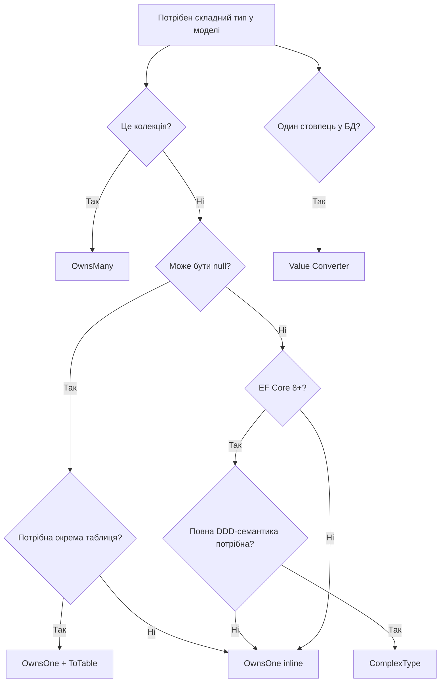

# Складні типи: Complex Types, Keyless Entities, Порівняння

> Це продовження статті [«Складні типи: Owned Types»](/csharp/ef-core/10.complex-types-owned-part1). Читайте послідовно.

---

## Complex Types (EF Core 8+): революція у моделюванні Value Objects

EF Core 8 ввів новий механізм — **Complex Types** (складні типи). На перший погляд вони схожі на Owned Types, але мають принципово відмінну семантику. Це саме та функція, якої не вистачало для правильної реалізації Value Objects у DDD-стилі.

### Чим роблять незручними Owned Types?

Owned Types у EF Core мають кілька дивних обмежень, що суперечать DDD-семантиці Value Objects:

**1. Owned Types підтримують `null`**. Якщо `Customer.ShippingAddress` може бути `null` — це означає, що рядок у БД матиме NULL у відповідних стовпцях. Але Value Object за DDD не може бути `null` — він або присутній повністю, або entity не може існувати.

**2. Owned Types з'являються у change tracker як окремі записи**. Якщо розміщені в окремій таблиці — у `context.ChangeTracker.Entries()` з'являються окремі `EntityEntry` для кожного Owned Type, як якщо б вони були самостійними сутностями.

**3. Кожен екземпляр Owned Type унікальний**. Два різних Customers з однаковою адресою — два різних Owned Type. Це правильно для DDD, але внутрішня реалізація Owned Type у EF Core прив'язує їх до конкретного власника через shadow properties.

**Complex Types** вирішують ці проблеми, впроваджуючи справжню семантику Value Objects:
- Не відстежуються Change Tracker окремо — є **частиною** власника
- Не можуть бути **nullable** (це логічна вимога — Value Object або є, або власника не існує)
- Можуть бути **reused** — один і той самий тип `Address` може мати різних власників без прив'язки
- **Не мають identity** у жодному сенсі — ані PK, ані EF Core internal key

### Визначення Complex Type

```csharp
// Complex Type: помічається атрибутом або конфігурацією
[ComplexType]
public class Money
{
    public decimal Amount { get; set; }
    public string Currency { get; set; } = "UAH";

    // Value Object семантика: equals через значення
    public override bool Equals(object? obj) =>
        obj is Money other && Amount == other.Amount && Currency == other.Currency;

    public override int GetHashCode() => HashCode.Combine(Amount, Currency);

    public static Money operator +(Money a, Money b)
    {
        if (a.Currency != b.Currency) throw new InvalidOperationException("Currency mismatch");
        return new Money { Amount = a.Amount + b.Amount, Currency = a.Currency };
    }

    public override string ToString() => $"{Amount:N2} {Currency}";
}

[ComplexType]
public class Address
{
    public string Street     { get; set; } = string.Empty;
    public string City       { get; set; } = string.Empty;
    public string Country    { get; set; } = string.Empty;
    public string PostalCode { get; set; } = string.Empty;
}
```

```csharp
// Entity, що використовує Complex Types
public class Invoice
{
    public int Id { get; set; }
    public string InvoiceNumber { get; set; } = string.Empty;
    public DateTime IssuedAt { get; set; }

    // Complex Types — не nullable!
    public Money Subtotal   { get; set; } = new();
    public Money TaxAmount  { get; set; } = new();
    public Money TotalAmount { get; set; } = new();

    public Address BillingAddress  { get; set; } = new();
    public Address DeliveryAddress { get; set; } = new();
}
```

### Конфігурація Complex Types через Fluent API

```csharp
public class InvoiceConfiguration : IEntityTypeConfiguration<Invoice>
{
    public void Configure(EntityTypeBuilder<Invoice> builder)
    {
        builder.HasKey(i => i.Id);

        builder.Property(i => i.InvoiceNumber)
               .IsRequired().HasMaxLength(30).IsUnicode(false);

        // Complex Type: Subtotal → Money
        builder.ComplexProperty(i => i.Subtotal, m =>
        {
            m.Property(x => x.Amount)
             .HasColumnName("SubtotalAmount")
             .HasPrecision(14, 2);
            m.Property(x => x.Currency)
             .HasColumnName("SubtotalCurrency")
             .HasMaxLength(3).IsUnicode(false);
        });

        builder.ComplexProperty(i => i.TaxAmount, m =>
        {
            m.Property(x => x.Amount).HasColumnName("TaxAmount").HasPrecision(14, 2);
            m.Property(x => x.Currency).HasColumnName("TaxCurrency").HasMaxLength(3).IsUnicode(false);
        });

        builder.ComplexProperty(i => i.TotalAmount, m =>
        {
            m.Property(x => x.Amount).HasColumnName("TotalAmount").HasPrecision(14, 2);
            m.Property(x => x.Currency).HasColumnName("TotalCurrency").HasMaxLength(3).IsUnicode(false);
        });

        // Complex Type: BillingAddress → Address
        builder.ComplexProperty(i => i.BillingAddress, addr =>
        {
            addr.Property(a => a.Street).HasColumnName("BillingStreet").HasMaxLength(300);
            addr.Property(a => a.City).HasColumnName("BillingCity").HasMaxLength(100);
            addr.Property(a => a.Country).HasColumnName("BillingCountry").HasMaxLength(100);
            addr.Property(a => a.PostalCode).HasColumnName("BillingPostalCode")
                .HasMaxLength(20).IsUnicode(false);
        });

        builder.ComplexProperty(i => i.DeliveryAddress, addr =>
        {
            addr.Property(a => a.Street).HasColumnName("DeliveryStreet").HasMaxLength(300);
            addr.Property(a => a.City).HasColumnName("DeliveryCity").HasMaxLength(100);
            addr.Property(a => a.Country).HasColumnName("DeliveryCountry").HasMaxLength(100);
            addr.Property(a => a.PostalCode).HasColumnName("DeliveryPostalCode")
                .HasMaxLength(20).IsUnicode(false);
        });
    }
}
```

Генерований DDL:

```sql
CREATE TABLE [Invoices] (
    [Id]              INT            NOT NULL IDENTITY,
    [InvoiceNumber]   VARCHAR(30)    NOT NULL,
    [IssuedAt]        DATETIME2      NOT NULL,
    -- Money: Subtotal
    [SubtotalAmount]  DECIMAL(14,2)  NOT NULL,
    [SubtotalCurrency] CHAR(3)       NOT NULL,
    -- Money: Tax
    [TaxAmount]       DECIMAL(14,2)  NOT NULL,
    [TaxCurrency]     CHAR(3)        NOT NULL,
    -- Money: Total
    [TotalAmount]     DECIMAL(14,2)  NOT NULL,
    [TotalCurrency]   CHAR(3)        NOT NULL,
    -- Address: Billing
    [BillingStreet]   NVARCHAR(300)  NOT NULL,
    [BillingCity]     NVARCHAR(100)  NOT NULL,
    [BillingCountry]  NVARCHAR(100)  NOT NULL,
    [BillingPostalCode] VARCHAR(20)  NOT NULL,
    -- Address: Delivery
    [DeliveryStreet]  NVARCHAR(300)  NOT NULL,
    [DeliveryCity]    NVARCHAR(100)  NOT NULL,
    [DeliveryCountry] NVARCHAR(100)  NOT NULL,
    [DeliveryPostalCode] VARCHAR(20) NOT NULL,
    CONSTRAINT [PK_Invoices] PRIMARY KEY ([Id])
);
```

Зверніть: жодних NULL стовпців для Complex Types! Це семантично правильно — `Invoice` без `BillingAddress` не має сенсу.

### Вкладені Complex Types

Complex Types можуть містити інші Complex Types так само, як і Owned Types:

```csharp
[ComplexType]
public class GeoPoint
{
    public double Latitude  { get; set; }
    public double Longitude { get; set; }
}

[ComplexType]
public class PhysicalAddress
{
    public string Street     { get; set; } = string.Empty;
    public string City       { get; set; } = string.Empty;
    public string Country    { get; set; } = string.Empty;
    public string PostalCode { get; set; } = string.Empty;
    public GeoPoint Coordinates   { get; set; } = new(); // вкладений Complex Type
}

public class Warehouse
{
    public int Id { get; set; }
    public string Name { get; set; } = string.Empty;
    public PhysicalAddress Location { get; set; } = new();
}
```

```csharp
builder.ComplexProperty(w => w.Location, loc =>
{
    loc.Property(l => l.Street).HasColumnName("Street").HasMaxLength(300);
    loc.Property(l => l.City).HasColumnName("City").HasMaxLength(100);
    loc.Property(l => l.Country).HasColumnName("Country").HasMaxLength(100);
    loc.Property(l => l.PostalCode).HasColumnName("PostalCode").HasMaxLength(20);

    // Вкладений ComplexProperty
    loc.ComplexProperty(l => l.Coordinates, geo =>
    {
        geo.Property(g => g.Latitude).HasColumnName("Latitude").HasColumnType("float");
        geo.Property(g => g.Longitude).HasColumnName("Longitude").HasColumnType("float");
    });
});
```

### Обмеження Complex Types (EF Core 8)

Complex Types — відносно нова функція, і мають низку поточних обмежень:

::card-group
  ::card{title="Колекції" icon="i-lucide-x-circle"}
  Complex Types **не підтримують колекції** (`ICollection<ComplexType>`). Для колекцій Value Objects використовуйте `OwnsMany`.
  ::
  ::card{title="Nullable" icon="i-lucide-x-circle"}
  Complex Type **не може бути nullable**. Це семантично правильно (Value Object або є, або entity не існує), але іноді незручно.
  ::
  ::card{title="Тільки inline" icon="i-lucide-x-circle"}
  Complex Types **не можуть зберігатися в окремій таблиці** через `ToTable`. Тільки inline у таблиці власника.
  ::
  ::card{title="Запити" icon="i-lucide-check-circle"}
  LINQ-запити по полях Complex Type **повністю підтримуються** — трансляція у SQL коректна.
  ::
  ::card{title="Change Tracking" icon="i-lucide-check-circle"}
  Change Tracker не відстежує Complex Types окремо — вони є частиною власника. Коректна робота без додаткових Value Comparers.
  ::
  ::card{title="Reuse" icon="i-lucide-check-circle"}
  Один і той самий Complex Type (`Money`) може використовуватися у багатьох entity без конфліктів.
  ::
::

---

## Keyless Entity Types: маппінг без первинного ключа

**Keyless Entity Type** — особливий вид сутності, що не має первинного ключа. EF Core не відстежує такі сутності у Change Tracker і не виконує для них INSERT/UPDATE/DELETE. Вони призначені **виключно для читання**: для маппінгу `DATABASE VIEW`, результатів `Raw SQL`, агрегацій.

### Навіщо Keyless Entity Types?

Розглянемо сценарій: потрібен звіт — агрегований підсумок замовлень по місяцях. Результат не є конкретною сутністю (немає PK), він прийшов з VIEW або складного SQL-запиту.

**Погані альтернативи:**
- Використати звичайну Entity з фіктивним PK — Change Tracker відстежуватиме їх і намагатиметься зберегти
- Використати `FromSqlRaw` → маппінг у анонімний тип — немає типобезпеки
- Дублювати запити у C# через `List<Dictionary<string, object>>` — жахливо

**Правильне рішення**: Keyless Entity Type — читання з типобезпекою, без overhead Change Tracker.

### HasNoKey: мінімальна конфігурація

```csharp
// Клас для результату агрегованого запиту
public class MonthlySalesSummary
{
    public int Year { get; set; }
    public int Month { get; set; }
    public int OrderCount { get; set; }
    public decimal TotalRevenue { get; set; }
    public decimal AverageOrderValue { get; set; }
    public int UniqueCustomers { get; set; }
}
```

```csharp
// Конфігурація: HasNoKey вимикає PK і Change Tracking
public class MonthlySalesSummaryConfiguration : IEntityTypeConfiguration<MonthlySalesSummary>
{
    public void Configure(EntityTypeBuilder<MonthlySalesSummary> builder)
    {
        builder.HasNoKey();

        // Це VIEW або Raw SQL результат — не таблиця
        builder.ToView("vw_MonthlySalesSummary");
    }
}
```

### Маппінг на DATABASE VIEW

Найчастіше використання Keyless Entity Types — маппінг на database views:

```sql
-- VIEW у базі даних
CREATE VIEW vw_MonthlySalesSummary AS
SELECT
    YEAR(PlacedAt)  AS [Year],
    MONTH(PlacedAt) AS [Month],
    COUNT(*)                         AS OrderCount,
    SUM(TotalAmount)                 AS TotalRevenue,
    AVG(TotalAmount)                 AS AverageOrderValue,
    COUNT(DISTINCT CustomerId)       AS UniqueCustomers
FROM Orders
WHERE Status = 'Delivered'
GROUP BY YEAR(PlacedAt), MONTH(PlacedAt);
```

```csharp
// DbContext: реєструємо Keyless Entity Type
public class AppDbContext : DbContext
{
    public DbSet<Order> Orders => Set<Order>();
    public DbSet<Customer> Customers => Set<Customer>();

    // Keyless Entity: для READ-only
    public DbSet<MonthlySalesSummary> MonthlySalesSummaries => Set<MonthlySalesSummary>();

    protected override void OnModelCreating(ModelBuilder modelBuilder)
    {
        modelBuilder.ApplyConfigurationsFromAssembly(typeof(AppDbContext).Assembly);
    }
}
```

```csharp
// Запит до VIEW через DbSet:
var lastYearSummary = await context.MonthlySalesSummaries
    .Where(s => s.Year == DateTime.UtcNow.Year - 1)
    .OrderBy(s => s.Month)
    .ToListAsync();
// SQL: SELECT [Year],[Month],[OrderCount],[TotalRevenue],
//             [AverageOrderValue],[UniqueCustomers]
//      FROM [vw_MonthlySalesSummary]
//      WHERE [Year] = 2023
//      ORDER BY [Month]

// Фільтрація та агрегація — все транслюється у SQL
var bestMonth = await context.MonthlySalesSummaries
    .Where(s => s.Year == 2024)
    .OrderByDescending(s => s.TotalRevenue)
    .FirstOrDefaultAsync();
```

### Keyless Entity для Raw SQL результатів

Якщо немає VIEW, але є складний запит:

```csharp
public class ProductWithCategoryStats
{
    public int ProductId { get; set; }
    public string ProductName { get; set; } = string.Empty;
    public string CategoryName { get; set; } = string.Empty;
    public int SalesCount { get; set; }
    public decimal Revenue { get; set; }
    public double Rating { get; set; }
}
```

```csharp
// Конфігурація: HasNoKey без ToView — для Raw SQL результатів
modelBuilder.Entity<ProductWithCategoryStats>().HasNoKey();
```

```csharp
// Використання через FromSqlRaw або FromSqlInterpolated
var topProducts = await context.Set<ProductWithCategoryStats>()
    .FromSqlRaw(@"
        SELECT p.Id AS ProductId, p.Name AS ProductName,
               c.Name AS CategoryName,
               COUNT(oi.Id) AS SalesCount,
               SUM(oi.UnitPrice * oi.Quantity) AS Revenue,
               AVG(CAST(r.Rating AS FLOAT)) AS Rating
        FROM Products p
        JOIN Categories c ON c.Id = p.CategoryId
        LEFT JOIN OrderItems oi ON oi.ProductId = p.Id
        LEFT JOIN Reviews r ON r.ProductId = p.Id
        GROUP BY p.Id, p.Name, c.Name
    ")
    .Where(r => r.SalesCount > 100)  // Composing LINQ поверх Raw SQL
    .OrderByDescending(r => r.Revenue)
    .Take(10)
    .ToListAsync();
```

::note
**Composing LINQ поверх FromSql**: EF Core дозволяє додавати `.Where()`, `.OrderBy()`, `.Take()` поверх `FromSqlRaw()` — якщо запит є **valid composable SQL** (без `ORDER BY` у самому запиті, без `UNION/EXCEPT`). Результат — один SQL-запит з доданими WHERE/ORDER BY.
::

### Keyless vs AsNoTracking

Важливо розрізняти дві концепції:

| | `HasNoKey()` | `.AsNoTracking()` |
|---|---|---|
| **Що це** | Конфігурація типу в моделі | Метод запиту |
| **Change Tracking** | Ніколи | Тільки для цього запиту |
| **CREATE/UPDATE/DELETE** | Неможливо | Можливо через інший запит |
| **Використання** | VIEW, агрегати, raw SQL | Read-heavy сценарії з regular entity |
| **DbSet** | Є у DbContext | Немає окремого налаштування |

---

## Порівняння підходів: Owned Types vs Complex Types vs Value Converter

Тепер, коли ми знаємо всі три механізми, виникає практичне питання: **коли що обирати**?

### Матриця рішень

| Критерій | Owned Type | Complex Type | Value Converter |
|---|---|---|---|
| **Nullable** | Так | Ні | Так |
| **Колекції** | Так (OwnsMany) | Ні | Ні (повний об'єкт → рядок) |
| **Окрема таблиця** | Так | Ні | Ні |
| **Change Tracking** | Окремий EntityEntry | Частина власника | Частина власника |
| **Вкладення** | Так | Так | Ні |
| **LINQ-запити** | Повна підтримка | Повна підтримка | Обмежена |
| **Індексування** | Так | Так | Так |
| **EF Core версія** | 2.0+ | 8.0+ | 2.0+ |
| **DDD-семантика** | Часткова | Повна | Часткова |

### Дерево рішень



### Коли Owned Types

Використовуйте `OwnsOne` / `OwnsMany`, якщо:

- Вам потрібні **nullable** Value Objects — наприклад, `BillingAddress?` є необов'язковою
- Потрібна **колекція** Value Objects — `Order.LineItems`
- Потрібно розмістити Value Object в **окремій таблиці** — для великих об'єктів або lazy-завантаження
- Ви на EF Core **версії нижче 8**

```csharp
// Кращий вибір: OwnsMany для колекцій
public class Course
{
    public int Id { get; set; }
    public ICollection<Lesson> Lessons { get; set; } = new List<Lesson>(); // OwnsMany
}

// Кращий вибір: nullable OwnsOne
public class Employee
{
    public int Id { get; set; }
    public Address? DeputyAddress { get; set; } // Може бути null → OwnsOne
}
```

### Коли Complex Types

Використовуйте `ComplexType`, якщо:

- EF Core **8+** і потрібна **правильна DDD-семантика** Value Object
- Value Object **не може бути null** — це семантичне твердження (Invoice must have BillingAddress)
- Один і той самий тип використовується **у багатьох entity** — `Money`, `Address`, `DateRange`
- Хочете, щоб Change Tracker **не бачив** Value Object як окрему сутність

```csharp
// Кращий вибір: ComplexType для Money у фінансовій системі
public class PaymentTransaction
{
    public int Id { get; set; }
    public Money Amount { get; set; } = new();     // ComplexType
    public Money Fee    { get; set; } = new();     // ComplexType
    public Money Net    { get; set; } = new();     // ComplexType
}
```

### Коли Value Converter

Використовуйте `HasConversion`, якщо:

- Весь об'єкт зберігається у **одному стовпці** (JSON, шифрований рядок, спеціальний формат)
- Потрібна **трансформація значення**, а не структурування (enum → string, UUID → byte[])
- Структура зберігається **довільна** і може змінюватися без міграцій

```csharp
// Кращий вибір: Value Converter для JSON у один стовпець
public class UserSettings
{
    public int Id { get; set; }
    public Preferences Prefs { get; set; } = new(); // → JSON у nvarchar
}
```

---

## Практичне DDD-моделювання з EF Core

Зведемо все разом у реалістичний приклад: система управління замовленнями з DDD-підходом.

```csharp
// Value Objects: Complex Types або Owned Types залежно від сценарію

[ComplexType]
public class Money
{
    public decimal Amount   { get; set; }
    public string Currency  { get; set; } = "UAH";
    public Money Add(Money other)
    {
        if (Currency != other.Currency) throw new InvalidOperationException("Currency mismatch");
        return new() { Amount = Amount + other.Amount, Currency = Currency };
    }
}

[ComplexType]
public class PersonName
{
    public string FirstName { get; set; } = string.Empty;
    public string LastName  { get; set; } = string.Empty;
    public string FullName  => $"{FirstName} {LastName}";
}

// Address: OwnsOne бо може бути nullable (DeliveryAddress у деяких замовленнях може збігатись)
public class PostalAddress
{
    public string Street     { get; set; } = string.Empty;
    public string City       { get; set; } = string.Empty;
    public string Country    { get; set; } = string.Empty;
    public string PostalCode { get; set; } = string.Empty;
}

// Aggregate Root: Order
public class Order
{
    private readonly List<OrderLine> _lines = new();

    public int Id { get; private set; }
    public string OrderNumber { get; private set; } = string.Empty;
    public DateTime PlacedAt { get; private set; }
    public OrderStatus Status { get; private set; }

    // Complex Types: обов'язкові — замовлення без суми не існує
    public Money Subtotal    { get; private set; } = new();
    public Money TaxAmount   { get; private set; } = new();
    public Money TotalAmount { get; private set; } = new();

    // Owned Type: nullable — іноді використовується адреса профілю
    public PostalAddress? DeliveryAddress { get; set; }

    // OwnsMany: ColleCollection Value Objects
    public IReadOnlyCollection<OrderLine> Lines => _lines.AsReadOnly();

    public void AddLine(string sku, string name, int qty, Money unitPrice)
    {
        var existing = _lines.FirstOrDefault(l => l.ProductSku == sku);
        if (existing is not null)
        {
            // Оновлюємо кількість через новий Value Object
            _lines.Remove(existing);
            _lines.Add(new OrderLine
            {
                ProductSku  = sku,
                ProductName = name,
                Quantity    = existing.Quantity + qty,
                UnitPrice   = unitPrice
            });
        }
        else
        {
            _lines.Add(new OrderLine { ProductSku = sku, ProductName = name,
                                       Quantity = qty, UnitPrice = unitPrice });
        }
        RecalculateTotals();
    }

    private void RecalculateTotals()
    {
        Subtotal = _lines.Aggregate(
            new Money { Amount = 0, Currency = "UAH" },
            (acc, line) => acc.Add(new Money
            {
                Amount = line.UnitPrice.Amount * line.Quantity,
                Currency = line.UnitPrice.Currency
            })
        );
        TaxAmount   = new Money { Amount = Subtotal.Amount * 0.20m, Currency = Subtotal.Currency };
        TotalAmount = Subtotal.Add(TaxAmount);
    }
}

// Value Object: рядок замовлення (OwnsMany)
public class OrderLine
{
    public string ProductSku  { get; set; } = string.Empty;
    public string ProductName { get; set; } = string.Empty;
    public int    Quantity    { get; set; }
    public Money  UnitPrice   { get; set; } = new(); // вкладений Complex Type!
}
```

```csharp
public class OrderConfiguration : IEntityTypeConfiguration<Order>
{
    public void Configure(EntityTypeBuilder<Order> builder)
    {
        builder.HasKey(o => o.Id);

        builder.Property(o => o.OrderNumber).IsRequired().HasMaxLength(30);
        builder.Property(o => o.Status).HasConversion<string>().HasMaxLength(30);

        // Complex Types для Money
        builder.ComplexProperty(o => o.Subtotal, m =>
        {
            m.Property(x => x.Amount).HasColumnName("SubtotalAmount").HasPrecision(14, 2);
            m.Property(x => x.Currency).HasColumnName("SubtotalCurrency").HasMaxLength(3).IsUnicode(false);
        });
        builder.ComplexProperty(o => o.TaxAmount, m =>
        {
            m.Property(x => x.Amount).HasColumnName("TaxAmount").HasPrecision(14, 2);
            m.Property(x => x.Currency).HasColumnName("TaxCurrency").HasMaxLength(3).IsUnicode(false);
        });
        builder.ComplexProperty(o => o.TotalAmount, m =>
        {
            m.Property(x => x.Amount).HasColumnName("TotalAmount").HasPrecision(14, 2);
            m.Property(x => x.Currency).HasColumnName("TotalCurrency").HasMaxLength(3).IsUnicode(false);
        });

        // Nullable OwnsOne для DeliveryAddress
        builder.OwnsOne(o => o.DeliveryAddress, addr =>
        {
            addr.Property(a => a.Street).HasColumnName("DeliveryStreet").HasMaxLength(300);
            addr.Property(a => a.City).HasColumnName("DeliveryCity").HasMaxLength(100);
            addr.Property(a => a.Country).HasColumnName("DeliveryCountry").HasMaxLength(100);
            addr.Property(a => a.PostalCode).HasColumnName("DeliveryPostalCode")
                .HasMaxLength(20).IsUnicode(false);
        });

        // OwnsMany з вкладеним ComplexType (UnitPrice)
        builder.OwnsMany(o => o.Lines, line =>
        {
            line.ToTable("OrderLines");
            line.WithOwner().HasForeignKey("OrderId");
            line.Property<int>("Id");
            line.HasKey("Id");

            line.Property(l => l.ProductSku).IsRequired().HasMaxLength(50).IsUnicode(false);
            line.Property(l => l.ProductName).IsRequired().HasMaxLength(200);
            line.Property(l => l.Quantity).IsRequired();

            // Вкладений Complex Type у OwnsMany
            line.ComplexProperty(l => l.UnitPrice, price =>
            {
                price.Property(p => p.Amount).HasColumnName("UnitPriceAmount").HasPrecision(12, 2);
                price.Property(p => p.Currency).HasColumnName("UnitPriceCurrency")
                     .HasMaxLength(3).IsUnicode(false);
            });
        });

        // Backing field для _lines
        builder.Navigation(o => o.Lines).HasField("_lines");
    }
}
```

---

## Практичні завдання (Частина 2)

### Рівень 1 — Базовий

::steps

**Завдання 1.1: ComplexType для Temperature**

Реалізуйте `[ComplexType] Temperature` з полями `Value` (double) і `Unit` (enum: Celsius, Fahrenheit, Kelvin) та методом `ToCelsius()`. Використайте його у `WeatherReading` (Id, RecordedAt, `Temperature Current`, `Temperature DewPoint`). Напишіть конфігурацію з правильними назвами стовпців.

**Завдання 1.2: Keyless Entity для View**

Є VIEW `vw_CustomerOrderStats`:
```sql
CREATE VIEW vw_CustomerOrderStats AS
SELECT CustomerId, COUNT(*) AS OrderCount,
       SUM(TotalAmount) AS LifetimeValue,
       MAX(PlacedAt) AS LastOrderDate
FROM Orders GROUP BY CustomerId;
```
Реалізуйте `CustomerOrderStats` як Keyless Entity Type, зареєструйте у DbContext і напишіть запит: top-10 клієнтів за `LifetimeValue`.

**Завдання 1.3: Порівняння підходів**

Є `BlogPost` з тегами. Тег — лише рядок без ID. Порівняйте три підходи зберігання тегів:
1. `OwnsMany<Tag>` де `Tag` є Value Object з одним полем `Name`
2. `HasConversion` де `List<string>` → JSON у один стовпець
3. Окрема таблиця `Tags` з FK (Regular Entity)

Для кожного: переваги, недоліки, LINQ-запит «знайти всі пости з тегом .NET».

::

### Рівень 2 — Логіка

::steps

**Завдання 2.1: DDD ValueObject з ComplexType**

Реалізуйте Value Object `DateRange` (`Start` та `End` DateOnly):
- Метод `bool Overlaps(DateRange other)`
- Метод `int DurationDays`
- Валідація: `Start <= End`

Використайте у `Vacancy` (Id, JobTitle, `DateRange PostingPeriod`). Напишіть запит: знайти всі вакансії, активні на конкретну дату.

**Завдання 2.2: Keyless Entity з FromSql**

Напишіть Keyless Entity `CategoryRevenueSummary` (CategoryName, ProductCount, TotalRevenue, AvgPrice) і метод репозиторію `GetTopCategoriesAsync(int topN, DateOnly from, DateOnly to)`, що використовує `FromSqlInterpolated` для параметризованого запиту.

::

### Рівень 3 — Архітектура

::steps

**Завдання 3.1: Повна DDD-модель**

Реалізуйте Aggregate `Subscription`:
- `ComplexType Period` (Start, End DateOnly)
- `ComplexType Price` (Amount decimal, Currency string, BillingCycle enum: Monthly/Annual)
- `OwnsMany<SubscriptionEvent>` — лог подій (EventType, OccurredAt, Metadata as JSON string)
- Методи: `Renew()`, `Cancel()`, `Upgrade(Price newPrice)`
- Invariant: `Price.Amount > 0`, `Period.End > Period.Start`

Напишіть конфігурацію, що правильно маппить всі типи, та запит: всі активні підписки, що закінчуються протягом 7 днів.

::

---

## Підсумок

Ця стаття розкрила повну картину роботи зі складними типами в EF Core:

- **Complex Types (EF Core 8+)** — справжня реалізація DDD Value Objects: не nullable, не відстежуються окремо, мають value-equality семантику. Ідеальні для `Money`, `Address`, `DateRange` у системах де EF Core 8+ є вимогою.
- **Owned Types** — більш гнучкий, але менш семантично точний підхід: підтримують nullable, колекції (`OwnsMany`), окремі таблиці. Вибір, коли потрібна гнучкість або EF Core < 8.
- **Keyless Entity Types** — для read-only маппінгу: DATABASE VIEWS, результати сторед процедур, складні агрегаційні запити. `HasNoKey()` вимикає Change Tracking і модифікуючі операції.
- **Матриця вибору**: nullable → Owned, колекція → OwnsMany, обов'язковий та EF8+ → Complex, один стовпець → Value Converter, READ-ONLY → Keyless.
- **DDD-моделювання**: EF Core дозволяє будувати справжні Aggregate Roots з інкапсульованими колекціями через OwnsMany + Backing Fields, та Value Objects через Complex Types.

Наступна стаття — [JSON Columns (стаття 11)](/csharp/ef-core/11.json-columns) — покаже, як EF Core 7+ дозволяє зберігати складні об'єкти як JSONB/JSON нативно, з повноцінною LINQ-трансляцією у SQL.

---

## Додаткові ресурси

- [Офіційна документація: Owned Entity Types](https://learn.microsoft.com/en-us/ef/core/modeling/owned-entities)
- [Офіційна документація: Complex Types](https://learn.microsoft.com/en-us/ef/core/modeling/complex-types)
- [Офіційна документація: Keyless Entity Types](https://learn.microsoft.com/en-us/ef/core/modeling/keyless-entity-types)
- [Офіційна документація: Table Splitting](https://learn.microsoft.com/en-us/ef/core/modeling/table-splitting)
- [EF Core 8 What's New](https://learn.microsoft.com/en-us/ef/core/what-is-new/ef-core-8.0/whatsnew)
