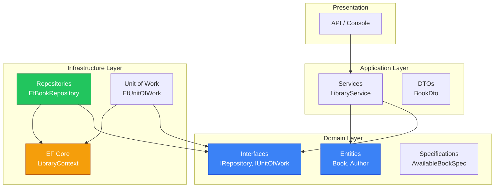

# 10.12. Архітектура — Repository, Unit of Work, Specification з EF Core

## Вступ: Шлях від ADO.NET до Clean Architecture

Це остання стаття модуля EF Core — і одночасно **міст між двома світами**. У модулі ADO.NET ви вручну реалізовували Data Mapper, Repository, Identity Map, Unit of Work та Specification. Тепер — ті ж патерни, але з EF Core.

Головне питання: **чи потрібен Repository поверх DbContext?** DbContext вже є Unit of Work та Identity Map, а DbSet — це Repository. Навіщо ще один шар? Відповідь залежить від архітектури вашого проєкту.

::note
**Передумови**: Весь модуль EF Core (статті 1-11). Статті [9.11](/1.csharp/09.ado-net/11.data-mapper-repository) та [9.12](/1.csharp/09.ado-net/12.advanced-patterns) модуля ADO.NET.

::

---

## Дебати: Repository поверх DbContext

### Аргументи «Проти»

- DbContext **вже є** Unit of Work + Identity Map
- DbSet **вже є** Repository з повним LINQ
- Додатковий шар = більше коду без очевидної вигоди
- `IQueryable<T>` вже надає абстракцію

### Аргументи «За»

- **Тестованість** — мокати `IBookRepository` простіше, ніж `DbSet<Book>`
- **Ізоляція** — Domain шар не залежить від EF Core
- **Контроль** — обмежити доступні операції (readonly repository)
- **Заміна** — теоретично можна замінити EF Core на Dapper

### Практична рекомендація

::tip
**Невеликі проєкти**: Використовуйте `DbContext` напряму. Додатковий шар — overkill.

**Середні/великі проєкти**: Repository **з обмеженим інтерфейсом**. Не дублюйте `IQueryable<T>`.

**Clean Architecture / DDD**: Repository обов'язковий — Domain не повинен знати про EF Core.

::

---

## Generic Repository з EF Core

### Інтерфейс

```csharp showLineNumbers
namespace Library.Domain.Interfaces;

/// <summary>
/// Базовий інтерфейс Repository.
/// Зверніть увагу: тут немає IQueryable — це навмисне.
/// </summary>
public interface IRepository<TEntity, TId> where TEntity : class
{
    Task<TEntity?> GetByIdAsync(TId id, CancellationToken ct = default);
    Task<IReadOnlyList<TEntity>> GetAllAsync(CancellationToken ct = default);
    Task AddAsync(TEntity entity, CancellationToken ct = default);
    Task UpdateAsync(TEntity entity, CancellationToken ct = default);
    Task DeleteAsync(TEntity entity, CancellationToken ct = default);
    Task<bool> ExistsAsync(TId id, CancellationToken ct = default);
}
```

### EF Core реалізація

```csharp showLineNumbers
using Microsoft.EntityFrameworkCore;
using Library.Domain.Interfaces;

namespace Library.Infrastructure;

public class EfRepository<TEntity, TId> : IRepository<TEntity, TId>
    where TEntity : class
{
    protected readonly LibraryContext Context;
    protected readonly DbSet<TEntity> DbSet;

    public EfRepository(LibraryContext context)
    {
        Context = context;
        DbSet = context.Set<TEntity>();
    }

    public virtual async Task<TEntity?> GetByIdAsync(TId id, CancellationToken ct = default)
        => await DbSet.FindAsync(new object[] { id! }, ct);

    public virtual async Task<IReadOnlyList<TEntity>> GetAllAsync(CancellationToken ct = default)
        => await DbSet.ToListAsync(ct);

    public virtual Task AddAsync(TEntity entity, CancellationToken ct = default)
    {
        DbSet.Add(entity);
        return Task.CompletedTask; // SaveChanges — в UoW
    }

    public virtual Task UpdateAsync(TEntity entity, CancellationToken ct = default)
    {
        DbSet.Update(entity);
        return Task.CompletedTask;
    }

    public virtual Task DeleteAsync(TEntity entity, CancellationToken ct = default)
    {
        DbSet.Remove(entity);
        return Task.CompletedTask;
    }

    public virtual async Task<bool> ExistsAsync(TId id, CancellationToken ct = default)
        => await GetByIdAsync(id, ct) != null;
}
```

**Ключовий момент**: `Add`, `Update`, `Delete` **не викликають** `SaveChanges()`. Збереження — відповідальність Unit of Work. Це дозволяє групувати кілька операцій в одну транзакцію.

### Специфічний BookRepository

```csharp showLineNumbers
using Library.Domain;
using Library.Domain.Interfaces;
using Microsoft.EntityFrameworkCore;

namespace Library.Infrastructure;

public interface IBookRepository : IRepository<Book, int>
{
    Task<IReadOnlyList<Book>> GetByAuthorAsync(string author, CancellationToken ct = default);
    Task<IReadOnlyList<Book>> GetAvailableAsync(CancellationToken ct = default);
    Task<Book?> GetByIsbnAsync(string isbn, CancellationToken ct = default);
}

public class EfBookRepository : EfRepository<Book, int>, IBookRepository
{
    public EfBookRepository(LibraryContext context) : base(context) { }

    public async Task<IReadOnlyList<Book>> GetByAuthorAsync(string author, CancellationToken ct)
        => await DbSet
            .Include(b => b.Author)
            .Where(b => b.Author.Name.Contains(author))
            .OrderBy(b => b.Title)
            .ToListAsync(ct);

    public async Task<IReadOnlyList<Book>> GetAvailableAsync(CancellationToken ct)
        => await DbSet
            .Where(b => b.IsAvailable)
            .AsNoTracking()
            .ToListAsync(ct);

    public async Task<Book?> GetByIsbnAsync(string isbn, CancellationToken ct)
        => await DbSet
            .FirstOrDefaultAsync(b => b.Isbn == isbn, ct);
}
```

---

## Unit of Work з EF Core

`DbContext` вже є Unit of Work — `SaveChanges()` це `Commit()`. Але для Clean Architecture можна створити явний інтерфейс:

```csharp showLineNumbers
namespace Library.Domain.Interfaces;

public interface IUnitOfWork : IDisposable
{
    IBookRepository Books { get; }
    IAuthorRepository Authors { get; }
    Task<int> SaveChangesAsync(CancellationToken ct = default);
}
```

Реалізація:

```csharp showLineNumbers
namespace Library.Infrastructure;

public class EfUnitOfWork : IUnitOfWork
{
    private readonly LibraryContext _context;
    public IBookRepository Books { get; }
    public IAuthorRepository Authors { get; }

    public EfUnitOfWork(LibraryContext context)
    {
        _context = context;
        Books = new EfBookRepository(context);
        Authors = new EfAuthorRepository(context);
    }

    public async Task<int> SaveChangesAsync(CancellationToken ct = default)
        => await _context.SaveChangesAsync(ct);

    public void Dispose() => _context.Dispose();
}
```

Використання у сервісі:

```csharp showLineNumbers
public class LibraryService
{
    private readonly IUnitOfWork _uow;

    public LibraryService(IUnitOfWork uow)
    {
        _uow = uow;
    }

    public async Task BorrowBookAsync(int bookId, CancellationToken ct)
    {
        var book = await _uow.Books.GetByIdAsync(bookId, ct)
            ?? throw new InvalidOperationException("Книгу не знайдено");

        book.Borrow();  // Бізнес-логіка (domain model)

        await _uow.Books.UpdateAsync(book, ct);
        await _uow.SaveChangesAsync(ct);  // Одна транзакція
    }
}
```

---

## Specification Pattern з IQueryable

Specification з ADO.NET працювала з `Func<T, bool>` (in-memory). З EF Core ми можемо використати `Expression<Func<T, bool>>` для **серверної фільтрації**:

```csharp showLineNumbers
using System.Linq.Expressions;

namespace Library.Domain.Specifications;

public abstract class Specification<T>
{
    // Expression замість Func — переведеться в SQL!
    public abstract Expression<Func<T, bool>> ToExpression();

    public Specification<T> And(Specification<T> other)
        => new AndSpecification<T>(this, other);

    public Specification<T> Or(Specification<T> other)
        => new OrSpecification<T>(this, other);
}

internal class AndSpecification<T> : Specification<T>
{
    private readonly Specification<T> _left, _right;
    public AndSpecification(Specification<T> left, Specification<T> right)
    { _left = left; _right = right; }

    public override Expression<Func<T, bool>> ToExpression()
    {
        var leftExpr = _left.ToExpression();
        var rightExpr = _right.ToExpression();
        var param = Expression.Parameter(typeof(T));
        var body = Expression.AndAlso(
            Expression.Invoke(leftExpr, param),
            Expression.Invoke(rightExpr, param));
        return Expression.Lambda<Func<T, bool>>(body, param);
    }
}

internal class OrSpecification<T> : Specification<T>
{
    private readonly Specification<T> _left, _right;
    public OrSpecification(Specification<T> left, Specification<T> right)
    { _left = left; _right = right; }

    public override Expression<Func<T, bool>> ToExpression()
    {
        var leftExpr = _left.ToExpression();
        var rightExpr = _right.ToExpression();
        var param = Expression.Parameter(typeof(T));
        var body = Expression.OrElse(
            Expression.Invoke(leftExpr, param),
            Expression.Invoke(rightExpr, param));
        return Expression.Lambda<Func<T, bool>>(body, param);
    }
}
```

Конкретні специфікації:

```csharp showLineNumbers
using Library.Domain;

namespace Library.Domain.Specifications;

public class AvailableBookSpec : Specification<Book>
{
    public override Expression<Func<Book, bool>> ToExpression()
        => b => b.IsAvailable;
}

public class BookByAuthorSpec : Specification<Book>
{
    private readonly string _author;
    public BookByAuthorSpec(string author) => _author = author;
    public override Expression<Func<Book, bool>> ToExpression()
        => b => b.Author.Name.Contains(_author);
}

public class BookByYearSpec : Specification<Book>
{
    private readonly int _year;
    public BookByYearSpec(int year) => _year = year;
    public override Expression<Func<Book, bool>> ToExpression()
        => b => b.Year == _year;
}
```

Розширення Repository:

```csharp showLineNumbers
// У IRepository:
Task<IReadOnlyList<TEntity>> FindAsync(Specification<TEntity> spec, CancellationToken ct);

// У EfRepository:
public async Task<IReadOnlyList<TEntity>> FindAsync(Specification<TEntity> spec, CancellationToken ct)
    => await DbSet
        .Where(spec.ToExpression())  // Expression → SQL WHERE!
        .ToListAsync(ct);
```

Використання:

```csharp showLineNumbers
var spec = new BookByAuthorSpec("Мартін")
    .And(new AvailableBookSpec());

var books = await _uow.Books.FindAsync(spec, ct);
// SQL: SELECT ... FROM Books b JOIN Authors a ON ...
//      WHERE a.Name LIKE '%Мартін%' AND b.IsAvailable = 1
```

---

## Clean Architecture

::mermaid



::

**Ключове правило**: Domain Layer **не залежить** від Infrastructure. `IBookRepository` оголошений у Domain, реалізація `EfBookRepository` — в Infrastructure. Залежності інвертовані.

---

## Тестування

### Unit тести з InMemory Provider

```csharp showLineNumbers
[Fact]
public async Task BorrowBook_WhenAvailable_ShouldSetUnavailable()
{
    // Arrange
    var options = new DbContextOptionsBuilder<LibraryContext>()
        .UseInMemoryDatabase("TestDb_Borrow")
        .Options;

    await using var context = new LibraryContext(options);
    var book = new Book { Title = "Test", Author = "Author", Year = 2024, Isbn = "ISBN" };
    context.Books.Add(book);
    await context.SaveChangesAsync();

    // Act
    var service = new LibraryService(new EfUnitOfWork(context));
    await service.BorrowBookAsync(book.Id, CancellationToken.None);

    // Assert
    var result = await context.Books.FindAsync(book.Id);
    Assert.False(result!.IsAvailable);
}
```

::warning
`UseInMemoryDatabase` — зручний, але **не відтворює** всі аспекти SQL Server (транзакції, constraints, FK cascade). Для Integration Tests використовуйте **Testcontainers** з реальним SQL Server у Docker.

::

### Integration тести з Testcontainers

```csharp showLineNumbers
// NuGet: Testcontainers.MsSql
public class BookRepositoryTests : IAsyncLifetime
{
    private MsSqlContainer _container = null!;
    private LibraryContext _context = null!;

    public async Task InitializeAsync()
    {
        _container = new MsSqlBuilder().Build();
        await _container.StartAsync();

        var options = new DbContextOptionsBuilder<LibraryContext>()
            .UseSqlServer(_container.GetConnectionString())
            .Options;
        _context = new LibraryContext(options);
        await _context.Database.MigrateAsync(); // Застосувати міграції
    }

    [Fact]
    public async Task AddBook_ShouldPersist()
    {
        var repo = new EfBookRepository(_context);
        var book = new Book { Title = "Test", Year = 2024, Isbn = "ISBN" };

        await repo.AddAsync(book);
        await _context.SaveChangesAsync();

        var found = await repo.GetByIsbnAsync("ISBN");
        Assert.NotNull(found);
        Assert.Equal("Test", found!.Title);
    }

    public async Task DisposeAsync()
    {
        await _context.DisposeAsync();
        await _container.DisposeAsync();
    }
}
```

---

## Підсумок модуля: Повний шлях

::mermaid


::

Ви пройшли повний шлях:
1. **ADO.NET** — ручне з'єднання, SQL, маппінг
2. **Data Mapper** — відокремлення маппінгу
3. **Repository** — абстракція колекції доменних об'єктів
4. **Unit of Work** — групування змін у транзакцію
5. **EF Core** — автоматизація всього вищезазначеного
6. **Clean Architecture** — Repository та Specification поверх EF Core

---

## Практичні завдання

::steps

### Завдання 1: Generic Repository

1. Реалізуйте `EfRepository<TEntity, TId>`.
2. `EfBookRepository` та `EfAuthorRepository`.
3. `EfUnitOfWork` з SaveChangesAsync.
4. `LibraryService` що бізнес-логіку без EF Core.

### Завдання 2: Specification Pattern

1. Специфікації: `AvailableBookSpec`, `BookByYearSpec`, `BookByAuthorSpec`.
2. Комбінування: `And`, `Or`.
3. Repository метод `FindAsync(Specification<T>)`.
4. Перевірте згенерований SQL.

### Завдання 3: Повна Clean Architecture

1. `Library.Domain` — Entities, Interfaces, Specifications.
2. `Library.Application` — Services, DTOs.
3. `Library.Infrastructure` — EF Core, Repositories.
4. `Library.Console` — UI.
5. Тести з InMemoryDatabase.

::

---

## Резюме

::card-group

::card{title="Repository + EF Core" icon="i-heroicons-archive-box"}
Generic IRepository + EfRepository. Для Clean Architecture — Domain не знає про EF Core.

::

::card{title="Unit of Work" icon="i-heroicons-clipboard-document-check"}
DbContext = UoW. IUnitOfWork для явного контролю. SaveChangesAsync = Commit.

::

::card{title="Specification" icon="i-heroicons-funnel"}
Expression<Func<T, bool>> замість Func — транслюється в SQL. And/Or комбінування.

::

::card{title="Clean Architecture" icon="i-heroicons-building-office-2"}
Domain → Application → Infrastructure. Залежності інвертовані. Тести без SQL Server.

::

::

::tip
**Вітаємо!** Ви завершили модулі ADO.NET та EF Core. Ви розумієте, як дані зберігаються, читаються, маппляться та абстрагуються — від `SqlConnection.Open()` до `context.Books.Where(b => b.IsAvailable).ToList()`. Ви знаєте, що відбувається на **кожному рівні** стеку.

::
