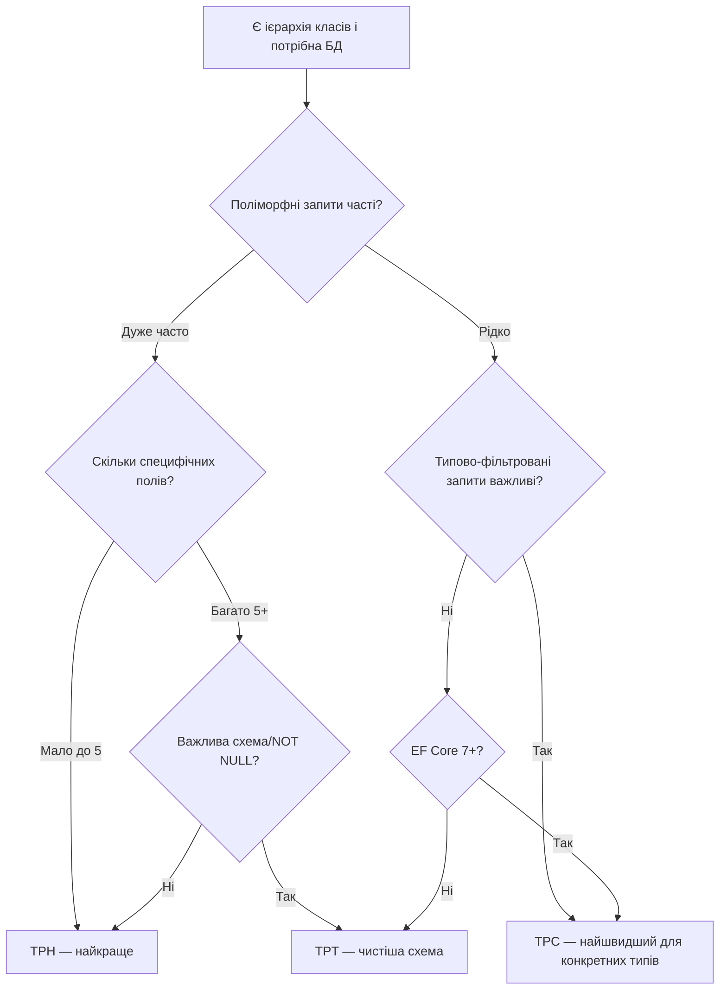

# Успадкування: TPT, TPC та Порівняння Стратегій

> Це продовження статті [«Успадкування: Абстрактні класи та TPH»](/csharp/ef-core/12.inheritance-part1). Читайте послідовно.

---

## TPT: Table-Per-Type

**TPT** (Table-Per-Type) — стратегія, де кожен клас ієрархії має **власну таблицю**. Базовий клас отримує таблицю зі спільними полями, кожен нащадок — таблицю з унікальними полями. Зв'язок між ними — через **shared primary key** (FK нащадка = PK батька).

### Принцип роботи

Повернемося до ієрархії `Publication`:

```
Таблиця: Publications (базова)
┌────┬─────────────────┬─────────────┬─────────────┬─────────────┐
│ Id │ Title           │ AuthorName  │ PublishedAt │ Price       │
├────┼─────────────────┼─────────────┼─────────────┼─────────────┤
│  1 │ Clean Code      │ Robert M.   │ 2008-08-01  │ 350.00      │
│  2 │ SOLID Refresh   │ John Doe    │ 2024-01-15  │ 0.00        │
│  3 │ Dev Stories     │ Alice Smith │ 2023-06-01  │ 0.00        │
└────┴─────────────────┴─────────────┴─────────────┴─────────────┘

Таблиця: Books (специфічна)
┌────┬──────────────┬──────────┬──────────────┬──────────────┐
│ Id │ Isbn         │ PageCount│ Publisher    │ Genre        │
├────┼──────────────┼──────────┼──────────────┼──────────────┤
│  1 │ 978-0132350884│ 464     │ Prentice Hall│ Programming  │
└────┴──────────────┴──────────┴──────────────┴──────────────┘

Таблиця: Articles (специфічна)
┌────┬─────────────────────────┬───────────┬─────────┐
│ Id │ Url                     │ WordCount │ Journal │
├────┼─────────────────────────┼───────────┼─────────┤
│  2 │ https://example.com/... │ 2500      │ NULL    │
└────┴─────────────────────────┴───────────┴─────────┘

Таблиця: Podcasts (специфічна)
┌────┬──────────────────┬─────────────────┬───────────────┐
│ Id │ RssUrl           │ DurationMinutes │ HostName      │
├────┼──────────────────┼─────────────────┼───────────────┤
│  3 │ rss://devi...    │ 45              │ Alice Smith   │
└────┴──────────────────┴─────────────────┴───────────────┘
```

Зверніть: Id у `Books` (1), `Articles` (2), `Podcasts` (3) — це ті самі Id, що у `Publications`. Немає дублікатів, немає `NULL`.

### Переваги TPT перед TPH

- **Немає NULL-стовпців**: кожна таблиця містить лише релевантні поля
- **NOT NULL для специфічних полів**: `Books.Isbn NOT NULL` — можна! У TPH — неможливо
- **Чистіша схема**: DBA розуміє кожну таблицю окремо
- **Нормалізація**: відповідає принципам реляційного моделювання

### Конфігурація TPT через HasBaseType

До EF Core 7 для явного вказання TPT використовувався `builder.HasBaseType<BaseClass>()`. У EF Core 7+ стратегія вказується через `UseTptMappingStrategy`:

```csharp
public class PublicationConfiguration : IEntityTypeConfiguration<Publication>
{
    public void Configure(EntityTypeBuilder<Publication> builder)
    {
        builder.UseTptMappingStrategy(); // ← явно вказуємо TPT

        builder.HasKey(p => p.Id);

        builder.Property(p => p.Title)
               .IsRequired()
               .HasMaxLength(500);

        builder.Property(p => p.AuthorName)
               .IsRequired()
               .HasMaxLength(200);

        builder.Property(p => p.Price)
               .HasPrecision(10, 2);
    }
}

public class BookConfiguration : IEntityTypeConfiguration<Book>
{
    public void Configure(EntityTypeBuilder<Book> builder)
    {
        // Назва таблиці для цього нащадка
        builder.ToTable("Books");

        builder.Property(b => b.Isbn)
               .IsRequired()      // ← тепер справжній NOT NULL!
               .HasMaxLength(20)
               .IsUnicode(false);

        builder.Property(b => b.PageCount)
               .IsRequired();

        builder.Property(b => b.Publisher)
               .IsRequired()
               .HasMaxLength(200);

        builder.Property(b => b.Genre)
               .HasMaxLength(100);

        builder.HasIndex(b => b.Isbn).IsUnique();
    }
}

public class ArticleConfiguration : IEntityTypeConfiguration<Article>
{
    public void Configure(EntityTypeBuilder<Article> builder)
    {
        builder.ToTable("Articles");

        builder.Property(a => a.Url)
               .IsRequired()
               .HasMaxLength(2000)
               .IsUnicode(false);

        builder.Property(a => a.WordCount).IsRequired();
        builder.Property(a => a.Journal).HasMaxLength(200);
    }
}

public class PodcastConfiguration : IEntityTypeConfiguration<Podcast>
{
    public void Configure(EntityTypeBuilder<Podcast> builder)
    {
        builder.ToTable("Podcasts");

        builder.Property(p => p.RssUrl)
               .IsRequired()
               .HasMaxLength(2000)
               .IsUnicode(false);

        builder.Property(p => p.DurationMinutes).IsRequired();
        builder.Property(p => p.HostName)
               .IsRequired()
               .HasMaxLength(200);
    }
}
```

Генерований DDL:

```sql
CREATE TABLE [Publications] (
    [Id]          INT           NOT NULL IDENTITY,
    [Title]       NVARCHAR(500) NOT NULL,
    [AuthorName]  NVARCHAR(200) NOT NULL,
    [PublishedAt] DATETIME2     NOT NULL,
    [Price]       DECIMAL(10,2) NOT NULL,
    CONSTRAINT [PK_Publications] PRIMARY KEY ([Id])
);

CREATE TABLE [Books] (
    [Id]        INT          NOT NULL,        -- FK = PK (shared)
    [Isbn]      VARCHAR(20)  NOT NULL,        -- справжній NOT NULL!
    [PageCount] INT          NOT NULL,
    [Publisher] NVARCHAR(200) NOT NULL,
    [Genre]     NVARCHAR(100) NULL,
    CONSTRAINT [PK_Books] PRIMARY KEY ([Id]),
    CONSTRAINT [FK_Books_Publications_Id]
        FOREIGN KEY ([Id]) REFERENCES [Publications] ([Id]) ON DELETE CASCADE,
    CONSTRAINT [UX_Books_Isbn] UNIQUE ([Isbn])
);

CREATE TABLE [Articles] (
    [Id]        INT           NOT NULL,
    [Url]       VARCHAR(2000) NOT NULL,
    [WordCount] INT           NOT NULL,
    [Journal]   NVARCHAR(200) NULL,
    CONSTRAINT [PK_Articles] PRIMARY KEY ([Id]),
    CONSTRAINT [FK_Articles_Publications_Id]
        FOREIGN KEY ([Id]) REFERENCES [Publications] ([Id]) ON DELETE CASCADE
);

CREATE TABLE [Podcasts] (
    [Id]              INT           NOT NULL,
    [RssUrl]          VARCHAR(2000) NOT NULL,
    [DurationMinutes] INT           NOT NULL,
    [HostName]        NVARCHAR(200) NOT NULL,
    CONSTRAINT [PK_Podcasts] PRIMARY KEY ([Id]),
    CONSTRAINT [FK_Podcasts_Publications_Id]
        FOREIGN KEY ([Id]) REFERENCES [Publications] ([Id]) ON DELETE CASCADE
);
```

Жодних NULL у специфічних таблицях!

### Запити з TPT: JOIN-и скрізь

```csharp
// Поліморфний запит: всі Publications
var all = await context.Publications
    .OrderBy(p => p.PublishedAt)
    .ToListAsync();
```

Генерований SQL:

```sql
SELECT p.[Id], p.[Title], p.[AuthorName], p.[PublishedAt], p.[Price],
       -- Визначаємо тип через наявність NOT NULL у специфічних таблицях
       CASE
           WHEN b.[Id] IS NOT NULL THEN N'Book'
           WHEN a.[Id] IS NOT NULL THEN N'Article'
           WHEN pod.[Id] IS NOT NULL THEN N'Podcast'
       END AS [Discriminator],
       b.[Isbn], b.[PageCount], b.[Publisher], b.[Genre],
       a.[Url], a.[WordCount], a.[Journal],
       pod.[RssUrl], pod.[DurationMinutes], pod.[HostName]
FROM [Publications] AS p
LEFT JOIN [Books]    AS b   ON p.[Id] = b.[Id]
LEFT JOIN [Articles] AS a   ON p.[Id] = a.[Id]
LEFT JOIN [Podcasts] AS pod ON p.[Id] = pod.[Id]
ORDER BY p.[PublishedAt]
```

**Зверніть на LEFT JOIN**: EF Core у поліморфному запиті приєднує **всі** специфічні таблиці — навіть якщо конкретний рядок є лише Book і Article/Podcast JOIN повернуть NULL. Це суттєве навантаження при великих ієрархіях.

```csharp
// Тільки Books: INNER JOIN (не LEFT JOIN)
var books = await context.Books
    .Where(b => b.Genre == "Programming")
    .ToListAsync();
// SQL: SELECT p.*, b.*
//      FROM Publications p
//      INNER JOIN Books b ON p.Id = b.Id
//      WHERE b.Genre = 'Programming'
// Значно ефективніше!
```

### TPT: коли продуктивність стає проблемою

TPT — найменш продуктивна стратегія при поліморфних запитах. Кожен `SELECT * FROM Publications` — це LEFT JOIN до кожної таблиці нащадків. З 5 нащадками — 5 LEFT JOIN. У кожного JOIN — свій IO, свій план виконання. При великих таблицях це може бути катастрофічно.

**Правило**: TPT підходить, якщо:
- Чистота схеми важливіша за продуктивність
- Поліморфні запити рідкісні (переважно звертаємось до конкретних типів)
- Нащадки мають багато специфічних полів (щоб уникнути NULL-explosion у TPH)
- Потрібний NOT NULL constraint на специфічних полях

---

## TPC: Table-Per-Concrete-Class

**TPC** (Table-Per-Concrete-Class) — стратегія EF Core 7+. Кожен **конкретний** (non-abstract) клас отримує **повну** таблицю: всі успадковані поля плюс специфічні. Абстрактний базовий клас таблиці **не має**.

### Принцип роботи

```
Таблиця: Books (повна: успадковані + специфічні)
┌────┬──────────────┬─────────────┬─────────────┬──────────┬──────────┬──────────────┬────┐
│ Id │ Title        │ AuthorName  │ PublishedAt │ Price    │ Isbn     │ Publisher    │ .. │
├────┼──────────────┼─────────────┼─────────────┼──────────┼──────────┼──────────────┼────┤
│  1 │ Clean Code   │ Robert M.   │ 2008-08-01  │ 350.00   │ 978-...  │ Prentice H.. │ .. │
│  4 │ Code Complete│ Steve M.    │ 1993-01-01  │ 420.00   │ 978-...  │ Microsoft P. │ .. │
└────┴──────────────┴─────────────┴─────────────┴──────────┴──────────┴──────────────┴────┘

Таблиця: Articles (повна)
┌────┬───────────────┬────────────┬─────────────┬──────────┬─────────────────┬───────────┐
│ Id │ Title         │ AuthorName │ PublishedAt │ Price    │ Url             │ WordCount │
├────┼───────────────┼────────────┼─────────────┼──────────┼─────────────────┼───────────┤
│  2 │ SOLID Refresh │ John Doe   │ 2024-01-15  │ 0.00     │ https://ex...   │ 2500      │
└────┴───────────────┴────────────┴─────────────┴──────────┴─────────────────┴───────────┘

Таблиці: Podcasts (повна) — аналогічно
```

Немає таблиці `Publications`! Кожна таблиця є повноцінною, самодостатньою.

### Проблема ID при TPC

З'являється **фундаментальна проблема**: якщо `Books` і `Articles` мають `Id=1` одночасно — це не конфлікт у конкретних таблицях (у них різні Id простори). Але при поліморфному запиті `UNION ALL` — два рядки з `Id=1` з різних таблиць стають неоднозначними.

Тому TPC **вимагає глобально унікальних ID** по всій ієрархії. EF Core вирішує це через:

1. **Database Sequences** (рекомендовано): одна послідовність для всієї ієрархії
2. **Hi-Lo алгоритм**: блоки ID, розподілені між таблицями
3. **Guid**: природно унікальні

### Конфігурація TPC

```csharp
public class PublicationConfiguration : IEntityTypeConfiguration<Publication>
{
    public void Configure(EntityTypeBuilder<Publication> builder)
    {
        builder.UseTpcMappingStrategy(); // ← TPC

        builder.HasKey(p => p.Id);
        builder.Property(p => p.Title).IsRequired().HasMaxLength(500);
        builder.Property(p => p.AuthorName).IsRequired().HasMaxLength(200);
        builder.Property(p => p.Price).HasPrecision(10, 2);

        // Database Sequence для генерації глобально унікальних ID
        // EF Core автоматично налаштовує це для TPC при використанні int PK
        builder.Property(p => p.Id)
               .UseHiLo("PublicationSequence"); // Hi-Lo стратегія
    }
}
```

Або через `UseSequence` (краще для TPC):

```csharp
// У OnModelCreating DbContext:
protected override void OnModelCreating(ModelBuilder modelBuilder)
{
    // Глобальна послідовність для всієї ієрархії
    modelBuilder.HasSequence<int>("pub_id_seq")
                .StartsAt(1)
                .IncrementsBy(1);

    modelBuilder.Entity<Publication>(b =>
    {
        b.UseTpcMappingStrategy();
        b.Property(p => p.Id)
         .HasDefaultValueSql("NEXT VALUE FOR pub_id_seq"); // SQL Server
         // PostgreSQL: .HasDefaultValueSql("nextval('pub_id_seq')");
    });

    modelBuilder.ApplyConfigurationsFromAssembly(typeof(AppDbContext).Assembly);
}
```

Конфігурації нащадків — тільки специфічні поля, таблиця вказується явно:

```csharp
public class BookConfiguration : IEntityTypeConfiguration<Book>
{
    public void Configure(EntityTypeBuilder<Book> builder)
    {
        builder.ToTable("Books"); // назва таблиці для цього конкретного типу

        // Успадковані поля конфігурувати не потрібно (вже у Publication)
        builder.Property(b => b.Isbn)
               .IsRequired().HasMaxLength(20).IsUnicode(false);
        builder.Property(b => b.PageCount).IsRequired();
        builder.Property(b => b.Publisher).IsRequired().HasMaxLength(200);
        builder.Property(b => b.Genre).HasMaxLength(100);

        builder.HasIndex(b => b.Isbn).IsUnique();
    }
}
```

Генерований DDL:

```sql
-- Послідовність для ID
CREATE SEQUENCE [pub_id_seq] AS INT START WITH 1 INCREMENT BY 1;

-- Кожна таблиця: всі поля (успадковані + специфічні)
CREATE TABLE [Books] (
    [Id]          INT           NOT NULL DEFAULT (NEXT VALUE FOR [pub_id_seq]),
    [Title]       NVARCHAR(500) NOT NULL,
    [AuthorName]  NVARCHAR(200) NOT NULL,
    [PublishedAt] DATETIME2     NOT NULL,
    [Price]       DECIMAL(10,2) NOT NULL,
    -- Специфічні для Book:
    [Isbn]        VARCHAR(20)   NOT NULL,
    [PageCount]   INT           NOT NULL,
    [Publisher]   NVARCHAR(200) NOT NULL,
    [Genre]       NVARCHAR(100) NULL,
    CONSTRAINT [PK_Books] PRIMARY KEY ([Id])
);

CREATE TABLE [Articles] (
    [Id]          INT           NOT NULL DEFAULT (NEXT VALUE FOR [pub_id_seq]),
    [Title]       NVARCHAR(500) NOT NULL,
    [AuthorName]  NVARCHAR(200) NOT NULL,
    [PublishedAt] DATETIME2     NOT NULL,
    [Price]       DECIMAL(10,2) NOT NULL,
    [Url]         VARCHAR(2000) NOT NULL,
    [WordCount]   INT           NOT NULL,
    [Journal]     NVARCHAR(200) NULL,
    CONSTRAINT [PK_Articles] PRIMARY KEY ([Id])
);

-- Аналогічно Podcasts
```

Жодного FK між таблицями! Жодної таблиці `Publications`. Повна незалежність.

### Запити з TPC: UNION ALL

```csharp
// Поліморфний запит
var all = await context.Set<Publication>()
    .OrderBy(p => p.PublishedAt)
    .ToListAsync();
```

Генерований SQL:

```sql
SELECT [p].[Id], [p].[Title], [p].[AuthorName], [p].[PublishedAt], [p].[Price],
       [p].[Isbn], [p].[PageCount], [p].[Publisher], [p].[Genre],
       NULL AS [Url], NULL AS [WordCount], NULL AS [Journal],
       NULL AS [RssUrl], NULL AS [DurationMinutes], NULL AS [HostName],
       1 AS [_TableIndex]  -- EF Core знає, з якої таблиці рядок
FROM [Books] AS [p]
UNION ALL
SELECT [p].[Id], [p].[Title], [p].[AuthorName], [p].[PublishedAt], [p].[Price],
       NULL, NULL, NULL, NULL,
       [p].[Url], [p].[WordCount], [p].[Journal],
       NULL, NULL, NULL,
       2 AS [_TableIndex]
FROM [Articles] AS [p]
UNION ALL
SELECT [p].[Id], [p].[Title], [p].[AuthorName], [p].[PublishedAt], [p].[Price],
       NULL, NULL, NULL, NULL,
       NULL, NULL, NULL,
       [p].[RssUrl], [p].[DurationMinutes], [p].[HostName],
       3 AS [_TableIndex]
FROM [Podcasts] AS [p]
ORDER BY [PublishedAt]
```

TPC використовує `UNION ALL` замість `LEFT JOIN`. При 5 нащадках — 5 `UNION ALL`. Кожен — окремий SELECT повної таблиці. При типово-фільтрованому запиті — один SELECT без UNION:

```csharp
// Тільки Books: один SELECT, ніяких UNION
var books = await context.Books
    .Where(b => b.Genre == "Programming")
    .ToListAsync();
// SQL: SELECT Id, Title, ..., Isbn, PageCount, Publisher, Genre
//      FROM Books WHERE Genre = 'Programming'
```

### TPC: переваги та недоліки

**Переваги:**
- Найшвидші **типово-фільтровані** запити (один SELECT, без JOIN)
- **Немає NULL** у конкретних таблицях: всі поля або NOT NULL, або логічно nullable
- Немає залежності між таблицями (немає FK у Publications)
- Ідеально підходить для **Bounded Contexts**: кожний тип — своя таблиця, своя «власність»
- **Scalability**: незалежне масштабування кожної таблиці

**Недоліки:**
- Поліморфні запити — `UNION ALL`, що може бути повільніше за один SELECT (TPH)
- Вимагає **глобально унікальних ID**: Database Sequence або Guid
- Дублювання успадкованих стовпців у DDL (денормалізація)
- JOIN нащадка до базового класу неможливий (немає базової таблиці)

---

## Порівняльна таблиця всіх трьох стратегій

### Схема та структура

| Критерій | TPH | TPT | TPC |
|---|---|---|---|
| **Кількість таблиць** | 1 | 1 + N нащадків | N конкретних типів |
| **NULL-стовпці** | Так (N+1 специфічних) | Немає | Немає |
| **NOT NULL для специфічних** | ❌ Неможливо | ✅ Так | ✅ Так |
| **Discriminator** | Так | Ні (CASE через JOIN) | Ні (UNION index) |
| **FK між таблицями** | Немає | Так (base→child) | Немає |
| **EF Core версія** | 2.0+ | 2.0+ | 7.0+ |

### Продуктивність запитів

| Тип запиту | TPH | TPT | TPC |
|---|---|---|---|
| **Поліморфний `GetAll`** | ⭐⭐⭐ (1 SELECT) | ⭐ (N LEFT JOINs) | ⭐⭐ (N UNION ALLs) |
| **Типово-фільтрований** | ⭐⭐⭐ (1 SELECT + WHERE) | ⭐⭐⭐ (INNER JOIN) | ⭐⭐⭐ (1 SELECT) |
| **FindAsync(id)** | ⭐⭐⭐ | ⭐⭐ (JOIN) | ⭐⭐ (UNION+filter) |
| **INSERT** | ⭐⭐⭐ (1 INSERT) | ⭐⭐ (2 INSERTs) | ⭐⭐⭐ (1 INSERT) |
| **UPDATE** | ⭐⭐⭐ (1 UPDATE) | ⭐⭐ (2 UPDATEs) | ⭐⭐⭐ (1 UPDATE) |

### Підтримка міграцій

| Сценарій | TPH | TPT | TPC |
|---|---|---|---|
| **Нове поле у базовому класі** | ALTER TABLE (1 таблиця) | ALTER TABLE (1 таблиця) | ALTER TABLE (N таблиць) |
| **Нове поле у нащадку** | ALTER TABLE (1 стовпець, nullable) | ALTER TABLE (таблиця нащадка) | ALTER TABLE (таблиця нащадка) |
| **Новий нащадок** | Нові стовпці у Publications | Нова таблиця | Нова таблиця |

### Матриця вибору



### Конкретні рекомендації

**Обирайте TPH, якщо:**
- Ієрархія невелика (2-5 типів)
- Кожен нащадок має мало специфічних полів (< 5)
- Поліморфні запити є основним сценарієм у навантаженні
- Продуктивність поліморфного читання критична

**Обирайте TPT, якщо:**
- Важлива чистота схеми (DBA вимоги)
- Нащадки мають суттєво різні структури (багато специфічних полів)
- Потрібний `NOT NULL` для специфічних полів на рівні бази
- Поліморфні запити рідкісні, частіше звернення до конкретних типів

**Обирайте TPC, якщо:**
- EF Core 7+ і типово-фільтровані запити домінують
- Ієрархія є Bounded Context: кожен тип є «власником» своєї таблиці
- Потрібна незалежність таблиць (немає FK між базовою і специфічними)
- Використовуються Guid PK (TPC природний при Guid — немає проблеми з ID)

---

## Абстрактний базовий клас і TPC: ідеальна пара

TPC природно поєднується з абстрактним базовим класом: абстрактний клас — **немає таблиці**, конкретні — **мають** таблиці. Жодного суперечності.

```csharp
// Абстрактний базовий клас ієрархії
public abstract class Publication
{
    public int Id { get; set; }
    public string Title { get; set; } = string.Empty;
    // ...
}

// TPC: Publication не має таблиці, тільки конкретні типи
// Таблиці: Books, Articles, Podcasts
```

На противагу, TPC з **конкретним** базовим класом вимагає таблицю для нього самого (якщо у `DbContext` є `DbSet<Publication>`). Якщо базовий клас конкретний і є рядки `Publication` (не `Book`, не `Article`) — вони зберігаються у своїй таблиці `Publications`. Це рідкісний сценарій, але EF Core підтримує.

---

## Складні сценарії: змішані стратегії

EF Core підтримує **змішані стратегії** у одній ієрархії, хоча це рідко потрібно:

```csharp
// Parent → TPH → деякі нащадки далі ієрархізовані через TPT
public abstract class Animal { ... }
public class Pet : Animal { ... }          // У TPH таблиці Animals
public class Dog : Pet { ... }             // У TPH таблиці Animals (нащадок Pet)
public class WildAnimal : Animal { ... }   // У власній таблиці (TPT від Animal)
```

Це складно і рідко виправдано. Якщо ви опинились у ситуації «мені потрібна різна стратегія для різних гілок» — зазвичай це сигнал переглянути доменну модель.

---

## Практичні завдання (Частина 2)

### Рівень 1 — Базовий

::steps

**Завдання 1.1: TPT для DocumentTypes**

Реалізуйте ієрархію `Document` (Id, Title, FileSize, UploadedAt, AuthorId) з нащадками:
- `PdfDocument` (PageCount, IsSearchable)
- `SpreadsheetDocument` (SheetCount, HasMacros)
- `ImageDocument` (Width, Height, Format — enum: Jpeg, Png, Gif)

Налаштуйте TPT. Переконайтеся, що:
- `PageCount` у `PdfDocuments` — `NOT NULL`
- `Width` та `Height` у `ImageDocuments` — `NOT NULL`
- Поліморфний запит усіх `Document` → перевірте кількість JOIN у SQL

**Завдання 1.2: TPC з Sequence**

Для `AccountTransaction` (Id, Amount, AccountId, OccurredAt) з нащадками `DebitTransaction` (MerchantName, Category) і `CreditTransaction` (Source, ReferenceNumber) — реалізуйте TPC з Database Sequence `tx_seq`. Напишіть запит суми по дебетових транзакціях за місяць.

**Завдання 1.3: Порівняння генерованого SQL**

Для одної і тієї ж ієрархії `Shape` (Id, Color, Area) / `Circle` (Radius) / `Rectangle` (Width, Height) реалізуйте TPH, TPT, TPC. Виконайте запит `.Where(s => s.Color == "red")` для кожного. Використайте `LogTo(Console.WriteLine)` і порівняйте SQL. Яка стратегія генерує найпростіший SQL?

::

### Рівень 2 — Логіка

::steps

**Завдання 2.1: Polymorphic repository**

Для ієрархії `Discount` (Id, Name, IsActive, ExpiresAt) з нащадками:
- `PercentageDiscount` (Percentage)
- `FixedAmountDiscount` (Amount, Currency)
- `FreeShippingDiscount` (MinOrderAmount)

Реалізуйте:

1. Стратегія: TPH (пояснити вибір)
2. `IDiscountRepository` з методами:
   - `GetActiveDiscountsAsync()` → поліморфний список
   - `GetByTypeAsync<T>() where T : Discount` → тільки конкретний тип
   - `ApplyDiscount(Discount d, decimal orderAmount) : decimal` → pattern matching
3. Метод `FindBestDiscountAsync(decimal orderAmount)` — знаходить найвигіднішу знижку

**Завдання 2.2: Міграція між стратегіями**

Проєкт починав з TPH для `Notification` (EmailNotification, SmsNotification, PushNotification). Архітектор вирішив перейти на TPC. Розробіть план міграції:
1. Яка послідовність SQL-команд потрібна?
2. Як зберегти існуючі дані?
3. Які зміни у C# коді і конфігурації EF Core?

::

### Рівень 3 — Архітектура

::steps

**Завдання 3.1: E-commerce з гібридним підходом**

У системі є три ієрархії:
1. `Product` (BaseEntity) → `PhysicalProduct` / `DigitalProduct` / `ServiceProduct` — виберіть стратегію і обгрунтуйте
2. `Order` (BaseEntity) → без ієрархії (тільки абстрактний базовий клас)
3. `PaymentMethod` → `CreditCard` / `BankTransfer` / `Crypto` — виберіть стратегію

Для кожної ієрархії:
- Обгрунтуйте вибір (TPH/TPT/TPC/просто абстрактний клас)
- Реалізуйте конфігурацію
- Напишіть один реалістичний запит, що демонструє переваги вашого вибору
- Оцініть, як зміниться вибір, якщо кількість записів зросте з 10K до 10M

::

---

## Підсумок

У цих двох статтях ми охопили весь спектр наслідування в EF Core:

| Підхід | Коли | Результат у БД |
|---|---|---|
| **Абстрактний базовий клас** | Спільні поля (DRY) | Окремі таблиці, без ієрархії |
| **TPH** | Невелика ієрархія, часті поліморфні запити | 1 таблиця + discriminator |
| **TPT** | Чистота схеми, NOT NULL для специфічних | Окрема таблиця для кожного типу + FK |
| **TPC** | Незалежні таблиці, типово-фільтровані запити | Повна таблиця для кожного конкретного типу |

Ключовий висновок: **не існує «правильної» стратегії** — є стратегія, оптимальна для конкретних вимог. TPH — стандарт для більшості сценаріїв. TPT — коли схема важливіша за продуктивність. TPC — коли типово-фільтровані запити домінують і потрібна незалежність таблиць.

Наступна стаття — [Індекси, Обмеження та Схема (стаття 13)](/csharp/ef-core/13.indexes-constraints) — покриє HasIndex, фільтровані індекси, Check Constraints, Database Sequences та Collation.

---

## Додаткові ресурси

- [Офіційна документація: Inheritance](https://learn.microsoft.com/en-us/ef/core/modeling/inheritance)
- [EF Core 7: TPC Mapping](https://learn.microsoft.com/en-us/ef/core/what-is-new/ef-core-7.0/whatsnew#table-per-concrete-type-tpc-inheritance)
- [Martin Fowler: Inheritance Mapping Patterns](https://martinfowler.com/eaaCatalog/classTableInheritance.html)
- [PostgreSQL Table Inheritance](https://www.postgresql.org/docs/current/ddl-inherit.html)
