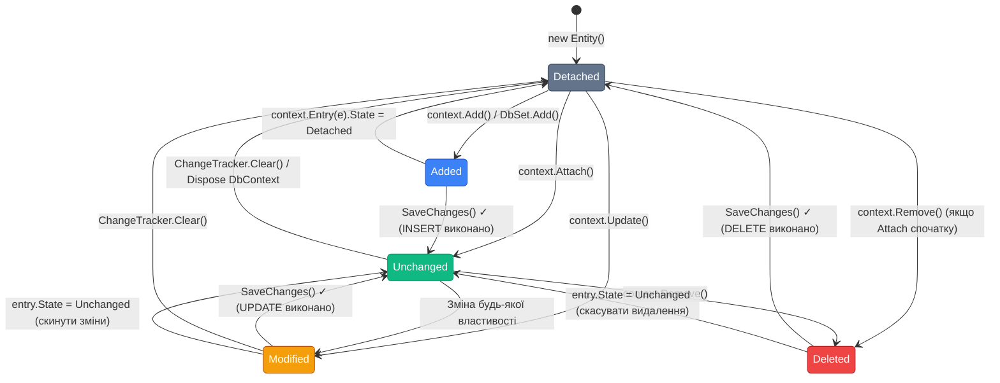

# Change Tracker: Відстеження Змін

## Що таке Change Tracker і навіщо він потрібен

Entity Framework Core реалізує патерн **Unit of Work**: ви вносите зміни у C#-об'єкти впродовж «одиниці роботи» (HTTP-запит, транзакція, команда), а потім одним викликом `SaveChanges()` все записується до бази. Change Tracker — механізм, що робить цей патерн можливим.

По суті, Change Tracker — це **реєстр змін**. Коли ви завантажуєте entity через EF Core, трекер робить знімок (snapshot) початкового стану. Коли ви викликаєте `SaveChanges()` — трекер порівнює поточний стан кожного entity зі знімком і генерує відповідні SQL: `INSERT` для нових, `UPDATE` для змінених, `DELETE` для видалених.

Без Change Tracker програміст мав би явно вказувати «цей об'єкт я змінив, той видалив» — як в ADO.NET. EF Core автоматизує це. Але ця автоматизація не безкоштовна, і глибоке розуміння Change Tracker допомагає уникнути типових помилок: зайвих UPDATE-ів, що нічого не змінюють, або навпаки — змін що не зберігаються.

---

## Identity Map: DbContext як кеш першого рівня

Першій концепції, яку важливо зрозуміти — **Identity Map**. DbContext зберігає посилання на всі відстежувані entity, ідексовані за типом і значенням Primary Key.

Коли ви завантажуєте entity з однаковим PK двічі в межах одного DbContext — жодного другого SQL-запиту не відбувається. DbContext повертає той самий C#-об'єкт з кешу:

```csharp
// Перший запит: SQL виконується, Product завантажується в кеш
var product1 = await context.Products.FirstOrDefaultAsync(p => p.Id == 42);

// Другий запит з тим самим Id: SQL НЕ виконується!
var product2 = await context.Products.FindAsync(42);

Console.WriteLine(ReferenceEquals(product1, product2)); // True — той самий об'єкт
```

Це важливо розуміти з кількох причин.

**По-перше**, Identity Map заощаджує SQL-запити при повторному зверненні до тих самих даних. Якщо у сервісному шарі кілька методів завантажують один і той самий `Customer` — лише перший виклик іде в БД.

**По-друге**, Identity Map означає що хтось хто змінив entity в одній частині коду — ці зміни **видимі** у всіх інших місцях що тримають посилання на той самий об'єкт. Це потужно, але може бути несподіваним:

```csharp
var orderFromRepo  = await orderRepository.GetByIdAsync(orderId);
var orderFromCache = await unitOfWork.Orders.FindAsync(orderId); // той самий об'єкт

orderFromRepo.Status = "Cancelled"; // змінюємо через один Service

// orderFromCache.Status ТЕЖЕ "Cancelled" — той самий C# об'єкт!
Console.WriteLine(orderFromCache.Status); // "Cancelled"
```

**По-третє**, `FindAsync` завжди спочатку перевіряє Identity Map — тому він ефективніший за `FirstOrDefaultAsync(p => p.Id == id)` коли є шанс що об'єкт вже в кеші.

---

## EntityState: п'ять станів Entity

Кожен відстежуваний entity знаходиться в одному з п'яти станів:

```
Detached → Added  → Unchanged → Modified → Deleted
           ↓                    ↑     ↓
           └────────────────────┘     ↓
                                  [SaveChanges]
```

**`Detached`** — entity не знає про DbContext. Щойно створений `new Product()` або результат `AsNoTracking()` запиту. Жодного SQL при `SaveChanges()`.

**`Added`** — entity додано через `context.Products.Add(...)` або `context.Add(...)`. При `SaveChanges()` → `INSERT`.

**`Unchanged`** — entity завантажений з бази і не змінювався. При `SaveChanges()` → нічого.

**`Modified`** — entity завантажений і одна чи більше властивостей змінено. При `SaveChanges()` → `UPDATE`.

**`Deleted`** — entity позначено для видалення через `context.Remove(...)`. При `SaveChanges()` → `DELETE`.

### Перегляд стану через Entry API

```csharp
var product = await context.Products.FindAsync(productId);
Console.WriteLine(context.Entry(product!).State); // Unchanged

product!.Price = 999m;
Console.WriteLine(context.Entry(product).State);  // Modified

var newProduct = new Product { Name = "New", Price = 500m, CategoryId = 1 };
context.Products.Add(newProduct);
Console.WriteLine(context.Entry(newProduct).State); // Added

context.Products.Remove(product);
Console.WriteLine(context.Entry(product).State);   // Deleted

var untracked = new Product { Id = 99, Name = "Ghost" };
Console.WriteLine(context.Entry(untracked).State); // Detached
```

### Lifecycle переходів стану

Стани переключаються не лише під час явних операцій:

```csharp
// Завантаження → Unchanged
var order = await context.Orders.FindAsync(orderId);
// State: Unchanged

// Зміна властивості → Modified
order!.Status = "Processing";
// State: Modified

// SaveChanges → Unchanged (не Detached!)
await context.SaveChanges();
// State: Unchanged — entity залишається трекованим після збереження!

// Remove → Deleted
context.Orders.Remove(order);
// State: Deleted

// SaveChanges після Remove → Detached
await context.SaveChanges();
// State: Detached — після фізичного DELETE entity відключається
```

Ключова деталь: після успішного `SaveChanges()` entity залишається у трекері зі станом `Unchanged`, якщо його не видаляли. Це дозволяє продовжувати роботу з ним без повторного завантаження.

---

## Snapshot Detection: як EF Core виявляє зміни

За замовчуванням EF Core використовує **snapshot-based change detection**. Під час завантаження entity трекер робить копію (snapshot) усіх значень. За замовчуванням `DetectChanges()` виконується автоматично перед кожним `SaveChanges()`.

### Що відбувається при DetectChanges

```csharp
var product = await context.Products.FindAsync(5);
// Snapshot: { Id=5, Name="Laptop", Price=35000m, IsActive=true }

product!.Price = 38000m;
product!.Name  = "Laptop Pro";

// При SaveChanges → DetectChanges запускається автоматично:
// Current:  { Id=5, Name="Laptop Pro", Price=38000m, IsActive=true }
// Snapshot: { Id=5, Name="Laptop",     Price=35000m, IsActive=true }
// Diff:     Name і Price змінились → Modified
// Генерує: UPDATE Products SET Name='Laptop Pro', Price=38000 WHERE Id=5

await context.SaveChanges();
// Snapshot оновлюється
```

Важливо: EF Core генерує `UPDATE` тільки для **реально змінених** стовпців, а не для всього рядка. Якщо змінено лише `Price` — SQL містить тільки `SET Price = @p0`.

### Явний виклик DetectChanges

```csharp
// У складних сценаріях може знадобитись явний виклик:
var product = await context.Products.FindAsync(5);
product!.Price = 99000m;

// Перевірити що трекер «знає» про зміну до SaveChanges
context.ChangeTracker.DetectChanges();
Console.WriteLine(context.Entry(product).State); // Modified

// HasChanges: є хоч одна зміна?
bool hasChanges = context.ChangeTracker.HasChanges(); // true
```

### AutoDetectChanges: коли вимикати

`DetectChanges` — алгоритм O(N) де N — кількість відстежуваних entity. При 1000+ відстежуваних об'єктів — кожен виклик `SaveChanges()` або `Add()` додає overhead.

У high-throughput сценаріях (bulk import, batch processing) — вимкнення `AutoDetectChanges` і ручний виклик:

```csharp
// Вимкнути автоматичне DetectChanges
context.ChangeTracker.AutoDetectChangesEnabled = false;

try
{
    foreach (var product in productsToUpdate) // 10,000 записів
    {
        var existing = await context.Products.FindAsync(product.Id);
        if (existing is not null)
        {
            existing.Price = product.Price;
            existing.Stock = product.Stock;
        }
        // Без AutoDetectChanges: overhead відсутній на кожному кроці
    }

    // Один явний DetectChanges перед збереженням
    context.ChangeTracker.DetectChanges();
    await context.SaveChanges();
}
finally
{
    context.ChangeTracker.AutoDetectChangesEnabled = true; // повернути
}
```

---

## ChangeTracker API: повний огляд

EF Core надає `ChangeTracker` як окремий об'єкт зі своїм API для інтроспекції і керування.

### Перегляд всіх відстежуваних entity

```csharp
// Отримати всі EntityEntry
var entries = context.ChangeTracker.Entries();

foreach (var entry in entries)
{
    Console.WriteLine($"Type: {entry.Entity.GetType().Name}");
    Console.WriteLine($"State: {entry.State}");
    Console.WriteLine($"PK: {entry.Properties.FirstOrDefault(p => p.Metadata.IsPrimaryKey())?.CurrentValue}");
    Console.WriteLine();
}

// Фільтрація за типом
var modifiedProducts = context.ChangeTracker
    .Entries<Product>()
    .Where(e => e.State == EntityState.Modified);

// Фільтрація за станом
var allModified = context.ChangeTracker
    .Entries()
    .Where(e => e.State == EntityState.Modified);
```

### Перегляд конкретних властивостей

```csharp
var entry = context.Entry(product);

// Поточне значення
decimal currentPrice = (decimal)entry.Property(p => p.Price).CurrentValue!;

// Оригінальне значення (snapshot)
decimal originalPrice = (decimal)entry.Property(p => p.Price).OriginalValue!;

// Чи змінена конкретна властивість?
bool priceChanged = entry.Property(p => p.Price).IsModified;

// Список всіх змінених властивостей
var changedProps = entry.Properties
    .Where(p => p.IsModified)
    .Select(p => $"{p.Metadata.Name}: {p.OriginalValue} → {p.CurrentValue}");

foreach (var change in changedProps)
    Console.WriteLine(change);
// Price: 35000 → 38000
// Name: Laptop → Laptop Pro
```

### Повернення до оригінального стану (Reload)

```csharp
// Відмінити всі зміни для конкретного entity
var entry = context.Entry(product);

// Варіант A: скидання змінених властивостей
foreach (var property in entry.Properties)
    property.CurrentValue = property.OriginalValue;

entry.State = EntityState.Unchanged;

// Варіант B: перезавантажити з бази
await entry.ReloadAsync(); // виконує SELECT і оновлює snapshot
```

---

## Entry API: ручне управління станом

### context.Entry(entity): EntryPoint для трекера

```csharp
// Attach: приєднати Detached entity зі станом Unchanged
var detachedProduct = new Product { Id = 42, Name = "Old Name", Price = 5000m };

context.Products.Attach(detachedProduct);
// State: Unchanged — трекер знає про entity, але вважає її «чистою»

detachedProduct.Price = 6000m;
await context.SaveChanges();
// UPDATE Products SET Price=6000 WHERE Id=42  ← тільки Price (Modified)
```

### Update: приєднати і позначити всі властивості Modified

```csharp
// Update: приєднати зі станом Modified (всі поля)
var updatedProduct = new Product
{
    Id = 42, Name = "Updated Name", Price = 6000m,
    CategoryId = 3, IsActive = true, CreatedAt = existingCreatedAt
};

context.Products.Update(updatedProduct);
// State: Modified, ВСІ властивості IsModified = true
// UPDATE Products SET Name=..., Price=..., CategoryId=..., IsActive=..., CreatedAt=... WHERE Id=42
// Навіть якщо лише Price змінилась — всі поля у SET!
```

Різниця між `Attach + зміна` та `Update`:

```
Attach → змінити обране → SaveChanges:
  → UPDATE Products SET Price=@price WHERE Id=@id   (тільки змінене)

Update → SaveChanges:
  → UPDATE Products SET Name=@n, Price=@p, CategoryId=@c, ... WHERE Id=@id  (все)
```

### Ручне встановлення стану властивості

```csharp
// Коли є Detached entity і відомо що конкретно змінилось:
var product = new Product { Id = 42, Name = "Unknown", Price = 6000m, CategoryId = 3 };

context.Attach(product);

// Явно позначити лише Price як Modified
context.Entry(product).Property(p => p.Price).IsModified = true;

await context.SaveChanges();
// UPDATE Products SET Price=6000 WHERE Id=42  ← тільки Price
// Не потрібно знати решту значень!
```

---

## TrackGraph: складні графи об'єктів

У реальних застосунках часто відбувається **ручна збірка** графів об'єктів — наприклад, отримали DTO через HTTP і потрібно визначити стан кожного entity: новий (INSERT), існуючий змінений (UPDATE), або без змін (нічого).

`TrackGraph` дозволяє рекурсивно пройтись по графу об'єктів і встановити стан кожного вузла через callback:

```csharp
// Disconnected граф: Order з LineItems отриманий з API (десеріалізований з JSON)
var order = new Order
{
    Id     = 0, // нове замовлення (Id=0 → Insert)
    Status = "Pending",
    LineItems = new List<OrderLineItem>
    {
        new() { Id = 0,  ProductId = 1, Quantity = 2 }, // нова позиція
        new() { Id = 42, ProductId = 2, Quantity = 1 }  // існуюча позиція → оновити
    }
};

// TrackGraph: рекурсивно проходить по ORDER → LINE ITEMS
context.ChangeTracker.TrackGraph(order, node =>
{
    // node.Entry — EntityEntry поточного вузла
    // node.NodeState — можна передати власний стан між вузлами

    if (node.Entry.IsKeySet && node.Entry.Property("Id").CurrentValue is int id && id > 0)
    {
        // Є ID → існуючий entity → Modified
        node.Entry.State = EntityState.Modified;
    }
    else
    {
        // Немає ID або Id=0 → новий entity → Added
        node.Entry.State = EntityState.Added;
    }
});

// Перевірка результату:
// Order{Id=0}        → Added   → INSERT
// LineItem{Id=0}     → Added   → INSERT
// LineItem{Id=42}    → Modified → UPDATE

await context.SaveChangesAsync();
```

### TrackGraph з кастомним визначенням стану

Більш реальний приклад: через інтерфейс `ITrackable` entity «знають» свій стан:

```csharp
public interface ITrackable
{
    TrackState TrackState { get; set; }
}

public enum TrackState { Unchanged, Added, Modified, Deleted }

public class Order : ITrackable
{
    public int    Id       { get; set; }
    public string Status   { get; set; } = string.Empty;
    public TrackState TrackState { get; set; }
    public ICollection<OrderLineItem> LineItems { get; set; } = new List<OrderLineItem>();
}

// TrackGraph з ITrackable:
context.ChangeTracker.TrackGraph(order, node =>
{
    if (node.Entry.Entity is ITrackable trackable)
    {
        node.Entry.State = trackable.TrackState switch
        {
            TrackState.Added     => EntityState.Added,
            TrackState.Modified  => EntityState.Modified,
            TrackState.Deleted   => EntityState.Deleted,
            TrackState.Unchanged => EntityState.Unchanged,
            _                    => EntityState.Detached
        };
    }
});
```

::note
`TrackGraph` не виконує запитів до бази — він лише встановлює стани у Change Tracker. Фактичний SELECT відбудеться при `SaveChanges` якщо потрібна перевірка concurrency token. Якщо трекування не потрібно — використовуйте `ExecuteUpdateAsync`/`ExecuteDeleteAsync` замість TrackGraph.
::

---

## ChangeTracker.DebugView: діагностика стану

`ChangeTracker.DebugView` — вбудований інструмент для отримання читабельного snapshot всіх відстежуваних entity. Незамінний при дебагінгу складних сценаріїв зі станами.

```csharp
var product = await context.Products.FindAsync(1);
product!.Price = 99000m;

context.Products.Add(new Product { Name = "New Laptop", Price = 50000m, CategoryId = 1 });

var order = await context.Orders.FindAsync(5);
context.Orders.Remove(order!);

// ShortView: стислий огляд (одна лінія на entity)
Console.WriteLine(context.ChangeTracker.DebugView.ShortView);
// Product {Id: 1} Modified
// Product {Id: 0} Added
// Order {Id: 5} Deleted

// LongView: детальний опис з усіма властивостями
Console.WriteLine(context.ChangeTracker.DebugView.LongView);
// Product {Id: 1} Modified
//   Id: 1 PK
//   Name: 'Gaming Laptop' (Unchanged)
//   Price: 35000 -> 99000 Modified            ← показує Original → Current
//   CategoryId: 2 (Unchanged)
//   Category: {Id: 2} (Unchanged)
//
// Product {Id: -2147482647} Added              ← тимчасовий Id для Added
//   Id: -2147482647 PK Temporary
//   Name: 'New Laptop'
//   Price: 50000
//
// Order {Id: 5} Deleted
//   ...
```

### DebugView у логах та тестах

```csharp
// Логування перед SaveChanges для діагностики
public override async Task<int> SaveChangesAsync(CancellationToken ct = default)
{
    if (_logger.IsEnabled(LogLevel.Debug))
    {
        _logger.LogDebug(
            "About to save changes:\n{DebugView}",
            ChangeTracker.DebugView.ShortView);
    }

    return await base.SaveChangesAsync(ct);
}

// У тестах: перевірка стану трекера
[Fact]
public async Task UpdateProduct_ShouldMarkOnlyPriceAsModified()
{
    using var context = CreateTestContext();
    var product = await context.Products.FindAsync(1);
    product!.Price = 99000m; // Змінюємо тільки Price

    var entry = context.Entry(product);

    // Перевіряємо через DebugView що тільки Price Modified
    Assert.Contains("Price:", context.ChangeTracker.DebugView.LongView);
    Assert.True(entry.Property(p => p.Price).IsModified);
    Assert.False(entry.Property(p => p.Name).IsModified);
    Assert.False(entry.Property(p => p.CategoryId).IsModified);
}
```

---

## Mermaid: State Machine EntityState

Ось повна state machine переходів EntityState — включаючи усі операції що спричиняють зміни стану:

::mermaid



::

Ключові переходи для запам'ятовування:
- **`Added → Unchanged`** після `SaveChanges` — entity лишається трекованим (не `Detached`!)
- **`Deleted → Detached`** після `SaveChanges` — фізично видалений entity відключається
- **`Modified → Unchanged`** через `entry.State = Unchanged` — швидкий відкат без `ReloadAsync`
- **`Unchanged → Detached`** через `ChangeTracker.Clear()` — звільнення пам'яті

---

## Розмежування трекованих і нетрекованих запитів

Розуміння різниці допомагає будувати ефективні операції:

```csharp
// TRACKED: для операцій де потрібен SaveChanges
var orderForUpdate = await context.Orders
    .Include(o => o.LineItems)
    .FirstOrDefaultAsync(o => o.Id == id);

orderForUpdate!.Status = "Shipped";
orderForUpdate.ShippedAt = DateTime.UtcNow;
await context.SaveChanges(); // Change Tracker бачить зміни

// NO-TRACKING: для read-only
var orderForDisplay = await context.Orders
    .AsNoTracking()
    .Include(o => o.Customer)
    .Select(o => new OrderDto { ... })
    .FirstOrDefaultAsync(o => o.Id == id);

// Спроба зберегти NoTracking entity — не зберігається!
orderForDisplay!.Status = "Changed"; // нічого не відбудеться
// context.SaveChanges() → 0 змін (Detached)
```

---

## Практичні завдання (Частина 1)

### Рівень 1 — Базовий

::steps

**Завдання 1.1: Identity Map дослідження**

Напишіть тест що доводить роботу Identity Map:
1. Завантажте `Customer` з Id=1 двічі: через `FindAsync` і через `FirstOrDefaultAsync`
2. Перевірте `ReferenceEquals(c1, c2)` — повинно бути `true`
3. Змініть поле через `c1.Name = "New"` — перевірте `c2.Name`
4. Виконайте `context.Entry(c1).State` після зміни

**Завдання 1.2: EntityState lifecycle**

Для `BlogPost` пройдіть повний lifecycle і логуйте стан на кожному кроці:
- Після `new BlogPost()`: Detached
- Після `context.Add(post)`: Added
- Після `SaveChanges()`: Unchanged
- Після `post.Title = "X"`: Modified
- Після `context.Remove(post)`: Deleted
- Після `SaveChanges()`: Detached

**Завдання 1.3: Перегляд змін через Entry API**

Завантажте `Product`, змініть 3 поля (Name, Price, Stock). Через `ChangeTracker.Entries<Product>()` виведіть:
- Стан entity
- Для кожної зміненої властивості: OriginalValue → CurrentValue
- Перевірте що SQL UPDATE містить тільки ці 3 стовпці (через `LogTo`)

::

### Рівень 2 — Логіка

::steps

**Завдання 2.1: Audit Log через ChangeTracker**

Реалізуйте `AuditLogger` що перед кожним `SaveChanges` читає `ChangeTracker.Entries()` і записує у таблицю `AuditLog` (EntityType, EntityId, Action, ChangedFields, OldValues, NewValues, Timestamp, UserId):

```csharp
public class AuditLog
{
    public int Id { get; set; }
    public string EntityType { get; set; } = string.Empty;
    public string EntityId { get; set; } = string.Empty;
    public string Action { get; set; } = string.Empty;     // Created/Updated/Deleted
    public string? ChangedFields { get; set; }             // JSON: ["Price", "Stock"]
    public string? OldValues { get; set; }                 // JSON: {"Price": 5000}
    public string? NewValues { get; set; }                 // JSON: {"Price": 6000}
    public DateTime Timestamp { get; set; }
    public string? UserId { get; set; }
}
```

Запишіть нові AuditLog записи в той самий `SaveChanges` але **після** основних змін.

**Завдання 2.2: Відкат змін для конкретного Entity**

Реалізуйте `void RevertChanges<T>(T entity) where T : class` що скидає всі зміни конкретного entity до оригінального стану (з snapshot). Перевірте: entity чистий, `SaveChanges()` не генерує SQL.

::

### Рівень 3 — Архітектура

::steps

**Завдання 3.1: Domain Event через ChangeTracker**

Реалізуйте механізм доменних подій:
1. `IDomainEvent` і `IDomainEntity` (з `IReadOnlyCollection<IDomainEvent> DomainEvents`, `AddDomainEvent()`, `ClearEvents()`)
2. `Order` реалізує `IDomainEntity` і додає `OrderPlacedEvent` у конструкторі
3. Overriding `SaveChangesAsync` у DbContext: перед збереженням читає `Entries<IDomainEntity>()`, збирає всі `DomainEvents`, зберігає зміни, публікує події через `IMediator`

::

---

## Підсумок частини 1

Перша частина заклала фундаментальне розуміння Change Tracker:

- **Навіщо він існує**: автоматизує Unit of Work — відстежує нові, змінені, видалені entity, генерує мінімально необхідний SQL.
- **Identity Map**: один PK = один C#-об'єкт у межах DbContext. `FindAsync` використовує кеш. Змінений об'єкт видимий скрізь де є посилання на нього.
- **EntityState**: п'ять станів — `Detached`, `Added`, `Unchanged`, `Modified`, `Deleted`. Кожен призводить до різного SQL або відсутності SQL при `SaveChanges`.
- **Snapshot Detection**: знімок при завантаженні, `DetectChanges` порівнює і виявляє різницю. UPDATE тільки для реально змінених стовпців.
- **ChangeTracker API**: `Entries<T>()`, `Entry(entity)`, `HasChanges()`, `AutoDetectChangesEnabled`.
- **Entry API**: `Property(p => p.X).CurrentValue/OriginalValue/IsModified`, `ReloadAsync()`, ручне встановлення `IsModified`.
- **Attach vs Update**: Attach → зміна обраних полів → UPDATE тільки вони. Update → всі поля Modified → UPDATE всіх.

[У другій частині](/csharp/ef-core/20.change-tracking-part2) — Change Tracker у відношеннях (connected vs disconnected граф), проблема «подвійного трекування», DetachAll, Clear context, та патерн Repository з правильним lifecycle DbContext.
