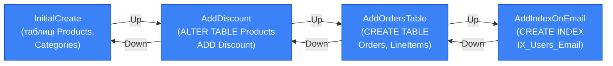

# Міграції в EF Core: Основи

## Проблема, яку вирішують міграції

Програмний продукт — живий організм. Він народжується з простою схемою: кілька таблиць, кілька стовпців. Але з кожним тижнем вимоги змінюються. Менеджер просить додати поле «знижка» до продукту. Аналітик хоче окремий журнал дій. Дизайнер вирішує що категорія має бути ієрархічною. Бізнес вимагає зберігати адреси доставки.

Кожна з цих змін означає зміну схеми бази даних. І тут виникає фундаментальне питання: **як синхронізувати код і базу даних на всіх середовищах** — локальній машині розробника, тестовому стенді, staging, production?

Це питання — не технічне, а архітектурне. І воно мало різні відповіді в різні епохи розробки ПЗ.

---

## Еволюція підходів до управління схемою

### Епоха ручних SQL-скриптів

У 2000-х роках найпоширеніший підхід виглядав так. DBA (Database Administrator) писав SQL-скрипт вручну. Розробники отримували його поштою або через файловий сервер. Хтось запускав на тестовому середовищі. Хтось забував. Хтось запускав двічі. Продакшн оновлювався «за вікном» з молитвою.

```sql
-- v1.2.3_add_discount_to_products.sql
-- Запустити ВРУЧНУ на prod перед деплоєм v1.2.3!
ALTER TABLE Products ADD Discount DECIMAL(5,2) NULL;
ALTER TABLE Products ADD DiscountType NVARCHAR(20) NULL;
-- Якщо вже запускали раніше — закоментуйте ці рядки!
```

Проблеми цього підходу очевидні з першого погляду:

**Відсутність версіонування**: Хто і коли запустив цей скрипт? Запускали його на конкретному середовищі чи ні? Немає записів — немає відповідей.

**Залежність від людини**: DBA може бути у відпустці. Розробник може забути запустити. Новий член команди не знає з якого скрипту починати.

**Ризик подвійного виконання**: `ALTER TABLE Products ADD Discount` упаде з помилкою якщо стовпець вже є. Доводиться додавати `IF NOT EXISTS` — і скрипт ускладнюється.

**Відсутність можливості відкоту**: Якщо деплой пішов шиворот-навиворіт — скрипт відкату треба також писати вручну. І він теж може мати помилки.

### Поява міграційних фреймворків

Приблизно в 2010-х з'явився новий клас інструментів — **міграційні фреймворки**. Їх ідея проста і геніальна: кожна зміна схеми — це пронумерований файл. Фреймворк сам відстежує які файли вже застосовано. Запустив команду — застосовуються лише нові, у правильному порядку, рівно один раз.

::card-group

::card{title="DbUp" icon="i-lucide-database"}

Мінімалістичний .NET-фреймворк. Ви пишете SQL-скрипти, DbUp виконує їх у правильному порядку і записує результат у таблицю. Немає магії — лише контрольована версіонованість SQL.

::

::card{title="Flyway" icon="i-lucide-bird"}

Java-інструмент (працює з .NET через CLI). Файли іменуються за конвенцією (`V1__init.sql`, `V2__add_discount.sql`). Потужний, enterprise-рівня, з підтримкою repair, validate, baseline.

::

::card{title="Liquibase" icon="i-lucide-layers"}

XML/YAML/JSON описи змін (changeset). Кросплатформений, підтримує генерацію SQL для різних СУБД. Ідеальний для database-first команд.

::

::card{title="EF Core Migrations" icon="i-lucide-code"}

Унікальний підхід: міграції генеруються **автоматично** з C# моделі. Не треба писати SQL вручну — EF Core порівнює поточну модель зі snapshot попередньої і сам формує потрібний DDL.

::

::

### Чим EF Core Migrations відрізняється від решти

Ключова відмінність EF Core Migrations — **автоматична генерація** змін. Ви не пишете SQL `ALTER TABLE` — ви змінюєте C# клас. EF Core сам визначає що змінилось в моделі, порівнює з збереженим snapshot і генерує міграцію.

Це дає величезну перевагу: розробник думає про **модель предметної області**, а не про DDL-синтаксис конкретної СУБД. Той самий C# код генерує правильний SQL для SQL Server, PostgreSQL або SQLite.

::note
**Коли обирати альтернативи**: DbUp/Flyway/Liquibase кращі коли ваша команда DBA-орієнтована і хоче повного контролю над SQL. EF Core Migrations кращі для developer-centric команд де модель міняється разом з кодом. Ці підходи не взаємовиключні — можна використовувати EF Core Migrations для автозгенерованих змін і `migrationBuilder.Sql()` для кастомних SQL-операцій.
::

---

## Концепція: що таке міграція

Перш ніж зануритись у команди, важливо зрозуміти що таке міграція концептуально.

**Міграція** — це опис **різниці між двома версіями схеми бази даних**. Вона має:

- **`Up()`** — операції для переходу до нової версії (додати таблицю, стовпець, індекс)
- **`Down()`** — операції для повернення до попередньої версії (відповідні DROP операції)
- **Метадані** — ім'я, timestamp, залежність від попередньої міграції

Набір міграцій формує **ланцюг**: кожна наступна міграція залежить від попередньої. Застосовуючи їх послідовно від початку — отримуємо актуальну схему. Скасовуючи у зворотному порядку — повертаємось до будь-якої попередньої версії.

::mermaid



::

**`__EFMigrationsHistory`** — спеціальна таблиця що EF Core автоматично створює у вашій базі. Вона зберігає список вже застосованих міграцій. Перед кожним `database update` — EF Core читає цю таблицю, порівнює з файлами міграцій і виконує лише ті що ще не застосовано.

---

## Налаштування інструментів

### Встановлення EF Core Tools

Міграції генеруються через CLI-інструмент `dotnet ef`. Він встановлюється як глобальний .NET-інструмент:

::terminal-preview{title="dotnet tool install"}

<div class="line"><span class="opacity-40">$</span> <strong>dotnet tool install --global dotnet-ef</strong></div>
<div class="line"><span class="text-green-400 font-bold">You can invoke the tool using the following command: dotnet-ef</span></div>
<div class="line">Tool 'dotnet-ef' (version '9.0.3') was successfully installed.</div>

::

Або як локальний інструмент проєкту (рекомендовано для команд):

::terminal-preview{title="dotnet tool manifest"}

<div class="line"><span class="opacity-40">$</span> <strong>dotnet new tool-manifest</strong></div>
<div class="line"><span class="text-blue-400 font-bold">The template "Dotnet local tool manifest file" was created successfully.</span></div>
<div class="line"></div>
<div class="line"><span class="opacity-40">$</span> <strong>dotnet tool install dotnet-ef</strong></div>
<div class="line">Tool 'dotnet-ef' (version '9.0.3') was successfully installed.</div>
<div class="line">Created: <span class="text-gray-400">.config/dotnet-tools.json</span></div>

::

Переваги локального інструменту: версія зафіксована у `.config/dotnet-tools.json` → всі члени команди використовують одну версію → відтворюваність CI/CD.

### Необхідні NuGet-пакети

```xml
<!-- YourProject.csproj -->
<ItemGroup>
  <!-- EF Core для вашого провайдера -->
  <PackageReference Include="Microsoft.EntityFrameworkCore.SqlServer" Version="9.0.*" />

  <!-- АБО PostgreSQL: -->
  <!-- <PackageReference Include="Npgsql.EntityFrameworkCore.PostgreSQL" Version="9.0.*" /> -->

  <!-- Design-time пакет: ЛИШЕ для проєкту де є DbContext -->
  <!-- Потрібен для dotnet ef команд, не потрапляє в runtime -->
  <PackageReference Include="Microsoft.EntityFrameworkCore.Design" Version="9.0.*">
    <PrivateAssets>all</PrivateAssets>
    <IncludeAssets>runtime; build; native; contentfiles; analyzers</IncludeAssets>
  </PackageReference>
</ItemGroup>
```

::warning
**`Microsoft.EntityFrameworkCore.Design`** — обов'язковий для CLI-команд. Без нього `dotnet ef migrations add` завершиться з помилкою `No DbContext was found`. Атрибут `<PrivateAssets>all</PrivateAssets>` гарантує що пакет не потрапить у публіковану збірку.
::

---

## dotnet ef migrations add: перша міграція

Давайте пройдемо весь процес від початку. Маємо просту модель:

```csharp
public class Product
{
    public int     Id         { get; set; }
    public string  Name       { get; set; } = string.Empty;
    public decimal Price      { get; set; }
    public int     CategoryId { get; set; }
    public Category Category  { get; set; } = null!;
}

public class Category
{
    public int     Id       { get; set; }
    public string  Name     { get; set; } = string.Empty;
    public ICollection<Product> Products { get; set; } = new List<Product>();
}

public class AppDbContext : DbContext
{
    public DbSet<Product>  Products   => Set<Product>();
    public DbSet<Category> Categories => Set<Category>();

    protected override void OnConfiguring(DbContextOptionsBuilder options)
        => options.UseSqlServer("Server=.;Database=ShopDb;Trusted_Connection=True");
}
```

Виконуємо першу міграцію:

::terminal-preview{title="dotnet ef migrations add InitialCreate"}

<div class="line"><span class="opacity-40">$</span> <strong>dotnet ef migrations add InitialCreate</strong></div>
<div class="line"><span class="text-blue-400">Build started...</span></div>
<div class="line"><span class="text-green-400 font-bold">Build succeeded.</span></div>
<div class="line">Done. To undo this action, use '<span class="text-yellow-400">ef migrations remove</span>'</div>

::

Що відбулось «під капотом»:

::steps

### Збірка проєкту

`dotnet ef` збирає проєкт щоб отримати актуальну версію вашої C# моделі. Без цього він не знатиме який «поточний стан» моделі.

### Зчитування ModelSnapshot

Якщо це не перша міграція — читає файл `Migrations/AppDbContextModelSnapshot.cs` який описує **попередній стан** моделі. Якщо snapshot ще не існує — вважає що попередній стан «пустий».

### Порівняння моделей

EF Core порівнює поточну C# модель зі snapshot і визначає **різницю**: нові таблиці, нові стовпці, змінені типи, нові індекси.

### Генерація файлів

Створює два файли:
- `Migrations/{timestamp}_{Name}.cs` — сам файл міграції (Up + Down)
- `Migrations/AppDbContextModelSnapshot.cs` — **оновлений** snapshot поточного стану

::

Результат — три нових файли у папці `Migrations/`:

```
Migrations/
├── 20250329120000_InitialCreate.cs          ← файл міграції
├── 20250329120000_InitialCreate.Designer.cs ← метадані (не редагувати!)
└── AppDbContextModelSnapshot.cs             ← snapshot поточного стану моделі
```

---

## Анатомія файлу міграції

Відкриємо згенерований файл і розберемо кожен елемент:

```csharp
// 20250329120000_InitialCreate.cs
using Microsoft.EntityFrameworkCore.Migrations;

#nullable disable

namespace YourApp.Migrations
{
    /// <inheritdoc />
    public partial class InitialCreate : Migration   // ← клас успадковує Migration
    {
        /// <inheritdoc />
        protected override void Up(MigrationBuilder migrationBuilder)  // Up: → нова версія
        {
            // CREATE TABLE Categories
            migrationBuilder.CreateTable(
                name: "Categories",
                columns: table => new
                {
                    Id   = table.Column<int>(type: "int", nullable: false)
                               .Annotation("SqlServer:Identity", "1, 1"),  // IDENTITY(1,1)
                    Name = table.Column<string>(type: "nvarchar(max)", nullable: false)
                },
                constraints: table =>
                {
                    table.PrimaryKey("PK_Categories", x => x.Id);
                });

            // CREATE TABLE Products (залежить від Categories — тому після!)
            migrationBuilder.CreateTable(
                name: "Products",
                columns: table => new
                {
                    Id         = table.Column<int>(type: "int", nullable: false)
                                     .Annotation("SqlServer:Identity", "1, 1"),
                    Name       = table.Column<string>(type: "nvarchar(max)", nullable: false),
                    Price      = table.Column<decimal>(type: "decimal(18,2)", nullable: false),
                    CategoryId = table.Column<int>(type: "int", nullable: false)
                },
                constraints: table =>
                {
                    table.PrimaryKey("PK_Products", x => x.Id);
                    table.ForeignKey(             // FOREIGN KEY
                        name:       "FK_Products_Categories_CategoryId",
                        column:     x => x.CategoryId,
                        principalTable: "Categories",
                        principalColumn: "Id",
                        onDelete:   ReferentialAction.Cascade);
                });

            // CREATE INDEX на FK стовпці (EF Core робить це автоматично)
            migrationBuilder.CreateIndex(
                name:    "IX_Products_CategoryId",
                table:   "Products",
                column:  "CategoryId");
        }

        /// <inheritdoc />
        protected override void Down(MigrationBuilder migrationBuilder)  // Down: ← попередня версія
        {
            // DROP TABLE у зворотному порядку (спочатку залежні!)
            migrationBuilder.DropTable(name: "Products");
            migrationBuilder.DropTable(name: "Categories");
        }
    }
}
```

### BuildTargetModel у Designer файлі

Файл `{Name}.Designer.cs` — автоматично згенерований і **ніколи не редагується вручну**. Він містить `BuildTargetModel` — повний опис моделі **станом на цю конкретну міграцію**. EF Core використовує його для:

- Верифікації що поточна міграція відповідає поточній моделі
- Визначення якою була модель на будь-якому конкретному кроці

```csharp
// 20250329120000_InitialCreate.Designer.cs (фрагмент)
[DbContext(typeof(AppDbContext))]
[Migration("20250329120000_InitialCreate")]
partial class InitialCreate
{
    protected override void BuildTargetModel(ModelBuilder modelBuilder)
    {
        modelBuilder
            .HasAnnotation("ProductVersion", "9.0.3")
            .HasAnnotation("Relational:MaxIdentifierLength", 128);

        modelBuilder.Entity("YourApp.Category", b =>
        {
            b.Property<int>("Id").ValueGeneratedOnAdd()...;
            b.Property<string>("Name").IsRequired()...;
            b.HasKey("Id");
            b.ToTable("Categories");
        });

        // ... опис Products entity
    }
}
```

---

## ModelSnapshot: серце системи міграцій

`AppDbContextModelSnapshot.cs` — **найважливіший файл** у папці Migrations. Він зберігає повний опис поточного стану моделі що EF Core «пам'ятає». Саме з цим файлом порівнюється ваша C# модель при кожному `migrations add`.

```csharp
// AppDbContextModelSnapshot.cs
[DbContext(typeof(AppDbContext))]
partial class AppDbContextModelSnapshot : ModelSnapshot
{
    protected override void BuildModel(ModelBuilder modelBuilder)
    {
        // Повне описання ПОТОЧНОГО стану всієї моделі:
        // - всі entity
        // - всі властивості з типами
        // - всі зв'язки
        // - всі індекси
        // - всі обмеження
        // Це «фотографія» того, як EF Core розуміє вашу поточну схему БД
    }
}
```

### Чому ModelSnapshot не можна видаляти

Видалення або пошкодження `ModelSnapshot` призведе до катастрофи:

1. EF Core не знатиме що вже є у «попередньому стані»
2. При наступному `migrations add` — згенерує міграцію що намагається створити ВСІ таблиці знову
3. `database update` впаде з помилкою «таблиця вже існує»

**ModelSnapshot — єдине джерело правди про попередній стан моделі**. Він має бути у системі контролю версій (Git) і ніколи не редагуватись вручну.

::caution
**Конфлікти злиття у ModelSnapshot**: При паралельній розробці двох гілок що обидві додають міграції — виникне Git merge conflict у `ModelSnapshot`. Це нормально і очікувано. Вирішення: після merge вручну запустити `dotnet ef migrations add` для синхронізації. Або використовувати `dotnet ef migrations bundle` для CI/CD.
::

### Внутрішнє порівняння моделей

Коли ви виконуєте `dotnet ef migrations add MyMigration`:

```
Поточна C# модель (рефлексія)
        ↓
[EF Core Model Builder]
        ↓
Поточна EF модель (IMutableModel)
        ↓
[Порівняємо з]
        ↓
ModelSnapshot (попередній стан)
        ↓
[MigrationsModelDiffer]
        ↓
Список операцій: [AddColumn, CreateTable, CreateIndex, ...]
        ↓
[C# Code Generator]
        ↓
Файл міграції (Up + Down)
        Оновлений ModelSnapshot
```

`MigrationsModelDiffer` — внутрішній клас EF Core що виконує семантичне порівняння двох моделей. Він розуміє не просто «поле зникло» — а «стовпець перейменовано» (якщо змінилось `[Column]`), «тип змінено» (якщо `string` став `nvarchar(100)`).

---

## dotnet ef database update: застосування міграцій

Після створення міграції — час застосувати її до реальної бази:

::terminal-preview{title="database update"}

<div class="line"><span class="opacity-40">$</span> <strong>dotnet ef database update</strong></div>
<div class="line"><span class="text-blue-400">Build started...</span></div>
<div class="line"><span class="text-green-400 font-bold">Build succeeded.</span></div>
<div class="line">info: Microsoft.EntityFrameworkCore.Database.Command[20101]</div>
<div class="line">      Executed DbCommand (15ms) [Parameters=[], CommandType='Text']</div>
<div class="line">      <span class="text-gray-400">SELECT OBJECT_ID(N'[__EFMigrationsHistory]')</span></div>
<div class="line">info: Microsoft.EntityFrameworkCore.Migrations[20402]</div>
<div class="line">      Applying migration '<span class="text-yellow-400">20250329120000_InitialCreate</span>'</div>
<div class="line"><span class="text-green-400 font-bold">Done.</span></div>

::

Що відбувається послідовно:

::steps

### Перевірка __EFMigrationsHistory

EF Core виконує `SELECT OBJECT_ID('[__EFMigrationsHistory]')` — чи існує таблиця. Якщо ні — створює її автоматично.

### Читання застосованих міграцій

`SELECT MigrationId FROM __EFMigrationsHistory` — отримує список вже виконаних міграцій.

### Порівняння з файлами

Порівнює список у БД з файлами у папці `Migrations/`. Визначає які файли ще не застосовані.

### Виконання Up()

Для кожної нової міграції (у хронологічному порядку) виконує `Up()` методи у **транзакції**.

### Запис у __EFMigrationsHistory

Після успішного виконання кожної міграції — додає запис у таблицю: `INSERT INTO __EFMigrationsHistory VALUES ('20250329120000_InitialCreate', '9.0.3')`.

::

### Застосування конкретної міграції

```bash
# Застосувати до конкретної міграції (не обов'язково останньої)
dotnet ef database update AddDiscount

# Повернутись до конкретної міграції (виконає Down() для наступних)
dotnet ef database update InitialCreate

# Повністю скасувати всі міграції (виконає Down() для всіх)
dotnet ef database update 0
```

::warning
`dotnet ef database update 0` виконає `Down()` для **всіх** міграцій — видалить усі таблиці! Використовуйте лише у dev-середовищі для скидання схеми.
::

---

## Друга міграція: зміна моделі

Додамо нове поле до Product:

```csharp
public class Product
{
    public int     Id          { get; set; }
    public string  Name        { get; set; } = string.Empty;
    public decimal Price       { get; set; }
    public int     CategoryId  { get; set; }
    public Category Category   { get; set; } = null!;

    // Нові поля:
    public decimal? Discount   { get; set; }   // nullable → NULL у БД
    public bool     IsActive   { get; set; } = true; // default value
    public DateTime CreatedAt  { get; set; }
}
```

Генеруємо міграцію:

::terminal-preview{title="migrations add AddProductFields"}

<div class="line"><span class="opacity-40">$</span> <strong>dotnet ef migrations add AddProductFields</strong></div>
<div class="line"><span class="text-blue-400">Build started...</span></div>
<div class="line"><span class="text-green-400 font-bold">Build succeeded.</span></div>
<div class="line">Done. To undo this action, use '<span class="text-yellow-400">ef migrations remove</span>'</div>

::

Згенерований файл буде містити:

```csharp
protected override void Up(MigrationBuilder migrationBuilder)
{
    migrationBuilder.AddColumn<decimal>(
        name:      "Discount",
        table:     "Products",
        type:      "decimal(18,2)",
        nullable:  true);         // ← nullable: true, бо decimal?

    migrationBuilder.AddColumn<bool>(
        name:         "IsActive",
        table:        "Products",
        type:         "bit",
        nullable:     false,
        defaultValue: false);    // ← default false, EF Core додасть для існуючих рядків

    migrationBuilder.AddColumn<DateTime>(
        name:     "CreatedAt",
        table:    "Products",
        type:     "datetime2",
        nullable: false,
        defaultValue: new DateTime(1, 1, 1, 0, 0, 0, 0, DateTimeKind.Unspecified));
}

protected override void Down(MigrationBuilder migrationBuilder)
{
    migrationBuilder.DropColumn(name: "Discount",  table: "Products");
    migrationBuilder.DropColumn(name: "IsActive",  table: "Products");
    migrationBuilder.DropColumn(name: "CreatedAt", table: "Products");
}
```

---

## Remove vs Revert: скасування міграцій

Є два різних поняття «скасувати міграцію»:

### dotnet ef migrations remove: видалити ФАЙЛ міграції

`remove` — видаляє **останню** згенеровану міграцію (файл .cs та .Designer.cs) і відновлює ModelSnapshot до попереднього стану. Використовується коли ви зробили помилку у моделі і хочете починати знову.

::terminal-preview{title="migrations remove"}

<div class="line"><span class="opacity-40">$</span> <strong>dotnet ef migrations remove</strong></div>
<div class="line"><span class="text-blue-400">Build started...</span></div>
<div class="line"><span class="text-green-400 font-bold">Build succeeded.</span></div>
<div class="line">Removing migration '<span class="text-yellow-400">20250329130000_AddProductFields</span>'.</div>
<div class="line">Reverting snapshot.</div>
<div class="line">Done.</div>

::

::caution
`migrations remove` **не виконує `Down()`** міграції у базі! Він лише видаляє файл. Якщо міграцію вже застосовано до БД (`database update`), спочатку потрібно відкотити БД: `dotnet ef database update {PreviousMigration}`, і тільки потім `migrations remove`.
::

### dotnet ef database update {previous}: відкат БД

Щоб відкотити **вже застосовану** міграцію у базі — вказуємо ім'я міграції до якої хочемо повернутись:

```bash
# Повернутись до стану після InitialCreate (виконає Down() для AddProductFields)
dotnet ef database update InitialCreate
```

::terminal-preview{title="database update InitialCreate"}

<div class="line"><span class="opacity-40">$</span> <strong>dotnet ef database update InitialCreate</strong></div>
<div class="line"><span class="text-blue-400">Build started...</span></div>
<div class="line"><span class="text-green-400 font-bold">Build succeeded.</span></div>
<div class="line">info: Reverting migration '<span class="text-yellow-400">20250329130000_AddProductFields</span>'.</div>
<div class="line"><span class="text-green-400 font-bold">Done.</span></div>

::

Таблиця порівняння:

| Команда | Що робить | Зі змінами у БД | Без змін у БД |
|---|---|---|---|
| `migrations remove` | Видаляє файл міграції | ❌ Помилка | ✅ Так |
| `database update {prev}` | Виконує Down() у БД | ✅ Так | ❌ Нічого не робить |

### Повний workflow скасування

```bash
# 1. Відкотити БД до попередньої міграції
dotnet ef database update InitialCreate

# 2. Видалити файл міграції що не потрібен
dotnet ef migrations remove

# 3. Виправити модель і створити нову правильну міграцію
# ... (змінили C# клас) ...
dotnet ef migrations add AddProductFieldsFixed
dotnet ef database update
```

---

## Іменування міграцій

Ім'я міграції — не технічна деталь, а **документація вашої схеми**. Хороше ім'я через 2 роки пояснить колезі чому ця зміна відбулась.

::tabs

::tabs-item{label="✅ Хороше іменування"}

```bash
dotnet ef migrations add InitialCreate
dotnet ef migrations add AddDiscountToProducts
dotnet ef migrations add CreateOrdersAndLineItemsTables
dotnet ef migrations add AddUniqueIndexOnUserEmail
dotnet ef migrations add RenameProductDescriptionColumn
dotnet ef migrations add AddSoftDeleteToProducts
dotnet ef migrations add CreateAuditLogTable
```

::

::tabs-item{label="❌ Погане іменування"}

```bash
dotnet ef migrations add Migration1
dotnet ef migrations add Update
dotnet ef migrations add Fix
dotnet ef migrations add test123
dotnet ef migrations add ChangesSomeStuff
dotnet ef migrations add v2
```

::

::

Хороше ім'я міграції має відповідати на питання: **«що саме змінено у схемі?»**

---

## Перегляд списку міграцій

```bash
# Список всіх міграцій та їх статус (Applied/Pending)
dotnet ef migrations list
```

::terminal-preview{title="migrations list"}

<div class="line"><span class="opacity-40">$</span> <strong>dotnet ef migrations list</strong></div>
<div class="line"><span class="text-green-400 font-bold">20250101000000_InitialCreate</span> (Applied)</div>
<div class="line"><span class="text-green-400 font-bold">20250215083012_AddDiscountToProducts</span> (Applied)</div>
<div class="line"><span class="text-green-400 font-bold">20250301141523_CreateOrdersTable</span> (Applied)</div>
<div class="line"><span class="text-yellow-400 font-bold">20250329120000_AddAuditLog</span> (Pending) ← ще не застосована</div>

::

---

## Практичні завдання (Частина 1)

### Рівень 1 — Базовий

::steps

### Завдання 1.1: Перша міграція з нуля

Створіть новий проєкт з `AppDbContext` що містить `Product`, `Category`, `Tag` (many-to-many через implicit join). Виконайте:
1. `dotnet ef migrations add InitialCreate` — перевірте згенерований файл
2. Відкрийте `.Designer.cs` — знайдіть `BuildTargetModel` і прочитайте опис моделі
3. `dotnet ef database update` — перевірте `__EFMigrationsHistory` через SSMS/psql
4. Додайте поле `Description` до Product → нова міграція → update

### Завдання 1.2: Lifecycle міграцій

Для вашого проєкту відпрацюйте повний cycle:
1. Додайте `CreatedAt`/`UpdatedAt` до Product → `migrations add AddAuditFields`
2. `database update` → перевірте стовпці у БД
3. Передумали: хочемо `Timestamp` замість двох полів:
   - `database update InitialCreate` (відкат)
   - `migrations remove` (видалити файл)
   - Змінити модель → `migrations add AddTimestampToProduct`
   - `database update`

### Завдання 1.3: Дослідження ModelSnapshot

Відкрийте `AppDbContextModelSnapshot.cs`:
1. Знайдіть всі entity — чи відповідають вони вашим C# класам?
2. Знайдіть де описані FK-зв'язки (HasOne, WithMany)
3. Знайдіть де описані індекси що EF Core додав автоматично
4. Додайте новий entity → `migrations add` → знайдіть де snapshot оновився

::

### Рівень 2 — Логіка

::steps

### Завдання 2.1: Розуміння Up/Down симетрії

Для кожної операції в `Up()` перевірте що `Down()` є коректним зворотнім:
1. `CreateTable` → `DropTable` з правильним порядком (залежні першими у Down)
2. `AddColumn` NOT NULL без default → `DropColumn` у Down. Питання: що станеться з існуючими рядками при AddColumn NOT NULL?
3. `CreateIndex` → `DropIndex`
4. Навмисно зіпсуйте `Down()` — що станеться при `database update {previous}`?

### Завдання 2.2: Conflict resolution у Git

Симулюйте командний конфлікт:
1. Гілка `feature/discount`: додає `Discount` до Product → міграція
2. Гілка `feature/tags`: додає `Tag` entity → міграція
3. Зробіть merge — виникне конфлікт у ModelSnapshot
4. Вирішіть конфлікт: відновіть ModelSnapshot вручну (або через `migrations add` після merge)

::

### Рівень 3 — Архітектура

::steps

### Завдання 3.1: Custom Migration компонент

Реалізуйте `MigrationHealthCheck : IHealthCheck` що:
1. Перевіряє чи є `Pending` міграції (`context.Database.GetPendingMigrationsAsync()`)
2. `Healthy` якщо Pending = 0, `Degraded` якщо є Pending міграції
3. Реєструє через `services.AddHealthChecks().AddCheck<MigrationHealthCheck>("migrations")`
4. Логує список Pending міграцій при Degraded

::

---

## Підсумок частини 1

Перша частина заклала повний концептуальний фундамент міграцій:

- **Проблема схема-еволюції**: без версіонування — хаос ручних скриптів, залежність від людини, неможливість відкату
- **Альтернативи**: DbUp (ручний SQL), Flyway (конвенційні файли), Liquibase (XML/YAML). EF Core унікальний — **автогенерація** з C# моделі
- **Концепція**: міграція = Up (нова версія) + Down (відкат). `__EFMigrationsHistory` = таблиця-журнал застосованих міграцій
- **`dotnet ef migrations add`**: збирає проєкт → читає snapshot → порівнює → генерує Up/Down + оновлює snapshot
- **Анатомія файлу**: `Up()` і `Down()` методи, `CreateTable/AddColumn/CreateIndex` операції. `.Designer.cs` з `BuildTargetModel` — не редагувати!
- **ModelSnapshot**: «фотографія» поточного стану. Не видаляти! Конфлікти злиття — нормально, вирішуються вручну
- **`database update`**: читає `__EFMigrationsHistory` → знаходить Pending → виконує `Up()` у транзакції → записує у журнал
- **Remove vs Revert**: `migrations remove` = видалити файл (не торкає БД). `database update {prev}` = виконати `Down()` у БД

[У другій частині](/csharp/ef-core/23.migrations-basics-part2) — SQL-скрипти для production deployment, Idempotent Scripts (`--idempotent`), Migrations Bundles для автономного виконання, та стратегії автоматичного застосування міграцій у CI/CD pipelines.

---

## Додаткові ресурси

- [EF Core Migrations — офіційна документація](https://learn.microsoft.com/en-us/ef/core/managing-schemas/migrations/)
- [dotnet ef CLI reference](https://learn.microsoft.com/en-us/ef/core/cli/dotnet)
- [DbUp — альтернатива](https://dbup.readthedocs.io/)
- [Flyway — Java migration tool](https://flywaydb.org/documentation/)
