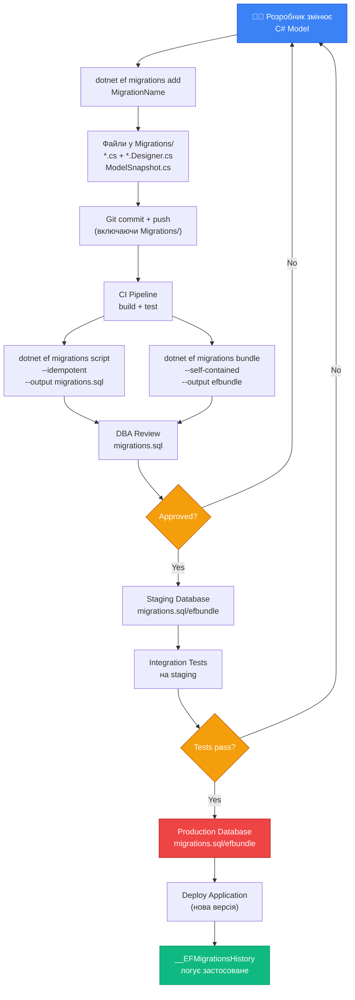

# Міграції в EF Core: SQL-скрипти, Bundles та CI/CD

> Це продовження статті [«Міграції: Основи (Частина 1)»](/csharp/ef-core/23.migrations-basics-part1). Читайте послідовно.

---

## Чому `database update` не підходить для production

У першій частині ми використовували `dotnet ef database update` — зручна команда для розробки. Але для production-середовища вона має принципові обмеження.

**Перша проблема: вона потребує `dotnet ef` tools на сервері**. Виробничі сервери зазвичай мінімальні — там немає SDK, немає dev-tools, і так і повинно бути. Встановлення `dotnet ef tools` на prod-сервер — антипатерн з міркувань безпеки і управляємося (хто відповідає за версійність інструментів?).

**Друга проблема: підключення до бази даних**. `database update` потребує прямого підключення до БД. Але prod-база часто захищена VPN, firewall, і доступна лише через bastion host або спеціалізований deployment агент.

**Третя проблема: права доступу**. Application user (обліковий запис що використовує ваш застосунок) має мінімальні права: SELECT, INSERT, UPDATE, DELETE для конкретних таблиць. `ALTER TABLE`, `CREATE TABLE` виконуються окремим migration user з ширшими правами. Змішування цих ролей — загроза безпеці.

**Четверта проблема: аудит і контроль**. В enterprise-середовищах кожна зміна схеми БД має бути схвалена DBA, залогована, перевірена. Команда `database update` робить це «за лаштунками» — жодного SQL-файлу для review.

Саме тому для production існують два офіційних підходи: **SQL-скрипти** і **Migrations Bundles**.

---

## dotnet ef migrations script: SQL-скрипти для production

Команда `migrations script` генерує SQL-файл з усіма DDL-операціями що відповідають вашим міграціям. Цей файл можна:

- передати DBA для review і схвалення
- виконати через стандартні DB-інструменти (SSMS, psql, Azure Data Studio)
- включити у CI/CD pipeline як артефакт
- зберегти в репозиторії поряд з кодом

### Базове використання

::terminal-preview{title="migrations script"}

<div class="line"><span class="opacity-40">$</span> <strong>dotnet ef migrations script --output migrations.sql</strong></div>
<div class="line"><span class="text-blue-400">Build started...</span></div>
<div class="line"><span class="text-green-400 font-bold">Build succeeded.</span></div>
<div class="line">Writing SQL script to '<span class="text-yellow-400">migrations.sql</span>'...</div>
<div class="line"><span class="text-green-400 font-bold">Done.</span></div>

::

Згенерований `migrations.sql` без додаткових флагів містить **всі** міграції від початку:

```sql
IF OBJECT_ID(N'[__EFMigrationsHistory]') IS NULL
BEGIN
    CREATE TABLE [__EFMigrationsHistory] (
        [MigrationId] nvarchar(150) NOT NULL,
        [ProductVersion] nvarchar(32) NOT NULL,
        CONSTRAINT [PK___EFMigrationsHistory] PRIMARY KEY ([MigrationId])
    );
END;
GO

BEGIN TRANSACTION;

CREATE TABLE [Categories] (
    [Id]   int           NOT NULL IDENTITY,
    [Name] nvarchar(max) NOT NULL,
    CONSTRAINT [PK_Categories] PRIMARY KEY ([Id])
);
GO

CREATE TABLE [Products] (
    [Id]         int             NOT NULL IDENTITY,
    [Name]       nvarchar(max)   NOT NULL,
    [Price]      decimal(18,2)   NOT NULL,
    [CategoryId] int             NOT NULL,
    CONSTRAINT [PK_Products] PRIMARY KEY ([Id]),
    CONSTRAINT [FK_Products_Categories_CategoryId] FOREIGN KEY ([CategoryId])
        REFERENCES [Categories] ([Id]) ON DELETE CASCADE
);
GO

-- ... більше DDL ...

INSERT INTO [__EFMigrationsHistory] ([MigrationId], [ProductVersion])
VALUES (N'20250329120000_InitialCreate', N'9.0.3');
GO
COMMIT;
GO
```

Зверніть увагу: скрипт обгортає кожну міграцію у `BEGIN TRANSACTION; ... COMMIT;`. Якщо DDL операція провалиться — транзакція відкочується.

### Скрипт від конкретної міграції до конкретної

```bash
# Скрипт від конкретної міграції (FROM) до іншої (TO)
dotnet ef migrations script AddDiscountToProducts AddAuditLog --output delta.sql

# Синтаксис:
# dotnet ef migrations script [FROM] [TO] [опції]
# FROM: назва початкової міграції (не включається у скрипт, є базою)
# TO:   назва кінцевої міграції (включається)
```

Це дозволяє генерувати **delta-скрипти** — тільки зміни між двома версіями. Ідеально для incremental deployment:

```bash
# У CI: генерація скрипту від поточної версії prod до нової
CURRENT_MIGRATION=$(dotnet ef migrations list | grep Applied | tail -1 | awk '{print $1}')
dotnet ef migrations script $CURRENT_MIGRATION --output release-delta.sql
```

---

## Idempotent Scripts: --idempotent

Стандартний SQL-скрипт **не можна запустити двічі** — він впаде з помилкою `Table already exists`. Це проблема у багатьох сценаріях:

- Ви не знаєте яку версію має prod-база
- Хочете один скрипт що сам визначить що вже застосовано
- Потрібна можливість повторного запуску без ризику

`--idempotent` вирішує це:

```bash
dotnet ef migrations script --idempotent --output idempotent-migrations.sql
```

Згенерований файл для кожної міграції включає перевірку:

```sql
IF NOT EXISTS (
    SELECT * FROM [__EFMigrationsHistory]
    WHERE [MigrationId] = N'20250329120000_InitialCreate'
)
BEGIN
    -- DDL операції першої міграції
    CREATE TABLE [Categories] ( ... );
    CREATE TABLE [Products] ( ... );

    INSERT INTO [__EFMigrationsHistory] ([MigrationId], [ProductVersion])
    VALUES (N'20250329120000_InitialCreate', N'9.0.3');
END;
GO

IF NOT EXISTS (
    SELECT * FROM [__EFMigrationsHistory]
    WHERE [MigrationId] = N'20250329130000_AddProductFields'
)
BEGIN
    -- DDL операції другої міграції
    ALTER TABLE [Products] ADD [Discount] decimal(18,2) NULL;
    ALTER TABLE [Products] ADD [IsActive] bit NOT NULL DEFAULT CAST(0 AS bit);

    INSERT INTO [__EFMigrationsHistory] ([MigrationId], [ProductVersion])
    VALUES (N'20250329130000_AddProductFields', N'9.0.3');
END;
GO
```

Цей скрипт можна запускати скільки завгодно разів — повторні запуски не будуть виконувати вже застосовані блоки.

::tip
**Коли використовувати idempotent**: якщо у вашому deployment pipeline один і той самий скрипт може виконуватись для баз з різним migration state (наприклад, нова база + існуюча база). Або коли DBA хоче запускати скрипт «безпечно» не знаючи поточного стану.
::

---

## Migrations Bundle: self-contained виконуваний файл

Migrations Bundle — відносно новий підхід (EF Core 6+) що вирішує інший набір проблем. Bundle — це **самостійний виконуваний файл** що містить всі міграції і може застосувати їх без `dotnet ef` tools, без вихідного коду, без .NET SDK.

Уявіть: ви публікуєте нову версію застосунку у Docker. Поряд з образом AppService — образ MigrationRunner. Він запускається один раз при деплої, застосовує потрібні міграції і завершується. Ніяких `dotnet ef` на сервері.

### Створення Bundle

```bash
# Базовий bundle (для поточної платформи)
dotnet ef migrations bundle --output efbundle

# Для Linux (у Windows CI для деплою на Linux):
dotnet ef migrations bundle \
    --target-runtime linux-x64 \
    --output efbundle-linux

# Self-contained: включає .NET runtime, не потребує встановленого .NET
dotnet ef migrations bundle \
    --self-contained \
    --target-runtime linux-x64 \
    --output efbundle-selfcontained
```

::terminal-preview{title="migrations bundle"}

<div class="line"><span class="opacity-40">$</span> <strong>dotnet ef migrations bundle --output efbundle --self-contained</strong></div>
<div class="line"><span class="text-blue-400">Build started...</span></div>
<div class="line"><span class="text-green-400 font-bold">Build succeeded.</span></div>
<div class="line">Building bundle...</div>
<div class="line"><span class="text-green-400 font-bold">Done. Migrations Bundle: efbundle</span></div>

::

### Виконання Bundle

```bash
# Базовий запуск (використовує connection string з конфігурації)
./efbundle

# З явним connection string
./efbundle --connection "Server=prod-server;Database=ShopDb;..."

# Застосувати до конкретної міграції
./efbundle --target AddDiscountToProducts

# Verbose output (для діагностики)
./efbundle --verbose
```

::terminal-preview{title="efbundle execution"}

<div class="line"><span class="opacity-40">$</span> <strong>./efbundle --verbose</strong></div>
<div class="line">info: Microsoft.EntityFrameworkCore.Database.Connection[20000]</div>
<div class="line">      Opening connection to database 'ShopDb'</div>
<div class="line">info: Microsoft.EntityFrameworkCore.Migrations[20402]</div>
<div class="line">      Applying migration '<span class="text-yellow-400">20250329130000_AddProductFields</span>'</div>
<div class="line">info: Microsoft.EntityFrameworkCore.Database.Command[20101]</div>
<div class="line">      Executed DbCommand (8ms): ALTER TABLE [Products] ADD [Discount] decimal(18,2) NULL</div>
<div class="line"><span class="text-green-400 font-bold">Done.</span></div>

::

### Bundle у Docker

Типовий Dockerfile для migration runner:

```dockerfile
# Dockerfile.migrations
FROM mcr.microsoft.com/dotnet/runtime-deps:9.0 AS final
WORKDIR /app

# Копіюємо self-contained bundle
COPY ./efbundle-linux ./efbundle
RUN chmod +x ./efbundle

# Запускаємо bundle як ENTRYPOINT
ENTRYPOINT ["./efbundle", "--verbose"]
```

```yaml
# docker-compose.yml: migration runner запускається перед app
services:
  migrations:
    build:
      context: .
      dockerfile: Dockerfile.migrations
    environment:
      - ConnectionStrings__DefaultConnection=${DB_CONNECTION}
    depends_on:
      db:
        condition: service_healthy

  app:
    build: .
    depends_on:
      migrations:
        condition: service_completed_successfully  # чекає завершення migrations
```

::note
Bundle — це compile-time артефакт. Якщо ви додаєте нову міграцію, потрібно перезбирати bundle. Включіть `dotnet ef migrations bundle` у CI/CD pipeline поряд зі zbіркою основного застосунку.
::

---

## Міграції в CI/CD: стратегії

Існують три основних стратегії застосування міграцій у CI/CD. Вибір залежить від вашої інфраструктури, команди і вимог безпеки.

### Стратегія 1: Program-time Migrations (Database.MigrateAsync)

Найпростіша стратегія: застосунок сам застосовує міграції при запуску. Це відбувається програматично через `Database.MigrateAsync()`:

```csharp
// Program.cs — застосувати міграції при старті
var app = builder.Build();

// Застосувати пендинг міграції перед запуском застосунку
using (var scope = app.Services.CreateScope())
{
    var context = scope.ServiceProvider.GetRequiredService<AppDbContext>();

    // MigrateAsync = database update у коді
    // Безпечно: якщо нема pending міграцій — нічого не робить
    await context.Database.MigrateAsync();
}

await app.RunAsync();
```

**Переваги:**
- Нульова складність DevOps
- Автоматично: нова версія деплоїться → міграції застосовуються
- Ідеально для малих команд і швидкого MVP

**Недоліки:**
- Застосунок стартує із правами міграційного user → broader permissions у runtime
- При horizontal scaling (N екземплярів) всі N намагаються мігрувати одночасно
- Немає review DBA

**Захист від concurrent migrations при горизонтальному масштабуванні:**

```csharp
// Distributed lock перед MigrateAsync
using (var scope = app.Services.CreateScope())
{
    var context = scope.ServiceProvider.GetRequiredService<AppDbContext>();
    var logger  = scope.ServiceProvider.GetRequiredService<ILogger<Program>>();

    // Отримати advisory lock (PostgreSQL) або sp_getapplock (SQL Server)
    await using var tx = await context.Database.BeginTransactionAsync();

    try
    {
        // PostgreSQL: pg_try_advisory_lock повертає true лише для одного процесу
        var lockAcquired = await context.Database
            .ExecuteSqlRawAsync("SELECT pg_try_advisory_lock(12345)");

        if (lockAcquired == 1)
        {
            logger.LogInformation("Migration lock acquired, running migrations...");
            await context.Database.MigrateAsync();
            logger.LogInformation("Migrations completed.");
        }
        else
        {
            logger.LogInformation("Another instance is migrating, waiting...");
            // Чекаємо поки інший інстанс завершить
            await WaitForMigrationsAsync(context);
        }

        await tx.CommitAsync();
    }
    catch (Exception ex)
    {
        logger.LogError(ex, "Migration failed");
        throw; // Не запускати застосунок з несумісною схемою!
    }
}
```

### Стратегія 2: Deployment Job (Kubernetes Job / Init Container)

У Kubernetes-оточенні найприродніша стратегія — окремий Job що виконується перед деплоєм pod-ів застосунку:

```yaml
# migrations-job.yaml
apiVersion: batch/v1
kind: Job
metadata:
  name: db-migrations-v2-1-0   # версія застосунку у назві Job
spec:
  template:
    spec:
      containers:
        - name: migrations
          image: myapp/migrations:2.1.0   # той самий образ що і app, але з ENTRYPOINT efbundle
          env:
            - name: ConnectionStrings__DefaultConnection
              valueFrom:
                secretKeyRef:
                  name: db-credentials
                  key: connection-string
          command: ["./efbundle", "--verbose"]
      restartPolicy: Never
  backoffLimit: 3  # 3 спроби при невдачі
```

```yaml
# deployment.yaml: App Deployment залежить від Job completion
apiVersion: apps/v1
kind: Deployment
metadata:
  name: myapp
spec:
  # ... spec
  template:
    spec:
      initContainers:
        - name: wait-for-migrations
          image: bitnami/kubectl:latest
          # Чекаємо поки migration Job завершиться успішно
          command:
            - /bin/sh
            - -c
            - |
              until kubectl get job db-migrations-v2-1-0 \
                  -o jsonpath='{.status.succeeded}' | grep -q "1"; do
                echo "Waiting for migrations to complete..."
                sleep 5
              done
      containers:
        - name: myapp
          # ...
```

**Переваги:**
- Чіткий поділ відповідальності: migration runner окремо від app
- Rollback простий: скасувати Job, задеплоїти попередню версію
- App permissions мінімальні (без ALTER TABLE)

### Стратегія 3: CI/CD Pipeline Step (GitHub Actions / GitLab CI)

Найбільш контрольована стратегія: міграція як окремий крок у deployment pipeline, перед деплоєм застосунку:

```yaml
# .github/workflows/deploy.yml
name: Deploy

on:
  push:
    branches: [main]

jobs:
  migrate:
    name: Apply Database Migrations
    runs-on: ubuntu-latest
    environment: production   # потребує manual approval у GitHub

    steps:
      - uses: actions/checkout@v4

      - name: Setup .NET
        uses: actions/setup-dotnet@v3
        with:
          dotnet-version: '9.0.x'

      - name: Restore tools
        run: dotnet tool restore   # відновлює dotnet-ef з .config/dotnet-tools.json

      - name: Generate migration script
        run: |
          dotnet ef migrations script \
            --idempotent \
            --output migrations.sql \
            --project src/YourApp.Infrastructure \
            --startup-project src/YourApp.Api

      - name: Review migration script (artifact)
        uses: actions/upload-artifact@v3
        with:
          name: migration-sql
          path: migrations.sql

      - name: Apply migrations
        env:
          DB_CONNECTION: ${{ secrets.PROD_DB_CONNECTION }}
        run: |
          # Виконати скрипт через sqlcmd (SQL Server) або psql (PostgreSQL)
          sqlcmd -S $DB_SERVER -U $DB_USER -P $DB_PASSWORD \
                 -d $DB_NAME -i migrations.sql

  deploy:
    name: Deploy Application
    needs: migrate   # ← deploy розпочнеться лише після успішної міграції!
    runs-on: ubuntu-latest
    steps:
      # ... deployment кроки
```

### Порівняльна таблиця стратегій

| Стратегія | Складність | DBA Review | Rollback | Multi-Instance | Рекомендовано для |
|---|---|---|---|---|---|
| `Database.MigrateAsync` | ⭐ Мінімальна | ❌ | Складний | ⚠️ Потребує lock | Стартапи, MVP, малі команди |
| Kubernetes Job | ⭐⭐ Середня | ⚠️ Обмежений | ✅ Simple | ✅ Один Job | К8s-орієнтовані команди |
| CI/CD Pipeline Step | ⭐⭐⭐ Висока | ✅ Повний | ✅ Manual | ✅ Один runner | Enterprise, regulated industries |

---

## Програмне управління міграціями

Крім CLI, EF Core надає API для програмної роботи з міграціями:

```csharp
// Отримати список всіх міграцій у проєкті
IEnumerable<string> allMigrations = context.Database.GetMigrations();

// Отримати список вже застосованих міграцій (читає __EFMigrationsHistory)
IEnumerable<string> appliedMigrations = await context.Database.GetAppliedMigrationsAsync();

// Отримати список ще не застосованих міграцій
IEnumerable<string> pendingMigrations = await context.Database.GetPendingMigrationsAsync();

// Застосувати всі pending міграції (= dotnet ef database update)
await context.Database.MigrateAsync();

// Перевірка: схема БД відповідає поточній моделі?
bool canConnect = await context.Database.CanConnectAsync();
```

### Діагностика через API

```csharp
// Діагностичний звіт про стан міграцій
public async Task<MigrationStatus> GetMigrationStatusAsync(AppDbContext context)
{
    var all     = context.Database.GetMigrations().ToList();
    var applied = (await context.Database.GetAppliedMigrationsAsync()).ToList();
    var pending = (await context.Database.GetPendingMigrationsAsync()).ToList();

    return new MigrationStatus
    {
        TotalMigrations   = all.Count,
        AppliedCount      = applied.Count,
        PendingCount      = pending.Count,
        PendingMigrations = pending,
        LastApplied       = applied.LastOrDefault(),
        IsUpToDate        = pending.Count == 0
    };
}

// Використання у Health Check
public class MigrationHealthCheck : IHealthCheck
{
    private readonly IServiceScopeFactory _scopeFactory;

    public MigrationHealthCheck(IServiceScopeFactory scopeFactory)
        => _scopeFactory = scopeFactory;

    public async Task<HealthCheckResult> CheckHealthAsync(
        HealthCheckContext context,
        CancellationToken ct = default)
    {
        await using var scope   = _scopeFactory.CreateAsyncScope();
        var dbContext           = scope.ServiceProvider.GetRequiredService<AppDbContext>();

        try
        {
            var pending = await dbContext.Database.GetPendingMigrationsAsync(ct);
            var pendingList = pending.ToList();

            if (pendingList.Count == 0)
                return HealthCheckResult.Healthy("Database schema is up to date.");

            return HealthCheckResult.Degraded(
                $"{pendingList.Count} pending migration(s): {string.Join(", ", pendingList)}");
        }
        catch (Exception ex)
        {
            return HealthCheckResult.Unhealthy("Cannot connect to database.", ex);
        }
    }
}

// Реєстрація:
builder.Services.AddHealthChecks()
    .AddCheck<MigrationHealthCheck>("db-migrations", tags: ["db", "ready"]);
```

---

## Mermaid: повний workflow від коду до production

::mermaid



::

---

## Конфігурація для різних середовищ

### Різні connection strings для різних середовищ

У типовому project set-up DbContext конфігурується через DI:

```csharp
// Program.cs
builder.Services.AddDbContext<AppDbContext>(options =>
{
    options.UseSqlServer(
        builder.Configuration.GetConnectionString("DefaultConnection"),
        sqlOptions =>
        {
            // Опції специфічні для міграцій
            sqlOptions.MigrationsAssembly("YourApp.Infrastructure");  // якщо міграції в окремому проєкті
            sqlOptions.CommandTimeout(300); // Timeout для довгих міграцій (великі таблиці)
        });
});
```

```json
// appsettings.Development.json
{
  "ConnectionStrings": {
    "DefaultConnection": "Server=localhost;Database=ShopDb_Dev;Trusted_Connection=True"
  }
}

// appsettings.Production.json (у Git: без секретів!)
{
  "ConnectionStrings": {
    "DefaultConnection": "#{DB_CONNECTION_STRING}#"  // placeholder для CI/CD заміни
  }
}
```

### Міграції в окремому проєкті

При типовій Clean Architecture — DbContext та міграції живуть у `Infrastructure` проєкті:

```
└── src/
    ├── Domain/          (Domain entities — без EF залежностей!)
    ├── Application/     (Use cases, interfaces)
    ├── Infrastructure/  (DbContext, Migrations/, Configurations/)
    │   ├── AppDbContext.cs
    │   ├── Migrations/
    │   │   ├── 20250329_InitialCreate.cs
    │   │   └── AppDbContextModelSnapshot.cs
    │   └── Configurations/
    │       └── ProductConfiguration.cs
    └── Api/             (WebAPI, Controllers, Program.cs)
```

CLI для такої структури:

```bash
# --project: де знаходяться Migrations та DbContext
# --startup-project: де знаходиться Program.cs (конфігурація DI)
dotnet ef migrations add InitialCreate \
    --project src/Infrastructure \
    --startup-project src/Api

dotnet ef database update \
    --project src/Infrastructure \
    --startup-project src/Api
```

Або через `IDesignTimeDbContextFactory` — якщо `Infrastructure` не залежить від `Api`:

```csharp
// src/Infrastructure/DesignTime/AppDbContextFactory.cs
// Використовується ЛИШЕ design-time інструментами (dotnet ef)
public class AppDbContextFactory : IDesignTimeDbContextFactory<AppDbContext>
{
    public AppDbContext CreateDbContext(string[] args)
    {
        // Читаємо конфіг без запуску повного хоста
        var config = new ConfigurationBuilder()
            .SetBasePath(Directory.GetCurrentDirectory())
            .AddJsonFile("appsettings.json", optional: false)
            .AddJsonFile("appsettings.Development.json", optional: true)
            .AddEnvironmentVariables()
            .Build();

        var optionsBuilder = new DbContextOptionsBuilder<AppDbContext>();
        optionsBuilder.UseSqlServer(config.GetConnectionString("DefaultConnection"));

        return new AppDbContext(optionsBuilder.Options);
    }
}
```

---

## Кращі практики та типові помилки

### ✅ Кращі практики

::accordion

::accordion-item{label="Завжди перевіряйте згенеровані міграції вручну" icon="i-lucide-eye"}

EF Core генерує міграції на основі того що бачить у моделі. Але іноді генерує неоптимально або не так як очікуєш. Наприклад — при перейменуванні поля EF Core може згенерувати Drop+Add замість Rename. Завжди відкривайте файл міграції і читайте Up() та Down() перед `database update`.

::

::accordion-item{label="Не редагуйте застосовані міграції" icon="i-lucide-lock"}

Якщо міграція вже є у `__EFMigrationsHistory` бази — її файл не можна змінювати. EF Core зберігає хеш моделі і виявить невідповідність. Замість цього — створіть нову міграцію що виправляє попередню.

::

::accordion-item{label="Один логічний набір змін = одна міграція" icon="i-lucide-package"}

Не накопичуйте зміни у великі «монстро-міграції». Краще: `AddProductCategory`, `AddOrderStatus`, `AddUserPreferences` — окремими міграціями. Маленькі міграції легше ревʼювити, простіше відкочувати, менш ризиковані.

::

::accordion-item{label="Тестуйте Down() так само як Up()" icon="i-lucide-test-tube"}

Down() часто пишеться автоматично і рідко тестується — поки не потрібно відкотити. У CI pipeline: застосувати всі міграції (`database update`), потім відкотити (`database update 0`), потім знову застосувати — перевіряє що весь ланцюг коректний.

::

::accordion-item{label="Commit ModelSnapshot разом з міграцією" icon="i-lucide-git-commit"}

Файл міграції і ModelSnapshot змінюються разом при `migrations add`. Вони мають бути в одному Git commit. Ніколи не комітьте лише файл міграції без оновленого snapshot — стан репозиторію буде некоректним.

::

::

### ❌ Типові помилки

```bash
# ❌ ПОМИЛКА: Запускати database update на production з dev machines
dotnet ef database update --connection "Server=prod-server;..."
# Чому погано: обходить review, немає аудиту, ризик помилки

# ✅ ПРАВИЛЬНО: Генерувати скрипт і передавати DBA
dotnet ef migrations script --idempotent --output release-3.2.1.sql

# ❌ ПОМИЛКА: Видаляти застосовані міграції з папки Migrations/
rm Migrations/20250329_OldMigration.cs

# ✅ ПРАВИЛЬНО: Старі міграції ніколи не видаляти!
# (squash робиться інакше — у статті 24)

# ❌ ПОМИЛКА: Ігнорувати конфлікти у ModelSnapshot
# (залишати <<<< HEAD markers у файлі)

# ✅ ПРАВИЛЬНО: Вирішити конфлікт і перегенерувати snapshot
git checkout --theirs Migrations/AppDbContextModelSnapshot.cs
dotnet ef migrations add ResolveMergeConflict    # якщо є реальні зміни
```

---

## Практичні завдання (Частина 2)

### Рівень 1 — Базовий

::steps

### Завдання 1.1: SQL-скрипти для production

Для вашого проєкту:
1. Створіть 3 послідовні міграції: `InitialCreate`, `AddDiscount`, `AddOrders`
2. Застосуйте всі через `database update`
3. Згенеруйте повний idempotent скрипт: `migrations script --idempotent -o full.sql`
4. Відкрийте файл — знайдіть `IF NOT EXISTS` блоки для кожної міграції
5. Запустіть скрипт двічі — переконайтеся що другий запуск нічого не змінює

### Завдання 1.2: Migrations Bundle

1. `dotnet ef migrations bundle --output efbundle`
2. Запустіть `./efbundle --verbose` — порівняйте вивід з `dotnet ef database update`
3. `./efbundle` ще раз — переконайтесь що повторний запуск безпечний
4. Де зберігається `efbundle`? Чи можна його закомітити у Git? (Де зберігається бінарник?)

### Завдання 1.3: `Database.MigrateAsync` у Program.cs

Реалізуйте автоматичне застосування міграцій при старті:
1. Додайте `await context.Database.MigrateAsync()` у `Program.cs`
2. Перевірте логування: чи видно які міграції застосовуються?
3. Запустіть двічі — пересвідчіться що другий старт не перезастосовує
4. Додайте логування через `ILogger`: що відбулось (Applied/Already up to date)

::

### Рівень 2 — Логіка

::steps

### Завдання 2.1: CI/CD Pipeline (GitHub Actions)

Реалізуйте GitHub Actions workflow:
1. Trigger: push до `main`
2. Крок 1: `dotnet ef migrations script --idempotent -o migrations.sql`
3. Крок 2: Upload `migrations.sql` як artifact (для review)
4. Крок 3: Виконати скрипт через `sqlcmd` чи `psql` (можна local SQLite для тесту)
5. Крок 4: `dotnet publish` і деплой Docker образу (mock)

### Завдання 2.2: Migration Health Check

Реалізуйте `MigrationHealthCheck : IHealthCheck`:
1. Перевіряє `GetPendingMigrationsAsync()`
2. `HealthCheckResult.Healthy` при 0 pending
3. `HealthCheckResult.Degraded` при > 0 pending (з переліком назв)
4. `HealthCheckResult.Unhealthy` при DbException
5. Зареєструйте та перевірте через `/health` ендпоінт

::

### Рівень 3 — Архітектура

::steps

### Завдання 3.1: Zero-Downtime Migration Strategy

Спроєктуйте стратегію «нульового простою» для такої зміни:

Вихідний стан: `Products` таблиця містить `CustomerName` (varchar, NOT NULL).
Ціль: розбити на `FirstName` і `LastName`.
Вимоги: old app (v1) і new app (v2) мають одночасно працювати 30 хвилин під час деплою.

Реалізуйте через 3 окремих деплої:
- **Деплой A** (Expand): додати `FirstName`, `LastName` як nullable. Тригер/计算 синхронізує з `CustomerName`
- **Деплой B** (Migrate): заповнити `FirstName`/`LastName` з `CustomerName`. Зробити NOT NULL
- **Деплой C** (Contract): видалити `CustomerName`

Напишіть міграції для кожного деплою і пояснення чому порядок має значення.

::

---

## Підсумок статті 23

Дві частини статті покрили всю основу Enterprise-ready міграцій:

**Концептуальна частина (Part 1):**
- Еволюція підходів: ручні скрипти → DbUp/Flyway → EF Core Migrations (автогенерація)
- Анатомія міграції: `Up()` (нова версія) + `Down()` (відкат), `.Designer.cs` (BuildTargetModel)
- ModelSnapshot: єдине джерело правди про попередній стан. Не видаляти. Конфлікти вирішуються вручну
- `database update`: читає `__EFMigrationsHistory` + виконує лише нові міграції у транзакції
- Remove vs Revert: семантична різниця між видаленням файлу і відкатом БД

**Production-ready частина (Part 2):**
- **SQL-скрипти**: `migrations script -o file.sql` — для DBA review, аудиту, стандартних DB-інструментів
- **Idempotent scripts**: `--idempotent` — `IF NOT EXISTS` блоки, можна запускати N разів безпечно
- **Migrations Bundle**: `migrations bundle --self-contained` — автономний бінарник без SDK
- **Стратегії CI/CD**: `Database.MigrateAsync` (просто, для MVP), Kubernetes Job (ізольований), CI Pipeline Step (з review, для enterprise)
- **Програмне API**: `GetPendingMigrationsAsync()`, `MigrateAsync()`, `HealthCheck`
- **Zero-Downtime**: Expand-Migrate-Contract паттерн для небезпечних змін під навантаженням

Наступна стаття — [Міграції: Просунуті Сценарії (стаття 24)](/csharp/ef-core/24.migrations-advanced) — deep dive у кастомні SQL в міграціях, data migrations, squash міграцій, та reverse engineering існуючих баз.

---

## Додаткові ресурси

- [Applying Migrations — офіційна документація](https://learn.microsoft.com/en-us/ef/core/managing-schemas/migrations/applying)
- [Migrations Bundles — EF Core 6+](https://learn.microsoft.com/en-us/ef/core/managing-schemas/migrations/applying#bundles)
- [IDesignTimeDbContextFactory](https://learn.microsoft.com/en-us/ef/core/cli/dbcontext-creation)
- [Zero-downtime deployments: Expand-Contract Pattern](https://martinfowler.com/bliki/ParallelChange.html)
