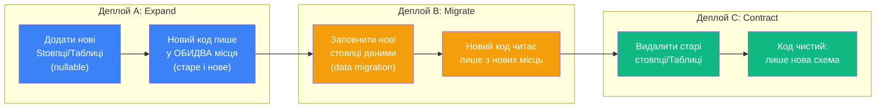

# Міграції: Multiple DbContext, Схеми та Breaking Changes

> Це продовження статті [«Просунуті Сценарії: Частина 1»](/csharp/ef-core/24.migrations-advanced-part1).

---

## Multiple DbContext: ізоляція міграцій

Коли у застосунку є кілька `DbContext` — кожен має свій незалежний набір міграцій. Це природна ситуація при Bounded Context архітектурах, multi-module monoliths або clean architecture де різні модулі мають власний контекст.

### Проблема спільного __EFMigrationsHistory

За замовчуванням усі DbContext записують свої міграції в одну таблицю `dbo.__EFMigrationsHistory`. Це призводить до двох проблем:

**Перша**: хаос з іменами міграцій. Якщо `OrdersDbContext` і `CatalogDbContext` обидва мають міграцію `InitialCreate` — таблиця `__EFMigrationsHistory` отримає два записи з однаковим `MigrationId` і впаде з помилкою унікальності.

**Друга**: неможливо зрозуміти яка міграція до якого контексту відноситься. Після 100 міграцій від двох контекстів — журнал перетворюється у нерозбірливу мішанину.

### HasDefaultSchema: SQL Server схеми для ізоляції

Найелегантніше вирішення — кожен DbContext отримує **власну SQL схему**. `__EFMigrationsHistory` тоде створюється у відповідній схемі:

```csharp
// OrdersDbContext: схема "orders"
public class OrdersDbContext : DbContext
{
    public DbSet<Order>     Orders     => Set<Order>();
    public DbSet<OrderItem> OrderItems => Set<OrderItem>();

    protected override void OnModelCreating(ModelBuilder modelBuilder)
    {
        // Всі таблиці цього контексту — у схемі "orders"
        modelBuilder.HasDefaultSchema("orders");

        // Кастомна таблицяHistory теж у схемі "orders"
        // (автоматично при HasDefaultSchema)
    }
}

// CatalogDbContext: схема "catalog"
public class CatalogDbContext : DbContext
{
    public DbSet<Product>  Products   => Set<Product>();
    public DbSet<Category> Categories => Set<Category>();

    protected override void OnModelCreating(ModelBuilder modelBuilder)
    {
        modelBuilder.HasDefaultSchema("catalog");
    }
}
```

Результат у базі:
```
-- SQL Server схеми:
orders.__EFMigrationsHistory   ← міграції OrdersDbContext
orders.Orders
orders.OrderItems

catalog.__EFMigrationsHistory  ← міграції CatalogDbContext
catalog.Products
catalog.Categories

dbo.__EFMigrationsHistory      ← якщо є ще один DbContext без схеми
```

### HasDefaultSchema і MigrationsHistoryTable

Для повного контролю — явна конфігурація таблиці History:

```csharp
// Program.cs: явна History таблиця для кожного контексту
builder.Services.AddDbContext<OrdersDbContext>(options =>
    options.UseSqlServer(
        connectionString,
        sqlOptions => sqlOptions
            .MigrationsHistoryTable("__EFMigrationsHistory", "orders")));  // схема!

builder.Services.AddDbContext<CatalogDbContext>(options =>
    options.UseSqlServer(
        connectionString,
        sqlOptions => sqlOptions
            .MigrationsHistoryTable("__EFMigrationsHistory", "catalog")));
```

Або через `IDesignTimeDbContextFactory` (необхідно для `dotnet ef` команд):

```csharp
// OrdersDbContextFactory.cs
public class OrdersDbContextFactory : IDesignTimeDbContextFactory<OrdersDbContext>
{
    public OrdersDbContext CreateDbContext(string[] args)
    {
        var options = new DbContextOptionsBuilder<OrdersDbContext>()
            .UseSqlServer(
                "Server=.;Database=AppDb;Trusted_Connection=True",
                sqlOptions => sqlOptions
                    .MigrationsHistoryTable("__EFMigrationsHistory", "orders"))
            .Options;

        return new OrdersDbContext(options);
    }
}
```

### Команди для Multiple DbContext

```bash
# Обов'язково вказувати --context при кількох DbContext!

# Міграції для OrdersDbContext
dotnet ef migrations add InitOrders \
    --context OrdersDbContext \
    --output-dir Migrations/Orders

# Міграції для CatalogDbContext
dotnet ef migrations add InitCatalog \
    --context CatalogDbContext \
    --output-dir Migrations/Catalog

# Database update для кожного окремо
dotnet ef database update --context OrdersDbContext
dotnet ef database update --context CatalogDbContext

# Список міграцій для конкретного контексту
dotnet ef migrations list --context OrdersDbContext
```

::terminal-preview{title="migrations list з кількома contexts"}

<div class="line"><span class="opacity-40">$</span> <strong>dotnet ef migrations list --context OrdersDbContext</strong></div>
<div class="line"><span class="text-green-400">20250101000000_InitOrders</span> (Applied)</div>
<div class="line"><span class="text-green-400">20250215103012_AddOrderStatus</span> (Applied)</div>
<div class="line"><span class="text-yellow-400">20250329120000_AddShippingAddress</span> (Pending)</div>
<div class="line"></div>
<div class="line"><span class="opacity-40">$</span> <strong>dotnet ef migrations list --context CatalogDbContext</strong></div>
<div class="line"><span class="text-green-400">20250101000001_InitCatalog</span> (Applied)</div>
<div class="line"><span class="text-green-400">20250301083000_AddProductImages</span> (Applied)</div>

::

### Організація папок для Multiple DbContext

```
Infrastructure/
├── Contexts/
│   ├── OrdersDbContext.cs
│   └── CatalogDbContext.cs
├── Migrations/
│   ├── Orders/                       ← --output-dir Migrations/Orders
│   │   ├── 20250101_InitOrders.cs
│   │   └── OrdersDbContextModelSnapshot.cs
│   └── Catalog/                      ← --output-dir Migrations/Catalog
│       ├── 20250101_InitCatalog.cs
│       └── CatalogDbContextModelSnapshot.cs
```

---

## Кастомізація __EFMigrationsHistory

У деяких сценаріях потрібна більш детальна кастомізація таблиці History ніж просто зміна схеми.

### Власна таблиця зі своїм іменем і колонками

EF Core дозволяє повністю замінити механізм History таблиці через `IHistoryRepository`:

```csharp
// Кастомна таблиця History з додатковим полем AppliedAt
public class CustomHistoryRepository : SqlServerHistoryRepository
{
    public CustomHistoryRepository(HistoryRepositoryDependencies dependencies)
        : base(dependencies) { }

    // Перевизначаємо SQL для INSERT при успішному застосуванні міграції
    protected override string ExistsScript => base.ExistsScript;  // без змін

    public override string GetInsertScript(HistoryRow row)
    {
        // Додаємо AppliedAt у INSERT
        return $"INSERT INTO [{TableName}] ([MigrationId], [ProductVersion], [AppliedAt]) " +
               $"VALUES ('{row.MigrationId}', '{row.ProductVersion}', GETUTCDATE());";
    }

    // Кастомна CreateScript з додатковою колонкою
    public override string GetCreateScript()
    {
        return $@"
            CREATE TABLE [{TableSchema}].[{TableName}] (
                [MigrationId]    nvarchar(150) NOT NULL,
                [ProductVersion] nvarchar(32)  NOT NULL,
                [AppliedAt]      datetime2     NOT NULL DEFAULT GETUTCDATE(),
                [AppliedBy]      nvarchar(100) NULL,     -- хто застосував
                CONSTRAINT [PK_{TableName}] PRIMARY KEY ([MigrationId])
            );";
    }
}

// Реєстрація кастомного HistoryRepository:
builder.Services.AddDbContext<AppDbContext>(options =>
    options.UseSqlServer(connectionString)
           .ReplaceService<IHistoryRepository, CustomHistoryRepository>());
```

### Простий варіант: лише назва і схема

```csharp
// Найчастіший сценарій — просто інша назва і/або схема:
options.UseSqlServer(connectionString, sql =>
    sql.MigrationsHistoryTable(
        tableName:   "_MigrationLog",  // інша назва
        schema:      "meta"));         // власна схема

// Результат: meta._MigrationLog замість dbo.__EFMigrationsHistory
```

---

## HasDefaultSchema: глибоке занурення

`HasDefaultSchema` визначає схему SQL Server (або PostgreSQL) за замовчуванням для всіх об'єктів DbContext. Але ця конфігурація має нюанси що варто знати.

### Різні схеми для різних entity у одному DbContext

Іноді потрібно мати більшість таблиць у одній схемі, але окремі — у інших:

```csharp
protected override void OnModelCreating(ModelBuilder modelBuilder)
{
    // За замовчуванням — схема "app"
    modelBuilder.HasDefaultSchema("app");

    // Перевизначення для конкретних entity:
    modelBuilder.Entity<AuditLog>()
        .ToTable("AuditLogs", schema: "audit");   // audit.AuditLogs

    modelBuilder.Entity<SystemConfig>()
        .ToTable("Config", schema: "meta");        // meta.Config

    // Всі інші (Products, Orders, ...) → app.Products, app.Orders
}
```

### HasDefaultSchema і міграції

EF Core при генерації міграції враховує схему. Всі `CreateTable` отримають відповідну схему:

```csharp
// Автоматично згенерована міграція після HasDefaultSchema("catalog"):
migrationBuilder.CreateTable(
    name:   "Products",
    schema: "catalog",   // ← схема з HasDefaultSchema!
    columns: table => new { ... });
```

### PostgreSQL і схеми

PostgreSQL має вбудовану концепцію схем (namespaces). `HasDefaultSchema` безпосередньо відповідає PostgreSQL схемі:

```csharp
// PostgreSQL: таблиці у схемі "orders"
protected override void OnModelCreating(ModelBuilder modelBuilder)
{
    modelBuilder.HasDefaultSchema("orders");

    // Потрібно також підключити схему (search_path):
    // У connection string: SearchPath=orders,public
    // або явно:
}
```

```bash
# PostgreSQL: встановити search_path для сесії
SET search_path TO orders, public;

# або у connection string (Npgsql):
# "Host=localhost;Database=mydb;SearchPath=orders,public"
```

---

## Handling Breaking Changes: стратегії для production

**Breaking changes** у контексті міграцій — це зміни схеми що **несумісні** з вже розгорнутим кодом. Тобто після застосування міграції, стара версія застосунку перестає працювати.

Типові breaking changes:
- Видалення стовпця що читає стара версія
- Зміна типу стовпця що несумісна (nvarchar(100) → int)
- Перейменування таблиці або стовпця
- Додавання NOT NULL стовпця без default

### Чому це проблема у production

У сучасних deployment стратегіях (Blue-Green, Rolling Update, Canary) — **нова і стара версія застосунку одночасно працюють протягом кількох хвилин** (або годин при Canary). Якщо міграція сумісна лише з новою версією — стара ламається одразу після застосування міграції.

### Expand-Contract Pattern (він же Parallel Change)

Єдиний надійний підхід до zero-downtime breaking changes — **Expand-Contract** (також відомий як **Parallel Change** від Мартіна Фаулера):

::mermaid



::

### Expand-Contract на прикладі: rename стовпця у production

Задача: перейменувати `Products.Price` → `Products.UnitPrice` без простою.

**Деплой A — Expand (або: Backward Compatible Migration):**

```csharp
// Міграція A: Додаємо новий стовпець (стара версія не знає про нього)
public partial class ExpandAddUnitPrice : Migration
{
    protected override void Up(MigrationBuilder migrationBuilder)
    {
        // Додати новий nullable стовпець
        migrationBuilder.AddColumn<decimal>(
            name:     "UnitPrice",
            table:    "Products",
            nullable: true);  // nullable! Стара версія не заповнює його

        // Заповнити існуючі рядки з Price
        migrationBuilder.Sql(
            "UPDATE Products SET UnitPrice = Price WHERE UnitPrice IS NULL;");

        // Тригер для синхронізації: поки обидві версії активні
        migrationBuilder.Sql(@"
            CREATE TRIGGER trg_Products_SyncPrices
            ON Products AFTER INSERT, UPDATE AS
            BEGIN
                -- При зміні Price → оновити UnitPrice
                UPDATE p SET p.UnitPrice = i.Price
                FROM Products p INNER JOIN Inserted i ON i.Id = p.Id
                WHERE i.Price != p.UnitPrice OR p.UnitPrice IS NULL;

                -- При зміні UnitPrice → оновити Price (для старої версії)
                UPDATE p SET p.Price = i.UnitPrice
                FROM Products p INNER JOIN Inserted i ON i.Id = p.Id
                WHERE i.UnitPrice IS NOT NULL AND i.UnitPrice != p.Price;
            END;
        ");
    }
}
```

```csharp
// Версія коду A: пише у ОБИДВА стовпця, читає з Price (backward compat)
public class ProductService
{
    public async Task UpdatePriceAsync(int id, decimal newPrice)
    {
        await context.Products
            .Where(p => p.Id == id)
            .ExecuteUpdateAsync(s => s
                .SetProperty(p => p.Price,     newPrice)  // старий стовпець
                .SetProperty(p => p.UnitPrice, newPrice)  // новий стовпець
            );
    }
}
```

**Деплой B — Migrate (новий код читає лише з UnitPrice):**

```csharp
// Міграція B: Зробити UnitPrice NOT NULL (дані вже заповнені)
public partial class MigrateUnitPriceNotNull : Migration
{
    protected override void Up(MigrationBuilder migrationBuilder)
    {
        // Переконатись що немає NULL (на всяк випадок)
        migrationBuilder.Sql(
            "UPDATE Products SET UnitPrice = Price WHERE UnitPrice IS NULL;");

        // Зробити NOT NULL
        migrationBuilder.AlterColumn<decimal>(
            name:      "UnitPrice",
            table:     "Products",
            nullable:  false,
            oldNullable: true);
    }
}
```

```csharp
// Версія коду B: читає з UnitPrice, пише у обидва (тригер синхронізує)
public decimal GetProductPrice(Product p) => p.UnitPrice;  // ← новий стовпець
```

**Деплой C — Contract (видалення старого):**

```csharp
// Міграція C: видалити старий Price стовпець і тригер
public partial class ContractRemoveOldPrice : Migration
{
    protected override void Up(MigrationBuilder migrationBuilder)
    {
        // Видалити тригер синхронізації
        migrationBuilder.Sql("DROP TRIGGER IF EXISTS trg_Products_SyncPrices;");

        // Видалити старий стовпець
        migrationBuilder.DropColumn(name: "Price", table: "Products");
    }
}
```

### Стратегія без тригерів: Feature Flag

Більш легкий підхід для команд де хочуть уникнути тригерів:

```csharp
// Код читає з UnitPrice якщо feature flag увімкнено, інакше з Price
public decimal GetPrice(Product product)
{
    return _featureFlags.IsEnabled("UseUnitPrice")
        ? product.UnitPrice ?? product.Price  // нова версія
        : product.Price;                       // стара версія
}

// Feature Flag переключається на рівні конфігурації між деплоями
// без перезапуску застосунку (Azure App Config, LaunchDarkly, etc.)
```

### Матриця Breaking Changes і рекомендованих стратегій

| Change | Breaking? | Стратегія |
|---|---|---|
| Add nullable column | ❌ | Проста міграція |
| Add NOT NULL column з DEFAULT | ⚠️ | DEFAULT покриває old rows |
| Add NOT NULL без DEFAULT | ✅ | Expand: nullable → fill → AlterColumn |
| Rename column | ✅ | Expand-Contract (3 деплої) |
| Drop column | ✅ | Contract: спочатку видали з коду, потім DropColumn |
| Change column type (compatible) | ⚠️ | Перевірте що дані конвертуються |
| Change column type (incompatible) | ✅ | Expand-Contract з data migration |
| Rename table | ✅ | View/синонім для перехідного періоду |
| Split table | ✅ | Expand-Contract + data migration |

---

## Database-First Workflow: повний цикл

Reverse Engineering (scaffold) розглядався у статті 25. Тут — про повний **lifecycle Database-First підходу** у довгостроковій перспективі.

### Схема взаємодії у Database-First команді

```
DBA/Architect
    ↓ (пишуть SQL міграції: Flyway/DbUp або вручну)
Database Schema змінена
    ↓
Розробник запускає:
    dotnet ef dbcontext scaffold ... --force
    ↓
Згенеровані Entity оновлені
    ↓
Перевірка Extensions (Partial Classes) — чи не зламані?
    ↓
dotnet build + dotnet test
    ↓
PR Review → Merge
```

### Re-scaffold у CI

Для team що активно практикує Database-First — можна автоматизувати re-scaffold у CI:

```yaml
# .github/workflows/rescaffold.yml
name: Re-scaffold on DB change

on:
  push:
    paths:
      - 'database/migrations/**'  # Зміна у SQL файлах міграцій

jobs:
  rescaffold:
    runs-on: ubuntu-latest
    steps:
      - uses: actions/checkout@v4

      - name: Apply DB migrations
        run: |
          # Застосувати нові SQL міграції до test DB
          psql $TEST_DB_URL -f database/migrations/latest.sql

      - name: Restore dotnet tools
        run: dotnet tool restore

      - name: Re-scaffold
        run: |
          dotnet ef dbcontext scaffold \
            "$TEST_DB_CONN" Npgsql.EntityFrameworkCore.PostgreSQL \
            --output-dir Infrastructure/Generated/Entities \
            --context-dir Infrastructure/Generated \
            --context ShopDbContext \
            --no-onconfiguring --force

      - name: Build and test
        run: |
          dotnet build
          dotnet test

      - name: Create PR with changes
        uses: peter-evans/create-pull-request@v5
        with:
          title: "chore: re-scaffold after DB schema change"
          base: main
          branch: "auto/rescaffold-$(date +%Y%m%d)"
```

### Scaffold → Customize → Maintain cycle

```
1. SCAFFOLD               dotnet ef dbcontext scaffold ... --force
        ↓
2. CUSTOMIZE              Додати Extensions (Partial Classes)
        ↓                 Додати IEntityTypeConfiguration (додаткова конфігурація)
        ↓                 Додати Interface implementations
        ↓
3. MAINTAIN               При зміні схеми → повернутись до кроку 1
        ↓                 Extensions зберігаються між re-scaffold
```

---

## Реальний кейс: Legacy Oracle → PostgreSQL migration

Один з найскладніших сценаріїв: перенесення legacy Oracle бази у PostgreSQL з одночасним додаванням EF Core поверх.

```csharp
// Крок 1: Scaffold з Oracle (через Devart або Oracle провайдер)
// dotnet ef dbcontext scaffold "Data Source=ORCL;..." Oracle.EntityFrameworkCore

// Крок 2: Отримали 300 entity. Всі в PascalCase (якщо --use-database-names не вказано)
// Oracle: PRODUCT_MASTER → EF Core: ProductMaster (автоматично)

// Крок 3: Адаптувати конфігурацію для PostgreSQL
// (типи: NUMBER → decimal, VARCHAR2 → text, DATE → timestamp, тощо)

// Крок 4: Генерувати PostgreSQL міграції
// dotnet ef migrations add InitFromOracle --context PostgresDbContext
```

```csharp
// Маппінг типів Oracle → PostgreSQL у конфігурації:
public class ProductConfiguration : IEntityTypeConfiguration<Product>
{
    public void Configure(EntityTypeBuilder<Product> builder)
    {
        // Oracle: NUMBER(10,2) → PostgreSQL: numeric(10,2)
        builder.Property(p => p.Price)
               .HasColumnType("numeric(10,2)");  // PostgreSQL specific

        // Oracle: DATE (включає час!) → PostgreSQL: timestamp
        builder.Property(p => p.CreatedDate)
               .HasColumnType("timestamp without time zone");

        // Oracle: VARCHAR2(100) → PostgreSQL: character varying(100)
        builder.Property(p => p.Name)
               .HasColumnType("character varying(100)");
    }
}
```

---

## Практичні завдання (Частина 2)

### Рівень 1 — Базовий

::steps

### Завдання 1.1: Multiple DbContext ізоляція

1. Створіть `OrdersDbContext` (схема `orders`) і `CatalogDbContext` (схема `catalog`)
2. Налаштуйте через `HasDefaultSchema` та `MigrationsHistoryTable`
3. `migrations add InitOrders --context OrdersDbContext --output-dir Migrations/Orders`
4. `migrations add InitCatalog --context CatalogDbContext --output-dir Migrations/Catalog`
5. `database update --context OrdersDbContext`
6. `database update --context CatalogDbContext`
7. Перевірте у БД: `orders.__EFMigrationsHistory` і `catalog.__EFMigrationsHistory` — окремі

### Завдання 1.2: HasDefaultSchema у міграції

1. Додайте `HasDefaultSchema("shop")` до існуючого DbContext
2. `migrations add AddShopSchema`
3. Відкрийте файл — чи є `schema: "shop"` у `CreateTable`?
4. Якщо DbContext вже мав таблиці без схеми → треба `RenameTable` з schema. Де і як виправити?

### Завдання 1.3: кастомна History таблиця

Реалізуйте `CustomHistoryRepository` що:
1. Таблиця `_applied_migrations` у схемі `meta`
2. Додаткова колонка `applied_at TIMESTAMP` із `DEFAULT NOW()`
3. Перевірте через `psql`: `SELECT * FROM meta._applied_migrations;`

::

### Рівень 2 — Логіка

::steps

### Завдання 2.1: Expand-Contract для rename column

Реалізуйте повний 3-деплойний цикл для перейменування `Customer.Balance` → `Customer.AccountBalance`:

- **Деплой A**: міграція додає `AccountBalance nullable`, дані синхронізуються тригером, код v1 пише у обидва
- **Деплой B**: міграція робить `AccountBalance NOT NULL`, код v2 читає лише `AccountBalance`
- **Деплой C**: видалити тригер і старий `Balance`

Напишіть integration тест що верифікує: після Деплою C, код v2 коректно читає і пише `AccountBalance`.

### Завдання 2.2: Backward Compatible Migration

Таблиця `Articles` має `Body NVARCHAR(MAX)`. Вам потрібно додати full-text search.

Реалізуйте backward compatible:
1. Міграція A: `CREATE FULLTEXT CATALOG`, `CREATE FULLTEXT INDEX ON Articles(Body)` (SQL Server або pg_trgm для PostgreSQL)
2. `suppressTransaction: true` для Full-text команд
3. Переконайтесь що `Down()` коректно скасовує (`DROP FULLTEXT INDEX`, `DROP FULLTEXT CATALOG`)
4. Стара версія застосунку не знає про Full-text але продовжує читати `Body` нормально

::

### Рівень 3 — Архітектура

::steps

### Завдання 3.1: Migration Strategy Matrix

Спроєктуйте повний план міграцій для наступних змін у production базі з 10M рядків:

1. `Products.Category` (string, enum-like) → `Products.CategoryId` (FK до `Categories` таблиці)
2. `Orders.CustomerEmail` (string) → `Orders.CustomerId` (FK до `Customers` таблиці)
3. `Users.FullName` → `Users.FirstName` + `Users.LastName`

Для кожної: визначте чи є breaking change, скільки деплоїв потрібно, опишіть Expand-Contract кроки, напишіть усі необхідні міграції.

Бонус: для кожної операції оцініть час виконання при 10M рядках і запропонуйте batching стратегію.

::

---

## Підсумок статті 24

Дві частини покрили весь спектр просунутих сценаріїв міграцій:

**Частина 1:**
- **`migrationBuilder.Sql()`**: Views, SP, тригери, provider-specific DDL, batch operations. `suppressTransaction` для full-text і columnstore
- **Data Migrations**: nullable спочатку → `Sql()` для трансформації → AlterColumn NOT NULL. Перенесення між таблицями. Batch UPDATE для мільйонів рядків
- **Rename vs Drop+Create**: EF Core не розуміє rename — завжди перевіряти `Up()`. `RenameColumn`, `RenameTable` — правильні методи
- **Squashing**: 5 кроків. Видалити файли (не Snapshot!) → `InitialCreate` → очистити `__EFMigrationsHistory` → INSERT нового запису

**Частина 2:**
- **Multiple DbContext**: `HasDefaultSchema` для ізоляції, окремі `--output-dir` для папок, `--context` для команд. Кожен контекст — своя `__EFMigrationsHistory`
- **`MigrationsHistoryTable`**: кастомна назва і схема через `UseSqlServer(sql => sql.MigrationsHistoryTable(...))` або повна заміна через `IHistoryRepository`
- **HasDefaultSchema**: всі таблиці у одній схемі, перевизначення для конкретних entity
- **Breaking Changes — Expand-Contract**: 3 деплої, тригери для синхронізації, Feature Flags як альтернатива
- **Database-First lifecycle**: re-scaffold у CI, scaffold → customize → maintain cycle

Наступні статті — [Блок 6: Продуктивність](/csharp/ef-core/26.performance-fundamentals) де розглядаємо N+1, QuerySplittingBehavior, compiled queries та EXPLAIN ANALYZE.
