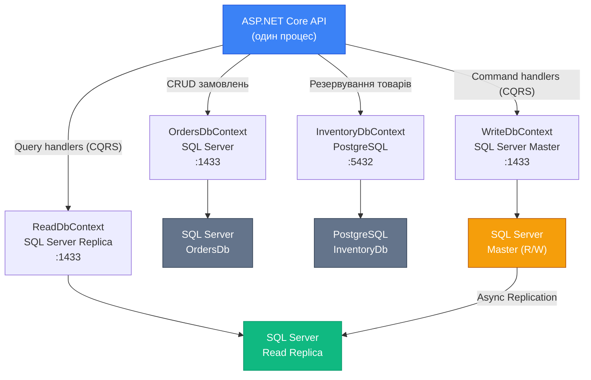

# Управління Схемою: Partial Classes, Re-scaffolding та Multi-Database

> Це продовження статті [«Управління Схемою: Частина 1»](/csharp/ef-core/25.schema-management-part1). Читайте послідовно.

---

## Partial Classes: розширення без ризику

Перша частина показала що scaffold генерує `partial class`. Це ключова деталь що робить Database-First підхід практичним у довгостроковій перспективі.

**Проблема**: ви отримали згенерований `Product.cs`. Додали метод `CalculateDiscount()`. Схема БД змінилась, треба re-scaffold з `--force`. Ваш метод **перезаписано**.

**Рішення**: `partial class` у C# дозволяє розрізати один клас на кілька файлів. Компілятор збирає їх в один клас. Scaffold генерує один файл — ви пишете розширення у іншому файлі що ніколи не перезаписується.

```
Product.cs              ← згенерований (перезаписується при --force)
Product.Extensions.cs   ← ваш розширення (НІКОЛИ не перезаписується)
```

обидва: `public partial class Product { ... }` → компілятор зберіть в один `Product`.

### Структура файлів у Database-First проєкті

```
Infrastructure/
├── Entities/                         ← Згенеровані (перезаписуються при re-scaffold)
│   ├── Product.cs                    ← auto-generated
│   ├── Category.cs                   ← auto-generated
│   └── Order.cs                      ← auto-generated
├── Entities/Extensions/              ← Ваші розширення (НІКОЛИ не чіпати при scaffold)
│   ├── Product.Extensions.cs         ← бізнес-логіка Product
│   ├── Category.Extensions.cs        ← бізнес-логіка Category
│   └── Order.Extensions.cs           ← бізнес-логіка Order
└── ShopDbContext.cs                  ← згенерований
└── ShopDbContextExtensions.cs        ← ваші розширення DbContext
```

### Приклади rozширень через Partial Classes

```csharp
// Infrastructure/Entities/Extensions/Product.Extensions.cs
// Цей файл НІКОЛИ не перезаписується scaffold

namespace YourApp.Infrastructure.Entities;

// Той самий namespace і тип що у згенерованому Product.cs
public partial class Product
{
    // 1. Обчислювані властивості (computed properties)
    public decimal FinalPrice =>
        Discount.HasValue
            ? Price - (Price * Discount.Value / 100)
            : Price;

    public bool IsDiscounted => Discount.HasValue && Discount.Value > 0;

    // 2. Доменна логіка (методи)
    public void ApplyDiscount(decimal discountPercent)
    {
        if (discountPercent < 0 || discountPercent > 100)
            throw new ArgumentOutOfRangeException(nameof(discountPercent),
                "Discount must be between 0 and 100.");

        Discount = discountPercent;
    }

    public void Activate()  => IsActive = true;
    public void Deactivate() => IsActive = false;

    // 3. Форматування і відображення
    public string DisplayName => $"{Name} ({Category?.Name ?? "Uncategorized"})";

    // 4. Валідація (може бути використана у тестах і бізнес-логіці)
    public IReadOnlyList<string> Validate()
    {
        var errors = new List<string>();

        if (string.IsNullOrWhiteSpace(Name))
            errors.Add("Name is required.");

        if (Price <= 0)
            errors.Add("Price must be positive.");

        if (CategoryId <= 0)
            errors.Add("Category is required.");

        return errors;
    }

    // 5. Override ToString для кращого відлагодження
    public override string ToString() =>
        $"Product[{Id}]: {Name} @ {Price:C} (Active: {IsActive})";
}
```

### Розширення DbContext

```csharp
// Infrastructure/ShopDbContextExtensions.cs
namespace YourApp.Infrastructure;

public partial class ShopDbContext
{
    // Зручні методи запитів
    public IQueryable<Product> ActiveProducts =>
        Set<Product>().Where(p => p.IsActive);

    public IQueryable<Product> ProductsByCategory(int categoryId) =>
        Set<Product>().Where(p => p.CategoryId == categoryId && p.IsActive);

    // Методи для складних операцій
    public async Task<int> SoftDeleteProductAsync(int productId)
    {
        return await Set<Product>()
            .Where(p => p.Id == productId)
            .ExecuteUpdateAsync(s => s.SetProperty(p => p.IsActive, false));
    }

    // Кастомні події (аудит, доменні події)
    public override async Task<int> SaveChangesAsync(CancellationToken ct = default)
    {
        // Автоматично встановити UpdatedAt для Modified entities
        var modifiedEntries = ChangeTracker.Entries<IHasTimestamps>()
            .Where(e => e.State == EntityState.Modified);

        foreach (var entry in modifiedEntries)
            entry.Entity.UpdatedAt = DateTime.UtcNow;

        return await base.SaveChangesAsync(ct);
    }
}
```

### Interface-based розширення

Ще потужніший підхід — додати інтерфейси до entity через partial class:

```csharp
// Core/Interfaces/IAuditableEntity.cs
public interface IAuditableEntity
{
    DateTime CreatedAt { get; set; }
    DateTime? UpdatedAt { get; set; }
}

// Infrastructure/Entities/Extensions/Product.Extensions.cs
public partial class Product : IAuditableEntity, ISoftDeletable
{
    // Product вже має CreatedAt і UpdatedAt (від scaffold)
    // Тепер вони виконують контракт IAuditableEntity

    // ISoftDeletable: реалізація через IsActive поле
    bool ISoftDeletable.IsDeleted => !IsActive;
    void ISoftDeletable.SoftDelete() => IsActive = false;
    void ISoftDeletable.Restore()    => IsActive = true;
}
```

```csharp
// Global Query Filter у DbContext extensions:
public partial class ShopDbContext
{
    protected override void OnModelCreating(ModelBuilder modelBuilder)
    {
        // Викликаємо базовий OnModelCreating (згенерований)
        base.OnModelCreating(modelBuilder);

        // Додаємо Global Query Filter для soft delete
        foreach (var entityType in modelBuilder.Model.GetEntityTypes())
        {
            if (typeof(ISoftDeletable).IsAssignableFrom(entityType.ClrType))
            {
                var method = typeof(ShopDbContextExtensions)
                    .GetMethod(nameof(AddSoftDeleteFilter))!
                    .MakeGenericMethod(entityType.ClrType);

                method.Invoke(null, [modelBuilder]);
            }
        }
    }

    private static void AddSoftDeleteFilter<T>(ModelBuilder builder)
        where T : class, ISoftDeletable
    {
        builder.Entity<T>().HasQueryFilter(e => !e.IsDeleted);
    }
}
```

::warning
При override `OnModelCreating` у partial ShopDbContext — обов'язково викликайте `base.OnModelCreating(modelBuilder)`. Без цього — конфігурація зі згенерованого файлу не застосується і застосунок впаде з некоректним маппінгом.
::

---

## Re-scaffolding Workflow: коли БД змінилась

Re-scaffolding — регенерація entity при зміні схеми БД. Це повторюваний процес у Database-First підході і важливо виробити правильний workflow.

### Коли потрібен re-scaffold

- DBA додав нову таблицю або нові стовпці до існуючої
- Змінились типи стовпців (наприклад `NVARCHAR(100)` → `NVARCHAR(500)`)
- Додано нові Foreign Keys або змінено ON DELETE поведінку
- Видалено або перейменовано стовпці

### Базова команда re-scaffold

```bash
# --force: перезаписати наявні ЗГЕНЕРОВАНІ файли
dotnet ef dbcontext scaffold \
    "Name=ConnectionStrings:DefaultConnection" \
    Microsoft.EntityFrameworkCore.SqlServer \
    --output-dir Infrastructure/Entities \
    --context-dir Infrastructure \
    --context ShopDbContext \
    --no-onconfiguring \
    --force   # ← ключовий флаг: перезаписати
```

::caution
`--force` перезаписує **всі** файли у `--output-dir` і `--context-dir`. Якщо ваш `Product.Extensions.cs` знаходиться у тій самій директорії що і `Product.cs` — він **буде перезаписаний**! Завжди тримайте Extensions у окремій піддиректорії або окремому проєкті.
::

### Безпечна структура директорій

```
Infrastructure/
├── Generated/           ← Тут живуть автогенеровані файли
│   ├── Entities/        ← --output-dir Infrastructure/Generated/Entities
│   │   ├── Product.cs
│   │   ├── Category.cs
│   │   └── ...
│   └── ShopDbContext.cs ← --context-dir Infrastructure/Generated
└── Extensions/          ← Тут живуть ваші розширення (НЕ торкається --force)
    ├── Product.Extensions.cs
    ├── Category.Extensions.cs
    └── ShopDbContextExtensions.cs
```

### Автоматизований re-scaffold скрипт

```bash
#!/bin/bash
# scripts/rescaffold.sh

set -e  # зупинити при помилці

echo "🔄 Starting re-scaffold..."

# Параметри
CONNECTION="Name=ConnectionStrings:DefaultConnection"
PROVIDER="Microsoft.EntityFrameworkCore.SqlServer"
PROJECT="src/Infrastructure"
STARTUP="src/Api"

# Виконати scaffold
dotnet ef dbcontext scaffold "$CONNECTION" "$PROVIDER" \
    --project "$PROJECT" \
    --startup-project "$STARTUP" \
    --output-dir "Generated/Entities" \
    --context-dir "Generated" \
    --context "ShopDbContext" \
    --namespace "YourApp.Infrastructure.Generated.Entities" \
    --context-namespace "YourApp.Infrastructure.Generated" \
    --no-onconfiguring \
    --force

echo "✅ Scaffold completed!"
echo ""
echo "⚠️  Post-scaffold checklist:"
echo "   1. Review git diff for any breaking changes"
echo "   2. Check if new entities need Extensions classes"
echo "   3. Check if removed columns affect Extensions code"
echo "   4. Run tests: dotnet test"
```

### Diff-driven re-scaffold workflow

```bash
# 1. Зберегти поточний стан у Git перед scaffold
git add .
git commit -m "chore: pre-rescaffold checkpoint"

# 2. Виконати re-scaffold
./scripts/rescaffold.sh

# 3. Перевірити що змінилось
git diff --stat
# Показує які файли змінились і скільки рядків

# 4. Детальний diff для review
git diff Infrastructure/Generated/

# 5. Перевірити що Extensions не зачіпнуті
git diff Infrastructure/Extensions/
# Повинно бути: нічого (порожньо)

# 6. Запустити тести
dotnet test

# 7. Закомітити якщо все в порядку
git add .
git commit -m "chore: re-scaffold after DB schema update v3.2"
```

### Conflict resolution: Extensions vs Generated

Після re-scaffold, Extensions файл може звертатись до частин entity що були видалені:

```csharp
// Product.Extensions.cs — ПІСЛЯ re-scaffold Product більше не має поля Discount!
public partial class Product
{
    // ❌ Compilation Error: Product не має Discount після re-scaffold
    public bool IsDiscounted => Discount.HasValue && Discount.Value > 0;
}
```

Це компіляційна помилка — компілятор одразу сигналізує про проблему. Ви бачите що треба виправити у Extensions. Це правильна поведінка — краще, ніж мовчки мати застарілу логіку.

---

## Database Schema Comparison Tools

При Database-First підході часто виникає питання: **яка різниця між поточною схемою у БД і тим що описано в EF Core моделі?** Або: **яка різниця між dev і prod базами?**

Для цього існують спеціалізовані інструменти:

### dotnet ef dbcontext script: SQL для поточної моделі

```bash
# Генерує SQL DDL для поточної EF Core моделі (без міграцій!)
dotnet ef dbcontext script -o current-model.sql
```

Цей скрипт відображає **як EF Core бачить вашу модель** — всі `CREATE TABLE` і `CREATE INDEX`. Корисно порівняти з реальним станом БД.

### EF Core DbContext.Database.CompareSchemas (відсутній у stdlib!)

EF Core **не має** вбудованого diff-інструменту між моделлю і БД. Але є сторонні рішення:

### EFCore.SchemaCompare (open source)

```bash
dotnet add package EFCore.SchemaCompare
```

```csharp
using EfSchemaCompare;

// Порівнює C# модель (DbContext) з реальною схемою БД
var comparer = new CompareEfSql();
var hasErrors = comparer.CompareEfWithDb(context);

if (hasErrors)
{
    // Виводить детальний звіт
    Console.WriteLine(comparer.GetAllErrors);
    // Example:
    // DIFFERENT: Entity 'Product', column 'Price': column type. Expected = decimal(18,2), found = decimal(10,2)
    // MISSING: Entity 'OrderLineItem', index 'IX_OrderLineItems_OrderId' not found in database.
    // EXTRA: Table 'Tmp_Products' in database, not in entity classes.
}
else
{
    Console.WriteLine("EF Core model matches database schema perfectly.");
}
```

Інтеграція у тести:

```csharp
[Fact]
public void EfCoreModel_ShouldMatchDatabaseSchema()
{
    using var context = GetTestContext(); // реальна тестова БД

    var comparer  = new CompareEfSql();
    var hasErrors = comparer.CompareEfWithDb(context);

    Assert.False(hasErrors, $"Schema differences:\n{comparer.GetAllErrors}");
}
```

### SQL Server Schema Compare (Visual Studio)

Visual Studio Enterprise має вбудований **Schema Compare** для SQL Server:

::steps

### Відкрити Schema Compare

SQL Server Object Explorer → ПКМ на базі → Schema Compare...

### Вказати джерело та ціль

Source: Dev база (або EF Core generated script)
Target: Production база (або Staging)

### Аналізувати різниці

Schema Compare покаже таблиці, стовпці, індекси що відрізняються — з кольоровим кодуванням (Added/Changed/Deleted).

### Згенерувати скрипт або застосувати

"Generate Script" — SQL ALTER TABLE скрипт. "Update" — застосувати напряму.

::

### Redgate SQL Compare (комерційне, але лідер ринку)

```
Redgate SQL Compare:
- Порівнює схеми: Dev ↔ Staging ↔ Production
- Генерує delta SQL скрипти
- Інтеграція з SQL Server, MySQL, PostgreSQL
- CLI версія для CI/CD pipeline
```

### pgAdmin / DBeaver Schema Diff (для PostgreSQL)

```sql
-- PostgreSQL: вбудований information_schema для ручного порівняння
SELECT table_schema, table_name, column_name, data_type, is_nullable
FROM information_schema.columns
WHERE table_schema NOT IN ('information_schema', 'pg_catalog')
ORDER BY table_schema, table_name, ordinal_position;

-- Або через pg_dump + diff:
pg_dump --schema-only prod_db > prod_schema.sql
pg_dump --schema-only dev_db  > dev_schema.sql
diff prod_schema.sql dev_schema.sql
```

---

## Multi-Database Scenarios: кілька БД в одному застосунку

Реальні enterprise-системи рідко мають одну БД. Типові сценарії:

- **Bounded Contexts**: OrdersDb, InventoryDb, NotificationsDb — кожен сервіс зі своєю БД
- **Мультитенантність**: окрема БД на tenant
- **Read/Write Separation**: Write на основний SQL Server, Read на Read Replica або Elasticsearch
- **Legacy Integration**: нова система читає з legacy OracleDB, пише у нову PostgreSQL

### Підхід 1: Кілька DbContext у одному застосунку

```csharp
// Два DbContext для двох різних БД
public class OrdersDbContext : DbContext
{
    public OrdersDbContext(DbContextOptions<OrdersDbContext> options) : base(options) { }

    public DbSet<Order>       Orders      => Set<Order>();
    public DbSet<OrderItem>   OrderItems  => Set<OrderItem>();
}

public class InventoryDbContext : DbContext
{
    public InventoryDbContext(DbContextOptions<InventoryDbContext> options) : base(options) { }

    public DbSet<Product>     Products    => Set<Product>();
    public DbSet<StockLevel>  StockLevels => Set<StockLevel>();
}
```

Реєстрація двох DbContext:

```csharp
// Program.cs: окремі DbContext для окремих БД
builder.Services.AddDbContext<OrdersDbContext>(options =>
    options.UseSqlServer(
        builder.Configuration.GetConnectionString("OrdersDb")));

builder.Services.AddDbContext<InventoryDbContext>(options =>
    options.UseNpgsql(
        builder.Configuration.GetConnectionString("InventoryDb")));

// appsettings.json:
// {
//   "ConnectionStrings": {
//     "OrdersDb":    "Server=orders-sql;Database=Orders;...",
//     "InventoryDb": "Host=inventory-pg;Database=Inventory;..."
//   }
// }
```

Використання у сервісах:

```csharp
public class OrderFulfillmentService
{
    private readonly OrdersDbContext    _ordersDb;
    private readonly InventoryDbContext _inventoryDb;

    // Два DbContext — з різних БД, різних провайдерів!
    public OrderFulfillmentService(
        OrdersDbContext ordersDb,
        InventoryDbContext inventoryDb)
    {
        _ordersDb    = ordersDb;
        _inventoryDb = inventoryDb;
    }

    public async Task FulfillOrderAsync(int orderId)
    {
        // Читаємо з OrdersDb
        var order = await _ordersDb.Orders
            .Include(o => o.Items)
            .FirstOrDefaultAsync(o => o.Id == orderId)
            ?? throw new NotFoundException($"Order {orderId} not found.");

        // Резервуємо товар в InventoryDb
        foreach (var item in order.Items)
        {
            var rowsAffected = await _inventoryDb.StockLevels
                .Where(s => s.ProductId == item.ProductId && s.Available >= item.Quantity)
                .ExecuteUpdateAsync(s =>
                    s.SetProperty(sl => sl.Available, sl => sl.Available - item.Quantity));

            if (rowsAffected == 0)
                throw new InsufficientStockException(item.ProductId);
        }

        // Оновлюємо статус в OrdersDb
        order.Status    = "Fulfilled";
        order.FulfilledAt = DateTime.UtcNow;
        await _ordersDb.SaveChangesAsync();
    }
}
```

### Міграції для кількох DbContext

```bash
# Запускаємо міграції окремо для кожного DbContext!
dotnet ef migrations add InitOrders --context OrdersDbContext
dotnet ef migrations add InitInventory --context InventoryDbContext

# Database update для кожного теж окремо:
dotnet ef database update --context OrdersDbContext
dotnet ef database update --context InventoryDbContext
```

Для уникнення конфліктів між міграціями двох contexts — **папка міграцій** має бути явно вказана:

```csharp
// OrdersDbContext: міграції у Migrations/Orders/
builder.Services.AddDbContext<OrdersDbContext>(options =>
    options.UseSqlServer(connectionString, sqlOptions =>
        sqlOptions.MigrationsAssembly("YourApp.Infrastructure")
                  // Або через налаштування MigrationsHistoryTable зі своїм prefix
    ));
```

```csharp
// Або через конфігурацію контексту:
public class OrdersDbContext : DbContext
{
    protected override void OnModelCreating(ModelBuilder modelBuilder)
    {
        modelBuilder.HasDefaultSchema("orders"); // власна схема для ізоляції
        // Тоді __EFMigrationsHistory буде у схемі "orders"
    }
}
```

### Підхід 2: Мультитенантна архітектура з окремою БД на тенант

```csharp
// Tenant-per-database: DbContext створюється динамічно з правильним connection string
public class TenantDbContextFactory
{
    private readonly ITenantResolver _tenantResolver;
    private readonly IConfiguration  _configuration;

    public TenantDbContextFactory(
        ITenantResolver tenantResolver,
        IConfiguration  configuration)
    {
        _tenantResolver = tenantResolver;
        _configuration  = configuration;
    }

    public AppDbContext CreateForCurrentTenant()
    {
        var tenantId         = _tenantResolver.GetCurrentTenantId();
        var connectionString = GetConnectionStringForTenant(tenantId);

        var options = new DbContextOptionsBuilder<AppDbContext>()
            .UseSqlServer(connectionString)
            .Options;

        return new AppDbContext(options);
    }

    private string GetConnectionStringForTenant(string tenantId)
    {
        // Читаємо з конфігурації або з "master" бази
        return _configuration[$"Tenants:{tenantId}:ConnectionString"]
            ?? throw new InvalidOperationException($"No connection string for tenant {tenantId}");
    }
}

// Реєстрація через IDbContextFactory:
builder.Services.AddDbContextFactory<AppDbContext>((serviceProvider, options) =>
{
    var tenantResolver   = serviceProvider.GetRequiredService<ITenantResolver>();
    var tenantId         = tenantResolver.GetCurrentTenantId();
    var configuration    = serviceProvider.GetRequiredService<IConfiguration>();
    var connectionString = configuration[$"Tenants:{tenantId}:ConnectionString"];

    options.UseSqlServer(connectionString);
});
```

### Підхід 3: Read/Write Separation

```csharp
// Два DbContext: WriteDbContext → master, ReadDbContext → replica
public class WriteDbContext : AppDbContext
{
    public WriteDbContext(DbContextOptions<WriteDbContext> options) : base(options) { }
}

public class ReadDbContext : AppDbContext
{
    public ReadDbContext(DbContextOptions<ReadDbContext> options) : base(options) { }

    protected override void OnConfiguring(DbContextOptionsBuilder optionsBuilder)
    {
        base.OnConfiguring(optionsBuilder);
        // Read context: глобально NoTracking (все read-only)
        optionsBuilder.UseQueryTrackingBehavior(QueryTrackingBehavior.NoTracking);
    }
}

// Реєстрація:
builder.Services.AddDbContext<WriteDbContext>(options =>
    options.UseSqlServer(masterConnectionString));

builder.Services.AddDbContext<ReadDbContext>(options =>
    options.UseSqlServer(replicaConnectionString));

// Використання в CQRS:
public class GetOrderQueryHandler : IRequestHandler<GetOrderQuery, OrderDto>
{
    private readonly ReadDbContext _readDb;  // ← завжди read replica

    public async Task<OrderDto> Handle(GetOrderQuery request, CancellationToken ct)
    {
        return await _readDb.Orders
            .Select(o => new OrderDto { ... })
            .FirstOrDefaultAsync(o => o.Id == request.OrderId, ct)
            ?? throw new NotFoundException();
    }
}

public class PlaceOrderCommandHandler : IRequestHandler<PlaceOrderCommand, int>
{
    private readonly WriteDbContext _writeDb;  // ← завжди master

    public async Task<int> Handle(PlaceOrderCommand request, CancellationToken ct)
    {
        var order = new Order { ... };
        _writeDb.Orders.Add(order);
        await _writeDb.SaveChangesAsync(ct);
        return order.Id;
    }
}
```

### Mermaid: архітектура Multi-Database сценарію

::mermaid



::

---

## Fluent API vs Scaffolded Data Annotations: повне порівняння

Це питання виникає при Database-First: яку конфігурацію обирати і як її підтримувати довгостроково.

### Що генерує scaffold за замовчуванням (Fluent API)

```csharp
// OnModelCreating — детальна конфігурація
modelBuilder.Entity<Product>(entity =>
{
    entity.ToTable("Products");
    entity.HasKey(e => e.Id);
    entity.Property(e => e.Name)
          .IsRequired()
          .HasMaxLength(200);
    entity.Property(e => e.Price)
          .HasColumnType("decimal(10,2)");
    entity.HasCheckConstraint("CK_Price_Positive", "[Price] >= 0");

    entity.HasOne(e => e.Category)
          .WithMany(e => e.Products)
          .HasForeignKey(e => e.CategoryId)
          .HasConstraintName("FK_Products_Categories");
});
```

### Що можна замінити Data Annotations (і що — ні)

::tabs

::tabs-item{label="Fluent API (рекомендовано)"}

```csharp
// Повна конфігурація — все можливо:
modelBuilder.Entity<Product>(entity =>
{
    entity.ToTable("Products", "catalog");  // схема
    entity.HasKey(e => e.Id);

    entity.Property(e => e.Name)
          .HasMaxLength(200)
          .IsRequired();

    entity.Property(e => e.Price)
          .HasPrecision(10, 2);

    // Лише через Fluent API:
    entity.HasCheckConstraint("CK_Price", "[Price] >= 0");
    entity.Property(e => e.CreatedAt)
          .HasDefaultValueSql("GETUTCDATE()");
    entity.HasIndex(e => new { e.Name, e.CategoryId })
          .IsUnique()
          .HasDatabaseName("UX_Products_Name_Category");
});
```

::

::tabs-item{label="Data Annotations (обмежено)"}

```csharp
[Table("Products", Schema = "catalog")]
public partial class Product
{
    [Key]
    public int Id { get; set; }

    [Required]
    [MaxLength(200)]
    public string Name { get; set; } = null!;

    [Precision(10, 2)]
    public decimal Price { get; set; }

    // ❌ НЕ МОЖЛИВО через атрибути:
    // Check Constraint, Default SQL, Composite Unique Index,
    // Custom FK constraint name, HasDefaultSchema
}
```

::

::

**Висновок**: Fluent API є більш повним і виразним. Data Annotations — зручні для простих сценаріїв і зрозуміліші на перший погляд. У великих Database-First проєктах **Fluent API у окремих `IEntityTypeConfiguration<T>` файлах** — найкращий підхід для підтримки.

### Fluent API у окремих Configuration файлах (рекомендовано)

Навіть у Database-First підході — можна перенести конфігурацію з `OnModelCreating` у окремі файли (partial class + IEntityTypeConfiguration):

```csharp
// Infrastructure/Configurations/ProductConfiguration.cs
// Цей файл НЕ генерується scaffold — пишеться розробником
public class ProductConfiguration : IEntityTypeConfiguration<Product>
{
    public void Configure(EntityTypeBuilder<Product> builder)
    {
        // Конфігурація яку НЕ генерує scaffold (тільки наша):
        builder.HasQueryFilter(p => p.IsActive);  // Global Query Filter
        builder.Property(p => p.Name).UseCollation("SQL_Latin1_General_CP1_CS_AS");
    }
}

// ShopDbContextExtensions.cs (наш файл, не scaffold):
public partial class ShopDbContext
{
    protected override void OnModelCreating(ModelBuilder modelBuilder)
    {
        base.OnModelCreating(modelBuilder); // ← scaffold конфігурація

        // Застосувати наші додаткові конфігурації
        modelBuilder.ApplyConfigurationsFromAssembly(
            typeof(ProductConfiguration).Assembly,
            t => t.Namespace?.Contains(".Configurations") == true);  // фільтр за namespace
    }
}
```

---

## Практичні завдання (Частина 2)

### Рівень 1 — Базовий

::steps

### Завдання 1.1: Partial Class розширення

Після scaffold ShopDb:
1. Створіть `Models/Extensions/Product.Extensions.cs` (separate file, same namespace)
2. Додайте: `FinalPrice` (computed), `DisplayName`, `Validate()`, `ToString()`
3. Виконайте re-scaffold з `--force` — перевірте що Extensions файл НЕ перезаписаний
4. Перевірте що Extensions методи компілюються і доступні через IntelliSense

### Завдання 1.2: Schema Comparison з EFCore.SchemaCompare

1. Встановіть `EFCore.SchemaCompare` пакет
2. Напишіть xUnit тест `DbSchemaMatchesEfModel`:
   - Використовує реальну тестову БД (SQLite або PostgreSQL test container)
   - `CompareEfWithDb` → Assert.False(hasErrors)
3. Навмисно зробіть розбіжність (видаліть стовпець з DB) → переконайтесь що тест падає
4. Додайте тест у CI pipeline (це regression guard!)

### Завдання 1.3: Multi-Context реєстрація

1. Створіть `OrdersDbContext` і `CatalogDbContext` з різними entity
2. Зареєструйте обидва у `Program.cs`
3. Запустіть `dotnet ef database update --context OrdersDbContext`
4. Запустіть `dotnet ef database update --context CatalogDbContext`
5. Перевірте: є дві `__EFMigrationsHistory` таблиці або одна? Чому?

::

### Рівень 2 — Логіка

::steps

### Завдання 2.1: Re-scaffold Workflow автоматизація

Напишіть PowerShell/bash скрипт `rescaffold.sh` що:
1. Зберігає git checkpoint (`git stash` або `git add; git commit`)
2. Виконує `dotnet ef dbcontext scaffold ... --force`
3. Виводить `git diff --stat` для перегляду змін
4. Запускає `dotnet build` і `dotnet test`
5. При помилці тестів — виводить попередження "Extensions may need updating"

### Завдання 2.2: Interface-driven Multi-DB

Реалізуйте Read/Write Separation:
1. `IWriteRepository<T>` → `WriteDbContext`
2. `IReadRepository<T>` → `ReadDbContext` (NoTracking, replica connection)
3. `OrderCommandHandler` → `IWriteRepository<Order>`
4. `OrderQueryHandler` → `IReadRepository<Order>`
5. Unit тест що перевіряє: Query Handler ніколи не використовує WriteDbContext

::

### Рівень 3 — Архітектура

::steps

### Завдання 3.1: Tenant-per-database система

Реалізуйте повну multi-tenant систему:

1. `ITenantResolver` → отримує TenantId з HTTP заголовка `X-Tenant-Id`
2. `TenantConnectionStringProvider` → читає connection string для тенанту з config або master DB
3. `TenantDbContextFactory : IDbContextFactory<AppDbContext>` → створює контекст з правильним connection string
4. Middleware що валідує `X-Tenant-Id` і повертає 400 якщо відсутній

Тест: два запити з різними `X-Tenant-Id` → кожен отримує дані рівно свого тенанту (Cross-tenant isolation test).

::

---

## Підсумок статті 25

Дві частини охопили весь lifecycle Database-First підходу та управління схемою:

**Частина 1:**
- **Code-First vs Database-First**: не просто технічні підходи, а архітектурні рішення про ownership схеми. DBA-controlled org → Database-First. Developer-centric → Code-First
- **EnsureCreated vs MigrateAsync**: принципово несумісні. `EnsureCreated` тільки для тестів
- **Scaffold-DbContext**: `--output-dir`, `--context`, `--no-onconfiguring`, `--table`, `--schema`, `--force`. Генерує `partial class` entity та DbContext
- **Анатомія**: Fluent API конфігурація у `OnModelCreating`, nullable mapping, навігаційні властивості
- **T4 Templates**: `EntityType.t4` і `DbContext.t4` для кастомізації 50+ таблиць

**Частина 2:**
- **Partial Classes**: ключова техніка для розширення entity без ризику перезапису. `Extensions/` директорія окремо від `Generated/`. Interface implementation через partial
- **Re-scaffold Workflow**: `--force`, безпечна структура директорій, git-based diff review, автоматизований скрипт
- **Schema Comparison**: `EFCore.SchemaCompare` для regression тестів. SQL Server Schema Compare, pg_dump diff
- **Multi-Database**: кілька DbContext → різні БД, різні провайдери. Tenant-per-database з `IDbContextFactory`. Read/Write separation для CQRS
- **Fluent API переможець**: повніший, гнучкіший, `IEntityTypeConfiguration<T>` у окремих файлах

Наступні статті — [Продуктивність: Основи (26)](/csharp/ef-core/26.performance-fundamentals) та [Продуктивність: Advanced (27)](/csharp/ef-core/27.performance-advanced).

---

## Додаткові ресурси

- [Reverse Engineering — офіційна документація](https://learn.microsoft.com/en-us/ef/core/managing-schemas/scaffolding/)
- [EFCore.SchemaCompare на GitHub](https://github.com/JonPSmith/EfCore.SchemaCompare)
- [T4 Text Template Transformation](https://learn.microsoft.com/en-us/visualstudio/modeling/code-generation-and-t4-text-templates)
- [Multi-tenancy — EF Core docs](https://learn.microsoft.com/en-us/ef/core/miscellaneous/multitenancy)
- [Partial Classes — C# Reference](https://learn.microsoft.com/en-us/dotnet/csharp/programming-guide/classes-and-structs/partial-classes-and-methods)
