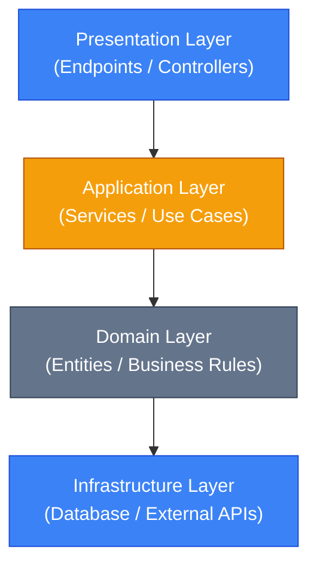
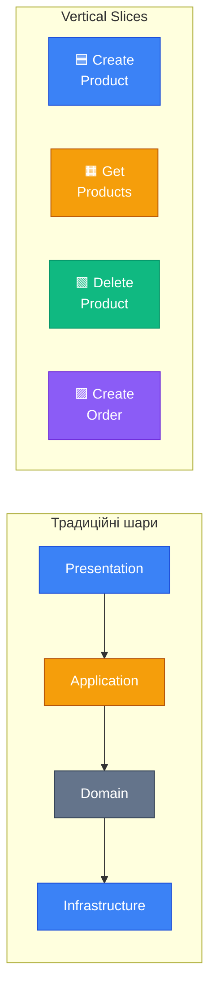
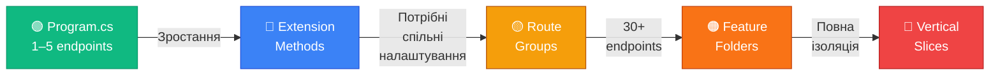

# Структура проєкту: від хаосу до архітектури

::note
Протягом 14 попередніх розділів ми дописували весь код у `Program.cs`. Для навчання це зручно, але для реального проєкту — катастрофа. У цьому розділі ми пройдемо **еволюцію організації** Minimal API проєкту: від єдиного файлу через Extension Methods та Route Groups до Feature Folders та Vertical Slice Architecture. Кожен крок — це відповідь на конкретний біль, який виникає при зростанні проєкту.

::

---

## 1. Проблема: єдиний Program.cs

Уявіть, що ви створили API для інтернет-магазину. Спочатку це було 3 ендпоінти — все поміщалось на одному екрані:

```csharp [Program.cs — початок]
var builder = WebApplication.CreateBuilder(args);
var app = builder.Build();

app.MapGet("/products", () => "Products list");
app.MapGet("/products/{id}", (int id) => $"Product {id}");
app.MapPost("/products", () => "Created");

app.Run();
```

Через місяць — 15 ендпоінтів. Через квартал — 40. `Program.cs` розростається до **1000+ рядків**. Ви витрачаєте 5 хвилин, щоб знайти потрібний ендпоінт. Колега одночасно редагує той самий файл — привіт, конфлікти злиття (merge conflicts) у Git.

::warning
**Правило з практики:** якщо `Program.cs` перевищує **100 рядків** — це сигнал до рефакторингу. Код, який вимагає прокрутки більш ніж на 2-3 екрани, значно складніше підтримувати.

::

Як вирішити цю проблему? Існує **послідовна еволюція** підходів — кожен наступний крок додає більше структури:

| Крок | Підхід                      | Коли використовувати                                   |
| :--- | :-------------------------- | :----------------------------------------------------- |
| 1    | Extension Methods           | 5–15 ендпоінтів, малий проєкт                          |
| 2    | Route Groups                | 15–30 ендпоінтів, потрібні спільні префікси та фільтри |
| 3    | Feature Folders             | 30+ ендпоінтів, середній проєкт                        |
| 4    | Vertical Slice Architecture | Великий проєкт, де потрібна повна ізоляція фіч         |

---

## 2. Крок 1: Extension Methods — виносимо ендпоінти

### Ідея

Найпростіший спосіб розвантажити `Program.cs` — **перенести групи ендпоінтів** у окремі файли за допомогою методів розширення (Extension Methods). Кожна сутність (Products, Orders, Users) отримує свій файл.

### Реалізація

::steps

### Створюємо файл для ендпоінтів

Створіть папку `Endpoints/` і файл `ProductEndpoints.cs`:

```csharp [Endpoints/ProductEndpoints.cs]
public static class ProductEndpoints
{
    public static WebApplication MapProductEndpoints(
        this WebApplication app)
    {
        app.MapGet("/products", GetAll);
        app.MapGet("/products/{id}", GetById);
        app.MapPost("/products", Create);
        app.MapPut("/products/{id}", Update);
        app.MapDelete("/products/{id}", Delete);

        return app;  // Для ланцюжкового виклику
    }

    private static IResult GetAll()
    {
        // Логіка отримання списку товарів
        return Results.Ok(new[] {
            new { Id = 1, Name = "Кава" },
            new { Id = 2, Name = "Чай" }
        });
    }

    private static IResult GetById(int id)
    {
        return Results.Ok(new { Id = id, Name = "Кава" });
    }

    private static IResult Create(ProductRequest req)
    {
        return Results.Created(
            $"/products/{1}", new { Id = 1, req.Name });
    }

    private static IResult Update(int id,
        ProductRequest req)
    {
        return Results.Ok(new { Id = id, req.Name });
    }

    private static IResult Delete(int id)
    {
        return Results.NoContent();
    }
}

record ProductRequest(string Name, decimal Price);
```

### Підключаємо в Program.cs

```csharp [Program.cs — чистий і лаконічний]
var builder = WebApplication.CreateBuilder(args);
var app = builder.Build();

// Кожна сутність — один рядок! ✨
app.MapProductEndpoints();
app.MapOrderEndpoints();
app.MapUserEndpoints();

app.Run();
```

::

### Структура проєкту

::code-tree

```csharp [Program.cs]
var builder = WebApplication.CreateBuilder(args);
var app = builder.Build();

app.MapProductEndpoints();
app.MapOrderEndpoints();
app.MapUserEndpoints();

app.Run();
```

```csharp [Endpoints/ProductEndpoints.cs]
public static class ProductEndpoints
{
    public static WebApplication MapProductEndpoints(
        this WebApplication app)
    {
        app.MapGet("/products", GetAll);
        // ...
        return app;
    }
}
```

```csharp [Endpoints/OrderEndpoints.cs]
public static class OrderEndpoints
{
    public static WebApplication MapOrderEndpoints(
        this WebApplication app)
    {
        app.MapGet("/orders", GetAll);
        // ...
        return app;
    }
}
```

```csharp [Endpoints/UserEndpoints.cs]
public static class UserEndpoints
{
    public static WebApplication MapUserEndpoints(
        this WebApplication app)
    {
        app.MapGet("/users", GetAll);
        // ...
        return app;
    }
}
```

::

Ключовий прийом: замість анонімних лямбд (`() => ...`) ми використовуємо **іменовані приватні методи** (`GetAll`, `GetById`). Це полегшує читання, дебагінг та навігацію коду у IDE.

::tip
**Повертаємо `WebApplication`** з extension method — це дозволяє ланцюжковий виклик: `app.MapProductEndpoints().MapOrderEndpoints()`. Такий патерн називається **fluent interface** і широко використовується в ASP.NET Core.

::

---

## 3. Крок 2: Route Groups — спільні налаштування

### Проблема

С Extension Methods ми розв'язали проблему великого `Program.cs`. Але з'являється нова: **дублювання префіксів і конфігурації**:

```csharp [❌ Повторення "/products" у кожному рядку]
app.MapGet("/products", GetAll);
app.MapGet("/products/{id}", GetById);
app.MapPost("/products", Create);
app.MapPut("/products/{id}", Update);
app.MapDelete("/products/{id}", Delete);
// Якщо потрібно перейменувати "/products"
// на "/catalog" — 5 правок 😩
```

А якщо ми хочемо додати авторизацію для всіх ендпоінтів товарів? Доведеться писати `.RequireAuthorization()` на **кожному** рядку.

### Рішення: MapGroup

`MapGroup` (Групи маршрутів) — вбудований механізм ASP.NET Core для групування ендпоінтів зі спільним префіксом і конфігурацією:

```csharp [Endpoints/ProductEndpoints.cs — з MapGroup]
public static class ProductEndpoints
{
    public static WebApplication MapProductEndpoints(
        this WebApplication app)
    {
        // Створюємо групу з префіксом "/products"
        var group = app.MapGroup("/products")
            .WithTags("Products");  // для OpenAPI/Swagger

        group.MapGet("/", GetAll);
        group.MapGet("/{id}", GetById);
        group.MapPost("/", Create);
        group.MapPut("/{id}", Update);
        group.MapDelete("/{id}", Delete);

        return app;
    }

    private static IResult GetAll() =>
        Results.Ok(new[] { "Кава", "Чай" });

    private static IResult GetById(int id) =>
        Results.Ok(new { Id = id });

    private static IResult Create(ProductRequest req) =>
        Results.Created($"/products/1", req);

    private static IResult Update(
        int id, ProductRequest req) =>
        Results.Ok(new { Id = id, req.Name });

    private static IResult Delete(int id) =>
        Results.NoContent();
}
```

Тепер `"/products"` написано **один раз**. Якщо потрібно перейменувати — одна правка.

### Версіонування через вкладені групи

Групи можна **вкладати** одна в одну. Це ідеально для версіонування API:

```csharp [Program.cs — API версіонування]
var builder = WebApplication.CreateBuilder(args);
var app = builder.Build();

// Група верхнього рівня: /api/v1
var v1 = app.MapGroup("/api/v1");

v1.MapProductEndpoints();   // → /api/v1/products/...
v1.MapOrderEndpoints();     // → /api/v1/orders/...

// Нова версія: /api/v2
var v2 = app.MapGroup("/api/v2");

v2.MapProductEndpointsV2(); // → /api/v2/products/...

app.Run();
```

```csharp [Endpoints/ProductEndpoints.cs — приймає RouteGroupBuilder]
public static class ProductEndpoints
{
    // Тепер метод розширює RouteGroupBuilder, не WebApplication
    public static RouteGroupBuilder MapProductEndpoints(
        this RouteGroupBuilder group)
    {
        var products = group.MapGroup("/products")
            .WithTags("Products");

        products.MapGet("/", GetAll);
        products.MapGet("/{id}", GetById);

        return group;
    }

    // ...
}
```

### Спільна конфігурація групи

Найпотужніша можливість `MapGroup` — застосування конфігурації до **всіх** ендпоінтів групи одразу:

```csharp [Спільна конфігурація для групи]
var admin = app.MapGroup("/admin")
    .RequireAuthorization("AdminPolicy") // Авторизація
    .AddEndpointFilter<LoggingFilter>()  // Логування
    .WithOpenApi();                      // OpenAPI-метадані

admin.MapGet("/users", GetUsers);       // Захищено!
admin.MapDelete("/users/{id}", DeleteUser); // Захищено!
// Не потрібно дублювати .RequireAuthorization()
// для кожного ендпоінту!
```

---

## 4. Крок 3: Feature Folders — організація за фічами

### Проблема

Extension Methods та Route Groups вирішують проблему великого `Program.cs`, але при зростанні проєкту з'являється нова проблема — **папка Endpoints/ росте безконтрольно**:

```
MyApi/
├── Endpoints/
│   ├── ProductEndpoints.cs        ← 15 ендпоінтів
│   ├── OrderEndpoints.cs          ← 12 ендпоінтів
│   ├── UserEndpoints.cs           ← 8 ендпоінтів
│   ├── CartEndpoints.cs
│   ├── PaymentEndpoints.cs
│   └── ... (ще 10 файлів)
├── Models/
│   ├── Product.cs
│   ├── Order.cs
│   ├── User.cs
│   └── ... (ще 15 файлів)
├── Services/
│   ├── ProductService.cs
│   ├── OrderService.cs
│   └── ... (ще 10 файлів)
└── Program.cs
```

Ця структура називається **організація за технічним типом** (Technical Type Organization): усі ендпоінти — в одній папці, усі моделі — в іншій, усі сервіси — у третій. При роботі над фічою «Товари» ви стрибаєте між 3 папками (`Endpoints/ProductEndpoints.cs` → `Models/Product.cs` → `Services/ProductService.cs`).

### Рішення: організація за фічами

У підході **Feature Folders** (організація за фічами) весь код, що стосується однієї сутності чи фічі, живе **в одній папці**:

::code-tree

```csharp [Features/Products/ProductEndpoints.cs]
public static class ProductEndpoints
{
    public static RouteGroupBuilder MapProductEndpoints(
        this RouteGroupBuilder group)
    {
        var products = group.MapGroup("/products");
        products.MapGet("/", GetAll);
        products.MapGet("/{id}", GetById);
        products.MapPost("/", Create);
        return group;
    }

    private static IResult GetAll(ProductService svc) =>
        Results.Ok(svc.GetAll());

    private static IResult GetById(
        int id, ProductService svc) =>
        svc.GetById(id) is { } product
            ? Results.Ok(product)
            : Results.NotFound();

    private static IResult Create(
        ProductRequest req, ProductService svc)
    {
        var product = svc.Create(req);
        return Results.Created(
            $"/products/{product.Id}", product);
    }
}
```

```csharp [Features/Products/Product.cs]
public class Product
{
    public int Id { get; set; }
    public string Name { get; set; } = string.Empty;
    public decimal Price { get; set; }
}
```

```csharp [Features/Products/ProductRequest.cs]
public record ProductRequest(string Name, decimal Price);
```

```csharp [Features/Products/ProductService.cs]
public class ProductService
{
    private static readonly List<Product> _products = [
        new() { Id = 1, Name = "Кава", Price = 120 },
        new() { Id = 2, Name = "Чай", Price = 80 }
    ];

    public List<Product> GetAll() => _products;

    public Product? GetById(int id) =>
        _products.Find(p => p.Id == id);

    public Product Create(ProductRequest req)
    {
        var product = new Product
        {
            Id = _products.Count + 1,
            Name = req.Name,
            Price = req.Price
        };
        _products.Add(product);
        return product;
    }
}
```

```csharp [Features/Orders/OrderEndpoints.cs]
public static class OrderEndpoints
{
    // ...
}
```

```csharp [Features/Orders/Order.cs]
public class Order { /* ... */ }
```

```csharp [Program.cs]
var builder = WebApplication.CreateBuilder(args);
builder.Services.AddScoped<ProductService>();
builder.Services.AddScoped<OrderService>();

var app = builder.Build();

var api = app.MapGroup("/api/v1");
api.MapProductEndpoints();
api.MapOrderEndpoints();

app.Run();
```

::

### Порівняння двох підходів

::tabs

::tabs-item{label="За типом (Traditional)" icon="i-lucide-folder-tree"}

```
MyApi/
├── Endpoints/
│   ├── ProductEndpoints.cs
│   ├── OrderEndpoints.cs
│   └── UserEndpoints.cs
├── Models/
│   ├── Product.cs
│   ├── Order.cs
│   └── User.cs
├── Services/
│   ├── ProductService.cs
│   ├── OrderService.cs
│   └── UserService.cs
└── Program.cs
```

**Мінуси:**

- Робота над фічою = стрибання між 3+ папками
- 1 файл Git-конфлікт = блокує всю команду
- Важко видалити фічу — код розмазаний по всій структурі

::

::tabs-item{label="За фічами (Feature Folders)" icon="i-lucide-folder-open"}

```
MyApi/
├── Features/
│   ├── Products/
│   │   ├── ProductEndpoints.cs
│   │   ├── Product.cs
│   │   ├── ProductRequest.cs
│   │   └── ProductService.cs
│   ├── Orders/
│   │   ├── OrderEndpoints.cs
│   │   ├── Order.cs
│   │   └── OrderService.cs
│   └── Users/
│       └── ...
└── Program.cs
```

**Переваги:**

- Все для фічі — в одному місці
- Git-конфлікти — тільки всередині фічі
- Видалити фічу = видалити одну папку

::

::

::tip
**Практичне правило:** організація за фічами стає вигідною, коли у проєкті **більше 3 сутностей** і **більше одного розробника**. Для невеликих проєктів Extension Methods + Route Groups цілком достатньо.

::

---

## 5. Крок 4: Vertical Slice Architecture

### Проблема: горизонтальні шари

Усі попередні підходи все ще мають одну спільну рису: вони організують код або за **технічним типом** (Endpoints, Models, Services), або за **сутністю** (Products, Orders). Але навіть у Feature Folders ви маєте окремий `ProductService`, окремий `ProductEndpoints`, окремий `ProductRequest`. Зміна одного use case (наприклад, «Створити товар») вимагає правок у 3 файлах.

У класичній **багатошаровій архітектурі** (Layered Architecture) код організований горизонтально:

::mermaid



::

Одна фіча (наприклад, «Створити товар») **розрізана** на 4 шари. Щоб зрозуміти, як працює створення товару, ви маєте відкрити 4 файли в 4 різних папках.

### Вертикальний зріз: альтернативний підхід

**Vertical Slice Architecture** (VSA, «Архітектура вертикальних зрізів») — це підхід, запропонований Джиммі Богардом (Jimmy Bogard), автором бібліотеки MediatR. Ідея: замість горизонтальних шарів, які проходять через увесь додаток, ми розрізаємо додаток **вертикально** — кожен зріз (slice) — це повна реалізація одного use case від HTTP-запиту до бази даних.

::mermaid



::

У вертикальному зрізі **кожен use case** — це самодостатня одиниця: endpoint, request/response DTO, валідація і логіка — все **в одному файлі** (або в одній маленькій папці).

### Реалізація: один зріз = один файл

Кожна операція стає окремим статичним класом:

```csharp [Features/Products/CreateProduct.cs]
public static class CreateProduct
{
    // 1. Що приходить від клієнта
    public record Request(string Name, decimal Price);

    // 2. Що повертаємо клієнту
    public record Response(int Id, string Name,
        decimal Price);

    // 3. Маппінг ендпоінту
    public static void Map(RouteGroupBuilder group)
    {
        group.MapPost("/", Handler);
    }

    // 4. Вся логіка — тут
    private static IResult Handler(
        Request request, AppDbContext db)
    {
        // Валідація
        if (string.IsNullOrWhiteSpace(request.Name))
            return Results.ValidationProblem(
                new Dictionary<string, string[]>
                {
                    ["name"] = ["Name is required."]
                });

        if (request.Price < 0)
            return Results.ValidationProblem(
                new Dictionary<string, string[]>
                {
                    ["price"] = [
                        "Price cannot be negative."]
                });

        // Створення
        var product = new Product
        {
            Name = request.Name,
            Price = request.Price
        };

        db.Products.Add(product);
        db.SaveChanges();

        // Відповідь
        var response = new Response(
            product.Id, product.Name, product.Price);

        return Results.Created(
            $"/products/{product.Id}", response);
    }
}
```

```csharp [Features/Products/GetProducts.cs]
public static class GetProducts
{
    public record Response(int Id, string Name,
        decimal Price);

    public static void Map(RouteGroupBuilder group)
    {
        group.MapGet("/", Handler);
    }

    private static IResult Handler(AppDbContext db)
    {
        var products = db.Products
            .Select(p => new Response(
                p.Id, p.Name, p.Price))
            .ToList();

        return Results.Ok(products);
    }
}
```

```csharp [Features/Products/GetProductById.cs]
public static class GetProductById
{
    public record Response(int Id, string Name,
        decimal Price);

    public static void Map(RouteGroupBuilder group)
    {
        group.MapGet("/{id}", Handler);
    }

    private static IResult Handler(int id,
        AppDbContext db)
    {
        var product = db.Products.Find(id);
        if (product is null)
            return Results.NotFound();

        return Results.Ok(new Response(
            product.Id, product.Name, product.Price));
    }
}
```

```csharp [Features/Products/DeleteProduct.cs]
public static class DeleteProduct
{
    public static void Map(RouteGroupBuilder group)
    {
        group.MapDelete("/{id}", Handler);
    }

    private static IResult Handler(int id,
        AppDbContext db)
    {
        var product = db.Products.Find(id);
        if (product is null)
            return Results.NotFound();

        db.Products.Remove(product);
        db.SaveChanges();

        return Results.NoContent();
    }
}
```

### Реєстрація у Program.cs

```csharp [Program.cs — з VSA]
var builder = WebApplication.CreateBuilder(args);
builder.Services.AddDbContext<AppDbContext>(opt =>
    opt.UseInMemoryDatabase("Shop"));

var app = builder.Build();

var products = app.MapGroup("/api/v1/products")
    .WithTags("Products");

// Кожен зріз реєструє себе
CreateProduct.Map(products);
GetProducts.Map(products);
GetProductById.Map(products);
DeleteProduct.Map(products);

app.Run();
```

### Структура проєкту з VSA

::code-tree

```csharp [Features/Products/CreateProduct.cs]
public static class CreateProduct
{
    public record Request(string Name, decimal Price);
    public record Response(int Id, string Name, decimal Price);
    // Endpoint + Handler + Validation — все тут
}
```

```csharp [Features/Products/GetProducts.cs]
public static class GetProducts { /* ... */ }
```

```csharp [Features/Products/GetProductById.cs]
public static class GetProductById { /* ... */ }
```

```csharp [Features/Products/DeleteProduct.cs]
public static class DeleteProduct { /* ... */ }
```

```csharp [Features/Products/Product.cs]
public class Product
{
    public int Id { get; set; }
    public string Name { get; set; } = "";
    public decimal Price { get; set; }
}
```

```csharp [Features/Orders/CreateOrder.cs]
public static class CreateOrder { /* ... */ }
```

```csharp [Features/Orders/GetOrders.cs]
public static class GetOrders { /* ... */ }
```

```csharp [Data/AppDbContext.cs]
public class AppDbContext : DbContext { /* ... */ }
```

```csharp [Program.cs]
// Реєстрація зрізів
CreateProduct.Map(products);
GetProducts.Map(products);
// ...
```

::

### Переваги VSA

::card-group

::card{title="Висока когезія" icon="i-lucide-puzzle"}
Весь код для одного use case — в одному файлі. Відкрив `CreateProduct.cs` — побачив **все**: request, response, валідацію, бізнес-логіку, endpoint.

::

::card{title="Ізоляція змін" icon="i-lucide-shield"}
Зміна логіки створення товару не зачіпає `GetProducts` або `DeleteProduct`. Ризик побічних ефектів (side effects) мінімальний.

::

::card{title="CQRS безкоштовно" icon="i-lucide-split"}
Кожен зріз — це або команда (Command: Create, Update, Delete), або запит (Query: Get). Це дає CQRS (Command Query Responsibility Segregation) без додаткових бібліотек.

::

::card{title="Простота видалення" icon="i-lucide-trash-2"}
Видалити фічу = видалити один файл. Жоден інший файл не зламається. Порівняйте з багатошаровою архітектурою, де видалення Controller'а вимагає очищення Service, Repository, DTO.

::

::

### Спільна логіка: що робити з дублюванням?

Одне з найчастіших запитань до VSA: «А якщо два зрізи мають спільну логіку?» Ось чотири стратегії:

::accordion

::accordion-item{label="1. Extract Method — спільні методи" icon="i-lucide-code"}
Якщо кілька зрізів використовують однакову логіку (наприклад, перевірку існування товару), виділіть її у спільний статичний метод:

```csharp
// Shared/ProductHelpers.cs
public static class ProductHelpers
{
    public static Product? FindOrNull(
        AppDbContext db, int id)
        => db.Products.Find(id);
}
```

::

::accordion-item{label="2. Extension Methods — розширення типів" icon="i-lucide-puzzle"}
Для операцій з `AppDbContext` або `HttpContext`, які повторюються:

```csharp
public static class DbContextExtensions
{
    public static Product? FindProduct(
        this AppDbContext db, int id)
        => db.Products.Find(id);
}
```

::

::accordion-item{label="3. Shared Services — спільні сервіси" icon="i-lucide-server"}
Для складної бізнес-логіки, що використовується кількома зрізами (наприклад, підрахунок знижок):

```csharp
public class PricingService
{
    public decimal CalculateDiscount(
        Product product, string promoCode)
    {
        // Складна логіка знижок
        return product.Price * 0.9m;
    }
}
```

::

::accordion-item{label="4. Push logic down — логіка в сутностях" icon="i-lucide-arrow-down"}
Перенесіть бізнес-правила у доменні сутності:

```csharp
public class Product
{
    public decimal Price { get; set; }

    public bool CanBeDiscounted()
        => Price > 100;

    public decimal ApplyDiscount(decimal percent)
        => Price * (1 - percent / 100);
}
```

Тоді кожен зріз просто викликає методи сутності, без дублювання логіки.

::

::

### Автоматична реєстрація зрізів

Замість ручної реєстрації кожного зрізу в `Program.cs` можна створити інтерфейс та зибрати всі реалізації через рефлексію:

```csharp [IEndpoint — інтерфейс для автореєстрації]
// Shared/IEndpoint.cs
public interface IEndpoint
{
    static abstract void Map(RouteGroupBuilder group);
}

// Features/Products/CreateProduct.cs
public static class CreateProduct : IEndpoint
{
    public record Request(string Name, decimal Price);

    public static void Map(RouteGroupBuilder group)
    {
        group.MapPost("/", Handler);
    }

    private static IResult Handler(Request req,
        AppDbContext db)
    {
        // ...
        return Results.Created("/products/1", req);
    }
}
```

```csharp [Program.cs — автоматична реєстрація]
var builder = WebApplication.CreateBuilder(args);
var app = builder.Build();

var products = app.MapGroup("/api/v1/products");

// Знаходимо всі класи, що реалізують IEndpoint
var endpointTypes = typeof(Program).Assembly
    .GetTypes()
    .Where(t => t.GetInterfaces().Any(
        i => i == typeof(IEndpoint)))
    .ToList();

foreach (var type in endpointTypes)
{
    // Викликаємо статичний метод Map
    var method = type.GetMethod("Map");
    method?.Invoke(null, [products]);
}

app.Run();
```

::warning
Автоматична реєстрація через рефлексію зручна, але має нюанси: потрібно фільтрувати зрізи за групами (Products vs Orders), щоб не зареєструвати все під одним префіксом. Для реальних проєктів розгляньте бібліотеку [Carter](https://github.com/CarterCommunity/Carter), яка вирішує цю задачу елегантно.

::

---

## 6. Порівняння підходів: коли що обрати?

| Критерій                  | Extension Methods | Route Groups     | Feature Folders    | Vertical Slices |
| :------------------------ | :---------------- | :--------------- | :----------------- | :-------------- |
| **Складність**            | Мінімальна        | Низька           | Середня            | Вище середнього |
| **Ідеальний розмір**      | 5–15 ендпоінтів   | 15–30 ендпоінтів | 30–60 ендпоінтів   | 60+ ендпоінтів  |
| **Команда**               | 1–2 розробника    | 2–3 розробника   | 3–5 розробників    | 5+ розробників  |
| **Зв'язність (coupling)** | Середня           | Середня          | Низька             | Мінімальна      |
| **Ізоляція змін**         | Низька            | Середня          | Висока             | Максимальна     |
| **Крива навчання**        | Мінімальна        | Мінімальна       | Потрібні конвенції | Зміна мислення  |

::mermaid



::

::tip
**Золоте правило еволюції:** починайте з найпростішого підходу (Extension Methods) і ускладнюйте **тільки коли відчуєте біль**. Якщо навігація кодом і merge-конфлікти стають проблемою — переходьте на наступний рівень. Не використовуйте Vertical Slices для pet-проєкту з 5 ендпоінтами — це **передчасна оптимізація** архітектури.

::

---

## 7. Практичні завдання

### Рівень 1: Базовий

::accordion

::accordion-item{label="Завдання 15.1: Extension Methods" icon="i-lucide-circle-help"}
Перенесіть наступні ендпоінти з `Program.cs` у окремий файл `BookEndpoints.cs`:

1. `GET /books` — повертає список книг
2. `GET /books/{id}` — повертає книгу за ID
3. `POST /books` — створює книгу
4. `DELETE /books/{id}` — видаляє книгу

Використайте extension method для `WebApplication`. `Program.cs` має містити лише `app.MapBookEndpoints()`.

::

::accordion-item{label="Завдання 15.2: Route Groups" icon="i-lucide-circle-help"}
Перепишіть попередній приклад з `MapGroup`:

1. Створіть групу `/api/v1/books` з тегом `"Books"`
2. Ендпоінти мають використовувати відносні шляхи (`/`, `/{id}`)
3. Додайте другу групу `/api/v1/authors` з ендпоінтами `GET /` та `POST /`
4. Переконайтесь, що зміна префіксу `/api/v1` → `/api/v2` вимагає правки **в одному місці**

::

::

### Рівень 2: Проєктування

::accordion

::accordion-item{label="Завдання 15.3: Feature Folders" icon="i-lucide-circle-help"}
Створіть структуру Feature Folders для API бібліотеки:

1. `Features/Books/` — модель `Book`, DTO `BookRequest`, ендпоінти CRUD, сервіс `BookService`
2. `Features/Authors/` — модель `Author`, DTO `AuthorRequest`, ендпоінти CRUD, сервіс `AuthorService`
3. `Program.cs` — реєстрація сервісів та ендпоінтів
4. Кожна фіча — повністю автономна (все в одній папці)

::

::

### Рівень 3: Архітектура

::accordion

::accordion-item{label="Завдання 15.4: Vertical Slice Architecture" icon="i-lucide-circle-help"}
Реалізуйте API для ToDo-додатку за паттерном Vertical Slices:

1. Кожна операція — окремий файл: `CreateTodo.cs`, `GetTodos.cs`, `GetTodoById.cs`, `CompleteTodo.cs`, `DeleteTodo.cs`
2. У кожному файлі: `Request`/`Response` record, метод `Map()`, приватний `Handler()`
3. Використовуйте `InMemoryDatabase` через Entity Framework Core
4. Кожен зріз має власну валідацію: `CreateTodo` — перевіряє що `Title` не порожній, `CompleteTodo` — перевіряє що todo існує
5. `Program.cs` — не більше 20 рядків (тільки реєстрація)
6. Бонус: створіть інтерфейс `IEndpoint` та автоматичну реєстрацію через рефлексію

::

::

---

## 8. Резюме

::card-group

::card{title="Еволюція, не революція" icon="i-lucide-trending-up"}
Починайте з Extension Methods → Route Groups → Feature Folders → Vertical Slices. Кожен крок — відповідь на реальний біль, а не "на виріст".

::

::card{title="Route Groups — потужність" icon="i-lucide-group"}
MapGroup дає спільний префікс, авторизацію, фільтри та OpenAPI-теги для всіх ендпоінтів групи. Вкладені групи — для версіонування.

::

::card{title="Feature Folders — cohesion" icon="i-lucide-folder-open"}
Весь код для фічі — в одній папці. Видалити фічу = видалити папку. Git-конфлікти — тільки всередині фічі.

::

::card{title="VSA — максимальна ізоляція" icon="i-lucide-layers"}
Кожен use case — самодостатній файл із Request, Response, валідацією та логікою. CQRS безкоштовно. Зміна одного зрізу не зачіпає інші.

::

::

**Далі:** коли структура проєкту вже не розвалюється, наступний логічний крок — навчитися показувати свій API зовнішньому світу. Для цього переходьте до матеріалу про [Scalar у Minimal API та Fluent OpenAPI](./16.scalar-openapi-fluent).
