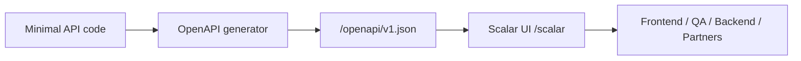
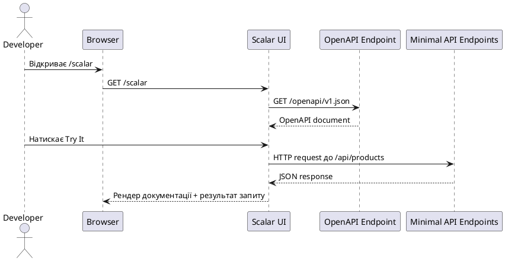

# Scalar у Minimal API: повний проєкт і Fluent OpenAPI

::badge{color="green"}
.NET 9+ Recommended
::

::note
У попередніх розділах ми вчилися будувати `Minimal API`, групувати маршрути, організовувати проєкт і проектувати HTTP-контракти. Але в реальному житті цього недостатньо. Команда бекенду не може просто сказати фронтенду: «дивись у `Program.cs`». Потрібна **жива документація**, яка будується з реального коду, оновлюється разом із ним і дозволяє одразу тестувати endpoint-и. Саме тут у гру входить **Scalar**.

У цьому матеріалі ми не будемо використовувати атрибути на кшталт `[Produces]`, `[Tags]`, `[EndpointSummary]` або `[Description]`. Усе, що стосується документації, ми зробимо через **Fluent API**: `WithSummary()`, `Produces()`, `Accepts()`, `WithOpenApi()`, `MapGroup()`, `AddOpenApi(...)` transformers і `MapScalarApiReference(...)`.

::

::card-group

::card{title="Що побудуємо" icon="i-lucide-target"}

- Minimal API проєкт, який можна створити з нуля через `dotnet new web`
- OpenAPI-документ на маршруті `/openapi/v1.json`
- Scalar UI на маршруті `/scalar`
- Групу endpoint-ів `/api/products` з повним Fluent-описом metadata

::

::card{title="Що розберемо" icon="i-lucide-book-open"}

- усі основні Fluent-методи опису endpoint-ів;
- різницю між локальним, груповим і глобальним рівнем metadata;
- `WithOpenApi(...)` для тонкого налаштування операції;
- OpenAPI transformers для параметрів, схем і документа в цілому;
- конфігурацію самого Scalar через `MapScalarApiReference(...)`.

::

::card{title="Результат наприкінці" icon="i-lucide-eye"}

- у браузері відкривається `https://localhost:{port}/scalar`;
- у Scalar видно summaries, descriptions, tags, operation id, request/response schemas;
- документація відображає реальні статус-коди, тіла запитів і помилок;
- все зібрано без атрибутів.

::

::

::callout{icon="i-lucide-info" color="primary"}
Стаття свідомо фокусується на `Minimal API + OpenAPI + Scalar`. Якщо вам потрібна окрема теорія про сам стандарт OpenAPI, дивіться [матеріал про OpenAPI як контракт](../02.api/14.openapi).
::

---

## 1. Що таке Scalar і чому не достатньо просто `openapi.json`

Коли ви вмикаєте OpenAPI в ASP.NET Core, ви отримуєте **машиночитаний документ**. Це чудово для генераторів клієнтів, тестів і контрактних перевірок. Але для людини сирий JSON на кшталт `/openapi/v1.json` незручний:

- його важко читати очима;
- ним незручно ділитися з QA або фронтендом;
- з нього не дуже зручно робити ручні пробні запити;
- він не дає якісного UX документації.

**Scalar** вирішує саме цю проблему. Він бере OpenAPI-документ і рендерить з нього інтерактивний reference UI.

::mermaid



::

Ключова думка: **Scalar не вигадує контракт сам**. Він лише красиво і зручно показує той OpenAPI-документ, який ви згенерували з коду або з контракту.

::warning
Якщо metadata на endpoint-ах бідна або неточна, Scalar не «врятує» документацію. Він чесно покаже саме те, що ви задали. Тому основна робота відбувається не в самому Scalar, а в тому, **як ви описали endpoint-и**.

::

---

## 2. Який стек ми беремо для відтворюваного проєкту

У 2026 році для нового навчального прикладу найрозумніший стартовий варіант такий:

::field-group
::field{name=".NET SDK" type="string" required=true}
Рекомендовано `.NET 9` або новіше. Саме з `.NET 9` у ASP.NET Core є вбудована підтримка `AddOpenApi()` і `MapOpenApi()`.
::
::field{name="OpenAPI generator" type="package" required=true}
`Microsoft.AspNetCore.OpenApi` для генерації OpenAPI-документа з `Minimal API`.
::
::field{name="Scalar UI" type="package" required=true}
`Scalar.AspNetCore` для рендерингу документації на маршруті `/scalar`.
::
::field{name="Style of metadata" type="string" required=true}
Тільки **Fluent API**. Без атрибутів на handler-ах і DTO.
::
::

::tip{title="Практичний вибір"}
Для нового проєкту `Minimal API + AddOpenApi + Scalar.AspNetCore` дає чистіший стек, ніж старий маршрут через `SwaggerGen` як основну інтеграцію. Це не означає, що `Swashbuckle` поганий; це означає, що для навчального прикладу з акцентом на сучасний ASP.NET Core простіше починати з вбудованого OpenAPI API.
::

### Сумісність: рекомендований і legacy-шлях

::tabs

::tabs-item{label="Рекомендовано: .NET 9+" icon="i-lucide-sparkles"}
Використовуємо:

- `builder.Services.AddOpenApi()`
- `app.MapOpenApi()`
- `app.MapScalarApiReference()`

Це і є основний шлях у цій статті.

::

::tabs-item{label="Legacy: .NET 8" icon="i-lucide-history"}
Якщо ви сидите на `.NET 8`, Scalar теж можна підключити, але зазвичай через генератор на кшталт `Swashbuckle.AspNetCore`:

```csharp
builder.Services.AddEndpointsApiExplorer();
builder.Services.AddSwaggerGen();

if (app.Environment.IsDevelopment())
{
    app.MapSwagger("/openapi/{documentName}.json");
    app.MapScalarApiReference();
}
```

Усе інше в статті про Fluent metadata майже повністю зберігає цінність, але точні інтеграційні точки OpenAPI будуть трохи іншими.

::

::

::caution
Нижче ми будуємо **один конкретний відтворюваний проєкт**. Якщо ви вирішите повторювати його покроково, не змішуйте .NET 9+ підхід з legacy-конфігурацією для .NET 8 в одному `Program.cs`.

::

---

## 3. Що саме побачить читач у кінці

Ми збудуємо невеликий каталог продуктів із такими endpoint-ами:

| Метод | Маршрут | Навіщо потрібен |
|:---|:---|:---|
| `GET` | `/api/products` | список товарів з query-параметрами |
| `GET` | `/api/products/{id}` | читання одного товару |
| `POST` | `/api/products` | створення товару |
| `PUT` | `/api/products/{id}` | оновлення товару |
| `DELETE` | `/api/products/{id}` | видалення товару |
| `GET` | `/_internal/ping` | технічний маршрут, який ми **сховаємо** з документації |

У документації ми покажемо:

- `summary`;
- `description`;
- `tags`;
- `operationId`;
- `requestBody`;
- query і route parameters;
- `200`, `201`, `204`, `404`, `422`, `500`;
- моделі запитів і відповідей;
- кастомізацію OpenAPI-операцій через `WithOpenApi(...)`;
- глобальні доповнення через transformers.

::plant-uml



::

---

## 4. Створюємо проєкт з нуля

### Крок 1: Генерація шаблону

::code-group

```bash [macOS/Linux]
mkdir MinimalApiScalarDemo
cd MinimalApiScalarDemo
dotnet new web --framework net9.0
```

```powershell [Windows PowerShell]
mkdir MinimalApiScalarDemo
cd MinimalApiScalarDemo
dotnet new web --framework net9.0
```

::

### Крок 2: Додаємо пакети

```bash
dotnet add package Microsoft.AspNetCore.OpenApi
dotnet add package Scalar.AspNetCore
```

### Крок 3: Перший запуск для перевірки бази

::terminal-preview{title="dotnet run" :cursor="true"}
<div class="line"><span class="opacity-40">$</span> <strong class="font-bold">dotnet run</strong></div>
<div class="line"><span class="text-green-400 font-bold">Building...</span></div>
<div class="line">info: Microsoft.Hosting.Lifetime[14]</div>
<div class="line">Now listening on: <span class="text-blue-400 font-bold">https://localhost:7234</span></div>
<div class="line">info: Microsoft.Hosting.Lifetime[0]</div>
<div class="line">Application started. Press <span class="text-yellow-400 font-bold">Ctrl+C</span> to shut down.</div>
::

Поки що ми не побачимо ні `Scalar`, ні `OpenAPI`, бо ще нічого не підключали. Але важливо перевірити, що сам проєкт стартує.

::tip
Під час повторення прикладу працюйте через `dotnet watch`. Натискаєте :kbd{value="Ctrl"} + :kbd{value="S"} у редакторі, і сервер сам перезапускається. Це критично знижує тертя, коли ви налаштовуєте metadata endpoint-ів і одразу дивитесь результат у `/scalar`.

::

:icon{name="i-lucide-eye" class="inline-block align-text-bottom"} Увесь подальший сенс статті зводиться до одного критерію: після кожної зміни ви можете відкрити `/scalar` і **побачити**, як змінився контракт.

---

## 5. Структура проєкту

Ми не будемо складати всю логіку в один `Program.cs`. Для теми документації це погана ідея, бо змішаються:

- маршрути;
- бізнес-логіка;
- DTO;
- OpenAPI-конфігурація;
- Scalar-конфігурація.

Побудуємо ось таку структуру:

::code-tree

```xml [MinimalApiScalarDemo.csproj]
<Project Sdk="Microsoft.NET.Sdk.Web">
  <PropertyGroup>
    <TargetFramework>net9.0</TargetFramework>
    <Nullable>enable</Nullable>
    <ImplicitUsings>enable</ImplicitUsings>
  </PropertyGroup>

  <ItemGroup>
    <PackageReference Include="Microsoft.AspNetCore.OpenApi" Version="9.*" />
    <PackageReference Include="Scalar.AspNetCore" Version="*" />
  </ItemGroup>
</Project>
```

```csharp [Program.cs]
using Microsoft.AspNetCore.Http.HttpResults;
using Microsoft.OpenApi.Models;
using Scalar.AspNetCore;

var builder = WebApplication.CreateBuilder(args);

builder.Services.AddSingleton<ProductStore>();
builder.Services.AddOpenApi(options =>
{
    options.AddDocumentTransformer((document, context, cancellationToken) =>
    {
        document.Info.Title = "Minimal API + Scalar Demo";
        document.Info.Version = "v1";
        document.Info.Description =
            "Навчальний проєкт для демонстрації Scalar " +
            "та Fluent OpenAPI metadata.";

        document.Servers = new List<OpenApiServer>
        {
            new() { Url = "https://localhost:7234", Description = "HTTPS local" },
            new() { Url = "http://localhost:5234", Description = "HTTP local" }
        };

        return Task.CompletedTask;
    });

    options.AddSchemaTransformer((schema, context, cancellationToken) =>
    {
        if (context.JsonTypeInfo.Type == typeof(decimal))
        {
            schema.Format = "decimal";
            schema.Description = string.IsNullOrWhiteSpace(schema.Description)
                ? "Decimal monetary value."
                : schema.Description + " Decimal monetary value.";
        }

        return Task.CompletedTask;
    });

    options.AddOperationTransformer((operation, context, cancellationToken) =>
    {
        operation.Responses.TryAdd("500", new OpenApiResponse
        {
            Description = "Unexpected server error"
        });

        return Task.CompletedTask;
    });
});

var app = builder.Build();

if (app.Environment.IsDevelopment())
{
    app.MapOpenApi("/openapi/{documentName}.json")
        .AllowAnonymous();

    app.MapScalarApiReference("/scalar", options =>
    {
        options.WithTitle("Minimal API Scalar Demo")
               .WithOpenApiRoutePattern("/openapi/{documentName}.json")
               .WithDefaultHttpClient(ScalarTarget.CSharp, ScalarClient.HttpClient)
               .ShowOperationId()
               .ExpandAllTags()
               .SortTagsAlphabetically()
               .SortOperationsByMethod()
               .PreserveSchemaPropertyOrder();
    })
    .AllowAnonymous();
}

app.MapGet("/_internal/ping", () => TypedResults.Ok(new
{
    status = "ok",
    serverTime = DateTimeOffset.UtcNow
}))
.ExcludeFromDescription();

app.MapProductEndpoints();

app.Run();
```

```csharp [Features/Products/ProductContracts.cs]
public sealed record ProductListItemResponse(
    Guid Id,
    string Name,
    decimal Price,
    bool IsActive);

public sealed record ProductDetailsResponse(
    Guid Id,
    string Name,
    decimal Price,
    bool IsActive,
    DateTimeOffset CreatedAt);

public sealed record CreateProductRequest(
    string? Name,
    decimal Price,
    bool IsActive);

public sealed record UpdateProductRequest(
    string? Name,
    decimal Price,
    bool IsActive);
```

```csharp [Features/Products/ProductEndpoints.cs]
using Microsoft.AspNetCore.Http.HttpResults;
using Microsoft.OpenApi.Models;

public static class ProductEndpoints
{
    public static IEndpointRouteBuilder MapProductEndpoints(
        this IEndpointRouteBuilder app)
    {
        var group = app.MapGroup("/api/products")
            .WithTags("Products")
            .WithOpenApi();

        group.MapGet("/", GetProducts)
            .WithName("GetProducts")
            .WithSummary("Отримати список товарів")
            .WithDescription("Повертає каталог продуктів з optional query-фільтрами.")
            .Produces<IReadOnlyList<ProductListItemResponse>>(StatusCodes.Status200OK)
            .ProducesProblem(StatusCodes.Status500InternalServerError)
            .WithOpenApi(operation =>
            {
                var search = operation.Parameters.First(p => p.Name == "search");
                search.Description = "Пошук по фрагменту назви.";

                var includeInactive = operation.Parameters.First(p => p.Name == "includeInactive");
                includeInactive.Description = "Чи включати неактивні товари.";

                return operation;
            });

        group.MapGet("/{id:guid}", GetProductById)
            .WithName("GetProductById")
            .WithSummary("Отримати товар за ID")
            .WithDescription("Повертає розширену модель одного товару.")
            .Produces<ProductDetailsResponse>(StatusCodes.Status200OK)
            .Produces(StatusCodes.Status404NotFound)
            .ProducesProblem(StatusCodes.Status500InternalServerError)
            .WithOpenApi(operation =>
            {
                var id = operation.Parameters.First(p => p.Name == "id");
                id.Description = "GUID ідентифікатор товару.";
                return operation;
            });

        group.MapPost("/", CreateProduct)
            .WithName("CreateProduct")
            .WithSummary("Створити товар")
            .WithDescription("Створює новий товар у пам'яті та повертає його деталі.")
            .Accepts<CreateProductRequest>("application/json")
            .Produces<ProductDetailsResponse>(StatusCodes.Status201Created)
            .ProducesValidationProblem(StatusCodes.Status422UnprocessableEntity)
            .ProducesProblem(StatusCodes.Status500InternalServerError)
            .WithOpenApi(operation =>
            {
                operation.RequestBody!.Description = "JSON payload для створення товару.";
                return operation;
            });

        group.MapPut("/{id:guid}", UpdateProduct)
            .WithName("UpdateProduct")
            .WithSummary("Оновити товар")
            .WithDescription("Повністю оновлює стан товару за ідентифікатором.")
            .Accepts<UpdateProductRequest>("application/json")
            .Produces<ProductDetailsResponse>(StatusCodes.Status200OK)
            .Produces(StatusCodes.Status404NotFound)
            .ProducesValidationProblem(StatusCodes.Status422UnprocessableEntity)
            .ProducesProblem(StatusCodes.Status500InternalServerError);

        group.MapDelete("/{id:guid}", DeleteProduct)
            .WithName("DeleteProduct")
            .WithSummary("Видалити товар")
            .WithDescription("Видаляє товар і повертає 204 без тіла відповіді.")
            .Produces(StatusCodes.Status204NoContent)
            .Produces(StatusCodes.Status404NotFound)
            .ProducesProblem(StatusCodes.Status500InternalServerError);

        return app;
    }

    private static Ok<IReadOnlyList<ProductListItemResponse>> GetProducts(
        string? search,
        bool includeInactive,
        ProductStore store)
    {
        var items = store.GetAll(search, includeInactive)
            .Select(p => new ProductListItemResponse(
                p.Id,
                p.Name,
                p.Price,
                p.IsActive))
            .ToList();

        return TypedResults.Ok<IReadOnlyList<ProductListItemResponse>>(items);
    }

    private static Results<Ok<ProductDetailsResponse>, NotFound> GetProductById(
        Guid id,
        ProductStore store)
    {
        var product = store.GetById(id);
        if (product is null)
            return TypedResults.NotFound();

        return TypedResults.Ok(ToDetails(product));
    }

    private static Results<CreatedAtRoute<ProductDetailsResponse>, ValidationProblem> CreateProduct(
        CreateProductRequest request,
        ProductStore store)
    {
        var errors = Validate(request.Name, request.Price);
        if (errors.Count > 0)
            return TypedResults.ValidationProblem(errors, statusCode: StatusCodes.Status422UnprocessableEntity);

        var created = store.Create(request.Name!, request.Price, request.IsActive);
        var response = ToDetails(created);

        return TypedResults.CreatedAtRoute(
            response,
            "GetProductById",
            new { id = response.Id });
    }

    private static Results<Ok<ProductDetailsResponse>, NotFound, ValidationProblem> UpdateProduct(
        Guid id,
        UpdateProductRequest request,
        ProductStore store)
    {
        var errors = Validate(request.Name, request.Price);
        if (errors.Count > 0)
            return TypedResults.ValidationProblem(errors, statusCode: StatusCodes.Status422UnprocessableEntity);

        var updated = store.Update(id, request.Name!, request.Price, request.IsActive);
        if (updated is null)
            return TypedResults.NotFound();

        return TypedResults.Ok(ToDetails(updated));
    }

    private static Results<NoContent, NotFound> DeleteProduct(
        Guid id,
        ProductStore store)
    {
        return store.Delete(id)
            ? TypedResults.NoContent()
            : TypedResults.NotFound();
    }

    private static Dictionary<string, string[]> Validate(string? name, decimal price)
    {
        var errors = new Dictionary<string, string[]>();

        if (string.IsNullOrWhiteSpace(name))
            errors["name"] = ["Name is required."];

        if (price <= 0)
            errors["price"] = ["Price must be greater than zero."];

        return errors;
    }

    private static ProductDetailsResponse ToDetails(Product product)
        => new(product.Id, product.Name, product.Price, product.IsActive, product.CreatedAt);
}
```

```csharp [Infrastructure/ProductStore.cs]
public sealed class ProductStore
{
    private readonly List<Product> _products =
    [
        new(Guid.Parse("11111111-1111-1111-1111-111111111111"), "Arabica Beans", 499.00m, true, DateTimeOffset.UtcNow.AddDays(-10)),
        new(Guid.Parse("22222222-2222-2222-2222-222222222222"), "Drip Filter Pack", 149.00m, true, DateTimeOffset.UtcNow.AddDays(-8)),
        new(Guid.Parse("33333333-3333-3333-3333-333333333333"), "Cold Brew Bottle", 199.00m, false, DateTimeOffset.UtcNow.AddDays(-4))
    ];

    public IReadOnlyList<Product> GetAll(string? search, bool includeInactive)
    {
        IEnumerable<Product> query = _products;

        if (!includeInactive)
            query = query.Where(p => p.IsActive);

        if (!string.IsNullOrWhiteSpace(search))
            query = query.Where(p => p.Name.Contains(search, StringComparison.OrdinalIgnoreCase));

        return query.OrderBy(p => p.Name).ToList();
    }

    public Product? GetById(Guid id) => _products.FirstOrDefault(p => p.Id == id);

    public Product Create(string name, decimal price, bool isActive)
    {
        var product = new Product(Guid.NewGuid(), name, price, isActive, DateTimeOffset.UtcNow);
        _products.Add(product);
        return product;
    }

    public Product? Update(Guid id, string name, decimal price, bool isActive)
    {
        var product = GetById(id);
        if (product is null)
            return null;

        product.Name = name;
        product.Price = price;
        product.IsActive = isActive;

        return product;
    }

    public bool Delete(Guid id)
    {
        var product = GetById(id);
        if (product is null)
            return false;

        _products.Remove(product);
        return true;
    }
}

public sealed class Product(
    Guid id,
    string name,
    decimal price,
    bool isActive,
    DateTimeOffset createdAt)
{
    public Guid Id { get; } = id;
    public string Name { get; set; } = name;
    public decimal Price { get; set; } = price;
    public bool IsActive { get; set; } = isActive;
    public DateTimeOffset CreatedAt { get; } = createdAt;
}
```

```json [Properties/launchSettings.json]
{
  "$schema": "https://json.schemastore.org/launchsettings.json",
  "profiles": {
    "http": {
      "commandName": "Project",
      "dotnetRunMessages": true,
      "launchBrowser": true,
      "launchUrl": "scalar",
      "applicationUrl": "http://localhost:5234",
      "environmentVariables": {
        "ASPNETCORE_ENVIRONMENT": "Development"
      }
    },
    "https": {
      "commandName": "Project",
      "dotnetRunMessages": true,
      "launchBrowser": true,
      "launchUrl": "scalar",
      "applicationUrl": "https://localhost:7234;http://localhost:5234",
      "environmentVariables": {
        "ASPNETCORE_ENVIRONMENT": "Development"
      }
    }
  }
}
```

::

### Чому ця структура важлива

У темі документації багато хто робить помилку: кидає всі `MapGet`/`MapPost` у `Program.cs`, а потім не може зрозуміти, де закінчується логіка API і де починається логіка опису документації.

Тут ми розвели відповідальність:

- `Program.cs` відповідає за **композицію**;
- `ProductEndpoints.cs` відповідає за **маршрути і metadata**;
- `ProductContracts.cs` відповідає за **схеми даних**;
- `ProductStore.cs` відповідає за **технічне сховище даних**;
- `launchSettings.json` відповідає за **зручний запуск одразу в Scalar**.

---

## 6. Детально розбираємо `Program.cs`

### 6.1. `AddOpenApi(...)`

Рядок:

```csharp
builder.Services.AddOpenApi(...)
```

реєструє генератор OpenAPI-документа. Це не UI. Це саме механізм, який:

- збирає metadata з endpoint-ів;
- виводить моделі запитів/відповідей;
- будує OpenAPI JSON;
- дозволяє підключати transformers.

### 6.2. Document transformer

У `AddDocumentTransformer(...)` ми задаємо інформацію **верхнього рівня**:

- `Title`;
- `Version`;
- `Description`;
- `Servers`.

Це рівень усього документа. Тут немає сенсу описувати окремі endpoint-и. Тут живе все, що стосується **API в цілому**.

### 6.3. Schema transformer

`AddSchemaTransformer(...)` працює на рівні схем. У нашому прикладі він модифікує всі `decimal`-поля, щоб схема явно показувала `format: decimal`.

Це важливо з педагогічної точки зору. У великих системах команди часто мають доменні правила:

- `decimal` для грошей;
- усі `DateTimeOffset` з UTC-семантикою;
- певні nullable-поля мають спеціальну бізнес-інтерпретацію.

Schema transformer дозволяє донести ці правила до документації без атрибутів на кожному DTO.

### 6.4. Operation transformer

`AddOperationTransformer(...)` ми використовуємо для глобального правила: кожна операція документально підтримує `500`.

::warning
Це не означає, що ми **навмисно** хочемо повертати `500`. Це означає, що ми хочемо, щоб документація не брехала: будь-яке реальне серверне API має сценарій неочікуваної помилки, і споживач повинен бачити це в контракті.

::

### 6.5. `MapOpenApi(...)`

Рядок:

```csharp
app.MapOpenApi("/openapi/{documentName}.json")
```

реєструє **endpoint**, який віддає OpenAPI-документ. Це важливий нюанс: OpenAPI JSON у ASP.NET Core теж є звичайним endpoint-ом, а не якоюсь магічною окремою системою.

Тобто до нього можна застосовувати звичні endpoint-конвенції. Наприклад:

```csharp
app.MapOpenApi("/openapi/{documentName}.json")
   .AllowAnonymous();
```

### 6.6. `MapScalarApiReference(...)`

Саме цей рядок дає UI:

```csharp
app.MapScalarApiReference("/scalar", options => ...)
```

Він каже: «створи сторінку документації на маршруті `/scalar` і під'єднай її до OpenAPI-документа».

---

## 7. Fluent API для Scalar: всі ключові варіанти підключення

`MapScalarApiReference(...)` має кілька корисних overload-ів. Це важливо, бо в реальних проєктах вам не завжди підходить один і той самий маршрут або однакова конфігурація для всіх користувачів.

::accordion

::accordion-item{label="1. Базовий варіант" icon="i-lucide-file-text"}
```csharp
app.MapScalarApiReference();
```

Дає стандартний маршрут `/scalar` з конфігурацією за замовчуванням.

::

::accordion-item{label="2. Кастомний маршрут" icon="i-lucide-route"}
```csharp
app.MapScalarApiReference("/docs");
```

Корисно, якщо у вас корпоративна угода про URL на кшталт `/docs`, `/reference` або `/api-docs`.

::

::accordion-item{label="3. Конфігурація через fluent options" icon="i-lucide-sliders-horizontal"}
```csharp
app.MapScalarApiReference(options =>
{
    options.WithTitle("My API")
           .ShowOperationId();
});
```

Це найчастіший сценарій: маршрут стандартний, але поведінку Scalar ви тонко налаштовуєте.

::

::accordion-item{label="4. Кастомний маршрут + конфігурація" icon="i-lucide-combine"}
```csharp
app.MapScalarApiReference("/docs", options =>
{
    options.WithTitle("My API Docs");
});
```

Оптимально, коли хочеться і нестандартний URL, і контроль над виглядом.

::

::accordion-item{label="5. Динамічна конфігурація через HttpContext" icon="i-lucide-user-round-cog"}
```csharp
app.MapScalarApiReference((options, httpContext) =>
{
    var isAdmin = httpContext.User.IsInRole("Admin");
    options.WithTitle(isAdmin ? "Admin API" : "Public API");
});
```

Це вже більш просунутий сценарій. Наприклад, різні ролі бачать різний title, різні документи або різні prefilled auth settings.

::

::

### Найкорисніші Fluent-методи конфігурації Scalar

::field-group
::field{name="WithTitle(...)" type="method"}
Задає заголовок API Reference.
::
::field{name="WithOpenApiRoutePattern(...)" type="method"}
Каже Scalar, де шукати OpenAPI-документ. У нашому випадку це `/openapi/{documentName}.json`.
::
::field{name="ShowOperationId()" type="method"}
Відображає `operationId` у UI. Дуже корисно, якщо ви свідомо задаєте `WithName(...)` на endpoint-ах.
::
::field{name="ExpandAllTags()" type="method"}
Розгортає всі секції tags у лівому меню.
::
::field{name="SortTagsAlphabetically()" type="method"}
Сортує теги, що корисно у великих API.
::
::field{name="SortOperationsByMethod()" type="method"}
Сортує операції всередині тега за HTTP-методом.
::
::field{name="PreserveSchemaPropertyOrder()" type="method"}
Зберігає порядок властивостей моделі. Корисно для читабельності DTO.
::
::field{name="WithDefaultHttpClient(...)" type="method"}
Визначає клієнт за замовчуванням для code samples, наприклад `C# + HttpClient`.
::
::

::collapsible{title="Приклад більш насиченої Scalar-конфігурації"}

```csharp
app.MapScalarApiReference("/scalar", options =>
{
    options.WithTitle("Catalog API")
           .WithOpenApiRoutePattern("/openapi/{documentName}.json")
           .WithDefaultHttpClient(ScalarTarget.CSharp, ScalarClient.HttpClient)
           .ShowOperationId()
           .ExpandAllTags()
           .SortTagsAlphabetically()
           .SortOperationsByMethod()
           .PreserveSchemaPropertyOrder();
});
```

::

---

## 8. Усі основні Fluent API-варіанти опису endpoint-ів

Тепер переходимо до найважливішого. Коли кажуть «опис endpoint-а», на практиці мають на увазі кілька різних шарів metadata. У Minimal API без атрибутів це робиться не одним методом, а цілим набором fluent-конвенцій.

::tabs{.w-full}

::tabs-item{icon="i-lucide-pencil-line" label="Локально на endpoint"}
Працює на одному конкретному маршруті:

- `WithName(...)`
- `WithSummary(...)`
- `WithDescription(...)`
- `WithTags(...)`
- `Accepts<T>(...)`
- `Produces<T>(...)`
- `Produces(...)`
- `ProducesProblem(...)`
- `ProducesValidationProblem(...)`
- `ExcludeFromDescription()`
- `WithOpenApi(...)`

::

::tabs-item{icon="i-lucide-folder-tree" label="На рівні Route Group"}
Працює на групі маршрутів і зменшує дублювання:

- `MapGroup("/api/products")`
- `.WithTags("Products")`
- `.WithOpenApi()`
- `.RequireAuthorization()`
- `.AddEndpointFilter(...)`

Це найкращий рівень для загальних правил фічі.

::

::tabs-item{icon="i-lucide-globe" label="Глобально через AddOpenApi"}
Працює не через `RouteHandlerBuilder`, а через OpenAPI generator:

- `AddDocumentTransformer(...)`
- `AddOperationTransformer(...)`
- `AddSchemaTransformer(...)`

Це рівень для правил, які мають зачепити **весь документ**.

::

::

### 8.1. `WithName(...)`

```csharp
.WithName("GetProductById")
```

Це не просто «красиве ім'я». У Minimal API ім'я endpoint-а:

- використовується для link generation;
- часто стає `operationId` в OpenAPI;
- покращує читабельність у Scalar, якщо ви вмикаєте `ShowOperationId()`.

### 8.2. `WithSummary(...)`

```csharp
.WithSummary("Отримати товар за ID")
```

Це короткий заголовок операції. Саме summary найчастіше відображається в списку операцій у Scalar.

### 8.3. `WithDescription(...)`

```csharp
.WithDescription("Повертає розширену модель одного товару.")
```

Description має бути довшим, ніж summary. Це місце для контексту:

- бізнес-сенс операції;
- важливі обмеження;
- пояснення edge cases;
- уточнення щодо route/query/body semantics.

### 8.4. `WithTags(...)`

```csharp
.WithTags("Products")
```

Tags групують операції в документації. Якщо ви забудете про теги, великий API швидко перетвориться на нечитабельний список із сотні маршрутів.

### 8.5. `Accepts<T>(...)`

```csharp
.Accepts<CreateProductRequest>("application/json")
```

Цей метод формалізує `requestBody`. Він потрібен не завжди, бо частину речей generator може вивести сам з сигнатури handler-а, але:

- він корисний для явності;
- він корисний при нестандартних content-type;
- він підкреслює намір прямо в fluent-конфігурації.

### 8.6. `Produces<T>(...)`

```csharp
.Produces<ProductDetailsResponse>(StatusCodes.Status201Created)
```

Це основний спосіб явно задати тіло успішної відповіді.

### 8.7. `Produces(...)`

```csharp
.Produces(StatusCodes.Status204NoContent)
.Produces(StatusCodes.Status404NotFound)
```

Коли тіло відповіді не потрібне або неважливе, достатньо вказати статус-код.

### 8.8. `ProducesProblem(...)`

```csharp
.ProducesProblem(StatusCodes.Status500InternalServerError)
```

Цей метод показує, що у відповіді використовується `ProblemDetails`-стиль для помилок.

### 8.9. `ProducesValidationProblem(...)`

```csharp
.ProducesValidationProblem(StatusCodes.Status422UnprocessableEntity)
```

Дуже корисно для endpoint-ів, які приймають тіло запиту й можуть повертати помилки валідації.

### 8.10. `ExcludeFromDescription()`

```csharp
app.MapGet("/_internal/ping", ...)
   .ExcludeFromDescription();
```

Це варіант для внутрішніх, службових або технічних маршрутів, які не повинні засмічувати публічну документацію.

### 8.11. `WithOpenApi(...)`

Це найпотужніший локальний інструмент. Він дозволяє взяти вже згенеровану OpenAPI-операцію і допрацювати її вручну:

- описати параметри;
- помітити endpoint як deprecated;
- додати приклади;
- підправити summary/description;
- встановити кастомні responses, extensions тощо.

```csharp
.WithOpenApi(operation =>
{
    var id = operation.Parameters.First(p => p.Name == "id");
    id.Description = "GUID ідентифікатор товару.";
    return operation;
});
```

::tip
Саме `WithOpenApi(...)` і transformers рятують нас у сценарії «без атрибутів». У built-in metadata API немає окремого fluent-методу типу `DescribeParameter("id", "...")`, тому тонкий опис параметрів ми робимо або тут, або глобально через operation transformer.

::

---

## 9. Детально: як описувати endpoint-и без атрибутів

Тепер розберемо кожен наш маршрут як інженерний приклад.

### 9.1. `GET /api/products`

```csharp
group.MapGet("/", GetProducts)
    .WithName("GetProducts")
    .WithSummary("Отримати список товарів")
    .WithDescription("Повертає каталог продуктів з optional query-фільтрами.")
    .Produces<IReadOnlyList<ProductListItemResponse>>(StatusCodes.Status200OK)
    .ProducesProblem(StatusCodes.Status500InternalServerError)
    .WithOpenApi(operation =>
    {
        var search = operation.Parameters.First(p => p.Name == "search");
        search.Description = "Пошук по фрагменту назви.";

        var includeInactive = operation.Parameters.First(p => p.Name == "includeInactive");
        includeInactive.Description = "Чи включати неактивні товари.";

        return operation;
    });
```

Що тут важливо:

1. `WithName()` задає стабільний `operationId`.
2. `WithSummary()` і `WithDescription()` дають короткий та довгий опис.
3. `Produces<T>()` фіксує успішний payload.
4. `WithOpenApi(...)` дозволяє описати query-параметри без атрибутів `[Description]`.

### 9.2. `GET /api/products/{id}`

```csharp
group.MapGet("/{id:guid}", GetProductById)
    .WithName("GetProductById")
    .WithSummary("Отримати товар за ID")
    .WithDescription("Повертає розширену модель одного товару.")
    .Produces<ProductDetailsResponse>(StatusCodes.Status200OK)
    .Produces(StatusCodes.Status404NotFound)
    .ProducesProblem(StatusCodes.Status500InternalServerError)
    .WithOpenApi(operation =>
    {
        var id = operation.Parameters.First(p => p.Name == "id");
        id.Description = "GUID ідентифікатор товару.";
        return operation;
    });
```

Цей приклад демонструє route parameter + кілька статус-кодів.

### 9.3. `POST /api/products`

```csharp
group.MapPost("/", CreateProduct)
    .WithName("CreateProduct")
    .WithSummary("Створити товар")
    .WithDescription("Створює новий товар у пам'яті та повертає його деталі.")
    .Accepts<CreateProductRequest>("application/json")
    .Produces<ProductDetailsResponse>(StatusCodes.Status201Created)
    .ProducesValidationProblem(StatusCodes.Status422UnprocessableEntity)
    .ProducesProblem(StatusCodes.Status500InternalServerError)
    .WithOpenApi(operation =>
    {
        operation.RequestBody!.Description = "JSON payload для створення товару.";
        return operation;
    });
```

Тут ми бачимо вже повний набір для mutation-операції:

- `Accepts<T>()` для тіла запиту;
- `Produces<T>(201)` для успішного створення;
- `ProducesValidationProblem(422)` для бізнес- або input-validation;
- `WithOpenApi(...)` для опису request body.

### 9.4. `PUT /api/products/{id}`

Цей маршрут поєднує все одразу:

- route parameter;
- request body;
- `200`;
- `404`;
- `422`.

Це хороший «еталонний» endpoint для API-документації, бо він показує складніший сценарій, ніж простий `GET`.

### 9.5. `DELETE /api/products/{id}`

```csharp
.Produces(StatusCodes.Status204NoContent)
.Produces(StatusCodes.Status404NotFound)
```

Тут навмисно нема `Produces<T>()`, бо `DELETE` у нас повертає `204 No Content`. Це важливий дидактичний момент: не всі endpoint-и мають JSON-тіло у відповіді.

---

## 10. Де саме проходить межа між Route Metadata і OpenAPI customization

Це питання дуже часто плутають.

| Рівень | Інструмент | Для чого підходить |
|:---|:---|:---|
| Route metadata | `WithSummary`, `Produces`, `Accepts`, `WithTags` | Основний контракт endpoint-а |
| Per-operation OpenAPI patch | `WithOpenApi(...)` | Точкове ручне доопрацювання конкретної операції |
| Global document customization | `AddDocumentTransformer(...)` | Назва API, сервери, top-level поля |
| Global operation customization | `AddOperationTransformer(...)` | Спільні відповіді, security, параметри, умовні правила |
| Global schema customization | `AddSchemaTransformer(...)` | Опис або формат типів у моделях |

::warning
Не використовуйте `WithOpenApi(...)` як місце, де ви описуєте **все підряд**. Якщо у вас 30 endpoint-ів і кожен отримує вручну по 20 мутацій OpenAPI-об'єкта, документація стає не менш хаотичною, ніж атрибути, від яких ви намагалися піти.

::

Правильне правило таке:

- **80% metadata** задаємо простими fluent-методами на endpoint-і;
- **15%** вирішуємо груповими конвенціями через `MapGroup`;
- **5%** добиваємо `WithOpenApi(...)` або transformers.

---

## 11. Fluent API на рівні Route Group

У нашому коді є ось цей рядок:

```csharp
var group = app.MapGroup("/api/products")
    .WithTags("Products")
    .WithOpenApi();
```

Чому це добре:

- префікс `/api/products` задано один раз;
- теги задаються для всієї групи;
- група одразу «видима» для OpenAPI як логічний блок;
- далі конкретні endpoint-и дописують лише специфічні деталі.

### Що ще часто ставлять на групу

::field-group
::field{name="RequireAuthorization()" type="method"}
Для всіх endpoint-ів групи одразу.
::
::field{name="AddEndpointFilter(...)" type="method"}
Логування, валідація, multi-tenant checks, audit.
::
::field{name="WithTags(...)" type="method"}
Категоризація в документації.
::
::field{name="WithOpenApi()" type="method"}
Явне позначення, що група бере участь у генерації OpenAPI metadata.
::
::

::tip
Якщо ви описуєте API «по-фічово», `MapGroup` майже завжди є кращим стартом, ніж розрізнені `app.MapGet(...)` по всьому `Program.cs`. Це не лише питання чистоти коду, а й питання якості документації в Scalar.

::

---

## 12. Parameter descriptions без атрибутів: справжня складність

Саме тут більшість розробників і спотикається. Для summaries, descriptions, responses, tags і request bodies у нас є зручні fluent-методи. Але для **опису окремих route/query/header parameter-ів** окремого простого fluent-методу в Minimal API немає.

Тому в сценарії **без атрибутів** залишаються два реальні інструменти:

1. `WithOpenApi(...)` на конкретному endpoint-і;
2. `AddOperationTransformer(...)` глобально.

### Локальний варіант через `WithOpenApi(...)`

Ми вже бачили його вище:

```csharp
.WithOpenApi(operation =>
{
    var search = operation.Parameters.First(p => p.Name == "search");
    search.Description = "Пошук по фрагменту назви.";
    return operation;
});
```

Це найкраще, коли:

- endpoint-ів небагато;
- параметр специфічний лише для однієї операції;
- ви хочете тримати опис прямо біля route definition.

### Глобальний варіант через `AddOperationTransformer(...)`

Приклад:

```csharp
builder.Services.AddOpenApi(options =>
{
    options.AddOperationTransformer((operation, context, cancellationToken) =>
    {
        if (context.Description.RelativePath == "api/products/{id}" &&
            context.Description.HttpMethod == "GET")
        {
            var id = operation.Parameters.FirstOrDefault(p => p.Name == "id");
            if (id is not null)
            {
                id.Description = "GUID ідентифікатор товару.";
            }
        }

        return Task.CompletedTask;
    });
});
```

Такий варіант кращий, коли:

- ви хочете централізувати правила;
- однакові параметри повторюються в багатьох endpoint-ах;
- документація має спільні корпоративні норми.

::callout{icon="i-lucide-wrench" color="neutral"}
Інженерно правильний висновок тут такий: «без атрибутів» можливо, але треба чесно розуміти, що **parameter descriptions** є однією з найменш зручних частин такого підходу. Fluent API виграє в читабельності маршруту, але програє в компактності для дрібних описів параметрів.
::

---

## 13. `WithOpenApi(...)`: усі реальні сценарії, які варто знати

Нижче не просто теорія, а список сценаріїв, де `WithOpenApi(...)` реально виправданий.

::accordion

::accordion-item{label="1. Додати опис параметра" icon="i-lucide-align-left"}
```csharp
.WithOpenApi(operation =>
{
    var id = operation.Parameters.First(p => p.Name == "id");
    id.Description = "GUID ідентифікатор товару.";
    return operation;
})
```
::

::accordion-item{label="2. Позначити endpoint як deprecated" icon="i-lucide-badge-minus"}
```csharp
.WithOpenApi(operation =>
{
    operation.Deprecated = true;
    return operation;
})
```
::

::accordion-item{label="3. Виставити кастомний summary/description програмно" icon="i-lucide-file-pen-line"}
```csharp
.WithOpenApi(operation =>
{
    operation.Summary = "Кастомний summary";
    operation.Description = "Кастомний description";
    return operation;
})
```
::

::accordion-item{label="4. Додати requestBody description або examples" icon="i-lucide-box"}
```csharp
.WithOpenApi(operation =>
{
    operation.RequestBody!.Description = "JSON payload для створення товару.";
    return operation;
})
```
::

::accordion-item{label="5. Додати нестандартну відповідь або header" icon="i-lucide-arrow-left-right"}
```csharp
.WithOpenApi(operation =>
{
    operation.Responses["201"].Description = "Resource created successfully.";
    return operation;
})
```
::

::

### Коли `WithOpenApi(...)` не потрібен

Не треба лізти в нього, якщо те саме можна виразити простіше через:

- `WithSummary(...)`;
- `WithDescription(...)`;
- `WithTags(...)`;
- `Accepts<T>(...)`;
- `Produces<T>(...)`;
- `ProducesProblem(...)`;
- `ProducesValidationProblem(...)`.

Принцип дуже простий: спочатку використовуйте **найбільш декларативний fluent-метод**, а лише потім переходьте до ручної мутації OpenAPI-операції.

---

## 14. Повний `Program.cs` ще раз, але як історія рішення

::code-collapse

```csharp [Program.cs]
using Microsoft.OpenApi.Models;
using Scalar.AspNetCore;

var builder = WebApplication.CreateBuilder(args);

builder.Services.AddSingleton<ProductStore>();
builder.Services.AddOpenApi(options =>
{
    options.AddDocumentTransformer((document, context, cancellationToken) =>
    {
        document.Info.Title = "Minimal API + Scalar Demo";
        document.Info.Version = "v1";
        document.Info.Description =
            "Навчальний проєкт для демонстрації Scalar " +
            "та Fluent OpenAPI metadata.";

        document.Servers = new List<OpenApiServer>
        {
            new() { Url = "https://localhost:7234", Description = "HTTPS local" },
            new() { Url = "http://localhost:5234", Description = "HTTP local" }
        };

        return Task.CompletedTask;
    });

    options.AddSchemaTransformer((schema, context, cancellationToken) =>
    {
        if (context.JsonTypeInfo.Type == typeof(decimal))
        {
            schema.Format = "decimal";
            schema.Description = string.IsNullOrWhiteSpace(schema.Description)
                ? "Decimal monetary value."
                : schema.Description + " Decimal monetary value.";
        }

        return Task.CompletedTask;
    });

    options.AddOperationTransformer((operation, context, cancellationToken) =>
    {
        operation.Responses.TryAdd("500", new OpenApiResponse
        {
            Description = "Unexpected server error"
        });

        return Task.CompletedTask;
    });
});

var app = builder.Build();

if (app.Environment.IsDevelopment())
{
    app.MapOpenApi("/openapi/{documentName}.json")
        .AllowAnonymous();

    app.MapScalarApiReference("/scalar", options =>
    {
        options.WithTitle("Minimal API Scalar Demo")
               .WithOpenApiRoutePattern("/openapi/{documentName}.json")
               .WithDefaultHttpClient(ScalarTarget.CSharp, ScalarClient.HttpClient)
               .ShowOperationId()
               .ExpandAllTags()
               .SortTagsAlphabetically()
               .SortOperationsByMethod()
               .PreserveSchemaPropertyOrder();
    })
    .AllowAnonymous();
}

app.MapGet("/_internal/ping", () => TypedResults.Ok(new
{
    status = "ok",
    serverTime = DateTimeOffset.UtcNow
}))
.ExcludeFromDescription();

app.MapProductEndpoints();

app.Run();
```

::

Тепер уже можна читати цей файл як коротку історію:

1. Реєструємо store.
2. Реєструємо OpenAPI generator.
3. Додаємо transformers.
4. У development відкриваємо `/openapi/...` і `/scalar`.
5. Ховаємо технічний endpoint із документації.
6. Реєструємо продуктову фічу.

Саме так і має виглядати `Program.cs`, коли проєкт уже зріс вище «Hello World».

---

## 15. Як перевірити, що все справді працює

### 15.1. Запускаємо

```bash
dotnet watch
```

### 15.2. Перевіряємо OpenAPI JSON

Відкрийте:

- `https://localhost:7234/openapi/v1.json`

Якщо ви бачите JSON-документ, генерація OpenAPI працює.

### 15.3. Перевіряємо Scalar

Відкрийте:

- `https://localhost:7234/scalar`

Там ви маєте побачити:

- групу `Products`;
- список із 5 операцій;
- summaries;
- operation id;
- request/response models;
- query і route parameters;
- `422` на create/update;
- hidden технічний endpoint, якого **нема** в документації.

::terminal-preview{title="Verification" :cursor="false"}
<div class="line"><span class="opacity-40">$</span> <strong class="font-bold">curl https://localhost:7234/openapi/v1.json</strong></div>
<div class="line"><span class="text-green-400 font-bold">{</span> <span class="text-blue-400">"openapi"</span>: <span class="text-yellow-400">"..."</span>, ... <span class="text-green-400 font-bold">}</span></div>
<div class="line"></div>
<div class="line"><span class="opacity-40">$</span> <strong class="font-bold">open https://localhost:7234/scalar</strong></div>
<div class="line"><span class="text-blue-400 font-bold">Scalar UI loaded</span></div>
<div class="line">Tags: <span class="font-bold">Products</span></div>
<div class="line">Operations: <span class="font-bold">GET /api/products</span>, <span class="font-bold">POST /api/products</span>, ...</div>
::

### 15.4. Ручні запити для перевірки metadata

::code-group

```bash [GET list]
curl "https://localhost:7234/api/products?search=arabica&includeInactive=false"
```

```bash [POST create]
curl -X POST "https://localhost:7234/api/products" \
  -H "Content-Type: application/json" \
  -d '{
    "name": "Espresso Cup",
    "price": 89.00,
    "isActive": true
  }'
```

```bash [POST invalid]
curl -X POST "https://localhost:7234/api/products" \
  -H "Content-Type: application/json" \
  -d '{
    "name": "",
    "price": 0,
    "isActive": true
  }'
```

::

---

## 16. Додаткові сценарії конфігурації Scalar, які корисно знати

Не все треба вставляти одразу в навчальний проєкт, але важливо розуміти межі системи.

### 16.1. Власний маршрут для документації

```csharp
app.MapScalarApiReference("/docs");
```

### 16.2. Кілька документів

У більш просунутих сценаріях Scalar може працювати не з одним, а з кількома OpenAPI-документами: наприклад, окремо для `public`, `internal`, `admin`. Точний fluent-синтаксис тут залежить від версії пакета `Scalar.AspNetCore`, тому перед реалізацією перевіряйте актуальний API саме вашої версії.

Інженерний принцип залишається тим самим:

- у вас є кілька `MapOpenApi(...)` документів;
- Scalar отримує інформацію, як між ними перемикатися;
- один із них робиться default.

### 16.3. Попередньо налаштований HTTP client для code samples

```csharp
app.MapScalarApiReference(options =>
{
    options.WithDefaultHttpClient(ScalarTarget.CSharp, ScalarClient.HttpClient);
});
```

### 16.4. Dynamic configuration через `HttpContext`

```csharp
app.MapScalarApiReference((options, httpContext) =>
{
    options.WithTitle($"API docs for {httpContext.Request.Host}");
});
```

Це вже корисно в multi-tenant або role-aware сценаріях.

---

## 17. Типові помилки

::accordion

::accordion-item{label="Помилка 1: Підключили Scalar, але не MapOpenApi" icon="i-lucide-circle-help"}
Якщо немає endpoint-а, що віддає OpenAPI-документ, Scalar не матиме що рендерити. UI відкриється, але документу не знайде.
::

::accordion-item{label="Помилка 2: Описали тільки summary, але не responses" icon="i-lucide-circle-help"}
У документації будуть красиві заголовки, але клієнт не зрозуміє реальний контракт по статус-кодах і тілах помилок.
::

::accordion-item{label="Помилка 3: Усе описали через WithOpenApi(...)" icon="i-lucide-circle-help"}
Це перетворює fluent-конфігурацію на імперативний хаос. Спочатку використовуйте `Produces`, `Accepts`, `WithSummary`, `WithDescription`, а лише потім ручні патчі.
::

::accordion-item{label="Помилка 4: Залишили технічні endpoint-и в публічній документації" icon="i-lucide-circle-help"}
Health, ping, warmup, migration hooks та інші службові маршрути часто не потрібні зовнішньому клієнту. Для цього існує `ExcludeFromDescription()`.
::

::accordion-item{label="Помилка 5: Не відокремили груповий рівень від локального" icon="i-lucide-circle-help"}
Якщо кожен маршрут окремо отримує ті самі `WithTags`, `RequireAuthorization` і shared rules, документація стає дубльованою, а код крихким.
::

::

---

## 18. Практичні завдання

### Рівень 1: Базовий

::tabs

::tabs-item{label="Завдання 16.1" icon="i-lucide-pencil"}
Відтворіть проєкт зі статті повністю. Досягніть стану, коли:

- `/openapi/v1.json` відкривається;
- `/scalar` відкривається;
- `/_internal/ping` відсутній у документації;
- `POST /api/products` показує `422` у Scalar.

::

::tabs-item{label="Завдання 16.2" icon="i-lucide-file-json"}
Для `GET /api/products` додайте ще один query-параметр `sortBy`, але **без атрибутів**. Опис параметра зробіть через `WithOpenApi(...)`.

::

::

### Рівень 2: Логіка і metadata

::tabs

::tabs-item{label="Завдання 16.3" icon="i-lucide-filter"}
Створіть нову групу `/api/orders` і опишіть її через той самий стиль:

- `WithTags("Orders")` на групі;
- `WithSummary` і `WithDescription` на кожному endpoint-і;
- `Produces` / `ProducesProblem` / `ProducesValidationProblem`;
- мінімум один route parameter з описом через `WithOpenApi(...)`.

::

::tabs-item{label="Завдання 16.4" icon="i-lucide-globe"}
Перенесіть правило `500` з `AddOperationTransformer(...)` у більш складний варіант: додавайте `500` лише тим операціям, які знаходяться під `/api/`.

::

::

### Рівень 3: Архітектура

::tabs

::tabs-item{label="Завдання 16.5" icon="i-lucide-layout-template"}
Зробіть другу OpenAPI-конфігурацію, наприклад `internal`, і налаштуйте Scalar на роботу з двома документами:

- `v1`;
- `internal`.

Після цього забезпечте, щоб `internal` був вибраний як default document.

::

::tabs-item{label="Завдання 16.6" icon="i-lucide-shield-check"}
Додайте авторизацію на групу `/api/products` і налаштуйте документацію так, щоб у Scalar було видно security requirements. Поясніть, яка частина конфігурації належить до ASP.NET authorization, а яка до OpenAPI/Scalar.

::

::

---

## 19. Резюме

::card-group

::card{title="Scalar не генерує контракт" icon="i-lucide-file-search"}
Scalar показує вже наявний OpenAPI-документ. Якість UI прямо залежить від якості metadata, яку ви задали в Minimal API.

::

::card{title="Fluent API цілком достатній" icon="i-lucide-wand-sparkles"}
Без атрибутів можна повністю описати endpoint-и через `WithSummary`, `WithDescription`, `WithTags`, `Accepts`, `Produces`, `WithOpenApi`, Route Groups і transformers.

::

::card{title="Route Group + transformers = масштабованість" icon="i-lucide-network"}
Групи знімають дублювання на рівні фічі, а transformers дають глобальні правила для всього документа.

::

::card{title="Правильний фінал — /scalar" icon="i-lucide-monitor-up"}
Якщо наприкінці проєкту ви відкриваєте `/scalar` і бачите повний, охайний, перевіряємий API reference, значить ви не просто «підключили красивий UI», а правильно зібрали контракт свого Minimal API.

::

::

::tip{title="Головна інженерна думка"}
У Minimal API документація не повинна бути afterthought. Найкращий підхід такий: ви проєктуєте маршрут, одразу даєте йому fluent-metadata, потім перевіряєте в `/openapi/v1.json`, і фінально дивитесь очима споживача в `/scalar`. Саме так API-документація перестає бути формальністю і стає частиною розробки.
::

**Далі:** якщо вам потрібен не сучасний Scalar-шлях, а окремий класичний стек з `Swagger UI` та `Swashbuckle`, переходьте до [Swagger / Swashbuckle у Minimal API](./17.swagger-swashbuckle).
