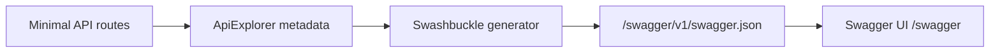

# Swagger / Swashbuckle у Minimal API: окремий класичний шлях

::note
У попередній статті ми розглянули сучасний шлях `Minimal API + OpenAPI + Scalar`. Але в реальних проєктах ви дуже часто зустрінете інший стек: **Swagger UI + Swashbuckle**. Це не просто історичний артефакт. Це окремий, дуже поширений спосіб генерувати OpenAPI-документ і показувати його через вбудований UI.

Цей матеріал потрібен з двох причин:

1. велика кількість існуючих Minimal API проєктів уже побудована саме на Swashbuckle;
2. терміни `Swagger`, `Swashbuckle`, `Swagger UI` і `OpenAPI` постійно змішують, і без окремого розбору в голові лишається плутанина.

::

::caution
Для **нових** проєктів на `.NET 9+` базовим шляхом у цьому курсі лишається зв'язка `AddOpenApi() + Scalar`. За актуальною документацією Microsoft, `Swashbuckle` не є доступним шляхом для `.NET 9+`, тому ця стаття свідомо орієнтована на `.NET 8` та підтримку існуючих систем.

::

::card-group

::card{title="Що розберемо" icon="i-lucide-book-open"}

- різницю між `Swagger UI`, `Swashbuckle` і `OpenAPI`;
- повний відтворюваний проєкт Minimal API на `.NET 8`;
- `AddEndpointsApiExplorer`, `AddSwaggerGen`, `UseSwagger`, `UseSwaggerUI`;
- Fluent-опис endpoint-ів без атрибутів;
- XML comments, route config, безпеку та кастомізацію UI.

::

::card{title="Коли це треба" icon="i-lucide-history"}

- ви підтримуєте API на `.NET 8`;
- команда вже використовує `Swashbuckle.AspNetCore`;
- у вас є Swagger UI і ви хочете зрозуміти, як він влаштований;
- потрібно впевнено читати legacy або чинний enterprise-код.

::

::card{title="Що буде в кінці" icon="i-lucide-monitor-up"}

- `swagger/v1/swagger.json` віддає OpenAPI-документ;
- `/swagger` відкриває інтерактивний Swagger UI;
- endpoint-и Minimal API мають summaries, descriptions і responses;
- ви чітко розумієте, де закінчується OpenAPI і де починається Swagger tooling.

::

::

---

## 1. OpenAPI, Swagger UI, Swashbuckle: хто за що відповідає

Почнемо з найголовнішого розмежування.

| Термін | Що це таке | Роль |
|:---|:---|:---|
| **OpenAPI** | Стандарт специфікації | Формат контракту API |
| **Swagger UI** | Web UI | Показує OpenAPI-документ у браузері |
| **Swashbuckle** | .NET tooling | Генерує OpenAPI-документ і вбудовує Swagger UI в ASP.NET Core |

Інженерна логіка така:

1. Minimal API endpoint-и містять metadata.
2. `Swashbuckle` читає цю metadata і генерує `swagger.json`.
3. `Swagger UI` в браузері читає цей JSON і малює інтерфейс.

::mermaid



::

::warning
Swagger UI сам по собі не знає, які у вас є endpoint-и. Йому потрібен уже готовий OpenAPI JSON. Тому при діагностиці проблем важливо відділяти: «зламався генератор документа» від «зламався UI, який цей документ показує».

::

---

## 2. Коли обирати Swagger окремо від Scalar

Після статті про `Scalar` природно виникає питання: навіщо ще окремо вивчати `Swagger`?

Відповідь прагматична:

::tabs

::tabs-item{label="Swagger / Swashbuckle"}
- підтримка існуючих `.NET 8` проєктів;
- традиційний стек, який досі масово використовується;
- велика кількість прикладів у legacy-коді, блогах і корпоративних шаблонах;
- інтеграція в історичні пайплайни документації.

::

::tabs-item{label="Scalar + built-in OpenAPI"}
- сучасний шлях для нових `.NET 9+` застосунків;
- чистіша розв'язка між генерацією OpenAPI і UI;
- сучасніший reference UX;
- простіше мислити `OpenAPI` як окремий артефакт, а `UI` як окремий шар.

::

::

Висновок тут не ідеологічний, а прикладний:

- якщо система вже на `Swashbuckle`, потрібно вміти з ним працювати;
- якщо ви починаєте новий `.NET 9+` проєкт, то `Scalar` зазвичай краще відповідає сучасному стеку цього курсу.

---

## 3. Відтворюваний проєкт на .NET 8

Щоб матеріал був не абстрактним, створимо окремий невеликий Minimal API-проєкт під Swagger.

### Крок 1: Створення

::code-group

```bash [macOS/Linux]
mkdir MinimalApiSwaggerDemo
cd MinimalApiSwaggerDemo
dotnet new web --framework net8.0
```

```powershell [Windows PowerShell]
mkdir MinimalApiSwaggerDemo
cd MinimalApiSwaggerDemo
dotnet new web --framework net8.0
```

::

### Крок 2: Пакет Swashbuckle

```bash
dotnet add package Swashbuckle.AspNetCore
```

### Крок 3: Що ми побудуємо

Так само, як у статті про Scalar, зробимо невеликий каталог товарів:

- `GET /api/products`
- `GET /api/products/{id}`
- `POST /api/products`
- `PUT /api/products/{id}`
- `DELETE /api/products/{id}`

Наприкінці перевіримо два URL:

- `/swagger/v1/swagger.json`
- `/swagger`

::terminal-preview{title="dotnet run" :cursor="true"}
<div class="line"><span class="opacity-40">$</span> <strong class="font-bold">dotnet run</strong></div>
<div class="line"><span class="text-green-400 font-bold">Building...</span></div>
<div class="line">Now listening on: <span class="text-blue-400 font-bold">https://localhost:7118</span></div>
<div class="line">Application started. Press <span class="text-yellow-400 font-bold">Ctrl+C</span> to shut down.</div>
::

---

## 4. Структура проєкту

::code-tree

```xml [MinimalApiSwaggerDemo.csproj]
<Project Sdk="Microsoft.NET.Sdk.Web">
  <PropertyGroup>
    <TargetFramework>net8.0</TargetFramework>
    <Nullable>enable</Nullable>
    <ImplicitUsings>enable</ImplicitUsings>
    <GenerateDocumentationFile>true</GenerateDocumentationFile>
  </PropertyGroup>

  <ItemGroup>
    <PackageReference Include="Swashbuckle.AspNetCore" Version="6.*" />
  </ItemGroup>
</Project>
```

```csharp [Program.cs]
using System.Reflection;

var builder = WebApplication.CreateBuilder(args);

builder.Services.AddSingleton<ProductStore>();
builder.Services.AddEndpointsApiExplorer();
builder.Services.AddSwaggerGen(options =>
{
    options.SwaggerDoc("v1", new()
    {
        Title = "Minimal API Swagger Demo",
        Version = "v1",
        Description = "Окремий приклад Swagger UI + Swashbuckle для Minimal API."
    });

    var xmlFile = $"{Assembly.GetExecutingAssembly().GetName().Name}.xml";
    var xmlPath = Path.Combine(AppContext.BaseDirectory, xmlFile);

    if (File.Exists(xmlPath))
    {
        options.IncludeXmlComments(xmlPath);
    }
});

var app = builder.Build();

if (app.Environment.IsDevelopment())
{
    app.UseSwagger();
    app.UseSwaggerUI(options =>
    {
        options.SwaggerEndpoint("/swagger/v1/swagger.json", "Minimal API Swagger Demo v1");
        options.RoutePrefix = "swagger";
        options.DisplayRequestDuration();
    });
}

app.MapProductEndpoints();

app.Run();
```

```csharp [Features/Products/ProductContracts.cs]
public sealed record ProductResponse(
    Guid Id,
    string Name,
    decimal Price,
    bool IsActive);

public sealed record CreateProductRequest(
    string? Name,
    decimal Price,
    bool IsActive);

public sealed record UpdateProductRequest(
    string? Name,
    decimal Price,
    bool IsActive);
```

```csharp [Features/Products/ProductEndpoints.cs]
public static class ProductEndpoints
{
    /// <summary>
    /// Реєструє всі product endpoint-и.
    /// </summary>
    public static IEndpointRouteBuilder MapProductEndpoints(
        this IEndpointRouteBuilder app)
    {
        var group = app.MapGroup("/api/products")
            .WithTags("Products");

        group.MapGet("/", GetProducts)
            .WithName("GetProducts")
            .WithSummary("Отримати список товарів")
            .WithDescription("Повертає список товарів каталогу.")
            .Produces<IReadOnlyList<ProductResponse>>(StatusCodes.Status200OK)
            .ProducesProblem(StatusCodes.Status500InternalServerError)
            .WithOpenApi();

        group.MapGet("/{id:guid}", GetProductById)
            .WithName("GetProductById")
            .WithSummary("Отримати товар за ID")
            .WithDescription("Повертає один товар або 404, якщо його не знайдено.")
            .Produces<ProductResponse>(StatusCodes.Status200OK)
            .Produces(StatusCodes.Status404NotFound)
            .ProducesProblem(StatusCodes.Status500InternalServerError)
            .WithOpenApi();

        group.MapPost("/", CreateProduct)
            .WithName("CreateProduct")
            .WithSummary("Створити товар")
            .WithDescription("Створює товар і повертає 201 Created.")
            .Accepts<CreateProductRequest>("application/json")
            .Produces<ProductResponse>(StatusCodes.Status201Created)
            .ProducesValidationProblem(StatusCodes.Status422UnprocessableEntity)
            .ProducesProblem(StatusCodes.Status500InternalServerError)
            .WithOpenApi();

        group.MapPut("/{id:guid}", UpdateProduct)
            .WithName("UpdateProduct")
            .WithSummary("Оновити товар")
            .WithDescription("Оновлює товар або повертає 404.")
            .Accepts<UpdateProductRequest>("application/json")
            .Produces<ProductResponse>(StatusCodes.Status200OK)
            .Produces(StatusCodes.Status404NotFound)
            .ProducesValidationProblem(StatusCodes.Status422UnprocessableEntity)
            .ProducesProblem(StatusCodes.Status500InternalServerError)
            .WithOpenApi();

        group.MapDelete("/{id:guid}", DeleteProduct)
            .WithName("DeleteProduct")
            .WithSummary("Видалити товар")
            .WithDescription("Видаляє товар і повертає 204 No Content.")
            .Produces(StatusCodes.Status204NoContent)
            .Produces(StatusCodes.Status404NotFound)
            .ProducesProblem(StatusCodes.Status500InternalServerError)
            .WithOpenApi();

        return app;
    }

    private static Ok<IReadOnlyList<ProductResponse>> GetProducts(ProductStore store)
        => TypedResults.Ok<IReadOnlyList<ProductResponse>>(store.GetAll());

    private static Results<Ok<ProductResponse>, NotFound> GetProductById(Guid id, ProductStore store)
    {
        var product = store.GetById(id);
        return product is null
            ? TypedResults.NotFound()
            : TypedResults.Ok(product);
    }

    private static Results<Created<ProductResponse>, ValidationProblem> CreateProduct(
        CreateProductRequest request,
        ProductStore store)
    {
        var errors = Validate(request.Name, request.Price);
        if (errors.Count > 0)
            return TypedResults.ValidationProblem(errors, statusCode: StatusCodes.Status422UnprocessableEntity);

        var created = store.Create(request.Name!, request.Price, request.IsActive);
        return TypedResults.Created($"/api/products/{created.Id}", created);
    }

    private static Results<Ok<ProductResponse>, NotFound, ValidationProblem> UpdateProduct(
        Guid id,
        UpdateProductRequest request,
        ProductStore store)
    {
        var errors = Validate(request.Name, request.Price);
        if (errors.Count > 0)
            return TypedResults.ValidationProblem(errors, statusCode: StatusCodes.Status422UnprocessableEntity);

        var updated = store.Update(id, request.Name!, request.Price, request.IsActive);
        return updated is null
            ? TypedResults.NotFound()
            : TypedResults.Ok(updated);
    }

    private static Results<NoContent, NotFound> DeleteProduct(Guid id, ProductStore store)
        => store.Delete(id)
            ? TypedResults.NoContent()
            : TypedResults.NotFound();

    private static Dictionary<string, string[]> Validate(string? name, decimal price)
    {
        var errors = new Dictionary<string, string[]>();

        if (string.IsNullOrWhiteSpace(name))
            errors["name"] = ["Name is required."];

        if (price <= 0)
            errors["price"] = ["Price must be greater than zero."];

        return errors;
    }
}
```

```csharp [Infrastructure/ProductStore.cs]
public sealed class ProductStore
{
    private readonly List<ProductResponse> _products =
    [
        new(Guid.Parse("aaaaaaaa-aaaa-aaaa-aaaa-aaaaaaaaaaaa"), "French Press", 1299.00m, true),
        new(Guid.Parse("bbbbbbbb-bbbb-bbbb-bbbb-bbbbbbbbbbbb"), "Paper Filters", 199.00m, true),
        new(Guid.Parse("cccccccc-cccc-cccc-cccc-cccccccccccc"), "Cold Brew Jar", 899.00m, false)
    ];

    public IReadOnlyList<ProductResponse> GetAll()
        => _products.OrderBy(p => p.Name).ToList();

    public ProductResponse? GetById(Guid id)
        => _products.FirstOrDefault(p => p.Id == id);

    public ProductResponse Create(string name, decimal price, bool isActive)
    {
        var product = new ProductResponse(Guid.NewGuid(), name, price, isActive);
        _products.Add(product);
        return product;
    }

    public ProductResponse? Update(Guid id, string name, decimal price, bool isActive)
    {
        var index = _products.FindIndex(p => p.Id == id);
        if (index < 0)
            return null;

        var updated = new ProductResponse(id, name, price, isActive);
        _products[index] = updated;
        return updated;
    }

    public bool Delete(Guid id)
    {
        var product = GetById(id);
        if (product is null)
            return false;

        _products.Remove(product);
        return true;
    }
}
```

```json [Properties/launchSettings.json]
{
  "$schema": "https://json.schemastore.org/launchsettings.json",
  "profiles": {
    "https": {
      "commandName": "Project",
      "dotnetRunMessages": true,
      "launchBrowser": true,
      "launchUrl": "swagger",
      "applicationUrl": "https://localhost:7118;http://localhost:5118",
      "environmentVariables": {
        "ASPNETCORE_ENVIRONMENT": "Development"
      }
    }
  }
}
```

::

---

## 5. Що робить `AddEndpointsApiExplorer()`

Це один із тих рядків, які копіюють майже всі, але пояснюють далеко не всі.

```csharp
builder.Services.AddEndpointsApiExplorer();
```

Для Minimal API цей сервісовий виклик критично важливий, бо саме він дає `ApiExplorer` знання про endpoint-и, створені через `MapGet`, `MapPost`, `MapPut` і так далі.

Якщо його прибрати:

- застосунок продовжить працювати;
- самі endpoint-и нікуди не зникнуть;
- але `Swashbuckle` перестане «бачити» Minimal API-маршрути так, як очікує генератор документації.

::warning
У controller-based Web API зв'язка з `ApiExplorer` виглядає інакше, тому розробники часто переносять інтуїцію з контролерів у Minimal API й недооцінюють роль `AddEndpointsApiExplorer()`. Для Minimal API це не декоративний, а структурний рядок.

::

---

## 6. Що робить `AddSwaggerGen()`

Це вже серце інтеграції.

```csharp
builder.Services.AddSwaggerGen(options =>
{
    options.SwaggerDoc("v1", new()
    {
        Title = "Minimal API Swagger Demo",
        Version = "v1"
    });
});
```

Саме тут ми кажемо:

- що OpenAPI-документ взагалі треба згенерувати;
- як він називається;
- яку версію документа ми реєструємо;
- які додаткові налаштування застосувати.

### Найважливіші можливості `SwaggerGen`

::field-group
::field{name="SwaggerDoc(...)" type="method"}
Реєструє документ з ім'ям на кшталт `v1`.
::
::field{name="IncludeXmlComments(...)" type="method"}
Підтягує XML documentation comments з компіляції.
::
::field{name="CustomSchemaIds(...)" type="method"}
Корисно, коли в проєкті є однакові імена типів у різних namespace.
::
::field{name="SupportNonNullableReferenceTypes()" type="method"}
Допомагає точніше відобразити nullable/non-nullable reference types.
::
::field{name="OperationFilter / DocumentFilter / SchemaFilter" type="extension points"}
Дають тонку кастомізацію документа, операцій і схем.
::
::

::collapsible{title="Приклад більш насиченого AddSwaggerGen"}

```csharp
builder.Services.AddSwaggerGen(options =>
{
    options.SwaggerDoc("v1", new()
    {
        Title = "Catalog API",
        Version = "v1",
        Description = "Swagger UI demo for Minimal API"
    });

    options.SupportNonNullableReferenceTypes();

    var xmlFile = $"{Assembly.GetExecutingAssembly().GetName().Name}.xml";
    var xmlPath = Path.Combine(AppContext.BaseDirectory, xmlFile);

    if (File.Exists(xmlPath))
    {
        options.IncludeXmlComments(xmlPath);
    }
});
```

::

---

## 7. `UseSwagger()` і `UseSwaggerUI()`: чому це два різні виклики

У багатьох `Program.cs` вони стоять поряд, тому створюється ілюзія, що це «одна функція у двох рядках». Насправді це дві різні відповідальності.

::tabs

::tabs-item{label="UseSwagger()"}
```csharp
app.UseSwagger();
```

Цей middleware віддає OpenAPI JSON, зазвичай на маршруті:

- `/swagger/v1/swagger.json`

Тобто він відповідає за **машиночитаний документ**.

::

::tabs-item{label="UseSwaggerUI()"}
```csharp
app.UseSwaggerUI(options =>
{
    options.SwaggerEndpoint("/swagger/v1/swagger.json", "Demo v1");
});
```

Цей middleware віддає **HTML/JS UI**, який завантажує JSON-документ і рендерить його в браузері.

::

::

Простими словами:

- `UseSwagger()` = «віддай JSON»;
- `UseSwaggerUI()` = «віддай інтерфейс, який цей JSON показує».

---

## 8. Документування Minimal API endpoint-ів під Swagger

Найважливіше інженерне зауваження: Swagger UI не живе окремим життям. Якщо ви хочете, щоб UI був багатим і точним, metadata треба закладати в самі endpoint-и.

У Minimal API для цього достатньо Fluent API:

```csharp
group.MapPost("/", CreateProduct)
    .WithName("CreateProduct")
    .WithSummary("Створити товар")
    .WithDescription("Створює товар і повертає 201 Created.")
    .Accepts<CreateProductRequest>("application/json")
    .Produces<ProductResponse>(StatusCodes.Status201Created)
    .ProducesValidationProblem(StatusCodes.Status422UnprocessableEntity)
    .ProducesProblem(StatusCodes.Status500InternalServerError)
    .WithOpenApi();
```

### Що з цього реально потрапляє в Swagger UI

| Fluent API | Що ви побачите в Swagger UI |
|:---|:---|
| `WithSummary(...)` | короткий заголовок операції |
| `WithDescription(...)` | розгорнутий опис |
| `WithTags(...)` | групування операцій |
| `Accepts<T>(...)` | request body schema |
| `Produces<T>(...)` | schema успішної відповіді |
| `Produces(...)` | статус-коди без тіла |
| `ProducesProblem(...)` | ProblemDetails-style error |
| `WithName(...)` + `WithOpenApi()` | стабільні operation metadata |

::tip
Якщо ви вже читали статтю про Scalar, важливо побачити головне: **опис endpoint-ів майже той самий**. Змінюється переважно не спосіб мислення про metadata, а інструмент, який рендерить документ у UI.

::

---

## 9. XML comments: коли вони ще корисні

Swagger historically дуже любить XML comments, і в екосистемі `.NET 8` ви будете бачити їх часто.

### Увімкнення в `.csproj`

```xml
<GenerateDocumentationFile>true</GenerateDocumentationFile>
```

### Підключення в `AddSwaggerGen`

```csharp
var xmlFile = $"{Assembly.GetExecutingAssembly().GetName().Name}.xml";
var xmlPath = Path.Combine(AppContext.BaseDirectory, xmlFile);

if (File.Exists(xmlPath))
{
    options.IncludeXmlComments(xmlPath);
}
```

### Навіщо це потрібно

XML comments підтягують:

- summaries;
- descriptions;
- коментарі до моделей і властивостей.

Але тут є важлива практична межа.

::accordion

::accordion-item{label="Коли XML comments справді корисні" icon="i-lucide-circle-help"}
- controller-heavy кодові бази;
- існуючі enterprise API;
- проєкти, де вже є культура XML documentation;
- генерація документації з класів і DTO.
::

::accordion-item{label="Коли краще спертися на Fluent API" icon="i-lucide-circle-help"}
- Minimal API, де хочеться бачити metadata поруч із маршрутом;
- endpoint-oriented дизайн;
- сценарії, де важливо тримати контракт прямо біля `MapGet/MapPost`;
- команди, які не хочуть розмазувати опис між handler-ом, DTO та XML-файлом.
::

::

Практичний висновок: у Minimal API Fluent API зазвичай читається краще, але XML comments усе ще залишаються корисним додатковим шаром, особливо для DTO та підтримки старих проєктів.

---

## 10. Кастомізація Swagger UI

Навіть базовий Swagger UI уже робочий, але в реальних системах його часто підлаштовують під інфраструктуру або UX-компроміси.

::code-group

```csharp [Базовий варіант]
app.UseSwaggerUI(options =>
{
    options.SwaggerEndpoint("/swagger/v1/swagger.json", "Demo v1");
});
```

```csharp [Відкрити UI в корені сайту]
app.UseSwaggerUI(options =>
{
    options.SwaggerEndpoint("./swagger/v1/swagger.json", "Demo v1");
    options.RoutePrefix = string.Empty;
});
```

```csharp [Показувати тривалість запиту]
app.UseSwaggerUI(options =>
{
    options.SwaggerEndpoint("/swagger/v1/swagger.json", "Demo v1");
    options.DisplayRequestDuration();
});
```

::

### На що звернути увагу

- `SwaggerEndpoint(...)` повинен вказувати на правильний JSON.
- `RoutePrefix = string.Empty` відкриває UI на корені сайту.
- відносний шлях `./swagger/v1/swagger.json` корисний за reverse proxy або віртуальних директорій.

::warning
Одна з найчастіших production-помилок: у девелопменті все працює на абсолютному `/swagger/v1/swagger.json`, а під reverse proxy або нестандартним base path UI перестає знаходити документ. У таких випадках відносний `./` шлях часто безпечніший.

::

---

## 11. Безпека Swagger endpoint-ів

Помилка початківців: вважати, що якщо ваші API endpoint-и захищені, то documentation UI автоматично теж захищений. Це не так.

Окремо подумайте про:

- `swagger.json`;
- `/swagger`;
- доступність UI лише в development;
- потребу в авторизації.

### Найпростіший варіант

```csharp
if (app.Environment.IsDevelopment())
{
    app.UseSwagger();
    app.UseSwaggerUI();
}
```

Це стандартний стартовий компроміс: документація доступна лише в development.

### Захистити сам JSON-маршрут

Офіційні приклади Microsoft також показують варіант із:

```csharp
app.MapSwagger().RequireAuthorization();
```

Такий підхід корисний, якщо UI або документ мають бути доступні тільки аутентифікованим користувачам.

---

## 12. Типові помилки зі Swagger у Minimal API

::accordion

::accordion-item{label="Помилка 1: забули AddEndpointsApiExplorer()" icon="i-lucide-circle-help"}
Minimal API endpoint-и працюють, але документ генерується неповно або дивно. Причина часто саме в тому, що ApiExplorer не був правильно підключений.
::

::accordion-item{label="Помилка 2: є UseSwaggerUI(), але немає UseSwagger()" icon="i-lucide-circle-help"}
UI відкриється, але не матиме документа, який треба показати.
::

::accordion-item{label="Помилка 3: metadata на endpoint-ах майже відсутня" icon="i-lucide-circle-help"}
Swagger UI покаже маршрут, але не дасть якісного контракту. Проблема не в UI, а в тому, що ви не описали responses, summaries, request body.
::

::accordion-item{label="Помилка 4: XML comments увімкнені, але файл не підключено" icon="i-lucide-circle-help"}
У `.csproj` є `GenerateDocumentationFile`, але `IncludeXmlComments(...)` відсутній або вказує на неправильний шлях.
::

::accordion-item{label="Помилка 5: неправильний SwaggerEndpoint під reverse proxy" icon="i-lucide-circle-help"}
Локально все добре, а в staging UI не знаходить JSON. Причина часто в абсолютному маршруті там, де потрібен відносний `./swagger/v1/swagger.json`.
::

::

---

## 13. Практичні завдання

### Рівень 1: Базовий

::steps

### Завдання 17.1: Підніміть базовий Swagger UI

Відтворіть проєкт зі статті й перевірте:

- `/swagger/v1/swagger.json`
- `/swagger`

### Завдання 17.2: Додайте ще один endpoint

Створіть `GET /api/products/active`, опишіть його через `WithSummary`, `WithDescription` і `Produces`.

::

### Рівень 2: Metadata

::steps

### Завдання 17.3: Покращіть POST

Для `POST /api/products` додайте:

- приклад payload;
- ще один статус-код помилки;
- детальніший опис сценарію.

### Завдання 17.4: Підключіть XML comments

Додайте XML comments до DTO і перевірте, що частина описів з'явилась у Swagger UI.

::

### Рівень 3: Інфраструктура

::steps

### Завдання 17.5: RoutePrefix

Перенесіть Swagger UI на корінь сайту через `RoutePrefix = string.Empty`.

### Завдання 17.6: Захистіть swagger endpoints

Налаштуйте авторизацію так, щоб доступ до `/swagger` і `/swagger/v1/swagger.json` був лише після аутентифікації.

::

---

## 14. Резюме

::card-group

::card{title="Swagger не дорівнює OpenAPI" icon="i-lucide-file-text"}
OpenAPI — це контракт. Swagger UI — це UI. Swashbuckle — це .NET tooling, яке допомагає згенерувати контракт і показати його.

::

::card{title="Для .NET 8 це досі важливо" icon="i-lucide-history"}
Swashbuckle залишається важливим для підтримки існуючих Minimal API систем і для розуміння legacy-коду.

::

::card{title="Metadata усе ще вирішує все" icon="i-lucide-list-checks"}
Якість Swagger UI прямо залежить від того, наскільки добре ви описали endpoint-и через Fluent API або інші джерела metadata.

::

::card{title="Scalar і Swagger варто знати обидва" icon="i-lucide-split"}
Scalar потрібен для сучасного стеку курсу. Swagger потрібен для ширшої практики і підтримки вже існуючих `.NET 8` рішень.

::

::
