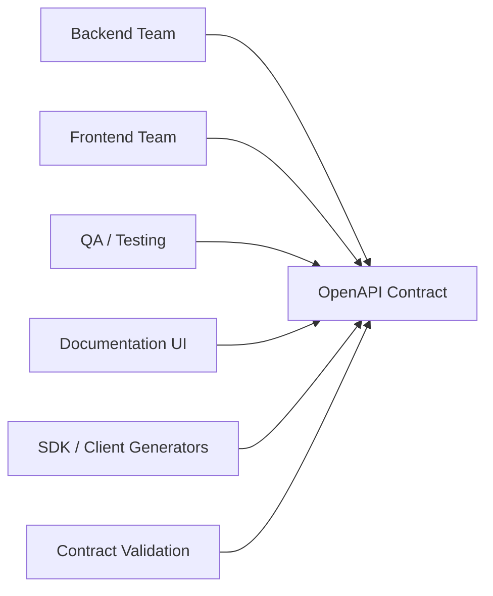

# OpenAPI: контракт, специфікація та документація API

::note
У попередніх матеріалах ми проєктували URL, формати даних, статус-коди, помилки, пагінацію та безпеку. Але всі ці рішення мають одну спільну проблему: якщо вони існують лише «в голові команди» або розкидані по коду, клієнтський розробник не бачить цілісного контракту. Саме цю проблему і вирішує **OpenAPI**.

::

## 1. Навіщо OpenAPI, якщо код уже існує

Уявімо реальну ситуацію. Команда бекенду каже: «Ендпоінт готовий, просто виклич `POST /v1/orders`». Команда фронтенду питає:

- Які поля обов'язкові?
- Який формат має `created_at`?
- Які статус-коди повертаються при помилках?
- Чи потрібно передавати `Authorization`?
- Який вигляд має `422`, а який `409`?

Якщо відповіді на ці питання живуть лише в коді сервера, то клієнтський розробник змушений або читати чужий бекенд, або експериментувати через Postman, або ставити десятки уточнювальних питань. Це дорого, повільно і небезпечно, бо API перетворюється з контракту на набір припущень.

**OpenAPI** розв'язує цю проблему: він формалізує HTTP API в машинозчитуваний документ. Такий документ може одночасно читати людина, IDE, генератор клієнтів, тестові інструменти та система перевірки контракту.

::card-group

::card{title="Що ви отримаєте" icon="i-lucide-target"}

- Чітке розуміння, що саме описує OpenAPI
- Навичку читати структуру `paths`, `responses`, `components`, `schemas`
- Вміння відрізняти специфікацію від інструментів на кшталт Swagger UI
- Практичний YAML-приклад невеликого API

::

::card{title="Пререквізити" icon="i-lucide-book-open"}

- Розуміння базового HTTP: методи, URL, статус-коди
- Знання JSON та структури HTTP-запиту/відповіді
- Бажано прочитати матеріали про [формати даних](./02.data-formats), [статус-коди](./04.http-methods-status-codes), [валідацію](./08.api-design-validation) та [безпеку](./12.security-auth)

::

::

---

## 2. Що таке OpenAPI насправді

**OpenAPI Specification (OAS)**, або просто **OpenAPI**, це стандарт опису HTTP API у форматі `YAML` або `JSON`.

Ключова думка: OpenAPI описує **контракт взаємодії**, а не реалізацію сервера. У специфікації немає SQL-запитів, внутрішніх сервісів, middleware чи класів доменної моделі. Там є лише те, що бачить зовнішній споживач API:

- які ресурси існують;
- які HTTP-методи підтримуються;
- які параметри треба передати;
- яке тіло запиту очікується;
- які відповіді можливі;
- які схеми даних використовуються;
- яка авторизація потрібна.

::tip
Думайте про OpenAPI як про **юридичний текст договору**, а не як про код сервера. Код можна переписати. Контракт, уже виданий клієнтам, не можна змінювати без наслідків.

::

### OpenAPI, Swagger, Swagger UI: де тут плутанина

Тут часто виникає термінологічний хаос, тому розмежуємо поняття одразу.

| Термін | Що це таке | Роль |
|:---|:---|:---|
| **OpenAPI** | Стандарт специфікації | Описує контракт API |
| **Swagger Specification** | Історична назва попередніх версій стандарту | Сьогодні майже завжди мають на увазі OpenAPI |
| **Swagger UI** | Вебінтерфейс для візуалізації специфікації | Показує документацію та дає робити тестові запити |
| **Swagger Editor** | Редактор специфікацій | Дає писати і перевіряти YAML/JSON |
| **Code Generator** | Інструмент генерації клієнта або серверного каркаса | Використовує специфікацію як вхідні дані |

Проблема в тому, що в побутовій мові розробники часто кажуть «Swagger», маючи на увазі будь-що з цього списку. Але технічно коректніше розділяти:

- `OpenAPI` — це **формат договору**;
- `Swagger UI` — це **спосіб показати договір**;
- `generator` — це **спосіб використати договір**.

---

## 3. Що саме дає OpenAPI команді

OpenAPI цінний не тому, що «гарно виглядає в браузері». Його сила в тому, що один документ стає єдиним джерелом правди для кількох ролей одночасно.

::mermaid



::

Практична користь:

| Сценарій | Як допомагає OpenAPI |
|:---|:---|
| Документація | Swagger UI або інші сайти будують reference автоматично |
| Розробка клієнта | Генеруються DTO, методи виклику, типи помилок |
| Тестування | Можна перевіряти, чи сервер не порушив контракт |
| Рев'ю API-дизайну | Контракт видно до реалізації коду |
| Onboarding | Новий інженер читає специфікацію, а не 30 контролерів |

::warning
OpenAPI не робить API «якісним» автоматично. Якщо погано спроєктувати статус-коди, назви полів або помилки, то специфікація лише дуже точно зафіксує цей поганий дизайн.

::

---

## 4. Анатомія OpenAPI-документа

OpenAPI-документ зазвичай має кілька великих частин. Кожна відповідає на окремий клас запитань.

::steps

### Крок 1: Метадані документа

Секції `openapi`, `info` і `servers` відповідають на питання:

- яку версію стандарту ми використовуємо;
- як називається API;
- де воно доступне;
- який базовий URL вважати коренем.

### Крок 2: Операції та маршрути

Секція `paths` описує URL та HTTP-методи. Саме тут живуть `get`, `post`, `put`, `delete`, параметри маршруту, query-параметри, `requestBody` і `responses`.

### Крок 3: Повторно використовувані схеми

Секція `components` потрібна, щоб не дублювати структури всюди вручну. Тут зберігають:

- `schemas` для типів даних;
- `parameters` для спільних параметрів;
- `responses` для типових відповідей;
- `securitySchemes` для опису авторизації.

### Крок 4: Правила безпеки

Секції `securitySchemes` і `security` формалізують, які механізми аутентифікації потрібні: Bearer token, API key, OAuth2 тощо.

::

### Мінімальна мапа структури

```yaml [Каркас специфікації]
openapi: 3.1.0
info:
  title: Coffee API
  version: 1.0.0
servers:
  - url: https://api.example.com
paths:
  /v1/orders:
    post:
      summary: Create order
components:
  schemas: {}
  securitySchemes: {}
```

Цей каркас нічого корисного ще не описує, але показує головну ідею: документ читається зверху вниз, від загальних метаданих до конкретних операцій і повторно використовуваних типів.

### Каталог важливих елементів і їх варіацій

До цього моменту ми бачили лише великий каркас. Але реальна робота з OpenAPI майже завжди відбувається на рівні **маленьких фрагментів**: сьогодні вам треба згадати, як описати `multipart/form-data`, завтра — як оформити `oneOf`, післязавтра — як документувати query-параметр-масив.

Нижче наведено саме такий довідковий шар: короткі приклади, які можна читати незалежно один від одного.

::tip
Думайте про цю частину статті як про **робочий конструктор**. Ви не зобов'язані використовувати всі елементи одразу. OpenAPI добрий тоді, коли контракт точний, а не тоді, коли в нього механічно вставили кожну можливу секцію.

::

#### `info`: не лише `title` і `version`

Секція `info` може містити не тільки назву та версію, а й метадані для людей, юристів і партнерів.

```yaml [info — розширений приклад]
info:
  title: Billing API
  version: 2.3.0
  summary: API для рахунків, платежів і повернень
  description: >
    Публічний контракт платіжної платформи для партнерів.
  termsOfService: https://example.com/terms
  contact:
    name: API Support
    email: api-support@example.com
    url: https://example.com/support
  license:
    name: Commercial License
    url: https://example.com/license
```

Практичний сенс:

- `summary` дає короткий контекст;
- `contact` зменшує кількість «кому писати, якщо щось не працює?»;
- `license` та `termsOfService` важливі для публічних або партнерських API.

#### `servers`: фіксовані URL та змінні

Найпростіший варіант ми вже бачили: список готових URL. Але `servers` підтримує і змінні.

::tabs

::tabs-item{label="Фіксовані сервери"}
```yaml
servers:
  - url: https://api.example.com
    description: Production
  - url: https://sandbox.example.com
    description: Sandbox
```

::

::tabs-item{label="Сервер зі змінними"}
```yaml
servers:
  - url: https://{environment}.example.com/{basePath}
    description: Configurable endpoint
    variables:
      environment:
        default: api
        enum: [api, sandbox, staging]
      basePath:
        default: v1
```

::

::

Змінні корисні, коли адреса API структурно стабільна, але середовище або базовий префікс можуть змінюватися.

#### `tags`: не декоративна дрібниця

Багато хто сприймає `tags` як косметику для UI. Насправді це основний інструмент навігації у великих документах.

```yaml [tags]
tags:
  - name: Orders
    description: Операції із замовленнями
  - name: Payments
    description: Платежі, повернення та статуси транзакцій
  - name: Admin
    description: Адміністративні endpoint-и
```

Якщо у вас 80 операцій і немає тегів, документація швидко стає непридатною до використання.

#### `parameters`: чотири місця розташування

Параметри в OpenAPI описуються не абстрактно, а з чітким `in`.

::tabs

::tabs-item{label="Path"}
```yaml
parameters:
  - name: orderId
    in: path
    required: true
    schema:
      type: string
      format: uuid
```

Для `path` параметрів `required: true` є фактично обов'язковим, бо інакше сам шлях втрачає сенс.

::

::tabs-item{label="Query"}
```yaml
parameters:
  - name: limit
    in: query
    required: false
    schema:
      type: integer
      minimum: 1
      maximum: 100
```

Типовий сценарій: фільтри, сортування, пагінація, пошук.

::

::tabs-item{label="Header"}
```yaml
parameters:
  - name: X-Correlation-Id
    in: header
    required: false
    schema:
      type: string
```

Зручно для correlation id, feature flags, ідемпотентності, умовних ревізій.

::

::tabs-item{label="Cookie"}
```yaml
parameters:
  - name: session_id
    in: cookie
    required: true
    schema:
      type: string
```

Цей варіант рідше зустрічається в публічних API, але корисний для browser-oriented сценаріїв.

::

::

#### `style` і `explode`: як серіалізуються параметри

Один і той самий масив можна передати кількома способами. Саме для цього існують `style` і `explode`.

| `in` | Типовий `style` | Що це означає |
|:---|:---|:---|
| `path` | `simple`, `label`, `matrix` | як параметр вбудовується в URL-шлях |
| `query` | `form`, `spaceDelimited`, `pipeDelimited`, `deepObject` | як параметр потрапляє в query string |
| `header` | `simple` | як значення кодується в заголовку |
| `cookie` | `form` | як значення кодується в cookie |

```yaml [query-масив]
parameters:
  - name: tags
    in: query
    style: form
    explode: true
    schema:
      type: array
      items:
        type: string
```

Такий опис зазвичай означає формат на кшталт:

```text
?tags=coffee&tags=arabica&tags=discount
```

Ще один приклад:

```yaml [deepObject для query-об'єкта]
parameters:
  - name: filter
    in: query
    style: deepObject
    explode: true
    schema:
      type: object
      properties:
        status:
          type: string
        minPrice:
          type: number
```

Це вже відповідає формату:

```text
?filter[status]=active&filter[minPrice]=100
```

::warning
Не описуйте `style` і `explode`, якщо ваш бекенд насправді не підтримує таку серіалізацію. Це один із найпідступніших способів зробити документацію формально валідною, але практично хибною.

::

#### `requestBody`: не лише JSON

`requestBody` потрібен не всім методам, але коли він є, OpenAPI дозволяє дуже точно вказати тип контенту.

::tabs

::tabs-item{label="JSON"}
```yaml
requestBody:
  required: true
  content:
    application/json:
      schema:
        $ref: '#/components/schemas/CreateOrderRequest'
```

::

::tabs-item{label="Form URL Encoded"}
```yaml
requestBody:
  required: true
  content:
    application/x-www-form-urlencoded:
      schema:
        type: object
        required: [email, password]
        properties:
          email:
            type: string
            format: email
          password:
            type: string
```

Підходить для класичних login/form сценаріїв.

::

::tabs-item{label="Multipart"}
```yaml
requestBody:
  required: true
  content:
    multipart/form-data:
      schema:
        type: object
        required: [file]
        properties:
          file:
            type: string
            format: binary
          folder:
            type: string
```

Підходить для завантаження файлів.

::

::

#### `responses`: фіксовані коди, `default`, headers, links

Більшість статей обмежуються прикладом `200` і `404`. Але OpenAPI підтримує значно більше.

::accordion

::accordion-item{label="Фіксований код відповіді"}
```yaml
responses:
  '200':
    description: Успішна відповідь
    content:
      application/json:
        schema:
          $ref: '#/components/schemas/Order'
```
::

::accordion-item{label="Відповідь за замовчуванням (`default`)"}
```yaml
responses:
  default:
    description: Непередбачена помилка
    content:
      application/json:
        schema:
          $ref: '#/components/schemas/ApiError'
```

Корисно, коли ви хочете зафіксувати загальну fallback-помилку для невідомих статусів.

::

::accordion-item{label="Headers у відповіді"}
```yaml
responses:
  '201':
    description: Створено
    headers:
      Location:
        description: URL нового ресурсу
        schema:
          type: string
          format: uri
```
::

::accordion-item{label="Links між операціями"}
```yaml
responses:
  '201':
    description: Створено
    links:
      GetCreatedOrder:
        operationId: getOrderById
        parameters:
          orderId: '$response.body#/id'
```

`links` не виконує логіку сам по собі, але формально документує зв'язок: після одного виклику можна переходити до іншого.

::

::

#### `content`: одна відповідь, кілька media type

OpenAPI дозволяє описати кілька форматів представлення тієї самої відповіді.

```yaml [JSON + XML]
responses:
  '200':
    description: Товар знайдено
    content:
      application/json:
        schema:
          $ref: '#/components/schemas/Product'
      application/xml:
        schema:
          $ref: '#/components/schemas/Product'
```

У сучасних HTTP API найчастіше достатньо `application/json`, але стандарт не обмежується лише ним.

#### `components`: не лише `schemas`

У багатьох командах `components` асоціюється лише зі `schemas`. Це спрощення. Насправді `components` може бути центральним місцем для всіх повторно використовуваних шматків контракту.

```yaml [components — основні секції]
components:
  schemas: {}
  responses: {}
  parameters: {}
  examples: {}
  requestBodies: {}
  headers: {}
  securitySchemes: {}
  links: {}
  callbacks: {}
```

Найчастіше реально використовують:

- `schemas`;
- `responses`;
- `parameters`;
- `securitySchemes`.

Але для великих API також корисні `requestBodies`, `headers`, `examples` і `links`.

```yaml [reusable requestBody]
components:
  requestBodies:
    CreateOrderBody:
      required: true
      content:
        application/json:
          schema:
            $ref: '#/components/schemas/CreateOrderRequest'

paths:
  /v1/orders:
    post:
      requestBody:
        $ref: '#/components/requestBodies/CreateOrderBody'
```

```yaml [reusable header]
components:
  headers:
    RequestId:
      description: Унікальний ідентифікатор запиту
      schema:
        type: string

responses:
  '200':
    description: OK
    headers:
      X-Request-Id:
        $ref: '#/components/headers/RequestId'
```

```yaml [reusable example]
components:
  examples:
    ReadyOrder:
      summary: Готове замовлення
      value:
        id: 42
        status: ready
```

Практичний принцип тут простий: якщо один і той самий фрагмент починає копіюватися в кілька місць, подумайте, чи не час винести його в `components`.

#### `example` vs `examples`

Це маленька, але дуже часта точка плутанини.

::code-group

```yaml [Один приклад]
schema:
  type: string
  example: pending
```

```yaml [Кілька іменованих прикладів]
content:
  application/json:
    schema:
      $ref: '#/components/schemas/Order'
    examples:
      draft:
        summary: Чернетка
        value:
          id: 1
          status: pending
      done:
        summary: Завершене замовлення
        value:
          id: 2
          status: ready
```

::

`example` добре підходить для простих полів. `examples` краще, коли треба показати кілька реальних сценаріїв.

#### `schemas`: не лише примітиви

У `components/schemas` можна описувати як прості типи, так і складні композиції.

::code-group

```yaml [Enum і прості обмеження]
OrderStatus:
  type: string
  enum: [pending, paid, canceled]
```

```yaml [allOf для композиції]
ValidationError:
  allOf:
    - $ref: '#/components/schemas/ApiError'
    - type: object
      properties:
        errors:
          type: array
          items:
            type: string
```

```yaml [oneOf для альтернатив]
PaymentMethod:
  oneOf:
    - $ref: '#/components/schemas/CardPayment'
    - $ref: '#/components/schemas/CashPayment'
```

```yaml [anyOf для часткових збігів]
SearchFilter:
  anyOf:
    - $ref: '#/components/schemas/DateFilter'
    - $ref: '#/components/schemas/StatusFilter'
```

```yaml [readOnly / writeOnly]
User:
  type: object
  properties:
    id:
      type: string
      readOnly: true
    password:
      type: string
      writeOnly: true
```

::

Практична інтерпретація:

- `allOf` добре підходить для наслідування або розширення базової помилки;
- `oneOf` означає «рівно одна форма з кількох»;
- `anyOf` означає «може відповідати кільком формам одразу»;
- `readOnly` і `writeOnly` допомагають не плутати поля, що приходять лише від клієнта або лише від сервера.

#### `discriminator`: коли `oneOf` стає складним

Якщо `oneOf` описує поліморфні об'єкти, часто потрібен `discriminator`, щоб клієнт зрозумів, яку саме форму він отримав.

```yaml [discriminator]
PaymentMethod:
  oneOf:
    - $ref: '#/components/schemas/CardPayment'
    - $ref: '#/components/schemas/BankTransferPayment'
  discriminator:
    propertyName: type
    mapping:
      card: '#/components/schemas/CardPayment'
      bank_transfer: '#/components/schemas/BankTransferPayment'
```

#### `securitySchemes`: основні варіанти

::tabs

::tabs-item{label="HTTP Bearer"}
```yaml
securitySchemes:
  bearerAuth:
    type: http
    scheme: bearer
    bearerFormat: JWT
```

::

::tabs-item{label="API Key"}
```yaml
securitySchemes:
  apiKeyAuth:
    type: apiKey
    in: header
    name: X-Api-Key
```

::

::tabs-item{label="OAuth2"}
```yaml
securitySchemes:
  oauth2:
    type: oauth2
    flows:
      authorizationCode:
        authorizationUrl: https://auth.example.com/authorize
        tokenUrl: https://auth.example.com/token
        scopes:
          orders.read: Read orders
          orders.write: Modify orders
```

::

::tabs-item{label="OpenID Connect"}
```yaml
securitySchemes:
  oidc:
    type: openIdConnect
    openIdConnectUrl: https://auth.example.com/.well-known/openid-configuration
```

::

::

Після визначення схеми її ще треба застосувати:

```yaml [security на рівні операції]
security:
  - bearerAuth: []
```

Або глобально для всього документа:

```yaml [security на рівні документа]
security:
  - bearerAuth: []
```

#### `callbacks` і webhooks: просунуті сценарії

Більшість OpenAPI-документів ніколи не використовують `callbacks`, але для асинхронних інтеграцій це дуже цінний інструмент.

::collapsible{title="Маленький приклад callback"}

```yaml
callbacks:
  paymentUpdated:
    '{$request.body#/callbackUrl}':
      post:
        requestBody:
          required: true
          content:
            application/json:
              schema:
                $ref: '#/components/schemas/PaymentStatusChanged'
        responses:
          '200':
            description: Callback accepted
```

::

Сенс тут такий: клієнт передає URL зворотного виклику, а сервер документує, який HTTP-запит прийде туди пізніше.

#### `externalDocs`: коли специфікації замало

OpenAPI добре описує контракт, але не замінює повністю гіди, туторіали та бізнесові пояснення.

```yaml [externalDocs]
externalDocs:
  description: Повний гайд для інтеграції
  url: https://developer.example.com/guides/orders
```

Цей елемент корисний, коли вам треба пов'язати формальний контракт із навчальним або бізнесовим контекстом.

---

## 5. Повний приклад невеликої специфікації

Нижче наведено компактний, але реалістичний OpenAPI-документ для створення і читання замовлень.

```yaml [openapi.yaml]
openapi: 3.1.0
info:
  title: Coffee Orders API
  version: 1.0.0
  summary: API для створення та перегляду замовлень кави
  description: >
    Контракт HTTP API для мобільного додатка кав'ярні.
    API дозволяє створювати замовлення та отримувати їх за ідентифікатором.

servers:
  - url: https://api.example.com
    description: Production
  - url: https://sandbox.api.example.com
    description: Sandbox

tags:
  - name: Orders
    description: Операції із замовленнями

paths:
  /v1/orders:
    post:
      tags: [Orders]
      operationId: createOrder
      summary: Створити нове замовлення
      description: >
        Приймає дані нового замовлення, виконує валідацію
        і повертає створений ресурс.
      security:
        - bearerAuth: []
      requestBody:
        required: true
        content:
          application/json:
            schema:
              $ref: '#/components/schemas/CreateOrderRequest'
            examples:
              lungo:
                summary: Замовлення лунго
                value:
                  recipeId: lungo
                  volumeMl: 300
                  sugar: 1
      responses:
        '201':
          description: Замовлення створено
          headers:
            Location:
              description: URL створеного ресурсу
              schema:
                type: string
                format: uri
          content:
            application/json:
              schema:
                $ref: '#/components/schemas/Order'
        '400':
          $ref: '#/components/responses/BadRequest'
        '401':
          $ref: '#/components/responses/Unauthorized'
        '422':
          $ref: '#/components/responses/ValidationError'

  /v1/orders/{orderId}:
    get:
      tags: [Orders]
      operationId: getOrderById
      summary: Отримати замовлення за ідентифікатором
      security:
        - bearerAuth: []
      parameters:
        - $ref: '#/components/parameters/OrderId'
      responses:
        '200':
          description: Замовлення знайдено
          content:
            application/json:
              schema:
                $ref: '#/components/schemas/Order'
        '401':
          $ref: '#/components/responses/Unauthorized'
        '404':
          $ref: '#/components/responses/NotFound'

components:
  parameters:
    OrderId:
      name: orderId
      in: path
      required: true
      description: UUID замовлення
      schema:
        type: string
        format: uuid

  securitySchemes:
    bearerAuth:
      type: http
      scheme: bearer
      bearerFormat: JWT

  responses:
    BadRequest:
      description: Некоректний формат запиту
      content:
        application/json:
          schema:
            $ref: '#/components/schemas/ApiError'
    Unauthorized:
      description: Користувач не аутентифікований
      content:
        application/json:
          schema:
            $ref: '#/components/schemas/ApiError'
    NotFound:
      description: Замовлення не знайдено
      content:
        application/json:
          schema:
            $ref: '#/components/schemas/ApiError'
    ValidationError:
      description: Помилка валідації полів
      content:
        application/json:
          schema:
            $ref: '#/components/schemas/ValidationError'

  schemas:
    CreateOrderRequest:
      type: object
      additionalProperties: false
      required:
        - recipeId
        - volumeMl
      properties:
        recipeId:
          type: string
          description: Код рецепта
          example: lungo
        volumeMl:
          type: integer
          minimum: 50
          maximum: 500
          description: Об'єм напою в мілілітрах
          example: 300
        sugar:
          type: integer
          minimum: 0
          maximum: 5
          description: Кількість ложок цукру
          example: 1

    Order:
      type: object
      required:
        - id
        - recipeId
        - volumeMl
        - status
        - createdAt
      properties:
        id:
          type: string
          format: uuid
        recipeId:
          type: string
        volumeMl:
          type: integer
        sugar:
          type: integer
          nullable: true
        status:
          type: string
          enum: [pending, brewing, ready, canceled]
        createdAt:
          type: string
          format: date-time

    ApiError:
      type: object
      required:
        - status
        - reason
        - developerMessage
      properties:
        status:
          type: integer
          example: 401
        reason:
          type: string
          example: authentication_required
        developerMessage:
          type: string
          example: Bearer token is missing or invalid

    ValidationError:
      allOf:
        - $ref: '#/components/schemas/ApiError'
        - type: object
          properties:
            errors:
              type: array
              items:
                type: object
                required: [field, message]
                properties:
                  field:
                    type: string
                  message:
                    type: string
```

### Як читати цей документ

#### `info` і `servers`

Блок `info` описує сам документ: назву, версію, короткий опис. Блок `servers` показує, проти яких середовищ клієнт може працювати. Це не просто декоративна інформація: інструменти можуть підставляти `Production` або `Sandbox` як базову адресу для тестових запитів.

#### `paths`

Тут видно дві операції:

- `POST /v1/orders` створює ресурс;
- `GET /v1/orders/{orderId}` читає ресурс.

Кожна операція має власні:

- `summary` і `description` для документації;
- `operationId` для генераторів SDK;
- `security` для вимог авторизації;
- `parameters`, `requestBody`, `responses` для контракту взаємодії.

#### `requestBody`

У `POST /v1/orders` тіло запиту оголошене явно. Специфікація не просто каже «передайте JSON», а визначає:

- MIME-тип через `application/json`;
- конкретну схему через `$ref`;
- приклади через `examples`.

Саме тому якісний OpenAPI-документ корисніший за звичайний Markdown-опис. Він не обмежується словами, а формалізує структуру.

#### `responses`

У кожного статус-коду є свій опис. Це критично важливо: без цього клієнт бачить лише «може бути 400», але не знає, яке тіло повернеться і як його парсити.

Зверніть увагу на два прийоми:

- `201` описано локально, бо там унікальна відповідь з `Location`;
- `400`, `401`, `404`, `422` винесені в `components/responses`, щоб не дублювати один і той самий фрагмент у десяти ендпоінтах.

#### `components/schemas`

Секція `schemas` описує форми даних. Це фактично словник типів, який використовує весь документ.

Наприклад:

- `CreateOrderRequest` описує payload вхідного запиту;
- `Order` описує успішну відповідь;
- `ApiError` і `ValidationError` описують формат помилок.

Якщо ви змінюєте схему в одному місці, усі `$ref`, що посилаються на неї, автоматично використовують оновлений контракт.

---

## 6. Ключові елементи, які часто недооцінюють

### `operationId`

Для людини `operationId` може виглядати необов'язковим. Але для генератора клієнта це майже ім'я методу.

Без `operationId` ви ризикуєте отримати в SDK щось на кшталт `postV1Orders` або `getV1OrdersOrderId`, що складно читати й підтримувати. Імена на кшталт `createOrder`, `getOrderById`, `cancelOrder` роблять сгенерований код набагато якіснішим.

### `examples`

Схема показує форму даних, але приклад показує **семантику**. Поле `volumeMl: integer` не пояснює, чи типове значення це `50`, `300` чи `5000`. Приклад показує нормальний, очікуваний сценарій використання.

### `additionalProperties: false`

Цей прапорець означає: «не приймайте довільні зайві поля». Він корисний, коли ви хочете жорсткіший контракт і не бажаєте мовчазно проковтувати сміттєві дані.

::warning
Використовуйте жорсткі обмеження усвідомлено. Надто сувора схема може перетворити дрібне еволюційне розширення API на breaking change.

::

### `securitySchemes` та `security`

Безпека в OpenAPI не повинна лишатися «текстом у README». Якщо API вимагає Bearer token, це має бути описано структуровано. Інакше документація виглядатиме повною, але фактично не дозволить коректно використати API.

---

## 7. Contract-first vs Code-first

Це одна з головних стратегічних розвилок у роботі з OpenAPI.

::tabs

::tabs-item{label="Contract-first"}
Спочатку команда проєктує OpenAPI-специфікацію, рев'ює її і лише потім починає реалізацію сервера та клієнтів.

Цей підхід сильний тоді, коли:

- API споживає кілька команд;
- контракт має бути стабільним і погодженим заздалегідь;
- важливо провести дизайн-рев'ю до написання коду;
- потрібна генерація SDK або мок-сервера з контракту.

::

::tabs-item{label="Code-first"}
Спочатку пишеться серверний код, а OpenAPI генерується з реалізації автоматично через framework або бібліотеку.

Цей підхід сильний тоді, коли:

- API невеликий;
- серверна команда одна і рухається швидко;
- важливіше зменшити ручну працю, ніж провести окремий етап контрактного дизайну;
- framework добре генерує специфікацію з анотацій чи метаданих.

::

::

### Який підхід кращий

Універсально «кращого» підходу не існує. Потрібно дивитися на організаційний контекст.

| Сценарій | Кращий стартовий вибір |
|:---|:---|
| Публічне API для зовнішніх інтеграцій | `contract-first` |
| B2B API з тривалим життєвим циклом | `contract-first` |
| Внутрішній сервіс невеликої команди | `code-first` |
| Прототип або MVP | `code-first`, але з подальшим контрактним прибиранням |

::tip
Якщо ваш API вже в продакшні, практичне правило таке: навіть у `code-first` режимі команда повинна почати ставитися до згенерованого OpenAPI як до публічного артефакту, який перевіряють у code review так само уважно, як і код.

::

---

## 8. Типові помилки в OpenAPI-специфікаціях

Погана специфікація не краща за відсутність специфікації. Вона створює фальшиве відчуття надійності.

::accordion

::accordion-item{label="Помилка 1: описано лише 200 OK" icon="i-lucide-circle-help"}
Якщо у специфікації є тільки успішна відповідь, клієнт не бачить справжню поведінку системи. Для реального API треба описувати принаймні основні помилки: `400`, `401`, `403`, `404`, `409`, `422`, `429`, `500` або інші релевантні сценарії.

::

::accordion-item{label="Помилка 2: схеми не збігаються з реальною серіалізацією" icon="i-lucide-circle-help"}
У контракті може бути `camelCase`, а сервер повертає `snake_case`; у схемі `date-time`, а сервер віддає локальну дату без timezone. Така документація не просто застаріла, а брехлива.

::

::accordion-item{label="Помилка 3: занадто мало прикладів" icon="i-lucide-circle-help"}
Без прикладів клієнт знає лише форму типу, але не розуміє нормального доменного значення полів, enum-ів, ідентифікаторів і текстів помилок.

::

::accordion-item{label="Помилка 4: дублювання однакових фрагментів у кожному paths-блоці" icon="i-lucide-circle-help"}
Коли одна і та сама помилка або один і той самий параметр копіюються вручну 20 разів, документ стає крихким. Частину спільних елементів потрібно винести в `components`.

::

::accordion-item{label="Помилка 5: відсутність версійності контракту" icon="i-lucide-circle-help"}
Якщо контракт змінюється, а версія документа і changelog не оновлюються, клієнти не розуміють, що саме сталося і чи зміни сумісні.

::

::

---

## 9. Як OpenAPI пов'язаний з іншими темами API-дизайну

OpenAPI не живе окремо від решти архітектурних рішень. Він лише фіксує їх у формальному вигляді.

::card-group

::card{title="Статус-коди" icon="i-lucide-badge-alert"}
Те, що ми вивчали в [HTTP-методах і статус-кодах](./04.http-methods-status-codes), у OpenAPI з'являється як `responses`.

::

::card{title="Валідація" icon="i-lucide-check-check"}
Те, що ми проєктували у [валідації та помилках](./08.api-design-validation), у OpenAPI відображається через `requestBody`, `schemas` і моделі `ApiError`.

::

::card{title="Безпека" icon="i-lucide-shield-check"}
Те, що ми розглядали в [безпеці API](./12.security-auth), у OpenAPI формалізується як `securitySchemes` і `security`.

::

::card{title="Процес проєктування" icon="i-lucide-route"}
У матеріалі про [процес проєктування API](./13.api-design-process) OpenAPI є фінальним артефактом, який фіксує вже прийняті рішення.

::

::

---

## 10. Інструменти та робочий процес

На практиці команда рідко працює зі специфікацією «вручну і в вакуумі». Зазвичай навколо OpenAPI існує цілий pipeline.

1. Команда проєктує або генерує специфікацію.
2. Специфікація перевіряється валідатором і проходить review.
3. Документаційний UI показує reference.
4. Генератор клієнтів або контрактні тести використовують документ як джерело правди.
5. Зміни у специфікації порівнюються на предмет breaking changes.

::note
У .NET-екосистемі OpenAPI часто генерується з ASP.NET Core через вбудовані механізми або бібліотеки на кшталт Swagger tooling. Але це лише **один зі способів отримати документ**, а не сутність теми OpenAPI.

::

---

## 11. Практичні завдання

### Рівень 1: Базовий

::accordion

::accordion-item{label="Завдання 14.1: Прочитайте контракт" icon="i-lucide-circle-help"}
Візьміть наведений у статті YAML і письмово дайте відповідь на питання:

1. Які операції описані в `paths`?
2. Яка схема використовується для створення замовлення?
3. Які помилки може повернути `POST /v1/orders`?
4. Де саме описано Bearer-аутентифікацію?

::

::accordion-item{label="Завдання 14.2: Додайте новий endpoint" icon="i-lucide-circle-help"}
Розширте специфікацію новою операцією `GET /v1/orders`, яка повертає список замовлень.

Додайте:

1. query-параметр `limit`;
2. query-параметр `cursor`;
3. схему відповіді для списку;
4. мінімум одну помилку для неавторизованого запиту.

::

::

### Рівень 2: Аналітика контракту

::accordion

::accordion-item{label="Завдання 14.3: Знайдіть дефекти в специфікації" icon="i-lucide-circle-help"}
Створіть навмисно проблемну версію контракту:

1. Приберіть `required` для одного обов'язкового поля
2. Замініть `format: uuid` на звичайний `string`
3. Видаліть опис помилки `422`
4. Приберіть `security` у захищеного endpoint

Після цього поясніть, які проблеми це створить для клієнта, документації та генератора SDK.

::

::accordion-item{label="Завдання 14.4: Порівняйте contract-first і code-first" icon="i-lucide-circle-help"}
Оберіть один реальний сценарій:

- внутрішній сервіс команди;
- партнерське API;
- публічне API мобільного застосунку.

Для нього аргументуйте, який підхід буде кращим: `contract-first` чи `code-first`. Аргументи мають стосуватися не технології, а процесу команди, ризику breaking changes і вимог до документації.

::

::

### Рівень 3: Мініпроєкт

::accordion

::accordion-item{label="Завдання 14.5: Спроєктуйте власний OpenAPI-контракт" icon="i-lucide-circle-help"}
Оберіть одну предметну область: бібліотека, спортзал, доставка їжі або бронювання переговорних кімнат.

Створіть OpenAPI-специфікацію, що містить:

1. `info` та `servers`;
2. мінімум 3 маршрути в `paths`;
3. одну mutation-операцію з `requestBody`;
4. мінімум 3 схеми в `components/schemas`;
5. мінімум 4 статус-коди відповідей;
6. один механізм авторизації в `securitySchemes`.

Після цього перевірте, чи ваш контракт узгоджується з правилами з матеріалів про статус-коди, валідацію, пагінацію та безпеку.

::

::

---

## 12. Підсумок

OpenAPI потрібен не для «гарної Swagger-сторінки», а для формалізації контракту між сервером і споживачами API. Якщо дизайн API є хорошим, OpenAPI робить його видимим, перевірюваним і придатним для автоматизації. Якщо дизайн API є поганим, OpenAPI дуже швидко це викриває.

Практичний висновок такий:

- спочатку спроєктуйте поведінку API;
- потім зафіксуйте її у специфікації;
- ставтеся до OpenAPI як до публічного контракту, а не як до другорядного артефакту tooling.

Саме в такому вигляді специфікація стає частиною інженерної дисципліни, а не просто ще одним YAML-файлом у репозиторії.
