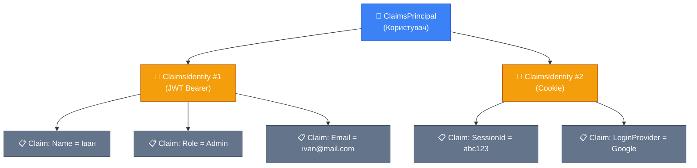
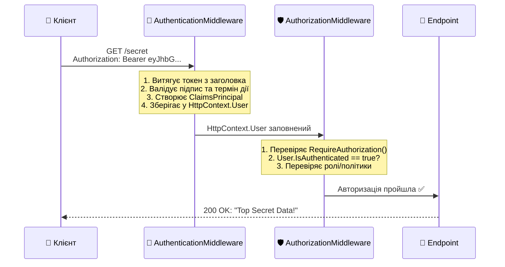

# Основи аутентифікації та авторизації

::note
За даними OWASP Top 10, **«Broken Access Control»** — це вразливість **#1** у веб-додатках. Понад 94% додатків мають ту чи іншу проблему з контролем доступу. У цій статті ми розберемо фундамент, на якому будується весь захист ASP.NET Core: як фреймворк дізнається _хто_ робить запит і _чи має він право_ це робити.

::

---

## 1. Навіщо це потрібно?

Уявіть API інтернет-магазину. Ось лише кілька запитів, які він обробляє щоденно:

| Запит                  | Хто має право?                                |
| :--------------------- | :-------------------------------------------- |
| `GET /products`        | Будь-хто (навіть без логіну)                  |
| `POST /orders`         | Тільки зареєстрований покупець                |
| `PUT /orders/42`       | Тільки **автор** замовлення #42               |
| `DELETE /products/5`   | Тільки адміністратор                          |
| `GET /admin/dashboard` | Тільки адміністратор з правом `ViewDashboard` |

Без системи контролю доступу будь-який анонімний клієнт може видалити товари або переглянути адмін-панель. Система безпеки вирішує дві послідовні задачі:

::card-group

::card{title="🔑 Аутентифікація (Authentication)" icon="i-lucide-key"}
**«Хто ти?»** — перевірка ідентичності. Клієнт надає доказ того, хто він (логін/пароль, токен, cookie). Результат: система знає ім'я, ID та роль користувача — або знає, що запит **анонімний**.

::

::card{title="🛡️ Авторизація (Authorization)" icon="i-lucide-shield-check"}
**«Що тобі дозволено?»** — перевірка прав. Вже знаючи _хто_ робить запит, система перевіряє: чи має цей користувач дозвіл на **конкретну дію** з **конкретним ресурсом**.

::

::

::warning
**Порядок завжди фіксований:** спочатку аутентифікація, потім авторизація. Не можна перевірити права, не знаючи, хто робить запит. Це відображено в порядку middleware у ASP.NET Core.

::

### Аналогія: аеропорт

- **Аутентифікація** = перевірка паспорта на контролі. Охоронець визначає: ви — це ви. Паспорт = ваш **токен**. Якщо паспорта немає — вас не пустять далі.
- **Авторизація** = перевірка посадкового талона на гейті. Ви — відома особа (паспорт перевірено), але чи маєте ви право зайти **на цей конкретний рейс**? Посадковий талон = ваші **дозволи (Claims)**.

---

## 2. Модель ідентичності .NET: Claims

### Що таке Claim?

У .NET ідентичність користувача побудована на концепції **Claims** (тверджень). Claim — це факт про користувача у форматі «ключ-значення»:

| Claim (Type)       | Value                | Що означає       |
| :----------------- | :------------------- | :--------------- |
| `ClaimTypes.Name`  | `"Іван Петренко"`    | Ім'я користувача |
| `ClaimTypes.Email` | `"ivan@example.com"` | Email            |
| `ClaimTypes.Role`  | `"Admin"`            | Роль             |
| `"user_id"`        | `"42"`               | Кастомний ID     |
| `"subscription"`   | `"premium"`          | Тип підписки     |

Claims — це **не тільки** стандартні поля (ім'я, email). Ви можете створити **будь-який** claim: `"department"`, `"country"`, `"age_verified"`. Це робить систему надзвичайно гнучкою.

### Три рівні: Claim → ClaimsIdentity → ClaimsPrincipal

Ідентичність у .NET має трирівневу структуру:

::mermaid



::

::field-group

::field{name="Claim" type="record"}
Один факт про користувача. Має `Type` (ключ) і `Value` (значення). Наприклад: `new Claim(ClaimTypes.Name, "Іван")`.

::

::field{name="ClaimsIdentity" type="class"}
Колекція Claims, отримана з **одного джерела** (одна «посвідка»). Наприклад: identity від JWT-токена або identity від Google OAuth. Має властивість `AuthenticationType` — назву схеми, яка створила цю identity.

::

::field{name="ClaimsPrincipal" type="class"}
Самий користувач. Може мати **декілька** ClaimsIdentity одночасно (JWT + Cookie). Це `HttpContext.User` — саме із ним ви працюєте в ендпоінтах.

::

::

### Створення вручну

Щоб зрозуміти, як ці класи працюють, створимо їх вручну:

```csharp [Створення ClaimsPrincipal вручну]
// 1. Створюємо набір тверджень (Claims)
var claims = new List<Claim>
{
    new(ClaimTypes.Name, "Іван Петренко"),
    new(ClaimTypes.Email, "ivan@example.com"),
    new(ClaimTypes.Role, "Admin"),
    new("user_id", "42"),
    new("subscription", "premium")
};

// 2. Загортаємо у «посвідку» (Identity)
//    "Bearer" — назва схеми аутентифікації
var identity = new ClaimsIdentity(claims, "Bearer");

// 3. Загортаємо у «користувача» (Principal)
var principal = new ClaimsPrincipal(identity);

// Тепер можемо перевірити:
Console.WriteLine(principal.Identity?.Name);
// → "Іван Петренко"

Console.WriteLine(
    principal.Identity?.IsAuthenticated);
// → true (бо вказали AuthenticationType)

Console.WriteLine(
    principal.IsInRole("Admin"));
// → true

Console.WriteLine(
    principal.FindFirst("user_id")?.Value);
// → "42"
```

Зверніть увагу на другий аргумент конструктора `ClaimsIdentity("Bearer")`. Це **`AuthenticationType`** — назва схеми. Якщо не вказати — `IsAuthenticated` поверне `false`, і система вважатиме користувача **анонімним**, навіть якщо claims є!

::caution
**Критичне правило:** `ClaimsIdentity` без `AuthenticationType` = анонімний користувач. Завжди вказуйте тип аутентифікації, навіть якщо він може бути будь-яким рядком.

::

---

## 3. Потік аутентифікації у ASP.NET Core

### Middleware Pipeline

Аутентифікація та авторизація — це два **middleware** у конвеєрі запитів. Їхній порядок **критично важливий**:

```csharp [Program.cs — порядок middleware]
var builder = WebApplication.CreateBuilder(args);

// Реєстрація сервісів аутентифікації
builder.Services.AddAuthentication();
builder.Services.AddAuthorization();

var app = builder.Build();

// ⚠️ ПОРЯДОК КРИТИЧНИЙ!
app.UseAuthentication();   // 1. Хто ти?
app.UseAuthorization();    // 2. Чи маєш ти право?

app.MapGet("/secret", () => "Top Secret Data!")
    .RequireAuthorization();

app.Run();
```

::warning
Якщо поміняти місцями `UseAuthentication()` і `UseAuthorization()`, авторизація буде перевіряти **анонімного** користувача (бо аутентифікація ще не відбулася). Кожен захищений ендпоінт повертатиме `401`.

::

### Що відбувається всередині?

Ось повний шлях HTTP-запиту через систему безпеки:

::mermaid



::

::steps

### AuthenticationMiddleware

Middleware дивиться на запит і намагається **ідентифікувати** клієнта:

1. Перевіряє, чи є заголовок `Authorization: Bearer <token>` (або cookie, або інше джерело — залежить від схеми).
2. Якщо є — **валідує** токен (перевіряє підпис, срок дії, issuer тощо).
3. Якщо валідний — створює `ClaimsPrincipal` з claims, витягнутими з токена.
4. Зберігає його у `HttpContext.User`.
5. Якщо токена немає або він невалідний — `HttpContext.User` залишається **анонімним** (пустий principal).

**Важливо:** `AuthenticationMiddleware` **не блокує** запит! Навіть якщо токен невалідний — запит проходить далі. Блокування — задача `AuthorizationMiddleware`.

### AuthorizationMiddleware

Middleware перевіряє, чи має `HttpContext.User` **право** на виконання запиту:

1. Перевіряє, чи ендпоінт вимагає авторизації (`.RequireAuthorization()`).
2. Якщо так — перевіряє `User.IsAuthenticated`. Якщо `false` → `401 Unauthorized`.
3. Перевіряє ролі, політики, вимоги.
4. Якщо вимоги не виконані → `403 Forbidden`.
5. Якщо все ок — запит проходить до ендпоінту.

::

---

## 4. Схеми аутентифікації (Authentication Schemes)

### Що таке схема?

ASP.NET Core підтримує **множинну аутентифікацію**. Один додаток може одночасно приймати:

- JWT-токени від мобільного додатка
- Cookies від веб-інтерфейсу
- API ключі від зовнішніх сервісів

Кожен такий спосіб аутентифікації називається **схемою (Scheme)**. Схема — це іменована конфігурація, яка визначає:

1. **Як витягти** дані з запиту (з заголовка? з cookie? з query string?)
2. **Як валідувати** ці дані (перевірити підпис JWT? запитати базу?)
3. **Як створити** ClaimsPrincipal з результату

```csharp [Реєстрація двох схем одночасно]
builder.Services.AddAuthentication(options =>
{
    // Схема за замовчуванням
    options.DefaultScheme = "Cookies";
    // Схема для Challenge (401)
    options.DefaultChallengeScheme = "Bearer";
})
.AddJwtBearer("Bearer", options =>
{
    // Конфігурація JWT...
})
.AddCookie("Cookies", options =>
{
    // Конфігурація Cookie...
});
```

### Вбудовані схеми ASP.NET Core

| Схема              | NuGet-пакет                                         | Для чого               |
| :----------------- | :-------------------------------------------------- | :--------------------- |
| **JWT Bearer**     | `Microsoft.AspNetCore.Authentication.JwtBearer`     | API-токени (stateless) |
| **Cookie**         | Вбудований                                          | Веб-додатки (stateful) |
| **OAuth 2.0**      | `Microsoft.AspNetCore.Authentication.Google` тощо   | «Увійти через Google»  |
| **OpenID Connect** | `Microsoft.AspNetCore.Authentication.OpenIdConnect` | Корпоративний SSO      |
| **Certificate**    | Вбудований                                          | mTLS між сервісами     |

У наступних статтях ми детально розглянемо кожну з них.

---

## 5. HttpContext.User — ваша точка доступу

Після проходження `AuthenticationMiddleware`, інформація про користувача доступна через `HttpContext.User`. Ось як працювати з ним у Minimal API:

```csharp [Доступ до Claims у ендпоінті]
app.MapGet("/me", (HttpContext ctx) =>
{
    // Перевірка аутентифікації
    if (ctx.User.Identity?.IsAuthenticated != true)
        return Results.Json(
            new { error = "Not authenticated" },
            statusCode: 401);

    // Читання Claims
    var userId = ctx.User.FindFirst("user_id")?.Value;
    var name = ctx.User.Identity.Name;
    var email = ctx.User
        .FindFirst(ClaimTypes.Email)?.Value;
    var roles = ctx.User
        .FindAll(ClaimTypes.Role)
        .Select(c => c.Value)
        .ToList();

    return Results.Ok(new
    {
        userId,
        name,
        email,
        roles,
        isAdmin = ctx.User.IsInRole("Admin")
    });
}).RequireAuthorization();
```

### Зручний доступ через ClaimsPrincipal

ASP.NET Core дозволяє ін'єктувати `ClaimsPrincipal` напряму як параметр ендпоінту:

```csharp [ClaimsPrincipal як параметр]
// Замість HttpContext — отримуємо User напряму
app.MapGet("/me", (ClaimsPrincipal user) =>
{
    var name = user.Identity?.Name;
    var email = user.FindFirst(ClaimTypes.Email)?.Value;

    return Results.Ok(new { name, email });
}).RequireAuthorization();
```

Це коротший і чистіший варіант, який рекомендується для більшості випадків.

### Типові помилки при роботі з Claims

::accordion

::accordion-item{label="❌ Помилка: FindFirst повертає null" icon="i-lucide-alert-triangle"}

```csharp
// 💥 NullReferenceException, якщо claim відсутній!
var userId = int.Parse(
    ctx.User.FindFirst("user_id").Value);
```

**Виправлення:**

```csharp
// ✅ Безпечний варіант
var userIdClaim = ctx.User.FindFirst("user_id");
if (userIdClaim is null)
    return Results.Unauthorized();

var userId = int.Parse(userIdClaim.Value);
```

::

::accordion-item{label="❌ Помилка: IsAuthenticated без AuthenticationType" icon="i-lucide-alert-triangle"}

```csharp
// Створили identity БЕЗ типу аутентифікації
var identity = new ClaimsIdentity(claims);
// identity.IsAuthenticated == false! 😱
```

**Виправлення:**

```csharp
// ✅ Завжди вказуйте AuthenticationType
var identity = new ClaimsIdentity(claims, "Bearer");
// identity.IsAuthenticated == true ✅
```

::

::accordion-item{label="❌ Помилка: Role як один claim" icon="i-lucide-alert-triangle"}

```csharp
// ❌ Якщо у користувача 3 ролі —
// це не один claim з комою!
new Claim(ClaimTypes.Role, "Admin,Editor,User");
```

**Виправлення:**

```csharp
// ✅ Кожна роль — окремий Claim
new Claim(ClaimTypes.Role, "Admin"),
new Claim(ClaimTypes.Role, "Editor"),
new Claim(ClaimTypes.Role, "User")
// user.IsInRole("Admin") → true ✅
```

::

::

---

## 6. RequireAuthorization та AllowAnonymous

### Захист ендпоінтів

У Minimal API для захисту ендпоінту використовується метод `.RequireAuthorization()`:

```csharp [Захист окремих ендпоінтів]
// 🔓 Публічний — без авторизації
app.MapGet("/products", () =>
    Results.Ok(new[] { "Кава", "Чай" }));

// 🔒 Захищений — тільки для аутентифікованих
app.MapGet("/orders", (ClaimsPrincipal user) =>
    Results.Ok($"Orders for {user.Identity?.Name}"))
    .RequireAuthorization();

// 🔒 Захищений — тільки для ролі Admin
app.MapDelete("/products/{id}", (int id) =>
    Results.NoContent())
    .RequireAuthorization(policy =>
        policy.RequireRole("Admin"));
```

### Захист цілої групи

Через Route Groups можна захистити **всі ендпоінти** групи:

```csharp [Route Group із авторизацією]
// Усе, що в /admin/* — тільки для Admin
var admin = app.MapGroup("/admin")
    .RequireAuthorization(policy =>
        policy.RequireRole("Admin"));

admin.MapGet("/users", () => "Users list");
admin.MapGet("/stats", () => "Statistics");
// Обидва ендпоінти захищені! ✅
```

### AllowAnonymous — виняток із правила

Якщо група захищена, але один ендпоінт має бути публічним:

```csharp [AllowAnonymous — виключення]
var api = app.MapGroup("/api")
    .RequireAuthorization();  // Все захищено

api.MapGet("/products", () => "Products")
    .AllowAnonymous();  // Крім цього! 🔓

api.MapPost("/orders", () => "Created");
// Цей — захищений 🔒
```

---

## 7. Мінімальний робочий приклад

Зібравши все разом, ось повний мінімальний додаток з аутентифікацією:

```csharp [Program.cs — мінімальний auth]
using System.Security.Claims;

var builder = WebApplication.CreateBuilder(args);

// Додаємо сервіси auth
builder.Services.AddAuthentication();
builder.Services.AddAuthorization();

var app = builder.Build();

// Порядок middleware!
app.UseAuthentication();
app.UseAuthorization();

// 🔓 Публічний ендпоінт
app.MapGet("/", () => "Welcome! Login at /login");

// ⚙️ «Логін» — створюємо ClaimsPrincipal вручну
// (у реальності тут буде JWT — наступна стаття)
app.MapGet("/login", () =>
{
    var claims = new List<Claim>
    {
        new(ClaimTypes.Name, "Іван"),
        new(ClaimTypes.Role, "Admin"),
        new("user_id", "42")
    };

    var identity = new ClaimsIdentity(claims, "Demo");
    var principal = new ClaimsPrincipal(identity);

    // Виводимо Claims для демонстрації
    return Results.Ok(new
    {
        message = "Authenticated (demo)!",
        name = principal.Identity?.Name,
        isAuthenticated = principal
            .Identity?.IsAuthenticated,
        claims = claims.Select(c =>
            new { c.Type, c.Value })
    });
});

// 🔒 Захищений
app.MapGet("/me", (ClaimsPrincipal user) =>
{
    return Results.Ok(new
    {
        name = user.Identity?.Name,
        userId = user.FindFirst("user_id")?.Value,
        isAdmin = user.IsInRole("Admin")
    });
}).RequireAuthorization();

app.Run();
```

::note
Цей приклад — **демонстраційний**. Ми створюємо `ClaimsPrincipal` вручну, але не зберігаємо його між запитами. У реальності Claims надходять з **JWT-токена** (наступна стаття) або **cookie** (стаття 04). Поки що мета — зрозуміти, як працює модель Claims.

::

---

## 8. Практичні завдання

### Рівень 1: Базовий

::accordion

::accordion-item{label="Завдання 1.1: Створення ClaimsPrincipal" icon="i-lucide-circle-help"}
Створіть ендпоінт `GET /identity-info`, який:

1. Створює `ClaimsPrincipal` вручну з 5 claims: Name, Email, Role (2 штуки — «User» і «Editor»), кастомний `department` = «IT»
2. Повертає JSON з усіма even claims (`Type` + `Value`)
3. Повертає `IsAuthenticated`, `Name`, `IsInRole("Editor")`, `IsInRole("Admin")`
4. Спробуйте створити `ClaimsIdentity` **без** `AuthenticationType` — що зміниться в результаті?

::

::accordion-item{label="Завдання 1.2: Ланцюжок middleware" icon="i-lucide-circle-help"}
Створіть мінімальний додаток:

1. Зареєструйте `AddAuthentication()` та `AddAuthorization()`
2. Додайте 3 ендпоінти: `/public` (🔓), `/private` (🔒 `.RequireAuthorization()`), `/admin` (🔒 `.RequireRole("Admin")`)
3. Протестуйте: що повертає кожен ендпоінт без аутентифікації? Який статус-код?
4. Поміняйте місцями `UseAuthentication()` та `UseAuthorization()` — що зміниться?

::

::

### Рівень 2: Проєктування

::accordion

::accordion-item{label="Завдання 1.3: Route Groups з авторизацією" icon="i-lucide-circle-help"}
Спроєктуйте API з трьома зонами доступу:

1. Група `/api/public` — без авторизації: `GET /products`, `GET /categories`
2. Група `/api/user` — для аутентифікованих: `GET /orders`, `POST /orders`
3. Група `/api/admin` — тільки роль Admin: `GET /users`, `DELETE /users/{id}`
4. В групі `/api/user` один ендпоінт `GET /api/user/profile` має бути доступний без авторизації (`.AllowAnonymous()`)
5. Виведіть у відповіді кожного ендпоінту: `User.Identity.Name`, `IsAuthenticated`, список ролей

::

::

### Рівень 3: Архітектура

::accordion

::accordion-item{label="Завдання 1.4: Claims Extension Methods" icon="i-lucide-circle-help"}
Створіть набір extension methods для зручної роботи з Claims:

1. `GetUserId(this ClaimsPrincipal)` → `int?`
2. `GetEmail(this ClaimsPrincipal)` → `string?`
3. `HasRole(this ClaimsPrincipal, string role)` → `bool`
4. `GetSubscriptionType(this ClaimsPrincipal)` → `string?` (кастомний claim `"subscription"`)
5. Використайте їх у 3 ендпоінтах замість прямого доступу до `FindFirst()`
6. Чому extension methods краще, ніж прямі виклики `FindFirst`? Яка перевага при рефакторингу?

::

::

---

## 9. Резюме

::card-group

::card{title="Authentication ≠ Authorization" icon="i-lucide-key"}
Аутентифікація — «хто ти?». Авторизація — «що тобі дозволено?». Спочатку перша, потім друга. Порядок middleware критичний.

::

::card{title="Claims — основа всього" icon="i-lucide-id-card"}
Claim → ClaimsIdentity → ClaimsPrincipal. Кожен факт про користувача — окремий Claim. Не забувайте AuthenticationType!

::

::card{title="HttpContext.User" icon="i-lucide-user"}
ClaimsPrincipal доступний через HttpContext.User або як параметр ендпоінту. FindFirst для отримання claims, IsInRole для перевірки ролей.

::

::card{title="RequireAuthorization" icon="i-lucide-shield"}
Захист ендпоінтів — через .RequireAuthorization(). Route Groups — для масового захисту. AllowAnonymous — для виключень.

::

::

**Далі:** у наступній статті ми реалізуємо повноцінну **JWT-аутентифікацію** — від генерації токенів до login/refresh ендпоінтів. Claims, які ми вивчили тут, стануть «начинкою» JWT-токена.
