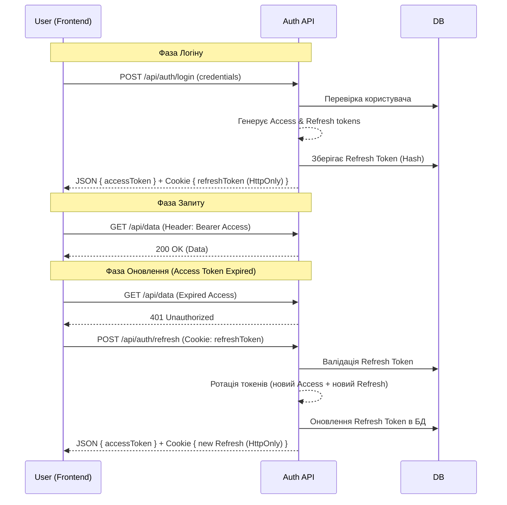

# JWT + Refresh Tokens (HttpOnly Cookie)

::note
Цей матеріал фокусується на побудові промислового стандарту автентифікації для сучасних SPA (Single Page Applications) та мобільних додатків, де безпека токенів є критичним пріоритетом.
::

## Вступ: Проблема Stateless-автентифікації

Коли ми говоримо про JWT (JSON Web Tokens), ми часто чуємо про їхню головну перевагу: **бессерверність (stateless)**. Серверу не потрібно зберігати сесії в пам'яті чи базі даних; вся інформація про користувача знаходиться в самому токені. Але ця перевага перетворюється на вразливість, коли постає питання відкликання доступу.

### Дилема часу життя токена

Уявіть, що ви видали Access Token на 24 години. Якщо цей токен вкрадуть, зловмисник матиме повний доступ до аккаунта цілу добу, і ви нічого не зможете з цим зробити «на льоту».

- **Короткий термін**: Якщо токен живе 5 хвилин — це безпечно, але користувач буде в люті, бо йому доведеться вводити логін кожні 5 хвилин.
- **Довгий термін**: Якщо токен живе 7 днів — це зручно, але це катастрофа для безпеки.

**Рішення?** Комбінація двох токенів:
1.  **Access Token**: Живе дуже мало (5-15 хв), передається в заголовку `Authorization: Bearer ...`, використовується для доступу до API.
2.  **Refresh Token**: Живе довго (дні або тижні), використовується **тільки** для отримання нового Access Token, зберігається в максимально захищеному місці.

## Архітектура безпеки: Чому HttpOnly?

Найпоширеніша помилка — зберігати обидва токени в `localStorage`. Це робить додаток вразливим до **XSS (Cross-Site Scripting)** атак. Будь-який сторонній скрипт (метрика, реклама, бібліотека) може прочитати `localStorage` і вкрасти токени.

### Стратегія "Розділення Обов'язків"

Ми застосуємо гібридний підхід:
- **Access Token** повертається в JSON-відповіді. Фронтенд зберігає його в пам'яті (JS variable). При оновленні сторінки він зникає, але це не проблема, бо ми маємо...
- **Refresh Token**, який сервер встановлює за допомогою заголовока `Set-Cookie` з прапорцем `HttpOnly`.

::tip{icon="i-heroicons-shield-check"}
**HttpOnly** Cookie неможливо прочитати через JavaScript (`document.cookie` поверне порожнечу). Це робить крадіжку токена через XSS технічно неможливою.
::

### Sequence Diagram: Життєвий цикл автентифікації

::mermaid

::

---

## Частина 1: Підготовка Моделей Даних

Нам потрібно розширити ASP.NET Core Identity, щоб зберігати інформацію про Refresh токени. Хоча Identity має таблицю `AspNetUserTokens`, вона не зовсім зручна для кастомної логіки ротації. Ми створимо власну сутність.

### Модель RefreshToken

```csharp [Entities/RefreshToken.cs]
using System.ComponentModel.DataAnnotations;

namespace IdentityAuthJwt.Entities;

public class RefreshToken
{
    [Key]
    public int Id { get; set; }
    
    // Сам токен (зазвичай це випадковий Base64 string або GUID)
    public required string Token { get; set; }
    
    // Час закінчення дії
    public DateTime ExpiresAt { get; set; }
    
    // Дата створення
    public DateTime CreatedAt { get; set; } = DateTime.UtcNow;
    
    // Дата використання (для відстеження ротації)
    public DateTime? RevokedAt { get; set; }
    
    // Чи анульований токен
    public bool IsRevoked => RevokedAt != null;
    
    // Чи закінчився термін дії
    public bool IsExpired => DateTime.UtcNow >= ExpiresAt;
    
    // Чи активний токен зараз
    public bool IsActive => !IsRevoked && !IsExpired;

    // Зв'язок з користувачем
    public string UserId { get; set; } = null!;
    public ApplicationUser User { get; set; } = null!;
}
```

**Анатомія моделі:**
1.  **`Token`**: Ми не зберігаємо Access Token в БД, але Refresh Token — обов'язково. Це дозволяє нам відкликати сесії (наприклад, при зміні пароля).
2.  **`RevokedAt`**: Замість фізичного видалення, ми позначаємо токен як відкликаний. Це важливо для **Token Rotation Detection**.
3.  **`IsActive`**: Зручна властивість, що об'єднує логіку перевірки терміну та статусу.

### Розширення ApplicationUser

```csharp [Entities/ApplicationUser.cs]
using Microsoft.AspNetCore.Identity;

namespace IdentityAuthJwt.Entities;

public class ApplicationUser : IdentityUser
{
    public string? FirstName { get; set; }
    public string? LastName { get; set; }
    
    // Список усіх рефреш-токенів користувача (історія сесій)
    public List<RefreshToken> RefreshTokens { get; set; } = [];
}
```

---

## Частина 2: Конфігурація та DTO

Перш ніж створювати логіку, визначимо об'єкти передачі даних (DTO) та налаштування JWT.

### JWT Options

```csharp [Models/JwtOptions.cs]
namespace IdentityAuthJwt.Models;

public class JwtOptions
{
    public const string SectionName = "Jwt";
    
    public string Secret { get; set; } = string.Empty;
    public string Issuer { get; set; } = string.Empty;
    public string Audience { get; set; } = string.Empty;
    
    // Час життя у хвилинах
    public int AccessTokenExpirationMinutes { get; set; }
    
    // Час життя у днях
    public int RefreshTokenExpirationDays { get; set; }
}
```

### Data Transfer Objects (DTOs)

Нам потрібні структури для входу, реєстрації та відповіді.

::code-group
```csharp [Models/DTOs/LoginRequest.cs]
public record LoginRequest(
    [Required, EmailAddress] string Email,
    [Required] string Password
);
```

```csharp [Models/DTOs/RegisterRequest.cs]
public record RegisterRequest(
    [Required] string FirstName,
    [Required] string LastName,
    [Required, EmailAddress] string Email,
    [Required, MinLength(6)] string Password
);
```

```csharp [Models/DTOs/AuthResponse.cs]
public record AuthResponse(
    string AccessToken,
    DateTime AccessTokenExpiration,
    string FirstName,
    string LastName,
    string Email
);
```
::

---

## Частина 3: Сервіс керування токенами

Це "серце" системи. Тут відбувається криптографічна магія та логіка БД.

```csharp [Services/ITokenService.cs]
using System.Security.Claims;
using IdentityAuthJwt.Entities;
using IdentityAuthJwt.Models.DTOs;

namespace IdentityAuthJwt.Services;

public interface ITokenService
{
    Task<AuthResponse> CreateAuthResponseAsync(ApplicationUser user);
    Task<AuthResponse?> RefreshTokensAsync(string refreshToken);
    Task<bool> RevokeTokenAsync(string refreshToken);
}
```

### Реалізація TokenService

Цей клас буде відповідати за генерацію JWT та менеджмент куків рефрешу в базі.

```csharp [Services/TokenService.cs]
using System.IdentityModel.Tokens.Jwt;
using System.Security.Claims;
using System.Security.Cryptography;
using System.Text;
using IdentityAuthJwt.Data;
using IdentityAuthJwt.Entities;
using IdentityAuthJwt.Models;
using IdentityAuthJwt.Models.DTOs;
using Microsoft.EntityFrameworkCore;
using Microsoft.Extensions.Options;
using Microsoft.IdentityModel.Tokens;

namespace IdentityAuthJwt.Services;

public class TokenService(
    ApplicationDbContext context,
    IOptions<JwtOptions> jwtOptions,
    IHttpContextAccessor httpContextAccessor) : ITokenService
{
    private readonly JwtOptions _jwtOptions = jwtOptions.Value;

    public async Task<AuthResponse> CreateAuthResponseAsync(ApplicationUser user)
    {
        // 1. Генеруємо Access Token
        var (accessToken, expiresAt) = GenerateAccessToken(user);
        
        // 2. Генеруємо новий Refresh Token
        var refreshToken = GenerateRefreshTokenEntity(user.Id);
        
        // 3. Зберігаємо в БД
        context.RefreshTokens.Add(refreshToken);
        await context.SaveChangesAsync();
        
        // 4. Встановлюємо Cookie
        SetRefreshTokenCookie(refreshToken.Token);

        return new AuthResponse(
            accessToken,
            expiresAt,
            user.FirstName ?? "",
            user.LastName ?? "",
            user.Email!
        );
    }

    public async Task<AuthResponse?> RefreshTokensAsync(string token)
    {
        var refreshToken = await context.RefreshTokens
            .Include(t => t.User)
            .SingleOrDefaultAsync(t => t.Token == token);

        // Перевірка валідності (IsActive = Not Revoked & Not Expired)
        if (refreshToken == null || !refreshToken.IsActive)
            return null;

        // TOKEN ROTATION: Старий токен анулюємо, видаємо нову пару
        refreshToken.RevokedAt = DateTime.UtcNow;
        
        // Генеруємо нову відповідь (логіка аналогічна CreateAuthResponse)
        return await CreateAuthResponseAsync(refreshToken.User);
    }

    public async Task<bool> RevokeTokenAsync(string token)
    {
        var refreshToken = await context.RefreshTokens
            .SingleOrDefaultAsync(t => t.Token == token);

        if (refreshToken == null || !refreshToken.IsActive)
            return false;

        refreshToken.RevokedAt = DateTime.UtcNow;
        await context.SaveChangesAsync();
        return true;
    }

    private (string Token, DateTime ExpiresAt) GenerateAccessToken(ApplicationUser user)
    {
        var claims = new List<Claim>
        {
            new(JwtRegisteredClaimNames.Sub, user.Id),
            new(JwtRegisteredClaimNames.Email, user.Email!),
            new(JwtRegisteredClaimNames.Jti, Guid.NewGuid().ToString()),
            new("name", $"{user.FirstName} {user.LastName}")
        };

        var key = new SymmetricSecurityKey(Encoding.UTF8.GetBytes(_jwtOptions.Secret));
        var creds = new SigningCredentials(key, SecurityAlgorithms.HmacSha256);
        var expiresAt = DateTime.UtcNow.AddMinutes(_jwtOptions.AccessTokenExpirationMinutes);

        var token = new JwtSecurityToken(
            _jwtOptions.Issuer,
            _jwtOptions.Audience,
            claims,
            expiresAt: expiresAt,
            signingCredentials: creds
        );

        return (new JwtSecurityTokenHandler().WriteToken(token), expiresAt);
    }

    private RefreshToken GenerateRefreshTokenEntity(string userId)
    {
        // Створюємо випадковий криптографічно стійкий рядок
        var randomNumber = new byte[64];
        using var rng = RandomNumberGenerator.Create();
        rng.GetBytes(randomNumber);
        
        return new RefreshToken
        {
            Token = Convert.ToBase64String(randomNumber),
            ExpiresAt = DateTime.UtcNow.AddDays(_jwtOptions.RefreshTokenExpirationDays),
            UserId = userId
        };
    }

    private void SetRefreshTokenCookie(string token)
    {
        var cookieOptions = new CookieOptions
        {
            HttpOnly = true,    // Заборона читання через JS
            Secure = true,      // Тільки через HTTPS
            SameSite = SameSiteMode.Strict, // Захист від CSRF
            Expires = DateTime.UtcNow.AddDays(_jwtOptions.RefreshTokenExpirationDays)
        };

        httpContextAccessor.HttpContext?.Response.Cookies.Append("refreshToken", token, cookieOptions);
    }
}
```

**Декомпозиція магії:**
1.  **`SetRefreshTokenCookie`**: Зверніть увагу на `HttpOnly = true` та `SameSite = Strict`. Це фундамент безпеки. `SameSite.Strict` гарантує, що кука не буде надіслана при переході з інших сайтів, що майже повністю нівелює ризик CSRF.
2.  **`GenerateRefreshTokenEntity`**: Ми використовуємо `RandomNumberGenerator` замість `Guid.NewGuid()`. Це забезпечує набагато вищу ентропію (непередбачуваність) токена.
3.  **Token Rotation**: У методі `RefreshTokensAsync` ми анулюємо старий токен (`RevokedAt = DateTime.UtcNow`) перед видачею нового. Це запобігає повторному використанню того самого рефреш-токена.

---

## Частина 4: Автентифікаційний Контролер

Тепер об'єднаємо все в API-ендпоінти.

```csharp [Controllers/AuthController.cs]
using IdentityAuthJwt.Entities;
using IdentityAuthJwt.Models.DTOs;
using IdentityAuthJwt.Services;
using Microsoft.AspNetCore.Identity;
using Microsoft.AspNetCore.Mvc;

namespace IdentityAuthJwt.Controllers;

[ApiController]
[Route("api/[controller]")]
public class AuthController(
    UserManager<ApplicationUser> userManager,
    ITokenService tokenService) : ControllerBase
{
    [HttpPost("register")]
    public async Task<IActionResult> Register(RegisterRequest request)
    {
        var user = new ApplicationUser
        {
            UserName = request.Email,
            Email = request.Email,
            FirstName = request.FirstName,
            LastName = request.LastName
        };

        var result = await userManager.CreateAsync(user, request.Password);

        if (!result.Succeeded)
            return BadRequest(result.Errors);

        return Ok(new { Message = "User registered successfully" });
    }

    [HttpPost("login")]
    public async Task<ActionResult<AuthResponse>> Login(LoginRequest request)
    {
        var user = await userManager.FindByEmailAsync(request.Email);
        
        if (user == null || !await userManager.CheckPasswordAsync(user, request.Password))
            return Unauthorized("Invalid credentials");

        var response = await tokenService.CreateAuthResponseAsync(user);
        return Ok(response);
    }

    [HttpPost("refresh")]
    public async Task<ActionResult<AuthResponse>> Refresh()
    {
        // Отримуємо токен з куків
        var refreshToken = Request.Cookies["refreshToken"];

        if (string.IsNullOrEmpty(refreshToken))
            return Unauthorized("Refresh token is missing");

        var response = await tokenService.RefreshTokensAsync(refreshToken);

        if (response == null)
            return Unauthorized("Invalid or expired refresh token");

        return Ok(response);
    }

    [HttpPost("logout")]
    public async Task<IActionResult> Logout()
    {
        var refreshToken = Request.Cookies["refreshToken"];
        
        if (!string.IsNullOrEmpty(refreshToken))
            await tokenService.RevokeTokenAsync(refreshToken);

        // Очищаємо куку на клієнті
        Response.Cookies.Delete("refreshToken");
        
        return Ok(new { Message = "Logged out successfully" });
    }
}
```

---

## Частина 5: Конфігурація Middleware (Program.cs)

Нам потрібно правильно налаштувати DI (Dependency Injection) та схеми автентифікації.

```csharp [Program.cs]
using System.Text;
using IdentityAuthJwt.Data;
using IdentityAuthJwt.Entities;
using IdentityAuthJwt.Models;
using IdentityAuthJwt.Services;
using Microsoft.AspNetCore.Authentication.JwtBearer;
using Microsoft.AspNetCore.Identity;
using Microsoft.EntityFrameworkCore;
using Microsoft.IdentityModel.Tokens;

var builder = WebApplication.CreateBuilder(args);

// 1. Конфігурація БД
builder.Services.AddDbContext<ApplicationDbContext>(options =>
    options.UseSqlServer(builder.Configuration.GetConnectionString("DefaultConnection")));

// 2. Identity
builder.Services.AddIdentity<ApplicationUser, IdentityRole>(options => {
    options.Password.RequiredLength = 8;
    options.User.RequireUniqueEmail = true;
})
.AddEntityFrameworkStores<ApplicationDbContext>();

// 3. JWT Options Mapping
builder.Services.Configure<JwtOptions>(builder.Configuration.GetSection(JwtOptions.SectionName));
var jwtOptions = builder.Configuration.GetSection(JwtOptions.SectionName).Get<JwtOptions>()!;

// 4. Автентифікація JWT
builder.Services.AddAuthentication(options => {
    options.DefaultAuthenticateScheme = JwtBearerDefaults.AuthenticationScheme;
    options.DefaultChallengeScheme = JwtBearerDefaults.AuthenticationScheme;
})
.AddJwtBearer(options => {
    options.SaveToken = true;
    options.TokenValidationParameters = new TokenValidationParameters
    {
        ValidateIssuer = true,
        ValidateAudience = true,
        ValidateLifetime = true,
        ValidateIssuerSigningKey = true,
        ValidIssuer = jwtOptions.Issuer,
        ValidAudience = jwtOptions.Audience,
        IssuerSigningKey = new SymmetricSecurityKey(Encoding.UTF8.GetBytes(jwtOptions.Secret)),
        ClockSkew = TimeSpan.Zero // Важливо: прибираємо 5-хвилинний допуск
    };
});

// 5. Власні сервіси
builder.Services.AddScoped<ITokenService, TokenService>();
builder.Services.AddHttpContextAccessor(); // Потрібно для Cookie management у сервісі

builder.Services.AddControllers();

var app = builder.Build();

app.UseHttpsRedirection();

// Важливо: Auth йде перед Authorization
app.UseAuthentication();
app.UseAuthorization();

app.MapControllers();

app.Run();
```

---

## Частина 6: Фронтенд-інтеграція (React + Axios)

На боці клієнта нам потрібно навчити додаток автоматично оновлювати Access Token, коли він закінчується, використовуючи куки.

::tip
При запитах до API з куками обов'язково встановлюйте параметр `withCredentials: true`. Без нього браузер не надішле HttpOnly куки.
::

```javascript [AuthService.js]
import axios from 'axios';

const api = axios.create({
    baseURL: 'https://api.myapp.com',
    withCredentials: true // Дозволяє надсилати HttpOnly куки
});

// Interceptor для додавання Access Token до кожного запиту
api.interceptors.request.use(config => {
    const token = localStorage.getItem('accessToken'); // Можна зберігати в Redux/Zustand
    if (token) {
        config.headers.Authorization = `Bearer ${token}`;
    }
    return config;
});

// Interceptor для обробки 401 (Expired Token)
api.interceptors.response.use(
    (response) => response,
    async (error) => {
        const originalRequest = error.config;

        // Якщо помилка 401 і ми ще не пробували оновити токен
        if (error.response.status === 401 && !originalRequest._retry) {
            originalRequest._retry = true;

            try {
                // Викликаємо ендпоінт рефрешу
                // Кука refreshToken надішлеться автоматично браузером (HttpOnly)
                const { data } = await axios.post('https://api.myapp.com/api/auth/refresh', {}, {
                    withCredentials: true
                });

                // Зберігаємо новий access token
                localStorage.setItem('accessToken', data.accessToken);
                
                // Оновлюємо заголовок і повторюємо оригінальний запит
                originalRequest.headers.Authorization = `Bearer ${data.accessToken}`;
                return api(originalRequest);
            } catch (refreshError) {
                // Якщо рефреш не вдався (наприклад, сесія закінчилась) — редирект на логін
                window.location.href = '/login';
                return Promise.reject(refreshError);
            }
        }
        return Promise.reject(error);
    }
);

export default api;
```

---

## Hardening Security (Посилення безпеки)

### 1. Token Rotation Detection (Виявлення крадіжки)
Якщо зловмисник вкрав Refresh Token і викорисад його, а потім справжній користувач спробував застосувати той самий **вже використаний** токен — ми знаємо, що сталася компрометація.

**Що робити в такому разі?** Анулювати **всі** активні рефреш-токени цього користувача, примусово вилогінивши всі девайси.

```csharp
// В методі RefreshTokensAsync
if (refreshToken.IsRevoked) 
{
    // WARNING: Хтось намагається використати вже відкликаний токен!
    // Можлива атака replay.
    await RevokeAllTokensForUser(refreshToken.UserId);
    return null;
}
```

### 2. Clock Skew
За замовчуванням ASP.NET Core додає 5 хвилин до часу життя токена для компенсації розбіжності часу між серверами. Для Access Token, який живе 5 хвилин, це подвоює його термін. Завжди ставте `ClockSkew = TimeSpan.Zero` у продакшні.

---

## Практичні завдання

::steps
### Рівень 1: Базовий
1.  **Додайте ліміт сесій**: Модифікуйте `TokenService`, щоб користувач міг мати не більше 5 активних Refresh Token (сесій). При створенні нового, якщо ліміт перевищено, видаляйте найстаріший.
2.  **IP Tracking**: Додайте поле `CreatedByIp` до моделі `RefreshToken` і записуйте IP-адресу клієнта при генерації.

### Рівень 2: Логіка
1.  **Захист від Replay**: Реалізуйте логіку `RevokeAllTokensForUser`, яка спрацьовує при спробі використати `RevokedAt != null` токен.
2.  **Fingerprinting**: Додайте до моделі токена поле `UserAgent`. Відобразіть список активних сесій користувача з інформацією про браузер та ОС.

### Рівень 3: Архітектура
1.  **White-list IPs**: Додайте функціонал «прив'язки» токена до IP. Якщо IP змінюється під час рефрешу, вимагайте повторної авторизації через email (або просто анулюйте токен).
2.  **Background Cleanup**: Створіть `IHostedService` (Worker), який раз на добу видаляє з бази даних токени, що закінчилися більше місяця тому (щоб база не розросталася).
::

## Резюме

Комбінація **JWT (Access)** + **HttpOnly Cookie (Refresh)** є "золотим стандартом" безпеки сьогодні. Вона поєднує зручність бессерверної перевірки токенів з можливістю сервісного контролю над сесіями та захистом від XSS.

**Ключові тези:**
- Не зберігайте токени в `localStorage`.
- Використовуйте **Token Rotation**.
- Завжди перевіряйте статус токена в БД під час рефрешу.
- Не забувайте про `credentials: include` на фронтенді.
