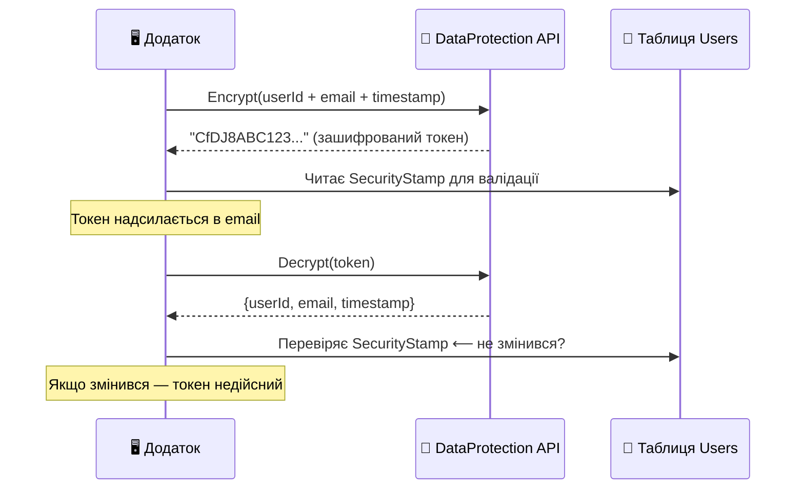
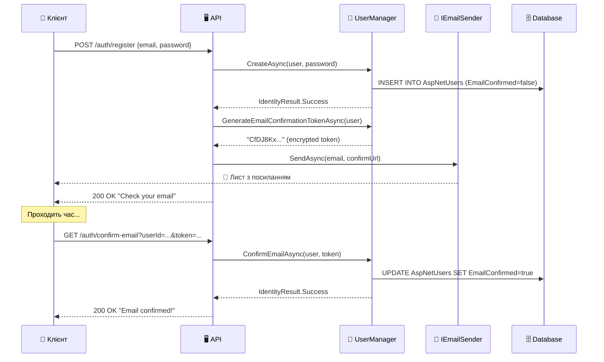
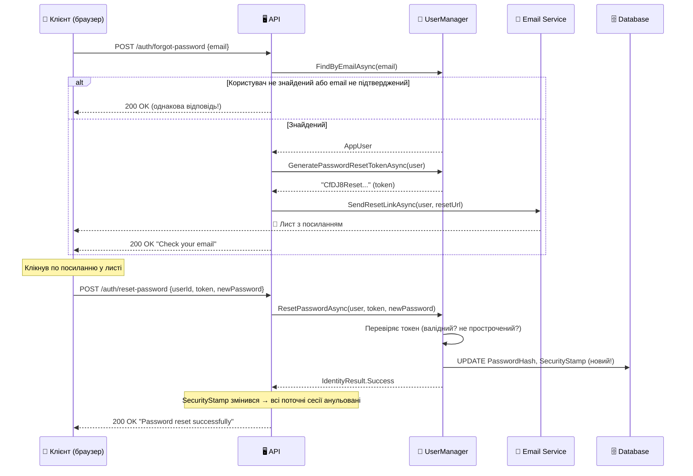

# Identity: Підтвердження Email та Скидання Пароля

::note
Уявіть: користувач реєструється з випадковою опечаткою в email — `ivaan@gmial.com` замість `ivan@gmail.com`. Він ніколи не отримає листів від вашого сервісу. Або, що гірше, хтось реєструється з чужою адресою — тепер ця людина отримуватиме чужі листи. Підтвердження email вирішує обидві проблеми: ви знаєте, що адреса правдива, і що саме ця людина має до неї доступ.

::

---

## 1. Навіщо підтверджувати email?

На перший погляд, вимога підтвердити email здається зайвим тертям у процесі реєстрації. Але за цим стоять три принципово важливі задачі.

**Верифікація власника.** Підтвердження email — це доказ того, що людина, яка реєструється, справді контролює вказану адресу. Без цього кроку довіра до email як контактного засобу дорівнює нулю.

**Запобігання зловживанням.** Без підтвердження зловмисник може зареєструватися з чужою адресою, щоб надсилати спам від імені сервісу або приймати конфіденційні листи, адресовані іншій людині.

**Відновлення доступу.** Підтверджений email — єдиний надійний канал для скидання пароля. Якщо адреса не підтверджена, функція «я забув пароль» стає потенційно небезпечною.

::card-group

::card{title="❌ Без підтвердження" icon="i-lucide-x-circle"}

- Хтось реєструється з `boss@company.com`
- Отримує всі листи для цього акаунту
- Скидає пароль «свого» акаунту

::

::card{title="✅ З підтвердженням" icon="i-lucide-check-circle"}

- Посилання надходить на реальну адресу
- Тільки власник inbox може підтвердити
- Email стає надійним каналом довіри

::

::

### Аналогія з реального світу

Підтвердження email — це аналог реєстрованого листа з повідомленням про вручення. Відправник (сервіс) знає: якщо отримувач підписав повідомлення про вручення (клікнув посилання), то лист дійшов до потрібної людини. Без цього підпису — ніяких гарантій.

---

## 2. Архітектура: AspNetUserTokens

Перш ніж пояснювати, як підтвердженя email **використовується**, треба розібрати, де й як Identity **зберігає токени**. Ця таблиця є серцем всієї системи токенів: підтвердження email, скидання пароля, 2FA — все проходить через неї.

### Таблиця AspNetUserTokens

```sql
-- Структура таблиці AspNetUserTokens
CREATE TABLE AspNetUserTokens (
    UserId        NVARCHAR(450) NOT NULL,  -- FK → AspNetUsers.Id
    LoginProvider NVARCHAR(450) NOT NULL,  -- Провайдер (наприклад, "[AspNetUserStore]")
    Name          NVARCHAR(450) NOT NULL,  -- Тип токена ("EmailConfirmation", "ResetPassword")
    Value         NVARCHAR(MAX) NULL,      -- Захешований токен або NULL
    CONSTRAINT PK_AspNetUserTokens PRIMARY KEY (UserId, LoginProvider, Name)
);
```

Первинний ключ — комбінація трьох полів: `UserId + LoginProvider + Name`. Це означає:

- На одного користувача може бути **один** токен кожного типу одночасно.
- Коли генерується новий токен підтвердження email — старий **автоматично перезаписується**.
- Токен зберігається не у відкритому вигляді, а **захешований** (через `ILookupProtector`, якщо налаштований).

::note
`LoginProvider` для стандартних токенів Identity має значення `[AspNetUserStore]`. Для зовнішніх провайдерів (Google, Facebook) це назва провайдера. Значення `Name` — це логічна назва токена: `"EmailConfirmation"`, `"PasswordReset"`, `"AuthenticatorKey"` тощо.

::

### DataProtectionTokenProvider

За замовчуванням Identity використовує `DataProtectionTokenProvider<TUser>`, який:

1. **Не зберігає** токен у `AspNetUserTokens`. Замість цього — шифрує дані (userId, email, timestamp) за допомогою **Data Protection API**.
2. Токен — це рядок, у якому зашифровано всі необхідні дані для валідації.
3. TTL (час дії) — **1 день** за замовчуванням (налаштовується).

::mermaid



::

Ось чому після скидання пароля або зміни email усі старі токени підтвердження стають **недійсними** — бо Security Stamp змінився і шифрований токен вже не пройде перевірку.

---

## 3. Налаштування в Program.cs

### RequireConfirmedEmail

Основна опція, яка забороняє вхід непідтвердженим користувачам:

```csharp [Program.cs — налаштування підтвердження]
builder.Services
    .AddIdentity<AppUser, IdentityRole>(options =>
    {
        // 🔑 Ключова опція: вхід лише з підтвердженим email
        options.SignIn.RequireConfirmedEmail = true;

        // За бажанням — вимагати підтвердженого телефону
        options.SignIn.RequireConfirmedPhoneNumber = false;

        // Токени: термін дії токена підтвердження
        options.Tokens.EmailConfirmationTokenProvider =
            TokenOptions.DefaultEmailProvider; // або "DataProtector"
    })
    .AddEntityFrameworkStores<AppDbContext>()
    .AddDefaultTokenProviders();
```

Коли `RequireConfirmedEmail = true`, метод `SignInManager.PasswordSignInAsync()` повертатиме `SignInResult.NotAllowed` для користувачів з `EmailConfirmed == false`. Це не помилка — це навмисна поведінка.

### DataProtectionTokenProviderOptions

Налаштування терміну дії токенів через опції Data Protection:

```csharp [Program.cs — TTL токенів]
builder.Services
    .Configure<DataProtectionTokenProviderOptions>(options =>
    {
        // Токен підтвердження email живе 3 дні
        options.TokenLifespan = TimeSpan.FromDays(3);
    });
```

::tip
Для SMS-валідації (де очікується швидке введення коду) TTL зазвичай дуже короткий — 10-15 хвилин. Для email-підтвердження — кілька днів, щоб врахувати можливі затримки у доставці або зайнятість користувача вихідними.

::

---

## 4. Email Confirmation: повний потік

### Концепція потоку

Потік підтвердження email складається з двох незалежних HTTP-запитів:

1. **Реєстрація** — генерація токена та надсилання листа.
2. **Підтвердження** — клік по посиланню, валідація токена.

Між цими запитами може пройти від секунди до кількох днів — токен чекатиме в зашифрованому вигляді.

::mermaid



::

### Реалізація: реєстрація з генерацією токена

```csharp [POST /auth/register]
app.MapPost("/auth/register",
    async (RegisterRequest req,
           UserManager<AppUser> userManager,
           IEmailSender<AppUser> emailSender,
           LinkGenerator linkGenerator,
           HttpContext ctx) =>
{
    // 1. Створюємо користувача (без підтвердженого email)
    var user = new AppUser
    {
        UserName = req.Email,
        Email    = req.Email,
        FullName = req.FullName
    };

    var result = await userManager.CreateAsync(user, req.Password);

    if (!result.Succeeded)
    {
        return Results.ValidationProblem(
            result.Errors.ToDictionary(
                e => e.Code,
                e => new[] { e.Description }));
    }

    // 2. Генеруємо токен підтвердження
    //    Токен — цe зашифрований blob із userId + email + timestamp
    var token = await userManager
        .GenerateEmailConfirmationTokenAsync(user);

    // 3. Кодуємо токен для URL (він може містити +, /, = тощо)
    var encodedToken = WebEncoders.Base64UrlEncode(
        Encoding.UTF8.GetBytes(token));

    // 4. Будуємо посилання для підтвердження
    var confirmUrl = linkGenerator.GetUriByName(
        ctx, "ConfirmEmail",
        new { userId = user.Id, token = encodedToken })!;

    // 5. Надсилаємо лист
    await emailSender.SendConfirmationLinkAsync(
        user, user.Email!, confirmUrl);

    return Results.Ok(new
    {
        message = "Registration successful! Check your email to confirm.",
        userId  = user.Id
    });
});
```

Розберемо ключові моменти:

- **`GenerateEmailConfirmationTokenAsync(user)`** — генерує токен через `DataProtectionTokenProvider`. Токен прив'язаний до поточного `SecurityStamp` користувача. Якщо `SecurityStamp` зміниться, старий токен стане недійсним.
- **`WebEncoders.Base64UrlEncode`** — обов'язкове кодування, бо токен містить символи `+`, `/`, `=`, які не можна передавати в URL без екранування. Base64Url використовує `-` і `_` замість них.
- **`IEmailSender<TUser>`** — абстракція для надсилання листів, яку потрібно самостійно реалізувати або використати `Microsoft.AspNetCore.Identity.UI` для заглушок.

### Реалізація: ендпоінт підтвердження

```csharp [GET /auth/confirm-email — ConfirmEmail]
app.MapGet("/auth/confirm-email",
    async (string userId, string token,
           UserManager<AppUser> userManager) =>
{
    // 1. Знаходимо користувача
    var user = await userManager.FindByIdAsync(userId);

    if (user is null)
        return Results.NotFound(
            new { error = "User not found." });

    // 2. Декодуємо токен з URL-safe Base64
    string decodedToken;
    try
    {
        decodedToken = Encoding.UTF8.GetString(
            WebEncoders.Base64UrlDecode(token));
    }
    catch
    {
        return Results.BadRequest(
            new { error = "Invalid token format." });
    }

    // 3. Підтверджуємо email
    //    ConfirmEmailAsync перевіряє: токен валідний? не прострочений?
    //    SecurityStamp не змінився? Якщо так — встановлює EmailConfirmed=true
    var result = await userManager
        .ConfirmEmailAsync(user, decodedToken);

    if (!result.Succeeded)
    {
        var errors = result.Errors
            .Select(e => e.Description);
        return Results.BadRequest(new { errors });
    }

    return Results.Ok(new
    {
        message = "Email confirmed successfully! You can now log in."
    });
}).WithName("ConfirmEmail");
```

::warning
**Безпека:** не повертайте різні HTTP-статуси або повідомлення для «user not found» vs «invalid token». Зловмисник може використати відмінності у відповідях для перебору існуючих userId.返回однакову загальну помилку в обох випадках.

::

### IEmailSender: власна реалізація

`IEmailSender<TUser>` — це інтерфейс, який потрібно реалізувати. Ось мінімальна реалізація через SMTP та `SmtpClient` (для production використовуйте SendGrid, AWS SES, Mailgun):

```csharp [Services/EmailSender.cs]
using Microsoft.AspNetCore.Identity.UI.Services;

public class SmtpEmailSender : IEmailSender
{
    private readonly IConfiguration _config;
    private readonly ILogger<SmtpEmailSender> _logger;

    public SmtpEmailSender(
        IConfiguration config,
        ILogger<SmtpEmailSender> logger)
    {
        _config = config;
        _logger = logger;
    }

    public async Task SendEmailAsync(
        string email, string subject, string htmlMessage)
    {
        var smtpHost = _config["Email:SmtpHost"]!;
        var smtpPort = int.Parse(_config["Email:SmtpPort"]!);
        var from     = _config["Email:From"]!;
        var password = _config["Email:Password"]!;

        using var client = new SmtpClient(smtpHost, smtpPort)
        {
            Credentials = new NetworkCredential(from, password),
            EnableSsl   = true
        };

        var message = new MailMessage(from, email, subject, htmlMessage)
        {
            IsBodyHtml = true
        };

        try
        {
            await client.SendMailAsync(message);
            _logger.LogInformation(
                "Email sent to {Email}", email);
        }
        catch (Exception ex)
        {
            _logger.LogError(ex,
                "Failed to send email to {Email}", email);
            throw;
        }
    }
}
```

```csharp [Program.cs — реєстрація]
// Реєструємо власний EmailSender
builder.Services.AddTransient<IEmailSender, SmtpEmailSender>();
```

::tip
Для **розробки** використовуйте `MailKit` + локальний SMTP-сервер (наприклад, [Mailpit](https://mailpit.axllent.org/) або [smtp4dev](https://github.com/rnwood/smtp4dev)), щоб перехоплювати листи, не надсилаючи їх реальним адресатам. У продакшні розгляньте SendGrid або AWS SES — вони надійніші за власний SMTP.

::

---

## 5. Повторне надсилання (Resend Confirmation Email)

Класичний сценарій: користувач зареєстрований, але лист або не дійшов, або потрапив до спаму. Потрібна можливість повторно надіслати посилання.

### Захист від зловживань

Без захисту ендпоінт `/auth/resend-confirmation` може бути використаний для спаму: зловмисник надсилатиме сотні листів на будь-яку адресу. Мінімальний захист:

```csharp [POST /auth/resend-confirmation]
app.MapPost("/auth/resend-confirmation",
    async (ResendEmailRequest req,
           UserManager<AppUser> userManager,
           IEmailSender<AppUser> emailSender,
           LinkGenerator linkGenerator,
           HttpContext ctx) =>
{
    // ⚠️ Завжди повертаємо 200, навіть якщо email не знайдено
    // Це запобігає enumeration attack (визначення існуючих акаунтів)
    var user = await userManager.FindByEmailAsync(req.Email);

    if (user is null || user.EmailConfirmed)
    {
        // Не розкриваємо, чи існує акаунт або чи вже підтверджений
        return Results.Ok(new
        {
            message = "If this email exists and is not confirmed, " +
                      "a new link will be sent."
        });
    }

    // Генеруємо НОВИЙ токен
    // Старий токен (якщо він ще дійсний) при цьому перезаписується в БД
    // (або стає недійсним у разі DataProtection — бо timestamp різний)
    var token = await userManager
        .GenerateEmailConfirmationTokenAsync(user);

    var encodedToken = WebEncoders.Base64UrlEncode(
        Encoding.UTF8.GetBytes(token));

    var confirmUrl = linkGenerator.GetUriByName(
        ctx, "ConfirmEmail",
        new { userId = user.Id, token = encodedToken })!;

    await emailSender.SendConfirmationLinkAsync(
        user, user.Email!, confirmUrl);

    return Results.Ok(new
    {
        message = "If this email exists and is not confirmed, " +
                  "a new link will be sent."
    });
});
```

::caution
**Enumeration Attack:** якщо ендпоінт повертає `404 Not found` для неіснуючих email і `200 OK` для існуючих, зловмисник може перебрати всі адреси і з'ясувати, хто зареєстрований у вашому сервісі. Завжди повертайте **однакову** відповідь незалежно від результату.

::

### Rate Limiting для повторного надсилання

Щоб запобігти флуду, додайте rate limiting:

```csharp [Program.cs — Rate Limiting для email ендпоінтів]
builder.Services.AddRateLimiter(options =>
{
    options.AddFixedWindowLimiter(
        "email-policy",
        limiter =>
        {
            // Не більше 3 запитів за 15 хвилин з однієї IP
            limiter.PermitLimit   = 3;
            limiter.Window        = TimeSpan.FromMinutes(15);
            limiter.QueueLimit    = 0; // Не чекаємо — одразу 429
        });
});

// Застосовуємо до ендпоінту
app.MapPost("/auth/resend-confirmation", ...)
    .RequireRateLimiting("email-policy");
```

---

## 6. Password Reset: потік «я забув пароль»

Скидання пароля — один з найбільш чутливих процесів з точки зору безпеки. Помилки тут можуть дозволити зловмисникам захопити акаунти.

### Загальна схема

Потік складається з двох кроків:

1. **ForgotPassword** — користувач вказує email, отримує посилання для скидання.
2. **ResetPassword** — користувач переходить по посиланню, вводить новий пароль.

::mermaid



::

### Крок 1: ForgotPassword

```csharp [POST /auth/forgot-password]
app.MapPost("/auth/forgot-password",
    async (ForgotPasswordRequest req,
           UserManager<AppUser> userManager,
           IEmailSender<AppUser> emailSender,
           LinkGenerator linkGenerator,
           HttpContext ctx) =>
{
    // ЗАВЖДИ повертаємо однакову відповідь!
    const string responseMsg =
        "If an account with this email exists and is confirmed, " +
        "a password reset link will be sent.";

    var user = await userManager.FindByEmailAsync(req.Email);

    // Перевіряємо дві умови:
    // 1. Чи існує користувач
    // 2. Чи підтверджений email (лише для підтверджених адрес)
    if (user is null || !await userManager.IsEmailConfirmedAsync(user))
        return Results.Ok(new { message = responseMsg });

    // Генеруємо токен скидання пароля
    // Він дійсний протягом TokenLifeSpan (за замовчуванням 1 день)
    var token = await userManager
        .GeneratePasswordResetTokenAsync(user);

    var encodedToken = WebEncoders.Base64UrlEncode(
        Encoding.UTF8.GetBytes(token));

    // Посилання для скидання — зазвичай веде на сторінку фронтенду
    // де користувач вводить новий пароль
    var resetUrl = linkGenerator.GetUriByName(
        ctx, "ResetPasswordPage",
        new { userId = user.Id, token = encodedToken })!;

    await emailSender.SendPasswordResetLinkAsync(
        user, user.Email!, new Uri(resetUrl));

    return Results.Ok(new { message = responseMsg });
});
```

Зверніть особливу увагу на умову `!await userManager.IsEmailConfirmedAsync(user)`. Ми навмисно не надсилаємо посилання для скидання пароля на непідтверджені адреси, бо це дозволило б обійти підтвердження email: зареєструватись → відразу скинути пароль → увійти.

### Крок 2: ResetPassword

```csharp [POST /auth/reset-password]
app.MapPost("/auth/reset-password",
    async (ResetPasswordRequest req,
           UserManager<AppUser> userManager) =>
{
    var user = await userManager.FindByIdAsync(req.UserId);

    if (user is null)
    {
        // Знову — не розкриваємо існування акаунту
        return Results.BadRequest(new
        {
            error = "Invalid reset link. Please request a new one."
        });
    }

    // Декодуємо токен
    string decodedToken;
    try
    {
        decodedToken = Encoding.UTF8.GetString(
            WebEncoders.Base64UrlDecode(req.Token));
    }
    catch
    {
        return Results.BadRequest(new
        {
            error = "Invalid token format."
        });
    }

    // ResetPasswordAsync робить три речі:
    // 1. Перевіряє токен (дійсність та термін)
    // 2. Хешує та зберігає новий пароль
    // 3. ОНОВЛЮЄ SecurityStamp → всі поточні сесії анульовані!
    var result = await userManager.ResetPasswordAsync(
        user, decodedToken, req.NewPassword);

    if (!result.Succeeded)
    {
        return Results.BadRequest(new
        {
            errors = result.Errors.Select(e => e.Description)
        });
    }

    return Results.Ok(new
    {
        message = "Password has been reset successfully. " +
                  "You have been logged out of all devices."
    });
});

// Request DTOs
record ForgotPasswordRequest(string Email);
record ResetPasswordRequest(
    string UserId,
    string Token,
    string NewPassword);
```

### Що відбувається з SecurityStamp?

Це критично важливий момент: після успішного `ResetPasswordAsync`, Identity автоматично оновлює `SecurityStamp` — UUID у колонці `AspNetUsers.SecurityStamp`. Це спричиняє **примусовий вихід** із усіх поточних сесій.

Чому це безпечно: якщо зловмисник скинув пароль через вкрадений email-токен, але жертва вже залогінена — старий cookie стає недійсним при наступному запиті (Identity перевіряє SecurityStamp кожні 30 хвилин за замовчуванням). Жертва отримає `401` і буде перенаправлена на логін, де помітить, що пароль змінено без її відома.

::tip
**Для підвищення безпеки:** повідомте користувача про скидання пароля листом навіть після успішного скидання. Якщо він не ініціював цю дію — він одразу дізнається про спробу злому.

::

---

## 7. Зміна Email з підтвердженням

Зміна email — складніший процес, ніж підтвердження при реєстрації, бо потрібно врахувати:

- Нова адреса має бути підтверджена **до** заміни.
- Стара адреса залишається активною до підтвердження нової.
- Нову адресу не повинен вже використовувати інший акаунт.

### Потік зміни email

```csharp [POST /account/change-email — ініціювання зміни]
app.MapPost("/account/change-email",
    async (ChangeEmailRequest req,
           HttpContext ctx,
           UserManager<AppUser> userManager,
           IEmailSender<AppUser> emailSender,
           LinkGenerator linkGenerator) =>
{
    var user = await userManager.GetUserAsync(ctx.User);

    if (user is null)
        return Results.Unauthorized();

    // Перевіряємо, чи нова адреса вже не зайнята
    var existing = await userManager.FindByEmailAsync(req.NewEmail);

    if (existing is not null && existing.Id != user.Id)
        return Results.Conflict(new
        {
            error = "This email is already in use."
        });

    // Генеруємо токен зміни email
    // На відміну від підтвердження, цей токен прив'язаний
    // до НОВОЇ адреси — він містить її у зашифрованому вигляді
    var token = await userManager
        .GenerateChangeEmailTokenAsync(user, req.NewEmail);

    var encodedToken = WebEncoders.Base64UrlEncode(
        Encoding.UTF8.GetBytes(token));

    var confirmUrl = linkGenerator.GetUriByName(
        ctx, "ConfirmEmailChange",
        new
        {
            userId   = user.Id,
            newEmail = req.NewEmail,
            token    = encodedToken
        })!;

    // Надсилаємо підтвердження на НОВУ адресу
    await emailSender.SendConfirmationLinkAsync(
        user, req.NewEmail, confirmUrl);

    return Results.Ok(new
    {
        message = $"Confirmation sent to {req.NewEmail}. " +
                  "Your email will be changed after confirmation."
    });
}).RequireAuthorization();
```

```csharp [GET /account/confirm-email-change]
app.MapGet("/account/confirm-email-change",
    async (string userId, string newEmail, string token,
           UserManager<AppUser> userManager,
           SignInManager<AppUser> signInManager) =>
{
    var user = await userManager.FindByIdAsync(userId);

    if (user is null)
        return Results.NotFound();

    var decodedToken = Encoding.UTF8.GetString(
        WebEncoders.Base64UrlDecode(token));

    // ChangeEmailAsync:
    // 1. Перевіряє токен (прив'язаний до newEmail)
    // 2. Оновлює Email та NormalizedEmail
    // 3. Оновлює UserName (якщо він збігався зі старим email)
    // 4. Оновлює SecurityStamp
    var result = await userManager
        .ChangeEmailAsync(user, newEmail, decodedToken);

    if (!result.Succeeded)
    {
        return Results.BadRequest(new
        {
            errors = result.Errors.Select(e => e.Description)
        });
    }

    // Security Stamp змінився → потрібно оновити cookie
    await signInManager.RefreshSignInAsync(user);

    return Results.Ok(new
    {
        message  = "Email changed successfully.",
        newEmail = newEmail
    });
}).WithName("ConfirmEmailChange");
```

::note
`signInManager.RefreshSignInAsync(user)` оновлює cookie після зміни SecurityStamp. Без цього наступний запит повернув би `401` — бо cookie містить старий штамп, а перевірка кожні 30 хвилин виявила б розбіжність.

::

---

## 8. Зміна номера телефону

Аналогічний процес для телефону, але з кодом замість посилання:

```csharp [Зміна номера телефону з верифікацією]
// Крок 1: генеруємо код верифікації (6 цифр)
app.MapPost("/account/change-phone",
    async (ChangePhoneRequest req,
           HttpContext ctx,
           UserManager<AppUser> userManager,
           ISmsSender smsSender) =>
{
    var user = await userManager.GetUserAsync(ctx.User);
    if (user is null) return Results.Unauthorized();

    // Генеруємо числовий код (зазвичай 6 цифр)
    var token = await userManager
        .GenerateChangePhoneNumberTokenAsync(user, req.NewPhone);

    // Надсилаємо SMS
    await smsSender.SendSmsAsync(
        req.NewPhone, $"Your verification code: {token}");

    return Results.Ok(new
    {
        message = $"Verification code sent to {req.NewPhone}."
    });
}).RequireAuthorization();

// Крок 2: підтверджуємо код
app.MapPost("/account/confirm-phone",
    async (ConfirmPhoneRequest req,
           HttpContext ctx,
           UserManager<AppUser> userManager) =>
{
    var user = await userManager.GetUserAsync(ctx.User);
    if (user is null) return Results.Unauthorized();

    // ChangePhoneNumberAsync перевіряє код та оновлює телефон
    var result = await userManager.ChangePhoneNumberAsync(
        user, req.NewPhone, req.Code);

    if (!result.Succeeded)
        return Results.BadRequest(new
        {
            errors = result.Errors.Select(e => e.Description)
        });

    return Results.Ok(new { message = "Phone number updated." });
}).RequireAuthorization();

record ChangePhoneRequest(string NewPhone);
record ConfirmPhoneRequest(string NewPhone, string Code);
```

::note
Для генерації коду `GenerateChangePhoneNumberTokenAsync` використовує **PhoneNumberTokenProvider**, який за замовчуванням генерує 6-значний числовий код. Термін дії — той самий, що й `DataProtectionTokenProviderOptions.TokenLifespan` (1 день за замовчуванням, але для SMS краще налаштувати коротший — 10-15 хвилин).

::

---

## 9. Типові помилки та Troubleshooting

::accordion

::accordion-item{label="❌ TokenExpired — токен прострочений" icon="i-lucide-alert-triangle"}

**Симптом:** `ConfirmEmailAsync` повертає `InvalidToken` або `PasswordReset` не спрацьовує.

**Причина:** `DataProtectionTokenProviderOptions.TokenLifespan` закінчився (за замовчуванням 1 день).

**Рішення:**

```csharp
// Збільшити термін дії
builder.Services.Configure<DataProtectionTokenProviderOptions>(opt =>
    opt.TokenLifespan = TimeSpan.FromDays(3));

// Або — надіслати новий лист (resend endpoint)
```

::

::accordion-item{label="❌ InvalidToken — токен невалідний" icon="i-lucide-alert-triangle"}

**Симптом:** `ConfirmEmailAsync` або `ResetPasswordAsync` повертають `InvalidToken`.

**Можливі причини:**

1. Не застосовано `WebEncoders.Base64UrlDecode` — токен прийшов із URL некоректно.
2. `SecurityStamp` змінився між генерацією та використанням токена (наприклад, хтось скинув пароль раніше).
3. Токен вже було використано раніше.

**Рішення:**

```csharp
// Перевірте декодування
var decodedToken = Encoding.UTF8.GetString(
    WebEncoders.Base64UrlDecode(encodedToken)); // ✅

// НЕ використовуйте Uri.UnescapeDataString або HttpUtility.UrlDecode
// вони не розуміють Base64Url кодування ❌
```

::

::accordion-item{label="❌ NotAllowed — вхід не дозволено" icon="i-lucide-alert-triangle"}

**Симптом:** `SignInManager.PasswordSignInAsync` повертає `SignInResult.NotAllowed`.

**Причина:** `RequireConfirmedEmail = true`, але email не підтверджено.

**Правильна обробка:**

```csharp
var result = await signInManager.PasswordSignInAsync(
    req.Email, req.Password, false, true);

if (result.IsNotAllowed)
    return Results.Json(new
    {
        error = "Please confirm your email before logging in.",
        code  = "EMAIL_NOT_CONFIRMED"
    }, statusCode: 403);
```

::

::accordion-item{label="❌ Лист не надходить" icon="i-lucide-alert-triangle"}

**Можливі причини та перевірки:**

1. **SMTP-сервер не налаштований:** перевірте `appsettings.json` — хост, порт, credentials.
2. **Лист у спамі:** додайте SPF, DKIM, DMARC записи для домену.
3. **Firewall блокує вихідні SMTP-з'єднання:** на деяких хостингах порт 25 заблокований. Використовуйте порт 587 (STARTTLS) або 465 (SSL).
4. **Development:** переконайтеся, що використовуєте Mailpit/smtp4dev для перехоплення.

```csharp
// Для розробки — заглушка, яка виводить токен у консоль
public class DevelopmentEmailSender : IEmailSender
{
    private readonly ILogger _logger;

    public DevelopmentEmailSender(ILogger<DevelopmentEmailSender> logger)
        => _logger = logger;

    public Task SendEmailAsync(
        string email, string subject, string htmlMessage)
    {
        _logger.LogWarning(
            "[DEV EMAIL] To: {Email}\nSubject: {Subject}\n{Body}",
            email, subject, htmlMessage);
        return Task.CompletedTask;
    }
}
```

::

::accordion-item{label="❌ SecurityStamp не перевіряється" icon="i-lucide-alert-triangle"}

**Симптом:** після скидання пароля, стара сесія (cookie) залишається активною.

**Причина:** не налаштований `SecurityStampValidator`.

**Рішення:**

```csharp
// У Program.cs — налаштовуємо validator для cookie
builder.Services
    .Configure<SecurityStampValidatorOptions>(opts =>
    {
        // Перевіряти SecurityStamp кожні 5 хвилин (за замовчуванням — 30)
        opts.ValidationInterval = TimeSpan.FromMinutes(5);
    });
```

::

::

---

## 10. Практичні завдання

### Рівень 1: Базовий

::accordion

::accordion-item{label="Завдання 5.1: Email Confirmation setup" icon="i-lucide-circle-help"}

Налаштуйте базове підтвердження email:

1. Встановіть `options.SignIn.RequireConfirmedEmail = true`
2. Реалізуйте `IEmailSender`, який виводить лист у лог (development)
3. Ендпоінт `POST /register` генерує токен та «надсилає» лист
4. Ендпоінт `GET /confirm-email?userId=...&token=...` підтверджує
5. Спробуйте залогінитися до і після підтвердження — зафіксуйте відмінність у `SignInResult`

::

::accordion-item{label="Завдання 5.2: Password Reset" icon="i-lucide-circle-help"}

Реалізуйте повний потік «забув пароль»:

1. `POST /forgot-password` — генерує токен та виводить URL у лог (без реального email)
2. `POST /reset-password {userId, token, newPassword}` — скидає пароль
3. Перевірте: після скидання старий cookie стає недійсним?
4. Що повертає сервер для неіснуючого email? Перевірте, що відповідь однакова

::

::

### Рівень 2: Проєктування

::accordion

::accordion-item{label="Завдання 5.3: Resend з Rate Limiting" icon="i-lucide-circle-help"}

Реалізуйте безпечний resend endpoint:

1. `POST /resend-confirmation {email}` — повторне надсилання
2. Додайте Rate Limiting: не більше 3 запитів за 15 хвилин з однієї IP
3. Завжди повертати однакову відповідь (enumeration attack prevention)
4. Переконайтеся, що новий токен скасовує старий (або вже невалідний через новий timestamp)
5. Логуйте спроби повторного надсилання для моніторингу

::

::accordion-item{label="Завдання 5.4: Зміна Email" icon="i-lucide-circle-help"}

Реалізуйте зміну email акаунту:

1. `POST /account/change-email {newEmail}` — ініціювання (тільки для авторизованих)
2. `GET /account/confirm-email-change?userId=...&newEmail=...&token=...` — підтвердження
3. Перевірте, що нова адреса не зайнята іншим акаунтом
4. Після підтвердження — оновіть cookie (RefreshSignInAsync)
5. Що з'ясується, якщо посилання спробує підтвердити інша людина? Чому токен не підходить?

::

::

### Рівень 3: Архітектура

::accordion

::accordion-item{label="Завдання 5.5: Email-система production-ready" icon="i-lucide-circle-help"}

Побудуйте повноцінну email-систему:

1. Реалізуйте `IEmailSender` з реальним SMTP (або Mailpit для локальної розробки)
2. Зробіть HTML-шаблони для листів: підтвердження, скидання, зміна email
3. Додайте чергу (Queue): email не надсилається синхронно — задача ставиться у чергу (спрощено через `Channel<T>` або Hangfire)
4. Реалізуйте механізм повторних спроб (retry): якщо SMTP недоступний, спробувати ще раз через 1/5/15 хвилин
5. Напишіть інтеграційний тест, що перевіряє повний flow: реєстрація → отримання токена з тестового EmailSender → підтвердження → login

::

::

---

## 11. Резюме

::card-group

::card{title="Токени — через Data Protection" icon="i-lucide-lock"}
`GenerateEmailConfirmationTokenAsync` шифрує userId + email + timestamp + SecurityStamp. Токени не зберігаються у БД — вони самодостатні та мають TTL.

::

::card{title="SecurityStamp — ключ валідності" icon="i-lucide-shield"}
Зміна SecurityStamp (при зміні пароля) анулює всі старі токени та сесії. `ResetPasswordAsync` завжди оновлює SecurityStamp.

::

::card{title="Enumeration Attack Prevention" icon="i-lucide-eye-off"}
Завжди повертай однакову відповідь для `/forgot-password` та `/resend-confirmation`, незалежно від того, чи існує акаунт.

::

::card{title="Base64Url — обов'язкове кодування" icon="i-lucide-code"}
Токени містять символи `+`, `/`, `=`. Завжди використовуй `WebEncoders.Base64UrlEncode/Decode` при передачі через URL.

::

::

**Далі:** у наступній статті ми детально розглянемо **двофакторну аутентифікацію** — TOTP, Email, SMS і резервні коди. Після того як email підтверджено і пароль захищено, 2FA додає третій рубіж оборони.
