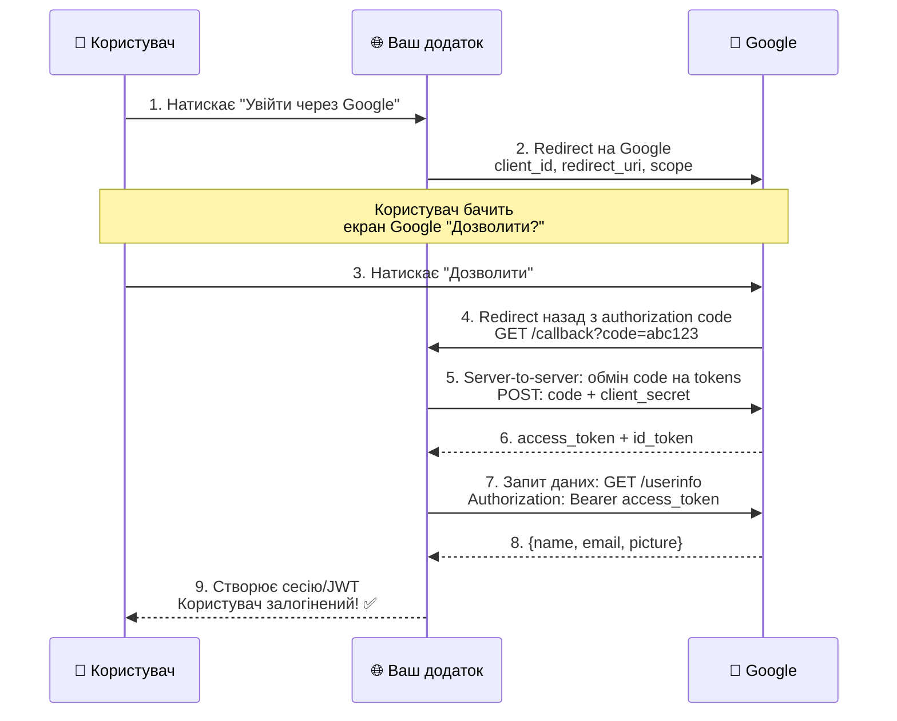

# OAuth 2.0 та зовнішні провайдери

::note
Кнопка **«Увійти через Google»** — це не магія. Це чітко визначений протокол **OAuth 2.0**, який ASP.NET Core підтримує «з коробки». У цій статті ми розберемо, що відбувається під капотом, і підключимо Google та GitHub як зовнішні провайдери аутентифікації.

::

---

## 1. Навіщо зовнішні провайдери?

::card-group

::card{title="Для користувачів" icon="i-lucide-user-check"}
Не потрібно запам'ятовувати ще один пароль. Один клік — і вони в системі. Конверсія реєстрації зростає на 20-40%.

::

::card{title="Для розробників" icon="i-lucide-shield"}
Не потрібно зберігати паролі! Google/GitHub відповідають за безпеку облікових записів, 2FA, захист від brute-force.

::

::card{title="Для бізнесу" icon="i-lucide-trending-up"}
Менше покинутих форм реєстрації, достовірні email-адреси (підтверджені Google), менше витрат на підтримку «забув пароль».

::

::

---

## 2. OAuth 2.0 — як це працює?

### Ключові поняття

| Термін                   | Хто це                      | Аналогія                |
| :----------------------- | :-------------------------- | :---------------------- |
| **Resource Owner**       | Користувач (Іван)           | Господар квартири       |
| **Client**               | Ваш додаток (MyApi)         | Друг, який просить ключ |
| **Authorization Server** | Google/GitHub               | Консьєрж будинку        |
| **Resource Server**      | Google API (profile, email) | Квартира з даними       |

### Authorization Code Flow

Це **найбезпечніший** flow для серверних додатків. Ось повна послідовність:

::mermaid



::

::steps

### Користувач натискає «Увійти через Google»

Ваш додаток перенаправляє браузер на Google з параметрами:

```
https://accounts.google.com/o/oauth2/v2/auth?
  client_id=YOUR_CLIENT_ID
  &redirect_uri=https://yourapp.com/signin-google
  &response_type=code
  &scope=openid email profile
```

### Google показує екран дозволу

Користувач бачить: «Додаток MyApi хоче отримати доступ до вашого email та профілю. Дозволити?»

### Після дозволу — redirect назад

Google перенаправляє браузер на ваш `redirect_uri` з **authorization code**:

```
https://yourapp.com/signin-google?code=4/0AXxyz...
```

### Ваш сервер обмінює code на токени

Це **серверний** запит (невидимий для користувача). `client_secret` ніколи не потрапляє в браузер:

```
POST https://oauth2.googleapis.com/token
  code=4/0AXxyz...
  &client_id=YOUR_CLIENT_ID
  &client_secret=YOUR_SECRET
  &redirect_uri=https://yourapp.com/signin-google
  &grant_type=authorization_code
```

### Google повертає access_token

З цим токеном ви можете запитати дані користувача (email, ім'я, аватар).

::

### OAuth 2.0 vs OpenID Connect

|                 | OAuth 2.0                                           | OpenID Connect (OIDC)                   |
| :-------------- | :-------------------------------------------------- | :-------------------------------------- |
| **Мета**        | **Авторизація** — дозвіл на дії                     | **Аутентифікація** — хто користувач     |
| **Що повертає** | `access_token` (доступ до ресурсів)                 | `id_token` (інформація про користувача) |
| **Юзкейс**      | «Дозволити MyApi читати ваші файли на Google Drive» | «Увійти через Google»                   |

**OpenID Connect = OAuth 2.0 + Identity Layer.** Коли ми кажемо «Увійти через Google» — ми використовуємо **OIDC**, який побудований поверх OAuth 2.0.

---

## 3. Підключення Google Auth

### Крок 1: Створення OAuth Client у Google

::steps

### Перейдіть до Google Cloud Console

Відкрийте [console.cloud.google.com](https://console.cloud.google.com/) → APIs & Services → Credentials

### Створіть OAuth 2.0 Client ID

- Type: **Web application**
- Authorized redirect URI: `https://localhost:5001/signin-google`

### Збережіть Client ID та Client Secret

Ці дані потрібні для налаштування в ASP.NET Core.

::

### Крок 2: Налаштування в ASP.NET Core

```bash
# Зберігаємо секрети безпечно
dotnet user-secrets set "Google:ClientId" "YOUR_CLIENT_ID"
dotnet user-secrets set "Google:ClientSecret" "YOUR_SECRET"
```

```csharp [Program.cs — Google Auth]
var builder = WebApplication.CreateBuilder(args);

builder.Services.AddDbContext<AppDbContext>(opt =>
    opt.UseSqlite("Data Source=app.db"));

builder.Services
    .AddAuthentication(options =>
    {
        options.DefaultScheme = "Cookies";
        options.DefaultChallengeScheme = "Google";
    })
    .AddCookie("Cookies")
    .AddGoogle("Google", options =>
    {
        options.ClientId = builder.Configuration[
            "Google:ClientId"]!;
        options.ClientSecret = builder.Configuration[
            "Google:ClientSecret"]!;

        // Додаткові scopes (за замовчуванням:
        // openid, profile, email)
        options.Scope.Add("email");
        options.Scope.Add("profile");

        // Mapping claims
        options.ClaimActions.MapJsonKey(
            "picture", "picture");
    });

builder.Services.AddAuthorization();
```

### Крок 3: Ендпоінти

```csharp [Auth ендпоінти для OAuth]
// Ініціювати логін через Google
app.MapGet("/auth/google-login", () =>
    Results.Challenge(
        new AuthenticationProperties
        {
            RedirectUri = "/auth/google-callback"
        },
        ["Google"]))
    .AllowAnonymous();

// Callback — після Google redirect
app.MapGet("/auth/google-callback",
    async (HttpContext ctx) =>
{
    // Claims від Google вже заповнені
    // через Cookie middleware
    var user = ctx.User;

    var email = user.FindFirst(
        ClaimTypes.Email)?.Value;
    var name = user.FindFirst(
        ClaimTypes.Name)?.Value;
    var picture = user.FindFirst("picture")?.Value;
    var googleId = user.FindFirst(
        ClaimTypes.NameIdentifier)?.Value;

    return Results.Ok(new
    {
        message = "Logged in via Google!",
        email,
        name,
        picture,
        googleId
    });
}).RequireAuthorization();
```

---

## 4. Підключення GitHub Auth

### Створення OAuth App у GitHub

::steps

### Перейдіть до GitHub Settings

Settings → Developer settings → OAuth Apps → New OAuth App

### Заповніть форму

- **Application name:** MyApi
- **Homepage URL:** `https://localhost:5001`
- **Authorization callback URL:** `https://localhost:5001/signin-github`

### Збережіть Client ID та Secret

```bash
dotnet user-secrets set "GitHub:ClientId" "YOUR_CLIENT_ID"
dotnet user-secrets set "GitHub:ClientSecret" "YOUR_SECRET"
```

::

### Налаштування в коді

```bash
dotnet add package AspNet.Security.OAuth.GitHub
```

```csharp [Додаємо GitHub поряд з Google]
builder.Services
    .AddAuthentication(options =>
    {
        options.DefaultScheme = "Cookies";
    })
    .AddCookie("Cookies")
    .AddGoogle("Google", options =>
    {
        // ... конфігурація Google
    })
    .AddGitHub("GitHub", options =>
    {
        options.ClientId = builder.Configuration[
            "GitHub:ClientId"]!;
        options.ClientSecret = builder.Configuration[
            "GitHub:ClientSecret"]!;
        options.Scope.Add("user:email");
    });
```

```csharp [Login через GitHub]
app.MapGet("/auth/github-login", () =>
    Results.Challenge(
        new AuthenticationProperties
        {
            RedirectUri = "/auth/callback"
        },
        ["GitHub"]))
    .AllowAnonymous();
```

---

## 5. Зв'язка з локальною БД

### Проблема

Google/GitHub повертають email та ім'я, але ваш додаток має **власну** базу користувачів з ролями, підписками, налаштуваннями. Потрібно **зв'язати** зовнішній акаунт з локальним.

### Стратегія: Find or Create

```csharp [Зв'язка зовнішнього акаунту з локальним]
app.MapGet("/auth/callback",
    async (HttpContext ctx,
           UserManager<AppUser> userManager,
           SignInManager<AppUser> signInManager) =>
{
    // 1. Отримуємо дані від зовнішнього провайдера
    var info = await signInManager
        .GetExternalLoginInfoAsync();

    if (info is null)
        return Results.Json(
            new { error = "External login failed" },
            statusCode: 401);

    var email = info.Principal.FindFirst(
        ClaimTypes.Email)?.Value;
    var name = info.Principal.FindFirst(
        ClaimTypes.Name)?.Value;

    // 2. Шукаємо існуючого користувача
    var user = await userManager
        .FindByEmailAsync(email!);

    if (user is null)
    {
        // 3a. Створюємо нового користувача
        user = new AppUser
        {
            UserName = email,
            Email = email,
            FullName = name ?? "Unknown",
            EmailConfirmed = true // Google вже підтвердив
        };

        var createResult = await userManager
            .CreateAsync(user);

        if (!createResult.Succeeded)
            return Results.Json(
                new { error = "User creation failed" },
                statusCode: 500);

        await userManager
            .AddToRoleAsync(user, "User");
    }

    // 4. Зв'язуємо зовнішній логін з користувачем
    //    (якщо ще не зв'язаний)
    var logins = await userManager
        .GetLoginsAsync(user);

    if (!logins.Any(l =>
            l.LoginProvider == info.LoginProvider))
    {
        await userManager
            .AddLoginAsync(user, info);
    }

    // 5. Генеруємо JWT (або cookie)
    var roles = await userManager
        .GetRolesAsync(user);

    var token = tokenService.GenerateAccessToken(
        user.Id, user.FullName,
        user.Email!, roles);

    return Results.Ok(new
    {
        access_token = token,
        is_new_user = logins.Count == 0
    });
}).AllowAnonymous();
```

Ця стратегія:

- Якщо email **існує** → логінить існуючого користувача
- Якщо email **новий** → створює нового користувача
- Зберігає зв'язок у таблиці `AspNetUserLogins` (LoginProvider + ProviderKey)

---

## 6. Claims Transformation

Іноді claims від зовнішнього провайдера не відповідають вашим потребам. Можна їх трансформувати:

```csharp [Claims Transformation]
builder.Services
    .AddTransient<IClaimsTransformation,
        AppClaimsTransformation>();

public class AppClaimsTransformation
    : IClaimsTransformation
{
    private readonly UserManager<AppUser> _userManager;

    public AppClaimsTransformation(
        UserManager<AppUser> userManager)
    {
        _userManager = userManager;
    }

    public async Task<ClaimsPrincipal> TransformAsync(
        ClaimsPrincipal principal)
    {
        var email = principal.FindFirst(
            ClaimTypes.Email)?.Value;

        if (email is null)
            return principal;

        var user = await _userManager
            .FindByEmailAsync(email);

        if (user is null)
            return principal;

        // Додаємо кастомні claims з нашої БД
        var identity = principal.Identity
            as ClaimsIdentity;

        var roles = await _userManager
            .GetRolesAsync(user);

        foreach (var role in roles)
        {
            identity?.AddClaim(
                new Claim(ClaimTypes.Role, role));
        }

        identity?.AddClaim(
            new Claim("user_id", user.Id));
        identity?.AddClaim(
            new Claim("full_name", user.FullName));

        return principal;
    }
}
```

Тепер Claims від Google/GitHub автоматично доповнюються ролями та іншими даними з вашої БД.

---

## 7. Практичні завдання

### Рівень 1: Базовий

::accordion

::accordion-item{label="Завдання 5.1: Google Auth" icon="i-lucide-circle-help"}
Підключіть Google Authentication:

1. Створіть OAuth Client у Google Cloud Console
2. Збережіть Client ID та Secret через `dotnet user-secrets`
3. Налаштуйте `AddGoogle()`
4. Створіть ендпоінт `/auth/google-login` з `Results.Challenge()`
5. Протестуйте: перейдіть у браузері → побачте екран Google → після дозволу повернеться з claims
6. Виведіть: email, name, picture, Google ID

::

::

### Рівень 2: Проєктування

::accordion

::accordion-item{label="Завдання 5.2: Find or Create" icon="i-lucide-circle-help"}
Реалізуйте зв'язку зовнішнього провайдера з локальною БД:

1. При першому вході через Google — створити `AppUser` в БД
2. При повторному вході — знайти існуючого
3. Зберегти зв'язок у `AspNetUserLogins`
4. Повернути JWT з ролями з локальної БД
5. Перевірте: вхід через Google → `is_new_user: true`. Повторний вхід → `is_new_user: false`

::

::accordion-item{label="Завдання 5.3: Два провайдери" icon="i-lucide-circle-help"}
Підключіть Google та GitHub одночасно:

1. `/auth/google-login` — вхід через Google
2. `/auth/github-login` — вхід через GitHub
3. Якщо email збігається — зв'язати з тим самим LocalUser
4. Один користувач може мати 2 зовнішні логіни
5. `GET /me` — показати, через які провайдери підключено

::

::

### Рівень 3: Архітектура

::accordion

::accordion-item{label="Завдання 5.4: Claims Transformation" icon="i-lucide-circle-help"}
Створіть повну систему з трансформацією claims:

1. `IClaimsTransformation` — додає ролі та кастомні claims з БД
2. При першому вході — створює користувача з `Role = "User"`
3. Admin може підвищити роль через `POST /admin/users/{id}/promote`
4. Після підвищення — наступний логін через Google автоматично додає `Role = "Admin"` через Claims Transformation
5. Перевірте: промотований користувач отримує доступ до `/admin` без зміни свого Google акаунту

::

::

---

## 8. Резюме

::card-group

::card{title="OAuth 2.0 = Authorization Code Flow" icon="i-lucide-key-round"}
Redirect → Google → Code → Exchange for Token → Userinfo. Client Secret ніколи не потрапляє в браузер.

::

::card{title="OpenID Connect = Auth + Identity" icon="i-lucide-id-card"}
OAuth 2.0 дає access_token (для ресурсів). OIDC додає id_token (хто користувач). ASP.NET Core використовує OIDC.

::

::card{title="Find or Create" icon="i-lucide-user-plus"}
Зв'язуйте зовнішній акаунт з локальним через email. Нові — створюйте, існуючі — логіньте. AspNetUserLogins зберігає зв'язок.

::

::card{title="Claims Transformation" icon="i-lucide-refresh-cw"}
IClaimsTransformation додає ролі та кастомні Claims з вашої БД до Claims від зовнішнього провайдера.

::

::

**Далі:** у фінальній статті модуля ми зібрімо все разом і розглянемо **безпеку на практиці** — CORS, HTTPS, CSRF, brute-force захист, заголовки безпеки та production чеклист.
