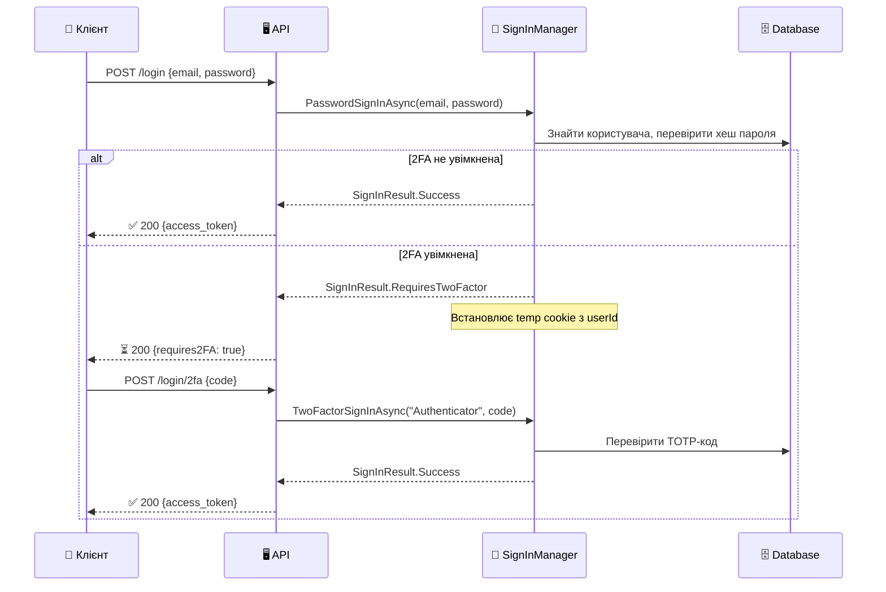
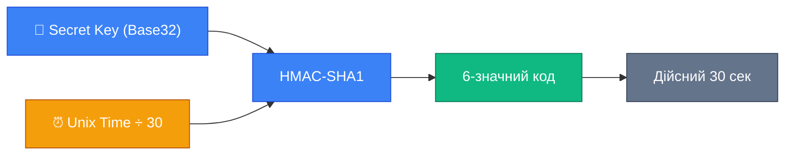

# Identity: Двофакторна Аутентифікація

::note
За даними дослідження Microsoft, **99,9% зламаних акаунтів не мали увімкненої двофакторної аутентифікації**. Один лише пароль — це єдина лінія оборони. 2FA додає другий фактор: навіть якщо пароль скомпрометовано, злочинець все одно не зможе увійти без доступу до телефону, email або резервних кодів.

::

---

## 1. Навіщо 2FA і що це таке?

### Фактори аутентифікації

Теорія безпеки визначає три категорії факторів:

::card-group

::card{title="🧠 Щось, що ви знаєте" icon="i-lucide-brain"}
**Пароль, PIN, секретне питання.** Може бути вкрадений: фішинг, витік БД, брутфорс, підглядання через плече.

::

::card{title="📱 Щось, що ви маєте" icon="i-lucide-smartphone"}
**Телефон (TOTP-додаток), фізичний ключ (YubiKey), SMS.** Складніше вкрасти — зловмисник має фізично отримати пристрій або перехопити SMS.

::

::card{title="👁️ Щось, що ви є" icon="i-lucide-fingerprint"}
**Відбиток пальця, Face ID, сітківка ока.** Найнадійніше, але потребує спеціального обладнання.

::

::

**2FA (Two-Factor Authentication)** означає вимогу двох факторів із різних категорій. Комбінація «пароль + TOTP-код» — це перша і третя категорія разом. Навіть якщо пароль вкрадено — без доступу до телефону зловмисник зупинений.

### NIST рекомендації (SP 800-63B)

Американський Національний інститут стандартів і технологій має чіткі рекомендації:

| Метод 2FA | Рівень надійності | NIST статус |
|:---|:---|:---|
| TOTP (Authenticator) | Високий | ✅ Рекомендовано |
| Hardware Key (FIDO2) | Найвищий | ✅ Рекомендовано |
| Email OTP | Середній | ⚠️ Допустимо |
| SMS OTP | Середній | ⚠️ Обмежено (SIM-swap ризик) |
| Секретні питання | Низький | ❌ НЕ рекомендовано |

---

## 2. Архітектура 2FA в ASP.NET Core Identity

### Як Identity реалізує 2FA?

2FA в Identity — це, по суті, **дворівневий логін**:

1. Перший рівень: перевірка пароля → якщо 2FA увімкнена, не повертаємо успіх, а встановлюємо тимчасовий cookie.
2. Другий рівень: перевірка другого фактора → тепер повертаємо повноцінний аутентифікований стан.

::mermaid



::

### Ключові методи

::field-group

::field{name="CheckPasswordSignInAsync" type="Task<SignInResult>"}
Перевіряє пароль **без** встановлення cookie. Повертає `SignInResult`, де `RequiresTwoFactor == true` якщо потрібен другий фактор.

::

::field{name="PasswordSignInAsync" type="Task<SignInResult>"}
Перевіряє пароль і при успіху встановлює cookie (для Cookie Auth). При 2FA — встановлює тимчасовий `TwoFactorUserId` cookie.

::

::field{name="TwoFactorSignInAsync" type="Task<SignInResult>"}
Перевіряє код другого фактора за допомогою вказаного провайдера. Після успіху — встановлює повноцінний auth cookie.

::

::field{name="TwoFactorAuthenticatorSignInAsync" type="Task<SignInResult>"}
Спеціалізований метод для TOTP. Аналог `TwoFactorSignInAsync("Authenticator", ...)`.

::

::field{name="TwoFactorRecoveryCodeSignInAsync" type="Task<SignInResult>"}
Перевіряє резервний код (одноразовий).

::

::

---

## 3. TOTP: Часові одноразові паролі

### Що таке TOTP?

**TOTP (Time-based One-Time Password)** — стандарт RFC 6238, який генерує 6-значний код на основі двох елементів:

1. **Секретний ключ** — унікальна рядок (Base32), що зберігається у додатку аутентифікатора.
2. **Поточний час** — округлений до 30-секундного інтервалу.

```
TOTP = HOTP(secret, floor(unixTime / 30))
     = HMAC-SHA1(secret, counter)[-6:]
```

Код дійсний **30 секунд**. Identity за замовчуванням допускає похибку в ±1 інтервал (до 90 секунд), щоб врахувати розсинхронізацію годинників.

::mermaid



::

Ключове: **сервер і додаток аутентифікатора незалежно** обчислюють один і той самий код. Жодних даних між ними не передається в момент входу — лише при початковому налаштуванні (QR-код).

### Flow налаштування TOTP

::steps

### Крок 1: Завантаження сторінки налаштування 2FA

Перший запит отримує або генерує ключ аутентифікатора:

```csharp [GET /account/2fa/setup]
app.MapGet("/account/2fa/setup",
    async (HttpContext ctx,
           UserManager<AppUser> userManager) =>
{
    var user = await userManager.GetUserAsync(ctx.User);
    if (user is null) return Results.Unauthorized();

    // Отримуємо (або генеруємо) секретний ключ
    // Якщо ключ вже є в AspNetUserTokens — повертає існуючий
    // Якщо немає — генерує новий і зберігає у tokens
    var unformattedKey = await userManager
        .GetAuthenticatorKeyAsync(user);

    if (string.IsNullOrEmpty(unformattedKey))
    {
        // Явна генерація нового ключа
        await userManager.ResetAuthenticatorKeyAsync(user);
        unformattedKey = await userManager
            .GetAuthenticatorKeyAsync(user);
    }

    // Форматуємо ключ для зручності введення вручну: XXXX XXXX XXXX
    var formattedKey = FormatKey(unformattedKey!);

    // Будуємо URI для QR-коду (стандарт otpauth://)
    var email = await userManager.GetEmailAsync(user);
    var authenticatorUri = GenerateQrCodeUri(
        email!, unformattedKey!);

    return Results.Ok(new
    {
        sharedKey       = formattedKey,
        authenticatorUri,              // Передати на фронт для генерації QR
        qrCodeImageUrl  = $"/account/2fa/qr?uri={Uri.EscapeDataString(authenticatorUri)}"
    });
}).RequireAuthorization();

// Форматування ключа: "abcdefghijklmnop" → "ABCD EFGH IJKL MNOP"
static string FormatKey(string unformattedKey)
{
    var result = new StringBuilder();
    int currentPosition = 0;

    while (currentPosition + 4 < unformattedKey.Length)
    {
        result.Append(
            unformattedKey.AsSpan(currentPosition, 4));
        result.Append(' ');
        currentPosition += 4;
    }

    if (currentPosition < unformattedKey.Length)
        result.Append(unformattedKey.AsSpan(currentPosition));

    return result.ToString().ToUpperInvariant();
}

// URI для QR-коду у форматі otpauth://
static string GenerateQrCodeUri(string email, string unformattedKey)
{
    const string AuthenticatorUriFormat =
        "otpauth://totp/{0}:{1}?secret={2}&issuer={0}&digits=6";

    return string.Format(
        AuthenticatorUriFormat,
        Uri.EscapeDataString("MyApp"),        // Назва додатку
        Uri.EscapeDataString(email),           // Email уkористувача
        unformattedKey);                       // Secret key (Base32)
}
```

### Крок 2: Відображення QR-коду

Фронтенд отримує `authenticatorUri` і генерує QR-код. На сторінці також показується `sharedKey` для ручного введення (якщо QR не сканується).

Для генерації QR-коду на сервері можна використати пакет `QRCoder`:

```csharp [GET /account/2fa/qr — генерація QR-зображення]
app.MapGet("/account/2fa/qr",
    (string uri) =>
{
    // QRCoder генерує PNG зображення QR-коду
    using var qrGenerator = new QRCodeGenerator();
    using var qrCodeData  = qrGenerator.CreateQrCode(
        uri, QRCodeGenerator.ECCLevel.Q);
    using var qrCode      = new PngByteQRCode(qrCodeData);

    var qrCodeBytes = qrCode.GetGraphic(10);

    return Results.File(qrCodeBytes, "image/png");
}).RequireAuthorization();
```

### Крок 3: Верифікація та увімкнення 2FA

Користувач сканував QR-код та ввів перший код — перевіряємо:

```csharp [POST /account/2fa/enable]
app.MapPost("/account/2fa/enable",
    async (Enable2FaRequest req,
           HttpContext ctx,
           UserManager<AppUser> userManager) =>
{
    var user = await userManager.GetUserAsync(ctx.User);
    if (user is null) return Results.Unauthorized();

    // Нормалізуємо код: прибираємо пробіли та дефіси
    var verificationCode = req.Code
        .Replace(" ", "")
        .Replace("-", "");

    // Перевіряємо TOTP-код за допомогою поточного secret
    // Це НЕ вмикає 2FA — лише перевіряє, що код правильний
    var is2FaTokenValid = await userManager
        .VerifyTwoFactorTokenAsync(
            user,
            userManager.Options.Tokens.AuthenticatorTokenProvider,
            verificationCode);

    if (!is2FaTokenValid)
        return Results.BadRequest(new
        {
            error = "Invalid verification code. " +
                    "Please check your authenticator app."
        });

    // Вмикаємо 2FA для акаунту
    await userManager.SetTwoFactorEnabledAsync(user, true);

    // Генеруємо резервні коди (обов'язково показати користувачу!)
    var recoveryCodes = await userManager
        .GenerateNewTwoFactorRecoveryCodesAsync(user, 10);

    return Results.Ok(new
    {
        message      = "Two-factor authentication has been enabled.",
        recoveryCodes = recoveryCodes,  // ⚠️ Показати ОДИН РАЗ!
        message2     = "Save these recovery codes in a safe place. " +
                       "You won't be able to see them again."
    });
}).RequireAuthorization();

record Enable2FaRequest(string Code);
```

::

### Login з TOTP

Після того як 2FA налаштовано, логін потребує двох кроків:

```csharp [POST /auth/login — перший крок із 2FA]
app.MapPost("/auth/login",
    async (LoginRequest req,
           SignInManager<AppUser> signInManager,
           UserManager<AppUser> userManager,
           TokenService tokenService) =>
{
    var user = await userManager.FindByEmailAsync(req.Email);
    if (user is null)
        return Results.Json(
            new { error = "Invalid credentials" }, statusCode: 401);

    // CheckPasswordSignInAsync — перевіряє пароль БЕЗ встановлення cookie
    // lockoutOnFailure: true — рахує невдалі спроби
    var result = await signInManager.CheckPasswordSignInAsync(
        user, req.Password, lockoutOnFailure: true);

    if (result.IsLockedOut)
        return Results.Json(
            new { error = "Account locked." }, statusCode: 423);

    if (!result.Succeeded)
        return Results.Json(
            new { error = "Invalid credentials" }, statusCode: 401);

    // 2FA потрібна — повертаємо спеціальний статус
    if (result.RequiresTwoFactor)
    {
        // Зберігаємо userId у тимчасовому коді (або можемо повернути userId)
        return Results.Ok(new
        {
            requiresTwoFactor = true,
            // Безпечно повертати userId — для 2FA ще потрібен другий фактор
            userId = user.Id
        });
    }

    // 2FA не потрібна — видаємо токен
    var roles  = await userManager.GetRolesAsync(user);
    var token  = tokenService.GenerateToken(user, roles);
    return Results.Ok(new { access_token = token });
});
```

```csharp [POST /auth/login/2fa — другий крок]
app.MapPost("/auth/login/2fa",
    async (TwoFaLoginRequest req,
           UserManager<AppUser> userManager,
           SignInManager<AppUser> signInManager,
           TokenService tokenService) =>
{
    var user = await userManager.FindByIdAsync(req.UserId);
    if (user is null)
        return Results.Json(
            new { error = "Invalid session" }, statusCode: 401);

    var code = req.Code.Replace(" ", "").Replace("-", "");

    // Перевіряємо TOTP-код
    var isValid = await userManager.VerifyTwoFactorTokenAsync(
        user,
        userManager.Options.Tokens.AuthenticatorTokenProvider,
        code);

    if (!isValid)
    {
        // Рахуємо невдалі спроби (захист від брутфорсу 2FA)
        await userManager.AccessFailedAsync(user);
        return Results.Json(
            new { error = "Invalid 2FA code" }, statusCode: 401);
    }

    // Скидаємо лічильник невдалих спроб
    await userManager.ResetAccessFailedCountAsync(user);

    // Видаємо токен доступу
    var roles = await userManager.GetRolesAsync(user);
    var token = tokenService.GenerateToken(user, roles);

    return Results.Ok(new
    {
        access_token = token,
        expires_in   = 900
    });
});

record TwoFaLoginRequest(string UserId, string Code);
```

### Вимикання TOTP

```csharp [POST /account/2fa/disable]
app.MapPost("/account/2fa/disable",
    async (Disable2FaRequest req,
           HttpContext ctx,
           UserManager<AppUser> userManager) =>
{
    var user = await userManager.GetUserAsync(ctx.User);
    if (user is null) return Results.Unauthorized();

    // Перевіряємо пароль перед вимиканням 2FA (додатковий захист)
    var passwordValid = await userManager.CheckPasswordAsync(
        user, req.Password);

    if (!passwordValid)
        return Results.BadRequest(new { error = "Invalid password." });

    await userManager.SetTwoFactorEnabledAsync(user, false);

    // Скидаємо ключ аутентифікатора — при повторному увімкненні
    // буде згенеровано новий QR-код
    await userManager.ResetAuthenticatorKeyAsync(user);

    return Results.Ok(new
    {
        message = "Two-factor authentication has been disabled."
    });
}).RequireAuthorization();

record Disable2FaRequest(string Password);
```

---

## 4. Email 2FA

Email 2FA — простіший у налаштуванні за TOTP, але менш безпечний (злам email-акаунту руйнує захист). Проте це значне покращення порівняно з відсутністю 2FA.

### Як Email 2FA відрізняється від Email Confirmation?

Важливо не плутати:

| | Email Confirmation | Email 2FA |
|:---|:---|:---|
| **Мета** | Підтвердити адресу при реєстрації | Другий фактор при кожному вході |
| **Провайдер** | `DataProtectionTokenProvider` | `EmailTokenProvider` |
| **TTL токена** | 1-3 дні | 10-15 хвилин |
| **Формат коду** | Довгий зашифрований рядок | Короткий числовий код (6 цифр) |
| **Частота** | Один раз | При кожному Auth |

### Налаштування Email Token Provider

```csharp [Program.cs — Email 2FA provider]
builder.Services
    .AddIdentity<AppUser, IdentityRole>(options =>
    {
        // Вказуємо Email як провайдер 2FA
        options.Tokens.EmailConfirmationTokenProvider =
            TokenOptions.DefaultEmailProvider;
    })
    .AddEntityFrameworkStores<AppDbContext>()
    .AddDefaultTokenProviders(); // Реєструє EmailTokenProvider
```

`AddDefaultTokenProviders()` реєструє чотири провайдери:
- `DataProtectorTokenProvider` — для підтвердження email, скидання пароля
- `PhoneNumberTokenProvider` — для SMS-кодів
- `AuthenticatorTokenProvider` — для TOTP
- `EmailTokenProvider` — для Email OTP коду

### Реалізація Email 2FA

```csharp [POST /account/2fa/email/enable — увімкнення]
app.MapPost("/account/2fa/email/enable",
    async (HttpContext ctx,
           UserManager<AppUser> userManager,
           IEmailSender emailSender) =>
{
    var user = await userManager.GetUserAsync(ctx.User);
    if (user is null) return Results.Unauthorized();

    if (!user.EmailConfirmed)
        return Results.BadRequest(new
        {
            error = "Please confirm your email before enabling Email 2FA."
        });

    // Генеруємо код підтвердження (числовий, 6 символів)
    // Провайдер "Email" — це EmailTokenProvider
    var code = await userManager.GenerateTwoFactorTokenAsync(
        user, "Email");

    await emailSender.SendEmailAsync(
        user.Email!,
        "Enable Two-Factor Authentication",
        $"Your verification code: <strong>{code}</strong>. " +
        $"Expires in 10 minutes.");

    return Results.Ok(new
    {
        message = "Verification code sent to your email."
    });
}).RequireAuthorization();

// Оновлення TTL для Email токенів
builder.Services
    .Configure<EmailTokenProviderOptions>(options =>
    {
        options.TokenLifespan = TimeSpan.FromMinutes(10);
    });
```

```csharp [POST /auth/login/2fa/email — вхід з Email кодом]
app.MapPost("/auth/login/2fa/email",
    async (EmailTwoFaRequest req,
           UserManager<AppUser> userManager,
           TokenService tokenService) =>
{
    var user = await userManager.FindByIdAsync(req.UserId);
    if (user is null)
        return Results.Json(
            new { error = "Invalid session" }, statusCode: 401);

    // Перевіряємо код через EmailTokenProvider
    var isValid = await userManager.VerifyTwoFactorTokenAsync(
        user,
        TokenOptions.DefaultEmailProvider,
        req.Code);

    if (!isValid)
        return Results.Json(
            new { error = "Invalid or expired code." },
            statusCode: 401);

    var roles = await userManager.GetRolesAsync(user);
    var token = tokenService.GenerateToken(user, roles);

    return Results.Ok(new { access_token = token });
});

record EmailTwoFaRequest(string UserId, string Code);
```

---

## 5. SMS 2FA (Twilio)

SMS — найпопулярніший вид 2FA для масових споживчих продуктів через простоту для кінцевого користувача. Але він має відому вразливість: **SIM-swapping** — атака, де зловмисник переконує оператора перенести номер телефону на свою SIM-карту.

::warning
NIST (SP 800-63B) **обмежив** рекомендацію SMS OTP через ризики SIM-swap та SS7 вразливості. Для чутливих систем обирайте TOTP або апаратні ключі. Але для більшості споживчих застосунків SMS значно краще, ніж відсутність 2FA.

::

### ISmsSender — інтерфейс

```csharp [Interfaces/ISmsSender.cs]
public interface ISmsSender
{
    Task SendSmsAsync(string number, string message);
}
```

### Реалізація з Twilio

```csharp [Services/TwilioSmsSender.cs]
using Twilio;
using Twilio.Rest.Api.V2010.Account;
using Twilio.Types;

public class TwilioSmsSender : ISmsSender
{
    private readonly IConfiguration _config;
    private readonly ILogger<TwilioSmsSender> _logger;

    public TwilioSmsSender(
        IConfiguration config,
        ILogger<TwilioSmsSender> logger)
    {
        _config = config;
        _logger = logger;

        // Ініціалізуємо Twilio клієнт
        TwilioClient.Init(
            _config["Twilio:AccountSid"],
            _config["Twilio:AuthToken"]);
    }

    public async Task SendSmsAsync(string number, string message)
    {
        try
        {
            var msg = await MessageResource.CreateAsync(
                body: message,
                from: new PhoneNumber(_config["Twilio:From"]),
                to:   new PhoneNumber(number));

            _logger.LogInformation(
                "SMS sent. SID: {Sid}", msg.Sid);
        }
        catch (Exception ex)
        {
            _logger.LogError(ex,
                "Failed to send SMS to {Number}", number);
            throw;
        }
    }
}
```

```json [appsettings.json]
{
  "Twilio": {
    "AccountSid": "ACxxxxxxxxxxxxxxxxxxxxxxxxxxxxxxxxxxxxx",
    "AuthToken": "your_auth_token",
    "From": "+15551234567"
  }
}
```

### Верифікація телефону перед увімкненням SMS 2FA

Перед тим як увімкнути SMS 2FA, потрібно переконатися, що номер телефону підтверджений:

```csharp [POST /account/2fa/sms/setup — відправка коду верифікації]
app.MapPost("/account/2fa/sms/setup",
    async (SmsTwoFaSetupRequest req,
           HttpContext ctx,
           UserManager<AppUser> userManager,
           ISmsSender smsSender) =>
{
    var user = await userManager.GetUserAsync(ctx.User);
    if (user is null) return Results.Unauthorized();

    // Генеруємо код для верифікації номера
    // ChangePhoneNumberTokenProvider — окремий провайдер
    var token = await userManager
        .GenerateChangePhoneNumberTokenAsync(user, req.PhoneNumber);

    await smsSender.SendSmsAsync(
        req.PhoneNumber,
        $"Your MyApp verification code: {token}");

    return Results.Ok(new
    {
        message = $"Verification code sent to {req.PhoneNumber}."
    });
}).RequireAuthorization();

record SmsTwoFaSetupRequest(string PhoneNumber);
```

```csharp [POST /account/2fa/sms/enable — підтвердження та увімкнення]
app.MapPost("/account/2fa/sms/enable",
    async (SmsTwoFaEnableRequest req,
           HttpContext ctx,
           UserManager<AppUser> userManager) =>
{
    var user = await userManager.GetUserAsync(ctx.User);
    if (user is null) return Results.Unauthorized();

    // Підтверджуємо номер та встановлюємо як верифікований
    var result = await userManager.ChangePhoneNumberAsync(
        user, req.PhoneNumber, req.Code);

    if (!result.Succeeded)
        return Results.BadRequest(new
        {
            errors = result.Errors.Select(e => e.Description)
        });

    // Встановлюємо провайдер 2FA на Phone
    await userManager.SetTwoFactorEnabledAsync(user, true);

    // Генеруємо резервні коди
    var recoveryCodes = await userManager
        .GenerateNewTwoFactorRecoveryCodesAsync(user, 10);

    return Results.Ok(new
    {
        message       = "SMS two-factor authentication enabled.",
        recoveryCodes = recoveryCodes  // ⚠️ Показати один раз!
    });
}).RequireAuthorization();

record SmsTwoFaEnableRequest(string PhoneNumber, string Code);
```

```csharp [POST /auth/login/2fa/sms — вхід з SMS-кодом]
app.MapPost("/auth/login/2fa/sms",
    async (SmsTwoFaLoginRequest req,
           UserManager<AppUser> userManager,
           ISmsSender smsSender,
           TokenService tokenService) =>
{
    var user = await userManager.FindByIdAsync(req.UserId);
    if (user is null)
        return Results.Json(
            new { error = "Invalid session" }, statusCode: 401);

    // Спочатку генеруємо і надсилаємо SMS
    // (якщо це перший запит до 2FA SMS ендпоінту)
    if (req.SendCode == true)
    {
        var code = await userManager.GenerateTwoFactorTokenAsync(
            user, TokenOptions.DefaultPhoneProvider);

        await smsSender.SendSmsAsync(user.PhoneNumber!, code);

        return Results.Ok(new
        {
            message = $"Code sent to {user.PhoneNumber!.Substring(0, 4)}***"
        });
    }

    // Перевіряємо введений код
    var isValid = await userManager.VerifyTwoFactorTokenAsync(
        user, TokenOptions.DefaultPhoneProvider, req.Code!);

    if (!isValid)
        return Results.Json(
            new { error = "Invalid or expired code." }, statusCode: 401);

    var roles = await userManager.GetRolesAsync(user);
    var token = tokenService.GenerateToken(user, roles);

    return Results.Ok(new { access_token = token });
});

record SmsTwoFaLoginRequest(
    string UserId, string? Code, bool? SendCode);
```

---

## 6. Recovery Codes: резервні коди

### Навіщо резервні коди?

Уявіть: ви увімкнули TOTP 2FA. Через рік ваш телефон зламався — і разом із ним ваш додаток аутентифікатора. Без резервних кодів ви **назавжди** втратили доступ до свого акаунту. Резервні коди — це страхова сітка від втрати другого фактора.

Типова схема: 10 одноразових кодів вигляду `XXXX-XXXXXXXX`. Кожен код — окрема рядок у базі даних, яка видаляється після використання.

### Як зберігаються Recovery Codes?

Identity зберігає резервні коди у таблиці `AspNetUserTokens`, але **не у відкритому вигляді** — лише їх хеші. Це важливо: навіть якщо база даних буде скомпрометована, зловмисник не зможе використати вкрадені хеші для входу.

```
LoginProvider: "[AspNetUserStore]"
Name:          "RecoveryCodes"
Value:         "hash1;hash2;hash3;..." (хеші через крапку з комою)
```

### Генерація та відображення

```csharp [POST /account/2fa/recovery-codes/generate]
app.MapPost("/account/2fa/recovery-codes/generate",
    async (HttpContext ctx,
           UserManager<AppUser> userManager) =>
{
    var user = await userManager.GetUserAsync(ctx.User);
    if (user is null) return Results.Unauthorized();

    if (!await userManager.GetTwoFactorEnabledAsync(user))
        return Results.BadRequest(new
        {
            error = "Two-factor authentication must be enabled first."
        });

    // Генеруємо 10 нових кодів
    // Старі коди при цьому АНУЛЮЮТЬСЯ — повернення до старих неможливе
    var recoveryCodes = await userManager
        .GenerateNewTwoFactorRecoveryCodesAsync(user, 10);

    // Підраховуємо скільки кодів залишилось (для попередження UI)
    var remainingCount = await userManager
        .CountRecoveryCodesAsync(user);

    return Results.Ok(new
    {
        recoveryCodes  = recoveryCodes,  // ПОКАЗАТИ ОДИН РАЗ!
        count          = recoveryCodes!.Count(),
        remainingAfter = remainingCount,
        warning        = "These codes will not be shown again. " +
                         "Store them in a secure location."
    });
}).RequireAuthorization();
```

```csharp [GET /account/2fa/recovery-codes/count — скільки залишилось]
app.MapGet("/account/2fa/recovery-codes/count",
    async (HttpContext ctx,
           UserManager<AppUser> userManager) =>
{
    var user = await userManager.GetUserAsync(ctx.User);
    if (user is null) return Results.Unauthorized();

    var count = await userManager.CountRecoveryCodesAsync(user);

    return Results.Ok(new
    {
        remaining = count,
        // Попередження при малій кількості кодів
        warning = count < 3
            ? "You have very few recovery codes left. Generate new ones!"
            : null
    });
}).RequireAuthorization();
```

### Вхід за допомогою Recovery Code

```csharp [POST /auth/login/2fa/recovery-code]
app.MapPost("/auth/login/2fa/recovery-code",
    async (RecoveryCodeLoginRequest req,
           UserManager<AppUser> userManager,
           TokenService tokenService) =>
{
    var user = await userManager.FindByIdAsync(req.UserId);
    if (user is null)
        return Results.Json(
            new { error = "Invalid session" }, statusCode: 401);

    // Нормалізуємо код: прибираємо дефіси та пробіли
    var recoveryCode = req.RecoveryCode.Replace("-", "").Replace(" ", "");

    // RedeemTwoFactorRecoveryCodeAsync:
    // 1. Знаходить хеш коду у AspNetUserTokens
    // 2. При успіху — ВИДАЛЯЄ використаний код
    // 3. Код більше не дійсний після першого використання!
    var result = await userManager
        .RedeemTwoFactorRecoveryCodeAsync(user, recoveryCode);

    if (!result.Succeeded)
        return Results.Json(
            new
            {
                error = "Invalid recovery code. " +
                        "Each code can only be used once."
            },
            statusCode: 401);

    // Перевіряємо скільки кодів залишилось — попереджаємо якщо мало
    var remainingCodes = await userManager
        .CountRecoveryCodesAsync(user);

    var roles = await userManager.GetRolesAsync(user);
    var token = tokenService.GenerateToken(user, roles);

    return Results.Ok(new
    {
        access_token         = token,
        remainingRecoveryCodes = remainingCodes,
        warning              = remainingCodes < 3
            ? "You are running low on recovery codes. Please generate new ones."
            : null
    });
});

record RecoveryCodeLoginRequest(string UserId, string RecoveryCode);
```

---

## 7. Порівняльна таблиця методів 2FA

| Метод | Безпека | Зручність | Потрібне обладнання | Вразливість |
|:---|:---:|:---:|:---|:---|
| **TOTP (Authenticator)** | ⭐⭐⭐⭐ | ⭐⭐⭐ | Смартфон + додаток | Malware на телефоні |
| **Hardware Key (FIDO2)** | ⭐⭐⭐⭐⭐ | ⭐⭐ | YubiKey (~$30-50) | Фізична втрата ключа |
| **Email OTP** | ⭐⭐⭐ | ⭐⭐⭐⭐ | Email доступ | Злам email-акаунту |
| **SMS OTP** | ⭐⭐ | ⭐⭐⭐⭐⭐ | Телефон | SIM-swap, SS7 атаки |
| **Recovery Codes** | ⭐⭐⭐ | N/A | Безпечне місце зберігання | Фізична крадіжка |

::tip
**Рекомендований підхід для production:** пропонуйте TOTP як основний метод, Email або SMS як запасний, обов'язково генеруйте резервні коди. Не обмежуйтесь одним методом — дайте користувачам вибір.

::

---

## 8. Remember Machine: «Не питати 2FA 30 днів»

Вимагати 2FA при кожному вході — безпечно, але незручно на пристроях, якими користувач довіряє. Функція «Remember this machine» дозволяє пропустити 2FA на впізнаному пристрої.

### Як це працює?

Identity зберігає у браузері **відокремлений cookie** (не основний auth cookie), що свідчить: «цей пристрій вже пройшов 2FA». При наступному вході перевіряється наявність цього cookie.

```csharp [POST /auth/login/2fa — з Remember Machine]
app.MapPost("/auth/login/2fa",
    async (TwoFaLoginV2Request req,
           HttpContext ctx,
           UserManager<AppUser> userManager,
           SignInManager<AppUser> signInManager,
           TokenService tokenService) =>
{
    var user = await userManager.FindByIdAsync(req.UserId);
    if (user is null)
        return Results.Json(
            new { error = "Invalid session" }, statusCode: 401);

    // Перевіряємо TOTP-код
    var code    = req.Code.Replace(" ", "").Replace("-", "");
    var isValid = await userManager.VerifyTwoFactorTokenAsync(
        user,
        userManager.Options.Tokens.AuthenticatorTokenProvider,
        code);

    if (!isValid)
        return Results.Json(
            new { error = "Invalid 2FA code" }, statusCode: 401);

    // Якщо користувач обрав "Remember this device"
    if (req.RememberDevice == true)
    {
        // Зберігаємо cookie-маркер для цього пристрою
        await signInManager.RememberTwoFactorClientAsync(user);
    }

    var roles = await userManager.GetRolesAsync(user);
    var token = tokenService.GenerateToken(user, roles);

    return Results.Ok(new { access_token = token });
});

record TwoFaLoginV2Request(
    string UserId,
    string Code,
    bool? RememberDevice);
```

```csharp [Перевірка при наступному вході]
app.MapPost("/auth/login",
    async (LoginRequest req,
           HttpContext ctx,
           SignInManager<AppUser> signInManager,
           UserManager<AppUser> userManager,
           TokenService tokenService) =>
{
    var user = await userManager.FindByEmailAsync(req.Email);
    if (user is null) return Results.Unauthorized();

    var passwordResult = await signInManager
        .CheckPasswordSignInAsync(user, req.Password, true);

    if (!passwordResult.Succeeded) return Results.Unauthorized();

    // Чи потрібна 2FA?
    var twoFactorEnabled = await userManager
        .GetTwoFactorEnabledAsync(user);

    if (twoFactorEnabled)
    {
        // Перевіряємо, чи пристрій вже запам'ятований
        var isClientRemembered = await signInManager
            .IsTwoFactorClientRememberedAsync(user);

        if (!isClientRemembered)
        {
            // 2FA потрібна
            return Results.Ok(new
            {
                requiresTwoFactor = true,
                userId            = user.Id
            });
        }

        // Пристрій запам'ятований — пропускаємо 2FA
    }

    var roles = await userManager.GetRolesAsync(user);
    var token = tokenService.GenerateToken(user, roles);
    return Results.Ok(new { access_token = token });
});
```

::caution
**Remember Machine** — це зниження рівня безпеки заради зручності. Якщо пристрій вкрали або він заражений malware — зловмисник входить без 2FA. Ліміт запам'ятовування тримайте розумним: 30 днів для особистого пристрою, не застосовуйте до корпоративних чи публічних систем.

::

---

## 9. Практичні завдання

### Рівень 1: Базовий

::accordion

::accordion-item{label="Завдання 6.1: TOTP налаштування" icon="i-lucide-circle-help"}

Реалізуйте повний setup TOTP:

1. `GET /account/2fa/setup` — повертає `sharedKey` та `authenticatorUri`
2. Скопіюйте `authenticatorUri` та перейдіть на [https://stefansundin.github.io/2fa-qr/](https://stefansundin.github.io/2fa-qr/) щоб побачити QR-код
3. Відскануйте у Google Authenticator або Microsoft Authenticator
4. `POST /account/2fa/enable {code}` — підтвердіть перший код із додатка
5. Перевірте, що `AspNetUsers.TwoFactorEnabled` стало `true` у БД

::

::accordion-item{label="Завдання 6.2: Дворівневий логін" icon="i-lucide-circle-help"}

Реалізуйте двокроковий логін:

1. `POST /auth/login` — перевіряє пароль; якщо 2FA увімкнена — повертає `{requiresTwoFactor: true, userId}`
2. `POST /auth/login/2fa {userId, code}` — перевіряє TOTP-код і повертає JWT
3. Протестуйте обидва ендпоінти послідовно через curl або bruno
4. Що відбувається, якщо ввести невірний TOTP-код 5 разів? (lockout)

::

::

### Рівень 2: Проєктування

::accordion

::accordion-item{label="Завдання 6.3: Recovery Codes" icon="i-lucide-circle-help"}

Реалізуйте управління резервними кодами:

1. `POST /account/2fa/recovery-codes/generate` — 10 нових кодів
2. `GET /account/2fa/recovery-codes/count` — скільки залишилось
3. `POST /auth/login/2fa/recovery-code {userId, code}` — вхід з резервним кодом
4. Переконайтеся, що код стає недійсним після використання
5. Виведіть попередження у відповіді, якщо залишилось менше 3 кодів

::

::accordion-item{label="Завдання 6.4: Email 2FA" icon="i-lucide-circle-help"}

Реалізуйте Email OTP як другий фактор:

1. Налаштуйте `EmailTokenProvider` з TTL = 10 хвилин
2. При першому кроці (`POST /auth/login`) — якщо 2FA-Email — генеруйте та надсилайте код
3. `POST /auth/login/2fa/email {userId, code}` — перевірка
4. Порівняйте: чи можна використати один Email код двічі? Чому?

::

::

### Рівень 3: Архітектура

::accordion

::accordion-item{label="Завдання 6.5: Multi-method 2FA" icon="i-lucide-circle-help"}

Побудуйте повноцінну систему 2FA з вибором методу:

1. Додайте до `AppUser` поле `TwoFactorMethod` (`Totp`, `Email`, `Sms`, `None`)
2. При вході — логіка вибору правильного провайдера на основі методу користувача
3. Реалізуйте у `AppUser` можливість мати **кілька методів** 2FA одночасно (наприклад, TOTP основний + Email резервний)
4. UI-подібне endpoint `GET /account/2fa/status` — повертає статус кожного методу (`enabled/disabled`) та кількість резервних кодів
5. Напишіть unit-тести для логіки вибору методу

::

::

---

## 10. Резюме

::card-group

::card{title="TOTP — найнадійніший" icon="i-lucide-shield-check"}
RFC 6238, 30-секундні коди. Вимагає Google/Microsoft Authenticator. Не залежить від мережі. Identity: `GetAuthenticatorKeyAsync` + `VerifyTwoFactorTokenAsync`.

::

::card{title="Recovery Codes — страховка" icon="i-lucide-life-buoy"}
10 одноразових кодів, хешованих у БД. Обов'язкові при увімкненні TOTP. `GenerateNewTwoFactorRecoveryCodesAsync` анулює старі.

::

::card{title="Email/SMS — простіше, але менш безпечно" icon="i-lucide-mail"}
Зручно для користувачів. Email: `EmailTokenProvider`, SMS: `PhoneNumberTokenProvider`. Вразливі до злому email/SIM-swap.

::

::card{title="Remember Machine — зручність vs безпека" icon="i-lucide-laptop"}
`RememberTwoFactorClientAsync` зберігає cookie-маркер пристрою. Розумний компроміс: 30 днів для особистих пристроїв.

::

::

**Далі:** у наступній статті ми зануримось у внутрішню архітектуру Identity — `SecurityStamp`, кастомізацію Claims через `IUserClaimsPrincipalFactory`, провайдери токенів та обробку помилок.
