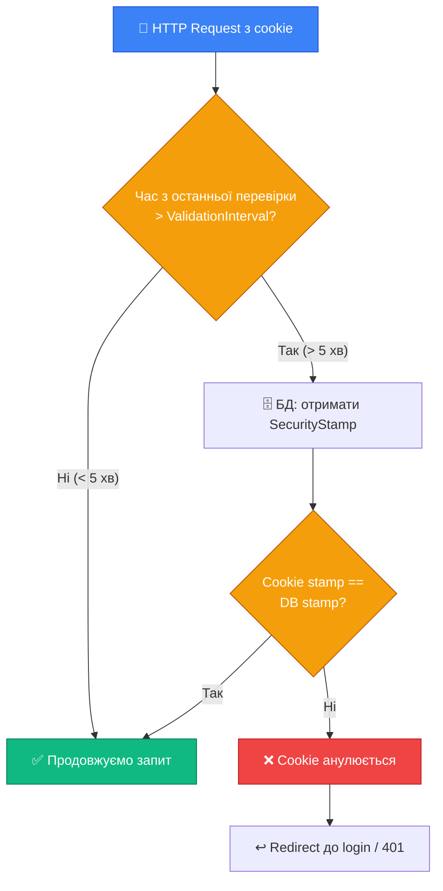

# Identity: Внутрішня Архітектура та Кастомізація

::note
Попередні статті описали, **що** робить Identity. Ця стаття відповідає на питання **як** — як Identity зберігає токени, як виявляє скомпрометовані сесії, як додати власні claims до кожного користувача і як налаштувати кожен аспект системи. Ці знання відрізняють розробника, який «просто підключив Identity», від того, хто розуміє систему зсередини.

::

---

## 1. SecurityStamp: ключ примусового виходу

### Проблема

Уявіть сценарій: користувач увійшов з дому, cookie зберігається у браузері. Тут хтось дізнається його пароль і змінює його через функцію «зміна пароля». Без додаткового механізму:

- Домашній браузер **продовжує працювати** зі старим cookie.
- Зловмисник з новим паролем **також входить**.
- Обидва акаунти активні одночасно.

`SecurityStamp` вирішує цю проблему. Це випадковий UUID у колонці `AspNetUsers.SecurityStamp`, що змінюється кожного разу, коли відбуваються критичні зміни в акаунті.

### Коли SecurityStamp оновлюється?

| Операція | SecurityStamp оновлюється? |
|:---|:---:|
| `CreateAsync` (реєстрація) | ✅ Так (генерується новий) |
| `ChangePasswordAsync` | ✅ Так |
| `ResetPasswordAsync` | ✅ Так |
| `ChangeEmailAsync` | ✅ Так |
| `ChangePhoneNumberAsync` | ✅ Так |
| `SetTwoFactorEnabledAsync` | ✅ Так |
| `AddToRoleAsync / RemoveFromRoleAsync` | ✅ Так |
| `UpdateAsync` (просте оновлення профілю) | ❌ Ні |
| `UpdateSecurityStampAsync` (вручну) | ✅ Так |

### SecurityStampValidator

Для Cookie Authentication Identity має вбудований `SecurityStampValidator`. Він **periodically** перевіряє, чи SecurityStamp у cookie співпадає з поточним у базі даних.

```csharp [Program.cs — налаштування SecurityStampValidator]
builder.Services
    .AddIdentity<AppUser, IdentityRole>()
    .AddEntityFrameworkStores<AppDbContext>()
    .AddDefaultTokenProviders();

// Налаштовуємо інтервал перевірки SecurityStamp
builder.Services.Configure<SecurityStampValidatorOptions>(options =>
{
    // За замовчуванням — 30 хвилин
    // Для критичних систем можна зменшити до 1-5 хвилин
    options.ValidationInterval = TimeSpan.FromMinutes(5);

    // Що робити, коли stamp змінився?
    // За замовчуванням — анулювати сесію (redirect до login)
    options.OnRefreshingPrincipal = context =>
    {
        // Тут можна додати логування або додаткову логіку
        var oldPrincipal = context.CurrentPrincipal;
        var newPrincipal = context.NewPrincipal;

        // Наприклад, перенесення кастомних claims зі старого principal
        var customClaim = oldPrincipal?.FindFirst("custom-claim");
        if (customClaim is not null)
            newPrincipal?.Identities.First().AddClaim(customClaim);

        return Task.CompletedTask;
    };
});
```

### Як ValidationInterval працює?

Коли cookie authentification обробляє запит:

1. Читає поточний timestamp із cookie.
2. Порівнює з `now - ValidationInterval`.
3. Якщо минуло більше ніж `ValidationInterval` — звертається до БД і перевіряє SecurityStamp.
4. Якщо stamp відрізняється — cookie анулюється, user отримує `401`.

::mermaid



::

### Реалізація «Вийти з усіх пристроїв»

SecurityStamp дозволяє легко реалізувати функцію виходу з усіх активних сесій:

```csharp [POST /account/logout-everywhere]
app.MapPost("/account/logout-everywhere",
    async (LogoutEverywhereRequest req,
           HttpContext ctx,
           UserManager<AppUser> userManager,
           SignInManager<AppUser> signInManager) =>
{
    var user = await userManager.GetUserAsync(ctx.User);
    if (user is null) return Results.Unauthorized();

    // Опціонально: вимагаємо підтвердження паролем
    if (!string.IsNullOrEmpty(req.Password))
    {
        var passwordValid = await userManager
            .CheckPasswordAsync(user, req.Password);

        if (!passwordValid)
            return Results.BadRequest(new { error = "Invalid password." });
    }

    // Оновлюємо SecurityStamp — це анулює ВСІ поточні cookie-сесії!
    // Наступного разу (через ValidationInterval) кожен пристрій
    // отримає 401 і буде перенаправлений на логін
    await userManager.UpdateSecurityStampAsync(user);

    // Виходимо з ПОТОЧНОГО пристрою одразу
    await signInManager.SignOutAsync();

    return Results.Ok(new
    {
        message = "You have been signed out from all devices."
    });
}).RequireAuthorization();

record LogoutEverywhereRequest(string? Password);
```

::tip
**Коли це корисно:** після зміни пароля, підозрілої активності, або просто як функція безпеки у налаштуваннях акаунту. Багато сервісів (Google, GitHub) мають подібну функцію в налаштуваннях активних сесій.

::

---

## 2. ConcurrencyStamp

### Проблема конкурентного оновлення

Уявіть: два адміністратори одночасно редагують профіль одного користувача. Адмін А завантажив профіль, Адмін Б теж завантажив. Адмін А зберіг зміни. Адмін Б також зберіг — і **перезаписав** зміни Адміна А. Зміни Адміна А втрачені.

`ConcurrencyStamp` — це механізм **оптимістичного блокування** (Optimistic Concurrency). Він також зберігається у `AspNetUsers.ConcurrencyStamp` і оновлюється при кожному `UpdateAsync`.

### Як це захищає?

```csharp [Принцип роботи ConcurrencyStamp]
// Адмін А і Адмін Б завантажили user:
// ConcurrencyStamp = "abc123"

// Адмін А зберігає зміни:
var result = await userManager.UpdateAsync(user);
// EF Core виконує:
// UPDATE AspNetUsers SET ... WHERE ConcurrencyStamp = 'abc123'
// ConcurrencyStamp оновлюється до "def456"

// Адмін Б намагається зберегти свою версію:
// EF Core виконує:
// UPDATE AspNetUsers SET ... WHERE ConcurrencyStamp = 'abc123'
// Знаходить 0 рядків! (бо stamp вже 'def456')
// → DbUpdateConcurrencyException
```

### Обробка конкурентного конфлікту

```csharp [Безпечне оновлення з обробкою конфліктів]
app.MapPut("/account/profile",
    async (UpdateProfileRequest req,
           HttpContext ctx,
           UserManager<AppUser> userManager) =>
{
    var user = await userManager.GetUserAsync(ctx.User);
    if (user is null) return Results.Unauthorized();

    // Зберігаємо поточний ConcurrencyStamp для порівняння
    var originalStamp = user.ConcurrencyStamp;

    user.FullName = req.FullName;
    // Інші зміни...

    try
    {
        var result = await userManager.UpdateAsync(user);

        if (!result.Succeeded)
        {
            // Серед помилок може бути ConcurrencyFailure
            var isConcurrencyError = result.Errors.Any(
                e => e.Code == "ConcurrencyFailure");

            if (isConcurrencyError)
                return Results.Conflict(new
                {
                    error  = "The profile was updated by another process. " +
                             "Please reload and try again.",
                    code   = "CONCURRENCY_CONFLICT"
                });

            return Results.BadRequest(new
            {
                errors = result.Errors.Select(e => e.Description)
            });
        }

        return Results.Ok(new { message = "Profile updated." });
    }
    catch (DbUpdateConcurrencyException ex)
    {
        // EF Core кидає цей exception при конкурентному конфлікті
        return Results.Conflict(new
        {
            error = "Concurrency conflict detected. Please retry.",
            code  = "CONCURRENCY_CONFLICT"
        });
    }
});

record UpdateProfileRequest(string FullName);
```

---

## 3. AspNetUserTokens: сховище токенів

### Структура таблиці

```sql
CREATE TABLE AspNetUserTokens (
    UserId        NVARCHAR(450) NOT NULL,
    LoginProvider NVARCHAR(450) NOT NULL,
    Name          NVARCHAR(450) NOT NULL,
    Value         NVARCHAR(MAX) NULL,
    PRIMARY KEY (UserId, LoginProvider, Name)
);
```

Таблиця `AspNetUserTokens` — це **гнучке сховище** для будь-яких токенів та даних, пов'язаних із користувачем. Identity використовує її для:

| LoginProvider | Name | Що зберігається |
|:---|:---|:---|
| `[AspNetUserStore]` | `AuthenticatorKey` | TOTP secret key (Base32) |
| `[AspNetUserStore]` | `RecoveryCodes` | Хеші резервних кодів (через `;`) |
| `Google` | `access_token` | OAuth access token від Google |
| `Google` | `refresh_token` | OAuth refresh token від Google |
| `[AspNetUserStore]` | `phonenumber_change` | Токен зміни телефону |

### Прямі операції з UserTokens

`UserManager` надає три методи для роботи з токенами:

```csharp [Робота з UserTokens безпосередньо]
// Зберегти будь-які дані
await userManager.SetAuthenticationTokenAsync(
    user,
    loginProvider: "MyApp",
    tokenName:     "RefreshToken",
    tokenValue:    refreshToken);

// Отримати збережені дані
var storedToken = await userManager.GetAuthenticationTokenAsync(
    user,
    loginProvider: "MyApp",
    tokenName:     "RefreshToken");

// Видалити
await userManager.RemoveAuthenticationTokenAsync(
    user,
    loginProvider: "MyApp",
    tokenName:     "RefreshToken");
```

### Практичний приклад: Refresh Tokens через UserTokens

Замість окремої таблиці для refresh tokens, можна використовувати `AspNetUserTokens`:

```csharp [Services/RefreshTokenService.cs]
public class RefreshTokenService
{
    private readonly UserManager<AppUser> _userManager;
    private const string _loginProvider = "MyApp";
    private const string _tokenName     = "RefreshToken";

    public RefreshTokenService(UserManager<AppUser> userManager)
        => _userManager = userManager;

    public async Task<string> CreateRefreshTokenAsync(AppUser user)
    {
        // Генеруємо безпечний токен
        var refreshToken = Convert.ToBase64String(
            RandomNumberGenerator.GetBytes(64));

        // Зберігаємо у AspNetUserTokens
        await _userManager.SetAuthenticationTokenAsync(
            user, _loginProvider, _tokenName, refreshToken);

        return refreshToken;
    }

    public async Task<AppUser?> ValidateRefreshTokenAsync(
        string userId, string refreshToken)
    {
        var user = await _userManager.FindByIdAsync(userId);
        if (user is null) return null;

        var stored = await _userManager.GetAuthenticationTokenAsync(
            user, _loginProvider, _tokenName);

        // Порівнюємо токени (безпечне порівняння рядків)
        if (!CryptographicOperations.FixedTimeEquals(
            Encoding.UTF8.GetBytes(stored ?? ""),
            Encoding.UTF8.GetBytes(refreshToken)))
            return null;

        return user;
    }

    public async Task RevokeRefreshTokenAsync(AppUser user)
        => await _userManager.RemoveAuthenticationTokenAsync(
            user, _loginProvider, _tokenName);
}
```

::note
Підхід з `AspNetUserTokens` зберігає **один** refresh token на провайдер. Якщо потрібна підтримка кількох пристроїв одночасно (різні RefreshToken для кожного пристрою) — краще використовувати окрему таблицю зі стовпчиком `DeviceId`.

::

---

## 4. IUserTwoFactorTokenProvider: кастомний провайдер токенів

### Навіщо кастомний провайдер?

Стандартні провайдери задовольняють більшість потреб. Але іноді потрібно:

- Генерувати токени за власним алгоритмом (наприклад, більш короткі коди).
- Використовувати зовнішній сервіс для верифікації (наприклад, Authy API).
- Реалізувати власне сховище для токенів.

### Інтерфейс `IUserTwoFactorTokenProvider<TUser>`

```csharp [Interfaces/IUserTwoFactorTokenProvider.cs — концепція]
// Спрощений вигляд інтерфейсу
public interface IUserTwoFactorTokenProvider<TUser>
{
    // Генерує токен для користувача
    Task<string> GenerateAsync(
        string purpose,
        UserManager<TUser> manager,
        TUser user);

    // Перевіряє токен
    Task<bool> ValidateAsync(
        string purpose,
        string token,
        UserManager<TUser> manager,
        TUser user);

    // Чи може провайдер генерувати токен 2FA?
    Task<bool> CanGenerateTwoFactorTokenAsync(
        UserManager<TUser> manager,
        TUser user);
}
```

### Приклад: кастомний 6-значний числовий провайдер

```csharp [Security/NumericTokenProvider.cs]
using Microsoft.AspNetCore.Identity;

/// <summary>
/// Провайдер, що генерує короткі числові коди (6 цифр)
/// з обмеженим часом дії через AspNetUserTokens.
/// </summary>
public class NumericTokenProvider<TUser>
    : IUserTwoFactorTokenProvider<TUser>
    where TUser : class
{
    private const string LoginProvider = "NumericOTP";
    private const int    TokenLength   = 6;
    private const int    LiftespanMin  = 10; // хвилин

    public Task<bool> CanGenerateTwoFactorTokenAsync(
        UserManager<TUser> manager, TUser user)
    {
        // Цей провайдер завжди може генерувати токен
        return Task.FromResult(true);
    }

    public async Task<string> GenerateAsync(
        string purpose,
        UserManager<TUser> manager,
        TUser user)
    {
        // Генеруємо 6-значний числовий код
        var code = RandomNumberGenerator
            .GetInt32(0, 999_999)
            .ToString("D6"); // "000000" - "999999"

        // Зберігаємо: code + timestamp (для перевірки TTL)
        var payload = $"{code}:{DateTimeOffset.UtcNow.ToUnixTimeSeconds()}";

        await manager.SetAuthenticationTokenAsync(
            user, LoginProvider, purpose, payload);

        return code; // Повертаємо лише код, без timestamp
    }

    public async Task<bool> ValidateAsync(
        string purpose,
        string token,
        UserManager<TUser> manager,
        TUser user)
    {
        // Отримуємо збережений payload
        var payload = await manager.GetAuthenticationTokenAsync(
            user, LoginProvider, purpose);

        if (string.IsNullOrEmpty(payload)) return false;

        var parts     = payload.Split(':');
        if (parts.Length != 2)  return false;

        var storedCode = parts[0];
        if (!long.TryParse(parts[1], out var timestamp))
            return false;

        // Перевіряємо TTL
        var generated = DateTimeOffset.FromUnixTimeSeconds(timestamp);
        if (DateTimeOffset.UtcNow - generated >
            TimeSpan.FromMinutes(LiftespanMin))
        {
            // Токен прострочений — видаляємо з БД
            await manager.RemoveAuthenticationTokenAsync(
                user, LoginProvider, purpose);
            return false;
        }

        // Порівнюємо код (тайм-постійне порівняння)
        var isValid = CryptographicOperations.FixedTimeEquals(
            Encoding.UTF8.GetBytes(storedCode),
            Encoding.UTF8.GetBytes(token));

        if (isValid)
        {
            // Одноразовість: видаляємо після успішної валідації
            await manager.RemoveAuthenticationTokenAsync(
                user, LoginProvider, purpose);
        }

        return isValid;
    }
}
```

```csharp [Program.cs — реєстрація кастомного провайдера]
builder.Services
    .AddIdentity<AppUser, IdentityRole>()
    .AddEntityFrameworkStores<AppDbContext>()
    .AddDefaultTokenProviders()
    // Реєструємо власний провайдер під назвою "Numeric"
    .AddTokenProvider<NumericTokenProvider<AppUser>>("Numeric");

// Використання у коді:
var code = await userManager.GenerateTwoFactorTokenAsync(
    user, "Numeric");

var isValid = await userManager.VerifyTwoFactorTokenAsync(
    user, "Numeric", code);
```

---

## 5. IUserClaimsPrincipalFactory: кастомізація Claims

### Проблема: що Identity додає за замовчуванням?

Коли Identity входить (`SignInAsync` або `CreateAsync`), вона будує `ClaimsPrincipal` через `UserClaimsPrincipalFactory`. За замовчуванням до claims потрапляє:

```
ClaimTypes.NameIdentifier = user.Id
ClaimTypes.Name           = user.UserName
ClaimTypes.Email          = user.Email       (якщо SecurityStampClaimType не переопределено)
ClaimTypes.Role           = роль1, роль2...  (якщо AddRoles true)
"AspNet.Identity.SecurityStamp" = stamp
```

Але що якщо в JWT-токені чи cookie вам потрібно `FullName`, `Department`, або статус підписки? Без кастомізації — доведеться щоразу робити додатковий запит до БД.

### Власна фабрика Claims

```csharp [Security/AppClaimsPrincipalFactory.cs]
using Microsoft.AspNetCore.Identity;
using System.Security.Claims;

public class AppClaimsPrincipalFactory
    : UserClaimsPrincipalFactory<AppUser, IdentityRole>
{
    public AppClaimsPrincipalFactory(
        UserManager<AppUser>    userManager,
        RoleManager<IdentityRole> roleManager,
        IOptions<IdentityOptions> options)
        : base(userManager, roleManager, options) { }

    /// <summary>
    /// Перевизначаємо метод, що будує ClaimsPrincipal.
    /// Викликається при кожному SignIn.
    /// </summary>
    protected override async Task<ClaimsIdentity> GenerateClaimsAsync(
        AppUser user)
    {
        // Викликаємо базову реалізацію (Id, Name, Email, Roles)
        var identity = await base.GenerateClaimsAsync(user);

        // Додаємо власні claims:

        // 1. Повне ім'я
        if (!string.IsNullOrEmpty(user.FullName))
            identity.AddClaim(
                new Claim("full_name", user.FullName));

        // 2. Дата реєстрації (в epoch секундах)
        identity.AddClaim(new Claim(
            "created_at",
            new DateTimeOffset(user.CreatedAt).ToUnixTimeSeconds().ToString()));

        // 3. Підтвердженість email (для UI)
        identity.AddClaim(new Claim(
            "email_confirmed",
            user.EmailConfirmed.ToString().ToLower()));

        // 4. 2FA увімкнений?
        identity.AddClaim(new Claim(
            "two_factor_enabled",
            user.TwoFactorEnabled.ToString().ToLower()));

        // 5. З'ясовуємо статус підписки (з'єднання до БД)
        // Можна ін'єктувати додаткові сервіси через DI:
        // var subscription = await _subscriptionService
        //     .GetActiveAsync(user.Id);
        // identity.AddClaim(new Claim("subscription", subscription.Plan));

        return identity;
    }
}
```

```csharp [Program.cs — реєстрація фабрики]
builder.Services
    .AddIdentity<AppUser, IdentityRole>()
    .AddEntityFrameworkStores<AppDbContext>()
    .AddDefaultTokenProviders();

// Замінюємо стандартну фабрику на власну
// ВАЖЛИВО: реєструємо після AddIdentity!
builder.Services.AddScoped<
    IUserClaimsPrincipalFactory<AppUser>,
    AppClaimsPrincipalFactory>();
```

### Використання кастомних claims в ендпоінтах

```csharp [Читання кастомних claims]
app.MapGet("/me", (ClaimsPrincipal user) =>
{
    // Стандартні claims
    var userId = user.FindFirst(ClaimTypes.NameIdentifier)?.Value;
    var email  = user.FindFirst(ClaimTypes.Email)?.Value;
    var roles  = user.FindAll(ClaimTypes.Role)
                     .Select(c => c.Value).ToList();

    // Кастомні claims (додані в AppClaimsPrincipalFactory)
    var fullName = user.FindFirst("full_name")?.Value;
    var createdAt = user.FindFirst("created_at")?.Value;
    var emailConfirmed = user.FindFirst("email_confirmed")?.Value;
    var twoFaEnabled   = user.FindFirst("two_factor_enabled")?.Value;

    return Results.Ok(new
    {
        userId,
        email,
        roles,
        fullName,
        createdAt       = createdAt is not null
            ? DateTimeOffset.FromUnixTimeSeconds(long.Parse(createdAt))
            : (DateTimeOffset?)null,
        emailConfirmed  = emailConfirmed == "true",
        twoFactorEnabled = twoFaEnabled == "true"
    });
}).RequireAuthorization();
```

::tip
**Порада щодо JWT:** якщо ви використовуєте JWT (не Cookie Auth), то `IUserClaimsPrincipalFactory` **не** викликається автоматично. Ви самі будуєте ClaimsPrincipal при генерації JWT. Але ту ж саму логіку можна інкапсулювати в сервіс `UserClaimsService`, який буде використовуватися і при генерації JWT, і у фабриці.

::

---

## 6. Account Lockout: детальний розбір

### Повна логіка Lockout

Lockout в Identity — це автоматичний захист від брутфорсу. Але мало хто знає всі нюанси:

```csharp [Program.cs — повне налаштування Lockout]
builder.Services
    .AddIdentity<AppUser, IdentityRole>(options =>
    {
        // Максимум невдалих спроб до блокування
        options.Lockout.MaxFailedAccessAttempts = 5;

        // Тривалість блокування
        options.Lockout.DefaultLockoutTimeSpan  = TimeSpan.FromMinutes(15);

        // Чи вмикати lockout за замовчуванням для нових користувачів?
        options.Lockout.AllowedForNewUsers       = true;
    });
```

### Ручне управління Lockout

Через `UserManager` можна керувати lockout вручну:

```csharp [Повний API управління блокуванням]
// Поточний стан акаунту
var isLockedOut = await userManager.IsLockedOutAsync(user);
var lockoutEnd  = await userManager.GetLockoutEndDateAsync(user);
var failCount   = await userManager.GetAccessFailedCountAsync(user);

// Зарахувати невдалу спробу (і заблокувати якщо досягли ліміту)
await userManager.AccessFailedAsync(user);

// Скинути лічильник (після успішного входу)
await userManager.ResetAccessFailedCountAsync(user);

// Вручну заблокувати акаунт
await userManager.SetLockoutEndDateAsync(
    user, DateTimeOffset.UtcNow.AddDays(30));

// Розблокувати вручну (адміністратором)
await userManager.SetLockoutEndDateAsync(
    user, DateTimeOffset.UtcNow.AddMilliseconds(-1));

// Вимкнути lockout для конкретного користувача (наприклад, для сервісних акаунтів)
await userManager.SetLockoutEnabledAsync(user, false);
```

### Прогресивне блокування (кастомна логіка)

Стандартний lockout — простий: 5 спроб → 15 хвилин. Але можна реалізувати прогресивне блокування:

```csharp [Services/ProgressiveLockoutService.cs]
public class ProgressiveLockoutService
{
    private readonly UserManager<AppUser> _userManager;

    public ProgressiveLockoutService(UserManager<AppUser> userManager)
        => _userManager = userManager;

    public async Task HandleFailedLoginAsync(AppUser user)
    {
        // Отримуємо кількість невдалих спроб
        var failCount = await _userManager
            .GetAccessFailedCountAsync(user);

        // Визначаємо тривалість блокування залежно від кількості спроб
        TimeSpan? lockoutDuration = failCount switch
        {
            < 3  => null,                        // Поки що не блокуємо
            3    => TimeSpan.FromMinutes(5),      // 3 спроби → 5 хвилин
            4    => TimeSpan.FromMinutes(30),     // 4 спроби → 30 хвилин
            5    => TimeSpan.FromHours(2),        // 5 спроб → 2 години
            >= 6 => TimeSpan.FromDays(1),         // 6+ спроб → 24 години
        };

        if (lockoutDuration.HasValue)
        {
            // Вручну встановлюємо момент розблокування
            await _userManager.SetLockoutEndDateAsync(
                user, DateTimeOffset.UtcNow.Add(lockoutDuration.Value));
        }

        // Фіксуємо спробу (без автоматичного блокування з боку Identity)
        await _userManager.AccessFailedAsync(user);
    }
}
```

### Відображення Lockout у відповіді API

```csharp [Обробка всіх станів SignInResult]
var result = await signInManager.CheckPasswordSignInAsync(
    user, req.Password, lockoutOnFailure: true);

return result switch
{
    { Succeeded: true } => HandleSuccess(user),
    
    { IsLockedOut: true } => Results.Json(new
    {
        error    = "Account temporarily locked due to too many failed attempts.",
        code     = "ACCOUNT_LOCKED",
        // Показуємо коли розблокується
        unlockAt = await userManager.GetLockoutEndDateAsync(user)
    }, statusCode: 423), // 423 Locked

    { IsNotAllowed: true } => Results.Json(new
    {
        error = "Login not allowed. Please confirm your email.",
        code  = "EMAIL_NOT_CONFIRMED"
    }, statusCode: 403),

    { RequiresTwoFactor: true } => Results.Ok(new
    {
        requiresTwoFactor = true,
        userId            = user.Id
    }),

    _ => Results.Json(new
    {
        error = "Invalid credentials.",
        code  = "INVALID_CREDENTIALS"
    }, statusCode: 401)
};
```

---

## 7. IdentityOptions: повний довідник

### PasswordOptions

```csharp [Всі опції паролів]
options.Password.RequireDigit           = true;  // Мінімум 1 цифра
options.Password.RequireLowercase       = true;  // Мінімум 1 мала літера
options.Password.RequireUppercase       = true;  // Мінімум 1 велика літера
options.Password.RequireNonAlphanumeric = false; // Спецсимвол (!@#$...)
options.Password.RequiredLength         = 8;     // Мінімальна довжина
options.Password.RequiredUniqueChars    = 1;     // Мінімум N унікальних символів
```

::field-group

::field{name="RequiredUniqueChars" type="int" default="1"}
Кількість **унікальних** символів. Встановіть `4` — тоді пароль `aaaa1A!` буде відхилений (лише 4 унікальних: `a`, `1`, `A`, `!`). Це захищає від паролів типу `11111111`.

::

::field{name="RequireNonAlphanumeric" type="bool" default="true"}
Чи потрібен спецсимвол. Деякі організації вимикають — бо це не завжди покращує ентропію (люди просто додають `!` в кінець).

::

::

### UserOptions

```csharp [UserOptions]
// Символи, дозволені у UserName
options.User.AllowedUserNameCharacters =
    "abcdefghijklmnopqrstuvwxyz" +
    "ABCDEFGHIJKLMNOPQRSTUVWXYZ" +
    "0123456789" +
    "-._@+";

// Вимагати унікальний email
options.User.RequireUniqueEmail = true;
```

::warning
За замовчуванням `AllowedUserNameCharacters` не включає пробіли, кирилицю та більшість Unicode-символів. Якщо дозволяєте реєстрацію з іменами типу `Іван Петрів` — або змініть `AllowedUserNameCharacters`, або використовуйте email як `UserName` (що є стандартною практикою).

::

### SignInOptions

```csharp [SignInOptions]
// Вхід лише для підтверджених акаунтів
options.SignIn.RequireConfirmedEmail        = true;
options.SignIn.RequireConfirmedPhoneNumber  = false;
options.SignIn.RequireConfirmedAccount      = false;
// RequireConfirmedAccount — загальніший варіант:
// якщо true — перевіряє IsEmailConfirmed або IsPhoneConfirmed
```

### LockoutOptions

```csharp [LockoutOptions]
options.Lockout.AllowedForNewUsers       = true;
options.Lockout.MaxFailedAccessAttempts  = 5;
options.Lockout.DefaultLockoutTimeSpan   = TimeSpan.FromMinutes(15);
```

### ClaimsIdentityOptions

```csharp [ClaimsIdentityOptions — назви типів claims]
// Які ClaimTypes використовувати у tokens
options.ClaimsIdentity.UserIdClaimType       = ClaimTypes.NameIdentifier;
options.ClaimsIdentity.UserNameClaimType     = ClaimTypes.Name;
options.ClaimsIdentity.EmailClaimType        = ClaimTypes.Email;
options.ClaimsIdentity.RoleClaimType         = ClaimTypes.Role;
options.ClaimsIdentity.SecurityStampClaimType = "AspNet.Identity.SecurityStamp";
```

Ви можете змінити ці значення, щоб використовувати коротші назви у JWT (замість довгих URL-подібних `ClaimTypes.NameIdentifier`):

```csharp [Кастомні назви claims для JWT]
options.ClaimsIdentity.UserIdClaimType   = "sub";
options.ClaimsIdentity.RoleClaimType     = "role";
options.ClaimsIdentity.EmailClaimType    = "email";
```

---

## 8. Розширення IdentityUser та IdentityDbContext

### Кастомна модель користувача

```csharp [Models/AppUser.cs — повний приклад]
using Microsoft.AspNetCore.Identity;

public class AppUser : IdentityUser
{
    // Додаткові поля профілю
    public string FullName    { get; set; } = string.Empty;
    public string? AvatarUrl  { get; set; }
    public string? Bio        { get; set; }

    // Метадані
    public DateTime CreatedAt  { get; set; } = DateTime.UtcNow;
    public DateTime? LastLogin { get; set; }
    public string? TimeZone   { get; set; } = "UTC";

    // Налаштування
    public string? PreferredLanguage { get; set; } = "uk";
    public bool MarketingEmails      { get; set; } = false;

    // Статус
    public bool IsDeleted    { get; set; } = false;
    public DateTime? DeletedAt { get; set; }
}
```

### Типізований IdentityDbContext

```csharp [Data/AppDbContext.cs — повна конфігурація]
using Microsoft.AspNetCore.Identity;
using Microsoft.AspNetCore.Identity.EntityFrameworkCore;
using Microsoft.EntityFrameworkCore;

public class AppDbContext
    // Параметри: AppUser, IdentityRole, тип ключа (string за замовчуванням)
    : IdentityDbContext<AppUser, IdentityRole, string>
{
    public AppDbContext(DbContextOptions<AppDbContext> options)
        : base(options) { }

    // Власні DbSet'и
    public DbSet<Order> Orders { get; set; }

    protected override void OnModelCreating(ModelBuilder builder)
    {
        // ВАЖЛИВО: спочатку викликаємо базовий метод
        // (він конфігурує всі таблиці Identity)
        base.OnModelCreating(builder);

        // Перейменовуємо таблиці Identity (необов'язково)
        builder.Entity<AppUser>()
            .ToTable("Users");
        builder.Entity<IdentityRole>()
            .ToTable("Roles");
        builder.Entity<IdentityUserRole<string>>()
            .ToTable("UserRoles");
        builder.Entity<IdentityUserClaim<string>>()
            .ToTable("UserClaims");
        builder.Entity<IdentityUserLogin<string>>()
            .ToTable("UserLogins");
        builder.Entity<IdentityRoleClaim<string>>()
            .ToTable("RoleClaims");
        builder.Entity<IdentityUserToken<string>>()
            .ToTable("UserTokens");

        // Індекси для кращої продуктивності
        builder.Entity<AppUser>()
            .HasIndex(u => u.FullName)
            .HasDatabaseName("IX_Users_FullName");

        builder.Entity<AppUser>()
            .HasIndex(u => u.CreatedAt)
            .HasDatabaseName("IX_Users_CreatedAt");

        // Soft delete фільтр (не показувати видалених)
        builder.Entity<AppUser>()
            .HasQueryFilter(u => !u.IsDeleted);
    }
}
```

### IdentityDbContext з кастомним типом ключа

За замовчуванням Identity використовує `string` (GUID) як тип ключа. Для `int` або `Guid`:

```csharp [Кастомний тип ключа (int)]
// Модель
public class AppUser : IdentityUser<int>
{
    // IdentityUser<int> → Id: int замість string
    public string FullName { get; set; } = string.Empty;
}

// DbContext
public class AppDbContext
    : IdentityDbContext<AppUser, IdentityRole<int>, int>
{
    // ...
}

// Реєстрація
builder.Services
    .AddIdentity<AppUser, IdentityRole<int>>()
    .AddEntityFrameworkStores<AppDbContext<int>>();
```

---

## 9. IdentityResult та локалізація помилок

### Структура IdentityResult

```csharp [Робота з IdentityResult]
var result = await userManager.CreateAsync(user, password);

if (!result.Succeeded)
{
    foreach (var error in result.Errors)
    {
        // error.Code        — машинно-читаємий код ("PasswordTooShort")
        // error.Description — текст помилки (англійською за замовчуванням)
        Console.WriteLine($"[{error.Code}] {error.Description}");
    }
}
```

### Типові коди помилок Identity

| Код помилки | Опис |
|:---|:---|
| `PasswordTooShort` | Пароль менше `RequiredLength` символів |
| `PasswordRequiresDigit` | Потрібна цифра |
| `PasswordRequiresUpper` | Потрібна велика літера |
| `PasswordRequiresNonAlphanumeric` | Потрібен спецсимвол |
| `DuplicateUserName` | UserName вже зайнятий |
| `DuplicateEmail` | Email вже зареєстрований |
| `InvalidToken` | Токен невалідний або прострочений |
| `InvalidEmail` | Некоректний формат email |
| `ConcurrencyFailure` | Конкурентне оновлення |

### Власний IdentityErrorDescriber (локалізація)

За замовчуванням помилки — англійською. Для локалізації:

```csharp [Infrastructure/UkrainianIdentityErrorDescriber.cs]
using Microsoft.AspNetCore.Identity;

public class UkrainianIdentityErrorDescriber : IdentityErrorDescriber
{
    public override IdentityError DefaultError()
        => new() { Code = nameof(DefaultError),
            Description = "Сталася невідома помилка." };

    public override IdentityError DuplicateEmail(string email)
        => new() { Code = nameof(DuplicateEmail),
            Description = $"Email '{email}' вже використовується." };

    public override IdentityError DuplicateUserName(string userName)
        => new() { Code = nameof(DuplicateUserName),
            Description = $"Логін '{userName}' вже зайнятий." };

    public override IdentityError InvalidEmail(string? email)
        => new() { Code = nameof(InvalidEmail),
            Description = $"'{email}' є некоректним email." };

    public override IdentityError PasswordMismatch()
        => new() { Code = nameof(PasswordMismatch),
            Description = "Невірний пароль." };

    public override IdentityError PasswordRequiresDigit()
        => new() { Code = nameof(PasswordRequiresDigit),
            Description = "Пароль має містити принаймні одну цифру ('0'-'9')." };

    public override IdentityError PasswordRequiresLower()
        => new() { Code = nameof(PasswordRequiresLower),
            Description = "Пароль має містити принаймні одну малу літеру ('a'-'z')." };

    public override IdentityError PasswordRequiresUpper()
        => new() { Code = nameof(PasswordRequiresUpper),
            Description = "Пароль має містити принаймні одну велику літеру ('A'-'Z')." };

    public override IdentityError PasswordRequiresNonAlphanumeric()
        => new() { Code = nameof(PasswordRequiresNonAlphanumeric),
            Description = "Пароль має містити принаймні один небуквено-цифровий символ." };

    public override IdentityError PasswordTooShort(int length)
        => new() { Code = nameof(PasswordTooShort),
            Description = $"Пароль має бути не коротшим за {length} символів." };

    public override IdentityError InvalidToken()
        => new() { Code = nameof(InvalidToken),
            Description = "Недійсний токен." };

    public override IdentityError UserAlreadyInRole(string role)
        => new() { Code = nameof(UserAlreadyInRole),
            Description = $"Користувач вже має роль '{role}'." };

    public override IdentityError UserNotInRole(string role)
        => new() { Code = nameof(UserNotInRole),
            Description = $"Користувач не має ролі '{role}'." };

    public override IdentityError UserLockoutNotEnabled()
        => new() { Code = nameof(UserLockoutNotEnabled),
            Description = "Блокування не увімкнено для цього користувача." };

    public override IdentityError ConcurrencyFailure()
        => new() { Code = nameof(ConcurrencyFailure),
            Description = "Оптимістичний конкурентний збій, об'єкт був змінений." };
}
```

```csharp [Program.cs — реєстрація локалізованого describer]
builder.Services
    .AddIdentity<AppUser, IdentityRole>()
    .AddEntityFrameworkStores<AppDbContext>()
    .AddDefaultTokenProviders()
    // Замінюємо стандартний ErrorDescriber на власний
    .AddErrorDescriber<UkrainianIdentityErrorDescriber>();
```

---

## 10. Практичні завдання

### Рівень 1: Базовий

::accordion

::accordion-item{label="Завдання 7.1: SecurityStamp в дії" icon="i-lucide-circle-help"}

Дослідіть SecurityStamp:

1. Зареєструйтеся та залогіньтеся — збережіть cookie
2. Змініть пароль через `userManager.ChangePasswordAsync`
3. Подивіться в БД: `SecurityStamp` мав змінитися
4. Виконайте запит із старим cookie — що повернулося?
5. Налаштуйте `ValidationInterval = TimeSpan.FromSeconds(30)` і перевірте, що через 30 секунд після зміни пароля cookie стає недійсним

::

::accordion-item{label="Завдання 7.2: Локалізація помилок" icon="i-lucide-circle-help"}

Локалізуйте Identity помилки:

1. Реалізуйте `UkrainianIdentityErrorDescriber` для мінімум 5 помилок
2. Зареєструйте через `.AddErrorDescriber<>`
3. Спробуйте: реєстрація з коротким паролем → перевірте, що помилка українською
4. Спробуйте: реєстрація з вже існуючим email → перевірте повідомлення
5. Виведіть помилки як `{code, description}` у ValidationProblem

::

::

### Рівень 2: Проєктування

::accordion

::accordion-item{label="Завдання 7.3: Кастомні Claims" icon="i-lucide-circle-help"}

Реалізуйте `AppClaimsPrincipalFactory`:

1. Додайте `FullName`, `CreatedAt`, `EmailConfirmed` до claims
2. Зареєструйте через `AddScoped<IUserClaimsPrincipalFactory<AppUser>, ...>`
3. Ендпоінт `GET /me` повертає всі claims, включно з кастомними
4. Переконайтеся, що при зміні FullName у профілі — наступний вхід містить нове ім'я
5. Чому кастомні claims у cookie не оновлюються одразу після зміни? Як це вирішити?

::

::accordion-item{label="Завдання 7.4: Lockout з кастомною логікою" icon="i-lucide-circle-help"}

Реалізуйте прогресивне блокування:

1. `ProgressiveLockoutService` з прогресивними інтервалами (5' → 30' → 2год → 24год)
2. Ендпоінт логіну використовує цей сервіс замість стандартного lockout
3. Ендпоінт `GET /admin/users/{id}/lockout-status` для адміністратора — показує `isLockedOut`, `lockoutEnd`, `failedAttempts`
4. Ендпоінт `POST /admin/users/{id}/unlock` — адмін розблоковує вручну
5. Логуйте кожне блокування (кількість спроб, IP, userId)

::

::

### Рівень 3: Архітектура

::accordion

::accordion-item{label="Завдання 7.5: Refresh Tokens через UserTokens" icon="i-lucide-circle-help"}

Реалізуйте Refresh Token систему через `AspNetUserTokens`:

1. `RefreshTokenService`: `CreateAsync` (генерує та зберігає), `ValidateAsync` (перевіряє), `RevokeAsync` (видаляє)
2. При логіні — видаємо JWT (access token, 15 хв) + refresh token (30 днів)
3. `POST /auth/refresh {refreshToken}` — оновлює access token
4. Rotation: при кожному refresh — старий refresh token видаляється, новий генерується
5. `POST /auth/logout` — видаляє refresh token (бо JWT revoke неможливий)
6. Чому `CryptographicOperations.FixedTimeEquals` важливий при порівнянні токенів?

::

::

---

## 11. Резюме

::card-group

::card{title="SecurityStamp — сторож сесій" icon="i-lucide-shield"}
Змінюється при зміні пароля, email, ролей, вмиканні 2FA. `ValidationInterval` (30 хв) визначає, коли перевіряється. `UpdateSecurityStampAsync` = вийти з усіх пристроїв.

::

::card{title="UserTokens — гнучке сховище" icon="i-lucide-database"}
`AspNetUserTokens` зберігає TOTP-ключі, recovery codes, OAuth tokens. `SetAuthenticationTokenAsync` / `GetAuthenticationTokenAsync` — прямий доступ.

::

::card{title="Claims Factory — ваш профіль у токені" icon="i-lucide-id-card"}
`IUserClaimsPrincipalFactory` → `AppClaimsPrincipalFactory`. Додайте `FullName`, `subscription`, `department` до claims — і не робіть зайвих запитів у кожному ендпоінті.

::

::card{title="IdentityErrorDescriber — UX деталь" icon="i-lucide-languages"}
`AddErrorDescriber<UkrainianIdentityErrorDescriber>()` замінює англійські повідомлення. Малий крок, але великий вплив на UX для україномовних користувачів.

::

::

**Далі:** наступна стаття покриє **OAuth 2.0 та зовнішні провайдери** — «Увійти через Google», GitHub та will довільних OAuth-провайдерів. Identity інтегрує зовнішній login через ту ж таблицю `AspNetUserLogins`, яку ми вже бачили.
