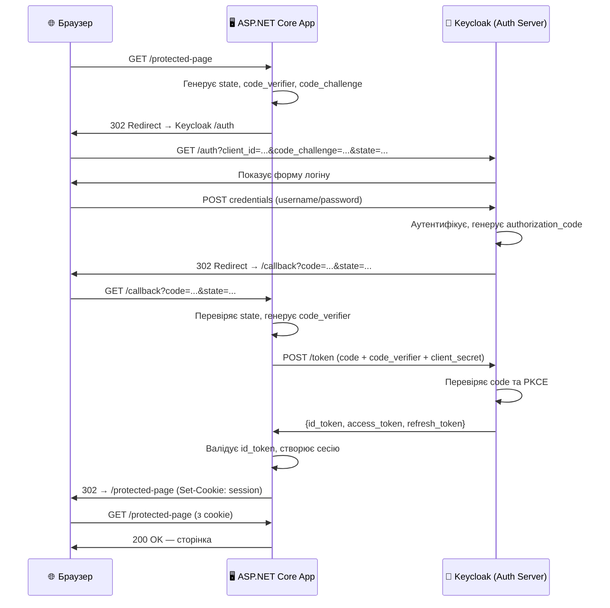

# OIDC, OAuth 2.0 та Keycloak в ASP.NET Core

## Проблема, яку ми вирішуємо

Уявіть, що ви будуєте SaaS-продукт. Вашим клієнтам зручно реєструватися через їхній корпоративний акаунт Microsoft або Google, а не створювати окремий обліковий запис. Або ваш застосунок складається з десяти мікросервісів, і кожен з них має самостійно перевіряти «хто це?» — але ви не хочете, щоб кожен тримав власну логіку аутентифікації.Або ж ви — підприємство, яке хоче централізовано керувати десятками внутрішніх додатків через єдиний портал: один акаунт, один пароль, одна система прав.

Усі ці задачі об'єднує одна потреба — **делегована аутентифікація (federated identity)**. Ваш застосунок не перевіряє пароль користувача сам — він довіряє перевірку спеціалізованому системи, яку називають **Identity Provider (IdP)**. Саме цю проблему вирішує зв'язка **OAuth 2.0** та **OpenID Connect**.

Ця стаття — не формальне «додайте `AddOpenIdConnect`». Це глибоке занурення в те, чому ці протоколи влаштовані саме так, які компроміси в них закладені і як правильно інтегрувати їх у сучасний ASP.NET Core застосунок — з Keycloak як прикладом Identity Provider.

---

## 1. Від сесій до токенів: еволюція аутентифікації

Щоб зрозуміти OIDC, варто простежити, як аутентифікація еволюціонувала протягом двох десятиліть.

### Ера сесій (Session-based Auth)

На початку 2000-х домінував простий підхід: після успішного логіну сервер зберігає стан сесії у пам'яті (або Redis) та видає клієнту cookie з `session_id`. При кожному запиті браузер автоматично надсилає cookie, сервер знаходить сесію у сховищі, і все працює.

Це чудово для класичних монолітних web-додатків, де є один сервер (або кластер із спільним Redis). Але ця схема «ламається», коли:
- ваш застосунок — це набір незалежних API, кожен з яких розгорнутий окремо;
- клієнт — мобільний додаток або PWA, яка не хоче зберігати cookie;
- ви хочете, щоб Google або Microsoft виступали в ролі «посвідчення особи».

### Ера OAuth 2.0: делегація авторизації

У 2012 році з'явився стандарт **OAuth 2.0** (RFC 6749). Але тут важливо розуміти одне: **OAuth 2.0 — це протокол авторизації, а не аутентифікації**. Він відповідає на питання «що цей застосунок може робити від імені користувача?», але не «хто цей користувач?».

Це не помилка в дизайні — це свідоме рішення. OAuth 2.0 вирішував конкретну задачу: як дозволити стороннім застосункам (наприклад, Spotify) отримати доступ до ваших даних у Facebook, не передаючи свій пароль? Відповідь: через **токени доступу (access tokens)** та **scopes (дозволи)**.

Але розробники почали використовувати OAuth 2.0 і для аутентифікації — і виникли проблеми. Кожен сервіс реалізовував «хто ти?» по-своєму. Facebook повертав профіль в одному форматі, Google — в іншому. Не було стандарту.

### OpenID Connect: аутентифікація поверх OAuth 2.0

У 2014 році з'явився **OpenID Connect (OIDC)** — тонкий шар поверх OAuth 2.0, що додає стандартизовану аутентифікацію. OIDC відповідає на питання «хто цей користувач?» через **ID Token** — JWT з інформацією про особу користувача.

Якщо OAuth 2.0 — це «посвідчення на право керування», то OIDC — це «паспорт». Перший дає права, другий підтверджує особу.

::note
**Ключова різниця для практики:**
- **OAuth 2.0** → видає `access_token` (що застосунок може робити)
- **OIDC** → видає `id_token` (хто є користувач) + `access_token` + (опціонально) `refresh_token`

::

---

## 2. Учасники протоколу

Перш ніж розбирати flow, треба розуміти учасників. У OIDC/OAuth 2.0 є чотири ролі:

::card-group

::card{title="Resource Owner (Власник ресурсу)" icon="i-lucide-user"}
Людина, яка авторизує доступ до своїх даних. Зазвичай — кінцевий користувач.

::

::card{title="Client (Клієнт)" icon="i-lucide-monitor"}
Застосунок, який просить доступ від імені користувача. Ваш ASP.NET Core веб-застосунок — це клієнт.

::

::card{title="Authorization Server (Сервер авторизації)" icon="i-lucide-shield"}
Система, яка перевіряє особу користувача і видає токени. Keycloak, Azure AD, Okta, Auth0 — це сервери авторизації.

::

::card{title="Resource Server (Сервер ресурсів)" icon="i-lucide-server"}
API, що захищений токенами. Перевіряє `access_token` і видає дані. Ваш API — це Resource Server.

::

::

У простому сценарії один ASP.NET Core застосунок може бути і клієнтом (отримує токени), і Resource Server (перевіряє токени). У мікросервісній архітектурі це зазвичай різні сервіси.

---

## 3. Authorization Code Flow з PKCE: детально

Існує кілька «флоів» (patterns) у OAuth 2.0 — Implicit, Client Credentials, Device Code, Resource Owner Password. Кожен оптимізований для певного сценарію. Для web-застосунків у 2024 році **єдиний правильний вибір** — **Authorization Code Flow з PKCE** (Proof Key for Code Exchange).

Розберемо кожен крок цього флоу детально — з поясненням, чому він саме такий.

::mermaid



::

### Крок 1: Генерація state та PKCE параметрів

Коли користувач відвідує захищену сторінку і у нього немає активної сесії, застосунок не просить ввести логін — він перенаправляє на Keycloak. Але перед редіректом генерує два важливих параметри.

**`state`** — випадковий рядок, що прив'язаний до поточної сесії браузера. Після повернення з Keycloak застосунок перевіряє, що `state` у callback-URL збігається з тим, що він згенерував. Це захист від **CSRF-атаки**: зловмисник не може підробити callback, бо не знає `state`.

**PKCE (Proof Key for Code Exchange)** — механізм захисту від перехоплення authorization code. Застосунок генерує випадковий рядок — `code_verifier` (довжиною 43–128 символів). Потім обчислює `code_challenge = BASE64URL(SHA256(code_verifier))`. На Keycloak відправляється лише `code_challenge`, а `code_verifier` зберігається локально.

Навіщо це? Якщо зловмисник якимось чином перехопить `authorization_code` (наприклад, через hijacking redirect URL), він не зможе обміняти його на токен — бо не знає `code_verifier`.

### Крок 2: Редірект на сторінку логіну

Застосунок формує URL до Keycloak і надсилає браузеру HTTP 302 редірект:

```
https://keycloak.example.com/realms/myrealm/protocol/openid-connect/auth
  ?response_type=code
  &client_id=myapp
  &redirect_uri=https://myapp.com/callback
  &scope=openid profile email
  &state=xK9mN2...
  &code_challenge=E9Mpj...
  &code_challenge_method=S256
```

Параметри у цьому URL несуть конкретний зміст:
- `response_type=code` — ми хочемо Authorization Code flow (не Implicit з прямою видачею токенів у URL)
- `scope=openid profile email` — `openid` активує OIDC (без нього це просто OAuth 2.0), `profile` і `email` запитують відповідні claims
- `code_challenge_method=S256` — використовується SHA-256 для хешування code_verifier

### Крок 3: Аутентифікація у Keycloak

Keycloak повністю бере відповідальність за аутентифікацію. Ваш застосунок не бачить пароль — він не знає, як користувач довів свою особу: через логін/пароль, OTP, Windows SSO, SmartCard, чи через зовнішній IdP (Google). Це і є «делегована аутентифікація».

### Крок 4: Authorization Code повертається у застосунок

Після успіху Keycloak перенаправляє браузер назад до вашого застосунку:

```
https://myapp.com/callback
  ?code=eyJhbGciO...   ← short-lived authorization code (30 секунд)
  &state=xK9mN2...    ← застосунок перевіряє, що це його state
  &session_state=...
```

`authorization_code` — одноразовий і короткоживучий. Навіть якщо його перехоплять у логах — за 30 секунд він вже марний.

### Крок 5: Обмін коду на токени (server-to-server)

Це ключовий крок. Браузер вже не бере участі. Ваш сервер безпосередньо звертається до Keycloak:

```http
POST https://keycloak.example.com/realms/myrealm/protocol/openid-connect/token
Content-Type: application/x-www-form-urlencoded

grant_type=authorization_code
&code=eyJhbGciO...
&redirect_uri=https://myapp.com/callback
&client_id=myapp
&client_secret=your-secret
&code_verifier=dBjfJaHe...   ← оригінальний verifier (не хеш!)
```

Keycloak перевіряє: `SHA256(code_verifier) == code_challenge`? Якщо так — код і PKCE підтверджено. Він повертає три токени.

### Крок 6: Три токени та їхній зміст

У відповіді Keycloak повертає JSON з токенами:

```json
{
  "access_token":  "eyJhbGci...",  // JWT — доступ до API
  "id_token":      "eyJhbGci...",  // JWT — хто є користувач
  "refresh_token": "eyJhbGci...", // Отримати нові токени без повторного логіну
  "expires_in": 300,              // access_token дійсний 5 хвилин
  "refresh_expires_in": 1800      // refresh_token — 30 хвилин
}
```

**ID Token** — JWT, підписаний Keycloak, з клеймами про особу:

```json
{
  "iss": "https://keycloak.example.com/realms/myrealm",
  "sub": "f81d4fae-7dec-11d0-a765-00a0c91e6bf6",
  "aud": "myapp",
  "exp": 1710005000,
  "iat": 1710004700,
  "name": "Іван Петренко",
  "email": "ivan@acme.com",
  "email_verified": true,
  "preferred_username": "ivan.petrenko"
}
```

Зверніть увагу на `iss` (issuer) — звідки токен, `sub` (subject) — унікальний ідентифікатор користувача в Keycloak, `aud` (audience) — для кого призначений токен. Ваш застосунок зобов'язаний перевірити всі три.

---

## 4. Налаштування Keycloak

Перш ніж переходити до коду ASP.NET Core, запустимо Keycloak локально.

### Розгортання через Docker

Для розробки Keycloak найзручніше запускати в Docker. Наступна команда запускає Keycloak у режимі `dev` (без складної конфігурації TLS):

```bash
docker run -d \
  --name keycloak \
  -p 8080:8080 \
  -e KEYCLOAK_ADMIN=admin \
  -e KEYCLOAK_ADMIN_PASSWORD=admin \
  quay.io/keycloak/keycloak:24.0 \
  start-dev
```

Після запуску адмін-панель доступна за адресою `http://localhost:8080`. Увійдіть з credentials `admin/admin`.

### Створення Realm

У Keycloak **Realm** — це ізольований «простір» з власними користувачами, клієнтами та налаштуваннями. За замовчуванням є realm `master` — він для адміністрування самого Keycloak. Для вашого застосунку створіть окремий realm.

::steps

### Крок 1: Новий Realm
Наведіть на «master» у лівому меню → «Add realm». Назвіть `myrealm`.

### Крок 2: Клієнт (Client)
У розділі «Clients» → «Create client». Заповніть:
- **Client ID**: `myapp`
- **Client type**: `OpenID Connect`
- **Client authentication**: увімкнено (confidential client — ваш сервер зберігає secret)

### Крок 3: Redirect URIs
В налаштуваннях клієнта додайте:
- **Valid redirect URIs**: `https://localhost:7001/signin-oidc`
- **Valid post logout redirect URIs**: `https://localhost:7001/signout-callback-oidc`

### Крок 4: Client Secret
У вкладці «Credentials» скопіюйте згенерований `client_secret`.

### Крок 5: Тестовий користувач
У розділі «Users» → «Add user». Встановіть `username`, email. В «Credentials» → «Set password» (вимкніть «Temporary»).

::

### Endpoint Discovery

Keycloak публікує всі свої ендпоінти через стандартний **Discovery Document** (`.well-known/openid-configuration`):

```
https://keycloak.example.com/realms/myrealm/.well-known/openid-configuration
```

Цей документ повертає JSON з URL авторизації, токен-ендпоінту, JWKS (публічні ключі для валідації JWT) та інших. ASP.NET Core middleware автоматично зчитує цей документ при старті — вам не потрібно прописувати кожен URL окремо.

---

## 5. ASP.NET Core як OIDC Client

Тепер інтегруємо Keycloak у ASP.NET Core Razor Pages або MVC застосунок. Стандартний сценарій: застосунок аутентифікує користувача через Keycloak та зберігає сесію у cookie.

```bash
# Нічого встановлювати не потрібно — пакет входить у ASP.NET Core
# Але для зручності можна також:
dotnet add package Microsoft.AspNetCore.Authentication.OpenIdConnect
```

```json [appsettings.json]
{
  "OpenIdConnect": {
    "Authority": "http://localhost:8080/realms/myrealm",
    "ClientId": "myapp",
    "ClientSecret": "your-client-secret-here"
  }
}
```

Конфігурація в `appsettings.json` зберігає лише базові параметри. `Authority` — базовий URL realm, звідки middleware автоматично знайде Discovery Document. `ClientId` та `ClientSecret` — credentials вашого застосунку як клієнта Keycloak.

```csharp [Program.cs — повна конфігурація OIDC]
builder.Services
    .AddAuthentication(options =>
    {
        // За замовчуванням — cookie аутентифікація
        options.DefaultScheme          = CookieAuthenticationDefaults.AuthenticationScheme;
        // Для аутентифікації — OIDC
        options.DefaultChallengeScheme = OpenIdConnectDefaults.AuthenticationScheme;
    })
    .AddCookie(options =>
    {
        options.LoginPath  = "/Account/Login";   // Сторінка при відсутній аутентифікації
        options.LogoutPath = "/Account/Logout";

        // Час тривалості cookie-сесії
        options.ExpireTimeSpan    = TimeSpan.FromHours(8);
        options.SlidingExpiration = true; // Продовжується при активності

        // Захист cookie від клієнтського JS та передачі по HTTP
        options.Cookie.HttpOnly  = true;
        options.Cookie.SecurePolicy = CookieSecurePolicy.Always;
        options.Cookie.SameSite = SameSiteMode.Lax; // Lax дозволяє POST-redirect
    })
    .AddOpenIdConnect(options =>
    {
        var oidcConfig = builder.Configuration.GetSection("OpenIdConnect");

        // Authority — Keycloak Authority URL
        // Middleware відкриє /.well-known/openid-configuration і знайде всі ендпоінти
        options.Authority = oidcConfig["Authority"];
        options.ClientId  = oidcConfig["ClientId"];

        // ClientSecret — зберігайте в SECRET MANAGER або env variables!
        // Ніколи не хардкодьте у коді чи публічних налаштуваннях
        options.ClientSecret = oidcConfig["ClientSecret"];

        // response_type=code — Authorization Code Flow
        options.ResponseType = OpenIdConnectResponseType.Code;

        // Scopes: openid (обов'язково для OIDC), profile, email
        options.Scope.Add("openid");
        options.Scope.Add("profile");
        options.Scope.Add("email");
        options.Scope.Add("roles"); // Кастомний scope для ролей у Keycloak

        // Зберігати токени у cookie (access_token, refresh_token, id_token)
        // Потрібно для подальших API-запитів від імені користувача
        options.SaveTokens = true;

        // При логауті — відправити запит на Keycloak для завершення SSO-сесії
        options.SignedOutCallbackPath = "/signout-callback-oidc";

        // Отримати claims профілю через UserInfo endpoint (при потребі)
        options.GetClaimsFromUserInfoEndpoint = true;

        // Маппінг claims: Keycloak може використовувати нестандартні назви
        options.ClaimActions.MapJsonKey(ClaimTypes.Role, "role");
        options.ClaimActions.MapJsonKey("groups", "groups");

        options.Events = new OpenIdConnectEvents
        {
            // Спрацьовує після отримання токенів — якнайкраще місце для логування
            OnTokenValidated = ctx =>
            {
                var userId = ctx.Principal?.FindFirst(ClaimTypes.NameIdentifier)?.Value;
                var email  = ctx.Principal?.FindFirst(ClaimTypes.Email)?.Value;

                // Можна тут збагатити claims, завантажити додаткові дані з БД
                ctx.HttpContext.RequestServices
                    .GetRequiredService<ILogger<Program>>()
                    .LogInformation(
                        "User authenticated via Keycloak: {UserId} ({Email})",
                        userId, email);

                return Task.CompletedTask;
            },

            // Обробка помилок аутентифікації
            OnAuthenticationFailed = ctx =>
            {
                ctx.Response.Redirect("/error?message=" +
                    Uri.EscapeDataString(ctx.Exception.Message));
                ctx.HandleResponse();
                return Task.CompletedTask;
            },

            // Додаємо PKCE автоматично — але можна перевірити, що параметр є
            OnRedirectToIdentityProvider = ctx =>
            {
                // Можна модифікувати redirect URL, наприклад, примусити конкретний IDP:
                // ctx.ProtocolMessage.SetParameter("kc_idp_hint", "google");
                return Task.CompletedTask;
            }
        };
    });
```

**Анатомія конфігурації:**

Розберемо ключові рішення в цьому коді:

**`DefaultScheme = Cookie`, `DefaultChallengeScheme = OIDC`** — це двоетапна схема. Cookie відповідає за підтримання сесії між запитами (швидко, без мережевих запитів). OIDC відповідає за початкову аутентифікацію. Коли middleware потребує аутентифікації, вона звертається до OIDC challenge, але після успіху — зберігає результат у cookie.

**`SaveTokens = true`** — tokeni будуть збережені у зашифрованому cookie. Це необхідно, якщо ваш застосунок буде робити API-запити від імені користувача (наприклад, до стороннього API з `Bearer access_token`). Якщо ні — можна вимкнути для зменшення розміру cookie.

**`GetClaimsFromUserInfoEndpoint = true`** — після отримання ID Token middleware зробить ще один запит до `/userinfo` для отримання повного профілю. Це необхідно, коли частина claims не включена у ID Token (велика кількість claims збільшує розмір токена).

**`ClaimActions.MapJsonKey`** — трансформація claims. Keycloak за замовчуванням використовує `preferred_username` замість `name`, `realm_access.roles` для ролей тощо. `MapJsonKey` дозволяє перейменувати або витягти вкладені поля.

### Захист маршрутів

```csharp [Застосування аутентифікації до маршрутів]
app.UseAuthentication();
app.UseAuthorization();

// Метод 1: захист конкретного ендпоінту
app.MapGet("/dashboard",
    [Authorize] (HttpContext ctx) =>
    {
        // User.Identity.IsAuthenticated завжди true тут
        var name = ctx.User.FindFirst("name")?.Value;
        return Results.Ok(new { Message = $"Привіт, {name}!" });
    });

// Метод 2: вимагати конкретну роль Keycloak
app.MapGet("/admin",
    [Authorize(Roles = "admin")] () => Results.Ok("Адмін-панель"))
    .WithOpenApi();

// Метод 3: вимагати авторизацію для всього додатку
// (виключити лише публічні сторінки)
app.MapRazorPages().RequireAuthorization();
app.MapGet("/public", () => Results.Ok()).AllowAnonymous();
```

### Отримання токенів у коді

Завдяки `SaveTokens = true`, токени доступні через `HttpContext`:

```csharp [Отримання збережених токенів]
app.MapGet("/call-api",
    async (HttpContext ctx) =>
{
    // Отримуємо збережений access_token
    var accessToken = await ctx.GetTokenAsync("access_token");

    // Використовуємо для API-запитів
    var httpClient = ctx.RequestServices
        .GetRequiredService<IHttpClientFactory>()
        .CreateClient();

    httpClient.DefaultRequestHeaders.Authorization =
        new AuthenticationHeaderValue("Bearer", accessToken);

    var response = await httpClient.GetAsync("https://api.example.com/data");
    // ...
}).RequireAuthorization();
```

**Зверніть увагу:** `GetTokenAsync` повертає `null`, якщо токен не збережений або сесія вже закрита. Завжди перевіряйте на `null` перед використанням.

---

## 6. ASP.NET Core як Resource Server (API)

Це кардинально інший сценарій. Замість того, щоб аутентифікувати користувача через браузер, ваш API приймає запити від інших сервісів або SPA-застосунків, які вже мають `access_token` від Keycloak.

В цьому випадку API не знає нічого про Keycloak, крім адреси для перевірки підписів токенів. Його завдання — валідувати JWT і витягнути claims.

```bash
dotnet add package Microsoft.AspNetCore.Authentication.JwtBearer
```

```csharp [Program.cs — API як Resource Server]
builder.Services
    .AddAuthentication(JwtBearerDefaults.AuthenticationScheme)
    .AddJwtBearer(options =>
    {
        // Authority — Keycloak URL. Middleware завантажить публічні ключі
        // з {Authority}/.well-known/openid-configuration → jwks_uri
        options.Authority = "http://localhost:8080/realms/myrealm";

        // Audience — назва клієнта або resource у Keycloak
        // JWT повинен мати "aud": "myapi" або містити у списку
        options.Audience = "myapi";

        // Для dev з HTTP Keycloak (без HTTPS)
        options.RequireHttpsMetadata = false; // true для production!

        options.TokenValidationParameters = new TokenValidationParameters
        {
            // Яку authority вважаємо довіреною — тільки наш Keycloak
            ValidIssuer      = "http://localhost:8080/realms/myrealm",
            ValidateIssuer   = true,

            // Аудиторія — токен призначений для нашого API
            ValidAudience    = "myapi",
            ValidateAudience = true,

            // Перевіряємо термін дії токена
            ValidateLifetime = true,

            // Мінімальний час між exp та now (компенсація clock skew між серверами)
            ClockSkew = TimeSpan.FromSeconds(30),

            // Відображення claim names зі стандартних на Microsoft-стиль
            // Наприклад: "sub" → ClaimTypes.NameIdentifier
            NameClaimType = "preferred_username",
            RoleClaimType = "realm_access.roles" // Keycloak-специфічно
        };

        options.Events = new JwtBearerEvents
        {
            // Детальне логування помилок валідації (тільки для dev!)
            OnAuthenticationFailed = ctx =>
            {
                var logger = ctx.HttpContext.RequestServices
                    .GetRequiredService<ILogger<Program>>();

                logger.LogWarning(
                    "JWT validation failed: {Error}",
                    ctx.Exception.Message);

                return Task.CompletedTask;
            },

            // Спрацьовує після успішної валідації
            OnTokenValidated = ctx =>
            {
                // Можна збагатити claims з БД
                return Task.CompletedTask;
            }
        };
    });
```

**Анатомія конфігурації JWT Bearer:**

**`options.Authority`** — це URL, звідки middleware автоматично завантажить:
1. Discovery Document (`.well-known/openid-configuration`)
2. JWKS (набір публічних ключів для перевірки підписів JWT)

Middleware кешує ці дані та автоматично оновлює ключі при зміні (Keycloak підтримує key rotation).

**`ClockSkew = TimeSpan.FromSeconds(30)`** — у розподілених системах годинники різних серверів можуть розходитися. Без цього параметра JWT, що тільки-но сформований Keycloak, може вважатися прострочений через різницю в 1-2 секунди. 30 секунд — розумний компроміс між безпекою та надійністю.

**`NameClaimType`** та **`RoleClaimType`** — маппінг claims. Keycloak використовує `preferred_username` для імені та вкладений об'єкт `realm_access.roles` для ролей, тоді як ASP.NET Core за замовчуванням шукає `name` та `role`. Без цього маппінгу `User.IsInRole("admin")` не буде працювати.

### Ролі з Keycloak у JWT

Keycloak за замовчуванням поміщає ролі у вкладений об'єкт, що ускладнює парсинг:

```json
{
  "realm_access": {
    "roles": ["admin", "user"]
  },
  "resource_access": {
    "myapi": {
      "roles": ["api-reader", "api-writer"]
    }
  }
}
```

Щоб ASP.NET Core правильно читав ці ролі, додайте кастомний Claims Transformer:

```csharp [Security/KeycloakRolesClaimsTransformer.cs]
using Microsoft.AspNetCore.Authentication;
using System.Security.Claims;
using System.Text.Json;

public class KeycloakRolesClaimsTransformer : IClaimsTransformation
{
    private readonly string _clientId;

    public KeycloakRolesClaimsTransformer(IConfiguration config)
        => _clientId = config["OpenIdConnect:ClientId"] ?? "myapi";

    public Task<ClaimsPrincipal> TransformAsync(ClaimsPrincipal principal)
    {
        // Якщо claims вже трансформовані — пропускаємо
        if (principal.HasClaim(c => c.Type == ClaimTypes.Role))
            return Task.FromResult(principal);

        var identity = (ClaimsIdentity)principal.Identity!;

        // 1. Realm-level ролі (глобальні для всього realm)
        var realmAccessClaim = principal.FindFirst("realm_access");
        if (realmAccessClaim is not null)
        {
            using var doc = JsonDocument.Parse(realmAccessClaim.Value);
            if (doc.RootElement.TryGetProperty("roles", out var roles))
            {
                foreach (var role in roles.EnumerateArray())
                {
                    identity.AddClaim(new Claim(
                        ClaimTypes.Role, role.GetString()!));
                }
            }
        }

        // 2. Client-level ролі (специфічні для вашого клієнта)
        var resourceAccessClaim = principal.FindFirst("resource_access");
        if (resourceAccessClaim is not null)
        {
            using var doc = JsonDocument.Parse(resourceAccessClaim.Value);
            if (doc.RootElement.TryGetProperty(_clientId, out var clientRoles) &&
                clientRoles.TryGetProperty("roles", out var roles))
            {
                foreach (var role in roles.EnumerateArray())
                {
                    identity.AddClaim(new Claim(
                        "client_role", role.GetString()!));
                }
            }
        }

        return Task.FromResult(principal);
    }
}
```

```csharp [Program.cs — реєстрація трансформера]
builder.Services.AddSingleton<
    IClaimsTransformation, KeycloakRolesClaimsTransformer>();
```

Після реєстрації `KeycloakRolesClaimsTransformer`, виклик `User.IsInRole("admin")` або `[Authorize(Roles = "admin")]` корректно перевіряє realm-level ролі з Keycloak.

---

## 7. SSO: Single Sign-On між застосунками

Одна з головних переваг Keycloak — **SSO (Single Sign-On)**. Якщо користувач вже аутентифікований в одному застосунку, підключеному до того самого Keycloak realm, — у другому він автентифікується автоматично, без повторного введення пароля.

Це працює через Keycloak Session Cookie. Коли Keycloak аутентифікує користувача, він встановлює власний cookie (`KEYCLOAK_SESSION`). Коли інший застосунок перенаправляє на Keycloak — той бачить активну сесію і одразу повертає authorization code, без показу форми логіну.

### Logut та SSO Session

При logout потрібно завершити як локальну сесію застосунку, так і  SSO-сесію в Keycloak. Інакше після «logout» користувач зможе знову зайти без пароля.

```csharp [Logout з OIDC — завершення SSO-сесії]
app.MapGet("/logout",
    async (HttpContext ctx, SignInManager<AppUser>? signInManager) =>
{
    // 1. Завершуємо локальну cookie-сесію
    await ctx.SignOutAsync(CookieAuthenticationDefaults.AuthenticationScheme);

    // 2. Redirect на Keycloak End Session Endpoint
    // Keycloak завершить SSO-сесію та redirect назад на наш застосунок
    return Results.SignOut(
        new AuthenticationProperties
        {
            RedirectUri = "/"  // Куди redirect після виходу
        },
        [OpenIdConnectDefaults.AuthenticationScheme]);
});
```

ASP.NET Core автоматично додасть `id_token_hint` до запиту на End Session endpoint Keycloak — це дозволяє Keycloak точно визначити, яку сесію завершувати, та залогувати подію.

---

## 8. Machine-to-Machine: Client Credentials Flow

Розглянуті вище сценарії передбачають участь людини — є користувач, який логіниться. Але в мікросервісній архітектурі сервіси спілкуються між собою без участі людини. OrderService викликає PaymentService. BackgroundJob звертається до NotificationService.

Для таких сценаріїв OIDC пропонує **Client Credentials Flow** — сервіс аутентифікується власними credentials (client_id + client_secret), отримує токен і використовує його для API-запитів.

```csharp [Services/KeycloakTokenService.cs — кешований M2M токен]
public class KeycloakTokenService
{
    private readonly HttpClient    _httpClient;
    private readonly IConfiguration _config;
    private readonly ILogger<KeycloakTokenService> _logger;

    // Кешований токен та час його закінчення
    private string?  _cachedToken;
    private DateTime _tokenExpiry = DateTime.MinValue;
    private readonly SemaphoreSlim _lock = new(1, 1);

    public KeycloakTokenService(
        HttpClient httpClient,
        IConfiguration config,
        ILogger<KeycloakTokenService> logger)
    {
        _httpClient = httpClient;
        _config     = config;
        _logger     = logger;
    }

    /// <summary>
    /// Повертає актуальний access token, поновлюючи його при потребі.
    /// Thread-safe завдяки SemaphoreSlim.
    /// </summary>
    public async Task<string> GetAccessTokenAsync(
        CancellationToken ct = default)
    {
        // Перевіряємо кеш (з запасом 30 секунд)
        if (_cachedToken is not null &&
            DateTime.UtcNow < _tokenExpiry - TimeSpan.FromSeconds(30))
        {
            return _cachedToken;
        }

        // Блокуємо одночасні запити (тільки один може оновлювати токен)
        await _lock.WaitAsync(ct);
        try
        {
            // Double-check після отримання lock
            if (_cachedToken is not null &&
                DateTime.UtcNow < _tokenExpiry - TimeSpan.FromSeconds(30))
                return _cachedToken;

            _logger.LogDebug("Refreshing M2M access token from Keycloak...");
            await RefreshTokenAsync(ct);
            return _cachedToken!;
        }
        finally
        {
            _lock.Release();
        }
    }

    private async Task RefreshTokenAsync(CancellationToken ct)
    {
        var authority    = _config["OpenIdConnect:Authority"];
        var clientId     = _config["OpenIdConnect:ClientId"];
        var clientSecret = _config["OpenIdConnect:ClientSecret"];

        var formData = new Dictionary<string, string>
        {
            ["grant_type"]    = "client_credentials",
            ["client_id"]     = clientId!,
            ["client_secret"] = clientSecret!,
            ["scope"]         = "openid payment-api" // Запитуємо потрібні scopes
        };

        var response = await _httpClient.PostAsync(
            $"{authority}/protocol/openid-connect/token",
            new FormUrlEncodedContent(formData),
            ct);

        response.EnsureSuccessStatusCode();

        var content = await response.Content.ReadFromJsonAsync<TokenResponse>(ct);

        _cachedToken = content!.AccessToken;
        // Зберігаємо термін дії з невеликим запасом
        _tokenExpiry = DateTime.UtcNow.AddSeconds(content.ExpiresIn - 10);

        _logger.LogDebug(
            "M2M token refreshed, expires in {Seconds}s",
            content.ExpiresIn);
    }

    private record TokenResponse(
        [property: JsonPropertyName("access_token")] string AccessToken,
        [property: JsonPropertyName("expires_in")]   int    ExpiresIn);
}
```

**Чому тут `SemaphoreSlim`?** Уявіть, що 50 concurrent запитів одночасно виявляють, що токен прострочений. Без блокування — всі 50 одночасно підуть до Keycloak оновлювати токен. Це «thundering herd» проблема. `SemaphoreSlim(1, 1)` дозволяє лише одному потоку оновлювати токен, решта — очікують актуального результату у кеші.

```csharp [Використання у сервісі]
public class OrderService
{
    private readonly HttpClient            _httpClient;
    private readonly KeycloakTokenService  _tokenService;

    public OrderService(
        HttpClient httpClient,
        KeycloakTokenService tokenService)
    {
        _httpClient   = httpClient;
        _tokenService = tokenService;
    }

    public async Task<PaymentResult> ProcessPaymentAsync(
        PaymentRequest request,
        CancellationToken ct = default)
    {
        // Автоматично отримуємо актуальний токен (з кешу або оновлення)
        var token = await _tokenService.GetAccessTokenAsync(ct);

        using var requestMessage = new HttpRequestMessage(
            HttpMethod.Post, "https://payment-service/api/payments");

        requestMessage.Headers.Authorization =
            new AuthenticationHeaderValue("Bearer", token);

        requestMessage.Content = JsonContent.Create(request);

        var response = await _httpClient.SendAsync(requestMessage, ct);
        return await response.Content.ReadFromJsonAsync<PaymentResult>(ct)
               ?? throw new InvalidOperationException("Empty response");
    }
}
```

---

## 9. Backchannel Logout

**Backchannel Logout** — механізм, де Keycloak повідомляє всі підключені застосунки про logout напряму (server-to-server), а не через браузер. Це критично для безпеки: якщо адмін заблокував акаунт у Keycloak — всі застосунки мають негайно завершити сесію цього користувача.

```csharp [Program.cs — Backchannel Logout обробник]
.AddOpenIdConnect(options =>
{
    // ... базова конфігурація ...

    // Увімкнути backchannel logout
    options.BackchannelTimeout           = TimeSpan.FromSeconds(30);
    options.MaxAge                       = TimeSpan.FromDays(1);

    options.Events = new OpenIdConnectEvents
    {
        // Обробка logout-токену від Keycloak
        OnSignedOutCallbackRedirect = ctx =>
        {
            // Тут можна виконати cleanup (видалити дані сесії з Redis тощо)
            ctx.Response.Redirect("/logged-out");
            ctx.HandleResponse();
            return Task.CompletedTask;
        }
    };
});
```

---

## 10. Порівняння: Keycloak vs Duende IdentityServer vs OpenIddict

Keycloak — не єдина опція. Давайте порівняємо три популярних варіанти для команд, що будують на .NET:

::tabs

::tab{label="Keycloak"}

**Keycloak** — потужний open-source Identity Provider від Red Hat, написаний на Java.

**Підходить якщо:**
- Потрібний enterprise-рівень функціональності «з коробки»: LDAP/AD інтеграція, SSO federation, Fine-grained authorization, User federation
- Команда не хоче писати OAuth-сервер — просто налаштовує через UI
- Розміщення у Kubernetes з Helm chart
- Бюджет на self-hosting (або Red Hat SSO для enterprise support)

**Обмеження:**
- Java runtime — вищий memory footprint (~512MB+ RAM)
- Складна кастомізація: теми, SPI (Service Provider Interfaces) — потребують Java-розробки
- Перший старт після зміни конфігурації — повільний

::

::tab{label="Duende IdentityServer"}

**Duende IdentityServer** — .NET-бібліотека, що перетворює ваш ASP.NET Core застосунок у повноцінний Authorization Server.

**Підходить якщо:**
- Потрібна глибока кастомізація OAuth/OIDC поведінки в C# коді
- Вже є ASP.NET Core проєкт, куди хочеться «вбудувати» auth сервер
- Команда знає C# краще, ніж Java

**Обмеження:**
- **Комерційна ліцензія** для production: від $1,500/рік (Community — безкоштовна до $1M revenue)
- Треба самостійно реалізовувати UI, management features
- Менший out-of-the-box набір функцій ніж Keycloak

::

::tab{label="OpenIddict"}

**OpenIddict** — безкоштовна open-source альтернатива IdentityServer, .NET-бібліотека.

**Підходить якщо:**
- Потрібен .NET-based сервер без комерційної ліцензії
- Вже використовуєте ASP.NET Core Identity

**Обмеження:**
- Менша екосистема ніж Keycloak або IdentityServer
- Менше out-of-the-box features для enterprise (LDAP, UI management)

::

::

Для більшості team-oriented продуктів рекомендується **Keycloak**: він забезпечує найбагатший функціонал без написання коду, підтримує enterprise-сценарії і добре масштабується. Для продуктів, де потрібна глибока кастомізація OAuth-сервера у C# — Duende або OpenIddict.

---

## 11. Безпекові міркування

### Перевірка Audience (aud)

Ніколи не валідуйте JWT без перевірки `aud`. Якщо ваш сервіс приймає токени, призначені для іншого сервісу — це вразливість: зловмисник може використати токен, отриманий для app-A, для атаки на app-B.

```csharp [Правильна перевірка audience]
options.TokenValidationParameters = new TokenValidationParameters
{
    ValidateAudience = true,      // Завжди true!
    ValidAudience    = "myapi",   // Точна назва вашого клієнта/ресурсу
    // АБО список допустимих:
    // ValidAudiences = new[] { "myapi", "myapi-v2" }
};
```

### Зберігання Client Secret

Client Secret — це пароль вашого застосунку. Ніколи не зберігайте його в `appsettings.json` у Git. Використовуйте:
- **Development**: `dotnet user-secrets set "OpenIdConnect:ClientSecret" "value"`
- **Production**: Environment Variables, Azure Key Vault, AWS Secrets Manager, HashiCorp Vault

### Термін дії токенів

Keycloak за замовчуванням видає access token на 5 хвилин — це правильно. Короткий термін дії мінімізує вікно атаки у разі компрометації. Не збільшуйте цей термін до годин — краще налаштуйте автоматичне оновлення через refresh token.

---

## 12. Практичні завдання

### Рівень 1: Базовий

::accordion

::accordion-item{label="Завдання 10.1: Повний OIDC Login Flow" icon="i-lucide-circle-help"}

Реалізуйте повну аутентифікацію через Keycloak:

1. Розгорніть Keycloak через Docker, створіть realm `myrealm`, клієнт `myapp`, тестового користувача
2. Налаштуйте ASP.NET Core з `AddOpenIdConnect` та `AddCookie`
3. Сторінка `/profile` — захищена, показує `name`, `email`, `sub` з Claims
4. Логування: при кожному успішному логіні — запис у консоль `"User {email} logged in"`
5. Logout через `/logout` — перевірте, що SSO-сесія Keycloak також завершена (спробуйте відкрити захищену сторінку після logout — повинна бути форма логіну)

::

::accordion-item{label="Завдання 10.2: Ролі та авторизація" icon="i-lucide-circle-help"}

1. У Keycloak створіть ролі `admin` та `editor`
2. Призначте одному тестовому користувачу роль `admin`, іншому — `editor`
3. Реалізуйте `KeycloakRolesClaimsTransformer` для маппінгу `realm_access.roles`
4. `GET /admin` — лише для `admin`, `GET /editor` — для `admin` або `editor`
5. Перевірте: editor отримує 403 при спробі `/admin`, admin — 200 на обох

::

::

### Рівень 2: Проєктування

::accordion

::accordion-item{label="Завдання 10.3: API як Resource Server" icon="i-lucide-circle-help"}

1. Створіть окремий API проєкт (`dotnet new webapi`)
2. Налаштуйте `AddJwtBearer` з Authority → вашому Keycloak realm
3. Ендпоінт `GET /api/me` — повертає claims з JWT
4. Тест через curl: без Bearer → 401, з валідним Bearer → 200
5. Перевірте поведінку при expired token: що повертає API, який заголовок помилки?

::

::accordion-item{label="Завдання 10.4: M2M Client Credentials" icon="i-lucide-circle-help"}

1. У Keycloak створіть окремий клієнт `service-client` (confidential, без human login)
2. Реалізуйте `KeycloakTokenService` з кешуванням та `SemaphoreSlim`
3. Сервіс-клієнт отримує токен і успішно викликає ваш захищений API
4. Логуйте час отримання токена, його термін дії та кількість cache hits
5. Симулюйте 100 concurrent запитів — переконайтеся, що до Keycloak йде лише 1 запит

::

::

### Рівень 3: Архітектура

::accordion

::accordion-item{label="Завдання 10.5: SSO між двома застосунками" icon="i-lucide-circle-help"}

1. Створіть два ASP.NET Core застосунки: `AppA` та `AppB`, обидва підключені до одного realm
2. Встановіть `AppB` на порт 7002, `AppA` — на 7001
3. Переконайтесь: логін в AppA → відкриття AppB → автоматичний логін без форми
4. Logout в AppA → Backchannel Logout → спроба відкрити AppB → форма логіну
5. Додайте custom claim `tenant_id` у Keycloak User Attribute та читайте його в обох застосунках

::

::

---

## 13. Резюме

OpenID Connect та OAuth 2.0 — це відповідь індустрії на складнощі управління ідентичністю у розподілених системах. Замість того, щоб кожен застосунок вирішував питання «хто цей користувач?» самостійно, ці протоколи дозволяють делегувати аутентифікацію спеціалізованій системі — Identity Provider.

::card-group

::card{title="Authorization Code + PKCE" icon="i-lucide-shield"}
Єдиний безпечний flow для web-застосунків у 2024 році. `code_verifier` захищає від перехоплення authorization code. `state` захищає від CSRF.

::

::card{title="ID Token vs Access Token" icon="i-lucide-id-card"}
`id_token` — паспорт (хто ти), `access_token` — перепустка (що можеш). Не використовуйте access token для аутентифікації особи — він для авторизації доступу до API.

::

::card{title="Resource Server = JWT валідація" icon="i-lucide-key"}
API не взаємодіє з Keycloak при кожному запиті. Він лише перевіряє підпис JWT публічним ключем, що отримав один раз при старті. Stateless та ефективно.

::

::card{title="Client Credentials для M2M" icon="i-lucide-server"}
Сервіс-до-сервісу: `client_id + client_secret → access_token`. Кешуйте токен до закінчення терміну. `SemaphoreSlim` для захисту від thundering herd.

::

::

**Далі:** наступна стаття — **Rate Limiting та Throttling** — як захистити ваш API від перевантаження, зловживань та DDoS-атак за допомогою вбудованого Rate Limiter у ASP.NET Core.
