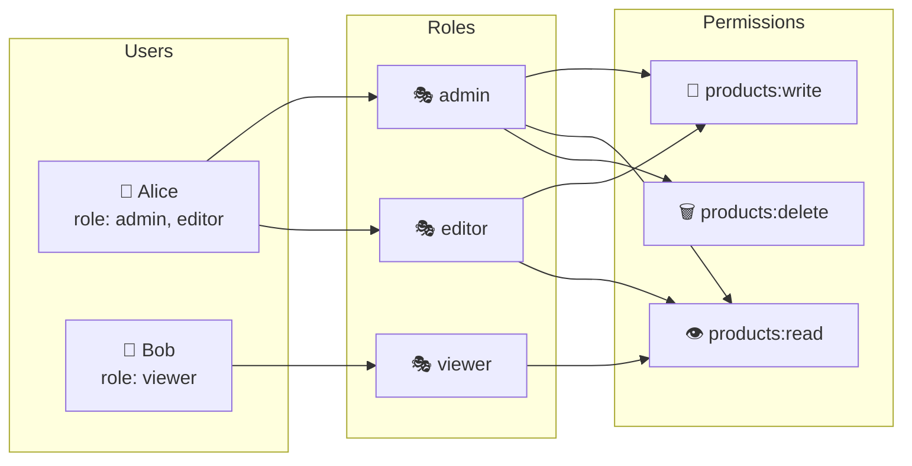

# RBAC, ABAC та ReBAC в ASP.NET Core

::note
«Тільки адміністратори можуть видаляти» — це RBAC. «Тільки автор документа в статусі Draft може редагувати» — це ABAC. «Тільки той, хто є учасником проєкту та має роль Editor у ньому, може коментувати» — це ReBAC. Кожна модель — своя складність та гнучкість.

::

---

## 1. Порівняння трьох моделей

| Характеристика | RBAC | ABAC | ReBAC |
|:---|:---|:---|:---|
| **Що визначає доступ** | Роль користувача | Атрибути суб'єкта + ресурсу + контексту | Відносини між суб'єктом та ресурсом |
| **Виразність** | Низька | Висока | Висока для граф-даних |
| **Складність** | Низька | Висока | Висока |
| **Типові приклади** | admin/user/moderator | Документи, рівні доступу, час | GitHub permissions, Google Drive |
| **Performance** | Швидко (claim lookup) | Середньо (policy eval) | Повільно (граф обхід) |
| **Масштабованість** | Легко | Складніше | Дуже складно без спец. БД |

---

## 2. RBAC: Role-Based Access Control

### Концепція та схема

Найпростіша модель: **роль → дозволи**. Кожен ресурс пов'язаний з множиною операцій, кожна операція вимагає одну або кілька ролей.

::mermaid



::

### Identity + Roles: базова реалізація

```csharp [Program.cs — RBAC з Identity Roles]
builder.Services
    .AddIdentity<AppUser, IdentityRole>(options =>
    {
        // При включенні ролей Claims — роль стає claim у tokens
    })
    .AddEntityFrameworkStores<AppDbContext>()
    .AddDefaultTokenProviders();

// Seed стандартних ролей
app.MapGet("/admin/seed", async (
    RoleManager<IdentityRole> roleManager) =>
{
    var roles = new[] { "admin", "editor", "viewer", "moderator" };

    foreach (var role in roles)
    {
        if (!await roleManager.RoleExistsAsync(role))
            await roleManager.CreateAsync(new IdentityRole(role));
    }

    return Results.Ok("Roles seeded.");
}).RequireAuthorization("admin");
```

```csharp [RBAC Authorization — прості варіанти]
// Варіант 1: RequireRole (inline)
app.MapDelete("/api/products/{id:int}",
    (int id) => Results.NoContent())
    .RequireAuthorization(p => p.RequireRole("admin"));

// Варіант 2: Named Policy
builder.Services.AddAuthorization(options =>
{
    options.AddPolicy("CanDeleteProducts",
        p => p.RequireRole("admin", "super-moderator"));

    options.AddPolicy("CanEditContent",
        p => p.RequireRole("admin", "editor"));

    options.AddPolicy("CanViewOnly",
        p => p.RequireRole("viewer", "editor", "admin"));
});

app.MapPut("/api/products/{id:int}", (int id, UpdateProductRequest req) => /* */)
    .RequireAuthorization("CanEditContent");
```

### Permission-based RBAC (розширений)

Стандартний RBAC через ролі AS.NET Core грубозернистий. Якщо потрібно «Admin може повністю, але Editor лише свої» — потрібен permission-based підхід:

```csharp [Models/Permission.cs — Permissions enum]
[Flags]
public enum Permission : long
{
    None = 0,

    // Products
    ProductRead   = 1L << 0,  // 1
    ProductWrite  = 1L << 1,  // 2
    ProductDelete = 1L << 2,  // 4

    // Orders
    OrderRead     = 1L << 3,  // 8
    OrderWrite    = 1L << 4,  // 16
    OrderDelete   = 1L << 5,  // 32

    // Users
    UserRead      = 1L << 6,  // 64
    UserWrite     = 1L << 7,  // 128
    UserDelete    = 1L << 8,  // 256

    // Роль-набори
    ViewerAll  = ProductRead | OrderRead | UserRead,
    EditorAll  = ViewerAll | ProductWrite | OrderWrite,
    AdminAll   = EditorAll | ProductDelete | OrderDelete | UserWrite | UserDelete
}
```

```csharp [Services/PermissionService.cs]
public class PermissionService
{
    private static readonly Dictionary<string, Permission> RolePermissions = new()
    {
        ["viewer"]    = Permission.ViewerAll,
        ["editor"]    = Permission.EditorAll,
        ["admin"]     = Permission.AdminAll,
        ["moderator"] = Permission.ProductRead | Permission.ProductWrite
                      | Permission.OrderRead
    };

    public Permission GetPermissions(IEnumerable<string> roles)
    {
        var permissions = Permission.None;
        foreach (var role in roles)
        {
            if (RolePermissions.TryGetValue(role, out var rolePerms))
                permissions |= rolePerms;
        }
        return permissions;
    }

    public bool HasPermission(
        IEnumerable<string> roles, Permission required)
        => (GetPermissions(roles) & required) == required;
}
```

```csharp [Security/PermissionRequirement.cs]
using Microsoft.AspNetCore.Authorization;

public class PermissionRequirement : IAuthorizationRequirement
{
    public Permission Permission { get; }

    public PermissionRequirement(Permission permission)
        => Permission = permission;
}

public class PermissionAuthorizationHandler
    : AuthorizationHandler<PermissionRequirement>
{
    private readonly PermissionService _permissionService;

    public PermissionAuthorizationHandler(PermissionService permissionService)
        => _permissionService = permissionService;

    protected override Task HandleRequirementAsync(
        AuthorizationHandlerContext context,
        PermissionRequirement requirement)
    {
        var roles = context.User
            .FindAll(ClaimTypes.Role)
            .Select(c => c.Value);

        if (_permissionService.HasPermission(roles, requirement.Permission))
            context.Succeed(requirement);

        return Task.CompletedTask;
    }
}
```

```csharp [Program.cs — реєстрація Permission system]
builder.Services.AddSingleton<PermissionService>();
builder.Services.AddSingleton<
    IAuthorizationHandler, PermissionAuthorizationHandler>();

builder.Services.AddAuthorization(options =>
{
    // Policy для кожного permission
    options.AddPolicy("ProductDelete",
        p => p.AddRequirements(
            new PermissionRequirement(Permission.ProductDelete)));

    options.AddPolicy("ProductWrite",
        p => p.AddRequirements(
            new PermissionRequirement(Permission.ProductWrite)));
});

// Використання
app.MapDelete("/api/products/{id}", (int id) => Results.NoContent())
    .RequireAuthorization("ProductDelete");
```

---

## 3. ABAC: Attribute-Based Access Control

### Концепція

ABAC оцінює **атрибути** трьох типів:
- **Subject attributes**: хто запитує (роль, відділ, рівень допуску)
- **Resource attributes**: що запитується (статус, власник, тип, рівень чутливості)
- **Environment attributes**: коли/де запитується (час, IP, пристрій)

```
ALLOW IF:
  subject.role == "editor"
  AND resource.status == "draft"
  AND resource.ownerId == subject.id
  OR subject.role == "admin"
```

### Resource-based Authorization в ASP.NET Core

ASP.NET Core підтримує ABAC через `IAuthorizationService` з передачею ресурсу:

```csharp [Security/DocumentOperations.cs — операції на ресурсі]
public static class DocumentOperations
{
    public static OperationAuthorizationRequirement Read   =
        new() { Name = nameof(Read) };
    public static OperationAuthorizationRequirement Edit   =
        new() { Name = nameof(Edit) };
    public static OperationAuthorizationRequirement Delete =
        new() { Name = nameof(Delete) };
    public static OperationAuthorizationRequirement Publish =
        new() { Name = nameof(Publish) };
}
```

```csharp [Models/Document.cs — ресурс з атрибутами]
public class Document
{
    public int     Id          { get; set; }
    public string  Title       { get; set; } = null!;
    public string  Content     { get; set; } = null!;
    public string  OwnerId     { get; set; } = null!;  // UserId
    public string  Status      { get; set; } = "draft"; // draft|review|published
    public string  Department  { get; set; } = null!;   // Відділ
    public bool    IsPublic    { get; set; } = false;
    public string  Sensitivity { get; set; } = "public"; // public|internal|confidential|secret
}
```

```csharp [Security/DocumentAuthorizationHandler.cs — ABAC логіка]
public class DocumentAuthorizationHandler
    : AuthorizationHandler<OperationAuthorizationRequirement, Document>
{
    protected override Task HandleRequirementAsync(
        AuthorizationHandlerContext context,
        OperationAuthorizationRequirement requirement,
        Document document)
    {
        var userId     = context.User.FindFirst(ClaimTypes.NameIdentifier)?.Value;
        var isAdmin    = context.User.IsInRole("admin");
        var userDept   = context.User.FindFirst("department")?.Value;
        var clearance  = context.User.FindFirst("clearance")?.Value ?? "public";
        var isOwner    = document.OwnerId == userId;

        // READ
        if (requirement.Name == DocumentOperations.Read.Name)
        {
            // Публічні — всі можуть читати
            if (document.IsPublic && document.Status == "published")
            {
                context.Succeed(requirement);
                return Task.CompletedTask;
            }

            // Секретні — тільки з відповідним clearance
            if (document.Sensitivity == "secret" && clearance != "secret" && !isAdmin)
            {
                context.Fail(new AuthorizationFailureReason(this,
                    "Insufficient security clearance."));
                return Task.CompletedTask;
            }

            // Конфіденційні — лише свій відділ або admin
            if (document.Sensitivity == "confidential" &&
                userDept != document.Department && !isAdmin)
            {
                context.Fail(new AuthorizationFailureReason(this,
                    "Document belongs to a different department."));
                return Task.CompletedTask;
            }

            context.Succeed(requirement);
            return Task.CompletedTask;
        }

        // EDIT: власник (draft/review) або admin
        if (requirement.Name == DocumentOperations.Edit.Name)
        {
            if (isAdmin)
            {
                context.Succeed(requirement);
                return Task.CompletedTask;
            }

            if (isOwner && document.Status is "draft" or "review")
                context.Succeed(requirement);
            else
                context.Fail(new AuthorizationFailureReason(this,
                    isOwner
                        ? $"Cannot edit document in status '{document.Status}'."
                        : "You are not the owner of this document."));

            return Task.CompletedTask;
        }

        // DELETE: тільки admin або власник у статусі draft
        if (requirement.Name == DocumentOperations.Delete.Name)
        {
            if (isAdmin || (isOwner && document.Status == "draft"))
                context.Succeed(requirement);
            else
                context.Fail(new AuthorizationFailureReason(this,
                    "Insufficient permissions to delete."));

            return Task.CompletedTask;
        }

        // PUBLISH: редактор або адмін, документ у статусі review
        if (requirement.Name == DocumentOperations.Publish.Name)
        {
            if ((isAdmin || context.User.IsInRole("editor")) &&
                document.Status == "review")
                context.Succeed(requirement);
            else
                context.Fail(new AuthorizationFailureReason(this,
                    "Only editors can publish documents in 'review' status."));

            return Task.CompletedTask;
        }

        return Task.CompletedTask;
    }
}
```

```csharp [Program.cs — реєстрація ABAC]
builder.Services.AddScoped<
    IAuthorizationHandler, DocumentAuthorizationHandler>();

builder.Services.AddAuthorization();
```

```csharp [Ендпоінти з ABAC авторизацією]
// Видалення документа (перевіряємо конкретний ресурс)
app.MapDelete("/api/documents/{id:int}",
    async (int id,
           HttpContext ctx,
           AppDbContext db,
           IAuthorizationService authService) =>
{
    var document = await db.Documents.FindAsync(id);
    if (document is null) return Results.NotFound();

    // Передаємо ресурс в AuthorizationService
    var authResult = await authService.AuthorizeAsync(
        ctx.User, document, DocumentOperations.Delete);

    if (!authResult.Succeeded)
    {
        // Розкрити причину відмови (для debugging)
        var reasons = authResult.Failure?.FailureReasons
            .Select(r => r.Message).ToList() ?? [];

        return Results.Json(new
        {
            error   = "Access denied.",
            reasons = reasons
        }, statusCode: 403);
    }

    db.Documents.Remove(document);
    await db.SaveChangesAsync();

    return Results.NoContent();
}).RequireAuthorization();

// Редагування
app.MapPut("/api/documents/{id:int}",
    async (int id, UpdateDocumentRequest req,
           HttpContext ctx, AppDbContext db,
           IAuthorizationService authService) =>
{
    var document = await db.Documents.FindAsync(id);
    if (document is null) return Results.NotFound();

    var authResult = await authService.AuthorizeAsync(
        ctx.User, document, DocumentOperations.Edit);

    if (!authResult.Succeeded)
        return Results.Forbid();

    document.Title   = req.Title;
    document.Content = req.Content;
    await db.SaveChangesAsync();

    return Results.Ok(document);
}).RequireAuthorization();

record UpdateDocumentRequest(string Title, string Content);
```

---

## 4. ReBAC: Relationship-Based Access Control

### Концепція

ReBAC базується на **графі відносин** між суб'єктами та ресурсами. Приклади відносин:

- `user:Alice` → `owner` → `document:42`
- `user:Bob` → `member` → `team:engineering`
- `team:engineering` → `editor` → `project:alpha`
- `project:alpha` → `parent` → `workspace:acme`

Питання авторизації: «Чи має Alice доступ до document:42?» = пошук шляху у графі.

### Модель даних для ReBAC

```csharp [Models/Tuple.cs — відносини (Zanzibar-style)]
/// <summary>
/// Authorization tuple: "resource#relation@user_or_group"
/// Приклад: "document:42#owner@user:alice"
/// </summary>
public class AuthorizationTuple
{
    public Guid   Id           { get; set; } = Guid.NewGuid();

    // Ресурс
    public string ResourceType { get; set; } = null!;  // "document"
    public string ResourceId   { get; set; } = null!;  // "42"

    // Відношення
    public string Relation     { get; set; } = null!;  // "owner", "editor", "viewer"

    // Суб'єкт (може бути user або group)
    public string SubjectType  { get; set; } = null!;  // "user" або "group"
    public string SubjectId    { get; set; } = null!;  // "alice" або "engineering"
    // Якщо SubjectType == "group" → SubjectRelation = відношення в групі
    public string? SubjectRelation { get; set; }       // "member"

    public DateTime CreatedAt  { get; set; } = DateTime.UtcNow;
}
```

```csharp [Services/RebackService.cs — перевірка доступу]
public class RebacService
{
    private readonly AppDbContext _db;
    private readonly ILogger<RebacService> _logger;

    // Дерево дозволів: relation → що воно наслідує
    // "editor" може все, що може "viewer"
    private static readonly Dictionary<string, string[]> RelationHierarchy =
        new()
        {
            ["owner"]  = ["editor", "viewer"],
            ["editor"] = ["viewer"],
            ["viewer"] = []
        };

    public RebacService(AppDbContext db, ILogger<RebacService> logger)
    {
        _db     = db;
        _logger = logger;
    }

    /// <summary>
    /// Перевіряє чи має user доступ до ресурсу з daним відношенням.
    /// Рекурсивно перевіряє через групи та ієрархію відносин.
    /// </summary>
    public async Task<bool> CheckAsync(
        string userId,
        string resourceType,
        string resourceId,
        string requiredRelation,
        int depth = 0)
    {
        if (depth > 10) return false; // Захист від нескінченної рекурсії

        // Всі відносини, що задовольняють required (з урахуванням ієрархії)
        var satisfyingRelations = GetSatisfyingRelations(requiredRelation);

        // Прямий доступ користувача до ресурсу
        var directAccess = await _db.AuthorizationTuples
            .AnyAsync(t =>
                t.ResourceType == resourceType &&
                t.ResourceId   == resourceId &&
                satisfyingRelations.Contains(t.Relation) &&
                t.SubjectType  == "user" &&
                t.SubjectId    == userId);

        if (directAccess) return true;

        // Доступ через групи (непрямий)
        // Знаходимо всі групи де user є членом
        var userGroups = await _db.AuthorizationTuples
            .Where(t => t.SubjectType == "user" && t.SubjectId == userId)
            .Select(t => new { t.ResourceType, t.ResourceId, t.Relation })
            .ToListAsync();

        // Перевіряємо чи будь-яка група має доступ до ресурсу
        foreach (var group in userGroups)
        {
            var groupHasAccess = await _db.AuthorizationTuples
                .AnyAsync(t =>
                    t.ResourceType  == resourceType &&
                    t.ResourceId    == resourceId &&
                    satisfyingRelations.Contains(t.Relation) &&
                    t.SubjectType   == group.ResourceType &&
                    t.SubjectId     == group.ResourceId &&
                    (t.SubjectRelation == null ||
                     t.SubjectRelation == group.Relation));

            if (groupHasAccess) return true;
        }

        return false;
    }

    private static HashSet<string> GetSatisfyingRelations(string required) =>
        new(GetAllRelations(required));

    private static IEnumerable<string> GetAllRelations(string relation)
    {
        yield return relation;
        if (RelationHierarchy.TryGetValue(relation, out var implied))
            foreach (var r in implied)
                foreach (var sub in GetAllRelations(r))
                    yield return sub;
    }
}
```

```csharp [Використання ReBAC у ендпоінтах]
app.MapGet("/api/documents/{id:int}",
    async (int id,
           HttpContext ctx,
           AppDbContext db,
           RebacService rebac) =>
{
    var document = await db.Documents.FindAsync(id);
    if (document is null) return Results.NotFound();

    var userId = ctx.User.FindFirst(ClaimTypes.NameIdentifier)?.Value!;

    // Перевіряємо через граф відносин
    var canView = await rebac.CheckAsync(
        userId, "document", id.ToString(), "viewer");

    if (!canView)
        return Results.Forbid();

    return Results.Ok(document);
}).RequireAuthorization();

// Управління доступом: надати відношення
app.MapPost("/api/documents/{id:int}/permissions",
    async (int id,
           GrantPermissionRequest req,
           HttpContext ctx,
           AppDbContext db,
           RebacService rebac) =>
{
    var userId = ctx.User.FindFirst(ClaimTypes.NameIdentifier)?.Value!;

    // Тільки owner може надавати доступ
    var isOwner = await rebac.CheckAsync(userId, "document", id.ToString(), "owner");
    if (!isOwner) return Results.Forbid();

    var tuple = new AuthorizationTuple
    {
        ResourceType = "document",
        ResourceId   = id.ToString(),
        Relation     = req.Relation,
        SubjectType  = req.SubjectType,
        SubjectId    = req.SubjectId
    };

    db.AuthorizationTuples.Add(tuple);
    await db.SaveChangesAsync();

    return Results.Created();
}).RequireAuthorization();

record GrantPermissionRequest(
    string SubjectType,  // "user" або "group"
    string SubjectId,
    string Relation);    // "viewer", "editor", "owner"
```

---

## 5. ASP.NET Core Policy: єдиний шлюз для всього

ASP.NET Core дозволяє поєднати всі три моделі через власний `IAuthorizationHandler`:

```csharp [Security/CombinedAuthorizationHandler.cs]
// Requirement, що комбінує всі перевірки
public class ResourceActionRequirement : IAuthorizationRequirement
{
    public string ResourceType { get; }
    public string Action       { get; } // "read", "write", "delete"

    public ResourceActionRequirement(string resourceType, string action)
    {
        ResourceType = resourceType;
        Action       = action;
    }
}

// Handler, що перевіряє RBAC, потім ABAC
public class CombinedAuthorizationHandler<TResource>
    : AuthorizationHandler<ResourceActionRequirement, TResource>
    where TResource : class
{
    protected override Task HandleRequirementAsync(
        AuthorizationHandlerContext context,
        ResourceActionRequirement requirement,
        TResource resource)
    {
        // 1. RBAC: admin завжди має доступ
        if (context.User.IsInRole("admin"))
        {
            context.Succeed(requirement);
            return Task.CompletedTask;
        }

        // 2. ABAC: складніша логіка залежно від типу ресурсу та дії
        // (делегувати до відповідних handlers)

        return Task.CompletedTask;
    }
}
```

---

## 6. Порівняльний вибір моделі

### Коли обирати RBAC?

::accordion

::accordion-item{label="✅ RBAC підходить якщо..." icon="i-lucide-check"}

- Є невеликий фіксований набір ролей (admin, manager, user, viewer).
- Правила доступу прості та не залежать від атрибутів ресурсу.
- Команда небольшая, нет потребности в fine-grained дозволах.
- Стартап/MVP: швидка реалізація, легке розуміння.
- Приклади: блог (admin/author/reader), SaaS (owner/admin/member).

::

::accordion-item{label="❌ RBAC не підходить якщо..." icon="i-lucide-x"}

- Потрібно «тільки автор може редагувати свій документ».
- Правила залежать від статусу ресурсу (draft vs published).
- Тисячі комбінацій ролей + ресурсів → «role explosion».

::

::

### Коли обирати ABAC?

::accordion

::accordion-item{label="✅ ABAC підходить якщо..." icon="i-lucide-check"}

- Складні, контекстуальні правила (час, відділ, clearance, статус ресурсу).
- Потрібна тонка гранулярність: той самий ресурс, різні дії, різні умови.
- Регуляторні вимоги (HIPAA, GDPR): залежні від атрибутів даних.
- Приклади: медичні записи, банківські документи, ERP системи.

::

::accordion-item{label="❌ ABAC не підходить якщо..." icon="i-lucide-x"}

- Policy стають надто складними для розуміння та дебагінгу.
- Performance критичний (кожен запит → оцінка складних правил).
- Команда не готова підтримувати складну policy логіку.

::

::

### Коли обирати ReBAC?

::accordion

::accordion-item{label="✅ ReBAC підходить якщо..." icon="i-lucide-check"}

- Дані = граф відносин (проєкти/члени/ресурси: GitHub, Google Docs, Jira).
- Вкладені групи та наслідування (parent team → child team permissions).
- Потрібна «sharing» функціональність (поділитися документом з конкретним юзером).
- Складна ієрархія: workspace → project → folder → document.

::

::accordion-item{label="❌ ReBAC не підходить якщо..." icon="i-lucide-x"}

- Прості правила: надмірна складність.
- Performance критичний: граф-пошук — дороге задоволення.
- Без спеціалізованих БД (Neo4j, або Zanzibar-like системи як OpenFGA).

::

::

---

## 7. OpenFGA: production-ready ReBAC

**OpenFGA** (Open Fine-Grained Authorization) — open-source реалізація Google Zanzibar. Надає high-performance ReBAC як мікросервіс.

```bash
# Запуск OpenFGA через Docker
docker run -d \
  --name openfga \
  -p 8080:8080 \
  openfga/openfga run
```

```csharp [Services/OpenFgaService.cs — інтеграція]
using OpenFga.Sdk.Api;
using OpenFga.Sdk.Client;
using OpenFga.Sdk.Client.Model;

public class OpenFgaService
{
    private readonly OpenFgaApi _fgaClient;
    private readonly string     _storeId;

    public OpenFgaService(IConfiguration config)
    {
        var fgaConfig = new ClientConfiguration
        {
            ApiUrl  = config["OpenFga:ApiUrl"]!,
            StoreId = config["OpenFga:StoreId"]!,
        };
        _fgaClient = new OpenFgaApi(fgaConfig);
        _storeId   = config["OpenFga:StoreId"]!;
    }

    public async Task<bool> CheckAsync(
        string user, string relation, string @object)
    {
        var response = await _fgaClient.Check(
            new ClientCheckRequest
            {
                User     = $"user:{user}",
                Relation = relation,
                Object   = @object  // "document:42"
            });

        return response.Allowed ?? false;
    }

    public async Task WriteAsync(
        string user, string relation, string @object)
    {
        await _fgaClient.WriteTuples(
            new ClientWriteRequest
            {
                Writes = [new ClientTupleKey
                {
                    User     = $"user:{user}",
                    Relation = relation,
                    Object   = @object
                }]
            });
    }
}
```

---

## 8. Практичні завдання

### Рівень 1: Базовий

::accordion

::accordion-item{label="Завдання 15.1: RBAC — Permission-based" icon="i-lucide-circle-help"}

1. Визначте `[Flags] enum Permission` з 6-8 правами для ресурсів
2. `PermissionService.GetPermissions(roles)` — об'єднання ролей через OR
3. `PermissionAuthorizationHandler` та реєстрація 5 named policies
4. 5 ендпоінтів з різними permissions
5. Тест: editor не має `UserDelete` → 403; admin — 200

::

::accordion-item{label="Завдання 15.2: ABAC — Document Authorization" icon="i-lucide-circle-help"}

1. Модель `Document` з `OwnerId`, `Status`, `Department`, `Sensitivity`
2. `DocumentAuthorizationHandler` з логікою для Read, Edit, Delete, Publish
3. Ендпоінти: `GET /docs/{id}`, `PUT /docs/{id}`, `DELETE /docs/{id}`, `POST /docs/{id}/publish`
4. Тест матриця: власник/draft, власник/published, чужий/draft, admin
5. Поверніть meaningful error message при 403 (чому відмовлено)

::

::

### Рівень 2: Проєктування

::accordion

::accordion-item{label="Завдання 15.3: ReBAC — Document Sharing" icon="i-lucide-circle-help"}

1. `AuthorizationTuple` таблиця + `RebacService.CheckAsync`
2. При створенні документа — автоматично додавати tuple `user:X → owner → document:N`
3. `POST /docs/{id}/share {userId, relation}` — поділитися з іншим користувачем
4. `GET /docs/{id}/permissions` — список всіх tuples для документа
5. `DELETE /docs/{id}/permissions/{tupleId}` — відкликати доступ

::

::accordion-item{label="Завдання 15.4: Комбінований підхід" icon="i-lucide-circle-help"}

Реалізуйте гібридну систему: RBAC + ABAC:

1. `admin` → повний доступ (RBAC)
2. `editor` → може редагувати будь-які документи свого відділу (ABAC: department)
3. `viewer` → тільки читання опублікованих документів свого відділу
4. Власник документа → може редагувати свій `draft` незалежно від ролі (ABAC: ownership)
5. Логуйте причину кожного `Fail` для аудиту

::

::

### Рівень 3: Архітектура

::accordion

::accordion-item{label="Завдання 15.5: OpenFGA Integration" icon="i-lucide-circle-help"}

1. Запустіть OpenFGA в Docker
2. Визначте authorization model (`type document, relations { owner, editor, viewer }`)
3. Реалізуйте `OpenFgaService` з Write, Check, ListObjects
4. Замініть кастомний `RebacService` на OpenFGA клієнт
5. Benchmark: порівняйте latency кастомного ReBAC vs OpenFGA для 1000 перевірок

::

::

---

## 9. Резюме

::card-group

::card{title="RBAC — просто та зрозуміло" icon="i-lucide-users"}
Ролі + дозволи. `[Flags] Permission enum` + `PermissionAuthorizationHandler`. Швидко, легко написати і підтримувати. Підходить для більшості SaaS.

::

::card{title="ABAC — правила на атрибутах" icon="i-lucide-sliders"}
`IAuthorizationHandler<TRequirement, TResource>`. Передаємо ресурс у `AuthorizeAsync`. Оцінюємо ownership, status, department, sensitivity.

::

::card{title="ReBAC — граф відносин" icon="i-lucide-git-branch"}
`AuthorizationTuple` таблиця. Рекурсивна перевірка через груп. Для production — OpenFGA або SpiceDB (Google Zanzibar).

::

::card{title="Комбінуй залежно від потреб" icon="i-lucide-layers"}
Не обирай одну модель. Типово: RBAC для ролей + ABAC для resource-specific rules + ReBAC для sharing/collaboration.

::

::

**Далі:** остання стаття серії — **Multi-tenancy та ізоляція даних** — архітектура, де один застосунок обслуговує кількох незалежних клієнтів (tenants) з надійною ізоляцією даних та конфігурацій.
