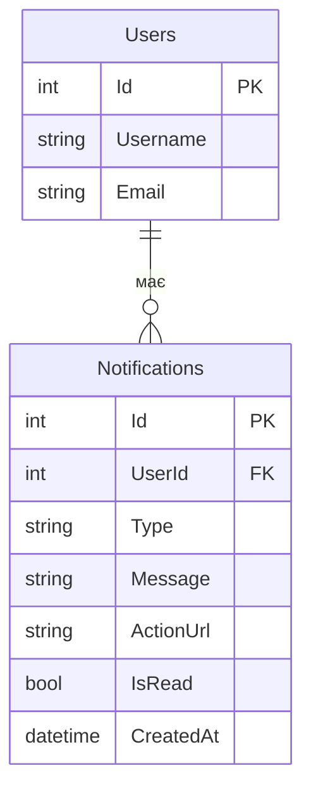
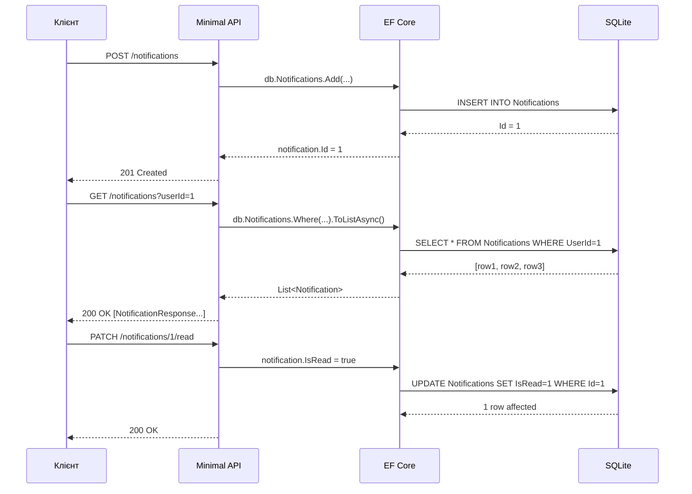

# In-App нотифікації через базу даних

Уявіть типовий момент у соціальній мережі: ви опублікували фотографію, і поки займалися своїми справами, хтось поставив лайк, хтось залишив коментар, а друг надіслав вам запит на дружбу. Коли ви знову відкрили додаток — у правому верхньому куті горить цифра «3». Ви натискаєте на дзвоник і бачите перелік усього, що сталося у ваш відсутність.

Це і є система нотифікацій. Здається, щось магічне — але під капотом усе починається з надзвичайно простої ідеї: **нотифікація — це просто запис у таблиці бази даних**.

У цій статті ми побудуємо саме цей фундамент: базову систему in-app нотифікацій, де клієнт сам питає сервер про нові повідомлення. Це буде наша відправна точка, і в наступних статтях ми будемо покращувати її крок за кроком — аж до систем реального часу.

::note
**Що ми побудуємо:** повноцінний ASP.NET Minimal API проєкт із базою даних SQLite та п'ятьма ендпоінтами для роботи з нотифікаціями. Наприкінці статті ви зможете запустити проєкт і протестувати його через `.http`-файли.
::

## Передумови

Перед початком переконайтеся, що ви знайомі з:

::card-group

::card{title="ASP.NET Minimal API" icon="i-heroicons-server"}
Базова структура проєкту, реєстрація ендпоінтів (`app.MapGet`, `app.MapPost` тощо), впровадження залежностей (Dependency Injection).
::

::card{title="Entity Framework Core" icon="i-heroicons-circle-stack"}
Концепція `DbContext`, визначення сутностей через класи C#, базові CRUD-операції та міграції.
::

::card{title="C# Records та LINQ" icon="i-heroicons-code-bracket"}
Синтаксис `record`-типів для DTO, базові LINQ-запити: `Where`, `OrderBy`, `Select`, `Count`.
::

::

---

## Що таке нотифікація і навіщо вона потрібна

Перш ніж писати код, варто чітко зрозуміти, яку проблему ми вирішуємо.

**Нотифікація (Notification)** — це повідомлення, яке система надсилає користувачу про певну подію, яка стосується його або його контенту.

З точки зору UX (досвіду користувача), нотифікації вирішують критичну задачу: вони дозволяють користувачу бути в курсі подій, **не перебуваючи постійно активним** у застосунку. Без нотифікацій користувач змушений був би постійно оновлювати сторінку власноруч, щоб дізнатися, чи відбулося щось нове.

Типові сценарії використання нотифікацій:

::card-group

::card{title="Соціальні дії" icon="i-heroicons-heart"}
Лайки, коментарі, репости, згадки (`@mention`), нові підписники.
::

::card{title="Комунікація" icon="i-heroicons-chat-bubble-left-right"}
Нові повідомлення в чаті, запити на дружбу, запрошення до груп.
::

::card{title="Системні події" icon="i-heroicons-shield-exclamation"}
Вхід з нового пристрою, зміна пароля, підозріла активність, завершення довгої операції.
::

::card{title="Бізнес-події" icon="i-heroicons-bell"}
Нові замовлення (для продавця), зміна статусу доставки, нарахування бонусів, завершення тріалу.
::

::

---

## Pull Model: «Поп'ятам не ходять»

Підхід, який ми реалізуємо в цій статті, називається **Pull Model** (модель «витягування»). Його суть проста: клієнт (браузер, мобільний застосунок) сам ініціює запит до сервера і «витягує» дані, коли йому це потрібно.

Аналогія: уявіть поштову скриньку біля дому. Листоноша кладе листи в неї, але ви йдете перевіряти скриньку самостійно — коли захочете і скільки разів захочете. Сервер тут — це скринька, клієнт — ви.

```
Клієнт                    Сервер
  |                          |
  |--- GET /notifications --->|
  |                          | (шукає в БД)
  |<-- [list of notifications]|
  |                          |
  ... (пізніше) ...
  |                          |
  |--- GET /notifications --->|
  |<-- [нові notifications] --|
```

**Переваги Pull Model:**

- Проста реалізація — звичайний REST-ендпоінт
- Легка відладка — кожен запит незалежний
- Добре масштабується горизонтально (stateless сервер)

**Недоліки Pull Model:**

- Клієнт дізнається про нову нотифікацію лише коли сам запитає
- Затримка залежить від частоти запитів
- Якщо запитати рідко — дані застарівають; якщо часто — марне навантаження

Ці недоліки ми будемо вирішувати в наступних статтях через Polling, SSE та WebSockets. Але спочатку нам потрібна ця база.

---

## Проєктування бази даних

Серце системи нотифікацій — таблиця `Notifications`. Давайте подумаємо, які поля нам потрібні, перш ніж писати будь-який код.

Кожна нотифікація повинна мати:

- **Унікальний ідентифікатор** — щоб звертатися до конкретного запису
- **Адресата** — для якого користувача ця нотифікація
- **Тип** — що сталося (лайк, коментар, системне повідомлення)
- **Текст** — що саме повідомити
- **Стан прочитання** — чи бачив це користувач
- **Час створення** — коли це сталося (для сортування)

Також зручно зберігати необов'язкове **посилання** — куди перейти при натисканні на нотифікацію (наприклад, на конкретний пост).

::mermaid



::

---

## Структура проєкту

Ось повна структура файлів, яку ми побудуємо:

::code-tree

```csharp [Program.cs]
// Точка входу — реєстрація сервісів та ендпоінтів
```

```csharp [Models/Notification.cs]
// Сутність для EF Core
```

```csharp [Models/AppDbContext.cs]
// DbContext — контекст бази даних
```

```csharp [Models/NotificationDtos.cs]
// DTO-типи для запитів і відповідей
```

```csharp [Endpoints/NotificationEndpoints.cs]
// Всі ендпоінти для нотифікацій
```

```http [notifications.http]
// Тестові HTTP-запити
```

::

---

## Реалізація

### Крок 1: Створення проєкту

::steps

### Ініціалізація проєкту

```bash
dotnet new web -n NotificationsDemo
cd NotificationsDemo
```

### Встановлення залежностей

```bash
dotnet add package Microsoft.EntityFrameworkCore.Sqlite
dotnet add package Microsoft.EntityFrameworkCore.Design
```

Ми використовуємо **SQLite** — легку файлову базу даних, яка не вимагає окремого сервера. Ідеально для навчальних проєктів.

### Перевірка структури

```bash
dotnet run
```

Якщо бачите `Hello World!` або порожню відповідь за `http://localhost:5000` — проєкт налаштований правильно.

::

---

### Крок 2: Визначення моделей

#### Сутність `Notification`

```csharp [Models/Notification.cs]
namespace NotificationsDemo.Models;

// Сутність представляє один рядок у таблиці Notifications
public class Notification
{
    public int Id { get; set; }           // Первинний ключ, EF Core автоматично робить його AUTOINCREMENT
    public int UserId { get; set; }       // До якого користувача належить ця нотифікація
    public string Type { get; set; } = string.Empty;    // "like", "comment", "system" тощо
    public string Message { get; set; } = string.Empty; // Текст нотифікації
    public string? ActionUrl { get; set; }              // Необов'язкове посилання (може бути null)
    public bool IsRead { get; set; }      // false = непрочитана, true = прочитана
    public DateTime CreatedAt { get; set; } = DateTime.UtcNow; // EF Core не авто-встановлює, тому задаємо тут
}
```

Зверніть увагу на кілька деталей:

- `string.Empty` замість `null` для обов'язкових рядкових полів — це захищає від `NullReferenceException` і відображає намір: поле повинно бути заповнене.
- `string? ActionUrl` — знак питання `?` явно вказує, що поле може бути відсутнім (`nullable`). Це частина системи nullable reference types у C# 8+.
- `DateTime.UtcNow` — зберігаємо час у UTC (Coordinated Universal Time). Це стандартна практика для серверних застосунків, адже UTC не залежить від часового поясу сервера.

#### DbContext

```csharp [Models/AppDbContext.cs]
using Microsoft.EntityFrameworkCore;

namespace NotificationsDemo.Models;

public class AppDbContext : DbContext
{
    // Конструктор передає параметри конфігурації базовому класу DbContext
    public AppDbContext(DbContextOptions<AppDbContext> options) : base(options) { }

    // DbSet<Notification> — це "шлюз" до таблиці Notifications у базі даних.
    // Через нього ми виконуємо всі CRUD-операції.
    public DbSet<Notification> Notifications => Set<Notification>();

    protected override void OnModelCreating(ModelBuilder modelBuilder)
    {
        // Явно вказуємо ім'я таблиці (за замовчуванням EF Core використав би "Notifications",
        // але явне завжди краще за неявне)
        modelBuilder.Entity<Notification>().ToTable("Notifications");

        // Індекс на UserId — прискорює запити типу "всі нотифікації для користувача X"
        // Без індексу при великій таблиці база сканує кожен рядок (Full Table Scan)
        modelBuilder.Entity<Notification>()
            .HasIndex(n => n.UserId);

        // Складений індекс (UserId + IsRead) прискорює запит "непрочитані для користувача X"
        modelBuilder.Entity<Notification>()
            .HasIndex(n => new { n.UserId, n.IsRead });
    }
}
```

#### DTO-типи

**DTO (Data Transfer Object)** — це прості об'єкти для передачі даних між клієнтом і сервером. Ми не повертаємо сутності EF Core напряму, бо це може розкрити зайві поля або створити проблеми з серіалізацією.

```csharp [Models/NotificationDtos.cs]
namespace NotificationsDemo.Models;

// Відповідь клієнту: те, що ми хочемо показати
public record NotificationResponse(
    int Id,
    string Type,
    string Message,
    string? ActionUrl,
    bool IsRead,
    DateTime CreatedAt
);

// Запит на створення нотифікації: те, що приймаємо від клієнта (або сервісу)
public record CreateNotificationRequest(
    int UserId,
    string Type,
    string Message,
    string? ActionUrl
);

// Кількість непрочитаних — простий wrapper
public record UnreadCountResponse(int Count);

// Запит на масове створення нотифікацій — надсилаємо багатьом користувачам одразу
public record BulkCreateNotificationRequest(
    int[] UserIds,       // Список адресатів
    string Type,
    string Message,
    string? ActionUrl
);

// Результат масового створення
public record BulkCreateResult(int Created, int[] Ids);
```

Чому `record`, а не `class`? Тип `record` у C# 9+ автоматично генерує `Equals`, `GetHashCode`, `ToString` та підтримує позиційну ініціалізацію через конструктор. Для DTO, які є незмінними об'єктами-значеннями, це ідеальний вибір.

---

### Крок 3: Реєстрація сервісів у `Program.cs`

```csharp [Program.cs]
using Microsoft.EntityFrameworkCore;
using NotificationsDemo.Models;
using NotificationsDemo.Endpoints;

var builder = WebApplication.CreateBuilder(args);

// Реєструємо AppDbContext у контейнері залежностей.
// AddSqlite — зручний extension-метод для SQLite.
// "Data Source=notifications.db" — SQLite зберігає базу у файлі notifications.db
// поруч із виконуваним файлом проєкту.
builder.Services.AddDbContext<AppDbContext>(options =>
    options.UseSqlite("Data Source=notifications.db"));

var app = builder.Build();

// Автоматичне застосування міграцій при старті.
// В продакшені так робити не варто, але для навчального проєкту — зручно.
using (var scope = app.Services.CreateScope())
{
    var db = scope.ServiceProvider.GetRequiredService<AppDbContext>();
    db.Database.EnsureCreated(); // Створює базу, якщо вона не існує
}

// Підключаємо ендпоінти нотифікацій (групуємо в окремий файл для чистоти)
app.MapNotificationEndpoints();

app.Run();
```

`using (var scope = ...)` — ця конструкція потрібна тому, що `AppDbContext` зареєстрований як **Scoped** сервіс (новий екземпляр для кожного HTTP-запиту). Поза HTTP-запитом (наприклад, при старті) потрібно вручну створити scope, в межах якого і отримати сервіс.

---

### Крок 4: Ендпоінти нотифікацій

```csharp [Endpoints/NotificationEndpoints.cs]
using Microsoft.EntityFrameworkCore;
using NotificationsDemo.Models;

namespace NotificationsDemo.Endpoints;

public static class NotificationEndpoints
{
    // Extension-метод — дозволяє викликати app.MapNotificationEndpoints()
    // замість прямого виклику статичного методу. Це поширений патерн у Minimal API.
    public static void MapNotificationEndpoints(this WebApplication app)
    {
        // Групуємо всі ендпоінти під префіксом /notifications
        var group = app.MapGroup("/notifications");

        group.MapGet("/", GetAllNotifications);
        group.MapGet("/unread-count", GetUnreadCount);
        group.MapGet("/{id:int}", GetNotificationById);
        group.MapPost("/", CreateNotification);
        group.MapPost("/bulk", CreateBulkNotifications);
        group.MapPatch("/{id:int}/read", MarkAsRead);
        group.MapPatch("/read-all", MarkAllAsRead);
        group.MapDelete("/{id:int}", DeleteNotification);
    }

    // GET /notifications?userId=1&onlyUnread=true
    private static async Task<IResult> GetAllNotifications(
        AppDbContext db,
        int userId,                 // Обов'язковий query-параметр: /notifications?userId=1
        bool onlyUnread = false,    // Необов'язковий, за замовчуванням false
        int page = 1,
        int pageSize = 20)
    {
        // Формуємо запит поетапно — кожен крок фільтрує або сортує дані
        var query = db.Notifications
            .Where(n => n.UserId == userId); // Завжди фільтруємо за userId

        if (onlyUnread)
            query = query.Where(n => !n.IsRead); // Додатковий фільтр, якщо потрібно

        var notifications = await query
            .OrderByDescending(n => n.CreatedAt) // Найновіші — першими
            .Skip((page - 1) * pageSize)         // Пропускаємо попередні сторінки
            .Take(pageSize)                       // Беремо лише pageSize записів
            .Select(n => new NotificationResponse( // Проєктуємо сутність у DTO
                n.Id, n.Type, n.Message, n.ActionUrl, n.IsRead, n.CreatedAt))
            .ToListAsync();

        return Results.Ok(notifications);
    }

    // GET /notifications/unread-count?userId=1
    private static async Task<IResult> GetUnreadCount(AppDbContext db, int userId)
    {
        var count = await db.Notifications
            .CountAsync(n => n.UserId == userId && !n.IsRead);

        // Повертаємо об'єкт, а не просто число — для консистентності JSON-відповідей
        return Results.Ok(new UnreadCountResponse(count));
    }

    // GET /notifications/5
    private static async Task<IResult> GetNotificationById(AppDbContext db, int id)
    {
        var notification = await db.Notifications.FindAsync(id);

        if (notification is null)
            return Results.NotFound(new { message = $"Нотифікацію з Id={id} не знайдено." });

        return Results.Ok(new NotificationResponse(
            notification.Id, notification.Type, notification.Message,
            notification.ActionUrl, notification.IsRead, notification.CreatedAt));
    }

    // POST /notifications
    private static async Task<IResult> CreateNotification(
        AppDbContext db,
        CreateNotificationRequest request)
    {
        var notification = new Notification
        {
            UserId = request.UserId,
            Type = request.Type,
            Message = request.Message,
            ActionUrl = request.ActionUrl,
            IsRead = false,       // Нова нотифікація завжди непрочитана
            CreatedAt = DateTime.UtcNow
        };

        db.Notifications.Add(notification);
        await db.SaveChangesAsync(); // Зберігаємо зміни в БД; після цього notification.Id заповниться

        // 201 Created з посиланням на новий ресурс — стандарт REST
        return Results.Created($"/notifications/{notification.Id}",
            new NotificationResponse(
                notification.Id, notification.Type, notification.Message,
                notification.ActionUrl, notification.IsRead, notification.CreatedAt));
    }

    // POST /notifications/bulk
    // Масова розсилка — одна нотифікація надсилається одразу кільком користувачам.
    // Приклад: системне оголошення для 500 підписників, акційна пропозиція для групи,
    // сповіщення «новий пост від автора, на якого ви підписані».
    private static async Task<IResult> CreateBulkNotifications(
        AppDbContext db,
        BulkCreateNotificationRequest request)
    {
        if (request.UserIds.Length == 0)
            return Results.BadRequest(new { message = "Список UserIds не може бути порожнім." });

        // Обмежуємо розмір пакету — захист від зловживань і переповнення пам'яті.
        // При потребі відправити більше — клієнт повинен розбити на пакети.
        if (request.UserIds.Length > 1000)
            return Results.BadRequest(new { message = "Максимум 1000 одержувачів за один запит." });

        // Створюємо об'єкти нотифікацій у пам'яті для кожного userId.
        // Це швидка операція — просто ініціалізація об'єктів C#, без звернень до БД.
        var now = DateTime.UtcNow; // Фіксуємо час один раз для всіх нотифікацій
        var notifications = request.UserIds
            .Distinct()           // Видаляємо дублікати userId на випадок помилки на клієнті
            .Select(userId => new Notification
            {
                UserId = userId,
                Type = request.Type,
                Message = request.Message,
                ActionUrl = request.ActionUrl,
                IsRead = false,
                CreatedAt = now
            })
            .ToList();

        // AddRange — передаємо всі об'єкти одночасно.
        // EF Core зберігає їх у Change Tracker і при SaveChangesAsync
        // вставляє ОДНИМ батч-запитом (INSERT INTO ... VALUES (...), (...), (...)).
        //
        // Порівняйте з неефективним варіантом у циклі:
        // ❌  foreach (var n in notifications) { db.Add(n); await db.SaveChangesAsync(); }
        //     → N окремих INSERT-запитів, N round-trips до бази даних
        //
        // ✅  db.Notifications.AddRange(notifications); await db.SaveChangesAsync();
        //     → 1 батч INSERT (SQLite підтримує до ~999 параметрів; для більших обсягів
        //       EF Core автоматично розбиває на кілька батчів)
        db.Notifications.AddRange(notifications);
        await db.SaveChangesAsync();

        // Після SaveChangesAsync EF Core заповнює Id кожного об'єкта
        var createdIds = notifications.Select(n => n.Id).ToArray();

        return Results.Created("/notifications/bulk",
            new BulkCreateResult(notifications.Count, createdIds));
    }

    // PATCH /notifications/5/read
    private static async Task<IResult> MarkAsRead(AppDbContext db, int id)
    {
        var notification = await db.Notifications.FindAsync(id);

        if (notification is null)
            return Results.NotFound(new { message = $"Нотифікацію з Id={id} не знайдено." });

        if (notification.IsRead)
            return Results.Ok(new { message = "Нотифікація вже позначена як прочитана." });

        notification.IsRead = true;
        await db.SaveChangesAsync();

        return Results.Ok(new { message = "Нотифікацію позначено як прочитану." });
    }

    // PATCH /notifications/read-all?userId=1
    private static async Task<IResult> MarkAllAsRead(AppDbContext db, int userId)
    {
        // ExecuteUpdateAsync — ефективніший спосіб масового оновлення:
        // генерує один SQL UPDATE замість завантаження всіх сутностей у пам'ять
        var updated = await db.Notifications
            .Where(n => n.UserId == userId && !n.IsRead)
            .ExecuteUpdateAsync(s => s.SetProperty(n => n.IsRead, true));

        return Results.Ok(new { message = $"Позначено {updated} нотифікацій як прочитані." });
    }

    // DELETE /notifications/5
    private static async Task<IResult> DeleteNotification(AppDbContext db, int id)
    {
        var notification = await db.Notifications.FindAsync(id);

        if (notification is null)
            return Results.NotFound(new { message = $"Нотифікацію з Id={id} не знайдено." });

        db.Notifications.Remove(notification);
        await db.SaveChangesAsync();

        return Results.NoContent(); // 204 No Content — стандартна відповідь на успішне видалення
    }
}
```

Розберемо ключові рішення в цьому файлі:

**Метод `ExecuteUpdateAsync`** (у `MarkAllAsRead`) — це важливий інструмент EF Core 7+. Порівняйте два підходи:

```csharp
// ❌ Неефективно: завантажує всі нотифікації у пам'ять, потім генерує N UPDATE-запитів
var notifications = await db.Notifications
    .Where(n => n.UserId == userId && !n.IsRead)
    .ToListAsync();
foreach (var n in notifications)
    n.IsRead = true;
await db.SaveChangesAsync();

// ✅ Ефективно: один SQL UPDATE WHERE userId = X AND IsRead = 0
await db.Notifications
    .Where(n => n.UserId == userId && !n.IsRead)
    .ExecuteUpdateAsync(s => s.SetProperty(n => n.IsRead, true));
```

Перший варіант при 1000 непрочитаних нотифікаціях виконає 1 SELECT та 1000 UPDATE. Другий — завжди лише 1 запит.

**PATCH замість PUT** для позначення як прочитаного: `PATCH` використовується для часткового оновлення ресурсу (лише поле `IsRead`), тоді як `PUT` замінює ресурс повністю. Це семантично правильніший вибір згідно з REST.

---

### Крок 5: Тестування

Створіть файл `notifications.http` у корені проєкту для тестування через REST Client (розширення VS Code або вбудована підтримка Rider):

```http [notifications.http]
### Змінні
@baseUrl = http://localhost:5000
@userId = 1

### 1. Створити першу нотифікацію
POST {{baseUrl}}/notifications
Content-Type: application/json

{
  "userId": {{userId}},
  "type": "like",
  "message": "Олена поставила лайк на вашу фотографію",
  "actionUrl": "/posts/42"
}

###

### 2. Ще одна нотифікація — коментар
POST {{baseUrl}}/notifications
Content-Type: application/json

{
  "userId": {{userId}},
  "type": "comment",
  "message": "Іван прокоментував: \"Чудове фото!\"",
  "actionUrl": "/posts/42#comment-7"
}

###

### 3. Системна нотифікація без посилання
POST {{baseUrl}}/notifications
Content-Type: application/json

{
  "userId": {{userId}},
  "type": "system",
  "message": "Ваш обліковий запис успішно верифіковано"
}

###

### 4. Отримати всі нотифікації користувача
GET {{baseUrl}}/notifications?userId={{userId}}

###

### 5. Отримати тільки непрочитані
GET {{baseUrl}}/notifications?userId={{userId}}&onlyUnread=true

###

### 6. Перевірити кількість непрочитаних (для значка "дзвоника")
GET {{baseUrl}}/notifications/unread-count?userId={{userId}}

###

### 7. Позначити нотифікацію #1 як прочитану
PATCH {{baseUrl}}/notifications/1/read

###

### 8. Перевірити: тепер непрочитаних має бути 2
GET {{baseUrl}}/notifications/unread-count?userId={{userId}}

###

### 9. Позначити всі як прочитані
PATCH {{baseUrl}}/notifications/read-all?userId={{userId}}

###

### 10. Тепер лічильник має бути 0
GET {{baseUrl}}/notifications/unread-count?userId={{userId}}

###

### 11. Видалити нотифікацію #2
DELETE {{baseUrl}}/notifications/2

###

### 12. Спробувати отримати видалену — має бути 404
GET {{baseUrl}}/notifications/2

###

### 13. Масова нотифікація для кількох користувачів одразу
# Відправляємо системне оголошення одночасно для userId 1, 2 і 3
POST {{baseUrl}}/notifications/bulk
Content-Type: application/json

{
  "userIds": [1, 2, 3],
  "type": "system",
  "message": "Сайт буде недоступний 25 березня з 02:00 до 04:00 для планового обслуговування",
  "actionUrl": null
}

###

### 14. Перевірити: у userId=2 тепер є нотифікація
GET {{baseUrl}}/notifications?userId=2

###

### 15. Спроба масового надсилання із порожнім списком — має бути 400
POST {{baseUrl}}/notifications/bulk
Content-Type: application/json

{
  "userIds": [],
  "type": "system",
  "message": "Тест"
}
```

Запустіть проєкт та виконайте запити по порядку. Ви побачите, як нотифікації створюються, фільтруються і видаляються.

---

## Архітектура системи

Ось як взаємодіють компоненти нашої системи:

::mermaid



::

---

## Обмеження поточного підходу

Ми побудували робочу систему нотифікацій, але вона має суттєвий недолік, який ви, мабуть, вже помітили: **клієнт ніколи не дізнається про нові нотифікації автоматично**. Він побачить їх лише коли сам надішле запит.

Уявіть наступний сценарій: користувач відкрив ваш застосунок та дивиться на стрічку. За цей час хтось поставив йому 5 лайків. А лічильник «дзвоника» так і показує «0» — бо новий запит ніхто не зробив.

::warning
**Pull Model і UX**: у реальних застосунках нотифікації з'являються в лічильнику «майже одразу» після події. Якщо ваш застосунок оновлює лічильник лише при перевантаженні сторінки — це поганий UX, який дратує користувачів.
::

Саме тут народжується необхідність у **Polling** — автоматичному регулярному запиті оновлень. Це перший крок до «живого» інтерфейсу, і він є темою наступної статті.

---

## Практичні завдання

### Рівень 1 — Базовий

**Завдання 1.1:** Запустіть проєкт і виконайте всі 12 тестових запитів із файлу `notifications.http` по порядку. Переконайтеся, що кожен запит повертає очікуваний результат.

**Завдання 1.2:** Знайдіть у коді місце, де генерується `DateTime.UtcNow`, і замініть його на `DateTimeOffset.UtcNow`. Оновіть тип поля в моделі та DTO. Поясніть, у чому різниця між `DateTime` та `DateTimeOffset`.

### Рівень 2 — Логіка

**Завдання 2.1:** Додайте ендпоінт `GET /notifications/stats?userId=1`, який повертає статистику: загальна кількість нотифікацій, кількість непрочитаних, розбивка за типами (`like`: 5, `comment`: 3, `system`: 1).

**Завдання 2.2:** Додайте пагінацію до відповіді `GET /notifications` — поверніть не просто список, а об'єкт `{ items: [...], total: N, page: 1, pageSize: 20, hasMore: bool }`.

**Завдання 2.3:** Зараз `POST /notifications/bulk` приймає один і той самий `Message` для всіх. Розширте `BulkCreateNotificationRequest` так, щоб можна було передати **індивідуальне** повідомлення для кожного userId: `[{ userId: 1, message: "...", actionUrl: "..." }, ...]`. Перепишіть ендпоінт відповідно.

### Рівень 3 — Архітектура

**Завдання 3.1:** Реалізуйте **масове видалення** (`DELETE /notifications?userId=1&olderThan=30d`) — видаляє всі нотифікації користувача, старші за вказану кількість днів. Використайте `ExecuteDeleteAsync` для ефективного SQL DELETE.

**Завдання 3.2:** Додайте **валідацію** для `CreateNotificationRequest`: поле `Type` повинно бути одним із дозволених значень (`like`, `comment`, `follow`, `system`, `security`); `Message` не може бути порожнім або довшим за 500 символів; `UserId` має бути > 0. Поверніть зрозуміле повідомлення про помилку при порушенні.

---

## Підсумок

У цій статті ми заклали фундамент системи нотифікацій:

- Розібралися, що таке Pull Model і чому це найпростіший підхід
- Спроєктували таблицю `Notifications` з правильними індексами
- Реалізували повний CRUD для нотифікацій у ASP.NET Minimal API
- Додали `POST /notifications/bulk` для масового створення за допомогою `AddRange` + один батч INSERT
- Використали `ExecuteUpdateAsync` для ефективного масового оновлення
- Протестували систему через `.http`-файли

Ключовий висновок: Pull Model проста у реалізації, але має затримку — клієнт дізнається про нові події лише при наступному запиті. У наступній статті ми вирішимо це через **Polling** — механізм автоматичного регулярного запиту оновлень.
