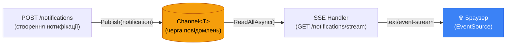

# Server-Sent Events: Однострімовий push від сервера

У попередній статті ми бачили, що Long Polling вирішує проблему «холостих» запитів, але все одно залишається Pull Model: клієнт ініціює кожне з'єднання, навіть якщо воно тривале. Сервер пасивно чекає і відповідає лише коли клієнт питає.

Але що, якщо ми могли б перевернути цю модель? Що якщо клієнт відкриє **одне з'єднання** і сервер сам надсилатиме нові події через нього — стільки разів, скільки потрібно, без жодних додаткових запитів?

Саме це й роблять **Server-Sent Events** (SSE). Це стандарт W3C, вбудований у всі сучасні браузери, який дозволяє серверу відкрити «живий канал» до клієнта і надсилати повідомлення коли завгодно.

::note
**Що ми побудуємо:** SSE-ендпоінт у ASP.NET Minimal API, розподілена система повідомлень між потоками через `Channel<T>`, та оновлену HTML-сторінку з нативним `EventSource` API.
::

---

## Що таке SSE і як він відрізняється від Polling

Уявіть аналогію: Long Polling — це коли ви телефонуєте на гарячу лінію магазину кожні 30 хвилин і питаєте «Чи є вже мій товар?». SSE — це коли ви залишаєте свій номер і магазин сам передзвонює вам, щойно товар з'явиться.

З технічної точки зору, SSE — це звичайний HTTP-запит методом `GET`, але замість того щоб відповідь завершилася одразу, з'єднання залишається відкритим. Сервер може надсилати дані в це відкрите з'єднання будь-коли, а клієнт отримує їх у режимі реального часу.

```
Клієнт                                  Сервер
  |--- GET /notifications/stream -------->|
  |                                       | (з'єднання відкрите)
  |<--- data: {"type":"like",...} --------|  ← подія 1 (через 5 хвилин)
  |                                       |
  |<--- data: {"type":"comment",...} -----|  ← подія 2 (ще через 2 хвилини)
  |                                       |
  |<--- data: {"type":"system",...} ------|  ← подія 3
  |                                       |
  ... з'єднання залишається відкритим ...
```

Порівняйте з Long Polling:

```
Long Polling:  Клієнт → Сервер (чекає) → відповідь → Клієнт → Сервер (чекає) → ...
SSE:           Клієнт → Сервер (одне з'єднання) ←←←← події надходять ←←←←←←←
```

При SSE між отриманням подій відкривається **нуль** нових з'єднань. Одне з'єднання — і всі події через нього.

---

## Формат SSE-протоколу

SSE — це текстовий протокол. Кожна подія — це набір рядків із двокрапкою-роздільником, відокремлених порожнім рядком:

```
data: Hello, World!\n\n
```

Для складних повідомлень — об'єкт JSON в одному рядку `data:`:

```
data: {"type":"like","message":"Олена поставила лайк"}\n\n
```

Повний набір полів події:

::field-group

::field{name="data" type="string" required="true"}
Вміст повідомлення. Якщо потрібно передати JSON — серіалізуйте в рядок. Підтримує багаторядкові значення: кожен рядок даних починається окремим `data:`.
::

::field{name="event" type="string"}
Назва типу події. Клієнт може підписатися на конкретні типи замість слухання всіх. За замовчуванням: `message`.
::

::field{name="id" type="string"}
Унікальний ідентифікатор події. Браузер зберігає його й передає у заголовку `Last-Event-ID` при перепідключенні.
::

::field{name="retry" type="number"}
Часовий інтервал у мілісекундах між спробами перепідключення при обриві. За замовчуванням: 3000мс.
::

::

Приклад повідомлення з усіма полями:

```
id: 42
event: notification
retry: 5000
data: {"type":"like","message":"Олена поставила лайк на вашу фотографію"}

```

Важливо: **дві порожні рядки** після `data:` означають кінець події. Саме так браузер розуміє, що подія завершена і її можна обробити.

---

## Архітектура SSE-системи

Тут виникає цікава технічна задача: HTTP-запит і нові записи в базі даних живуть у **різних потоках** (threads). Запит обробляється в одному async-потоці, а нова нотифікація може з'явитися від будь-якої дії в іншій частині системи.

Нам потрібен механізм для передачі повідомлень між потоками. В .NET for this ідеально підходить `System.Threading.Channels.Channel<T>` — потокобезпечна черга з підтримкою async.

::mermaid



::

Ідея:
1. Коли хтось створює нотифікацію (`POST /notifications`) — ми кладемо її в `Channel<T>`
2. SSE-ендпоінт(`GET /notifications/stream`) читає з `Channel<T>` і надсилає клієнту

---

## Реалізація

### Крок 1: Сервіс розподілу подій

Створимо сервіс, який управляє каналами для кожного користувача:

```csharp [Services/NotificationBroadcaster.cs]
using System.Threading.Channels;
using NotificationsDemo.Models;

namespace NotificationsDemo.Services;

// Singleton-сервіс: один екземпляр на весь час роботи застосунку.
// Зберігає Channel<T> для кожного підключеного SSE-клієнта.
public class NotificationBroadcaster
{
    // Ключ — userId, значення — список каналів цього користувача
    // (один користувач може мати кілька вкладок відкритих)
    private readonly Dictionary<int, List<Channel<NotificationResponse>>> _userChannels = new();

    // Lock для thread-safety при модифікації словника
    private readonly Lock _lock = new();

    // Реєструємо новий SSE-клієнт і повертаємо його канал
    public Channel<NotificationResponse> Subscribe(int userId)
    {
        // Bounded channel: якщо клієнт не встигає читати — буфер до 100 повідомлень
        // після чого нові будуть відхилені (щоб не переповнити пам'ять)
        var channel = Channel.CreateBounded<NotificationResponse>(new BoundedChannelOptions(100)
        {
            FullMode = BoundedChannelFullMode.DropOldest // Витісняємо старі, якщо повний
        });

        lock (_lock)
        {
            if (!_userChannels.ContainsKey(userId))
                _userChannels[userId] = new List<Channel<NotificationResponse>>();

            _userChannels[userId].Add(channel);
        }

        return channel;
    }

    // Відписуємо клієнта (з'єднання завершилося)
    public void Unsubscribe(int userId, Channel<NotificationResponse> channel)
    {
        lock (_lock)
        {
            if (_userChannels.TryGetValue(userId, out var channels))
            {
                channels.Remove(channel);
                if (channels.Count == 0)
                    _userChannels.Remove(userId);
            }
        }

        // Завершуємо writer — це сигналізує reader-у, що більше даних не буде
        channel.Writer.TryComplete();
    }

    // Надсилаємо нотифікацію всім активним SSE-з'єднанням користувача
    public void Broadcast(int userId, NotificationResponse notification)
    {
        List<Channel<NotificationResponse>>? channels;

        lock (_lock)
        {
            if (!_userChannels.TryGetValue(userId, out channels))
                return; // Немає активних SSE-клієнтів для цього userId
            channels = new List<Channel<NotificationResponse>>(channels); // Копія для безпечної ітерації
        }

        foreach (var channel in channels)
        {
            // TryWrite — не блокує; якщо канал повний — подія буде відхилена (DropOldest)
            channel.Writer.TryWrite(notification);
        }
    }
}
```

### Крок 2: Реєстрація сервісу

```csharp [Program.cs]
using NotificationsDemo.Services;

// Реєструємо як Singleton — один екземпляр зберігає стан усіх підключень
builder.Services.AddSingleton<NotificationBroadcaster>();
```

### Крок 3: SSE-ендпоінт

Додайте до `NotificationEndpoints.cs`:

```csharp [Endpoints/NotificationEndpoints.cs]
// Додайте в MapNotificationEndpoints():
group.MapGet("/stream", StreamNotifications);
```

```csharp [Endpoints/NotificationEndpoints.cs]
// GET /notifications/stream?userId=1
private static async Task StreamNotifications(
    HttpContext context,
    NotificationBroadcaster broadcaster,
    int userId,
    CancellationToken cancellationToken)
{
    // Встановлюємо правильні заголовки для SSE
    context.Response.Headers.Append("Content-Type", "text/event-stream");
    context.Response.Headers.Append("Cache-Control", "no-cache");
    context.Response.Headers.Append("X-Accel-Buffering", "no"); // Для nginx: вимикаємо буферизацію

    // Підписуємося — отримуємо канал для цього клієнта
    var channel = broadcaster.Subscribe(userId);

    try
    {
        // Надсилаємо перше повідомлення — "привіт" щоб клієнт знав, що з'єднання встановлено
        await context.Response.WriteAsync("data: {\"type\":\"connected\"}\n\n", cancellationToken);
        await context.Response.Body.FlushAsync(cancellationToken); // Flush обов'язковий!

        // Читаємо повідомлення з каналу й надсилаємо клієнту
        // ReadAllAsync повертає IAsyncEnumerable — завершується коли channel.Writer.Complete() викликано
        await foreach (var notification in channel.Reader.ReadAllAsync(cancellationToken))
        {
            // Серіалізуємо нотифікацію в JSON
            var json = System.Text.Json.JsonSerializer.Serialize(notification,
                new System.Text.Json.JsonSerializerOptions { PropertyNamingPolicy = System.Text.Json.JsonNamingPolicy.CamelCase });

            // Формат SSE: "data: <json>\n\n"
            // Два символи \n обов'язкові — це роздільник між подіями в SSE-протоколі
            await context.Response.WriteAsync($"data: {json}\n\n", cancellationToken);
            await context.Response.Body.FlushAsync(cancellationToken);
        }
    }
    catch (OperationCanceledException)
    {
        // Клієнт закрив вкладку або від'єднався — це нормальна ситуація
    }
    finally
    {
        // Завжди відписуємося, щоб видалити канал зі словника
        broadcaster.Unsubscribe(userId, channel);
    }
}
```

Розберемо ключові моменти:

**`FlushAsync()`** — критично важливий виклик. HTTP передає дані буферами для оптимізації мережного трафіку. Без явного `Flush` сервер накопичуватиме байти у внутрішньому буфері і не надсилатиме їх клієнту, поки буфер не заповниться або з'єднання не закриється. При SSE нам потрібна миттєва доставка кожної події.

**`await foreach`** з `IAsyncEnumerable` — елегантний спосіб читати з async-джерела. `ReadAllAsync()` повертає `IAsyncEnumerable<T>`, тобто ми ітеруємося по повідомленнях асинхронно, без блокування потоку між ними.

### Крок 4: Broadcast при створенні нотифікації

Тепер оновимо ендпоінт `CreateNotification`, щоб він також надсилав нотифікацію через SSE:

```csharp [Endpoints/NotificationEndpoints.cs]
// Оновлена сигнатура — додаємо NotificationBroadcaster
private static async Task<IResult> CreateNotification(
    AppDbContext db,
    NotificationBroadcaster broadcaster, // Отримуємо через DI
    CreateNotificationRequest request)
{
    var notification = new Notification
    {
        UserId = request.UserId,
        Type = request.Type,
        Message = request.Message,
        ActionUrl = request.ActionUrl,
        IsRead = false,
        CreatedAt = DateTime.UtcNow
    };

    db.Notifications.Add(notification);
    await db.SaveChangesAsync();

    var response = new NotificationResponse(
        notification.Id, notification.Type, notification.Message,
        notification.ActionUrl, notification.IsRead, notification.CreatedAt);

    // Надсилаємо нотифікацію всім активним SSE-клієнтам цього користувача
    // Це синхронний виклик (TryWrite не блокує)
    broadcaster.Broadcast(notification.UserId, response);

    return Results.Created($"/notifications/{notification.Id}", response);
}
```

### Крок 5: Клієнтська сторона з EventSource

Оновимо `wwwroot/index.html`, замінивши секцію Long Polling на SSE:

```html [wwwroot/index.html]
<!DOCTYPE html>
<html lang="uk">
<head>
    <meta charset="UTF-8">
    <title>Нотифікації — SSE Demo</title>
    <style>
        body { font-family: sans-serif; max-width: 700px; margin: 40px auto; padding: 0 20px; }
        #badge { display: inline-block; background: #ef4444; color: white;
                 border-radius: 50%; width: 24px; height: 24px; text-align: center;
                 line-height: 24px; font-size: 14px; font-weight: bold; }
        #badge.zero { background: #94a3b8; }
        #status { font-size: 13px; margin: 4px 0; }
        #status.connected { color: #16a34a; }
        #status.disconnected { color: #dc2626; }
        .controls { display: flex; gap: 10px; margin: 16px 0; }
        button { padding: 8px 16px; border-radius: 6px; border: none; cursor: pointer;
                 background: #3b82f6; color: white; }
        button.stop { background: #ef4444; }
        #notifications { margin-top: 20px; }
        .notification-item { padding: 10px; border-left: 3px solid #3b82f6;
                              margin-bottom: 8px; background: #f8fafc; border-radius: 0 4px 4px 0; }
        .notification-item.unread { border-left-color: #ef4444; font-weight: bold; }
    </style>
</head>
<body>
    <h1>🔔 <span id="badge" class="zero">0</span> непрочитаних</h1>
    <p id="status" class="disconnected">● Відключено</p>

    <div class="controls">
        <button onclick="connect()">Підключитися (SSE)</button>
        <button class="stop" onclick="disconnect()">Відключитися</button>
    </div>

    <div id="notifications"></div>

    <script>
        const USER_ID = 1;
        let eventSource = null;     // Зберігаємо посилання на EventSource
        let unreadCount = 0;

        function connect() {
            if (eventSource) return; // Вже підключені

            // EventSource — вбудований браузерний API для SSE.
            // Автоматично: встановлює з'єднання, перепідключається при розриві,
            // передає Last-Event-ID при перепідключенні.
            eventSource = new EventSource(`/notifications/stream?userId=${USER_ID}`);

            // Стандартний обробник — викликається для подій без імені
            eventSource.onmessage = (event) => {
                const notification = JSON.parse(event.data);

                // Перша подія — підтвердження з'єднання від сервера
                if (notification.type === 'connected') return;

                addNotificationToUI(notification);
                unreadCount++;
                updateBadge();
            };

            // Подія відкриття з'єднання
            eventSource.onopen = () => {
                const status = document.getElementById('status');
                status.textContent = '● Підключено';
                status.className = 'connected';
            };

            // Подія помилки — браузер автоматично спробує перепідключитися
            eventSource.onerror = () => {
                const status = document.getElementById('status');
                status.textContent = '● Помилка з\'єднання, перепідключення...';
                status.className = 'disconnected';
            };
        }

        function disconnect() {
            if (!eventSource) return;
            eventSource.close(); // Закриваємо з'єднання
            eventSource = null;
            document.getElementById('status').textContent = '● Відключено';
            document.getElementById('status').className = 'disconnected';
        }

        function addNotificationToUI(notification) {
            const container = document.getElementById('notifications');
            const el = document.createElement('div');
            el.className = 'notification-item unread';
            el.innerHTML = `
                <strong>${notification.type}</strong>: ${notification.message}
                <br><small>${new Date(notification.createdAt).toLocaleTimeString('uk-UA')}</small>
            `;
            container.prepend(el); // Нові — зверху
        }

        function updateBadge() {
            const badge = document.getElementById('badge');
            badge.textContent = unreadCount;
            badge.className = unreadCount === 0 ? 'zero' : '';
        }
    </script>
</body>
</html>
```

Відкрийте сторінку у двох вкладках та підключіться в обох. Тепер відправте `POST /notifications` — ви побачите, як нотифікація миттєво з'явилась у **обох** вкладках без жодного додаткового запиту від клієнта.

---

## Переваги та обмеження SSE

::card-group

::card{title="✅ Переваги SSE" icon="i-heroicons-check-circle"}
- **Вбудований у браузер**: `EventSource` — нативний API, без бібліотек
- **Автоматичне перепідключення**: браузер сам відновлює з'єднання при обриві
- **`Last-Event-ID`**: при перепідключенні браузер передає ID останньої отриманої події — сервер може відправити пропущені
- **HTTP/2 мультиплексування**: кілька SSE-стрімів на одне TCP-з'єднання
- **Проходить через проксі**: звичайний HTTP, немає проблем з firewall
::

::card{title="❌ Обмеження SSE" icon="i-heroicons-x-circle"}
- **Лише server→client**: клієнт не може надсилати дані через SSE-з'єднання (для цього потрібен окремий POST)
- **Лише текст**: бінарні дані не підтримуються (але JSON у тексті — цілком)
- **Ліміт з'єднань**: браузери обмежують кількість SSE-з'єднань на домен (HTTP/1.1: 6, HTTP/2: практично необмежено)
- **Немає двостороннього зв'язку**: для чату або ігор потрібні WebSockets
::

::

---

## Порівняння підходів

| Характеристика | Short Polling | Long Polling | SSE |
|---|---|---|---|
| Модель | Pull | Pull | Push |
| Кількість з'єднань | N (постійно нові) | N (переоткривається) | 1 (постійне) |
| Затримка | До N секунд | Майже 0 | Майже 0 |
| Навантаження при відсутності подій | Постійне | Мінімальне | Нульове |
| Напрямок | → | → | ←←← |
| Підтримка браузера | Будь-який | Будь-який | IE11- |
| Складність реалізації | ★☆☆ | ★★☆ | ★★☆ |

SSE — це ідеальне рішення коли потрібна лише **доставка подій від сервера до клієнта** і двостороння комунікація не потрібна. Він значно простіший за WebSockets, але набагато ефективніший за будь-який Polling.

---

## Підсумок

Server-Sent Events — перехід від Pull до Push моделі. Клієнт відкриває одне з'єднання, і сервер надсилає події через нього коли завгодно:

- Реалізували `NotificationBroadcaster` — thread-safe розподільник подій через `Channel<T>`
- Реалізували SSE-ендпоінт із `text/event-stream` та `IAsyncEnumerable`
- Оновили `POST /notifications` для миттєвого broadcast через SSE
- Використали нативний `EventSource` API у браузері

Залишився один невирішений сценарій: **двостороння комунікація**. Якщо клієнт хоче надіслати повідомлення серверу через те саме постійне з'єднання — SSE не підходить. Саме для цього існують WebSockets, які ми розглянемо в наступній статті.
