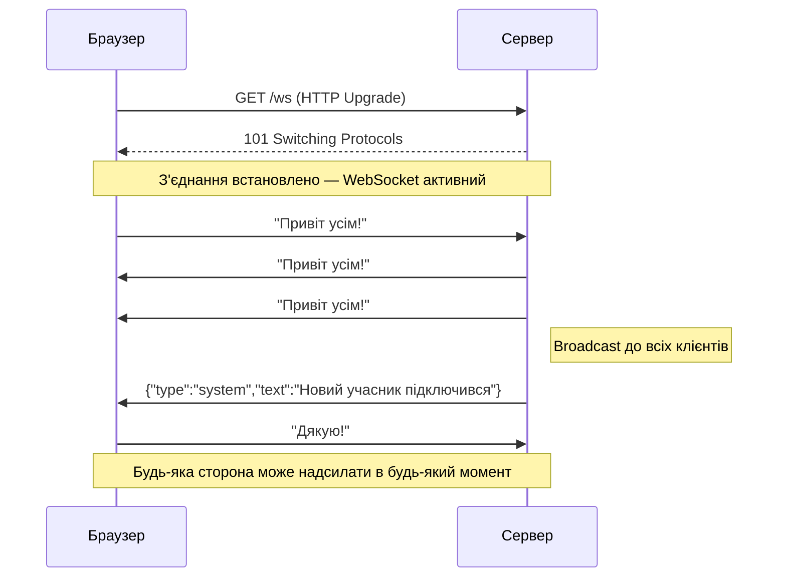
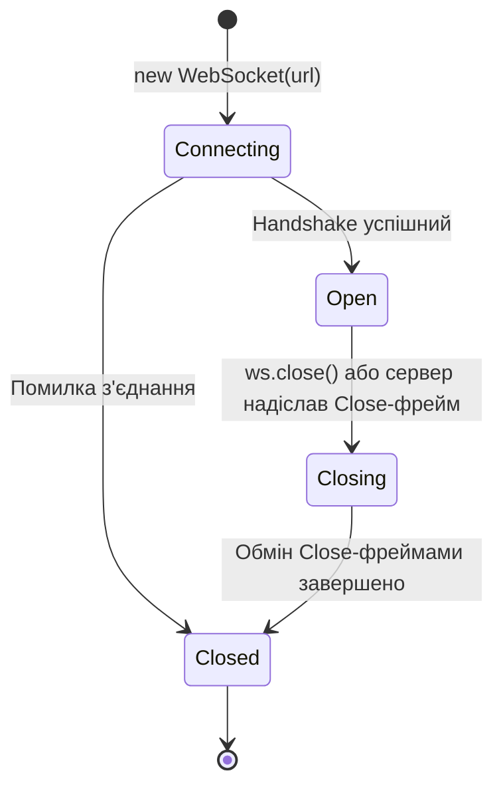

# WebSockets: Двостороннє з'єднання в реальному часі

Server-Sent Events вирішили задачу доставки подій від сервера до клієнта. Але уявіть онлайн-чат. Користувач не лише хоче отримувати нові повідомлення — він хоче їх **надсилати** через те саме постійне з'єднання. SSE тут безсилий: він однострімовий.

Або уявіть спільний редактор документів (як Google Docs): кожне натискання клавіші одного користувача має миттєво з'явитися у всіх інших. Тут і клієнт надсилає дані серверу, і сервер розповсюджує їх всім — сотні разів на секунду.

Саме для таких сценаріїв існують **WebSockets** — протокол, що забезпечує **повнодуплексний** (full-duplex) зв'язок: і клієнт, і сервер можуть надсилати повідомлення в будь-який момент через одне постійне з'єднання.

::note
**Що ми побудуємо:** окремий проєкт WebChat — мінімальний чат реального часу. Кілька вкладок браузера можуть надсилати повідомлення, які миттєво з'являються у всіх підключених клієнтів.
::

---

## Як WebSocket відрізняється від HTTP

HTTP — це протокол «запит-відповідь»: клієнт питає, сервер відповідає, з'єднання закривається (або швидко звільняється). WebSocket натомість — це **протокол постійного з'єднання**, де ініціатором повідомлення може бути будь-яка сторона.

### WebSocket Handshake

WebSocket-з'єднання починається як звичайний HTTP-запит, але з особливими заголовками — «прохання про апгрейд» протоколу:

```
Клієнт → Сервер (HTTP Upgrade Request):
  GET /ws HTTP/1.1
  Host: example.com
  Upgrade: websocket
  Connection: Upgrade
  Sec-WebSocket-Key: dGhlIHNhbXBsZSBub25jZQ==
  Sec-WebSocket-Version: 13

Сервер → Клієнт (HTTP 101 Switching Protocols):
  HTTP/1.1 101 Switching Protocols
  Upgrade: websocket
  Connection: Upgrade
  Sec-WebSocket-Accept: s3pPLMBiTxaQ9kYGzzhZRbK+xOo=
```

Після відповіді `101 Switching Protocols` HTTP-протокол «замінюється» на WebSocket. Те саме TCP-з'єднання тепер використовується за новими правилами.

::mermaid



::

---

## Структура проєкту WebChat

Для цієї статті ми створимо **окремий проєкт**, а не розширюємо попередній. Це дозволяє сфокусуватися виключно на WebSockets:

::code-tree

```csharp [Program.cs]
// Реєстрація WebSocket middleware та ендпоінту
```

```csharp [Models/ChatMessage.cs]
// Структура повідомлення чату
```

```csharp [Services/ConnectionManager.cs]
// Управління активними WebSocket-з'єднаннями
```

```csharp [Endpoints/ChatEndpoints.cs]
// WebSocket ендпоінт та логіка чату
```

```html [wwwroot/index.html]
// Клієнтський інтерфейс чату
```

::

---

## Реалізація

### Крок 1: Створення проєкту

::steps

### Ініціалізація

```bash
dotnet new web -n WebChat
cd WebChat
mkdir wwwroot
```

### Початковий `Program.cs`

WebSockets у ASP.NET Core не вимагає окремих NuGet-пакетів — все вбудовано:

```csharp [Program.cs]
using WebChat.Endpoints;
using WebChat.Services;

var builder = WebApplication.CreateBuilder(args);

// Реєструємо менеджер підключень як Singleton —
// він повинен жити весь час роботи застосунку і зберігати всі WebSocket-з'єднання
builder.Services.AddSingleton<ConnectionManager>();

var app = builder.Build();

// Активуємо підтримку WebSockets.
// KeepAliveInterval — як часто надсилати "ping" щоб з'єднання не розривалося
// мережевим обладнанням (роутерами, проксі)
app.UseWebSockets(new WebSocketOptions
{
    KeepAliveInterval = TimeSpan.FromSeconds(30)
});

app.UseStaticFiles();
app.MapChatEndpoints();
app.Run();
```

::

### Крок 2: Модель повідомлення

```csharp [Models/ChatMessage.cs]
namespace WebChat.Models;

// Перелік типів повідомлень — для розрізнення на клієнті
public enum MessageType
{
    Chat,       // Звичайне повідомлення від учасника
    System,     // Системне (підключився/відключився)
    Error       // Помилка
}

// Структура повідомлення для серіалізації в JSON
public record ChatMessage(
    string Id,          // Унікальний ідентифікатор (для дедуплікації на клієнті)
    string Username,    // Від кого
    string Text,        // Текст
    MessageType Type,   // Тип повідомлення
    DateTime Timestamp  // Коли
)
{
    // Фабричний метод для системних повідомлень
    public static ChatMessage CreateSystem(string text) => new(
        Id: Guid.NewGuid().ToString("N")[..8],
        Username: "System",
        Text: text,
        Type: MessageType.System,
        Timestamp: DateTime.UtcNow
    );

    // Фабричний метод для повідомлень користувача
    public static ChatMessage CreateChat(string username, string text) => new(
        Id: Guid.NewGuid().ToString("N")[..8],
        Username: username,
        Text: text,
        Type: MessageType.Chat,
        Timestamp: DateTime.UtcNow
    );
}
```

### Крок 3: Менеджер підключень

Центральна задача при роботі з WebSockets — відстеження **всіх активних підключень**. Без цього ми не могли б розсилати повідомлення всім клієнтам одночасно.

```csharp [Services/ConnectionManager.cs]
using System.Collections.Concurrent;
using System.Net.WebSockets;
using System.Text;
using System.Text.Json;
using WebChat.Models;

namespace WebChat.Services;

public class ConnectionManager
{
    // ConcurrentDictionary — thread-safe словник.
    // Ключ: унікальний ID підключення; Значення: WebSocket-об'єкт
    // Обов'язково ConcurrentDictionary, бо кілька потоків одночасно
    // можуть додавати/видаляти підключення
    private readonly ConcurrentDictionary<string, (WebSocket Socket, string Username)> _connections = new();

    private static readonly JsonSerializerOptions JsonOptions = new()
    {
        PropertyNamingPolicy = JsonNamingPolicy.CamelCase
    };

    // Додаємо нове підключення. Повертає унікальний ID для цього підключення.
    public string AddConnection(WebSocket socket, string username)
    {
        var connectionId = Guid.NewGuid().ToString("N")[..12]; // Перші 12 символів GUID
        _connections[connectionId] = (socket, username);
        return connectionId;
    }

    // Видаляємо підключення після його закриття
    public void RemoveConnection(string connectionId)
    {
        _connections.TryRemove(connectionId, out _);
    }

    // Кількість активних підключень (для відображення в UI)
    public int ConnectedCount => _connections.Count;

    // Надсилаємо повідомлення ВСІМ підключеним клієнтам (broadcast)
    public async Task BroadcastAsync(ChatMessage message)
    {
        var json = JsonSerializer.Serialize(message, JsonOptions);
        // UTF-8 байти — бо WebSocket передає байти, а не рядки
        var bytes = Encoding.UTF8.GetBytes(json);
        var segment = new ArraySegment<byte>(bytes);

        // Збираємо список активних підключень для ітерації
        // (ToList() щоб не модифікувати колекцію під час ітерації)
        var connections = _connections.Values.ToList();

        // Надсилаємо всім паралельно — Task.WhenAll чекає завершення всіх
        await Task.WhenAll(connections.Select(async conn =>
        {
            // Перевіряємо стан WebSocket перед надсиланням
            if (conn.Socket.State == WebSocketState.Open)
            {
                try
                {
                    // SendAsync — передаємо:
                    // segment: дані для надсилання
                    // WebSocketMessageType.Text: вказуємо, що це текстові дані (не бінарні)
                    // endOfMessage: true — ціле повідомлення в одному фреймі
                    // CancellationToken.None — не скасовуємо
                    await conn.Socket.SendAsync(segment, WebSocketMessageType.Text, true, CancellationToken.None);
                }
                catch
                {
                    // Якщо не вдалося надіслати — ігноруємо
                    // (підключення буде видалено в обробнику)
                }
            }
        }));
    }
}
```

### Крок 4: WebSocket ендпоінт

```csharp [Endpoints/ChatEndpoints.cs]
using System.Net.WebSockets;
using System.Text;
using System.Text.Json;
using WebChat.Models;
using WebChat.Services;

namespace WebChat.Endpoints;

public static class ChatEndpoints
{
    private static readonly JsonSerializerOptions JsonOptions = new()
    {
        PropertyNamingPolicy = JsonNamingPolicy.CamelCase
    };

    public static void MapChatEndpoints(this WebApplication app)
    {
        // GET /ws?username=Іван — WebSocket ендпоінт
        app.MapGet("/ws", HandleWebSocket);

        // GET /api/stats — для відображення кількості підключених
        app.MapGet("/api/stats", (ConnectionManager mgr) =>
            Results.Ok(new { connectedCount = mgr.ConnectedCount }));
    }

    private static async Task HandleWebSocket(
        HttpContext context,
        ConnectionManager manager,
        string username = "Анонім")
    {
        // Перевіряємо, чи це справді WebSocket-запит
        if (!context.WebSockets.IsWebSocketRequest)
        {
            context.Response.StatusCode = 400; // Bad Request
            await context.Response.WriteAsync("Очікується WebSocket-запит");
            return;
        }

        // Приймаємо WebSocket — після цього HTTP-з'єднання перетворюється на WebSocket
        var webSocket = await context.WebSockets.AcceptWebSocketAsync();

        // Реєструємо підключення
        var connectionId = manager.AddConnection(webSocket, username);

        // Сповіщаємо всіх про нового учасника
        await manager.BroadcastAsync(
            ChatMessage.CreateSystem($"{username} приєднався до чату. Онлайн: {manager.ConnectedCount}"));

        try
        {
            // Запускаємо цикл читання повідомлень
            await ReceiveLoop(webSocket, username, manager);
        }
        finally
        {
            // finally — виконається завжди, навіть якщо стався виняток або клієнт від'єднався
            manager.RemoveConnection(connectionId);
            await manager.BroadcastAsync(
                ChatMessage.CreateSystem($"{username} покинув чат. Онлайн: {manager.ConnectedCount}"));
        }
    }

    private static async Task ReceiveLoop(WebSocket webSocket, string username, ConnectionManager manager)
    {
        // Буфер для отримання даних — 4 КБ на одну операцію читання
        var buffer = new byte[4 * 1024];

        while (webSocket.State == WebSocketState.Open)
        {
            WebSocketReceiveResult result;
            using var ms = new MemoryStream();

            // WebSocket може розбити велике повідомлення на кілька фреймів.
            // Цикл do-while збирає всі фрейми в єдиний MemoryStream.
            do
            {
                result = await webSocket.ReceiveAsync(new ArraySegment<byte>(buffer), CancellationToken.None);

                if (result.MessageType == WebSocketMessageType.Close)
                    return; // Клієнт надіслав Close-фрейм — виходимо

                ms.Write(buffer, 0, result.Count); // Дописуємо отримані байти
            }
            while (!result.EndOfMessage); // EndOfMessage == true → повідомлення повністю отримано

            // Декодуємо байти назад у рядок
            var messageText = Encoding.UTF8.GetString(ms.ToArray()).Trim();

            if (string.IsNullOrEmpty(messageText)) continue;

            // Розсилаємо повідомлення всім учасникам
            var chatMessage = ChatMessage.CreateChat(username, messageText);
            await manager.BroadcastAsync(chatMessage);
        }
    }
}
```

Розберемо цикл читання детальніше. WebSocket передає дані «фреймами» (frames) — блоками байтів. Якщо повідомлення велике (>4 КБ у нашому прикладі), воно буде розбите на кілька фреймів. Властивість `EndOfMessage` вказує, чи це останній фрейм у повідомленні. Тому нам потрібен внутрішній цикл `do-while` — збираємо всі фрейми, перш ніж обробляти повідомлення.

### Крок 5: Клієнтський інтерфейс

```html [wwwroot/index.html]
<!DOCTYPE html>
<html lang="uk">
<head>
    <meta charset="UTF-8">
    <title>WebChat — Реальний час</title>
    <style>
        * { box-sizing: border-box; margin: 0; padding: 0; }
        body { font-family: 'Segoe UI', sans-serif; background: #0f172a; color: #e2e8f0;
               display: flex; flex-direction: column; height: 100vh; }
        header { background: #1e293b; padding: 16px 24px; display: flex;
                 justify-content: space-between; align-items: center; border-bottom: 1px solid #334155; }
        #status-dot { width: 10px; height: 10px; border-radius: 50%;
                      background: #ef4444; display: inline-block; margin-right: 8px; }
        #status-dot.connected { background: #22c55e; }
        #messages { flex: 1; overflow-y: auto; padding: 16px; display: flex; flex-direction: column; gap: 8px; }
        .msg { max-width: 70%; padding: 10px 14px; border-radius: 12px; line-height: 1.4; }
        .msg.chat { background: #1e293b; align-self: flex-start; }
        .msg.system { background: transparent; align-self: center;
                      font-size: 12px; color: #64748b; font-style: italic; }
        .msg .username { font-size: 11px; color: #94a3b8; margin-bottom: 4px; }
        .msg .time { font-size: 11px; color: #475569; margin-top: 4px; text-align: right; }
        footer { background: #1e293b; padding: 16px; display: flex; gap: 10px; border-top: 1px solid #334155; }
        input { flex: 1; background: #0f172a; border: 1px solid #334155; border-radius: 8px;
                padding: 10px 14px; color: #e2e8f0; font-size: 14px; }
        input:focus { outline: none; border-color: #3b82f6; }
        button { background: #3b82f6; color: white; border: none; border-radius: 8px;
                 padding: 10px 20px; cursor: pointer; font-size: 14px; }
        button:disabled { background: #334155; cursor: not-allowed; }
    </style>
</head>
<body>
    <header>
        <h2>💬 WebChat</h2>
        <span><span id="status-dot"></span><span id="status-text">Відключено</span></span>
    </header>

    <div id="messages"></div>

    <footer>
        <input id="msg-input" type="text" placeholder="Введіть повідомлення..."
               onkeydown="if(event.key==='Enter') sendMessage()" disabled />
        <button id="send-btn" onclick="sendMessage()" disabled>Надіслати</button>
    </footer>

    <script>
        // Запитуємо ім'я при відкритті сторінки
        const username = prompt("Ваше ім'я:") || "Анонім";
        document.title = `WebChat — ${username}`;

        let ws = null;

        function connect() {
            // ws:// або wss:// — як http:// та https:// для WebSocket
            // location.host — автоматично підставляє поточний хост (localhost:5000)
            const protocol = location.protocol === 'https:' ? 'wss:' : 'ws:';
            ws = new WebSocket(`${protocol}//${location.host}/ws?username=${encodeURIComponent(username)}`);

            ws.onopen = () => {
                // З'єднання встановлено
                document.getElementById('status-dot').className = 'connected';
                document.getElementById('status-text').textContent = 'Підключено';
                document.getElementById('msg-input').disabled = false;
                document.getElementById('send-btn').disabled = false;
            };

            ws.onmessage = (event) => {
                // Отримали повідомлення від сервера
                const message = JSON.parse(event.data);
                displayMessage(message);
            };

            ws.onclose = () => {
                document.getElementById('status-dot').className = '';
                document.getElementById('status-text').textContent = 'Відключено. Оновіть сторінку.';
                document.getElementById('msg-input').disabled = true;
                document.getElementById('send-btn').disabled = true;
            };

            ws.onerror = (err) => {
                console.error('WebSocket error:', err);
            };
        }

        function sendMessage() {
            const input = document.getElementById('msg-input');
            const text = input.value.trim();
            if (!text || !ws || ws.readyState !== WebSocket.OPEN) return;

            // Надсилаємо текст безпосередньо — сервер обгортає в ChatMessage
            ws.send(text);
            input.value = '';
        }

        function displayMessage(message) {
            const container = document.getElementById('messages');
            const el = document.createElement('div');
            el.className = `msg ${message.type.toLowerCase()}`;

            if (message.type === 'Chat') {
                const time = new Date(message.timestamp).toLocaleTimeString('uk-UA', { hour: '2-digit', minute: '2-digit' });
                el.innerHTML = `
                    <div class="username">${message.username}</div>
                    ${message.text}
                    <div class="time">${time}</div>
                `;
            } else {
                el.textContent = message.text;
            }

            container.appendChild(el);
            container.scrollTop = container.scrollHeight; // Прокрутити до останнього повідомлення
        }

        // Підключаємося одразу при завантаженні сторінки
        connect();
    </script>
</body>
</html>
```

---

## Тестування

Запустіть проєкт і відкрийте `http://localhost:5000` у **кількох вкладках або різних браузерах** одночасно. Введіть різні імена. Кожне повідомлення в одній вкладці миттєво з'явиться у всіх інших.

```bash
dotnet run
```

---

## Управління станом WebSocket

WebSocket-з'єднання проходить через кілька станів:

::mermaid



::

У коді ми перевіряємо `webSocket.State == WebSocketState.Open` перед кожною операцією. Намагання надіслати або отримати дані через закритий WebSocket кине виняток.

---

## Обмеження сирих WebSockets та мотивація для SignalR

Наш чат працює, але подивіться, скільки коду нам знадобилося для базового функціоналу:
- Ручне управління буфером (`byte[]`, `MemoryStream`)
- Збирання фреймів у `do-while`
- `ConcurrentDictionary` для підключень
- Серіалізація/десеріалізація вручну
- Обробка станів з'єднання

А ми ще не розглядали: групи користувачів, автентифікацію, масштабування на кілька серверів, типізовані повідомлення, автоматичне перепідключення на клієнті...

Вся ця інфраструктура — повторюваний код, який доводиться писати в кожному проєкті. **SignalR** — бібліотека Microsoft, яка надає всю цю інфраструктуру «з коробки» і дозволяє зосередитися на бізнес-логіці. Це тема наступної статті.

---

## Підсумок

Ми реалізували повнодуплексний real-time чат на WebSockets:
- Зрозуміли механізм WebSocket Handshake (HTTP Upgrade)
- Реалізували `ConnectionManager` з `ConcurrentDictionary` для управління підключеннями
- Написали цикл читання/запису з правильною обробкою WebSocket-фреймів
- Реалізували broadcast — розсилку повідомлень усім клієнтам паралельно
- Підключили нативний WebSocket API у браузері

Ключовий висновок: сирі WebSockets дають максимальний контроль, але вимагають значного boilerplate-коду. SignalR абстрагує цю складність, зберігаючи ту саму потужність.
