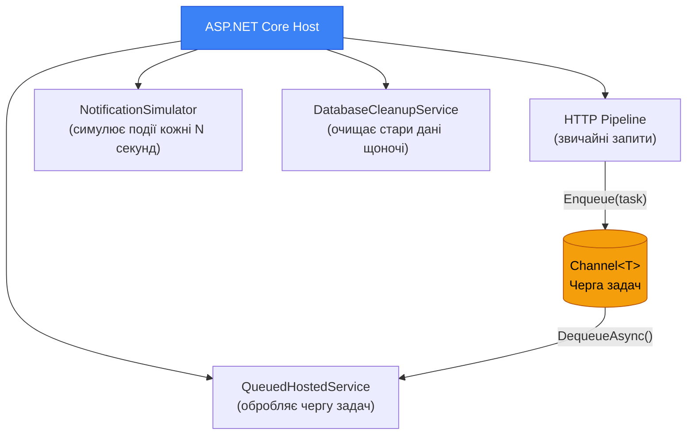
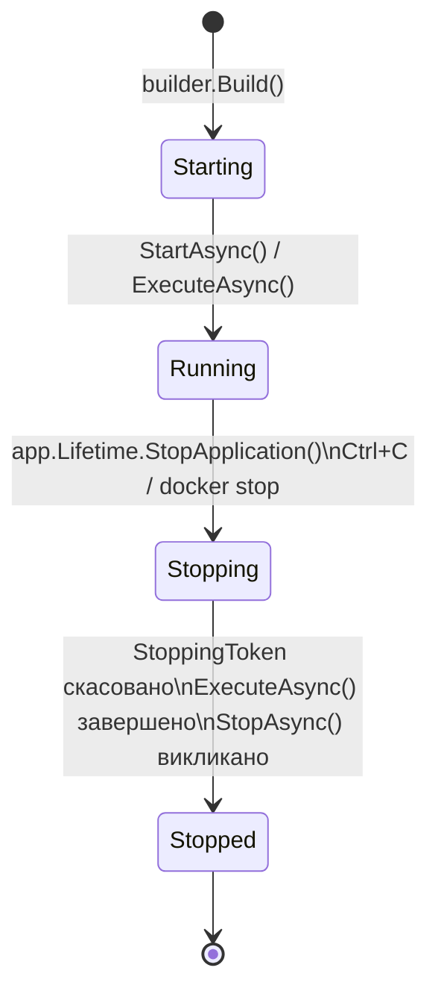

# Background Services: Фонові задачі в ASP.NET Core

До цього моменту весь наш код виконувався в одному місці: **всередині HTTP-запиту**. Клієнт надіслав запит → сервер виконав код → сервер відповів. Якщо клієнт не надіслав запит — код не виконується.

Але реальні застосунки мають задачі, які повинні виконуватися **поза запитами**:
- Кожні 10 хвилин перевіряти базу і знаходити підписки, що спливають завтра — надсилати Email-нотифікації
- Щоночі видаляти прочитані нотифікації старші за 30 днів
- Кожні 5 секунд опитувати зовнішній API (курс валют, погода) і оновлювати кеш
- Обробляти чергу Email-розсилок у фоні, незалежно від HTTP-трафіку

### 🏭 Аналогія з реального життя

Уявіть собі ресторан:
- **Офіціанти** (Controllers) — обслуговують клієнтів, приймають замовлення.
- **Кухарі** (Background Workers) — готують їжу у фоновому режимі (паралельно), навіть коли немає нових клієнтів.
- **Прибиральники** (Cleanup Workers) — виконують нічні завдання очищення після закриття.

Для реалізації таких фонових працівників в ASP.NET Core існують **Hosted Services** (фонові сервіси).

::note
**Що ми побудуємо:** повернемося до проєкту `NotificationsDemo` зі статей 01-03 і додамо: фоновий сервіс-«симулятор» нових подій, чергу фонових задач на `Channel<T>`, і покажемо, як правильно звертатися до бази даних із фонового сервісу.
::

---

## Передумови: Проблема «довгих операцій» у HTTP

Перш ніж вивчати рішення, зрозуміємо проблему.

Уявіть: користувач натискає «Надіслати лист 10 000 підписників». Якщо відправляти листи безпосередньо в HTTP-обробнику:

```csharp
// ❌ Так робити НЕ ВАРТО
app.MapPost("/newsletters/send", async (AppDbContext db, IEmailService email) =>
{
    var subscribers = await db.Subscribers.ToListAsync(); // 10 000 записів

    foreach (var sub in subscribers)
        await email.SendAsync(sub.Email, "Новини тижня", body); // Кожен лист — ~200мс

    // Кожен лист по 200мс × 10 000 = ~2000 секунд = ~33 хвилини!!!
    // HTTP-запит залишатиметься відкритим весь цей час
    return Results.Ok("Надіслано");
});
```

HTTP-запит займе **33 хвилини**. За цей час:
- Браузер може відключитися через таймаут
- Nginx або reverse proxy закриє з'єднання через таймаут
- Один потік займає всі ресурси, решта запитів чекає

Правильне рішення: HTTP-обробник **ставить задачу в чергу** і одразу повертає `202 Accepted`. Фоновий сервіс читає з черги і виконує задачі поступово.

---

## IHostedService: Базовий інтерфейс

`IHostedService` — це інтерфейс у ASP.NET Core з двома методами:

```csharp
public interface IHostedService
{
    // Викликається при старті застосунку (після builder.Build())
    Task StartAsync(CancellationToken cancellationToken);

    // Викликається при зупинці застосунку (Ctrl+C, перезапуск, docker stop)
    Task StopAsync(CancellationToken cancellationToken);
}
```

Реєструємо через:

```csharp
builder.Services.AddHostedService<MyService>();
```

ASP.NET Core автоматично викликає `StartAsync` при старті і `StopAsync` при завершенні.

### Мінімальний приклад

```csharp
public class GreeterService : IHostedService
{
    private readonly ILogger<GreeterService> _logger;

    // IHostedService може отримувати залежності через DI
    public GreeterService(ILogger<GreeterService> logger) => _logger = logger;

    public Task StartAsync(CancellationToken cancellationToken)
    {
        _logger.LogInformation("Застосунок запущено!");
        return Task.CompletedTask; // Якщо нічого async — повертаємо готову задачу
    }

    public Task StopAsync(CancellationToken cancellationToken)
    {
        _logger.LogInformation("Застосунок зупиняється...");
        return Task.CompletedTask;
    }
}
```

Якщо потрібен точний контроль над запуском/зупинкою, або періодичне виконання за розкладом без нескінченного циклу (наприклад, періодичний бекап чи планувальник задач), можна використовувати `Timer` у поєднанні з `IHostedService`:

```csharp
public class AdvancedWorker : IHostedService, IDisposable
{
    private readonly ILogger<AdvancedWorker> _logger;
    private Timer? _timer;

    public AdvancedWorker(ILogger<AdvancedWorker> logger) => _logger = logger;

    public Task StartAsync(CancellationToken cancellationToken)
    {
        _logger.LogInformation("Advanced Worker запущено");
        // Запускаємо таймер, який спрацьовуватиме кожні 30 секунд
        _timer = new Timer(DoWork, null, TimeSpan.Zero, TimeSpan.FromSeconds(30));
        return Task.CompletedTask;
    }

    private void DoWork(object? state)
    {
        _logger.LogInformation("Виконання задачі за розкладом о {Time}", DateTime.Now);
    }

    public Task StopAsync(CancellationToken cancellationToken)
    {
        _logger.LogInformation("Advanced Worker зупинено");
        _timer?.Change(Timeout.Infinite, 0); // Зупиняємо таймер
        return Task.CompletedTask;
    }

    public void Dispose() => _timer?.Dispose();
}
```

Але для задач, що виконуються **постійно без зупинки** (наприклад, читання з черги повідомлень у `while` циклі), з `IHostedService` доведеться писати багато шаблонного коду (boilerplate) і самостійно обробляти скасування. Для таких циклічних задач існує абстрактний клас `BackgroundService`.

---

## BackgroundService: Абстрактний клас для фонових циклів

`BackgroundService` — абстрактний клас, що реалізує `IHostedService` і надає один абстрактний метод:

```csharp
public abstract class BackgroundService : IHostedService, IDisposable
{
    // Ваш фоновий код — виконується весь час роботи застосунку
    protected abstract Task ExecuteAsync(CancellationToken stoppingToken);

    // StartAsync і StopAsync реалізовані автоматично
}
```

`ExecuteAsync` запускається у фоні при старті застосунку і виконується до його зупинки. `stoppingToken` переходить у скасований стан, коли застосунок зупиняється — це сигнал для чистого завершення.

### Приклад: Фоновий симулятор нових подій

Повернемося до `NotificationsDemo` і додамо сервіс, що симулює появу нових нотифікацій кожні кілька секунд:

```csharp [Services/NotificationSimulator.cs]
using Microsoft.EntityFrameworkCore;
using NotificationsDemo.Models;
using NotificationsDemo.Services;

namespace NotificationsDemo.Services;

public class NotificationSimulator : BackgroundService
{
    // IServiceScopeFactory — для отримання Scoped-сервісів із Singleton
    // Детально про це — нижче в статті
    private readonly IServiceScopeFactory _scopeFactory;

    private readonly NotificationBroadcaster _broadcaster;
    private readonly ILogger<NotificationSimulator> _logger;

    // Тестові сценарії — імітуємо різні типи подій
    private static readonly (string Type, string Message)[] EventTemplates =
    [
        ("like",    "Олена поставила лайк на вашу публікацію"),
        ("comment", "Іван прокоментував: \"Цікава думка!\""),
        ("follow",  "Марія підписалась на вас"),
        ("system",  "Ваш обліковий запис успішно верифіковано"),
        ("like",    "5 людей оцінили вашу фотографію"),
    ];

    public NotificationSimulator(
        IServiceScopeFactory scopeFactory,
        NotificationBroadcaster broadcaster,
        ILogger<NotificationSimulator> logger)
    {
        _scopeFactory = scopeFactory;
        _broadcaster = broadcaster;
        _logger = logger;
    }

    protected override async Task ExecuteAsync(CancellationToken stoppingToken)
    {
        _logger.LogInformation("Симулятор нотифікацій запущено.");

        // stoppingToken.IsCancellationRequested стає true при зупинці застосунку
        while (!stoppingToken.IsCancellationRequested)
        {
            try
            {
                // Чекаємо випадково від 5 до 15 секунд перед наступною нотифікацією
                var delay = TimeSpan.FromSeconds(Random.Shared.Next(5, 15));
                await Task.Delay(delay, stoppingToken); // Передаємо stoppingToken — зупиниться разом з додатком

                await SimulateNotification(stoppingToken);
            }
            catch (OperationCanceledException)
            {
                // Нормальне завершення — stoppingToken скасовано при зупинці застосунку
                break;
            }
            catch (Exception ex)
            {
                // Будь-який інший виняток — логуємо, але НЕ зупиняємо сервіс
                // Без цього одна помилка вбила б весь фоновий цикл назавжди
                _logger.LogError(ex, "Помилка в симуляторі нотифікацій");

                // Коротка пауза щоб не зациклитися при повторюваних помилках
                await Task.Delay(TimeSpan.FromSeconds(5), stoppingToken);
            }
        }

        _logger.LogInformation("Симулятор нотифікацій зупинено.");
    }

    private async Task SimulateNotification(CancellationToken cancellationToken)
    {
        // Обираємо випадковий шаблон події
        var template = EventTemplates[Random.Shared.Next(EventTemplates.Length)];

        // Зберігаємо в базу даних — але як?
        // BackgroundService реєструється як Singleton (один на весь додаток),
        // а AppDbContext — Scoped (новий екземпляр для кожного HTTP-запиту).
        // Не можна вставляти Scoped у Singleton безпосередньо!
        // Рішення: IServiceScopeFactory — створюємо тимчасовий scope вручну.
        await using var scope = _scopeFactory.CreateAsyncScope();
        var db = scope.ServiceProvider.GetRequiredService<AppDbContext>();

        var notification = new Notification
        {
            UserId = 1, // Для демо — фіксований userId
            Type = template.Type,
            Message = template.Message,
            IsRead = false,
            CreatedAt = DateTime.UtcNow
        };

        db.Notifications.Add(notification);
        await db.SaveChangesAsync(cancellationToken);

        _logger.LogInformation("Симульовано нотифікацію: {Type} - {Message}", template.Type, template.Message);

        // Після збереження в БД — розсилаємо через SSE всім активним клієнтам
        var response = new NotificationResponse(
            notification.Id, notification.Type, notification.Message,
            notification.ActionUrl, notification.IsRead, notification.CreatedAt);

        _broadcaster.Broadcast(notification.UserId, response);
    }
}
```

---

## Теорія Threading та управління Task'ами

**Важливо розуміти:** `BackgroundService` **НЕ** створюють нові потоки автоматично! Вони виконуються асинхронно в тому ж Thread Pool, що і решта застосунку.

### 1. Блокування потоків (Типова помилка)

Якщо ви використовуєте синхронне блокування (`Thread.Sleep`) або синхронний I/O, ви надовго забираєте потік з пулу. У високонавантаженому додатку це може призвести до нестачі робочих потоків ("Thread Starvation") і зависання нормальних HTTP-запитів.

```csharp
// ❌ ПОГАНО - жорстко блокує потік!
protected override async Task ExecuteAsync(CancellationToken stoppingToken)
{
    while (!stoppingToken.IsCancellationRequested)
    {
        Thread.Sleep(1000);           // Блокує потік!
        var result = SomeSyncMethod(); // Синхронна робота!
    }
}

// ✅ ПРАВИЛЬНО - виконується асинхронно, звільняючи потік для іншої роботи
protected override async Task ExecuteAsync(CancellationToken stoppingToken)
{
    while (!stoppingToken.IsCancellationRequested)
    {
        await Task.Delay(1000, stoppingToken);       // Не блокує!
        var result = await SomeAsyncMethod();         // Асинхронно!
    }
}
```

### 2. Ігнорування CancellationToken (Типова помилка)

Передавайте `stoppingToken` у всі асинхронні методи (такі як `Task.Delay`, `SaveChangesAsync`, `HttpClient.SendAsync` та інші), щоб вони могли коректно зупинитись разом із застосунком. Без цього процес `dotnet` може зависнути (або не завершитись вчасно) під час сигналу `Graceful Shutdown` (наприклад, при зупинці контейнера Docker).

### 3. Оптимізація та Timeout'и

Для швидкої обробки багатьох задач в межах воркера використовуйте `Task.WhenAll`, а для обмеження паралелізму — `SemaphoreSlim`:

```csharp
protected override async Task ExecuteAsync(CancellationToken stoppingToken)
{
    // Паралельна обробка кількох задач одночасно
    var tasks = new List<Task>();
    for (int i = 0; i < 10; i++)
    {
        tasks.Add(ProcessItemAsync(i, stoppingToken));
    }
    await Task.WhenAll(tasks);

    // Використання timeout для довготривалих операцій (наприклад, не більше 5 хвилин)
    using var cts = CancellationTokenSource.CreateLinkedTokenSource(stoppingToken);
    cts.CancelAfter(TimeSpan.FromMinutes(5));

    try
    {
        await LongRunningOperation(cts.Token);
    }
    catch (OperationCanceledException) when (cts.Token.IsCancellationRequested)
    {
        // Операцію було перервано через ліміт у 5 хвилин або загальну зупинку
    }
}
```

---

## Критично важливо: Scoped у Singleton (DI Lifetime Problem)

Це одна з найпоширеніших помилок при роботі з Hosted Services.

ASP.NET Core має три lifetime (час існування) сервісів:

::card-group

::card{title="Singleton" icon="i-heroicons-lock-closed"}
Один екземпляр на весь час роботи застосунку. `BackgroundService`, `NotificationBroadcaster`, `ConnectionManager`.
::

::card{title="Scoped" icon="i-heroicons-arrow-path"}
Новий екземпляр для кожного HTTP-запиту. `AppDbContext (EF Core)`, репозиторії, сервіси бізнес-логіки.
::

::card{title="Transient" icon="i-heroicons-bolt"}
Новий екземпляр при кожному запиті з DI. Легкі stateless-сервіси.
::

::

`BackgroundService` реєструється як **Singleton**, але `AppDbContext` — **Scoped**. Якщо спробувати вставити `AppDbContext` у конструктор `BackgroundService`:

```csharp
// ❌ ПОМИЛКА — буде InvalidOperationException при запуску застосунку
public class MyBackgroundService : BackgroundService
{
    private readonly AppDbContext _db; // Scoped у Singleton — ЗАБОРОНЕНО

    public MyBackgroundService(AppDbContext db) => _db = db;
}
```

ASP.NET Core виявить цю невідповідність і кине виняток. Навіть якщо б не кинув — це було б неправильно: один `DbContext` використовуватиметься весь час роботи застосунку, що призводить до проблем з кешем сутностей і витоків пам'яті.

**Правильне рішення** — `IServiceScopeFactory`:

```csharp
// ✅ ПРАВИЛЬНО
public class MyBackgroundService : BackgroundService
{
    private readonly IServiceScopeFactory _scopeFactory; // Singleton — безпечно

    public MyBackgroundService(IServiceScopeFactory scopeFactory)
        => _scopeFactory = scopeFactory;

    protected override async Task ExecuteAsync(CancellationToken stoppingToken)
    {
        while (!stoppingToken.IsCancellationRequested)
        {
            // Створюємо scope — отримуємо свіжий DbContext для кожної операції
            await using var scope = _scopeFactory.CreateAsyncScope();
            var db = scope.ServiceProvider.GetRequiredService<AppDbContext>();

            // Викори DbContext в межах scope
            var count = await db.Notifications.CountAsync(stoppingToken);

            // scope автоматично Dispose-иться — DbContext звільняється
            await Task.Delay(TimeSpan.FromMinutes(1), stoppingToken);
        }
    }
}
```

---

## Channel\<T\>: Черга між HTTP-запитом і фоновим сервісом

Найпотужніший патерн для фонових сервісів — поєднання `Channel<T>` (однакового класу, що ми вже використовували в SSE) як черги між HTTP-запитом і фоновим сервісом.

### Типізована черга фонових задач

```csharp [Services/BackgroundTaskQueue.cs]
using System.Threading.Channels;

namespace NotificationsDemo.Services;

// Контракт черги — описує, що можна з нею зробити
public interface IBackgroundTaskQueue
{
    // Поставити задачу в чергу
    void Enqueue(Func<IServiceProvider, CancellationToken, Task> task);

    // Отримати задачу з черги (очікує якщо черга порожня)
    ValueTask<Func<IServiceProvider, CancellationToken, Task>> DequeueAsync(CancellationToken cancellationToken);
}

// Реалізація на базі System.Threading.Channels
public class BackgroundTaskQueue : IBackgroundTaskQueue
{
    // Channel<T> — потокобезпечна асинхронна черга
    // Func<IServiceProvider, CancellationToken, Task> — задача, яка приймає DI-провайдер і токен
    private readonly Channel<Func<IServiceProvider, CancellationToken, Task>> _queue;

    // capacity: 100 — максимум 100 задач у черзі одночасно
    // FullMode.Wait: якщо черга повна — Enqueue блокується до звільнення місця
    public BackgroundTaskQueue(int capacity = 100)
    {
        _queue = Channel.CreateBounded<Func<IServiceProvider, CancellationToken, Task>>(
            new BoundedChannelOptions(capacity)
            {
                FullMode = BoundedChannelFullMode.Wait
            });
    }

    public void Enqueue(Func<IServiceProvider, CancellationToken, Task> task)
    {
        // TryWrite — намагається записати без очікування
        // За нашою конфігурацією (Wait) це завжди успішно, якщо черга не повна
        _queue.Writer.TryWrite(task);
    }

    public async ValueTask<Func<IServiceProvider, CancellationToken, Task>> DequeueAsync(
        CancellationToken cancellationToken)
    {
        // ReadAsync очікує (без блокування потоку!), поки в черзі не з'явиться задача
        return await _queue.Reader.ReadAsync(cancellationToken);
    }
}
```

### Сервіс-обробник черги

```csharp [Services/QueuedHostedService.cs]
namespace NotificationsDemo.Services;

// Цей сервіс читає задачі з черги і виконує їх одну за одною
public class QueuedHostedService : BackgroundService
{
    private readonly IBackgroundTaskQueue _taskQueue;
    private readonly IServiceScopeFactory _scopeFactory;
    private readonly ILogger<QueuedHostedService> _logger;

    public QueuedHostedService(
        IBackgroundTaskQueue taskQueue,
        IServiceScopeFactory scopeFactory,
        ILogger<QueuedHostedService> logger)
    {
        _taskQueue = taskQueue;
        _scopeFactory = scopeFactory;
        _logger = logger;
    }

    protected override async Task ExecuteAsync(CancellationToken stoppingToken)
    {
        _logger.LogInformation("Черга задач запущена.");

        // Безкінечний цикл: чекаємо нову задачу → виконуємо → знову чекаємо
        await foreach (var _ in ProcessQueueAsync(stoppingToken)) { }

        _logger.LogInformation("Черга задач зупинена.");
    }

    private async IAsyncEnumerable<bool> ProcessQueueAsync(
        [System.Runtime.CompilerServices.EnumeratorCancellation] CancellationToken stoppingToken)
    {
        while (!stoppingToken.IsCancellationRequested)
        {
            Func<IServiceProvider, CancellationToken, Task>? task = null;

            try
            {
                // Чекаємо на нову задачу — не блокує потік
                task = await _taskQueue.DequeueAsync(stoppingToken);
            }
            catch (OperationCanceledException)
            {
                break; // Застосунок зупиняється
            }

            try
            {
                // Виконуємо задачу у власному scope
                await using var scope = _scopeFactory.CreateAsyncScope();
                await task(scope.ServiceProvider, stoppingToken);
            }
            catch (Exception ex)
            {
                _logger.LogError(ex, "Помилка виконання фонової задачі");
                // Не зупиняємо сервіс — обробляємо наступну задачу
            }

            yield return true; // Дозволяємо перевірити stoppingToken між ітераціями
        }
    }
}
```

### Використання черги з HTTP-ендпоінту

Щоб ставити задачі в чергу, нам знадобиться DTO для масової розсилки. Додамо його:

```csharp [Models/BulkNotificationRequest.cs]
namespace NotificationsDemo.Models;

public record BulkNotificationRequest(
    int[] UserIds,
    string Type,
    string Message
);
```

Тепер будь-який ендпоінт може ставити задачу в чергу і одразу повертати відповідь:

```csharp [Endpoints/NotificationEndpoints.cs]
// Ендпоінт масової розсилки — ставить задачу в чергу і відповідає одразу
private static IResult ScheduleBulkNotification(
    IBackgroundTaskQueue queue,
    BulkNotificationRequest request)
{
    // Ставимо задачу в чергу — Func<IServiceProvider, CancellationToken, Task>
    queue.Enqueue(async (services, cancellationToken) =>
    {
        var db = services.GetRequiredService<AppDbContext>();
        var broadcaster = services.GetRequiredService<NotificationBroadcaster>();

        // Логіка може бути довільно складною і тривалою
        foreach (var userId in request.UserIds)
        {
            if (cancellationToken.IsCancellationRequested) break;

            var notification = new Notification
            {
                UserId = userId,
                Type = request.Type,
                Message = request.Message,
                IsRead = false,
                CreatedAt = DateTime.UtcNow
            };

            db.Notifications.Add(notification);
            await db.SaveChangesAsync(cancellationToken);

            broadcaster.Broadcast(userId, new NotificationResponse(
                notification.Id, notification.Type, notification.Message,
                null, false, notification.CreatedAt));
        }
    });

    // Повертаємо 202 Accepted — «зрозумів, обробляю у фоні»
    return Results.Accepted("/notifications/status", new
    {
        message = $"Масова розсилка для {request.UserIds.Length} користувачів поставлена в чергу"
    });
}

// Реєструємо ендпоінт в групі
public static void MapNotificationEndpoints(this IEndpointRouteBuilder routes)
{
    var group = routes.MapGroup("/notifications");
    group.MapPost("/bulk-async", ScheduleBulkNotification);
    // ... інші ендпоінти
}
```

#### Приклад виклику в .http файлі

Щоб протестувати цей ендпоінт, додайте наступний запит до вашого `notifications.http` файлу:

```http [notifications.http]
### Масова розсилка через фонову чергу (Background Services)
POST {{baseUrl}}/notifications/bulk-async
Content-Type: application/json

{
  "userIds": [1, 2, 3, 4, 5],
  "type": "system",
  "message": "Увага! Завтра о 12:00 на сервері відбудуться технічні роботи. Застосунок може бути недоступний до 10 хвилин."
}

### Відповідь буде миттєвою (202 Accepted), а нотифікації створяться у фоні.
```

---

## Реєстрація всіх сервісів

```csharp [Program.cs]
// Черга — Singleton, бо має жити весь час роботи
builder.Services.AddSingleton<IBackgroundTaskQueue, BackgroundTaskQueue>();

// Фонові сервіси — AddHostedService реєструє як Singleton автоматично
builder.Services.AddHostedService<NotificationSimulator>();
builder.Services.AddHostedService<QueuedHostedService>();
```

---

## Кілька фонових сервісів одночасно

ASP.NET Core без проблем запускає кілька `BackgroundService` паралельно. Їх `ExecuteAsync` виконуються в окремих async-станах одночасно:

::mermaid



::

---

## Lifecycle фонового сервісу

::mermaid



::

При зупинці (`Ctrl+C`) ASP.NET Core:
1. Скасовує `stoppingToken` у всіх фонових сервісах
2. Чекає завершення `ExecuteAsync` (до `ShutdownTimeout`, за замовчуванням 30с)
3. Викликає `StopAsync`
4. Зупиняє процес

Тому важливо завжди передавати `stoppingToken` у `Task.Delay`, `DbContext`, `HttpClient` тощо — щоб вони зупинилися разом із застосунком.

---

## Практичні завдання

### Рівень 1 — Базовий

**Завдання 1.1:** Створіть `DatabaseCleanupService : BackgroundService`, який кожні **60 секунд** видаляє нотифікації, старші за 7 днів, для всіх користувачів. Використайте `ExecuteDeleteAsync` для ефективного видалення.

### Рівень 2 — Логіка

**Завдання 2.1:** Модифікуйте `NotificationSimulator`, щоб він зчитував список активних userId з бази даних і створював нотифікацію для **випадкового** userId з цього списку (а не фіксованого userId=1).

### Рівень 3 — Архітектура

**Завдання 3.1:** Реалізуйте `DigestService : BackgroundService`, який о **9:00 кожного дня** знаходить користувачів із непрочитаними нотифікаціями та для кожного ставить в `IBackgroundTaskQueue` задачу на надсилання Email-дайджесту (Email-сервіс можна замокати: просто логувати `_logger.LogInformation("Email для {email}", user.Email)`).

---

## Розподілені альтернативи Background Services

Вбудовані `BackgroundService` відмінно підходять для надійних фонових задач на одному сервері (або якщо сервер сам контролює свої таймери). Але коли ваш застосунок масштабується горизонтально на кілька екземплярів, кожен сервер запустить власний екземпляр `BackgroundService`. Це може призвести до проблеми стану перегонів та дублювання (наприклад, паралельно відправляться кілька ідентичних email-повідомлень).

Для складних, або розподілених сценаріїв використовують спеціалізовані рішення:

1. **Hangfire**  
   Відмінний вибір для планування задач (Cron), черг із гарантованим виконанням, або задач із повторними спробами (retries). Він зберігає інформацію про задачі безпосередньо в базу даних (SQL Server, Redis тощо) і надає вбудовану веб-панель моніторингу.
   ```csharp
   BackgroundJob.Enqueue(() => SendEmail("user@example.com"));
   RecurringJob.AddOrUpdate(() => CleanupOldFiles(), Cron.Daily);
   ```

2. **Quartz.NET**  
   Більш низькорівневий та вкрай потужний планувальник рівня Enterprise. Ідеально підходить для управління тисячами різноманітних Cron-задач з вбудованою підтримкою координації у кластері (job synchronization).

3. **Message Brokers (RabbitMQ, Azure Service Bus)**  
   Стандарт для мікросервісної архітектури. Веб-застосунок (Producer) відправляє повідомлення з даними клієнта в чергу брокера. Окремі спеціалізовані сервіси (Consumers), які також можуть базуватися на `BackgroundService`, асинхронно читають повідомлення з черг та обробляють логіку. Це дозволяє легко масштабувати фонову обробку незалежно від веб-запитів.

---

## Підсумок

Фонові сервіси — фундаментальна частина будь-якого серйозного серверного застосунку:
- `IHostedService` — базовий інтерфейс для задач із запуском/зупинкою
- `BackgroundService` — абстрактний клас для нескінченних циклів
- `IServiceScopeFactory` — єдиний правильний спосіб використовувати Scoped-сервіси (DbContext) у Singleton
- `Channel<T>` як черга — елегантне рішення для розпаралелювання HTTP-запитів і фонових операцій

У наступній статті ми використаємо фонові сервіси для **Web Push нотифікацій** — повідомлень, які надходять до користувача навіть коли він закрив вашу сторінку.
