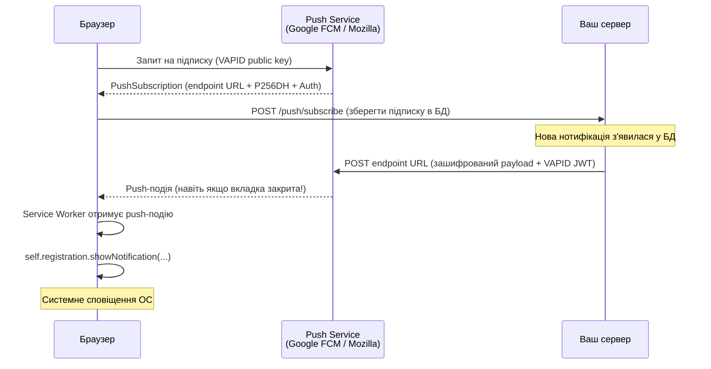
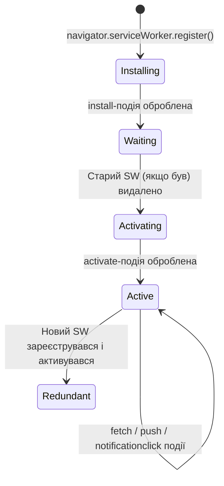

# Web Push нотифікації

До цього моменту всі наші нотифікації вимагали, щоб користувач **тримав сторінку відкритою**. Але що якщо він закрив браузер? Або перейшов на іншу вкладку? SSE-з'єднання обривається, SignalR відключається — і жодних нотифікацій.

**Web Push** вирішує цю проблему кардинально: нотифікація надходить до браузера навіть коли ваш сайт не відкритий. Браузер показує системне сповіщення — як від мобільного додатка.

::note
**Що ми побудуємо:** розширимо проєкт `NotificationsDemo` — додамо VAPID-ключі, Service Worker із правильним lifecycle, ендпоінти підписки та фоновий сервіс (`BackgroundService` зі статті 06), який надсилатиме Web Push при появі непрочитаних нотифікацій.
::

::warning
**Обов'язкова умова: HTTPS.** Service Workers та Web Push API **не працюють** на звичайному HTTP. Єдиний виняток — `localhost` для розробки. При деплої на реальний сервер необхідний SSL-сертифікат. Це вбудоване обмеження безпеки браузерів — не баг бібліотеки.
::

---

## Архітектура Web Push

Web Push — набагато складніша система, ніж SSE чи WebSockets. Тут задіяні три сторони:

::mermaid



::

**Push Service** — сторонній сервіс (для Chrome — Google FCM, для Firefox — Mozilla Push), який зберігає постійне з'єднання з браузером і доставляє повідомлення. Ваш сервер **ніколи не спілкується з браузером напряму** при відправці push — лише через Push Service.

**VAPID** (Voluntary Application Server Identification) — стандарт ідентифікації вашого сервера. Це пара ключів (публічний та приватний): Push Service перевіряє підпис кожного запиту, щоб переконатися, що повідомлення надійшло від авторизованого сервера, а не від будь-кого, хто дізнався `endpoint` URL.

**Service Worker** — JavaScript-файл, що реєструється браузером і виконується у фоні, **незалежно** від відкритих вкладок. Він отримує push-події і показує сповіщення.

---

## Шифрування payload: чому P256DH і Auth?

Перед тим як реалізовувати — розберемо один ключовий момент, який часто залишають поза увагою.

Коли ваш сервер надсилає повідомлення до Push Service, ці дані **проходять через сторонній сервер** (Google FCM, Mozilla тощо). Push Service — не ваш сервіс, і теоретично може читати вміст повідомлень.

Web Push вирішує це **end-to-end шифруванням** на базі ECDH (Elliptic Curve Diffie-Hellman):

- **`P256DH`** — публічний ключ браузера (Elliptic Curve Diffie-Hellman, крива P-256). Ваш сервер використовує його для шифрування payload так, що розшифрувати може **тільки цей конкретний браузер**.
- **`Auth`** — 16-байтовий Authentication Secret. Додатковий рівень захисту: підтверджує, що payload зашифровано саме для цієї підписки.

Коли ви викликаєте `WebPushClient.SendNotificationAsync`, бібліотека `WebPush` автоматично шифрує payload за цими ключами. Ні Push Service, ні будь-хто інший не може прочитати вміст — лише браузер, що створив підписку.

Саме тому `PushSubscription` у браузері містить [`keys`](https://developer.mozilla.org/en-US/docs/Web/API/PushSubscription/getKey) — і саме їх ми зберігаємо в БД.

---

## Крок 1: Генерація VAPID-ключів

```bash
cd NotificationsDemo
dotnet add package WebPush
```

VAPID-ключі генеруються **один раз** на весь термін існування застосунку. Якщо ви зміните приватний ключ — всі існуючі підписки стануть недійсними (браузери відхилятимуть ваші Push-запити), і всі користувачі мусять підписатися знову.

Найзручніший спосіб — написати **одноразову Console App** прямо всередині solution:

::steps

### Створіть окремий проєкт для генерації

```bash
dotnet new console -n GenerateVapidKeys
cd GenerateVapidKeys
dotnet add package WebPush
```

### Напишіть код

```csharp [GenerateVapidKeys/Program.cs]
using WebPush;

// VapidHelper.GenerateVapidKeys() використовує криптографічно стійкий ГВЧ
// для генерації пари ключів на базі кривої P-256 (ECDSA)
var keys = VapidHelper.GenerateVapidKeys();

Console.WriteLine("=== VAPID Keys (збережіть ці значення!) ===");
Console.WriteLine($"PublicKey:  {keys.PublicKey}");
Console.WriteLine($"PrivateKey: {keys.PrivateKey}");
Console.WriteLine();
Console.WriteLine("Додайте до appsettings.json:");
Console.WriteLine($$"""
{
  "Vapid": {
    "Subject": "mailto:admin@yourdomain.com",
    "PublicKey": "{{keys.PublicKey}}",
    "PrivateKey": "{{keys.PrivateKey}}"
  }
}
""");
```

### Запустіть та скопіюйте ключі

```bash
cd GenerateVapidKeys
dotnet run
```

::

Скопіюйте згенеровані ключі в `appsettings.json` основного проєкту:

```json [appsettings.json]
{
  "Vapid": {
    "Subject": "mailto:admin@yourdomain.com",
    "PublicKey": "BEl62iUYgUivxIkv69yViEuiBIa-Ib9-SkvMeAtA3LFgDzkrxZJjSgSnfckjBJuBkr3qBUYIHBQFLXYp5Nksh8U",
    "PrivateKey": "UUxI4O8-FbRouAevSmBQ6co-EEYr-exiV7q79bsO8K0"
  }
}
```

::warning
**Приватний ключ — конфіденційні дані.** Ніколи не комітьте `appsettings.json` із реальним `PrivateKey` у публічний репозиторій. Використовуйте `dotnet user-secrets` при розробці і змінні середовища у продакшені:

```bash
dotnet user-secrets set "Vapid:PrivateKey" "UUxI4O8-FbR..."
dotnet user-secrets set "Vapid:PublicKey" "BEl62iUYgUi..."
```
::

---

## Крок 2: Модель підписки та міграція

```csharp [Models/PushSubscription.cs]
namespace NotificationsDemo.Models;

// Зберігаємо дані підписки в БД — вони потрібні при кожній відправці Push
public class PushSubscriptionEntity
{
    public int Id { get; set; }
    public int UserId { get; set; }

    // Унікальна URL Push Service для цього конкретного браузера/пристрою.
    // Це і є "адреса доставки" — саме сюди ваш сервер надсилатиме повідомлення.
    public string Endpoint { get; set; } = string.Empty;

    // P256DH — публічний ECDH-ключ браузера для шифрування payload.
    // Ваш сервер шифрує повідомлення цим ключем — розшифрувати може тільки цей браузер.
    public string P256DH { get; set; } = string.Empty;

    // Auth — 16-байтовий секрет аутентифікації.
    // Захищає від підміни: підтверджує, що payload зашифровано для правильного одержувача.
    public string Auth { get; set; } = string.Empty;

    public DateTime CreatedAt { get; set; } = DateTime.UtcNow;
}
```

Додайте до `AppDbContext`:

```csharp [Models/AppDbContext.cs]
public DbSet<PushSubscriptionEntity> PushSubscriptions => Set<PushSubscriptionEntity>();
```

Після чого — обов'язково додайте та виконайте міграцію:

```bash
dotnet ef migrations add AddPushSubscriptions
dotnet ef database update
```

---

## Крок 3: Service Worker

Service Worker (SW) — файл JavaScript, що живе **окремо від вашого сайту**. Браузер реєструє його і виконує у фоні, навіть коли вкладка з вашим сайтом закрита.

### Lifecycle Service Worker

Перш ніж писати код, важливо розуміти, через які стани проходить SW:

::mermaid



::

Ключовий момент: після **оновлення** файлу `sw.js` новий SW переходить у стан `Waiting` і **не активується одразу**. Він чекає, поки користувач закриє всі вкладки з вашим сайтом. Це захищає від ситуації де новий і старий SW конкурують за контроль. Для форсованого оновлення під час розробки — використовуйте «Update on reload» в DevTools → Application → Service Workers.

### Scope: яку частину сайту контролює SW

Scope SW визначається **розташуванням файлу**:

```
/wwwroot/sw.js          → контролює весь сайт (/)
/wwwroot/js/sw.js       → контролює лише /js/* (не те що нам потрібно!)
```

Тому файл `sw.js` **обов'язково** розміщуємо в корені `wwwroot/`.

### Файл sw.js

```javascript [wwwroot/sw.js]
// Service Worker для Web Push нотифікацій
// Цей файл виконується у фоні, ОКРЕМО від JavaScript-коду вашої сторінки.

// === Lifecycle Events ===

// 'install' — викликається при першій реєстрації або оновленні файлу sw.js.
// self.skipWaiting() форсує миттєву активацію нового SW (тільки для розробки!).
// У продакшені — краще дати користувачеві вибір «Оновити сторінку для нової версії».
self.addEventListener('install', (event) => {
    console.log('[SW] Встановлюється...');
    // self.skipWaiting(); // Розкоментуйте для форсованого оновлення при розробці
});

// 'activate' — SW стає активним і бере контроль над сторінками.
// clients.claim() дозволяє SW одразу контролювати вже відкриті вкладки
// (без цього — лише нові вкладки будуть під контролем нового SW).
self.addEventListener('activate', (event) => {
    console.log('[SW] Активовано.');
    event.waitUntil(clients.claim());
});

// === Push Events ===

// 'push' — основна подія: викликається браузером при отриманні push-повідомлення.
// Це відбувається НАВІТЬ ЯКЩО всі вкладки сайту закриті.
self.addEventListener('push', (event) => {
    // event.data — це PushMessageData. Може бути null якщо відправлено «silent push» без payload.
    const data = event.data?.json() ?? {
        title: 'Нотифікація',
        body: 'Нове повідомлення',
        actionUrl: '/'
    };

    // event.waitUntil() ОБОВ'ЯЗКОВИЙ: браузер не закриє SW поки Promise не завершиться.
    // Без нього SW може "вбитися" до того як showNotification() відпрацює.
    event.waitUntil(
        self.registration.showNotification(data.title, {
            body: data.body,
            icon: '/icon-192.png',       // Іконка 192x192px у сповіщенні
            badge: '/badge-72.png',      // Мала монохромна іконка 72px (Android status bar)
            data: { url: data.actionUrl }, // Зберігаємо URL — використаємо при кліку
            tag: 'notification',         // Якщо прийде нова нотифікація — замінить стару (не буде дублів)
            renotify: true,              // Але все одно покаже звук/вібрацію при заміні
            // vibrate: [200, 100, 200], // Паттерн вібрації (тільки Android Chrome)
        })
    );
});

// 'notificationclick' — користувач клікнув на сповіщення.
self.addEventListener('notificationclick', (event) => {
    event.notification.close(); // Закриваємо сповіщення зі списку

    const url = event.notification.data?.url ?? '/';

    event.waitUntil(
        // clients.matchAll — отримуємо список всіх відкритих вкладок цього сайту
        clients.matchAll({ type: 'window', includeUncontrolled: true }).then((windowClients) => {
            // Якщо вкладка з потрібним URL вже відкрита — фокусуємо її
            for (const client of windowClients) {
                if (client.url.startsWith(self.location.origin) && 'focus' in client) {
                    client.navigate(url);
                    return client.focus();
                }
            }
            // Якщо жодної вкладки немає — відкриваємо нову
            if (clients.openWindow) {
                return clients.openWindow(url);
            }
        })
    );
});
```

---

## Крок 4: Ендпоінти підписки

```csharp [Endpoints/PushEndpoints.cs]
using Microsoft.EntityFrameworkCore;
using NotificationsDemo.Models;

namespace NotificationsDemo.Endpoints;

public static class PushEndpoints
{
    public static void MapPushEndpoints(this WebApplication app)
    {
        var group = app.MapGroup("/push");

        group.MapGet("/vapid-public-key", GetVapidPublicKey);
        group.MapPost("/subscribe", Subscribe);
        group.MapDelete("/unsubscribe", Unsubscribe);
    }

    // GET /push/vapid-public-key
    // Клієнт отримує публічний VAPID-ключ для того щоб передати його
    // в pushManager.subscribe(). Приватний ключ НІКОЛИ не покидає сервер.
    private static IResult GetVapidPublicKey(IConfiguration config)
    {
        var publicKey = config["Vapid:PublicKey"]
            ?? throw new InvalidOperationException("VAPID PublicKey не налаштовано в конфігурації");

        return Results.Ok(new { publicKey });
    }

    // POST /push/subscribe — зберігаємо PushSubscription від браузера
    private static async Task<IResult> Subscribe(
        AppDbContext db,
        SubscribeRequest request)
    {
        // Ідемпотентна операція: якщо підписка вже є — нічого не робимо.
        // Endpoint унікальний для кожного браузера/пристрою — це надійний ідентифікатор.
        var existing = await db.PushSubscriptions
            .FirstOrDefaultAsync(s => s.Endpoint == request.Endpoint);

        if (existing is not null)
            return Results.Ok(new { message = "Підписку вже зареєстровано." });

        var subscription = new PushSubscriptionEntity
        {
            UserId = request.UserId,
            Endpoint = request.Endpoint,
            P256DH = request.P256DH,
            Auth = request.Auth
        };

        db.PushSubscriptions.Add(subscription);
        await db.SaveChangesAsync();

        return Results.Created("/push/subscribe", new { message = "Підписку зареєстровано." });
    }

    // DELETE /push/unsubscribe — видаляємо підписку при відмові від сповіщень
    private static async Task<IResult> Unsubscribe(AppDbContext db, UnsubscribeRequest request)
    {
        await db.PushSubscriptions
            .Where(s => s.Endpoint == request.Endpoint)
            .ExecuteDeleteAsync();

        return Results.Ok(new { message = "Підписку скасовано." });
    }
}

public record SubscribeRequest(int UserId, string Endpoint, string P256DH, string Auth);
public record UnsubscribeRequest(string Endpoint);
```

---

## Крок 5: Фоновий сервіс відправки

```csharp [Services/WebPushSenderService.cs]
using WebPush;
using System.Text.Json;
using NotificationsDemo.Models;

namespace NotificationsDemo.Services;

public class WebPushSenderService : BackgroundService
{
    private readonly IServiceScopeFactory _scopeFactory;
    private readonly IConfiguration _configuration;
    private readonly ILogger<WebPushSenderService> _logger;

    public WebPushSenderService(
        IServiceScopeFactory scopeFactory,
        IConfiguration configuration,
        ILogger<WebPushSenderService> logger)
    {
        _scopeFactory = scopeFactory;
        _configuration = configuration;
        _logger = logger;
    }

    protected override async Task ExecuteAsync(CancellationToken stoppingToken)
    {
        while (!stoppingToken.IsCancellationRequested)
        {
            try { await SendPendingPushNotifications(stoppingToken); }
            catch (OperationCanceledException) { break; }
            catch (Exception ex) { _logger.LogError(ex, "Помилка відправки Web Push"); }

            await Task.Delay(TimeSpan.FromSeconds(30), stoppingToken);
        }
    }

    private async Task SendPendingPushNotifications(CancellationToken cancellationToken)
    {
        await using var scope = _scopeFactory.CreateAsyncScope();
        var db = scope.ServiceProvider.GetRequiredService<AppDbContext>();

        // Вибираємо нотифікації, що з'явилися за ОСТАННІ 30 секунд
        // (інтервал опитування = 30с, тому 30с достатньо щоб не пропустити)
        var cutoff = DateTime.UtcNow.AddSeconds(-30);
        var recentNotifications = await db.Notifications
            .Where(n => !n.IsRead && n.CreatedAt >= cutoff)
            .GroupBy(n => n.UserId)
            .ToListAsync(cancellationToken);

        if (!recentNotifications.Any()) return;

        // VapidDetails вказує Push Service хто відправник — підписується приватним ключем.
        // Subject — контактна інформація (mailto: або https://), Push Service може
        // написати вам якщо виникнуть проблеми з доставкою.
        var vapidDetails = new VapidDetails(
            subject: _configuration["Vapid:Subject"]!,
            publicKey: _configuration["Vapid:PublicKey"]!,
            privateKey: _configuration["Vapid:PrivateKey"]!);

        var client = new WebPushClient();

        foreach (var userGroup in recentNotifications)
        {
            var userId = userGroup.Key;
            var notifications = userGroup.ToList();

            var subscriptions = await db.PushSubscriptions
                .Where(s => s.UserId == userId)
                .ToListAsync(cancellationToken);

            foreach (var sub in subscriptions)
            {
                var pushSubscription = new WebPush.PushSubscription(
                    endpoint: sub.Endpoint,
                    p256dh: sub.P256DH,
                    auth: sub.Auth);

                // Payload автоматично шифрується бібліотекою за допомогою P256DH + Auth.
                // Push Service отримує зашифровані байти і не може прочитати вміст.
                var payload = JsonSerializer.Serialize(new
                {
                    title = notifications.Count == 1
                        ? $"🔔 {notifications[0].Type}"
                        : $"🔔 {notifications.Count} нових нотифікацій",
                    body = notifications[0].Message,
                    actionUrl = notifications[0].ActionUrl ?? "/notifications"
                });

                try
                {
                    // WebPushOptions.TimeToLive визначає скільки секунд Push Service
                    // зберігатиме повідомлення якщо браузер офлайн.
                    // За замовчуванням ~2 тижні; для нотифікації про лайк 24 години достатньо.
                    var options = new WebPushOptions
                    {
                        VapidDetails = vapidDetails,
                        TimeToLive = (int)TimeSpan.FromHours(24).TotalSeconds
                    };

                    await client.SendNotificationAsync(pushSubscription, payload, options);
                    _logger.LogInformation("Web Push надіслано userId={UserId}", userId);
                }
                catch (WebPushException ex) when (ex.StatusCode == System.Net.HttpStatusCode.Gone)
                {
                    // 410 Gone: браузер відписався або підписка протермінована.
                    // Це нормальна ситуація — просто видаляємо запис з БД.
                    db.PushSubscriptions.Remove(sub);
                    _logger.LogInformation("Видалено недійсну підписку userId={UserId}", userId);
                }
                catch (WebPushException ex) when (ex.StatusCode == System.Net.HttpStatusCode.TooManyRequests)
                {
                    // 429 Too Many Requests: ваш сервер відправляє занадто багато push.
                    // Push Service обмежує кількість повідомлень. Потрібен rate limiting.
                    _logger.LogWarning("Rate limit Push Service userId={UserId}", userId);
                }
            }
        }

        await db.SaveChangesAsync(cancellationToken);
    }
}
```

---

## Крок 6: Клієнтська сторона

Підписка на push — це багатоетапний процес з важливим UX-нюансом: **не запитуйте дозвіл одразу при завантаженні сторінки**. Якщо браузер показує запит «Дозволити сповіщення?» без контексту — більшість користувачів натискають «Заблокувати». Після блокування браузер не дасть вам показати цей запит знову. Відновити дозвіл користувач зможе лише вручну через налаштування — це дуже погана UX.

**Правильно:** спочатку показати власний UI-діалог («Хочете отримувати push-сповіщення про нові активності?»), і лише після того як користувач погоджується — викликати `Notification.requestPermission()`.

```html [wwwroot/index.html]
<!DOCTYPE html>
<html lang="uk">
<head>
    <meta charset="UTF-8">
    <title>Push Notifications Demo</title>
    <style>
        body { font-family: sans-serif; max-width: 600px; margin: 40px auto; padding: 0 20px; }
        .push-banner { background: #eff6ff; border: 1px solid #bfdbfe; border-radius: 8px;
                       padding: 16px; margin: 20px 0; display: none; }
        .push-banner.visible { display: block; }
        .btn-primary { background: #3b82f6; color: white; border: none; border-radius: 6px;
                       padding: 10px 20px; cursor: pointer; font-size: 14px; }
        .btn-secondary { background: transparent; color: #64748b; border: none;
                         padding: 10px 20px; cursor: pointer; }
        #push-status { font-size: 13px; color: #64748b; margin-top: 8px; }
    </style>
</head>
<body>
    <h1>🔔 Web Push Demo</h1>

    <!-- Власний UI-діалог — показуємо ПЕРЕД запитом браузера -->
    <!-- Лише після кліку "Увімкнути" — викликаємо requestPermission() -->
    <div id="push-banner" class="push-banner">
        <strong>Отримуйте сповіщення про нові активності</strong>
        <p style="color:#475569;margin:8px 0;">Ми надсилатимемо вам push-сповіщення про нові лайки,
           коментарі та важливі оновлення. Без спаму.</p>
        <button class="btn-primary" onclick="enablePush()">🔔 Увімкнути сповіщення</button>
        <button class="btn-secondary" onclick="dismissBanner()">Пізніше</button>
    </div>

    <p id="push-status"></p>

    <script>
        const USER_ID = 1;
        const PUSH_DISMISSED_KEY = 'push_banner_dismissed';

        // При завантаженні — перевіряємо поточний стан підписки
        window.addEventListener('load', async () => {
            // Перевіряємо підтримку браузером
            if (!('serviceWorker' in navigator) || !('PushManager' in window)) {
                document.getElementById('push-status').textContent =
                    'Ваш браузер не підтримує Web Push';
                return;
            }

            const permission = Notification.permission;

            if (permission === 'granted') {
                // Вже є дозвіл — перевіряємо чи є активна підписка
                const reg = await navigator.serviceWorker.getRegistration();
                const sub = await reg?.pushManager.getSubscription();

                if (sub) {
                    // Підписка вже є — нічого не робимо
                    document.getElementById('push-status').textContent =
                        '✅ Push-сповіщення увімкнено';
                } else {
                    // Дозвіл є, але підписки немає — підписуємося автоматично
                    await subscribeToPush();
                }
            } else if (permission === 'default') {
                // Ще не запитували — показуємо наш банер (якщо не відхилили раніше)
                if (!localStorage.getItem(PUSH_DISMISSED_KEY)) {
                    document.getElementById('push-banner').classList.add('visible');
                }
            }
            // permission === 'denied': користувач заблокував — мовчимо, не набридаємо
        });

        async function enablePush() {
            document.getElementById('push-banner').classList.remove('visible');

            // Тільки тут — після явної згоди — запитуємо браузерний дозвіл
            const permission = await Notification.requestPermission();

            if (permission !== 'granted') {
                document.getElementById('push-status').textContent =
                    '❌ Дозвіл відхилено. Змініть налаштування сайту в браузері.';
                return;
            }

            await subscribeToPush();
        }

        function dismissBanner() {
            document.getElementById('push-banner').classList.remove('visible');
            // Запам'ятовуємо відмову — не показуємо банер знову у цій сесії
            localStorage.setItem(PUSH_DISMISSED_KEY, '1');
        }

        async function subscribeToPush() {
            const statusEl = document.getElementById('push-status');
            statusEl.textContent = '⏳ Реєстрація...';

            try {
                // Реєструємо Service Worker (якщо вже зареєстровано — повертає існуючу реєстрацію)
                const registration = await navigator.serviceWorker.register('/sw.js');

                // Очікуємо поки SW стане активним (може бути у стані 'installing' або 'waiting')
                await navigator.serviceWorker.ready;

                // Отримуємо VAPID публічний ключ від сервера
                const keyRes = await fetch('/push/vapid-public-key');
                const { publicKey } = await keyRes.json();

                // Підписуємося на Push Service.
                // applicationServerKey: сервер Push Service переконається,
                // що надалі push надсилатиме саме власник цього publicKey.
                // userVisibleOnly: true — обов'язковий параметр у Chrome.
                // Означає: кожен push ПОВИНЕН показати сповіщення користувачеві.
                // Silent push (без showNotification) Chrome забороняє.
                const subscription = await registration.pushManager.subscribe({
                    userVisibleOnly: true,
                    applicationServerKey: urlBase64ToUint8Array(publicKey)
                });

                // Відправляємо PushSubscription на сервер
                const subJson = subscription.toJSON();
                await fetch('/push/subscribe', {
                    method: 'POST',
                    headers: { 'Content-Type': 'application/json' },
                    body: JSON.stringify({
                        userId: USER_ID,
                        endpoint: subJson.endpoint,
                        p256dh: subJson.keys.p256dh,
                        auth: subJson.keys.auth
                    })
                });

                statusEl.textContent = '✅ Push-сповіщення увімкнено!';
            } catch (err) {
                console.error('Помилка підписки:', err);
                statusEl.textContent = `❌ Помилка: ${err.message}`;
            }
        }

        // Конвертує base64url-рядок у Uint8Array.
        // Браузерний API pushManager.subscribe() очікує саме Uint8Array, а не рядок.
        // Base64url відрізняється від звичайного Base64: використовує '-' і '_' замість '+' і '/'.
        function urlBase64ToUint8Array(base64String) {
            const padding = '='.repeat((4 - base64String.length % 4) % 4);
            const base64 = (base64String + padding)
                .replace(/-/g, '+')
                .replace(/_/g, '/');
            const rawData = atob(base64);
            return Uint8Array.from([...rawData].map(c => c.charCodeAt(0)));
        }
    </script>
</body>
</html>
```

---

## Крок 7: Реєстрація в `Program.cs`

```csharp [Program.cs]
builder.Services.AddHostedService<WebPushSenderService>();

// Після app.Build():
app.UseStaticFiles(); // Потрібно для роздачі sw.js
app.MapPushEndpoints();
```

---

## Тестування через DevTools

Не обов'язково чекати поки BackgroundService спрацює — Chrome DevTools дозволяє відправити тестовий push вручну:

::steps

### Відкрийте DevTools

`F12` → вкладка **Application** → розділ **Service Workers**

### Перевірте реєстрацію

Якщо `sw.js` зареєстровано — ви побачите його зі статусом `activated and is running`. Тут само є кнопка **Update** для форсованого оновлення SW при розробці.

### Відправте тестовий push

У полі **Push** введіть тестовий payload та натисніть **Push**:

```json
{"title":"Тест!","body":"Це тестове push-сповіщення","actionUrl":"/notifications"}
```

Ви побачите системне сповіщення **миттєво**, незалежно від стану BackgroundService або БД.

### Перевірте .http

Щоб протестити повний цикл (створити нотифікацію → SW BackgroundService → push):

```http
### Підписатися (після реєстрації у браузері скопіюйте endpoint з DevTools)
POST http://localhost:5000/push/subscribe
Content-Type: application/json

{
  "userId": 1,
  "endpoint": "https://fcm.googleapis.com/fcm/send/...",
  "p256dh": "...",
  "auth": "..."
}

###
### Створити нотифікацію — BackgroundService відправить push через ~30 секунд
POST http://localhost:5000/notifications
Content-Type: application/json

{
  "userId": 1,
  "type": "like",
  "message": "Марія поставила лайк"
}
```

::

---

## Підсумок

Web Push — найскладніша технологія у нашому арсеналі нотифікацій, але вона вирішує унікальну задачу: доставку повідомлень навіть коли користувач відсутній на сайті.

Ключові компоненти:
- **VAPID-ключі** — генеруються один раз через окремий Console додаток; приватний ключ зберігається у секретах
- **End-to-end шифрування** — `P256DH` + `Auth` гарантують, що Push Service не читає payload
- **Service Worker** — `install` + `activate` lifecycle, правильний scope (`/sw.js` у корені), `waitUntil()` у обробниках подій
- **UX дозволу** — спочатку власний UI-діалог, потім `requestPermission()`; ніколи не запитуємо одразу при завантаженні
- **TTL** та **410 Gone** — правильне управління терміном дії і очищення недійсних підписок

Наступна стаття розглядає **Email нотифікації** — надійний зовнішній канал для важливих подій, коли push-нотифікації недоступні або відхилені.
