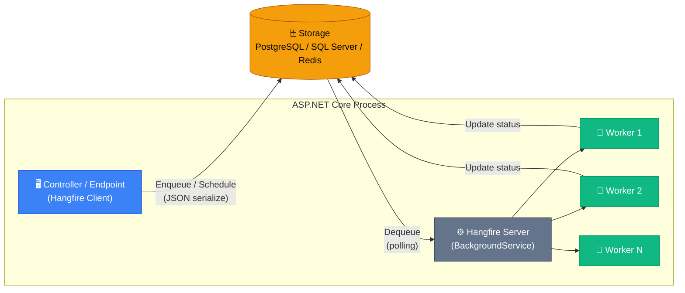
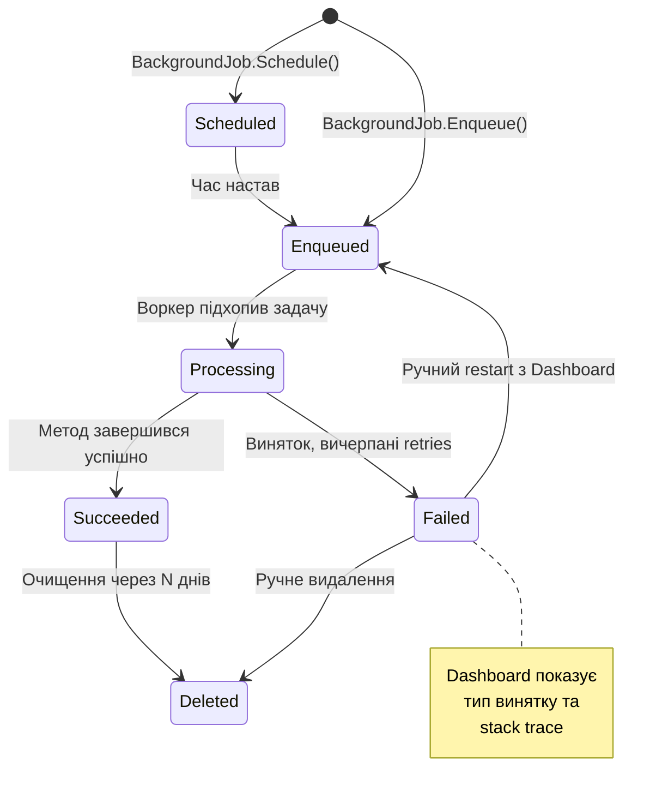

# Hangfire: Надійне планування фонових задач

У попередній статті ми розглянули `BackgroundService` — вбудований механізм ASP.NET Core для фонових задач. Він чудовий для простих сценаріїв: нескінченний цикл, що читає з черги, або таймер, що виконується кожні 5 хвилин. Але уявіть реальний виробничий застосунок із тисячами задач: надсилання листів, генерація звітів, обробка медіафайлів. Виникають питання, на які `BackgroundService` не має відповіді.

Що станеться, якщо сервер впаде посеред виконання задачі? Задача зникне назавжди, і ніхто навіть не дізнається. Як побачити, скільки задач очікує на виконання, скільки вже виконано, а скільки завершилися помилкою? Як повторити задачу, якщо зовнішній API тимчасово недоступний? Як запланувати надсилання Email о 9:00 за часовим поясом клієнта? Вбудований `BackgroundService` не відповідає на жоден із цих викликів — він лише запускає код у фоні.

Саме для вирішення цих проблем і існує **Hangfire** (бібліотека для надійного виконання фонових задач у .NET).

::note
**Що ми вивчимо:** архітектуру Hangfire, всі типи задач (fire-and-forget, delayed, recurring, continuations), правильну інтеграцію з ASP.NET Core DI, механізм retry, черги, Dashboard моніторинг та кращі практики продакшн-розгортання.
::

---

## Проблема надійності фонових задач

Перед тим як розглядати рішення, переконаємося, що ми чітко розуміємо проблему.

`BackgroundService` зберігає стан задач лише в пам'яті процесу. Це означає, що будь-яка подія, яка завершує процес — перезапуск сервера, виняток в основному потоці, оновлення застосунку, крах через нестачу пам'яті — знищує всі задачі, що очікують виконання або вже виконуються. З точки зору бізнес-логіки це катастрофа: якщо сервер впав посеред обробки замовлення на 50 000 грн, це чиясь фінансова втрата.

Крім того, вбудований `BackgroundService` не надає жодних інструментів для операційного управління: немає відображення черги задач, немає журналу виконань, немає способу вручну перезапустити задачу, що завершилась помилкою. У production-середовищі це означає сліпоту: ви не знаєте, чи виконуються ваші фонові задачі взагалі.

Порівняємо підходи систематично:

| Критерій | BackgroundService | Hangfire |
|---|---|---|
| Збереження задач при рестарті | ❌ Задачі губляться | ✅ Збережені в БД |
| Моніторинг / Dashboard | ❌ Відсутній | ✅ Вбудований веб-інтерфейс |
| Автоматичне повторення при помилці | ❌ Ручна реалізація | ✅ Вбудований exponential backoff |
| Cron-розклад | ❌ Ручна реалізація | ✅ Нативна підтримка |
| Ланцюжки задач | ❌ Ручна координація | ✅ Job Continuations |
| Розподілене виконання | ❌ Кожен сервер — окремо | ✅ Координація через БД |
| Складність налаштування | ✅ Проста | ⚡ Потребує Storage |
| Вартість | ✅ Безкоштовно | ✅ Core — MIT, Pro — платний |

Вибір між ними — це вибір між простотою і надійністю. Для внутрішніх утиліт і простих задач `BackgroundService` — достатньо. Для виробничих систем із бізнес-критичними фоновими операціями — Hangfire.

---

## Архітектура Hangfire

Щоб правильно використовувати Hangfire, потрібно зрозуміти три фундаментальних компоненти, що складають його архітектуру.

**Клієнт (Client)** — це частина вашого коду ASP.NET Core, що *ставить задачі в чергу*. Коли ви пишете `BackgroundJob.Enqueue(...)`, ви виступаєте клієнтом. Клієнт серіалізує інформацію про задачу (назву методу, аргументи) у JSON і записує у Storage.

**Сховище (Storage)** — це персистентна база даних, де зберігаються всі задачі та їх стан. Це серце Hangfire, саме завдяки йому досягається надійність: якщо сервер впаде, задача залишиться в базі і буде виконана після відновлення. Підтримуються SQL Server, PostgreSQL, MySQL, Redis та інші.

**Сервер (Server)** — це фоновий процес (реалізований як `BackgroundService` всередині!), що постійно читає задачі зі Storage, виконує їх і оновлює статус. Серверів може бути кілька на різних машинах — вони координуються через Storage, гарантуючи, що кожна задача виконається рівно один раз.

::mermaid



::

Ця архітектура дозволяє масштабування: можна запустити кілька екземплярів вашого застосунку, кожен із власним Hangfire Server. Всі вони читатимуть задачі з одного Storage, і кожна задача буде виконана рівно одним сервером — Hangfire використовує optimistic locking для захисту від дублювання.

### Storage Providers: вибір бази даних

Hangfire офіційно підтримує кілька Storage Providers. Вибір залежить від вашої інфраструктури:

| Provider | NuGet пакет | Переваги | Недоліки |
|---|---|---|---|
| SQL Server | `Hangfire.SqlServer` | Офіційний, найбільш протестований | Тільки SQL Server |
| PostgreSQL | `Hangfire.PostgreSql` | Open-source, відмінна продуктивність | Community-пакет |
| MySQL | `Hangfire.MySql.Core` | Для MySQL/MariaDB екосистем | Community-пакет |
| Redis | `Hangfire.Pro.Redis` | Максимальна швидкість (in-memory) | Pro-ліцензія, без персистентності |
| In-Memory | `Hangfire.InMemory` | Тестування | Дані губляться при рестарті |

Для більшості проєктів на .NET оптимальним є PostgreSQL або SQL Server — залежно від того, яку БД вже використовує ваш проєкт.

---

## Встановлення та налаштування

Розглянемо повне налаштування Hangfire з PostgreSQL у новому ASP.NET Core Minimal API проєкті.

::steps

### Крок 1: Встановлення NuGet пакетів

::code-group

```bash [dotnet CLI]
dotnet add package Hangfire
dotnet add package Hangfire.AspNetCore
dotnet add package Hangfire.PostgreSql
```

```bash [Package Manager]
Install-Package Hangfire
Install-Package Hangfire.AspNetCore
Install-Package Hangfire.PostgreSql
```

::

Тут ми встановлюємо три пакети: `Hangfire` — ядро бібліотеки, `Hangfire.AspNetCore` — інтеграція з ASP.NET Core DI і middleware, `Hangfire.PostgreSql` — реалізація Storage для PostgreSQL.

### Крок 2: Налаштування в Program.cs

```csharp [Program.cs]
using Hangfire;
using Hangfire.PostgreSql;

var builder = WebApplication.CreateBuilder(args);

// 1. Додаємо Hangfire сервіси
builder.Services.AddHangfire(config => config
    // UseSerilogLogProvider або UseConsoleLogProvider
    .SetDataCompatibilityLevel(CompatibilityLevel.Version_180)
    .UseSimpleAssemblyNameTypeSerializer()
    .UseRecommendedSerializerSettings()
    // Вказуємо Storage: рядок підключення до PostgreSQL
    .UsePostgreSqlStorage(options =>
    {
        options.UseNpgsqlConnection(
            builder.Configuration.GetConnectionString("DefaultConnection"));
    }));

// 2. Додаємо Hangfire Server — фоновий процес, що виконує задачі
builder.Services.AddHangfireServer(options =>
{
    // Кількість паралельних воркерів (за замовчуванням: ProcessorCount * 5)
    options.WorkerCount = Environment.ProcessorCount * 2;
    // Черги, які обробляє цей сервер (за замовчуванням: ["default"])
    options.Queues = ["critical", "default", "low"];
});

var app = builder.Build();

// 3. Підключаємо Dashboard для моніторингу (доступний за /hangfire)
app.UseHangfireDashboard("/hangfire", new DashboardOptions
{
    // У Development — відкритий доступ. У Production — обов'язково авторизація!
    Authorization = []
});

app.Run();
```

Розберемо ключові налаштування. `SetDataCompatibilityLevel(CompatibilityLevel.Version_180)` і `UseSimpleAssemblyNameTypeSerializer` — стандартні налаштування для сумісності серіалізації між версіями. `UseRecommendedSerializerSettings()` налаштовує оптимальні параметри JSON-серіалізації. `WorkerCount` контролює паралелізм: скільки задач може виконуватись одночасно. Для CPU-інтенсивних задач (відеоконвертація) варто зменшити до `ProcessorCount`, для I/O-задач (HTTP-запити, SQL) — можна залишити більше.

### Крок 3: Рядок підключення

```json [appsettings.json]
{
  "ConnectionStrings": {
    "DefaultConnection": "Host=localhost;Database=myapp;Username=postgres;Password=secret"
  }
}
```

### Крок 4: Автоматичне створення схеми Hangfire

При першому запуску Hangfire **автоматично** створює всі необхідні таблиці в базі даних. Для PostgreSQL це буде схема `hangfire` із таблицями: `job`, `state`, `jobparameter`, `jobqueue`, `server`, `hash`, `list`, `set`, `counter`, `aggregatedcounter`.

::warning
Переконайтеся, що користувач бази даних має права `CREATE TABLE` і `CREATE SCHEMA` для першого запуску. Після ініціалізації ці права можна відкликати.
::

::

---

## Типи задач

Hangfire підтримує чотири принципово різних типи задач. Кожен тип — це відповідь на конкретний сценарій.

::card-group

::card{title="🔥 Fire-and-forget" icon="i-lucide-zap"}

Виконати задачу **якомога швидше**, один раз. Ідеально для відправлення Email після реєстрації, логування подій, старту тривалих обчислень.

```csharp
BackgroundJob.Enqueue<IEmailService>(
    x => x.SendWelcomeAsync(userId));
```

::

::card{title="⏰ Delayed" icon="i-lucide-clock"}

Виконати задачу **через певний час**. Ідеально для нагадувань, пробних версій, відкладених дій.

```csharp
BackgroundJob.Schedule<IEmailService>(
    x => x.SendReminderAsync(userId),
    TimeSpan.FromDays(3));
```

::

::card{title="🔄 Recurring" icon="i-lucide-refresh-cw"}

Виконувати задачу **за розкладом** (Cron). Ідеально для нічних звітів, cleanup, синхронізації даних.

```csharp
RecurringJob.AddOrUpdate<ICleanupService>(
    "daily-cleanup",
    x => x.CleanOldRecordsAsync(),
    Cron.Daily);
```

::

::card{title="⛓️ Continuations" icon="i-lucide-git-branch"}

Виконати задачу **після завершення іншої**. Ідеально для multi-step процесів: завантаження → обробка → повідомлення.

```csharp
var jobId = BackgroundJob.Enqueue<IVideoService>(
    x => x.TranscodeAsync(videoId));
BackgroundJob.ContinueJobWith<INotifyService>(
    jobId, x => x.NotifyReadyAsync(videoId));
```

::

::

### Job State Machine

Кожна задача в Hangfire проходить через визначені стани. Розуміння цих станів критично для дебагінгу та моніторингу:

::mermaid



::

`Enqueued` — задача в черзі, очікує вільного воркера. `Processing` — воркер активно виконує задачу. `Succeeded` — задача завершена успішно, результат збережено. `Failed` — задача зазнала помилки після усіх спроб повторення. `Scheduled` — задача запланована на майбутнє.

---

## Детальний розгляд кожного типу задачі

### Fire-and-Forget: Найпростіший тип

`BackgroundJob.Enqueue` — це найбільш вживаний метод Hangfire. Задача потрапляє у чергу та виконується найближчим вільним воркером, зазвичай протягом кількох секунд.

Розглянемо повний приклад з обробником реєстрації нового користувача:

```csharp [Endpoints/AuthEndpoints.cs]
app.MapPost("/auth/register", async (
    RegisterRequest request,
    UserService userService,
    IBackgroundJobClient backgroundJobs) =>  // Hangfire клієнт через DI
{
    // Основна бізнес-логіка виконується синхронно в запиті
    var userId = await userService.CreateUserAsync(request);

    // Фонові задачі ставляться в чергу і виконуються після відповіді клієнту
    backgroundJobs.Enqueue<IEmailService>(
        x => x.SendWelcomeEmailAsync(userId));

    backgroundJobs.Enqueue<IAnalyticsService>(
        x => x.TrackRegistrationAsync(userId, request.Source));

    backgroundJobs.Enqueue<ISlackService>(
        x => x.NotifyTeamAsync($"Новий користувач: {request.Email}"));

    // Відповідаємо одразу, не чекаючи виконання фонових задач
    return Results.Created($"/users/{userId}", new { userId });
});
```

Зверніть увагу на ключовий момент: `IBackgroundJobClient` інжектується через конструктор так само, як будь-який інший сервіс. Hangfire автоматично реєструє його в DI-контейнері при виклику `AddHangfire`. Це дає можливість легко тестувати код — достатньо замокати `IBackgroundJobClient`.

### Delayed: Задачі з часовою затримкою

`BackgroundJob.Schedule` приймає `TimeSpan` або `DateTimeOffset` як другий аргумент. Hangfire зберігає задачу зі статусом `Scheduled` і переводить її до `Enqueued` лише коли настає вказаний час.

```csharp [Services/SubscriptionService.cs]
public class SubscriptionService
{
    private readonly IBackgroundJobClient _jobs;

    public SubscriptionService(IBackgroundJobClient jobs) => _jobs = jobs;

    public async Task StartTrialAsync(int userId)
    {
        // Одразу ставимо нагадування через 7 днів - "пробний період закінчується"
        _jobs.Schedule<IEmailService>(
            x => x.SendTrialExpiringAsync(userId),
            TimeSpan.FromDays(7));

        // І ще одне через 14 днів - "пробний період закінчився, підпишіться"
        _jobs.Schedule<IEmailService>(
            x => x.SendTrialExpiredAsync(userId),
            TimeSpan.FromDays(14));

        // Або з абсолютним часом - наприклад, наступне 1-е число місяця
        var nextBillingDate = GetNextBillingDate();
        _jobs.Schedule<IBillingService>(
            x => x.ProcessSubscriptionAsync(userId),
            nextBillingDate);
    }
}
```

Ця можливість дозволяє реалізувати цілі часові послідовності в момент реєстрації або оформлення підписки. Email-маркетинг, nurturing-кампанії, lifecycle-сповіщення — всі вони реалізуються через відкладені задачі.

### Recurring: Задачі за Cron-розкладом

Recurring Jobs — це аналог cron-задач у Linux, але з управлінням через код та Dashboard.

```csharp [Program.cs]
// Реєстрація recurring jobs при старті застосунку
app.MapGet("/setup-recurring-jobs", (IRecurringJobManager recurringJobs) =>
{
    // Щодня о 3:00 UTC — очистити старі дані
    recurringJobs.AddOrUpdate<ICleanupService>(
        "cleanup-old-notifications",           // Унікальний ідентифікатор
        x => x.DeleteOldNotificationsAsync(),
        "0 3 * * *",                           // Cron: 3:00 щодня
        new RecurringJobOptions
        {
            TimeZone = TimeZoneInfo.Utc
        });

    // Щопонеділка о 9:00 — тижневий звіт
    recurringJobs.AddOrUpdate<IReportService>(
        "weekly-report",
        x => x.GenerateWeeklyReportAsync(),
        Cron.Weekly(DayOfWeek.Monday, 9),      // Зручний хелпер
        new RecurringJobOptions
        {
            TimeZone = TimeZoneInfo.FindSystemTimeZoneById("FLE Standard Time") // Київ
        });

    // Кожні 5 хвилин — синхронізація курсів валют
    recurringJobs.AddOrUpdate<ICurrencyService>(
        "sync-exchange-rates",
        x => x.SyncRatesAsync(),
        "*/5 * * * *");                        // Кожні 5 хвилин

    return Results.Ok("Recurring jobs registered");
});
```

Розберемо Cron-синтаксис, оскільки він часто викликає запитання:

```
┌───────────── хвилина (0–59)
│ ┌───────────── година (0–23)
│ │ ┌───────────── день місяця (1–31)
│ │ │ ┌───────────── місяць (1–12)
│ │ │ │ ┌───────────── день тижня (0–7, де 0 і 7 — неділя)
│ │ │ │ │
* * * * *
```

| Cron-вираз | Опис |
|---|---|
| `* * * * *` | Щохвилини |
| `*/5 * * * *` | Кожні 5 хвилин |
| `0 * * * *` | Щогодини (на 0-й хвилині) |
| `0 3 * * *` | Щодня о 3:00 |
| `0 9 * * 1` | Щопонеділка о 9:00 |
| `0 0 1 * *` | Першого числа кожного місяця |
| `0 9 * * 1-5` | Щодня о 9:00 по буднях |
| `0 3 * * 0` | Кожної неділі о 3:00 |

::tip
Для генерації Cron-виразів використовуйте сайт [crontab.guru](https://crontab.guru) — він дозволяє інтерактивно налаштувати розклад і одразу побачити наступні дати виконання.
::

**Важливо про ідемпотентність:** Recurring Jobs мають бути **ідемпотентними** — повторний виклик не повинен призводити до некоректних наслідків. Якщо задача «надіслати тижневий звіт» виконається двічі (що може статися при проблемах із координацією), це не має відправити два листи. Додавайте перевірки: чи вже виконана задача за цей день?

### Continuations: Ланцюжки задач

Job Continuations дозволяють будувати складні пайплайни обробки, де кожен крок починається лише після успішного завершення попереднього.

```csharp [Services/DocumentPipelineService.cs]
public class DocumentPipelineService
{
    private readonly IBackgroundJobClient _jobs;

    public DocumentPipelineService(IBackgroundJobClient jobs) => _jobs = jobs;

    public void StartProcessingPipeline(int documentId)
    {
        // Крок 1: Завантажити документ з зовнішнього API
        var step1 = _jobs.Enqueue<IDocumentService>(
            x => x.DownloadFromExternalApiAsync(documentId));

        // Крок 2: Розпізнати текст (OCR) — починається ПІСЛЯ завершення Кроку 1
        var step2 = _jobs.ContinueJobWith<IOcrService>(
            step1, x => x.RecognizeTextAsync(documentId));

        // Крок 3: Перекласти текст — після OCR
        var step3 = _jobs.ContinueJobWith<ITranslationService>(
            step2, x => x.TranslateToUkrainianAsync(documentId));

        // Крок 4: Повідомити користувача — після перекладу
        _jobs.ContinueJobWith<INotificationService>(
            step3, x => x.NotifyDocumentReadyAsync(documentId));
    }
}
```

Кожен `ContinueJobWith` повертає `jobId` нової задачі, яку можна використати для наступного кроку ланцюга. Якщо будь-який крок завершиться помилкою, наступні кроки не будуть запущені — вони залишаться в стані `AwaitingState`.

---

## Інтеграція з ASP.NET Core DI

Це один із найважливіших аспектів використання Hangfire. Є правильний спосіб і неправильний.

### Чому не варто використовувати лямбда з closure

```csharp
// ❌ ПОГАНО — лямбда з closure
var productName = "iPhone 15";
BackgroundJob.Enqueue(() => Console.WriteLine($"Продукт: {productName}"));
```

Проблема в тому, що Hangfire серіалізує задачу в JSON для збереження в базі даних. Лямбда із захопленими змінними (closure) серіалізується як анонімний делегат — цей процес ненадійний і може призвести до помилок при десеріалізації, особливо після оновлення версії застосунку.

### Правильний підхід: типізований виклик через інтерфейс

```csharp
// ✅ ПРАВИЛЬНО — типізований виклик
BackgroundJob.Enqueue<IEmailService>(x => x.SendAsync(userId, subject, body));
```

Hangfire серіалізує це як: `{"Type": "IEmailService", "Method": "SendAsync", "Args": [42, "Welcome", "..."]}`. При десеріалізації він отримає `IEmailService` з DI-контейнера і викличе метод з відновленими аргументами.

```csharp [Services/EmailService.cs]
// Визначаємо інтерфейс
public interface IEmailService
{
    Task SendWelcomeEmailAsync(int userId);
    Task SendPasswordResetAsync(string email, string token);
    Task SendBulkNotificationAsync(int[] userIds, string subject, string body);
}

// Реалізація — отримує залежності через DI
public class EmailService : IEmailService
{
    private readonly AppDbContext _db;
    private readonly ILogger<EmailService> _logger;
    private readonly SmtpClient _smtp;

    public EmailService(
        AppDbContext db,
        ILogger<EmailService> logger,
        SmtpClient smtp)
    {
        _db = db;
        _logger = logger;
        _smtp = smtp;
    }

    public async Task SendWelcomeEmailAsync(int userId)
    {
        var user = await _db.Users.FindAsync(userId)
            ?? throw new InvalidOperationException($"User {userId} not found");

        await _smtp.SendMailAsync(
            new MailMessage("noreply@myapp.com", user.Email)
            {
                Subject = "Ласкаво просимо!",
                Body = $"Привіт, {user.Name}! Ваш обліковий запис активовано.",
                IsBodyHtml = false
            });

        _logger.LogInformation("Welcome email sent to user {UserId}", userId);
    }

    // ... інші методи
}
```

```csharp [Program.cs]
// Реєстрація в DI
builder.Services.AddScoped<IEmailService, EmailService>();
// Hangfire автоматично зареєструє IBackgroundJobClient та IRecurringJobManager
```

Коли Hangfire виконує задачу, він:
1. Читає запис задачі з БД: `{"Type": "IEmailService", "Method": "SendWelcomeEmailAsync", "Args": [42]}`
2. Створює DI scope (аналог до HTTP-запиту)
3. Отримує `IEmailService` з цього scope (зі всіма його залежностями — `AppDbContext`, логер, тощо)
4. Викликає метод із десеріалізованими аргументами
5. При успіху — записує стан `Succeeded`; при винятку — планує retry

### Обмеження на аргументи методів

Оскільки аргументи серіалізуються в JSON, не всі типи підходять:

::field-group

::field{name="✅ Прості типи" type="string, int, bool, DateTime, Guid"}
Серіалізуються бездоганно. Використовуйте їх коли можливо.
::

::field{name="✅ DTO / POCO" type="class / record"}
Класи та записи без циклічних посилань — добре серіалізуються.
::

::field{name="❌ DbContext, HttpContext" type="Scoped сервіси"}
Ніколи не передавайте їх як аргументи. Вони недоступні поза запитом.
::

::field{name="⚠️ Великі колекції" type="List<T>, byte[]"}
Уникайте передачі великих масивів. Замість цього передайте Id і читайте з БД у методі.
::

::

**Правило великого пальця:** Передавайте мінімум даних — краще ідентифікатор (`userId`, `orderId`), а сам метод нехай читає потрібні дані з бази. Це спрощує серіалізацію і гарантує, що метод завжди працює з актуальними даними, навіть якщо задача виконується через кілька годин після постановки в чергу.

---

## Механізм Retry та обробка помилок

Одна з найпотужніших можливостей Hangfire — автоматичне повторення задач при помилці. Якщо метод викидає виняток, Hangfire не просто логує помилку — він планує повторну спробу за алгоритмом exponential backoff.

### Алгоритм повторів

За замовчуванням Hangfire виконує **10 спроб** із зростаючими інтервалами:

| Спроба | Затримка |
|---|---|
| 1-ша помилка | ~15 секунд |
| 2-га помилка | ~1 хвилина |
| 3-тя помилка | ~5 хвилин |
| 4-та помилка | ~20 хвилин |
| 5-та помилка | ~1 година |
| … | … |
| 10-та помилка | ~12+ годин |
| Після 10 невдалих спроб | Статус `Failed`, ручний рестарт |

Ця стратегія ідеально підходить для тимчасових проблем: недоступний зовнішній API, завантаженість SMTP-сервера, тимчасова помилка мережі.

### Налаштування retry-поведінки

```csharp [Services/EmailService.cs]
using Hangfire;

public class EmailService : IEmailService
{
    // Глобальне налаштування для методу: максимум 5 спроб
    [AutomaticRetry(Attempts = 5, OnAttemptsExceeded = AttemptsExceededAction.Fail)]
    public async Task SendWelcomeEmailAsync(int userId)
    {
        // ... реалізація
    }

    // Для критичних задач — жодних retries, одразу в Failed
    [AutomaticRetry(Attempts = 0)]
    public async Task SendTransactionalEmailAsync(string to, string subject, string body)
    {
        // Транзакційні листи не варто повторювати — користувач може отримати дублікат
    }

    // Disable concurrent execution — захист від паралельного виконання
    [DisableConcurrentExecution(timeoutInSeconds: 60)]
    public async Task SyncUserDataAsync(int userId)
    {
        // Якщо воркер вже виконує цю задачу для userId — інший воркер зачекає 60 секунд
        // Захищає від race conditions при паралельному виконанні
    }
}
```

Атрибут `[AutomaticRetry]` накладається на рівні методу. `Attempts = 5` означає: 5 додаткових спроб після першої невдачі (тобто максимум 6 викликів). `OnAttemptsExceeded = AttemptsExceededAction.Fail` переводить задачу в стан `Failed` після вичерпання спроб; альтернатива `Delete` — видалити задачу.

`[DisableConcurrentExecution]` — ексклюзивне блокування: якщо ця задача вже виконується (беремо один і той самий `userId`), наступний виклик зачекає до 60 секунд і потім або виконається, або теж поставить у чергу. Це критично важливо для операцій, що не є ідемпотентними.

### Глобальні фільтри

```csharp [Program.cs]
builder.Services.AddHangfire(config => config
    .UsePostgreSqlStorage(...)
    // Глобальне налаштування: максимум 3 спроби для всіх задач
    .UseFilter(new AutomaticRetryAttribute { Attempts = 3 }));
```

Global filters — це аспектно-орієнтований підхід: одне налаштування застосовується до всіх задач, якщо немає більш специфічного атрибуту на методі.

---

## Черги (Queues): Пріоритезація задач

Черги дозволяють розділити задачі за пріоритетом і навіть за фізичними серверами.

### Розподіл задач по чергах

```csharp [Services/NotificationService.cs]
using Hangfire;

public class NotificationService
{
    private readonly IBackgroundJobClient _jobs;

    public NotificationService(IBackgroundJobClient jobs) => _jobs = jobs;

    // Критична черга — платіжні транзакції та підтвердження замовлень
    [Queue("critical")]
    public async Task ProcessPaymentConfirmationAsync(int paymentId)
    {
        // Логіка підтвердження платежу
    }

    // Черга за замовчуванням — звичайні нотифікації
    [Queue("default")]
    public async Task SendPushNotificationAsync(int userId, string message)
    {
        // Відправлення push-нотифікації
    }

    // Низький пріоритет — аналітика та маркетинг
    [Queue("low")]
    public async Task SendMarketingEmailAsync(int userId, string campaignId)
    {
        // Маркетинговий лист
    }
}
```

```csharp [Program.cs]
// Сервер з різними пріоритетами черг: спочатку critical, потім default, потім low
builder.Services.AddHangfireServer(options =>
{
    options.WorkerCount = 10;
    // Порядок важливий: воркери спочатку перевіряють "critical",
    // якщо там порожньо — "default", якщо і там порожньо — "low"
    options.Queues = ["critical", "default", "low"];
});
```

У продакшн-середовищах із різним навантаженням можна запустити окремий Hangfire Server тільки для критичних задач:

```csharp
// Окремий процес/сервіс тільки для критичних задач
builder.Services.AddHangfireServer(options =>
{
    options.ServerName = "critical-server";
    options.WorkerCount = 5;
    options.Queues = ["critical"]; // Тільки критична черга
});

// Окремий сервер для некритичних задач
builder.Services.AddHangfireServer(options =>
{
    options.ServerName = "default-server";
    options.WorkerCount = 20;
    options.Queues = ["default", "low"];
});
```

---

## Dashboard: Моніторинг та керування

Hangfire Dashboard — це вбудований веб-інтерфейс для моніторингу та управління задачами. Він доступний за адресою `/hangfire` (або іншою, яку ви вказали).

{.diagram-img}

<!-- Search Query: hangfire dashboard screenshot aspnet core monitoring -->

Dashboard надає:
- **Реальний час:** скільки задач виконується прямо зараз, скільки в кожній черзі
- **Графіки:** кількість успішних та невдалих задач за останні 24 години
- **Деталі задач:** для кожної задачі — аргументи, стан, час виконання, stack trace при помилці
- **Ручний retry:** можна перезапустити будь-яку задачу зі статусом `Failed` одним кліком
- **Recurring jobs:** перегляд та ручний запуск cron-задач

### Захист Dashboard у production

У production-середовищі Dashboard не повинен бути відкритий для всіх:

```csharp [Infrastructure/HangfireDashboardAuth.cs]
using Hangfire.Dashboard;

// Дозволяє доступ тільки авторизованим користувачам з роллю "Admin"
public class RoleBasedDashboardAuthFilter : IDashboardAuthorizationFilter
{
    public bool Authorize(DashboardContext context)
    {
        var httpContext = context.GetHttpContext();

        // Перевіряємо, чи користувач аутентифікований
        if (!httpContext.User.Identity?.IsAuthenticated ?? true)
            return false;

        // Перевіряємо роль
        return httpContext.User.IsInRole("Admin");
    }
}
```

```csharp [Program.cs]
app.UseHangfireDashboard("/hangfire", new DashboardOptions
{
    Authorization = [new RoleBasedDashboardAuthFilter()],
    // Заборонити виконання дій (тільки перегляд) для non-admin
    IsReadOnlyFunc = context => !context.GetHttpContext().User.IsInRole("SuperAdmin")
});
```

::caution
Ніколи не залишайте Dashboard відкритим без авторизації у production! Він дає повний контроль над задачами — можна переглядати аргументи (які можуть містити персональні дані), запускати задачі вручну та видаляти їх.
::

---

## Кращі практики та типові помилки

::accordion

::accordion-item{label="❌ Передача великих об'єктів як аргументів" icon="i-lucide-circle-x"}
**Проблема:** Передача `List<User>` з 10 000 записів в аргументах задачі. Hangfire серіалізує їх у JSON і зберігає в базі — це величезний запис, що уповільнює роботу з чергою.

**Рішення:** Передайте тільки ідентифікатор (`userId[]` або `batchId`) і читайте дані безпосередньо у виконуваному методі:
```csharp
// ❌ Погано
BackgroundJob.Enqueue<IEmailService>(x => x.SendBulkAsync(userList)); // 10К об'єктів

// ✅ Добре
var batchId = await db.CreateBatchAsync(userIds);
BackgroundJob.Enqueue<IEmailService>(x => x.SendBulkByBatchIdAsync(batchId));
```
::

::accordion-item{label="❌ Не-ідемпотентні recurring jobs" icon="i-lucide-circle-x"}
**Проблема:** Recurring Job «надіслати щоденний дайджест» запускається двічі через координаційну проблему. Користувачі отримують два листи.

**Рішення:** Додайте перевірку: чи вже виконана задача для цього часового вікна?
```csharp
public async Task SendDailyDigestAsync()
{
    var today = DateOnly.FromDateTime(DateTime.UtcNow);

    // Перевіряємо, чи вже надсилали дайджест сьогодні
    if (await _db.DigestLogs.AnyAsync(l => l.SentDate == today))
    {
        _logger.LogWarning("Daily digest already sent for {Date}, skipping", today);
        return;
    }

    // ... логіка надсилання
    _db.DigestLogs.Add(new DigestLog { SentDate = today });
    await _db.SaveChangesAsync();
}
```
::

::accordion-item{label="❌ Ігнорування CancellationToken" icon="i-lucide-circle-x"}
**Проблема:** Довготривала задача (конвертація відео, генерація звіту) не реагує на зупинку сервера. Процес `dotnet` зависає і не завершується при `docker stop`.

**Рішення:** Завжди приймайте і передавайте `CancellationToken` в асинхронних методах:
```csharp
// ✅ Метод приймає token через Hangfire's job cancellation token
public async Task GenerateReportAsync(int reportId, IJobCancellationToken token)
{
    foreach (var chunk in dataChunks)
    {
        token.ThrowIfCancellationRequested(); // Перевіряємо на кожній ітерації
        await ProcessChunkAsync(chunk);
    }
}
```
::

::accordion-item{label="⚠️ Перевантаження WorkerCount" icon="i-lucide-alert-triangle"}
**Проблема:** `WorkerCount = 100` при CPU-інтенсивних задачах (конвертація відео). 100 паралельних FFmpeg-процесів вичерпають CPU і пам'ять, уповільнивши весь сервер.

**Рішення:** Розділіть задачі по чергах із різними `WorkerCount`:
```csharp
// Окремий сервер для важких CPU-задач
builder.Services.AddHangfireServer(options =>
{
    options.ServerName = "cpu-intensive-server";
    options.WorkerCount = Environment.ProcessorCount; // Не більше ніж ядер CPU
    options.Queues = ["video-processing", "image-processing"];
});

// Окремий сервер для легких I/O задач
builder.Services.AddHangfireServer(options =>
{
    options.ServerName = "io-server";
    options.WorkerCount = 50; // Більше, бо задачі чекають мережу/диск
    options.Queues = ["emails", "notifications", "default"];
});
```
::

::accordion-item{label="❌ Зберігання секретів в аргументах" icon="i-lucide-circle-x"}
**Проблема:** `BackgroundJob.Enqueue<IEmailService>(x => x.SendAsync("user@example.com", apiKey))`. Аргументи зберігаються у відкритому вигляді в таблиці `hangfire.job` в базі даних. Якщо хтось має доступ до БД — він побачить `apiKey`.

**Рішення:** Ніколи не передавайте секрети як аргументи. Зберігайте їх у конфігурації або Secret Manager і зчитуйте всередині методу.
::

::

---

## Порівняння з альтернативами

Hangfire — не єдине рішення для планування задач у .NET. Розглянемо, коли варто обрати альтернативу:

| Критерій | Hangfire Core | Quartz.NET | MassTransit + RabbitMQ |
|---|---|---|---|
| **Ліцензія** | MIT (Core) | Apache 2.0 | Apache 2.0 |
| **Dashboard** | ✅ Вбудований | ❌ Немає | ✅ Через плагін |
| **Складність** | ✅ Проста | ⚡ Середня | ❌ Висока |
| **Distributed** | ✅ Через Storage | ✅ Через БД | ✅ Нативно |
| **Retry** | ✅ Вбудований | ⚡ Ручна реалізація | ✅ Вбудований |
| **Пріоритет задач** | ✅ Черги | ✅ Пріоритети | ✅ Черги |
| **Мікросервіси** | ⚡ Можливо | ⚡ Можливо | ✅ Оптимально |
| **Кількість задач/сек** | Середня | Висока | Дуже висока |

Hangfire — оптимальний вибір для монолітних або модульних застосунків, де потрібна швидка інтеграція, Dashboard і надійність до кількох тисяч задач на секунду. Для мікросервісів із вимогою горизонтального масштабування — Message Brokers (RabbitMQ, Azure Service Bus).

---

## Практичні завдання

### Рівень 1 — Базовий

**Завдання 1.1:** Налаштуйте Hangfire з `InMemory` Storage (для розробки) і зареєструйте простий `IGreeterService` з методом `SayHelloAsync(string name)`. Поставте 3 задачі в чергу через HTTP endpoint `POST /jobs/greet?name=...` і перевірте їх виконання в Dashboard.

**Завдання 1.2:** Додайте `[AutomaticRetry(Attempts = 3)]` до методу та змусьте його кинути `Exception` (наприклад, `throw new InvalidOperationException("Помилка для тесту")`). Спостерігайте в Dashboard, як задача переходить між спробами.

### Рівень 2 — Логіка

**Завдання 2.1:** Реалізуйте `IDailyReportService.GenerateReportAsync()` — recurring job, що виконується щодня о 8:00. Метод має перевіряти, чи вже виконаний звіт за сьогодні (зберігайте дату виконання в таблиці `ReportLogs`), і пропускати виконання якщо так.

**Завдання 2.2:** Створіть endpoint `POST /orders/{id}/process`, який запускає ланцюжок із трьох задач: `ValidateOrderAsync` → `ChargePaymentAsync` → `SendConfirmationEmailAsync`. Якщо `ChargePaymentAsync` кидає виняток — `SendConfirmationEmailAsync` не повинна виконуватись. Перевірте в Dashboard.

### Рівень 3 — Архітектура

**Завдання 3.1:** Реалізуйте систему пріоритетів задач. Створіть три черги: `critical`, `default`, `low`. Налаштуйте два Hangfire Server із різними `WorkerCount` та `Queues`. Для черги `critical` — максимум 3 воркери та максимум 1 спроба retry (якщо платіж не пройшов — не повторювати автоматично). Для черги `low` — 20 воркерів та 5 спроб retry. Задокументуйте своє рішення в коментарях.

---

## Підсумок

Hangfire трансформує підхід до фонових задач: замість крихких in-memory черг ви отримуєте надійну, персистентну, моніторингову систему:

::card-group

::card{title="Надійність" icon="i-lucide-shield-check"}
Задачі зберігаються в БД — жодна не загубиться при рестарті сервера. Exponential backoff гарантує повторне виконання при тимчасових помилках.
::

::card{title="Видимість" icon="i-lucide-monitor"}
Dashboard надає повний огляд: статистики, деталі кожної задачі, можливість ручного перезапуску та видалення.
::

::card{title="Гнучкість" icon="i-lucide-settings"}
Fire-and-forget, delayed, recurring, continuations — кожен бізнес-сценарій має свій тип задачі.
::

::card{title="Інтеграція" icon="i-lucide-plug"}
Нативна інтеграція з ASP.NET Core DI: задачі отримують сервіси через конструктор так само, як HTTP-обробники.
::

::

У наступних статтях ми застосуємо ці знання на практиці: реалізуємо асинхронну конвертацію зображень у WebP та підготовку відео до HLS-стрімінгу через FFmpeg.
