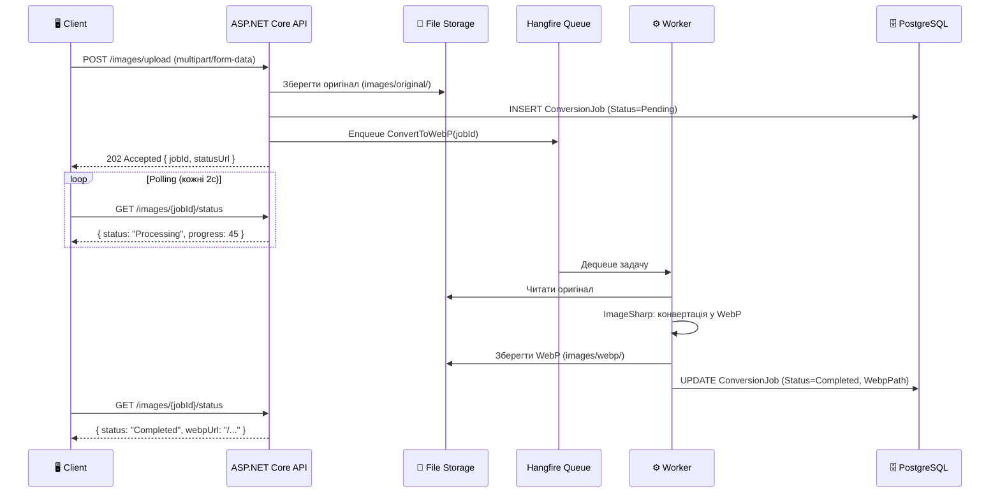

# Практика: Конвертація зображень у WebP через Hangfire

Уявіть себе розробником платформи для публікації статей. Редактор завантажує ілюстрацію у форматі JPEG — 8 мегапікселів, 6.5 МБ. Ваш сервер має перетворити цей файл на сучасний формат WebP з якістю 85%, зменшивши розмір до 400–500 КБ, і лише після цього зробити зображення доступним для читачів. Але конвертація займає від 2 до 20 секунд залежно від розміру файлу — надто довго для HTTP-відповіді.

Це класичний сценарій для Hangfire: HTTP-запит отримує файл, зберігає оригінал, ставить задачу конвертації в чергу і **одразу** повертає статус `202 Accepted`. Клієнт отримує `jobId` і може перевіряти прогрес через окремий endpoint.

::note
**Передумови:** знайомство з Hangfire (попередня стаття), базові знання ASP.NET Core Minimal API, Entity Framework Core. У цій статті ми будуємо повноцінний мікровертор зображень з нуля.
::

---

## Навіщо WebP? Розуміємо проблему

Перед тим як писати код, зрозуміємо цінність того, що ми робимо. Формат зображень — це не академічна деталь, а питання з реальними бізнес-наслідками.

WebP (Web Picture format) — формат зображень, розроблений Google у 2010 році. Він поєднує переваги JPEG (ефективне стиснення фотографій) і PNG (прозорість, геометричні зображення), водночас досягаючи значно кращого співвідношення розмір/якість.

| Формат | Середній розмір* | Прозорість | Анімація | Підтримка браузерів |
|---|---|---|---|---|
| JPEG | 100% (base) | ❌ | ❌ | ✅ Всі |
| PNG | 150–300% | ✅ | ❌ | ✅ Всі |
| **WebP** | **25–40%** | ✅ | ✅ | ✅ 97%+ |
| AVIF | 20–35% | ✅ | ✅ | ⚡ 90%+ |
| GIF | 200–500% | ✅ | ✅ | ✅ Всі |

*Порівняно з JPEG при аналогічній візуальній якості

Зменшення розміру зображень на 60–75% — це не просто економія трафіку. Сайти з меншими зображеннями завантажуються швидше, отримують кращий Core Web Vitals score від Google, і в результаті мають вищі позиції в пошуковій видачі. За даними Google, зменшення часу завантаження на 1 секунду підвищує конверсію на 7%.

Чому б не конвертувати в момент завантаження, прямо в HTTP-обробнику? Ось типові показники конвертації на сучасному Intel Core i7:

| Розмір JPEG | Час конвертації |
|---|---|
| 1 МБ (~ 2 мегапікселі) | 0.5–1 секунда |
| 5 МБ (~ 12 мегапікселів) | 3–7 секунд |
| 15 МБ (~ 36 мегапікселів, RAW DSLR) | 10–25 секунд |

HTTP-timeout більшості браузерів і reverse proxy — 30–60 секунд. Конвертація великого RAW-зображення може вичерпати цей ліміт. Навіть якщо ні — утримувати HTTP-з'єднання відкритим на 7 секунд для кожного завантаження JPEG — надто дорого для production-сервера.

---

## Архітектура рішення

Перед написанням коду накресліть архітектуру:

::mermaid



::

Ключова ідея: HTTP-запит і конвертація — **повністю незалежні процеси**. Клієнт отримує відповідь миттєво і самостійно перевіряє готовність результату.

---

## Структура проєкту

::code-tree

```csharp [Models/ConversionJob.cs]
// Модель бази даних — тут
```

```csharp [Models/ImageUploadResponse.cs]
// DTO відповіді — тут
```

```csharp [Services/IImageConversionService.cs]
// Інтерфейс сервісу — тут
```

```csharp [Services/ImageConversionService.cs]
// Реалізація — тут
```

```csharp [Services/StorageService.cs]
// Робота з файловою системою — тут
```

```csharp [Endpoints/ImageEndpoints.cs]
// Minimal API endpoints — тут
```

```csharp [Data/AppDbContext.cs]
// EF Core контекст — тут
```

```csharp [Program.cs]
// Реєстрація сервісів — тут
```

::

---

## Крок 1: Встановлення залежностей

::code-group

```bash [dotnet CLI]
dotnet add package Hangfire
dotnet add package Hangfire.AspNetCore
dotnet add package Hangfire.PostgreSql
dotnet add package SixLabors.ImageSharp
dotnet add package Microsoft.EntityFrameworkCore.Design
dotnet add package Npgsql.EntityFrameworkCore.PostgreSQL
```

```xml [ImageProcessor.csproj]
<ItemGroup>
  <PackageReference Include="Hangfire" Version="1.8.*" />
  <PackageReference Include="Hangfire.AspNetCore" Version="1.8.*" />
  <PackageReference Include="Hangfire.PostgreSql" Version="1.20.*" />
  <PackageReference Include="SixLabors.ImageSharp" Version="3.*" />
  <PackageReference Include="Npgsql.EntityFrameworkCore.PostgreSQL" Version="8.*" />
</ItemGroup>
```

::

`SixLabors.ImageSharp` — провідна .NET-бібліотека для роботи із зображеннями. На відміну від `System.Drawing` (яка потребує GDI+ і не підтримується на Linux), ImageSharp — це чисто керований (.NET Managed) код, що чудово працює у Docker, Linux і macOS.

---

## Крок 2: Модель даних

Нам потрібна таблиця для відстеження стану кожного завдання конвертації. Це дозволить клієнту перевіряти прогрес і зберегти посилання на результат.

```csharp [Models/ConversionJob.cs]
namespace ImageProcessor.Models;

// Статус задачі конвертації
public enum ConversionStatus
{
    Pending,     // Поставлено в чергу, ще не почалась
    Processing,  // Активно виконується воркером
    Completed,   // Успішно завершена
    Failed       // Завершена з помилкою
}

// Сутність бази даних — відповідає таблиці "ConversionJobs"
public class ConversionJob
{
    public int Id { get; set; }

    // Шлях до оригінального файлу (відносний від wwwroot)
    public string OriginalPath { get; set; } = string.Empty;

    // Шлях до WebP-результату (null поки не завершено)
    public string? WebpPath { get; set; }

    // Оригінальне ім'я файлу, яке завантажив користувач
    public string OriginalFileName { get; set; } = string.Empty;

    // Розмір оригінального файлу в байтах
    public long OriginalSizeBytes { get; set; }

    // Розмір WebP-результату в байтах (null поки не завершено)
    public long? WebpSizeBytes { get; set; }

    // Бажана якість WebP (1–100, за замовчуванням 85)
    public int TargetQuality { get; set; } = 85;

    // Поточний статус задачі
    public ConversionStatus Status { get; set; } = ConversionStatus.Pending;

    // ID задачі в Hangfire — для прямого запиту до IMonitoringApi
    public string? HangfireJobId { get; set; }

    // Повідомлення про помилку (якщо Status = Failed)
    public string? ErrorMessage { get; set; }

    public DateTime CreatedAt { get; set; } = DateTime.UtcNow;
    public DateTime? ProcessedAt { get; set; }
}
```

```csharp [Data/AppDbContext.cs]
using Microsoft.EntityFrameworkCore;
using ImageProcessor.Models;

namespace ImageProcessor.Data;

public class AppDbContext : DbContext
{
    public AppDbContext(DbContextOptions<AppDbContext> options) : base(options) { }

    public DbSet<ConversionJob> ConversionJobs => Set<ConversionJob>();

    protected override void OnModelCreating(ModelBuilder modelBuilder)
    {
        modelBuilder.Entity<ConversionJob>(entity =>
        {
            entity.HasKey(e => e.Id);
            entity.Property(e => e.OriginalPath).IsRequired().HasMaxLength(500);
            entity.Property(e => e.WebpPath).HasMaxLength(500);
            entity.Property(e => e.OriginalFileName).IsRequired().HasMaxLength(255);
            // Індекс по Status для швидкого запиту статистики
            entity.HasIndex(e => e.Status);
            entity.HasIndex(e => e.CreatedAt);
        });
    }
}
```

Поле `HangfireJobId` — це "міст" між нашою таблицею і Hangfire. Зберігаючи його, ми зможемо використати `IMonitoringApi` для отримання детального стану задачі прямо з Hangfire Storage.

---

## Крок 3: Сервіс зберігання файлів

Виокремимо роботу з файловою системою в окремий сервіс — це полегшить тестування і майбутню міграцію на S3 чи MinIO.

```csharp [Services/StorageService.cs]
namespace ImageProcessor.Services;

public interface IStorageService
{
    // Зберегти завантажений файл, повертає відносний шлях
    Task<string> SaveUploadedFileAsync(IFormFile file, string subfolder);
    // Зберегти байти у файл, повертає відносний шлях
    Task<string> SaveBytesAsync(byte[] data, string fileName, string subfolder);
    // Отримати абсолютний шлях з відносного
    string GetAbsolutePath(string relativePath);
    // Отримати публічний URL з відносного шляху
    string GetPublicUrl(string relativePath);
}

public class StorageService : IStorageService
{
    private readonly IWebHostEnvironment _env;
    private readonly ILogger<StorageService> _logger;

    // Кореневий каталог для збереження файлів (wwwroot/images)
    private readonly string _imagesRoot;

    public StorageService(IWebHostEnvironment env, ILogger<StorageService> logger)
    {
        _env = env;
        _logger = logger;
        _imagesRoot = Path.Combine(_env.WebRootPath, "images");

        // Створюємо базові директорії при ініціалізації
        Directory.CreateDirectory(Path.Combine(_imagesRoot, "original"));
        Directory.CreateDirectory(Path.Combine(_imagesRoot, "webp"));
    }

    public async Task<string> SaveUploadedFileAsync(IFormFile file, string subfolder)
    {
        // Генеруємо унікальне ім'я файлу, щоб уникнути конфліктів
        var extension = Path.GetExtension(file.FileName).ToLowerInvariant();
        var uniqueName = $"{Guid.NewGuid()}{extension}";

        var directory = Path.Combine(_imagesRoot, subfolder);
        Directory.CreateDirectory(directory); // Створюємо якщо не існує

        var absolutePath = Path.Combine(directory, uniqueName);
        var relativePath = Path.Combine("images", subfolder, uniqueName)
            .Replace(Path.DirectorySeparatorChar, '/'); // Нормалізуємо для URL

        await using var stream = new FileStream(absolutePath, FileMode.Create);
        await file.CopyToAsync(stream);

        _logger.LogInformation("Saved uploaded file: {RelativePath}", relativePath);
        return relativePath;
    }

    public async Task<string> SaveBytesAsync(byte[] data, string fileName, string subfolder)
    {
        var directory = Path.Combine(_imagesRoot, subfolder);
        Directory.CreateDirectory(directory);

        var absolutePath = Path.Combine(directory, fileName);
        var relativePath = Path.Combine("images", subfolder, fileName)
            .Replace(Path.DirectorySeparatorChar, '/');

        await File.WriteAllBytesAsync(absolutePath, data);
        return relativePath;
    }

    public string GetAbsolutePath(string relativePath)
        => Path.Combine(_env.WebRootPath, relativePath.Replace('/', Path.DirectorySeparatorChar));

    public string GetPublicUrl(string relativePath)
        => "/" + relativePath; // wwwroot служиться як коренева директорія
}
```

Зверніть увагу на `Path.Combine(_imagesRoot, "original")` і `Path.Combine(_imagesRoot, "webp")` — ми розкладаємо файли по директоріях, що спрощує адміністрування: легко знайти всі оригінали або очистити WebP-кеш.

---

## Крок 4: Сервіс конвертації зображень

Це серце нашого рішення — той код, який виконуватиметься Hangfire-воркером.

```csharp [Services/IImageConversionService.cs]
namespace ImageProcessor.Services;

public interface IImageConversionService
{
    // Головний метод: конвертує зображення і оновлює запис у БД
    // Викликається Hangfire; int = ConversionJob.Id
    Task ConvertToWebPAsync(int jobId);

    // Перевіряє, чи підтримується формат вхідного файлу
    bool IsFormatSupported(string fileExtension);
}
```

```csharp [Services/ImageConversionService.cs]
using Hangfire;
using ImageProcessor.Data;
using ImageProcessor.Models;
using Microsoft.EntityFrameworkCore;
using SixLabors.ImageSharp;
using SixLabors.ImageSharp.Formats.Webp;
using SixLabors.ImageSharp.Processing;

namespace ImageProcessor.Services;

public class ImageConversionService : IImageConversionService
{
    private readonly AppDbContext _db;
    private readonly IStorageService _storage;
    private readonly ILogger<ImageConversionService> _logger;

    // Підтримувані вхідні формати
    private static readonly HashSet<string> SupportedFormats =
        [".jpg", ".jpeg", ".png", ".bmp", ".tiff", ".tif", ".gif", ".webp"];

    public ImageConversionService(
        AppDbContext db,
        IStorageService storage,
        ILogger<ImageConversionService> logger)
    {
        _db = db;
        _storage = storage;
        _logger = logger;
    }

    // Атрибут[AutomaticRetry] — конвертація або спрацює, або ні.
    // При пошкодженому файлі retry не допоможуть, тому максимум 2 спроби
    [AutomaticRetry(Attempts = 2, OnAttemptsExceeded = AttemptsExceededAction.Fail)]
    public async Task ConvertToWebPAsync(int jobId)
    {
        // 1. Отримуємо запис задачі з БД
        var job = await _db.ConversionJobs.FindAsync(jobId)
            ?? throw new InvalidOperationException($"ConversionJob {jobId} не знайдено");

        // 2. Позначаємо статус як "Processing" одразу на початку
        job.Status = ConversionStatus.Processing;
        await _db.SaveChangesAsync();

        _logger.LogInformation("Starting WebP conversion for job {JobId}, file: {File}",
            jobId, job.OriginalFileName);

        try
        {
            // 3. Отримуємо абсолютний шлях до оригінального файлу
            var absoluteOriginalPath = _storage.GetAbsolutePath(job.OriginalPath);

            if (!File.Exists(absoluteOriginalPath))
                throw new FileNotFoundException(
                    $"Оригінальний файл не знайдено: {absoluteOriginalPath}");

            // 4. Завантажуємо зображення через ImageSharp
            // Image.LoadAsync автоматично визначає формат (JPEG, PNG, BMP тощо)
            using var image = await Image.LoadAsync(absoluteOriginalPath);

            _logger.LogInformation(
                "Image loaded: {Width}x{Height}px, format auto-detected",
                image.Width, image.Height);

            // 5. Конвертуємо в WebP з заданою якістю
            // WebpEncoder — спеціалізований енкодер від ImageSharp
            var encoder = new WebpEncoder
            {
                Quality = job.TargetQuality, // 1–100, рекомендовано 75–90
                Method = WebpEncodingMethod.BestQuality, // vs BestSpeed
                // Якщо вихідне зображення має прозорість (PNG з alpha-каналом)
                // UseAlphaCompression = true (за замовчуванням)
            };

            // 6. Кодуємо у MemoryStream, потім зберігаємо на диск
            // Це ефективніше, ніж писати напряму у FileStream через ImageSharp
            await using var memoryStream = new MemoryStream();
            await image.SaveAsWebpAsync(memoryStream, encoder);
            var webpBytes = memoryStream.ToArray();

            // 7. Формуємо ім'я вихідного файлу (zберігаємо GUID з оригіналу)
            var originalFileName = Path.GetFileNameWithoutExtension(job.OriginalPath
                .Split('/')
                .Last());
            var webpFileName = $"{originalFileName}.webp";

            // 8. Зберігаємо WebP на диск
            var webpRelativePath = await _storage.SaveBytesAsync(
                webpBytes, webpFileName, "webp");

            // 9. Оновлюємо запис у БД з результатами
            job.WebpPath = webpRelativePath;
            job.WebpSizeBytes = webpBytes.Length;
            job.Status = ConversionStatus.Completed;
            job.ProcessedAt = DateTime.UtcNow;

            await _db.SaveChangesAsync();

            // Логуємо ступінь стиснення для аналітики
            var compressionRatio = (1.0 - (double)webpBytes.Length / job.OriginalSizeBytes) * 100;
            _logger.LogInformation(
                "WebP conversion completed for job {JobId}. " +
                "Original: {OrigSize:N0} bytes, WebP: {WebpSize:N0} bytes, " +
                "Compression: {Ratio:F1}%",
                jobId, job.OriginalSizeBytes, webpBytes.Length, compressionRatio);
        }
        catch (Exception ex)
        {
            // При помилці оновлюємо статус і зберігаємо повідомлення про помилку
            job.Status = ConversionStatus.Failed;
            job.ErrorMessage = ex.Message;
            job.ProcessedAt = DateTime.UtcNow;
            await _db.SaveChangesAsync();

            _logger.LogError(ex, "WebP conversion failed for job {JobId}", jobId);

            // Перекидаємо виняток — Hangfire побачить його і запланує retry
            throw;
        }
    }

    public bool IsFormatSupported(string fileExtension)
        => SupportedFormats.Contains(fileExtension.ToLowerInvariant());
}
```

Розберемо найважливіші моменти. Крок 2 — негайне оновлення статусу до `Processing` критично важливе: якщо воркер впаде посеред конвертації, клієнт побачить, що задача "зависла" в стані Processing, і зможе відреагувати (наприклад, показати помилку після таймауту). Крок 6 — збереження через `MemoryStream` замість прямого запису у файл дозволяє нам отримати `byte[]` для збереження розміру в полі `WebpSizeBytes`. Крок 9 у `catch`-блоці — ми оновлюємо статус до `Failed` і лише потім `throw` — це гарантує, що статус відображатиметься навіть після вичерпання всіх retry.

### Обробка зображень великого розміру

Для зображень понад 50 МБ `Image.LoadAsync` може вичерпати пам'ять. У таких випадках ImageSharp підтримує потокову обробку:

```csharp [Services/ImageConversionService.cs]
// Для великих зображень: зменшуємо перед конвертацією
private static void ResizeIfNeeded(Image image, int maxWidth = 4096, int maxHeight = 4096)
{
    // Якщо зображення більше за максимальний розмір — зменшуємо пропорційно
    if (image.Width > maxWidth || image.Height > maxHeight)
    {
        image.Mutate(x => x.Resize(new ResizeOptions
        {
            Size = new Size(maxWidth, maxHeight),
            Mode = ResizeMode.Max,  // Зберігаємо пропорції, не обрізаємо
            Sampler = KnownResamplers.Lanczos3  // Якісний алгоритм ресемплювання
        }));
    }
}
```

`ResizeMode.Max` — ключовий параметр: зображення зменшується до `maxWidth × maxHeight`, але пропорції зберігаються. Якщо оригінал `3000 × 1500` і `maxWidth = 2000`, результат буде `2000 × 1000` (не 2000 × 2000).

---

## Крок 5: HTTP Endpoints

Тепер зв'яжемо все разом через Minimal API endpoints.

```csharp [Endpoints/ImageEndpoints.cs]
using Hangfire;
using Hangfire.Storage.Monitoring;
using ImageProcessor.Data;
using ImageProcessor.Models;
using ImageProcessor.Services;
using Microsoft.EntityFrameworkCore;

namespace ImageProcessor.Endpoints;

public static class ImageEndpoints
{
    public static void MapImageEndpoints(this IEndpointRouteBuilder app)
    {
        var group = app.MapGroup("/images")
            .WithTags("Images");

        group.MapPost("/upload", UploadImageAsync)
            .DisableAntiforgery(); // Для multipart form data

        group.MapGet("/{jobId:int}/status", GetJobStatusAsync);
        group.MapGet("/", GetAllJobsAsync);
    }

    // POST /images/upload — завантаження зображення та постановка в чергу
    private static async Task<IResult> UploadImageAsync(
        IFormFile file,
        AppDbContext db,
        IStorageService storage,
        IImageConversionService conversionService,
        IBackgroundJobClient backgroundJobs,
        int quality = 85)  // Query param: ?quality=85
    {
        // Валідація розширення файлу
        var extension = Path.GetExtension(file.FileName);
        if (!conversionService.IsFormatSupported(extension))
        {
            return Results.BadRequest(new
            {
                error = $"Непідтримуваний формат '{extension}'. " +
                        $"Дозволені: .jpg, .jpeg, .png, .bmp, .tiff, .gif"
            });
        }

        // Обмеження розміру: 50 МБ максимум
        const long maxSizeBytes = 50 * 1024 * 1024;
        if (file.Length > maxSizeBytes)
        {
            return Results.BadRequest(new
            {
                error = $"Файл занадто великий: {file.Length / 1024 / 1024} МБ. " +
                        $"Максимум: 50 МБ"
            });
        }

        // Зберігаємо оригінал на диск
        var originalPath = await storage.SaveUploadedFileAsync(file, "original");

        // Створюємо запис задачі в БД
        var job = new ConversionJob
        {
            OriginalPath = originalPath,
            OriginalFileName = file.FileName,
            OriginalSizeBytes = file.Length,
            TargetQuality = Math.Clamp(quality, 1, 100), // Clamp між 1 і 100
            Status = ConversionStatus.Pending
        };
        db.ConversionJobs.Add(job);
        await db.SaveChangesAsync();

        // Ставимо задачу конвертації в чергу Hangfire
        // Важливо: передаємо job.Id (int), НЕ сам об'єкт job
        var hangfireJobId = backgroundJobs.Enqueue<IImageConversionService>(
            x => x.ConvertToWebPAsync(job.Id));

        // Зберігаємо Hangfire JobId для подальшого моніторингу
        job.HangfireJobId = hangfireJobId;
        await db.SaveChangesAsync();

        // Повертаємо 202 Accepted — задача в черзі, результат буде пізніше
        return Results.Accepted($"/images/{job.Id}/status", new
        {
            jobId = job.Id,
            hangfireJobId,
            statusUrl = $"/images/{job.Id}/status",
            message = "Зображення завантажено. Конвертація розпочнеться найближчим часом.",
            originalFileName = file.FileName,
            originalSizeKb = file.Length / 1024
        });
    }

    // GET /images/{jobId}/status — перевірка стану задачі
    private static async Task<IResult> GetJobStatusAsync(
        int jobId,
        AppDbContext db,
        IMonitoringApi monitoringApi)  // Hangfire's monitoring API — через DI
    {
        var job = await db.ConversionJobs.FindAsync(jobId);
        if (job is null)
            return Results.NotFound(new { error = $"Job {jobId} не знайдено" });

        // Будуємо відповідь
        object response = job.Status switch
        {
            ConversionStatus.Pending => new
            {
                jobId = job.Id,
                status = "Pending",
                message = "Задача в черзі, очікується запуск...",
                originalFileName = job.OriginalFileName,
                queuedAt = job.CreatedAt
            },

            ConversionStatus.Processing => new
            {
                jobId = job.Id,
                status = "Processing",
                message = "Конвертація виконується...",
                originalFileName = job.OriginalFileName,
                startedAt = job.ProcessedAt // ProcessedAt тут ще не заповнено
            },

            ConversionStatus.Completed => new
            {
                jobId = job.Id,
                status = "Completed",
                originalFileName = job.OriginalFileName,
                originalSizeKb = job.OriginalSizeBytes / 1024,
                webpSizeKb = job.WebpSizeBytes / 1024,
                compressionPercent = job.WebpSizeBytes.HasValue
                    ? (int)((1.0 - (double)job.WebpSizeBytes.Value / job.OriginalSizeBytes) * 100)
                    : 0,
                webpUrl = $"/{job.WebpPath}",
                processedAt = job.ProcessedAt,
                durationMs = job.ProcessedAt.HasValue
                    ? (int)(job.ProcessedAt.Value - job.CreatedAt).TotalMilliseconds
                    : 0
            },

            ConversionStatus.Failed => new
            {
                jobId = job.Id,
                status = "Failed",
                error = job.ErrorMessage,
                originalFileName = job.OriginalFileName,
                failedAt = job.ProcessedAt
            },

            _ => new { jobId = job.Id, status = job.Status.ToString() }
        };

        return Results.Ok(response);
    }

    // GET /images/ — список усіх задач (для адмін-панелі або дебагінгу)
    private static async Task<IResult> GetAllJobsAsync(
        AppDbContext db,
        ConversionStatus? status = null,  // ?status=Completed
        int page = 1,
        int pageSize = 20)
    {
        var query = db.ConversionJobs.AsQueryable();

        if (status.HasValue)
            query = query.Where(j => j.Status == status.Value);

        var total = await query.CountAsync();
        var jobs = await query
            .OrderByDescending(j => j.CreatedAt)
            .Skip((page - 1) * pageSize)
            .Take(pageSize)
            .Select(j => new
            {
                j.Id,
                j.OriginalFileName,
                j.Status,
                j.OriginalSizeBytes,
                j.WebpSizeBytes,
                j.CreatedAt,
                j.ProcessedAt,
                WebpUrl = j.WebpPath != null ? $"/{j.WebpPath}" : null
            })
            .ToListAsync();

        return Results.Ok(new { total, page, pageSize, jobs });
    }
}
```

Конструкція `job.Status switch` — це pattern matching, що дозволяє повертати різні DTO залежно від стану задачі. Клієнт завжди знає, яке поле очікувати залежно від `status`.

---

## Крок 6: Реєстрація сервісів

```csharp [Program.cs]
using Hangfire;
using Hangfire.PostgreSql;
using ImageProcessor.Data;
using ImageProcessor.Endpoints;
using ImageProcessor.Services;
using Microsoft.EntityFrameworkCore;

var builder = WebApplication.CreateBuilder(args);

// EF Core + PostgreSQL
builder.Services.AddDbContext<AppDbContext>(opts =>
    opts.UseNpgsql(builder.Configuration.GetConnectionString("DefaultConnection")));

// Hangfire з PostgreSQL Storage
builder.Services.AddHangfire(config => config
    .SetDataCompatibilityLevel(CompatibilityLevel.Version_180)
    .UseSimpleAssemblyNameTypeSerializer()
    .UseRecommendedSerializerSettings()
    .UsePostgreSqlStorage(opts =>
        opts.UseNpgsqlConnection(
            builder.Configuration.GetConnectionString("DefaultConnection"))));

// Окремий Hangfire Server для image processing
// WorkerCount = кількість паралельних конвертацій
builder.Services.AddHangfireServer(opts =>
{
    // Обмежуємо паралелізм: конвертація CPU-інтенсивна
    opts.WorkerCount = Math.Max(1, Environment.ProcessorCount - 1);
    opts.Queues = ["image-processing", "default"];
    opts.ServerName = "image-processor-server";
});

// Наші сервіси
builder.Services.AddScoped<IImageConversionService, ImageConversionService>();
builder.Services.AddScoped<IStorageService, StorageService>();

// Для обробки multipart form data (завантаження файлів)
builder.Services.Configure<FormOptions>(opts =>
{
    opts.MultipartBodyLengthLimit = 50 * 1024 * 1024; // 50 МБ ліміт
});

var app = builder.Build();

// Автоматичні міграції EF Core при старті (для розробки)
using (var scope = app.Services.CreateScope())
{
    var db = scope.ServiceProvider.GetRequiredService<AppDbContext>();
    await db.Database.MigrateAsync();
}

app.UseStaticFiles(); // Для обслуговування файлів з wwwroot

app.UseHangfireDashboard("/hangfire", new DashboardOptions
{
    // У Dev-режимі — відкритий доступ
    Authorization = app.Environment.IsDevelopment() ? [] : [new RoleBasedDashboardAuthFilter()]
});

app.MapImageEndpoints();

app.Run();
```

Параметр `WorkerCount = Math.Max(1, Environment.ProcessorCount - 1)` — це прагматичне рішення. На машині з 8 ядрами це дає 7 воркерів для конвертації, залишаючи 1 ядро для HTTP-запитів та операційної системи. На однопроцесорній машині — завжди мінімум 1 воркер.

---

## Крок 7: Тестування через .http файл

```http
### Завантажити JPEG для конвертації
POST http://localhost:5000/images/upload?quality=80
Content-Type: multipart/form-data; boundary=----FormBoundary

------FormBoundary
Content-Disposition: form-data; name="file"; filename="photo.jpg"
Content-Type: image/jpeg

< ./test-images/photo.jpg
------FormBoundary--

### Відповідь: 202 Accepted
### { "jobId": 1, "statusUrl": "/images/1/status", ... }

---

### Перевірити статус задачі
GET http://localhost:5000/images/1/status

### Список завершених задач
GET http://localhost:5000/images/?status=Completed&page=1&pageSize=10

### Відкрити Dashboard
# http://localhost:5000/hangfire
```

---

## Типові помилки та їх вирішення

::accordion

::accordion-item{label="System.OutOfMemoryException при великих зображеннях" icon="i-lucide-alert-triangle"}
**Причина:** ImageSharp завантажує все зображення в пам'ять. RAW-знімок 36 MП займає ~100–150 МБ in-memory.

**Рішення:**
```csharp
// Обмежити максимальний розмір файлу на рівні endpoint
if (file.Length > 20 * 1024 * 1024) // 20 МБ
    return Results.BadRequest("Файл занадто великий");

// Або встановити максимальну роздільну здатність у конфігурації ImageSharp
Configuration.Default.ReadOrigin = ReadOrigin.Begin;
```
::

::accordion-item{label="Задача зависла в статусі Processing" icon="i-lucide-alert-triangle"}
**Причина:** Воркер впав під час конвертації. Hangfire через ~30 хвилин визначить воркер як "мертвий" і повторить задачу автоматично (якщо є retry).

**Рішення:** Якщо хочете зменшити час очікування, налаштуйте `InvisibilityTimeout`:
```csharp
builder.Services.AddHangfire(config => config
    .UsePostgreSqlStorage(opts =>
    {
        opts.UseNpgsqlConnection(connectionString);
        opts.InvisibilityTimeout = TimeSpan.FromMinutes(5); // 5 хв замість 30
    }));
```
::

::accordion-item{label="Пошкоджений або непідтримуваний формат файлу" icon="i-lucide-alert-triangle"}
**Причина:** ImageSharp кидає `UnknownImageFormatException` при завантаженні файлів не-зображень або пошкоджених файлів.

**Рішення:** Фільтрувати на рівні upload endpoint і обробляти виняток у ConvertToWebPAsync:
```csharp
catch (UnknownImageFormatException ex)
{
    job.Status = ConversionStatus.Failed;
    job.ErrorMessage = "Непідтримуваний або пошкоджений формат зображення";
    await _db.SaveChangesAsync();
    // НЕ перекидаємо — не потрібні retry для пошкоджених файлів
    _logger.LogWarning(ex, "Unknown image format for job {JobId}", jobId);
}
```
::

::

---

## Практичні завдання

### Рівень 1 — Базовий

**Завдання 1.1:** Додайте нову колонку `TargetMaxWidth` (int?, nullable) до `ConversionJob`. Якщо вона задана, перед конвертацією у WebP виконайте resize зображення до цієї ширини, зберігаючи пропорції. Передавайте значення як query parameter `?maxWidth=1920`.

**Завдання 1.2:** Додайте endpoint `DELETE /images/{jobId}` — видалити запис із БД і пов'язані файли (оригінал та WebP) з диска. Якщо задача ще в стані `Processing` — повертати `409 Conflict`.

### Рівень 2 — Логіка

**Завдання 2.1:** Реалізуйте endpoint `POST /images/upload-batch` — приймати масив файлів (`IFormFileCollection`), для кожного створити окремий `ConversionJob` і окрему Hangfire задачу. Повертати масив `jobId`'ів. Додайте endpoint `GET /images/batch/{batchId}/status` що агрегує статус по всіх задачах батчу.

**Завдання 2.2:** Додайте `RecurringJob` що щоночі о 2:00 видаляє `ConversionJob` зі статусом `Completed`, старші за 30 днів, та відповідні файли з диска.

### Рівень 3 — Архітектура

**Завдання 3.1:** Реалізуйте генерацію **thumbnail** (мініатюри) як Job Continuation. Після успішного завершення `ConvertToWebPAsync` автоматично ставиться в чергу задача `GenerateThumbnailAsync(jobId, maxSize: 200)`, яка створює квадратну мініатюру 200×200 (з обрізанням по центру). Збережіть шлях до мініатюри в окремому полі `ThumbnailPath` в `ConversionJob`.

---

## Підсумок

Ми побудували повноцінний асинхронний pipeline конвертації зображень:

- **Завантаження** відбувається миттєво — HTTP-запит не блокується на конвертації
- **Hangfire** надійно зберігає задачу в PostgreSQL — навіть перезапуск сервера не втратить роботу
- **ImageSharp** виконує конвертацію у WebP з налаштованою якістю
- **Polling endpoint** дозволяє клієнту відстежувати прогрес у реальному часі
- **Dashboard** надає повний огляд усіх задач без додаткового коду

У наступній статті ми розглянемо значно складніший сценарій: транскодування відео у формат HLS для адаптивного стрімінгу через FFmpeg і ланцюжки Hangfire Job Continuations.
