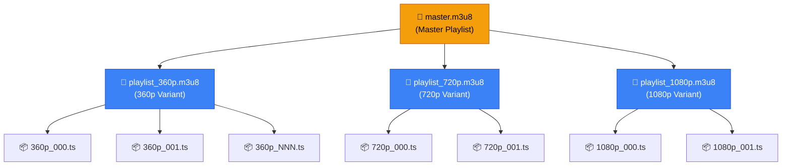

# Практика: Підготовка відео до HLS-стрімінгу через Hangfire

Коли Moodle, YouTube або Netflix показують відео — вони не просто роздають `.mp4` файл. Вони транслюють **HLS (HTTP Live Streaming)** — форматований набір дрібних відрізків відео (сегментів) разом із файлом-маніфестом, що описує, де ці сегменти знаходяться. Завдяки цьому відеоплеєр може динамічно перемикатися між різними якостями залежно від швидкості інтернету користувача: поганий зв'язок — 360p, відмінний — 1080p.

У цій статті ми побудуємо повноцінний сервіс транскодування відео: від завантаження `.mp4` до готового HLS-потоку, доступного для відтворення у браузері. Orchestration виконає Hangfire через Job Continuations — ланцюжок залежних задач.

::note
**Передумови:** знайомство з Hangfire (стаття 10) та Job Continuations зокрема. FFmpeg має бути встановлений на сервері. Рекомендується переглянути попередню практичну статтю про конвертацію зображень — архітектурні патерни аналогічні.
::

---

## Що таке HLS і чому це важливо

HLS (HTTP Live Streaming) — протокол адаптивного стрімінгу, розроблений Apple у 2009 році та стандартизований у RFC 8216. Він перетворює відеофайл на набір невеликих (зазвичай 4–10 секундних) сегментів і текстові файли-маніфести (`.m3u8`), що описують ці сегменти.

Для розуміння HLS-структури розглянемо аналогію. Уявіть книгу, розбиту на розділи. Замість того щоб давати читачеві одразу всю книгу (що важко і довго), ви даєте йому **зміст** (master playlist), а потім — тільки ті розділи, що він зараз читає (сегменти). Якщо читач хоче просту версію – скорочену (360p), або повну (1080p) — він просто обирає відповідний "видання" зі змісту (variant playlist).

::mermaid



::

### HLS vs DASH: вибір формату

| Критерій | HLS | MPEG-DASH |
|---|---|---|
| Розробник | Apple | MPEG стандарт |
| Підтримка браузерів | ✅ Safari native, Chrome/Firefox через hls.js | ✅ Chrome native, Safari через dash.js |
| Підтримка iOS/macOS | ✅ Нативна | ⚡ Через бібліотеки |
| Затримка (Low Latency) | ✅ HLS-LL специфікація | ✅ CMAF |
| Шифрування (DRM) | ✅ AES-128, FairPlay | ✅ Widevine, PlayReady |
| Де використовується | YouTube, Twitch, Netflix, Moodle | YouTube (альтернативно), Hulu |

Для більшості веб-застосунків HLS є оптимальним вибором через просту підтримку через `hls.js` в усіх браузерах і нативну підтримку в Safari (iOS і macOS).

### Чому не можна просто роздавати .mp4?

Технічно браузер може відтворити `.mp4` через `<video src="...">`. Але є критичні обмеження:

- **Потокова передача (Progressive Download):** весь файл завантажується лінійно. При 1080p відео об'ємом 2 ГБ — користувач чекає.
- **Seekbar:** переміщення по відео (seek) ефективне тільки якщо файл правильно атомфрагментований (faststart). Для великих файлів — затримки.
- **Немає адаптивного бітрейту:** один файл — одна якість. Поганий інтернет = постійна буферизація.
- **Навантаження на сервер:** кожен відтворюваний відеофайл — один відкритий HTTP keep-alive. При 1000 одночасних переглядів — 1000 відкритих з'єднань.

HLS вирішує всі ці проблеми: маленькі сегменти завантажуються швидко, плеєр вибирає якість динамічно, сервер (або CDN) ефективно обслуговує маленькі статичні файли.

---

## Архітектура рішення: Job Continuations

Транскодування відео — складний багатокроковий процес. Ми не можемо виконати все в одній Hangfire задачі без ризику простою. Натомість використаємо **Job Continuations** — ланцюжок задач, де кожна наступна починається лише після успішного завершення попередньої.

::mermaid

```mermaid
graph LR
    UPLOAD["📤 HTTP Upload\n/videos/upload"]
    A["Job 1\n📊 AnalyzeVideo\n(метадані, вибір якостей)"]
    B["Job 2\n🎬 Transcode 360p"]
    C["Job 3\n🎬 Transcode 720p"]
    D["Job 4\n🎬 Transcode 1080p"]
    E["Job 5\n📄 GenerateMasterPlaylist"]

    UPLOAD -->|Enqueue| A
    A -->|ContinueWith| B
    A -->|ContinueWith| C
    A -->|ContinueWith| D
    B -->|ContinueWith (all)| E
    C -->|ContinueWith (all)| E
    D -->|ContinueWith (all)| E

    style UPLOAD fill:#64748b,stroke:#334155,color:#fff
    style A fill:#f59e0b,stroke:#b45309,color:#000
    style B fill:#3b82f6,stroke:#1d4ed8,color:#fff
    style C fill:#3b82f6,stroke:#1d4ed8,color:#fff
    style D fill:#3b82f6,stroke:#1d4ed8,color:#fff
    style E fill:#10b981,stroke:#059669,color:#fff
```

::

Крок аналізу визначає, які якості підготувати (немає сенсу робити 1080p з відео, знятого у 480p — апскейлінг погіршує якість). Кроки транскодування виконуються паралельно — три воркери одночасно готують 360p, 720p і 1080p. Після їх завершення — генерується master playlist, що об'єднує всі варіанти.

---

## Встановлення залежностей

### FFmpeg

FFmpeg — найпотужніший інструмент для роботи з медіафайлами. Це системна залежність, яка має бути встановлена на сервері.

::tabs

::tabs-item{label="macOS"}
```bash
# Через Homebrew
brew install ffmpeg
```
::

::tabs-item{label="Ubuntu/Debian"}
```bash
sudo apt update && sudo apt install -y ffmpeg
```
::

::tabs-item{label="Docker"}
```dockerfile
FROM mcr.microsoft.com/dotnet/aspnet:8.0
# Встановлюємо FFmpeg у контейнер
RUN apt-get update && apt-get install -y ffmpeg && rm -rf /var/lib/apt/lists/*
```
::

::tabs-item{label="Windows"}
```powershell
# Через Chocolatey
choco install ffmpeg
# Або через winget
winget install Gyan.FFmpeg
```
::

::

### NuGet пакети

::code-group

```bash [dotnet CLI]
dotnet add package Hangfire
dotnet add package Hangfire.AspNetCore
dotnet add package Hangfire.PostgreSql
dotnet add package FFMpegCore
```

```xml [VideoTranscoder.csproj]
<PackageReference Include="FFMpegCore" Version="5.*" />
<PackageReference Include="Hangfire" Version="1.8.*" />
<PackageReference Include="Hangfire.AspNetCore" Version="1.8.*" />
<PackageReference Include="Hangfire.PostgreSql" Version="1.20.*" />
```

::

`FFMpegCore` — .NET-обгортка навколо FFmpeg CLI. Вона надає зручний fluent API для побудови FFmpeg-команд, отримання метаданих медіафайлів і відстеження прогресу транскодування через події.

---

## Моделі даних

```csharp [Models/VideoJob.cs]
namespace VideoTranscoder.Models;

public enum VideoJobStatus
{
    Uploading,      // Файл завантажується (HTTP)
    Analyzing,      // Job 1: аналіз метаданих
    Transcoding,    // Job 2-4: транскодування
    Finalizing,     // Job 5: генерація master playlist
    Completed,      // Готово до відтворення
    Failed          // Помилка на одному з кроків
}

// Цільова якість транскодування
public class VideoResolution
{
    public string Name { get; init; } = string.Empty;   // "360p", "720p", "1080p"
    public int Width { get; init; }                      // 640, 1280, 1920
    public int Height { get; init; }                     // 360, 720, 1080
    public int VideoBitrateKbps { get; init; }           // 800, 2500, 5000
    public int AudioBitrateKbps { get; init; }           // 96, 128, 192

    // Зручна перевірка: чи підтримує оригінал цю роздільну здатність
    public bool IsApplicableTo(int sourceWidth, int sourceHeight)
        => sourceWidth >= Width && sourceHeight >= Height;
}

// Головна сутність задачі транскодування
public class VideoJob
{
    public int Id { get; set; }
    public string OriginalPath { get; set; } = string.Empty;
    public string OriginalFileName { get; set; } = string.Empty;
    public long OriginalSizeBytes { get; set; }

    // Метадані відео (заповнюються на кроці аналізу)
    public int? SourceWidth { get; set; }
    public int? SourceHeight { get; set; }
    public double? DurationSeconds { get; set; }
    public string? SourceCodec { get; set; }

    // Шлях до директорії з HLS-файлами (відносний від wwwroot)
    public string? HlsOutputDirectory { get; set; }

    // URL master playlist (заповнюється після Job 5)
    public string? MasterPlaylistUrl { get; set; }

    // JSON-серіалізований список обраних якостей (після аналізу)
    public string? SelectedResolutionsJson { get; set; }

    public VideoJobStatus Status { get; set; } = VideoJobStatus.Uploading;
    public string? HangfireAnalysisJobId { get; set; }
    public string? ErrorMessage { get; set; }

    public DateTime CreatedAt { get; set; } = DateTime.UtcNow;
    public DateTime? CompletedAt { get; set; }
}
```

Зверніть увагу на поле `SelectedResolutionsJson` — воно зберігає JSON-масив обраних роздільностей. Це рішення прийнято свідомо: список якостей визначається динамічно на кроці аналізу, після чого його потрібно передати в наступні кроки. Замість складних відносин між таблицями — проста серіалізація.

---

## Крок 1: Сервіс аналізу відео

```csharp [Services/VideoAnalysisService.cs]
using FFMpegCore;
using System.Text.Json;
using VideoTranscoder.Models;

namespace VideoTranscoder.Services;

public interface IVideoAnalysisService
{
    // Аналізує відео та визначає оптимальні варіанти якості
    Task<List<VideoResolution>> AnalyzeAndSelectResolutionsAsync(int videoJobId);
}

public class VideoAnalysisService : IVideoAnalysisService
{
    // Всі підтримувані якості, від найнижчої до найвищої
    private static readonly List<VideoResolution> AllResolutions =
    [
        new() { Name = "360p",  Width = 640,  Height = 360,  VideoBitrateKbps = 800,  AudioBitrateKbps = 96  },
        new() { Name = "480p",  Width = 854,  Height = 480,  VideoBitrateKbps = 1400, AudioBitrateKbps = 128 },
        new() { Name = "720p",  Width = 1280, Height = 720,  VideoBitrateKbps = 2500, AudioBitrateKbps = 128 },
        new() { Name = "1080p", Width = 1920, Height = 1080, VideoBitrateKbps = 5000, AudioBitrateKbps = 192 },
    ];

    private readonly AppDbContext _db;
    private readonly IStorageService _storage;
    private readonly ILogger<VideoAnalysisService> _logger;

    public VideoAnalysisService(
        AppDbContext db,
        IStorageService storage,
        ILogger<VideoAnalysisService> logger)
    {
        _db = db;
        _storage = storage;
        _logger = logger;
    }

    public async Task<List<VideoResolution>> AnalyzeAndSelectResolutionsAsync(int videoJobId)
    {
        var job = await _db.VideoJobs.FindAsync(videoJobId)
            ?? throw new InvalidOperationException($"VideoJob {videoJobId} not found");

        job.Status = VideoJobStatus.Analyzing;
        await _db.SaveChangesAsync();

        var absolutePath = _storage.GetAbsolutePath(job.OriginalPath);

        // FFMpegCore: отримати метадані медіафайлу
        // Під капотом виконує: ffprobe -v quiet -print_format json -show_format -show_streams "path"
        var mediaInfo = await FFProbe.AnalyseAsync(absolutePath);
        var videoStream = mediaInfo.VideoStreams.FirstOrDefault()
            ?? throw new InvalidOperationException("Відеопоток у файлі не знайдено");

        // Зберігаємо метадані в БД
        job.SourceWidth = videoStream.Width;
        job.SourceHeight = videoStream.Height;
        job.DurationSeconds = mediaInfo.Duration.TotalSeconds;
        job.SourceCodec = videoStream.CodecName; // h264, hevc, av1, тощо

        _logger.LogInformation(
            "Video analyzed: {W}x{H}, {Duration:F1}s, codec: {Codec}",
            videoStream.Width, videoStream.Height,
            mediaInfo.Duration.TotalSeconds, videoStream.CodecName);

        // Обираємо лише ті якості, для яких у вихідного відео достатня роздільна здатність
        // Немає сенсу робити 1080p якщо оригінал 480p — це апскейлінг, погана якість
        var selectedResolutions = AllResolutions
            .Where(r => r.IsApplicableTo(videoStream.Width, videoStream.Height))
            .ToList();

        // Завжди включаємо мінімум найнижчу якість
        if (selectedResolutions.Count == 0)
            selectedResolutions.Add(AllResolutions[0]);

        // Зберігаємо список обраних якостей для наступних кроків
        job.SelectedResolutionsJson = JsonSerializer.Serialize(selectedResolutions);
        job.Status = VideoJobStatus.Transcoding;
        await _db.SaveChangesAsync();

        _logger.LogInformation(
            "Selected {Count} resolutions for job {JobId}: {Resolutions}",
            selectedResolutions.Count, videoJobId,
            string.Join(", ", selectedResolutions.Select(r => r.Name)));

        return selectedResolutions;
    }
}
```

Метод `FFProbe.AnalyseAsync` — це FFMpegCore API для запуску `ffprobe` (утиліта для читання метаданих медіафайлів). Він повертає об'єкт `IMediaAnalysis` з повним описом потоків (відео, аудіо, субтитри), тривалості, бітрейту та кодеків.

---

## Крок 2: Сервіс транскодування в HLS

Це найскладніший і найважливіший компонент. Кожен виклик цього методу транскодує відео в **одну конкретну якість** і генерує відповідний `.m3u8` playlist.

```csharp [Services/HlsTranscodingService.cs]
using FFMpegCore;
using FFMpegCore.Arguments;
using FFMpegCore.Enums;
using System.Text.Json;
using VideoTranscoder.Models;

namespace VideoTranscoder.Services;

public interface IHlsTranscodingService
{
    // Транскодує відео в одну якість і генерує variant playlist
    Task TranscodeToResolutionAsync(int videoJobId, string resolutionName);

    // Генерує master.m3u8, що об'єднує всі варіанти
    Task GenerateMasterPlaylistAsync(int videoJobId);
}

public class HlsTranscodingService : IHlsTranscodingService
{
    private readonly AppDbContext _db;
    private readonly IStorageService _storage;
    private readonly ILogger<HlsTranscodingService> _logger;

    // Тривалість HLS-сегменту в секундах
    // 4 секунди — баланс між латентністю переключення якості та кількістю файлів
    private const int SegmentDurationSeconds = 4;

    public HlsTranscodingService(
        AppDbContext db,
        IStorageService storage,
        ILogger<HlsTranscodingService> logger)
    {
        _db = db;
        _storage = storage;
        _logger = logger;
    }

    [AutomaticRetry(Attempts = 2)]
    public async Task TranscodeToResolutionAsync(int videoJobId, string resolutionName)
    {
        var job = await _db.VideoJobs.FindAsync(videoJobId)
            ?? throw new InvalidOperationException($"VideoJob {videoJobId} not found");

        // Десеріалізуємо список якостей, збережений кроком аналізу
        var resolutions = JsonSerializer.Deserialize<List<VideoResolution>>(
            job.SelectedResolutionsJson ?? "[]")!;

        var resolution = resolutions.FirstOrDefault(r => r.Name == resolutionName)
            ?? throw new InvalidOperationException(
                $"Resolution '{resolutionName}' not found in job {videoJobId}");

        // Визначаємо директорію для HLS-файлів
        // Структура: videos/hls/{jobId}/{resolutionName}/
        var hlsDir = job.HlsOutputDirectory
            ?? Path.Combine("videos", "hls", videoJobId.ToString());

        var resolutionDir = Path.Combine(hlsDir, resolutionName);
        var absoluteResDir = _storage.GetAbsolutePath(resolutionDir);
        Directory.CreateDirectory(absoluteResDir);

        // Якщо це перша якість — зберігаємо базову директорію HLS
        if (job.HlsOutputDirectory is null)
        {
            job.HlsOutputDirectory = hlsDir;
            await _db.SaveChangesAsync();
        }

        var inputPath = _storage.GetAbsolutePath(job.OriginalPath);
        // Шаблон імені сегментів: 720p_000.ts, 720p_001.ts, ...
        var segmentPattern = Path.Combine(absoluteResDir, $"{resolutionName}_%03d.ts");
        // Шлях до playlist для цієї якості
        var playlistPath = Path.Combine(absoluteResDir, $"playlist_{resolutionName}.m3u8");

        _logger.LogInformation(
            "Transcoding job {JobId} to {Resolution}: {W}x{H} @{Bitrate}kbps",
            videoJobId, resolutionName, resolution.Width, resolution.Height,
            resolution.VideoBitrateKbps);

        // Трекер прогресу
        var progressPercent = 0;

        // Будуємо FFmpeg команду через FFMpegCore fluent API
        await FFMpegArguments
            .FromFileInput(inputPath, verifyExists: true, opts => opts
                .WithHardwareAcceleration()) // Апаратне прискорення якщо доступне
            .OutputToFile(playlistPath, overwrite: true, opts => opts
                // Відеокодек: H.264 (libx264) — найбільш сумісний
                .WithVideoCodec(VideoCodec.LibX264)
                // Профіль і рівень для максимальної сумісності із пристроями
                .WithConstantRateFactor(23)    // Якість: 18 (краще) - 28 (гірше)
                // Цільовий відеобітрейт
                .WithVideoBitrate(resolution.VideoBitrateKbps)
                // Динамічне масштабування з коригуванням для парних чисел (вимога H.264)
                .WithVideoFilters(filterOptions => filterOptions
                    .Scale(resolution.Width, resolution.Height))
                // Аудіокодек: AAC — стандарт для HLS
                .WithAudioCodec(AudioCodec.Aac)
                .WithAudioBitrate(resolution.AudioBitrateKbps)
                // Формат виводу: HLS (hls)
                .ForceFormat("hls")
                // Тривалість кожного сегменту
                .WithCustomArgument($"-hls_time {SegmentDurationSeconds}")
                // Тип playlist: event = зростаючий під час запису, vod = фінальний
                .WithCustomArgument("-hls_playlist_type vod")
                // Шаблон імені сегментів
                .WithCustomArgument($"-hls_segment_filename \"{segmentPattern}\""))
            // Callback прогресу: викликається приблизно кожну секунду
            .NotifyOnProgress(progress =>
            {
                var percent = (int)(progress.Percentage);
                if (percent != progressPercent && percent % 10 == 0) // Логуємо кожні 10%
                {
                    progressPercent = percent;
                    _logger.LogInformation(
                        "Transcoding job {JobId} {Resolution}: {Percent}%",
                        videoJobId, resolutionName, percent);
                }
            }, job.DurationSeconds.HasValue
                ? TimeSpan.FromSeconds(job.DurationSeconds.Value)
                : null)
            .ProcessAsynchronously(); // Виконати FFmpeg як асинхронний процес

        _logger.LogInformation(
            "Transcoding completed: job {JobId}, resolution {Resolution}",
            videoJobId, resolutionName);
    }

    // Фінальний крок: генерація master.m3u8
    [AutomaticRetry(Attempts = 3)]
    public async Task GenerateMasterPlaylistAsync(int videoJobId)
    {
        var job = await _db.VideoJobs.FindAsync(videoJobId)
            ?? throw new InvalidOperationException($"VideoJob {videoJobId} not found");

        job.Status = VideoJobStatus.Finalizing;
        await _db.SaveChangesAsync();

        var resolutions = JsonSerializer.Deserialize<List<VideoResolution>>(
            job.SelectedResolutionsJson ?? "[]")!;

        // Генеруємо master.m3u8 вручну (це звичайний текстовий файл)
        var masterPlaylistContent = GenerateMasterPlaylistContent(resolutions, videoJobId);

        var hlsAbsDir = _storage.GetAbsolutePath(job.HlsOutputDirectory!);
        var masterPlaylistPath = Path.Combine(hlsAbsDir, "master.m3u8");
        await File.WriteAllTextAsync(masterPlaylistPath, masterPlaylistContent);

        // Зберігаємо публічний URL master playlist
        job.MasterPlaylistUrl = $"/{job.HlsOutputDirectory}/master.m3u8"
            .Replace(Path.DirectorySeparatorChar, '/');
        job.Status = VideoJobStatus.Completed;
        job.CompletedAt = DateTime.UtcNow;
        await _db.SaveChangesAsync();

        _logger.LogInformation(
            "Master playlist generated for job {JobId}: {Url}",
            videoJobId, job.MasterPlaylistUrl);
    }

    // Генерація вмісту master.m3u8 файлу
    private static string GenerateMasterPlaylistContent(
        List<VideoResolution> resolutions, int jobId)
    {
        // Master playlist — текстовий файл зі специфічним форматом HLS
        var sb = new System.Text.StringBuilder();
        sb.AppendLine("#EXTM3U");
        sb.AppendLine("#EXT-X-VERSION:3");
        sb.AppendLine();

        foreach (var res in resolutions.OrderBy(r => r.VideoBitrateKbps))
        {
            // Bandwidth в бітах/с (HLS специфікація)
            var bandwidthBps = (res.VideoBitrateKbps + res.AudioBitrateKbps) * 1000;
            sb.AppendLine($"#EXT-X-STREAM-INF:BANDWIDTH={bandwidthBps}," +
                         $"RESOLUTION={res.Width}x{res.Height}," +
                         $"CODECS=\"avc1.42E01E,mp4a.40.2\"," +
                         $"NAME=\"{res.Name}\"");
            // Відносний шлях до variant playlist
            sb.AppendLine($"{res.Name}/playlist_{res.Name}.m3u8");
            sb.AppendLine();
        }

        return sb.ToString();
    }
}
```

Розберемо ключові FFMpegCore параметри. `.ForceFormat("hls")` вказує FFmpeg на вихідний формат — замість стандартного `.mp4` він генерує HLS-структуру. `.WithCustomArgument("-hls_playlist_type vod")` — `vod` (Video on Demand) означає, що playlist фінальний (не live). Плеєр знатиме, що завантажувати сегменти від початку до кінця без очікування нових. `.NotifyOnProgress(...)` — FFMpegCore парсить stdout FFmpeg і викликає callback з `TimeSpan Processed` та `double Percentage`. Ми логуємо кожні 10% прогресу.

Структура `master.m3u8` — це специфікований Apple формат. `#EXT-X-STREAM-INF` описує кожен варіант: `BANDWIDTH` (важливий для ABR-вибору плеєром), `RESOLUTION` (ширина×висота), `CODECS` (кодеки в стандартному форматі). Далі — відносний шлях до variant playlist.

---

## Крок 3: Orchestration через Job Continuations

Ось де Hangfire розкриває свою потужність. Після аналізу відео ми динамічно (з коду) визначаємо кількість кроків транскодування.

```csharp [Services/VideoProcessingOrchestrator.cs]
using Hangfire;
using VideoTranscoder.Models;

namespace VideoTranscoder.Services;

public class VideoProcessingOrchestrator
{
    private readonly IBackgroundJobClient _jobs;

    public VideoProcessingOrchestrator(IBackgroundJobClient jobs) => _jobs = jobs;

    public string StartProcessingPipeline(int videoJobId)
    {
        // Крок 1: Аналіз відео — виконується ОДРАЗУ
        // Повертає список обраних якостей через оновлення БД
        var analysisJobId = _jobs.Enqueue<IVideoAnalysisService>(
            x => x.AnalyzeAndSelectResolutionsAsync(videoJobId));

        // Крок 2: Транскодування в кожну якість — ПАРАЛЕЛЬНО після аналізу
        // ContinueJobWith: транскодування починається тільки після успішного завершення аналізу
        // Але між собою ці три задачі — незалежні, виконуються паралельно
        var transcode360Id = _jobs.ContinueJobWith<IHlsTranscodingService>(
            analysisJobId, x => x.TranscodeToResolutionAsync(videoJobId, "360p"),
            JobContinuationOptions.OnlyOnSucceededState);

        var transcode720Id = _jobs.ContinueJobWith<IHlsTranscodingService>(
            analysisJobId, x => x.TranscodeToResolutionAsync(videoJobId, "720p"),
            JobContinuationOptions.OnlyOnSucceededState);

        var transcode1080Id = _jobs.ContinueJobWith<IHlsTranscodingService>(
            analysisJobId, x => x.TranscodeToResolutionAsync(videoJobId, "1080p"),
            JobContinuationOptions.OnlyOnSucceededState);

        // Крок 3: Генерація master playlist — ПІСЛЯ ВСІХ транскодувань
        // BatchContinuation: чекає завершення ВСІХ попередніх задач
        // Примітка: Батчі — Hangfire Pro фіча. Для Hangfire Core:
        // генерація master playlist ставиться після кожного транскодування з перевіркою
        var masterJobId = _jobs.ContinueJobWith<IHlsTranscodingService>(
            transcode1080Id,  // Чекаємо тільки 1080p (зазвичай найдовше)
            x => x.GenerateMasterPlaylistAsync(videoJobId),
            JobContinuationOptions.OnlyOnSucceededState);

        return analysisJobId; // Повертаємо ID першої задачі для tracking
    }
}
```

::warning
**Важливо про Job Continuations і паралельність:** `ContinueJobWith` чекає завершення ОДНОГО конкретного попереднього job. Для чекання кількох паралельних задач (batch) офіційно потрібен **Hangfire Pro** (`BatchContinuation`). У прикладі вище ми спрощено "чекаємо" лише 1080p, що може бути недостатньо для production. Альтернативний підхід — у методі `GenerateMasterPlaylistAsync` перевіряти, чи всі очікувані директорії з сегментами вже існують, і якщо ні — кидати виняток (Hangfire повторить через retry).
::

### Альтернативна реалізація без Hangfire Pro

```csharp [Services/HlsTranscodingService.cs]
// Версія GenerateMasterPlaylistAsync з перевіркою готовності всіх якостей
public async Task GenerateMasterPlaylistAsync(int videoJobId)
{
    var job = await _db.VideoJobs.FindAsync(videoJobId)!;
    var resolutions = JsonSerializer.Deserialize<List<VideoResolution>>(
        job.SelectedResolutionsJson ?? "[]")!;

    // Перевіряємо, чи всі очікувані playlist-файли вже існують
    foreach (var resolution in resolutions)
    {
        var playlistPath = _storage.GetAbsolutePath(
            Path.Combine(job.HlsOutputDirectory!, resolution.Name,
                $"playlist_{resolution.Name}.m3u8"));

        if (!File.Exists(playlistPath))
        {
            // Не всі якості ще готові — кидаємо виняток
            // Hangfire побачить це як тимчасову помилку і повторить через кілька хвилин
            throw new InvalidOperationException(
                $"Playlist для {resolution.Name} ще не готовий. Retry пізніше.");
        }
    }

    // Якщо всі є — генеруємо master playlist
    // ...
}
```

Цей підхід використовує retry як механізм очікування — задача перевіряє, чи всі файли готові, і якщо ні — самостійно планує повторну перевірку.

---

## Крок 4: HTTP Endpoints

```csharp [Endpoints/VideoEndpoints.cs]
using Hangfire;
using VideoTranscoder.Models;
using VideoTranscoder.Services;

namespace VideoTranscoder.Endpoints;

public static class VideoEndpoints
{
    public static void MapVideoEndpoints(this IEndpointRouteBuilder app)
    {
        var group = app.MapGroup("/videos").WithTags("Videos");

        group.MapPost("/upload", UploadVideoAsync).DisableAntiforgery();
        group.MapGet("/{jobId:int}/status", GetJobStatusAsync);
        group.MapGet("/{jobId:int}/player", GetPlayerPageAsync);
    }

    // POST /videos/upload — завантаження відео та запуск pipeline
    private static async Task<IResult> UploadVideoAsync(
        IFormFile file,
        AppDbContext db,
        IStorageService storage,
        VideoProcessingOrchestrator orchestrator)
    {
        // Валідація формату
        var allowedExtensions = new[] { ".mp4", ".avi", ".mov", ".mkv", ".webm" };
        var extension = Path.GetExtension(file.FileName).ToLowerInvariant();
        if (!allowedExtensions.Contains(extension))
        {
            return Results.BadRequest(new
            {
                error = $"Непідтримуваний формат '{extension}'. " +
                        "Дозволені: .mp4, .avi, .mov, .mkv, .webm"
            });
        }

        // Ліміт: 2 ГБ
        const long maxSizeBytes = 2L * 1024 * 1024 * 1024;
        if (file.Length > maxSizeBytes)
        {
            return Results.BadRequest(new
            {
                error = $"Файл занадто великий: {file.Length / 1024 / 1024} МБ. Максимум: 2 ГБ"
            });
        }

        // Зберігаємо оригінальний відеофайл
        var originalPath = await storage.SaveUploadedFileAsync(file, "videos/original");

        // Створюємо запис задачі в БД
        var job = new VideoJob
        {
            OriginalPath = originalPath,
            OriginalFileName = file.FileName,
            OriginalSizeBytes = file.Length,
            Status = VideoJobStatus.Analyzing
        };
        db.VideoJobs.Add(job);
        await db.SaveChangesAsync();

        // Запускаємо весь pipeline через оркестратор
        var hangfireJobId = orchestrator.StartProcessingPipeline(job.Id);
        job.HangfireAnalysisJobId = hangfireJobId;
        await db.SaveChangesAsync();

        return Results.Accepted($"/videos/{job.Id}/status", new
        {
            jobId = job.Id,
            statusUrl = $"/videos/{job.Id}/status",
            message = "Відео завантажено. Транскодування розпочато.",
            originalFileName = file.FileName,
            originalSizeMb = Math.Round(file.Length / 1024.0 / 1024.0, 2)
        });
    }

    // GET /videos/{jobId}/status — статус транскодування
    private static async Task<IResult> GetJobStatusAsync(int jobId, AppDbContext db)
    {
        var job = await db.VideoJobs.FindAsync(jobId);
        if (job is null) return Results.NotFound();

        return Results.Ok(new
        {
            jobId = job.Id,
            status = job.Status.ToString(),
            originalFileName = job.OriginalFileName,
            sourceResolution = job.SourceWidth.HasValue
                ? $"{job.SourceWidth}x{job.SourceHeight}"
                : null,
            durationSeconds = job.DurationSeconds,
            masterPlaylistUrl = job.MasterPlaylistUrl,
            playerUrl = job.Status == VideoJobStatus.Completed
                ? $"/videos/{job.Id}/player"
                : null,
            errorMessage = job.ErrorMessage,
            createdAt = job.CreatedAt,
            completedAt = job.CompletedAt
        });
    }

    // GET /videos/{jobId}/player — HTML-сторінка з відеоплеєром
    private static async Task<IResult> GetPlayerPageAsync(int jobId, AppDbContext db)
    {
        var job = await db.VideoJobs.FindAsync(jobId);
        if (job is null) return Results.NotFound();
        if (job.Status != VideoJobStatus.Completed)
            return Results.BadRequest(new { error = "Відео ще не готове до відтворення" });

        // Генеруємо простий HTML-плеєр з hls.js
        var html = GeneratePlayerHtml(job);
        return Results.Content(html, "text/html");
    }

    private static string GeneratePlayerHtml(VideoJob job) => $"""
        <!DOCTYPE html>
        <html lang="uk">
        <head>
            <meta charset="UTF-8">
            <title>{job.OriginalFileName}</title>
            <script src="https://cdn.jsdelivr.net/npm/hls.js@latest"></script>
            <style>
                body {{ margin: 0; background: #000; display: flex;
                        justify-content: center; align-items: center;
                        min-height: 100vh; }}
                video {{ max-width: 100%; max-height: 100vh; }}
            </style>
        </head>
        <body>
            <video id="video" controls autoplay></video>
            <script>
                const video = document.getElementById('video');
                const src = '{job.MasterPlaylistUrl}';

                if (Hls.isSupported()) {{
                    // Chrome, Firefox, Edge — через hls.js
                    const hls = new Hls({{
                        // Автоматичний вибір якості на основі пропускної здатності
                        startLevel: -1,
                        // Розмір буфера: 30 секунд вперед
                        maxBufferLength: 30
                    }});
                    hls.loadSource(src);
                    hls.attachMedia(video);
                    hls.on(Hls.Events.MANIFEST_PARSED, () => video.play());
                }} else if (video.canPlayType('application/vnd.apple.mpegurl')) {{
                    // Safari — нативна підтримка HLS
                    video.src = src;
                    video.play();
                }}
            </script>
        </body>
        </html>
        """;
}
```

Endpoint `/videos/{jobId}/player` генерує мінімальну HTML-сторінку з вбудованим `hls.js`. `hls.js` — це JavaScript-бібліотека для відтворення HLS у браузерах, що не підтримують його нативно (Chrome, Firefox, Edge). Safari підтримує HLS нативно через `video.canPlayType('application/vnd.apple.mpegurl')`.

---

## Налаштування Program.cs

```csharp [Program.cs]
using Hangfire;
using Hangfire.PostgreSql;
using VideoTranscoder.Data;
using VideoTranscoder.Endpoints;
using VideoTranscoder.Services;
using FFMpegCore;
using Microsoft.EntityFrameworkCore;

var builder = WebApplication.CreateBuilder(args);

// EF Core
builder.Services.AddDbContext<AppDbContext>(opts =>
    opts.UseNpgsql(builder.Configuration.GetConnectionString("DefaultConnection")));

// FFMpegCore: глобальна конфігурація шляху до FFmpeg
// Якщо FFmpeg у PATH — цей рядок не потрібен
GlobalFFOptions.Configure(opts =>
    opts.BinaryFolder = builder.Configuration["FFmpeg:BinaryFolder"] ?? "/usr/bin");

// Hangfire
builder.Services.AddHangfire(config => config
    .SetDataCompatibilityLevel(CompatibilityLevel.Version_180)
    .UseSimpleAssemblyNameTypeSerializer()
    .UseRecommendedSerializerSettings()
    .UsePostgreSqlStorage(opts =>
        opts.UseNpgsqlConnection(
            builder.Configuration.GetConnectionString("DefaultConnection"))));

// Окремий сервер для CPU-інтенсивного транскодування відео
builder.Services.AddHangfireServer(opts =>
{
    // ProcessorCount - 1: залишаємо одне ядро для HTTP та ОС
    opts.WorkerCount = Math.Max(1, Environment.ProcessorCount - 1);
    opts.Queues = ["video-transcoding", "default"];
    opts.ServerName = "video-transcoder";
});

// Апаратне прискорення для FFMpegCore (якщо є GPU)
// Залежить від інфраструктури: NVENC (Nvidia), QSV (Intel), VideoToolbox (Apple)
// Якщо немає — FFmpeg автоматично використовує CPU

builder.Services.AddScoped<IVideoAnalysisService, VideoAnalysisService>();
builder.Services.AddScoped<IHlsTranscodingService, HlsTranscodingService>();
builder.Services.AddScoped<IStorageService, StorageService>();
builder.Services.AddScoped<VideoProcessingOrchestrator>();

// Ліміт для завантаження великих відеофайлів
builder.Services.Configure<FormOptions>(opts =>
{
    opts.MultipartBodyLengthLimit = 2L * 1024 * 1024 * 1024; // 2 ГБ
});

var app = builder.Build();

// Автоматичні міграції
using (var scope = app.Services.CreateScope())
{
    var db = scope.ServiceProvider.GetRequiredService<AppDbContext>();
    await db.Database.MigrateAsync();
}

app.UseStaticFiles();
app.UseHangfireDashboard("/hangfire");
app.MapVideoEndpoints();

app.Run();
```

Параметр `GlobalFFOptions.Configure` визначає, де саме шукати FFmpeg бінарники. У Linux це зазвичай `/usr/bin`, у macOS через Homebrew — `/usr/local/bin` або `/opt/homebrew/bin`. У Docker — залежить від базового образу.

---

## Production-аспекти

### Зберігання файлів на S3 / MinIO

Для production локального диска недостатньо: горизонтальне масштабування, резервне копіювання, CDN. Рекомендований підхід — зберігати HLS-файли в S3-сумісному об'єктному сховищі (AWS S3, MinIO, DigitalOcean Spaces).

```csharp
// Замість IStorageService → ILocalStorageService
// Додаємо IS3StorageService

builder.Services.AddAWSService<IAmazonS3>();
builder.Services.AddScoped<IStorageService, S3StorageService>();
```

Після транскодування сервіс завантажує `.m3u8` файли і `.ts` сегменти в S3, а `MasterPlaylistUrl` вказує на публічний URL в S3 або CloudFront.

### CDN для HLS-сегментів

HLS-сегменти — маленькі статичні файли (кожен 4–10 секунд). Це ідеальний кандидат для CDN (Content Delivery Network): AWS CloudFront, Cloudflare, Fastly. CDN кешує сегменти на edge-серверах по всьому світу, зменшуючи затримку для користувачів у різних регіонах.

### Шифрування (AES-128)

HLS підтримує AES-128 шифрування сегментів — стандарт для захисту преміум-контенту. FFmpeg підтримує це нативно:

```csharp
// Додаємо шифрування до FFmpeg параметрів
.WithCustomArgument($"-hls_key_info_file \"{keyInfoPath}\"")
```

`key_info_file` містить URL ключа, шлях до ключового файлу та IV. Плеєр завантажує ключ і автоматично розшифровує сегменти.

### Моніторинг продуктивності

Транскодування відео — ресурсомістка операція. Ефективний моніторинг:

```csharp
// Вимірювання часу транскодування
var stopwatch = Stopwatch.StartNew();
await FFMpegArguments.From(...).ProcessAsynchronously();
stopwatch.Stop();

_logger.LogInformation(
    "Transcoded {JobId} {Resolution}: {Width}x{Height}, " +
    "Duration: {VideoSec:F0}s, Processing: {ProcessingSec:F0}s, " +
    "SpeedRatio: {Ratio:F1}x",
    videoJobId, resolutionName, resolution.Width, resolution.Height,
    job.DurationSeconds, stopwatch.Elapsed.TotalSeconds,
    job.DurationSeconds / stopwatch.Elapsed.TotalSeconds);
```

`SpeedRatio` (відношення тривалості відео до часу обробки) — ключова метрика продуктивності транскодування. Значення 2.0x означає: 1-хвилинне відео транскодується за 30 секунд. На сучасному CPU: H.264 → H.264 1080p fast preset ≈ 3-5x реального часу.

---

## Практичні завдання

### Рівень 1 — Базовий

**Завдання 1.1:** Додайте endpoint `GET /videos/` для отримання списку всіх відео з пагінацією та фільтрацією по статусу. Додайте поле `ThumbnailUrl` до відповіді — для відеофайлів, що завершили транскодування, згенеруйте thumbnail через FFMpegCore (`FFMpeg.Snapshot(inputPath, outputPath, captureTime: TimeSpan.FromSeconds(5))`).

**Завдання 1.2:** Додайте recurring job, що щогодини перевіряє задачі зі статусом `Transcoding`, що не оновлювалися більше 2 годин (залависли), і переводить їх у статус `Failed` з відповідним повідомленням.

### Рівень 2 — Логіка

**Завдання 2.1:** Додайте підтримку **субтитрів**: якщо поруч з відео є `.srt` файл з тим самим іменем, сконвертуйте його у формат WebVTT (.vtt) і додайте до master.m3u8 як `EXT-X-MEDIA` з `TYPE=SUBTITLES`.

**Завдання 2.2:** Реалізуйте endpoint `POST /videos/{jobId}/retranscode`, що дозволяє повторно транскодувати відео з новими налаштуваннями (якості, тривалість сегменту). Попередні HLS-файли мають бути видалені перед повторним запуском.

### Рівень 3 — Архітектура

**Завдання 3.1:** Реалізуйте **Live Progress** через Server-Sent Events. Endpoint `GET /videos/{jobId}/progress` має повертати SSE-потік, що оновлюється кожні 2 секунди поточним прогресом транскодування. Для відстеження прогресу використайте Redis або таблицю в БД, куди `HlsTranscodingService` записує поточний відсоток кожні 5 секунд. Реалізуйте автоматичне закриття SSE-з'єднання після завершення транскодування.

---

## Підсумок

Ми побудували повний сервіс транскодування відео у формат HLS — той самий процес, який використовують YouTube, Netflix та Moodle:

::card-group

::card{title="Аналіз та адаптивні якості" icon="i-lucide-zoom-in"}
Автоматичний аналіз вихідного відео визначає доступні якості без апскейлінгу — рішення приймається інтелектуально на основі метаданих.
::

::card{title="Паралельне транскодування" icon="i-lucide-layers"}
Job Continuations організовують паралельне транскодування в різні якості, скорочуючи загальний час обробки.
::

::card{title="HLS-стандарт" icon="i-lucide-video"}
Готовий до відтворення через hls.js у будь-якому браузері з адаптивним перемиканням якості залежно від пропускної здатності.
::

::card{title="Production-готовність" icon="i-lucide-server"}
Архітектура передбачає масштабування: S3 для зберігання, CDN для доставки, моніторинг через Hangfire Dashboard.
::

::

Hangfire Job Continuations виявилися ідеальним інструментом для orchestration складного pipeline: кожен крок — окрема задача з власним retry, логуванням і моніторингом у Dashboard. Якщо транскодування 720p зазнає помилки — тільки цей крок буде повторено, без необхідності перезапускати весь pipeline.
