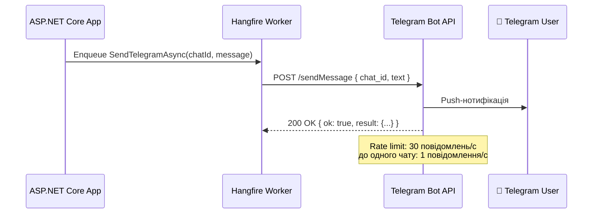
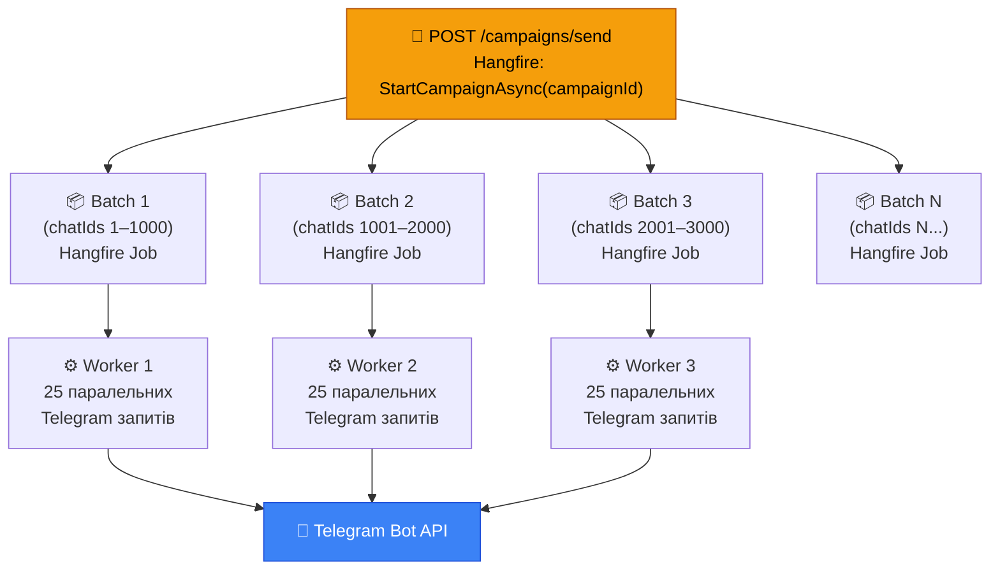
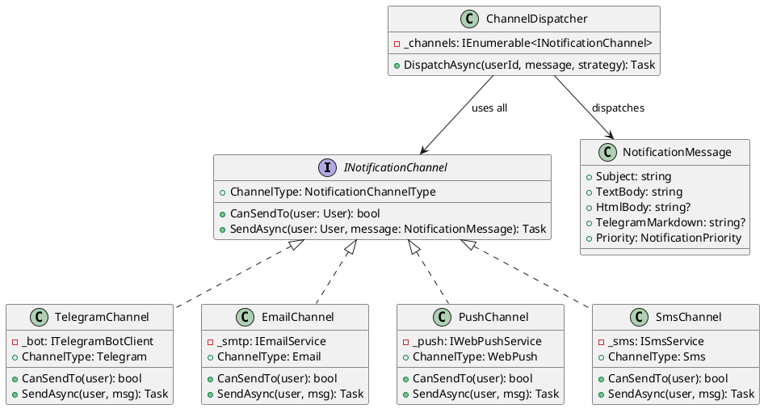
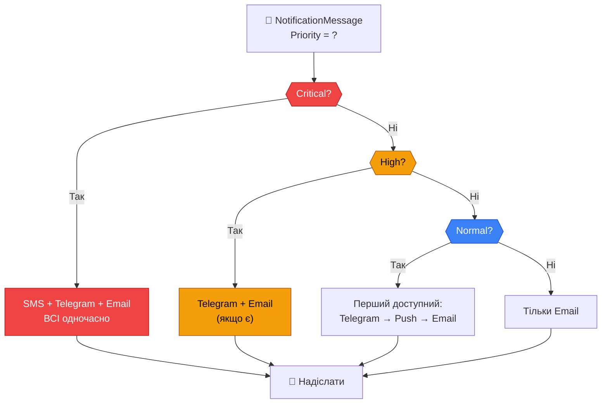

# Telegram-нотифікації: від одного повідомлення до масових розсилок і мульти-канального підходу

Telegram давно перестав бути просто месенджером. Для мільйонів українських користувачів він став основним каналом отримання новин, сповіщень від держпослуг, знижок від магазинів, оновлень від освітніх платформ. Якщо ваш застосунок має аудиторію — висока ймовірність, що значна її частина хоче отримувати сповіщення саме через Telegram.

Але в реалізації Telegram-нотифікацій є одна підступна особливість: надіслати одне повідомлення — тривіально. Надіслати 50 000 повідомлень за розумний час, не отримавши бан від Telegram і не зламавши сервер — це вже архітектурне завдання. А коли до Telegram додаються Email, Push-нотифікації та SMS — постає питання: як управляти цим зоопарком каналів без хаосу?

У цій статті ми розглянемо три рівні складності: базова відправка через Bot API, масові розсилки з контролем паралелізму, і, нарешті, архітектурний патерн мульти-канальних нотифікацій.

::note
**Що ми побудуємо:** Telegram Bot для нотифікацій, систему масових розсилок через Hangfire з обходом rate limits, і Channel Dispatcher — компонент, що абстрагує вибір каналу доставки від бізнес-логіки.
::

---

## Частина 1. Telegram Bot API: основи і перші кроки

### Як влаштований Telegram Bot API

Telegram надає нам Bot API — HTTP-інтерфейс, через який застосунки можуть надсилати повідомлення від імені бота. Взаємодія проста: ваш сервер робить POST-запит до `https://api.telegram.org/bot{TOKEN}/sendMessage`, передаючи `chat_id` і текст.

Telegram — push-ориєнтована система. На відміну від Email, де лист просто кладеться у поштову скриньку, Telegram доставляє повідомлення миттєво на пристрій. Це перевага (читач бачить відразу) і виклик (Telegram суворо обмежує частоту відправлення, щоб захистити свою інфраструктуру).

::mermaid



::

### Telegram Rate Limits — головний виклик при масових розсилках

Telegram офіційно обмежує частоту відправлення:

| Обмеження | Значення | Коментар |
|---|---|---|
| Загальна швидкість | **30 повідомлень/секунду** | Для всіх чатів разом |
| До одного чату | **1 повідомлення/секунду** | Для privacy-чатів |
| До одного каналу | **20 повідомлень/хвилину** | Для публічних каналів |
| При перевищенні | HTTP 429 `Too Many Requests` | З параметром `retry_after` |

Якщо ви надсилаєте до 50 000 унікальних чатів (по одному повідомленню в кожен), теоретичний мінімум при 30 повід/сек — `50 000 / 30 ≈ 28 хвилин`. На практиці, з урахуванням затримок мережі та помилок, — 35–45 хвилин. Саме тут вбудований `for`-цикл у HTTP-обробнику є катастрофою, а Hangfire — рятівником.

### Встановлення та налаштування

::code-group

```bash [dotnet CLI]
dotnet add package Telegram.Bot
dotnet add package Hangfire
dotnet add package Hangfire.AspNetCore
dotnet add package Hangfire.PostgreSql
```

::

```json [appsettings.json]
{
  "Telegram": {
    "BotToken": "1234567890:AAFxxxxxxxxxxxxxxxxxxxxxxxxxxxxxxxx",
    "MaxMessagesPerSecond": 25
  },
  "ConnectionStrings": {
    "DefaultConnection": "Host=localhost;Database=notifyapp;Username=postgres;Password=secret"
  }
}
```

::tip
Отримати токен бота: відкрийте [@BotFather](https://t.me/BotFather) у Telegram → `/newbot` → отримайте токен. `chat_id` користувача отримується при першому зверненні до бота: користувач пише `/start`, ваш webhook отримує `Message.Chat.Id`.
::

### Перша відправка: мінімальний сервіс

```csharp [Services/TelegramNotificationService.cs]
using Telegram.Bot;
using Telegram.Bot.Types.Enums;

namespace NotifyApp.Services;

public interface ITelegramNotificationService
{
    // Надіслати повідомлення одному користувачу
    Task SendMessageAsync(long chatId, string text, bool useMarkdown = false);

    // Масова розсилка — Hangfire-точка входу для кожного батчу
    Task SendBatchAsync(long[] chatIds, string text, string? markdownText = null);
}

public class TelegramNotificationService : ITelegramNotificationService
{
    private readonly ITelegramBotClient _bot;
    private readonly ILogger<TelegramNotificationService> _logger;

    public TelegramNotificationService(
        ITelegramBotClient bot,
        ILogger<TelegramNotificationService> logger)
    {
        _bot = bot;
        _logger = logger;
    }

    [AutomaticRetry(Attempts = 5, DelaysInSeconds = new[] { 5, 15, 30, 60, 120 })]
    public async Task SendMessageAsync(long chatId, string text, bool useMarkdown = false)
    {
        try
        {
            await _bot.SendMessage(
                chatId: chatId,
                text: text,
                parseMode: useMarkdown ? ParseMode.MarkdownV2 : null);

            _logger.LogDebug("Telegram message sent to {ChatId}", chatId);
        }
        catch (Telegram.Bot.Exceptions.ApiRequestException ex)
            when (ex.ErrorCode == 403)
        {
            // 403 Forbidden: користувач заблокував бота або видалив акаунт
            // Такі помилки не потрібно повторювати — одразу помічаємо як неактивного
            _logger.LogWarning(
                "User {ChatId} blocked the bot or deleted account. Marking as inactive.",
                chatId);

            // НЕ перекидаємо — щоб Hangfire не ставив у retry
            // Замість цього — сигналізуємо через return або тихо ігноруємо
        }
        catch (Telegram.Bot.Exceptions.ApiRequestException ex)
            when (ex.ErrorCode == 429)
        {
            // 429 Too Many Requests — Telegram каже "зачекайте"
            // Отримуємо рекомендований час очікування
            var retryAfter = ex.Parameters?.RetryAfter ?? 30;
            _logger.LogWarning(
                "Telegram rate limit hit. Retry after {Seconds}s", retryAfter);

            // Чекаємо і перекидаємо — Hangfire повторить цю конкретну задачу
            await Task.Delay(TimeSpan.FromSeconds(retryAfter + 1));
            throw;
        }
    }

    // Цей метод — точка входу Hangfire для батчевої обробки
    // Він сам контролює паралелізм через SemaphoreSlim
    public async Task SendBatchAsync(long[] chatIds, string text, string? markdownText = null)
    {
        // Детальна реалізація — нижче, у "Частині 2"
        throw new NotImplementedException("Розглядається в Частині 2");
    }
}
```

Зверніть увагу на обробку двох різних HTTP-кодів. Помилка `403` — це перманентна ситуація: користувач навмисно відмовився від бота. Повторна спроба марна і тільки засмічить чергу. Помилка `429` — тимчасова ситуація: ми просто надсилаємо надто швидко. Отримавши `retry_after` від Telegram, чекаємо і даємо Hangfire повторити задачу.

### Реєстрація в DI

```csharp [Program.cs]
using Telegram.Bot;

// Реєстрація TelegramBotClient як Singleton — один клієнт на весь застосунок
builder.Services.AddSingleton<ITelegramBotClient>(sp =>
    new TelegramBotClient(builder.Configuration["Telegram:BotToken"]!));

builder.Services.AddScoped<ITelegramNotificationService, TelegramNotificationService>();
```

### Простий endpoint: надіслати одне повідомлення

```csharp [Endpoints/NotificationEndpoints.cs]
app.MapPost("/notifications/telegram/single", async (
    SendTelegramRequest request,
    IBackgroundJobClient jobs,
    AppDbContext db) =>
{
    // Знаходимо telegram chat_id користувача в БД
    var user = await db.Users
        .Where(u => u.Id == request.UserId && u.TelegramChatId != null)
        .FirstOrDefaultAsync();

    if (user is null)
        return Results.NotFound(new { error = "Користувач або Telegram-акаунт не знайдено" });

    // Пишемо в Hangfire — не в HTTP-запиті
    var jobId = jobs.Enqueue<ITelegramNotificationService>(
        x => x.SendMessageAsync(user.TelegramChatId!.Value, request.Text, true));

    return Results.Accepted(null, new { jobId, message = "Повідомлення поставлено в чергу" });
});

public record SendTelegramRequest(int UserId, string Text);
```

---

## Частина 2. Масові розсилки: 50 000 підписників за 30 хвилин

### Чому наївний підхід не працює

Уявіть найпростіше рішення:

```csharp
// ❌ ПОГАНО: один цикл, одна задача, блокує все
BackgroundJob.Enqueue<INotifyService>(x => x.SendToAllAsync("Нова акція!"));

// Всередині SendToAllAsync:
foreach (var subscriber in await db.Subscribers.ToListAsync())
{
    await _bot.SendMessage(subscriber.ChatId, text);
    await Task.Delay(50); // "контроль" частоти — наївний спосіб
}
```

Проблеми цього підходу. По-перше, це **одна велика задача** для Hangfire — якщо вона впаде на 40 000-му повідомленні, доведеться починати з початку. Уявіть: 40 000 повторних надсилань тим, хто вже отримав. По-друге, **неконтрольований паралелізм** — `await Task.Delay(50)` дає приблизно 20 повід/сек, але не враховує реальні затримки мережі та помилки. По-третє, **блокує воркер** — один воркер зайнятий 30+ хвилин, не може обробляти інші задачі.

### Правильна архітектура: батчі + паралелізм + SemaphoreSlim

Правильне рішення — розбити розсилку на **маленькі батчі** (наприклад, по 1000 підписників) і для кожного батчу створити окрему Hangfire задачу. Всередині кожного батчу — контрольований паралелізм через `SemaphoreSlim`.

::mermaid



::

При 5 паралельних Hangfire воркерах, кожен обробляє батч 1000 підписників з 25 паралельними запитами — загальна швидкість наближається до максимально допустимого ліміту Telegram, але не перевищує його.

### Модель кампанії

```csharp [Models/NotificationCampaign.cs]
namespace NotifyApp.Models;

public enum CampaignStatus
{
    Draft, Starting, InProgress, Completed, Failed, Cancelled
}

public class NotificationCampaign
{
    public int Id { get; set; }
    public string Title { get; set; } = string.Empty;
    public string MessageText { get; set; } = string.Empty;

    // Статистика
    public int TotalRecipients { get; set; }
    public int SentCount { get; set; }
    public int FailedCount { get; set; }
    public int BlockedCount { get; set; }  // Заблокували бота

    public CampaignStatus Status { get; set; } = CampaignStatus.Draft;

    public DateTime CreatedAt { get; set; } = DateTime.UtcNow;
    public DateTime? StartedAt { get; set; }
    public DateTime? CompletedAt { get; set; }

    // Результати батчів для аудиту
    public ICollection<CampaignBatch> Batches { get; set; } = [];
}

public class CampaignBatch
{
    public int Id { get; set; }
    public int CampaignId { get; set; }
    public int BatchNumber { get; set; }
    public int RecipientCount { get; set; }
    public int SentCount { get; set; }
    public int FailedCount { get; set; }
    public string? HangfireJobId { get; set; }
    public DateTime? CompletedAt { get; set; }
    public NotificationCampaign Campaign { get; set; } = null!;
}
```

### CampaignOrchestrator: розбиття на батчі

```csharp [Services/CampaignOrchestrator.cs]
using Hangfire;
using Microsoft.EntityFrameworkCore;

namespace NotifyApp.Services;

public class CampaignOrchestrator
{
    private readonly AppDbContext _db;
    private readonly IBackgroundJobClient _jobs;
    private readonly ILogger<CampaignOrchestrator> _logger;

    // Розмір одного батчу: скільки підписників обробляє один Hangfire-воркер
    private const int BatchSize = 1000;

    public CampaignOrchestrator(
        AppDbContext db,
        IBackgroundJobClient jobs,
        ILogger<CampaignOrchestrator> logger)
    {
        _db = db;
        _jobs = jobs;
        _logger = logger;
    }

    // Ця задача виконується Hangfire одразу після старту кампанії
    // Вона тільки розбиває на батчі — сама нічого не надсилає
    [AutomaticRetry(Attempts = 1)] // Стартова задача не потребує багато retry
    public async Task StartCampaignAsync(int campaignId)
    {
        var campaign = await _db.NotificationCampaigns
            .Include(c => c.Batches)
            .FirstOrDefaultAsync(c => c.Id == campaignId)
            ?? throw new InvalidOperationException($"Campaign {campaignId} not found");

        campaign.Status = CampaignStatus.Starting;
        campaign.StartedAt = DateTime.UtcNow;
        await _db.SaveChangesAsync();

        // Завантажуємо тільки TelegramChatId — мінімум даних
        // Не завантажуємо весь User-об'єкт — нам не потрібен
        var chatIds = await _db.Users
            .Where(u => u.TelegramChatId != null && u.IsTelegramNotificationsEnabled)
            .Select(u => u.TelegramChatId!.Value)
            .ToArrayAsync();

        campaign.TotalRecipients = chatIds.Length;
        campaign.Status = CampaignStatus.InProgress;

        _logger.LogInformation(
            "Starting campaign {CampaignId}: {Total} recipients, {Batches} batches",
            campaignId, chatIds.Length, (chatIds.Length + BatchSize - 1) / BatchSize);

        // Розбиваємо на батчі та ставимо кожен в окрему Hangfire задачу
        var batchNumber = 0;
        foreach (var chunk in chatIds.Chunk(BatchSize))
        {
            batchNumber++;

            // Зберігаємо запис батчу для відстеження
            var batch = new CampaignBatch
            {
                CampaignId = campaignId,
                BatchNumber = batchNumber,
                RecipientCount = chunk.Length
            };
            _db.CampaignBatches.Add(batch);
            await _db.SaveChangesAsync();

            // Ставимо батч у чергу "campaigns" — окрема черга для масових розсилок
            // Завдяки цьому звичайні нотифікації не "застрягають" за кампаніями
            var jobId = _jobs.Enqueue<ITelegramNotificationService>(
                x => x.SendBatchAsync(chunk, campaign.MessageText, null),
                queue: "campaigns");

            batch.HangfireJobId = jobId;
        }

        await _db.SaveChangesAsync();

        _logger.LogInformation(
            "Campaign {CampaignId}: {BatchCount} batches enqueued", campaignId, batchNumber);
    }
}
```

Метод `chatIds.Chunk(BatchSize)` — це вбудований LINQ-метод .NET 6+, що розбиває масив на підмасиви заданого розміру. `50 000.Chunk(1000)` дає 50 батчів. Кожен батч — окрема Hangfire задача.

### SendBatchAsync: контрольований паралелізм

Ось найважливіший метод — той, що виконується в кожному батчі:

```csharp [Services/TelegramNotificationService.cs]
public async Task SendBatchAsync(long[] chatIds, string text, string? markdownText = null)
{
    // Читаємо ліміт з конфігурації: за замовчуванням 25 пар. запитів
    // (залишаємо 5 запитів як буфер до ліміту Telegram 30/с)
    var maxParallel = _config.GetValue<int>("Telegram:MaxMessagesPerSecond", 25);

    // SemaphoreSlim — механізм обмеження паралелізму
    // Дозволяє одночасно виконуватись не більше ніж maxParallel корутин
    using var semaphore = new SemaphoreSlim(maxParallel, maxParallel);

    var successCount = 0;
    var failedCount = 0;
    var blockedCount = 0;

    // Створюємо Task для кожного отримувача
    var tasks = chatIds.Select(async chatId =>
    {
        // Захоплюємо "слот" у семафорі — якщо всі maxParallel зайняті, очікуємо
        await semaphore.WaitAsync();
        try
        {
            await _bot.SendMessage(
                chatId: chatId,
                text: markdownText ?? text,
                parseMode: markdownText != null ? ParseMode.MarkdownV2 : null);

            Interlocked.Increment(ref successCount);
        }
        catch (Telegram.Bot.Exceptions.ApiRequestException ex) when (ex.ErrorCode == 403)
        {
            // Заблокували бота — рахуємо, але не падаємо
            Interlocked.Increment(ref blockedCount);
            _logger.LogDebug("ChatId {ChatId}: bot blocked (403)", chatId);
        }
        catch (Telegram.Bot.Exceptions.ApiRequestException ex) when (ex.ErrorCode == 429)
        {
            // Rate limit — чекаємо і РАХУЄМО ЯК ПОМИЛКУ для цього батчу
            // Hangfire повторить весь батч через retry — це прийнятно для батчів по 1000
            var retryAfter = ex.Parameters?.RetryAfter ?? 30;
            _logger.LogWarning("Rate limit 429, retry after {Sec}s", retryAfter);
            await Task.Delay(TimeSpan.FromSeconds(retryAfter + 1));
            Interlocked.Increment(ref failedCount);
            throw; // Перекидаємо щоб Hangfire повторив батч
        }
        catch (Exception ex)
        {
            Interlocked.Increment(ref failedCount);
            _logger.LogError(ex, "Failed to send to chatId {ChatId}", chatId);
        }
        finally
        {
            // ЗАВЖДИ звільняємо семафор — інакше дедлок
            semaphore.Release();
        }
    });

    // Task.WhenAll — чекаємо завершення ВСІХ Task-ів батчу
    // Семафор гарантує, що одночасно активних не більше maxParallel
    await Task.WhenAll(tasks);

    _logger.LogInformation(
        "Batch completed: {Total} total, {Success} sent, {Failed} failed, {Blocked} blocked",
        chatIds.Length, successCount, failedCount, blockedCount);
}
```

`SemaphoreSlim(25, 25)` — це "ворота" з 25 слотами. Кожен `WaitAsync()` захоплює слот; якщо всі 25 зайняті — наступна корутина чекає. `Release()` звільняє слот. Таким чином завжди активно не більше 25 паралельних запитів до Telegram, незалежно від розміру батчу.

`Interlocked.Increment` замість `successCount++` — це важливо: кілька потоків можуть оновлювати лічильник одночасно. `Interlocked.Increment` — атомарна операція, захищена від race condition.

### Математика та реальна швидкість

Розрахуємо для 50 000 підписників:

| Параметр | Значення |
|---|---|
| Розмір батчу | 1000 |
| Кількість батчів | 50 |
| Паралельних воркерів Hangfire | 5 |
| Паралельних запитів в батчі | 25 |
| Ефективна швидкість | ~25 × 5 = **125 повід/сек** (але Telegram обмежить до 30) |
| Середня швидкість (реальна) | **~28 повід/сек** |
| Час для 50 000 | **50 000 / 28 ≈ 30 хвилин** |

::warning
Якщо запустити більше воркерів або збільшити MaxParallel, ви **не прискорите** розсилку — Telegram все одно обмежить до 30/сек. Ви лише збільшите кількість 429-помилок. Єдиний спосіб прискоритись — **верифікований офіційний канал** (Broadcasting API для великих платформ).
::

### Endpoint запуску кампанії

```csharp [Endpoints/CampaignEndpoints.cs]
app.MapPost("/campaigns/{id}/send", async (
    int id,
    AppDbContext db,
    IBackgroundJobClient jobs) =>
{
    var campaign = await db.NotificationCampaigns.FindAsync(id);
    if (campaign is null) return Results.NotFound();
    if (campaign.Status != CampaignStatus.Draft)
        return Results.Conflict(new { error = "Кампанія вже запущена або завершена" });

    // Ставимо ЛИШЕ стартову задачу — вона сама розіб'є на батчі
    var jobId = jobs.Enqueue<CampaignOrchestrator>(
        x => x.StartCampaignAsync(id),
        queue: "campaigns");

    campaign.Status = CampaignStatus.Starting;
    await db.SaveChangesAsync();

    return Results.Accepted(null, new
    {
        campaignId = id,
        hangfireJobId = jobId,
        message = "Кампанія запущена. Батчі будуть сформовані найближчим часом."
    });
});

// Статус кампанії з прогресом
app.MapGet("/campaigns/{id}/status", async (int id, AppDbContext db) =>
{
    var campaign = await db.NotificationCampaigns
        .Include(c => c.Batches)
        .FirstOrDefaultAsync(c => c.Id == id);

    if (campaign is null) return Results.NotFound();

    var completedBatches = campaign.Batches.Count(b => b.CompletedAt.HasValue);
    var totalBatches = campaign.Batches.Count;

    return Results.Ok(new
    {
        campaign.Id,
        campaign.Title,
        status = campaign.Status.ToString(),
        progress = new
        {
            total = campaign.TotalRecipients,
            sent = campaign.SentCount,
            failed = campaign.FailedCount,
            blocked = campaign.BlockedCount,
            percentComplete = campaign.TotalRecipients > 0
                ? (double)(campaign.SentCount + campaign.FailedCount) / campaign.TotalRecipients * 100
                : 0
        },
        batches = new { completed = completedBatches, total = totalBatches },
        campaign.StartedAt,
        campaign.CompletedAt
    });
});
```

---

## Частина 3. Мульти-канальні нотифікації: Strategy Pattern

### Проблема зоопарку каналів

Реальний продукт рідко обмежується одним каналом. Типова картина:

- **Telegram**: для технічно-просунутих користувачів, миттєва реакція
- **Email**: для офіційних повідомлень, архівування, аудиторій без Telegram
- **Web Push**: для залученості на сайті, без реєстрації
- **SMS**: для критичних повідомлень (OTP, платіжні підтвердження)

Якщо кожен сервіс знає про всі канали — виникає спагетті-код: `if (user.HasTelegram) { ... } else if (user.HasEmail) { ... } else if (user.HasPush) { ... }`. Це порушує принципи Open/Closed та Single Responsibility.

**Рішення — патерн Strategy** (Стратегія): кожен канал реалізує спільний інтерфейс `INotificationChannel`. `ChannelDispatcher` ("диспетчер каналів") вирішує, через які канали доставляти конкретне повідомлення конкретному користувачу, не знаючи деталей кожного каналу.

::plant-uml



::

### Визначення інтерфейсів

```csharp [Notifications/INotificationChannel.cs]
namespace NotifyApp.Notifications;

// Доступні канали доставки
public enum NotificationChannelType
{
    Telegram, Email, WebPush, Sms
}

// Пріоритет повідомлення — впливає на вибір каналу
public enum NotificationPriority
{
    Low,      // Маркетинг, дайджести — достатньо Email
    Normal,   // Стандартні події — Telegram або Email
    High,     // Важливі події — Telegram + Email
    Critical  // OTP, платіжні — SMS + Email + Telegram одночасно
}

// Уніфіковане повідомлення для всіх каналів
public class NotificationMessage
{
    // Загальні поля
    public string Subject { get; init; } = string.Empty;   // Email subject / Заголовок
    public string TextBody { get; init; } = string.Empty;  // Простий текст (Email, SMS)

    // Канало-специфічні поля (nullable — якщо немає, використовується TextBody)
    public string? HtmlBody { get; init; }            // Для Email (HTML-верстка)
    public string? TelegramMarkdown { get; init; }    // Для Telegram (MarkdownV2)
    public string? PushIconUrl { get; init; }         // Для Web Push
    public string? ActionUrl { get; init; }           // Кнопка / посилання

    public NotificationPriority Priority { get; init; } = NotificationPriority.Normal;
}

// Стратегія вибору каналів
public enum DispatchStrategy
{
    // Надіслати тільки через пріоритетний канал (визначається за Priority)
    PriorityFirst,
    // Надіслати через ВСІ доступні канали користувача
    AllAvailable,
    // Надіслати тільки через канали, які вибрав сам користувач
    UserPreference
}

// Контракт каналу доставки
public interface INotificationChannel
{
    NotificationChannelType ChannelType { get; }

    // Чи може цей канал надіслати повідомлення цьому користувачу?
    // (наприклад, чи є у користувача прив'язаний Telegram)
    bool CanSendTo(User user);

    // Надіслати повідомлення
    Task<bool> SendAsync(User user, NotificationMessage message);
}
```

### Реалізація каналів

```csharp [Notifications/TelegramChannel.cs]
using Telegram.Bot;
using Telegram.Bot.Types.Enums;

namespace NotifyApp.Notifications;

public class TelegramChannel : INotificationChannel
{
    private readonly ITelegramBotClient _bot;
    private readonly ILogger<TelegramChannel> _logger;

    public TelegramChannel(ITelegramBotClient bot, ILogger<TelegramChannel> logger)
    {
        _bot = bot;
        _logger = logger;
    }

    public NotificationChannelType ChannelType => NotificationChannelType.Telegram;

    public bool CanSendTo(User user)
        // Канал доступний тільки якщо у користувача є TelegramChatId і він не відмовився
        => user.TelegramChatId.HasValue && user.IsTelegramNotificationsEnabled;

    public async Task<bool> SendAsync(User user, NotificationMessage message)
    {
        try
        {
            var text = message.TelegramMarkdown ?? message.TextBody;
            var parseMode = message.TelegramMarkdown != null ? ParseMode.MarkdownV2 : null;

            await _bot.SendMessage(user.TelegramChatId!.Value, text, parseMode: parseMode);
            return true;
        }
        catch (Exception ex)
        {
            _logger.LogError(ex, "TelegramChannel: failed to send to user {UserId}", user.Id);
            return false;
        }
    }
}
```

```csharp [Notifications/EmailChannel.cs]
namespace NotifyApp.Notifications;

public class EmailChannel : INotificationChannel
{
    private readonly IEmailService _email;
    private readonly ILogger<EmailChannel> _logger;

    public EmailChannel(IEmailService email, ILogger<EmailChannel> logger)
    {
        _email = email;
        _logger = logger;
    }

    public NotificationChannelType ChannelType => NotificationChannelType.Email;

    public bool CanSendTo(User user)
        => !string.IsNullOrEmpty(user.Email) && user.IsEmailNotificationsEnabled;

    public async Task<bool> SendAsync(User user, NotificationMessage message)
    {
        try
        {
            await _email.SendAsync(
                to: user.Email!,
                subject: message.Subject,
                htmlBody: message.HtmlBody,
                textBody: message.TextBody);
            return true;
        }
        catch (Exception ex)
        {
            _logger.LogError(ex, "EmailChannel: failed to send to user {UserId}", user.Id);
            return false;
        }
    }
}
```

### Головне: ChannelDispatcher

```csharp [Notifications/ChannelDispatcher.cs]
using Microsoft.EntityFrameworkCore;

namespace NotifyApp.Notifications;

public class ChannelDispatcher
{
    // DI інжектує ВСІ зареєстровані реалізації INotificationChannel
    private readonly IEnumerable<INotificationChannel> _channels;
    private readonly AppDbContext _db;
    private readonly ILogger<ChannelDispatcher> _logger;

    public ChannelDispatcher(
        IEnumerable<INotificationChannel> channels,
        AppDbContext db,
        ILogger<ChannelDispatcher> logger)
    {
        _channels = channels;
        _db = db;
        _logger = logger;
    }

    // Головний метод: вирішити через які канали надіслати і надіслати
    public async Task DispatchAsync(
        int userId,
        NotificationMessage message,
        DispatchStrategy strategy = DispatchStrategy.UserPreference)
    {
        var user = await _db.Users.FindAsync(userId)
            ?? throw new InvalidOperationException($"User {userId} not found");

        // Визначаємо список каналів для надсилання
        var selectedChannels = strategy switch
        {
            DispatchStrategy.AllAvailable =>
                // Усі канали, до яких є доступ
                _channels.Where(c => c.CanSendTo(user)).ToList(),

            DispatchStrategy.PriorityFirst =>
                // Вибір каналу за пріоритетом повідомлення
                SelectByPriority(user, message.Priority),

            DispatchStrategy.UserPreference =>
                // Тільки канали, які увімкнув сам користувач
                _channels.Where(c => c.CanSendTo(user)).ToList(),

            _ => throw new ArgumentOutOfRangeException(nameof(strategy))
        };

        if (selectedChannels.Count == 0)
        {
            _logger.LogWarning(
                "No available channels for user {UserId} with strategy {Strategy}",
                userId, strategy);
            return;
        }

        _logger.LogInformation(
            "Dispatching to user {UserId} via {Channels}: [{ChannelNames}]",
            userId, selectedChannels.Count,
            string.Join(", ", selectedChannels.Select(c => c.ChannelType)));

        // Надсилаємо через всі обрані канали паралельно
        var results = await Task.WhenAll(
            selectedChannels.Select(async channel =>
            {
                var success = await channel.SendAsync(user, message);
                return (channel.ChannelType, success);
            }));

        // Логуємо результати
        foreach (var (channelType, success) in results)
        {
            _logger.LogInformation(
                "Channel {Channel} for user {UserId}: {Status}",
                channelType, userId, success ? "success" : "failed");
        }
    }

    // Вибір каналу(ів) за пріоритетом
    private List<INotificationChannel> SelectByPriority(User user, NotificationPriority priority)
    {
        // Визначаємо пріоритетний порядок каналів залежно від важливості
        var channelOrder = priority switch
        {
            // Для критичних — одразу SMS + Telegram + Email
            NotificationPriority.Critical => new[]
            {
                NotificationChannelType.Sms,
                NotificationChannelType.Telegram,
                NotificationChannelType.Email
            },
            // Для важливих — Telegram або Email (обидва якщо є)
            NotificationPriority.High => new[]
            {
                NotificationChannelType.Telegram,
                NotificationChannelType.Email
            },
            // Для звичайних — перший доступний у порядку пріоритету
            NotificationPriority.Normal => new[]
            {
                NotificationChannelType.Telegram,
                NotificationChannelType.WebPush,
                NotificationChannelType.Email
            },
            // Для низького — тільки Email
            NotificationPriority.Low => new[]
            {
                NotificationChannelType.Email
            },
            _ => Array.Empty<NotificationChannelType>()
        };

        // Для Critical і High — надсилаємо в усі перераховані доступні канали
        if (priority is NotificationPriority.Critical or NotificationPriority.High)
        {
            return _channels
                .Where(c => channelOrder.Contains(c.ChannelType) && c.CanSendTo(user))
                .ToList();
        }

        // Для Normal і Low — беремо перший доступний
        foreach (var preferredType in channelOrder)
        {
            var channel = _channels
                .FirstOrDefault(c => c.ChannelType == preferredType && c.CanSendTo(user));
            if (channel is not null)
                return [channel];
        }

        return [];
    }
}
```

Ключова магія в конструкторі: `IEnumerable<INotificationChannel> channels`. ASP.NET Core DI автоматично інжектує **всі зареєстровані реалізації** `INotificationChannel` у вигляді колекції. Це означає: щоб додати новий канал (наприклад, Viber), достатньо реалізувати `INotificationChannel` і зареєструвати у DI — `ChannelDispatcher` підхопить його автоматично.

Стратегія `DispatchStrategy.PriorityFirst` реалізує бізнес-правила: телефонний дзвінок або SMS — для OTP; Telegram або Email — для важливих подій; лише Email — для маркетингу. Ці правила зосереджені в одному місці, а не розпорошені по всьому коду.

### Реєстрація всього в DI

```csharp [Program.cs]
// Реєстрація каналів — порядок важливий: DI інжектує в тому порядку, в якому зареєстровано
// Для Priority-стратегії Telegram має йти першим (якщо треба надсилати першим)
builder.Services.AddScoped<INotificationChannel, TelegramChannel>();
builder.Services.AddScoped<INotificationChannel, EmailChannel>();
builder.Services.AddScoped<INotificationChannel, PushChannel>();
builder.Services.AddScoped<INotificationChannel, SmsChannel>();

// Диспетчер
builder.Services.AddScoped<ChannelDispatcher>();
```

### Використання у Hangfire-задачах

```csharp [Services/EventNotificationService.cs]
namespace NotifyApp.Services;

public class EventNotificationService
{
    private readonly ChannelDispatcher _dispatcher;
    private readonly ILogger<EventNotificationService> _logger;

    public EventNotificationService(
        ChannelDispatcher dispatcher,
        ILogger<EventNotificationService> logger)
    {
        _dispatcher = dispatcher;
        _logger = logger;
    }

    // Нова публікація — Normal пріоритет, перший доступний канал
    public async Task NotifyNewArticleAsync(int userId, string articleTitle, string articleUrl)
    {
        var message = new NotificationMessage
        {
            Subject = $"Нова стаття: {articleTitle}",
            TextBody = $"Опублікована нова стаття \"{articleTitle}\"\n{articleUrl}",
            TelegramMarkdown = $"📖 *Нова стаття*\n[{EscapeMd(articleTitle)}]({articleUrl})",
            HtmlBody = $"<h2>Нова стаття</h2><p><a href='{articleUrl}'>{articleTitle}</a></p>",
            ActionUrl = articleUrl,
            Priority = NotificationPriority.Normal
        };

        // Диспетчер сам вирішить: Telegram або Email або Push
        await _dispatcher.DispatchAsync(userId, message, DispatchStrategy.UserPreference);
    }

    // Платіжне підтвердження — Critical, усі канали одночасно
    public async Task NotifyPaymentAsync(int userId, decimal amount, string orderId)
    {
        var message = new NotificationMessage
        {
            Subject = $"Підтвердження оплати #{orderId}",
            TextBody = $"Оплата {amount:C} підтверджена. Замовлення #{orderId}.",
            TelegramMarkdown =
                $"✅ *Оплата підтверджена*\n" +
                $"Сума: *{amount:C}*\n" +
                $"Замовлення: `{EscapeMd(orderId)}`",
            Priority = NotificationPriority.Critical  // → SMS + Telegram + Email
        };

        await _dispatcher.DispatchAsync(userId, message, DispatchStrategy.PriorityFirst);
    }

    // TelegramV2 MarkdownV2 escaping — обов'язково для спецсимволів
    private static string EscapeMd(string text)
        => text.Replace(".", "\\.").Replace("-", "\\-").Replace("(", "\\(").Replace(")", "\\)");
}
```

### Схема вибору каналу

::mermaid



::

---

## Практичні завдання

### Рівень 1 — Базовий

**Завдання 1.1:** Реалізуйте `WebhookController`, що приймає оновлення від Telegram (POST `/telegram/webhook`). При отриманні команди `/start` від нового користувача — зберігати `update.Message.Chat.Id` у таблицю `Users.TelegramChatId`. При команді `/stop` — очищати `TelegramChatId` і ставити `IsTelegramNotificationsEnabled = false`.

**Завдання 1.2:** Додайте до моделі `User` поле `NotificationPreferences` (флаги: `TelegramEnabled`, `EmailEnabled`, `PushEnabled`, `SmsEnabled`). Оновіть метод `CanSendTo` у всіх каналах: повертати `false` якщо відповідний флаг вимкнено.

### Рівень 2 — Логіка

**Завдання 2.1:** Реалізуйте `DeliveryLog` — таблицю, яка фіксує кожну спробу надсилання: `UserId, ChannelType, Status (Success/Failed/Blocked), ErrorMessage, SentAt`. Оновіть `INotificationChannel.SendAsync` та `ChannelDispatcher.DispatchAsync` для запису в лог. Додайте endpoint `GET /users/{id}/notification-history` для перегляду лога.

**Завдання 2.2:** Додайте до `CampaignOrchestrator` підтримку **сегментації**: замість "надіслати всім" реалізувати фільтр по тегах (`campaign.TargetTags: string[]`). Підписники, що мають хоча б один з тегів — отримують повідомлення. Теги зберігайте в таблиці `UserTags`.

### Рівень 3 — Архітектура

**Завдання 3.1:** Реалізуйте **Fallback-ланцюжок**: якщо Telegram-надсилання зазнало помилки (403 або кілька разів 429), автоматично спробувати Email як резервний канал. Реалізуйте через Hangfire Job Continuation: якщо `TelegramChannel.SendAsync` повернув `false` — ставити в чергу задачу `EmailChannel.SendAsync` для цього ж повідомлення. Зберігайте `FallbackChannelType` у `DeliveryLog`.

---

## Підсумок

Ми пройшли шлях від базового надсилання до production-готової архітектури нотифікацій:

::card-group

::card{title="Telegram Rate Limits" icon="i-lucide-gauge"}
SemaphoreSlim обмежує паралелізм до 25 запитів/сек — нижче ліміту Telegram 30/сек. Батчі по 1000 отримувачів гарантують ізольованість збоїв.
::

::card{title="Масові розсилки через батчі" icon="i-lucide-layers"}
50 000 підписників → 50 батчів по 1000 → кожен батч окрема Hangfire задача. Зупинка сервера не втрачає прогрес.
::

::card{title="Strategy Pattern для каналів" icon="i-lucide-git-branch"}
INotificationChannel + ChannelDispatcher: кожен канал незалежний, новий канал — лише нова реалізація інтерфейсу без зміни коду диспетчера.
::

::card{title="Priority-based dispatch" icon="i-lucide-arrow-up-circle"}
Critical → SMS + Telegram + Email одночасно. Normal → перший доступний. Low → тільки Email. Бізнес-правила зосереджені в одному місці.
::

::
