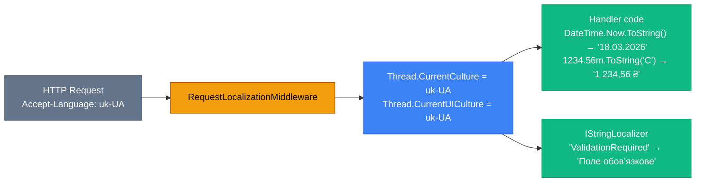

# Інтернаціоналізація (i18n) у Minimal API: від A до Я

Уявіть: ви будуєте API для освітньої платформи, якою користуються студенти з України, Польщі та США. Студент із Варшави хоче отримати повідомлення про помилку польською, американець — англійською, а українець — рідною мовою. Дата «03/05/2024» для американця — це 5 березня, для більшості Європи — 3 травня. Ціна «1 234,56» для українця — нормальна, для американця — підозріла (він очікує «1,234.56»).

Це і є проблема **інтернаціоналізації (internationalization, i18n)** — адаптації програмного забезпечення до різних мов, регіонів і культур без зміни коду. Поряд із нею стоїть **локалізація (localization, l10n)** — процес наповнення застосунку конкретними перекладами та культурними даними для кожного регіону.

Терміни «i18n» та «l10n» — це нумерованя скорочення: між першою і останньою літерою «internationalization» — 18 літер, між «l» і «n» у «localization» — 10.

::note
**Що ми побудуємо:** API інтернет-магазину `ShopApi` з підтримкою трьох мов (українська, англійська, польська), визначенням культури з різних джерел, локалізованими повідомленнями про помилки, датами, числами та валютами. Студент матиме готовий шаблон для реального проєкту.
::

---

## Ключові поняття: що означає «підтримка мов»

Перш ніж занурюватися в код, розберемо термінологію. У .NET та ASP.NET Core є два пов'язані поняття, які часто плутають.

**Culture (Культура)** — це поєднання мови і регіону, що визначає правила форматування чисел, дат, часу та валюти. Наприклад, `uk-UA` — українська мова, Україна; `pl-PL` — польська мова, Польща; `en-US` — англійська мова, США; `en-GB` — англійська мова, Велика Британія. `uk-UA` і `uk` — різні культури: перша знає про специфіку України (роздільник десяткових — кома), друга є «нейтральною» українською без прив'язки до регіону.

**UI Culture (Культура інтерфейсу)** — визначає, якою мовою відображати текст. Зазвичай збігається з Culture, але може відрізнятись: наприклад, формат дат — американський (`en-US`), а текст — українською (`uk-UA`).

**Thread.CurrentCulture** vs **Thread.CurrentUICulture** — пара властивостей, яку ASP.NET Core виставляє для кожного HTTP-запиту на основі визначеної культури. `CurrentCulture` впливає на форматування чисел/дат, `CurrentUICulture` — на вибір файлу ресурсів для перекладу.

::mermaid



::

---

## Частина 1. Підготовка: ресурсні файли (.resx)

### Що таке .resx файли

Ресурсний файл (Resource file, `.resx`) — це XML-файл, що зберігає пари «ключ → значення» для конкретної культури. Це стандартний механізм локалізації у .NET, що існує з .NET Framework 1.0. Кожна мова — окремий файл.

Структура іменування файлів критична для правильної роботи:

```
Resources/
├── Messages.resx          ← Мова за замовчуванням (англійська або нейтральна)
├── Messages.uk.resx       ← Українська (нейтральна, без прив'язки до країни)
├── Messages.uk-UA.resx    ← Українська, Україна (специфічна)
├── Messages.pl.resx       ← Польська
└── Messages.pl-PL.resx    ← Польська, Польща
```

Коли .NET шукає переклад для культури `uk-UA`, він шукає у такому порядку: `Messages.uk-UA.resx` → `Messages.uk.resx` → `Messages.resx`. Це так звана **resource fallback chain** (ланцюжок резервних ресурсів). Завдяки цьому достатньо мати один файл `Messages.uk.resx` і він буде використаний для `uk-UA`, `uk-BY` і будь-якої іншої регіональної форми.

### Структура проєкту ShopApi

Ось структура проєкту, який ми будемо створювати крок за кроком:

::code-tree

```csharp [Program.cs]
// Реєстрація сервісів та middleware
```

```xml [ShopApi.csproj]
<!-- Конфігурація проєкту -->
```

```csharp [Features/Products/ProductEndpoints.cs]
// Ендпоінти товарів
```

```csharp [Features/Products/ProductService.cs]
// Сервіс товарів
```

```csharp [Features/Products/Product.cs]
// Модель товару
```

```xml [Resources/Messages.resx]
<!-- Переклади: мова за замовчуванням (англійська) -->
```

```xml [Resources/Messages.uk.resx]
<!-- Переклади: українська -->
```

```xml [Resources/Messages.pl.resx]
<!-- Переклади: польська -->
```

```csharp [Localization/LocalizationExtensions.cs]
// Extension methods для налаштування локалізації
```

::

### Крок 1: Налаштування проєкту

Створіть новий ASP.NET Core проєкт:

```bash
dotnet new web -n ShopApi
cd ShopApi
```

Локалізація вбудована в ASP.NET Core — **нічого додатково встановлювати не потрібно**. Усі класи доступні через `Microsoft.Extensions.Localization` та `Microsoft.AspNetCore.Localization`.

### Крок 2: Створення ресурсних файлів

У Visual Studio або Rider ресурсні файли `.resx` мають графічний редактор. У VS Code — редагуються вручну як XML. Розглянемо обидва способи.

Структура `.resx` файлу — стандартний XML:

```xml [Resources/Messages.resx]
<?xml version="1.0" encoding="utf-8"?>
<root>
  <xsd:schema id="root" xmlns="" xmlns:xsd="http://www.w3.org/2001/XMLSchema" xmlns:msdata="urn:schemas-microsoft-com:xml-msdata">
    <xsd:element name="root" msdata:IsDataSet="true">
      <xsd:complexType>
        <xsd:choice maxOccurs="unbounded">
          <xsd:element name="data">
            <xsd:complexType>
              <xsd:sequence>
                <xsd:element name="value" type="xsd:string" minOccurs="0" msdata:Ordinal="1" />
                <xsd:element name="comment" type="xsd:string" minOccurs="0" msdata:Ordinal="2" />
              </xsd:sequence>
              <xsd:attribute name="name" type="xsd:string" msdata:Ordinal="1" />
              <xsd:attribute name="type" type="xsd:string" msdata:Ordinal="3" />
              <xsd:attribute name="mimetype" type="xsd:string" msdata:Ordinal="4" />
            </xsd:complexType>
          </xsd:element>
          <xsd:element name="resheader">
            <xsd:complexType>
              <xsd:sequence>
                <xsd:element name="value" type="xsd:string" minOccurs="0" msdata:Ordinal="1" />
              </xsd:sequence>
              <xsd:attribute name="name" type="xsd:string" use="required" />
            </xsd:complexType>
          </xsd:element>
        </xsd:choice>
      </xsd:complexType>
    </xsd:element>
  </xsd:schema>

  <resheader name="resmimetype">
    <value>text/microsoft-resx</value>
  </resheader>
  <resheader name="version">
    <value>1.3</value>
  </resheader>
  <resheader name="reader">
    <value>System.Resources.ResXResourceReader, System.Windows.Forms, Version=2.0.3500.0, Culture=neutral, PublicKeyToken=b77a5c561934e089</value>
  </resheader>
  <resheader name="writer">
    <value>System.Resources.ResXResourceWriter, System.Windows.Forms, Version=2.0.3500.0, Culture=neutral, PublicKeyToken=b77a5c561934e089</value>
  </resheader>

  <data name="ProductNotFound" xml:space="preserve">
    <value>Product with ID {0} was not found.</value>
  </data>

  <data name="ProductNameRequired" xml:space="preserve">
    <value>Product name is required.</value>
  </data>

  <data name="ProductPriceInvalid" xml:space="preserve">
    <value>Price must be a positive number.</value>
  </data>

  <data name="ProductCreated" xml:space="preserve">
    <value>Product "{0}" was created successfully.</value>
  </data>

  <data name="ProductDeleted" xml:space="preserve">
    <value>Product with ID {0} was deleted.</value>
  </data>

  <data name="CartEmpty" xml:space="preserve">
    <value>Your cart is empty.</value>
  </data>

  <data name="OrderConfirmed" xml:space="preserve">
    <value>Order #{0} confirmed. Total: {1}.</value>
  </data>

  <data name="WelcomeMessage" xml:space="preserve">
    <value>Welcome to our store!</value>
  </data>
</root>
```

```xml [Resources/Messages.uk.resx]
<?xml version="1.0" encoding="utf-8"?>
<root>
  <xsd:schema id="root" xmlns="" xmlns:xsd="http://www.w3.org/2001/XMLSchema" xmlns:msdata="urn:schemas-microsoft-com:xml-msdata">
    <xsd:element name="root" msdata:IsDataSet="true">
      <xsd:complexType>
        <xsd:choice maxOccurs="unbounded">
          <xsd:element name="data">
            <xsd:complexType>
              <xsd:sequence>
                <xsd:element name="value" type="xsd:string" minOccurs="0" msdata:Ordinal="1" />
                <xsd:element name="comment" type="xsd:string" minOccurs="0" msdata:Ordinal="2" />
              </xsd:sequence>
              <xsd:attribute name="name" type="xsd:string" msdata:Ordinal="1" />
              <xsd:attribute name="type" type="xsd:string" msdata:Ordinal="3" />
              <xsd:attribute name="mimetype" type="xsd:string" msdata:Ordinal="4" />
            </xsd:complexType>
          </xsd:element>
          <xsd:element name="resheader">
            <xsd:complexType>
              <xsd:sequence>
                <xsd:element name="value" type="xsd:string" minOccurs="0" msdata:Ordinal="1" />
              </xsd:sequence>
              <xsd:attribute name="name" type="xsd:string" use="required" />
            </xsd:complexType>
          </xsd:element>
        </xsd:choice>
      </xsd:complexType>
    </xsd:element>
  </xsd:schema>

  <resheader name="resmimetype">
    <value>text/microsoft-resx</value>
  </resheader>
  <resheader name="version">
    <value>1.3</value>
  </resheader>
  <resheader name="reader">
    <value>System.Resources.ResXResourceReader, System.Windows.Forms, Version=2.0.3500.0, Culture=neutral, PublicKeyToken=b77a5c561934e089</value>
  </resheader>
  <resheader name="writer">
    <value>System.Resources.ResXResourceWriter, System.Windows.Forms, Version=2.0.3500.0, Culture=neutral, PublicKeyToken=b77a5c561934e089</value>
  </resheader>

  <data name="ProductNotFound" xml:space="preserve">
    <value>Товар з ідентифікатором {0} не знайдено.</value>
  </data>

  <data name="ProductNameRequired" xml:space="preserve">
    <value>Назва товару є обов'язковою.</value>
  </data>

  <data name="ProductPriceInvalid" xml:space="preserve">
    <value>Ціна повинна бути додатнім числом.</value>
  </data>

  <data name="ProductCreated" xml:space="preserve">
    <value>Товар "{0}" успішно створено.</value>
  </data>

  <data name="ProductDeleted" xml:space="preserve">
    <value>Товар з ідентифікатором {0} видалено.</value>
  </data>

  <data name="CartEmpty" xml:space="preserve">
    <value>Ваш кошик порожній.</value>
  </data>

  <data name="OrderConfirmed" xml:space="preserve">
    <value>Замовлення #{0} підтверджено. Сума: {1}.</value>
  </data>

  <data name="WelcomeMessage" xml:space="preserve">
    <value>Ласкаво просимо до нашого магазину!</value>
  </data>
</root>
```

```xml [Resources/Messages.pl.resx]
<?xml version="1.0" encoding="utf-8"?>
<root>
  <xsd:schema id="root" xmlns="" xmlns:xsd="http://www.w3.org/2001/XMLSchema" xmlns:msdata="urn:schemas-microsoft-com:xml-msdata">
    <xsd:element name="root" msdata:IsDataSet="true">
      <xsd:complexType>
        <xsd:choice maxOccurs="unbounded">
          <xsd:element name="data">
            <xsd:complexType>
              <xsd:sequence>
                <xsd:element name="value" type="xsd:string" minOccurs="0" msdata:Ordinal="1" />
                <xsd:element name="comment" type="xsd:string" minOccurs="0" msdata:Ordinal="2" />
              </xsd:sequence>
              <xsd:attribute name="name" type="xsd:string" msdata:Ordinal="1" />
              <xsd:attribute name="type" type="xsd:string" msdata:Ordinal="3" />
              <xsd:attribute name="mimetype" type="xsd:string" msdata:Ordinal="4" />
            </xsd:complexType>
          </xsd:element>
          <xsd:element name="resheader">
            <xsd:complexType>
              <xsd:sequence>
                <xsd:element name="value" type="xsd:string" minOccurs="0" msdata:Ordinal="1" />
              </xsd:sequence>
              <xsd:attribute name="name" type="xsd:string" use="required" />
            </xsd:complexType>
          </xsd:element>
        </xsd:choice>
      </xsd:complexType>
    </xsd:element>
  </xsd:schema>

  <resheader name="resmimetype">
    <value>text/microsoft-resx</value>
  </resheader>
  <resheader name="version">
    <value>1.3</value>
  </resheader>
  <resheader name="reader">
    <value>System.Resources.ResXResourceReader, System.Windows.Forms, Version=2.0.3500.0, Culture=neutral, PublicKeyToken=b77a5c561934e089</value>
  </resheader>
  <resheader name="writer">
    <value>System.Resources.ResXResourceWriter, System.Windows.Forms, Version=2.0.3500.0, Culture=neutral, PublicKeyToken=b77a5c561934e089</value>
  </resheader>

  <data name="ProductNotFound" xml:space="preserve">
    <value>Produkt o identyfikatorze {0} nie został znaleziony.</value>
  </data>

  <data name="ProductNameRequired" xml:space="preserve">
    <value>Nazwa produktu jest wymagana.</value>
  </data>

  <data name="ProductPriceInvalid" xml:space="preserve">
    <value>Cena musi być liczbą dodatnią.</value>
  </data>

  <data name="ProductCreated" xml:space="preserve">
    <value>Produkt "{0}" został pomyślnie utworzony.</value>
  </data>

  <data name="ProductDeleted" xml:space="preserve">
    <value>Produkt o identyfikatorze {0} został usunięty.</value>
  </data>

  <data name="CartEmpty" xml:space="preserve">
    <value>Twój koszyk jest pusty.</value>
  </data>

  <data name="OrderConfirmed" xml:space="preserve">
    <value>Zamówienie #{0} potwierdzone. Kwota: {1}.</value>
  </data>

  <data name="WelcomeMessage" xml:space="preserve">
    <value>Witamy w naszym sklepie!</value>
  </data>
</root>
```

Зверніть увагу: ключ (`name`) — однаковий у всіх файлах, відрізняється тільки `<value>`. `{0}`, `{1}` — це плейсхолдери для підстановки значень через `string.Format`.

### Крок 3: Підключення ресурсів у проєкт

Щоб .NET знайшов `.resx` файли, потрібно налаштувати `Program.cs`:

```csharp [Program.cs]
using Microsoft.AspNetCore.Localization;
using System.Globalization;

var builder = WebApplication.CreateBuilder(args);

// ─── Локалізація ───────────────────────────────────────────────

// 1. Реєструємо сервіс локалізації
//    ResourcesPath: де шукати .resx файли відносно кореня проєкту
builder.Services.AddLocalization(options =>
    options.ResourcesPath = "Resources");

// ─── Інші сервіси ──────────────────────────────────────────────
builder.Services.AddScoped<ProductService>();

var app = builder.Build();

// ─── Middleware локалізації ─────────────────────────────────────

// Визначаємо підтримувані культури та культуру за замовчуванням
var supportedCultures = new[]
{
    new CultureInfo("en"),      // Англійська (нейтральна)
    new CultureInfo("en-US"),   // Англійська, США
    new CultureInfo("uk"),      // Українська (нейтральна)
    new CultureInfo("uk-UA"),   // Українська, Україна
    new CultureInfo("pl"),      // Польська (нейтральна)
    new CultureInfo("pl-PL"),   // Польська, Польща
};

app.UseRequestLocalization(new RequestLocalizationOptions
{
    // Культура за замовчуванням (якщо не вдалось визначити з запиту)
    DefaultRequestCulture = new RequestCulture("en"),
    SupportedCultures = supportedCultures,
    SupportedUICultures = supportedCultures
});

// ─── Ендпоінти ─────────────────────────────────────────────────
app.MapGet("/", () => "ShopApi is running");

app.Run();
```

Розберемо кожен рядок. `AddLocalization(options => options.ResourcesPath = "Resources")` реєструє `IStringLocalizerFactory` у DI-контейнері та вказує, де шукати `.resx` файли. `RequestLocalizationOptions` описує: які культури підтримуються (`SupportedCultures`, `SupportedUICultures`) і яка є за замовчуванням (`DefaultRequestCulture`). `UseRequestLocalization()` додає middleware, що для кожного HTTP-запиту визначає культуру і встановлює `Thread.CurrentCulture` і `Thread.CurrentUICulture`.

---

## Частина 2. IStringLocalizer: читаємо переклади в коді

### Що таке IStringLocalizer

`IStringLocalizer<T>` — головний інструмент локалізації в ASP.NET Core. Це generic-інтерфейс, де `T` — тип-маркер, що вказує, з якого ресурсного файлу читати переклади. Якщо ви вказуєте `IStringLocalizer<Messages>` і є клас `Messages` у просторі імен `ShopApi`, то .NET шукатиме файл `Resources/Messages.resx` (і його mові-специфічні варіанти).

Технічна реалізація: `IStringLocalizer` читає файл `.resx` для `Thread.CurrentUICulture`, знаходить рядок за ключем і повертає `LocalizedString` — рядковий тип, що знає чи переклад знайдено, чи використовується fallback.

### Клас-маркер і використання

```csharp [Localization/Messages.cs]
namespace ShopApi;

// Цей клас — порожній маркер. Він потрібен ТІЛЬКИ для типізації IStringLocalizer<Messages>.
// .NET за назвою класу та namespace знайде відповідний Resources/Messages.*.resx файл.
// Не треба нічого реалізовувати всередині.
public class Messages { }
```

Тепер використаємо в сервісі:

```csharp [Features/Products/ProductService.cs]
using Microsoft.Extensions.Localization;
using ShopApi;

namespace ShopApi.Features.Products;

public class Product
{
    public int Id { get; set; }
    public string Name { get; set; } = string.Empty;
    public decimal Price { get; set; }
    public DateTime CreatedAt { get; set; } = DateTime.UtcNow;
}

public record CreateProductRequest(string Name, decimal Price);

public class ProductService
{
    private static readonly List<Product> _products =
    [
        new() { Id = 1, Name = "Coffee", Price = 120.00m },
        new() { Id = 2, Name = "Tea",    Price = 80.00m  },
        new() { Id = 3, Name = "Cake",   Price = 250.00m },
    ];

    // IStringLocalizer<Messages> отримує переклади з Resources/Messages.*.resx
    private readonly IStringLocalizer<Messages> _localizer;

    public ProductService(IStringLocalizer<Messages> localizer)
        => _localizer = localizer;

    public IEnumerable<Product> GetAll() => _products.AsReadOnly();

    public (Product? product, string? errorMessage) GetById(int id)
    {
        var product = _products.FirstOrDefault(p => p.Id == id);

        if (product is null)
        {
            // _localizer["ProductNotFound", id] — аналог string.Format:
            // 1. Шукає ключ "ProductNotFound" у .resx для поточної культури
            // 2. Замінює {0} на значення id
            var message = _localizer["ProductNotFound", id].Value;
            return (null, message);
        }

        return (product, null);
    }

    public (Product? product, IEnumerable<string> errors) Create(CreateProductRequest request)
    {
        var errors = new List<string>();

        if (string.IsNullOrWhiteSpace(request.Name))
            errors.Add(_localizer["ProductNameRequired"].Value);

        if (request.Price <= 0)
            errors.Add(_localizer["ProductPriceInvalid"].Value);

        if (errors.Count > 0)
            return (null, errors);

        var product = new Product
        {
            Id = _products.Count + 1,
            Name = request.Name,
            Price = request.Price,
            CreatedAt = DateTime.UtcNow
        };

        _products.Add(product);
        return (product, []);
    }

    public (bool success, string message) Delete(int id)
    {
        var product = _products.FirstOrDefault(p => p.Id == id);

        if (product is null)
            return (false, _localizer["ProductNotFound", id].Value);

        _products.Remove(product);
        return (true, _localizer["ProductDeleted", id].Value);
    }
}
```

`_localizer["ключ"]` повертає `LocalizedString`. `_localizer["ключ", arg0, arg1, ...]` виконує форматування (як `string.Format`). `.Value` дістає рядок. Якщо переклад для поточної культури не знайдено — повертається сам ключ (наприклад, `"ProductNotFound"`) — це корисна поведінка для дебагінгу пропущених перекладів.

### Endpoint з локалізованими відповідями

```csharp [Features/Products/ProductEndpoints.cs]
using Microsoft.Extensions.Localization;
using ShopApi;
using System.Globalization;

namespace ShopApi.Features.Products;

public static class ProductEndpoints
{
    public static WebApplication MapProductEndpoints(this WebApplication app)
    {
        var group = app.MapGroup("/products").WithTags("Products");

        group.MapGet("/", GetAll);
        group.MapGet("/{id:int}", GetById);
        group.MapGet("/{id:int}/details", GetDetails);
        group.MapGet("/{id:int}/price", GetPrice);
        group.MapPost("/", Create);
        group.MapDelete("/{id:int}", Delete);

        return app;
    }

    // GET /products — список всіх товарів
    private static IResult GetAll(ProductService service)
    {
        var products = service.GetAll();
        return Results.Ok(products);
    }

    // GET /products/{id} — товар за ID
    private static IResult GetById(int id, ProductService service)
    {
        var (product, error) = service.GetById(id);

        if (product is null)
            return Results.NotFound(new { error });

        return Results.Ok(product);
    }

    // GET /products/{id}/details — локалізований детальний вигляд
    private static IResult GetDetails(int id, ProductService service)
    {
        var (product, error) = service.GetById(id);
        if (product is null) 
            return Results.NotFound(new { error });

        return Results.Ok(new
        {
            product.Id,
            product.Name,
            product.Price,
            // DateTime.ToString() автоматично використовує CurrentCulture
            CreatedAtFormatted = product.CreatedAt.ToString("D")
        });
    }

    // GET /products/{id}/price — ціна у форматі поточної культури
    private static IResult GetPrice(int id, ProductService service)
    {
        var (product, error) = service.GetById(id);
        if (product is null) 
            return Results.NotFound(new { error });

        return Results.Ok(new
        {
            product.Id,
            product.Name,
            PriceRaw = product.Price,
            // decimal.ToString("C") автоматично використовує CurrentCulture
            PriceFormatted = product.Price.ToString("C")
        });
    }

    // POST /products — створити товар
    private static IResult Create(
        CreateProductRequest request,
        ProductService service,
        LocalizedValidator validator,
        IStringLocalizer<Messages> localizer)
    {
        // Валідація
        var errors = LocalizedValidator.Collect(
            validator.Required(request.Name, "name"),
            validator.MinLength(request.Name, "name", 2),
            validator.PositiveNumber(request.Price, "price")
        );

        if (errors.Count > 0)
            return Results.UnprocessableEntity(new { errors });

        var (product, serviceErrors) = service.Create(request);

        if (serviceErrors.Any())
            return Results.UnprocessableEntity(new { errors = serviceErrors });

        var message = localizer["ProductCreated", product!.Name].Value;
        return Results.Created($"/products/{product.Id}", new { message, product });
    }

    // DELETE /products/{id} — видалити товар
    private static IResult Delete(int id, ProductService service)
    {
        var (success, message) = service.Delete(id);

        return success
            ? Results.Ok(new { message })
            : Results.NotFound(new { error = message });
    }
}
```

---

## Частина 3. Визначення культури: звідки беремо мову

Middleware `UseRequestLocalization` за замовчуванням перевіряє кілька джерел у такому порядку:

| Пріоритет | Провайдер | Приклад |
|---|---|---|
| 1 | Query String | `?culture=uk-UA` |
| 2 | Cookie | `Cookie: .AspNetCore.Culture=uk-UA` |
| 3 | Accept-Language header | `Accept-Language: uk-UA,uk;q=0.9` |
| 4 | За замовчуванням | `DefaultRequestCulture = "en"` |

Це можна налаштувати: видати непотрібні провайдери або додати власні.

### Query String провайдер

Найпростіший спосіб для тестування та API:

```http
GET /products?culture=uk-UA HTTP/1.1
Host: localhost:5000
```

Middleware автоматично обробляє параметр `culture` (і `ui-culture`).

### Accept-Language провайдер (стандарт HTTP)

Браузери автоматично додають заголовок `Accept-Language` на основі налаштувань мови користувача. Це найбільш «чистий» спосіб для REST API.

```http
GET /products HTTP/1.1
Host: localhost:5000
Accept-Language: uk-UA,uk;q=0.9,en;q=0.8
```

Middleware розбирає цей заголовок, знаходить першу підтримувану культуру (у прикладі — `uk-UA`) і встановлює її.

### Cookie провайдер (для SPA та браузерних застосунків)

Для Single Page Applications, де користувач може вибрати мову вручну, зручно зберігати вибір у cookie. ASP.NET Core читає cookie з іменем `.AspNetCore.Culture`:

```http
GET /products HTTP/1.1
Host: localhost:5000
Cookie: .AspNetCore.Culture=c%3Duk-UA%7Cuic%3Duk-UA
```

Формат значення cookie: `c={culture}|uic={ui-culture}`. Для встановлення:

```csharp
// Endpoint для зміни мови користувача (для SPA)
app.MapPost("/language/{culture}", (string culture, HttpContext ctx) =>
{
    var supportedCultures = new[] { "en", "uk", "uk-UA", "pl", "pl-PL" };

    if (!supportedCultures.Contains(culture))
        return Results.BadRequest(new { error = $"Unsupported culture: {culture}" });

    ctx.Response.Cookies.Append(
        CookieRequestCultureProvider.DefaultCookieName,
        CookieRequestCultureProvider.MakeCookieValue(new RequestCulture(culture)),
        new CookieOptions
        {
            Expires = DateTimeOffset.UtcNow.AddYears(1),
            IsEssential = true  // Не вимагає згоди GDPR
        });

    return Results.Ok(new { message = $"Language changed to {culture}" });
});
```

### Власний провайдер: культура з Bearer-токена

Іноді культуру зберігають у JWT-токені — щоб мова відображалась саме та, яку вибрав користувач при реєстрації. Реалізуємо власний провайдер:

```csharp [Localization/JwtCultureProvider.cs]
using Microsoft.AspNetCore.Localization;
using System.IdentityModel.Tokens.Jwt;

namespace ShopApi;

// Власний провайдер культури: читає claim "locale" з JWT Bearer токена
public class JwtCultureProvider : RequestCultureProvider
{
    public override Task<ProviderCultureResult?> DetermineProviderCultureResult(
        HttpContext context)
    {
        var authHeader = context.Request.Headers.Authorization.FirstOrDefault();

        if (string.IsNullOrEmpty(authHeader) || !authHeader.StartsWith("Bearer "))
            return Task.FromResult<ProviderCultureResult?>(null); // Передаємо наступному провайдеру

        var token = authHeader["Bearer ".Length..];

        try
        {
            var handler = new JwtSecurityTokenHandler();
            var jwtToken = handler.ReadJwtToken(token);

            // Шукаємо claim "locale" у токені: "locale": "uk-UA"
            var locale = jwtToken.Claims
                .FirstOrDefault(c => c.Type == "locale")?.Value;

            if (string.IsNullOrEmpty(locale))
                return Task.FromResult<ProviderCultureResult?>(null);

            return Task.FromResult<ProviderCultureResult?>(
                new ProviderCultureResult(locale, locale));
        }
        catch
        {
            // Невалідний токен — пропускаємо
            return Task.FromResult<ProviderCultureResult?>(null);
        }
    }
}
```

Реєстрація власного провайдера:

```csharp [Program.cs]
var localizationOptions = new RequestLocalizationOptions
{
    DefaultRequestCulture = new RequestCulture("en"),
    SupportedCultures = supportedCultures,
    SupportedUICultures = supportedCultures
};

// Вставляємо JWT-провайдер ПЕРШИМ — він матиме найвищий пріоритет
localizationOptions.RequestCultureProviders.Insert(0, new JwtCultureProvider());

app.UseRequestLocalization(localizationOptions);
```

### RouteDataRequestCultureProvider: мова в URL-шляху

Це найбільш «SEO-френдлі» підхід, коли мова є частиною URL: `/uk/products` або `/en/products`. Це дозволяє користувачам ділитися посиланнями на конкретну мовну версію та допомагає пошуковим роботам індексувати сайт різними мовами.

1. **Реєстрація провайдера:**
```csharp [Program.cs]
var localizationOptions = new RequestLocalizationOptions
{
    DefaultRequestCulture = new RequestCulture("en"),
    SupportedCultures = supportedCultures,
    SupportedUICultures = supportedCultures
};

// Додаємо RouteDataRequestCultureProvider
localizationOptions.RequestCultureProviders.Insert(0, new RouteDataRequestCultureProvider());

app.UseRequestLocalization(localizationOptions);
```

2. **Налаштування ендпоінтів:**
Для того, щоб провайдер міг зчитати культуру, вона має бути частиною шаблону маршруту під назвою `{culture}`. У Minimal API зручно використовувати `MapGroup`:

```csharp
// Групуємо всі ендпоінти, що потребують мови в URL
var languageGroup = app.MapGroup("{culture}");

languageGroup.MapGet("/products", (string culture, ProductService service) => 
{
    // Культура автоматично визначиться з URL segment
    return Results.Ok(service.GetAll());
});
```

Варто зауважити, що `RouteDataRequestCultureProvider` працює тільки тоді, коли в маршруті є параметр `{culture}`. Якщо ви хочете підтримувати як `/uk/products`, так і просто `/products` (з іншими провайдерами), вам потрібно зареєструвати обидва типи маршрутів.

---

## Частина 4. Форматування дат, чисел та валют

Один із найважливіших аспектів локалізації — правильне форматування. Навіть якщо текст відображається правильною мовою, але дата чи ціна відформатовані «не так» — це виглядає непрофесійно.

### Форматування дат

`DateTime.ToString()` без параметрів використовує `Thread.CurrentCulture`:

```csharp
// Middleware вже встановив Thread.CurrentCulture = uk-UA
var date = new DateTime(2024, 3, 5);

date.ToString()                // "05.03.2024 00:00:00" (uk-UA)
date.ToString("d")             // "05.03.2024" — короткий формат
date.ToString("D")             // "5 березня 2024 р." — довгий формат
date.ToString("dd MMMM yyyy") // "05 березня 2024"

// Для en-US:
date.ToString("d")             // "3/5/2024"
date.ToString("D")             // "Tuesday, March 5, 2024"
```

В ендпоінті, що повертає товари з датами:

```csharp
// GET /products/{id}/details — локалізований детальний вигляд
app.MapGet("/products/{id:int}/details", (int id, ProductService service) =>
{
    var (product, error) = service.GetById(id);
    if (product is null) return Results.NotFound(new { error });

    // DateTime.ToString() автоматично використовує CurrentCulture
    return Results.Ok(new
    {
        product.Id,
        product.Name,
        product.Price,
        // Дата буде відформатована відповідно до культури запиту
        CreatedAt = product.CreatedAt.ToString("D"),  // Довгий формат дати
        CreatedAtShort = product.CreatedAt.ToString("d")  // Короткий
    });
});
```

::warning
Якщо ваш API повертає дати клієнту у форматі для відображення (рядком) — використовуйте `Thread.CurrentCulture`. Але якщо ви повертаєте дати для подальшої обробки (наприклад, у JSON для JavaScript) — завжди використовуйте ISO 8601 (`DateTime.UtcNow.ToString("O")` або нехай `System.Text.Json` серіалізує `DateTime` автоматично). Ніколи не зберігайте локалізовані рядки дат у базі даних.
::

### Форматування чисел та валюти

```csharp
var price = 1234.56m;
var culture_uk = new CultureInfo("uk-UA");
var culture_en = new CultureInfo("en-US");
var culture_pl = new CultureInfo("pl-PL");

// Числа
price.ToString("N2", culture_uk)  // "1 234,56"    (пробіл як роздільник тисяч, кома як десятковий)
price.ToString("N2", culture_en)  // "1,234.56"    (кома як роздільник тисяч, крапка як десятковий)
price.ToString("N2", culture_pl)  // "1 234,56"    (аналогічно до uk)

// Валюта — автоматично додає символ валюти культури
price.ToString("C", culture_uk)  // "1 234,56 ₴"  (гривня)
price.ToString("C", culture_en)  // "$1,234.56"   (долар)
price.ToString("C", culture_pl)  // "1 234,56 zł" (злотий)
```

В ендпоінті:

```csharp
// GET /products/{id}/price — ціна у форматі поточної культури
app.MapGet("/products/{id:int}/price", (int id, ProductService service) =>
{
    var (product, error) = service.GetById(id);
    if (product is null) return Results.NotFound(new { error });

    // Thread.CurrentCulture автоматично встановлений middleware'ом
    return Results.Ok(new
    {
        product.Id,
        product.Name,
        // Сира числова ціна (для обчислень на фронтенді)
        PriceRaw = product.Price,
        // Відформатована ціна (для відображення)
        PriceFormatted = product.Price.ToString("C"),
        // Культура, за якою відформатовано (для дебагу)
        Culture = CultureInfo.CurrentCulture.Name
    });
});
```

---

## Частина 5. Локалізація повідомлень про валідацію

Окрема і дуже практична тема — локалізовані повідомлення про помилки валідації. Стандартна бібліотека `FluentValidation` підтримує локалізацію через власний механізм, але для Minimal API найпростіший підхід — ручна валідація з `IStringLocalizer`.

### Middleware валідації з IStringLocalizer

```csharp [Localization/ValidationMessages.cs]
namespace ShopApi;

// Маркер для файлу валідаційних повідомлень
// Відповідає Resources/ValidationMessages.*.resx
public class ValidationMessages { }
```

```xml [Resources/ValidationMessages.resx]
<?xml version="1.0" encoding="utf-8"?>
<root>
  <xsd:schema id="root" xmlns="" xmlns:xsd="http://www.w3.org/2001/XMLSchema" xmlns:msdata="urn:schemas-microsoft-com:xml-msdata">
    <xsd:element name="root" msdata:IsDataSet="true">
      <xsd:complexType>
        <xsd:choice maxOccurs="unbounded">
          <xsd:element name="data">
            <xsd:complexType>
              <xsd:sequence>
                <xsd:element name="value" type="xsd:string" minOccurs="0" msdata:Ordinal="1" />
                <xsd:element name="comment" type="xsd:string" minOccurs="0" msdata:Ordinal="2" />
              </xsd:sequence>
              <xsd:attribute name="name" type="xsd:string" msdata:Ordinal="1" />
              <xsd:attribute name="type" type="xsd:string" msdata:Ordinal="3" />
              <xsd:attribute name="mimetype" type="xsd:string" msdata:Ordinal="4" />
            </xsd:complexType>
          </xsd:element>
          <xsd:element name="resheader">
            <xsd:complexType>
              <xsd:sequence>
                <xsd:element name="value" type="xsd:string" minOccurs="0" msdata:Ordinal="1" />
              </xsd:sequence>
              <xsd:attribute name="name" type="xsd:string" use="required" />
            </xsd:complexType>
          </xsd:element>
        </xsd:choice>
      </xsd:complexType>
    </xsd:element>
  </xsd:schema>

  <resheader name="resmimetype">
    <value>text/microsoft-resx</value>
  </resheader>
  <resheader name="version">
    <value>1.3</value>
  </resheader>
  <resheader name="reader">
    <value>System.Resources.ResXResourceReader, System.Windows.Forms, Version=2.0.3500.0, Culture=neutral, PublicKeyToken=b77a5c561934e089</value>
  </resheader>
  <resheader name="writer">
    <value>System.Resources.ResXResourceWriter, System.Windows.Forms, Version=2.0.3500.0, Culture=neutral, PublicKeyToken=b77a5c561934e089</value>
  </resheader>

  <data name="Required" xml:space="preserve">
    <value>The field '{0}' is required.</value>
  </data>
  <data name="MinLength" xml:space="preserve">
    <value>The field '{0}' must be at least {1} characters long.</value>
  </data>
  <data name="MaxLength" xml:space="preserve">
    <value>The field '{0}' must not exceed {1} characters.</value>
  </data>
  <data name="Range" xml:space="preserve">
    <value>The field '{0}' must be between {1} and {2}.</value>
  </data>
  <data name="PositiveNumber" xml:space="preserve">
    <value>The field '{0}' must be a positive number.</value>
  </data>
</root>
```

```xml [Resources/ValidationMessages.uk.resx]
<?xml version="1.0" encoding="utf-8"?>
<root>
  <xsd:schema id="root" xmlns="" xmlns:xsd="http://www.w3.org/2001/XMLSchema" xmlns:msdata="urn:schemas-microsoft-com:xml-msdata">
    <xsd:element name="root" msdata:IsDataSet="true">
      <xsd:complexType>
        <xsd:choice maxOccurs="unbounded">
          <xsd:element name="data">
            <xsd:complexType>
              <xsd:sequence>
                <xsd:element name="value" type="xsd:string" minOccurs="0" msdata:Ordinal="1" />
                <xsd:element name="comment" type="xsd:string" minOccurs="0" msdata:Ordinal="2" />
              </xsd:sequence>
              <xsd:attribute name="name" type="xsd:string" msdata:Ordinal="1" />
              <xsd:attribute name="type" type="xsd:string" msdata:Ordinal="3" />
              <xsd:attribute name="mimetype" type="xsd:string" msdata:Ordinal="4" />
            </xsd:complexType>
          </xsd:element>
          <xsd:element name="resheader">
            <xsd:complexType>
              <xsd:sequence>
                <xsd:element name="value" type="xsd:string" minOccurs="0" msdata:Ordinal="1" />
              </xsd:sequence>
              <xsd:attribute name="name" type="xsd:string" use="required" />
            </xsd:complexType>
          </xsd:element>
        </xsd:choice>
      </xsd:complexType>
    </xsd:element>
  </xsd:schema>

  <resheader name="resmimetype">
    <value>text/microsoft-resx</value>
  </resheader>
  <resheader name="version">
    <value>1.3</value>
  </resheader>
  <resheader name="reader">
    <value>System.Resources.ResXResourceReader, System.Windows.Forms, Version=2.0.3500.0, Culture=neutral, PublicKeyToken=b77a5c561934e089</value>
  </resheader>
  <resheader name="writer">
    <value>System.Resources.ResXResourceWriter, System.Windows.Forms, Version=2.0.3500.0, Culture=neutral, PublicKeyToken=b77a5c561934e089</value>
  </resheader>

  <data name="Required" xml:space="preserve">
    <value>Поле '{0}' є обов'язковим.</value>
  </data>
  <data name="MinLength" xml:space="preserve">
    <value>Поле '{0}' повинно містити щонайменше {1} символів.</value>
  </data>
  <data name="MaxLength" xml:space="preserve">
    <value>Поле '{0}' не повинно перевищувати {1} символів.</value>
  </data>
  <data name="Range" xml:space="preserve">
    <value>Поле '{0}' повинно бути між {1} та {2}.</value>
  </data>
  <data name="PositiveNumber" xml:space="preserve">
    <value>Поле '{0}' повинно бути додатнім числом.</value>
  </data>
</root>
```

```xml [Resources/ValidationMessages.pl.resx]
<?xml version="1.0" encoding="utf-8"?>
<root>
  <xsd:schema id="root" xmlns="" xmlns:xsd="http://www.w3.org/2001/XMLSchema" xmlns:msdata="urn:schemas-microsoft-com:xml-msdata">
    <xsd:element name="root" msdata:IsDataSet="true">
      <xsd:complexType>
        <xsd:choice maxOccurs="unbounded">
          <xsd:element name="data">
            <xsd:complexType>
              <xsd:sequence>
                <xsd:element name="value" type="xsd:string" minOccurs="0" msdata:Ordinal="1" />
                <xsd:element name="comment" type="xsd:string" minOccurs="0" msdata:Ordinal="2" />
              </xsd:sequence>
              <xsd:attribute name="name" type="xsd:string" msdata:Ordinal="1" />
              <xsd:attribute name="type" type="xsd:string" msdata:Ordinal="3" />
              <xsd:attribute name="mimetype" type="xsd:string" msdata:Ordinal="4" />
            </xsd:complexType>
          </xsd:element>
          <xsd:element name="resheader">
            <xsd:complexType>
              <xsd:sequence>
                <xsd:element name="value" type="xsd:string" minOccurs="0" msdata:Ordinal="1" />
              </xsd:sequence>
              <xsd:attribute name="name" type="xsd:string" use="required" />
            </xsd:complexType>
          </xsd:element>
        </xsd:choice>
      </xsd:complexType>
    </xsd:element>
  </xsd:schema>

  <resheader name="resmimetype">
    <value>text/microsoft-resx</value>
  </resheader>
  <resheader name="version">
    <value>1.3</value>
  </resheader>
  <resheader name="reader">
    <value>System.Resources.ResXResourceReader, System.Windows.Forms, Version=2.0.3500.0, Culture=neutral, PublicKeyToken=b77a5c561934e089</value>
  </resheader>
  <resheader name="writer">
    <value>System.Resources.ResXResourceWriter, System.Windows.Forms, Version=2.0.3500.0, Culture=neutral, PublicKeyToken=b77a5c561934e089</value>
  </resheader>

  <data name="Required" xml:space="preserve">
    <value>Pole '{0}' jest wymagane.</value>
  </data>
  <data name="MinLength" xml:space="preserve">
    <value>Pole '{0}' musi mieć co najmniej {1} znaków.</value>
  </data>
  <data name="MaxLength" xml:space="preserve">
    <value>Pole '{0}' nie może przekraczać {1} znaków.</value>
  </data>
  <data name="Range" xml:space="preserve">
    <value>Pole '{0}' musi mieścić się w przedziale od {1} do {2}.</value>
  </data>
  <data name="PositiveNumber" xml:space="preserve">
    <value>Pole '{0}' musi być liczbą dodatnią.</value>
  </data>
</root>
```

```csharp [Localization/Validator.cs]
using Microsoft.Extensions.Localization;

namespace ShopApi;

// Helpers для локалізованої валідації
public class LocalizedValidator
{
    private readonly IStringLocalizer<ValidationMessages> _localizer;

    public LocalizedValidator(IStringLocalizer<ValidationMessages> localizer)
        => _localizer = localizer;

    public string? Required(string? value, string fieldName)
        => string.IsNullOrWhiteSpace(value)
            ? _localizer["Required", fieldName].Value
            : null;

    public string? MinLength(string? value, string fieldName, int min)
        => value?.Length < min
            ? _localizer["MinLength", fieldName, min].Value
            : null;

    public string? MaxLength(string? value, string fieldName, int max)
        => value?.Length > max
            ? _localizer["MaxLength", fieldName, max].Value
            : null;

    public string? PositiveNumber(decimal value, string fieldName)
        => value <= 0
            ? _localizer["PositiveNumber", fieldName].Value
            : null;

    // Зібрати всі помилки з необов'язкових рядків
    public static IReadOnlyList<string> Collect(params string?[] errors)
        => errors.Where(e => e is not null).Cast<string>().ToList();
}
```

Реєстрація і використання у ендпоінті:

```csharp [Program.cs]
builder.Services.AddScoped<LocalizedValidator>();
```

```csharp [Features/Products/ProductEndpoints.cs]
private static IResult Create(
    CreateProductRequest request,
    ProductService service,
    LocalizedValidator validator,
    IStringLocalizer<Messages> localizer)
{
    // Валідація з локалізованими повідомленнями
    var errors = LocalizedValidator.Collect(
        validator.Required(request.Name, "name"),
        validator.MinLength(request.Name, "name", 2),
        validator.MaxLength(request.Name, "name", 100),
        validator.PositiveNumber(request.Price, "price")
    );

    if (errors.Count > 0)
        return Results.UnprocessableEntity(new { errors });

    var (product, serviceErrors) = service.Create(request);

    if (serviceErrors.Any())
        return Results.UnprocessableEntity(new { errors = serviceErrors });

    var message = localizer["ProductCreated", product!.Name].Value;
    return Results.Created($"/products/{product.Id}", new
    {
        message,
        product = new
        {
            product.Id,
            product.Name,
            Price = product.Price.ToString("C")  // Локалізована валюта
        }
    });
}
```

---

## Частина 6. Вбудований endpoint для визначення культури

Корисний ендпоінт для дебагу та SPA-інтеграції: повернути поточну культуру і зразки форматування.

```csharp [Features/Localization/LocalizationEndpoints.cs]
using System.Globalization;
using Microsoft.AspNetCore.Localization;
using Microsoft.Extensions.Localization;
using ShopApi;
using Microsoft.AspNetCore.Mvc;

namespace ShopApi.Features.LocalizationFeature;

public static class LocalizationEndpoints
{
    public static WebApplication MapLocalizationEndpoints(this WebApplication app)
    {
        var group = app.MapGroup("/localization").WithTags("Localization");

        group.MapGet("/info", GetLocalizationInfo);
        group.MapGet("/supported", GetSupportedCultures);
        group.MapPost("/set/{culture}", SetCulture);

        return app;
    }

    // GET /localization/info — поточна культура та зразки форматування
    private static IResult GetLocalizationInfo(
        HttpContext ctx,
        IStringLocalizer<Messages> localizer)
    {
        var requestCulture = ctx.Features.Get<IRequestCultureFeature>();
        var currentCulture = CultureInfo.CurrentCulture;
        var sampleDate = new DateTime(2024, 12, 25, 15, 30, 0, DateTimeKind.Utc);
        var samplePrice = 1234.56m;

        return Results.Ok(new
        {
            CurrentCulture = currentCulture.Name,
            CurrentUICulture = CultureInfo.CurrentUICulture.Name,
            DetectedFrom = requestCulture?.Provider?.GetType().Name ?? "unknown",

            // Зразки форматування для поточної культури
            Samples = new
            {
                DateShort = sampleDate.ToString("d"),
                DateLong = sampleDate.ToString("D"),
                DateTime = sampleDate.ToString("f"),
                NumberDecimal = sampleDate.Millisecond.ToString("N2"),
                Price = samplePrice.ToString("C"),
                PriceNoSymbol = samplePrice.ToString("N2")
            },

            // Зразки перекладу
            Translations = new
            {
                WelcomeMessage = localizer["WelcomeMessage"].Value,
                CartEmpty = localizer["CartEmpty"].Value,
                ProductNotFoundSample = localizer["ProductNotFound", 42].Value
            }
        });
    }

    // GET /localization/supported — список підтримуваних культур
    private static IResult GetSupportedCultures(
        [FromServices] 
        RequestLocalizationOptions options)
    {
        return Results.Ok(new
        {
            Default = options.DefaultRequestCulture.Culture.Name,
            Supported = options.SupportedCultures?
                .Select(c => new
                {
                    Name = c.Name,
                    DisplayName = c.DisplayName,
                    NativeName = c.NativeName
                })
        });
    }

    // POST /localization/set/{culture} — встановити культуру через cookie
    private static IResult SetCulture(string culture, HttpContext ctx,
        RequestLocalizationOptions options)
    {
        var isSupported = options.SupportedCultures?
            .Any(c => c.Name == culture) ?? false;

        if (!isSupported)
            return Results.BadRequest(new { error = $"Culture '{culture}' is not supported" });

        ctx.Response.Cookies.Append(
            CookieRequestCultureProvider.DefaultCookieName,
            CookieRequestCultureProvider.MakeCookieValue(new RequestCulture(culture)),
            new CookieOptions { Expires = DateTimeOffset.UtcNow.AddYears(1), IsEssential = true });

        return Results.Ok(new { message = $"Culture set to '{culture}'" });
    }
}
```

---

## Частина 7. Повний Program.cs проєкту

Зберемо все разом:

```csharp [Program.cs]
using System.Globalization;
using Microsoft.AspNetCore.Localization;
using Microsoft.AspNetCore.Localization.Routing;
using ShopApi.Features.LocalizationFeature;
using ShopApi.Features.Products;
using ShopApi;

var builder = WebApplication.CreateBuilder(args);

// ─── Локалізація ───────────────────────────────────────────────
builder.Services.AddLocalization(opt => opt.ResourcesPath = "Resources");

// ─── Власні сервіси ────────────────────────────────────────────
builder.Services.AddScoped<ProductService>();
builder.Services.AddScoped<LocalizedValidator>();

// ─── Конфігурація культур ──────────────────────────────────────
var supportedCultures = new[]
{
    new CultureInfo("en"),
    new CultureInfo("en-US"),
    new CultureInfo("uk"),
    new CultureInfo("uk-UA"),
    new CultureInfo("pl"),
    new CultureInfo("pl-PL"),
};

// Реєструємо налаштування в DI
builder.Services.Configure<RequestLocalizationOptions>(options =>
{
    options.DefaultRequestCulture = new RequestCulture("en");
    options.SupportedCultures = supportedCultures;
    options.SupportedUICultures = supportedCultures;

    // Додаємо підтримку культури через URL (ПЕРШИМ у списку)
    options.RequestCultureProviders.Insert(0, new RouteDataRequestCultureProvider());
});

builder.Services.AddSingleton(sp => 
    sp.GetRequiredService<IOptions<RequestLocalizationOptions>>().Value);

// ─── Build ─────────────────────────────────────────────────────
var app = builder.Build();

// ─── Middleware ─────────────────────────────────────────────────
app.UseRequestLocalization();

// ─── Endpoints ──────────────────────────────────────────────────

// 1. Стандартні ендпоінти (працюють через Query, Cookie, Accept-Language)
app.MapGet("/", () => Results.Ok(new { message = "ShopApi v1.0" }));
app.MapProductEndpoints();
app.MapLocalizationEndpoints();

// 2. SEO-ендпоінти (працюють через URL segment: /uk/products)
var languageGroup = app.MapGroup("{culture}");
languageGroup.MapProductEndpoints();
languageGroup.MapLocalizationEndpoints();

app.Run();
```

::warning
Порядок middleware критично важливий. `UseRequestLocalization()` має бути **до** будь-якого middleware або ендпоінту, що читає `Thread.CurrentCulture`. Найбезпечніше — розміщувати його одразу після `UseRouting()` або навіть першим після `app.Build()`.
::

---

## Частина 8. Тестуємо через .http файл

```http
### Інформація про поточну локалізацію (англійська за замовчуванням)
GET http://localhost:5000/localization/info

###

### Список підтримуваних культур
GET http://localhost:5000/localization/supported

###

### Товари — англійська (за замовчуванням)
GET http://localhost:5000/products

###

### Товари — українська через URL (RouteDataRequestCultureProvider)
GET http://localhost:5000/uk/products

###

### Товари — польська через URL (RouteDataRequestCultureProvider)
GET http://localhost:5000/pl/products

###

### Товари — українська через Query String (QueryStringRequestCultureProvider)
GET http://localhost:5000/products?culture=uk-UA

###

### Локалізована інформація — українська (через URL)
GET http://localhost:5000/uk-UA/localization/info

###

### Ціна з локалізованим форматуванням — американська (через URL)
GET http://localhost:5000/en-US/products/1/price

###

### Деталі товару з датою — українська (через URL)
GET http://localhost:5000/uk-UA/products/1/details

###

### Помилка — товар не знайдено (польська через URL)
GET http://localhost:5000/pl/products/999

###

### Створити товар — англійська
POST http://localhost:5000/products
Content-Type: application/json

{
  "name": "MacBook Pro",
  "price": 89999.99
}

###

### Спроба створити порожній товар — валідаційна помилка (українська через URL)
POST http://localhost:5000/uk/products
Content-Type: application/json

{
  "name": "",
  "price": -100
}

###

### Встановити культуру через Cookie (польська)
POST http://localhost:5000/localization/set/pl-PL

###

### Встановити культуру через заголовок Accept-Language
GET http://localhost:5000/products
Accept-Language: uk-UA,uk;q=0.9,en;q=0.8
```

---

## Частина 9. Нюанси та підводні камені

::accordion

::accordion-item{label="⚠️ Ресурсний файл не знайдено: як дебагувати" icon="i-lucide-bug"}
**Симптом:** `IStringLocalizer["ключ"]` повертає сам ключ замість перекладу.

**Причини:**
1. Неправильний `ResourcesPath` у `AddLocalization()`
2. Неправильне іменування файлу: `Messages.uk.resx` vs `Messages.uk-UA.resx`
3. Файл `.resx` не включений у білд

**Перевірка:**
```csharp
// Перевіряємо чи знайдено переклад
var localizedString = localizer["ключ"];
if (localizedString.ResourceNotFound)
    _logger.LogWarning("Translation not found for key '{Key}' in culture '{Culture}'",
        "ключ", CultureInfo.CurrentUICulture.Name);
```

**Швидкий дебаг:** додайте endpoint `/debug/localizer` що повертає всі ключі та стан `ResourceNotFound`.
::

::accordion-item{label="⚠️ Thread.CurrentCulture vs CultureInfo.InvariantCulture" icon="i-lucide-alert-triangle"}
**Проблема:** порівняння або парсинг чисел і дат у бізнес-логіці може зламатись при різних культурах.

```csharp
// ❌ Небезпечно: "1,5" у de-DE — це 1.5, але у en-US — це 1 і 5 як окремі числа!
var price = decimal.Parse(request.PriceString);

// ✅ Безпечно: явно вказуємо InvariantCulture для parsing/внутрішніх обчислень
var price = decimal.Parse(request.PriceString, CultureInfo.InvariantCulture);

// ✅ Для збереження в БД — завжди InvariantCulture або numeric тип
decimal.ToString(CultureInfo.InvariantCulture); // "1234.56"
```

**Правило:** `Thread.CurrentCulture` — тільки для **відображення** (форматування виводу). Для **parsing**, **зберігання**, **порівняння** — завжди `CultureInfo.InvariantCulture`.
::

::accordion-item{label="⚠️ Локалізація помилок ProblemDetails" icon="i-lucide-alert-triangle"}
**Проблема:** вбудовані `ValidationProblem()`, `NotFound()` повертають помилки англійською незалежно від культури.

**Рішення:** перехопіть через `IExceptionHandler` або власний middleware і локалізуйте поля `title` і `detail`:

```csharp
app.MapGet("/products/{id:int}", (int id, ProductService svc,
    IStringLocalizer<Messages> loc) =>
{
    var (product, _) = svc.GetById(id);
    if (product is null)
        // Замість вбудованого NotFound — власна структура з локалізацією
        return Results.Json(new
        {
            type = "https://httpstatuses.com/404",
            title = loc["ProductNotFound", id].Value,
            status = 404,
        }, statusCode: StatusCodes.Status404NotFound);

    return Results.Ok(product);
});
```
::

::accordion-item{label="ℹ️ Embedded resources vs файли на диску" icon="i-lucide-info"}
За замовчуванням `.resx` файли компілюються у `.resources` і вбудовуються всередину `.dll`. Це означає:

- ✅ Переклади завжди з'єднані з executable — не можна «забути» скопіювати файли
- ✅ Немає залежності від файлової системи в runtime
- ❌ Для зміни перекладу потрібна рекомпіляція

Для продакшн-застосунків, де переклади змінюються без релізу (наприклад, через CMS), краще використовувати **database-backed localizer** або JSON-файли замість `.resx`.

Альтернатива — NuGet пакет `OrchardCore.Localization.Core` або написати власний `IStringLocalizerFactory` що читає з JSON.
::

::

---

## Практичні завдання

### Рівень 1 — Базовий

**Завдання 1.1.** Додайте до ShopApi четверту мову — **французьку** (`fr`, `fr-FR`). Створіть `Resources/Messages.fr.resx` з перекладами всіх існуючих ключів. Зареєструйте культури у `Program.cs` і перевірте через `GET /localization/info?culture=fr`.

**Завдання 1.2.** Додайте до ShopApi endpoint `GET /products/{id}/localized-name` що повертає назву товару кількома мовами одночасно:
```json
{
  "id": 1,
  "names": {
    "en": "Coffee",
    "uk": "Кава",
    "pl": "Kawa"
  }
}
```
Підказка: явно вказуйте `CultureInfo` при виклику `IStringLocalizer`. Можна зберігати назви товарів у `.resx` з ключем `Product_1_Name`, `Product_2_Name`.

### Рівень 2 — Логіка

**Завдання 2.1.** Реалізуйте **middleware** `LocalizationLoggerMiddleware` що логує для кожного запиту: культуру, звідки вона взялась (провайдер), та чи є переклади для поточної UI-культури. Використайте `IRequestCultureFeature` та `ILogger`.

**Завдання 2.2.** Додайте сутність `Order` з ендпоінтами `POST /orders` та `GET /orders/{id}`. Відповідь `GET /orders/{id}` має повертати:
- `CreatedAt` — у форматі **довгої дати** поточної культури (`"D"`)
- `Total` — у форматі **валюти** поточної культури (`"C"`)
- `Status` — переклад статусу (додайте ключі `OrderStatus_Pending`, `OrderStatus_Confirmed` у `.resx`)

### Рівень 3 — Архітектура

**Завдання 3.1.** Реалізуйте `DatabaseStringLocalizer` — власну реалізацію `IStringLocalizer`, що зберігає переклади в базі даних (наприклад, `InMemory EF Core`) замість `.resx` файлів. Таблиця: `Translations(Id, Key, Culture, Value)`. Реалізуйте `IStringLocalizerFactory` для реєстрації у DI. Переваги такого підходу: переклади можна змінювати без перекомпіляції через адмін-панель.

---

## Підсумок

Інтернаціоналізація в ASP.NET Core Minimal API побудована на трьох стовпах:

::card-group

::card{title="Ресурсні файли (.resx)" icon="i-lucide-file-text"}
Пари ключ-значення для кожної мови. Ланцюжок fallback: `uk-UA` → `uk` → базовий файл. Вбудовуються в dll при компіляції.
::

::card{title="IStringLocalizer<T>" icon="i-lucide-languages"}
DI-сервіс для отримання перекладів у коді. Автоматично визначає культуру з `Thread.CurrentUICulture`. Підтримує форматування аргументів.
::

::card{title="RequestLocalizationMiddleware" icon="i-lucide-filter"}
Автоматично визначає культуру з Query String, Cookie або Accept-Language і встановлює `Thread.CurrentCulture`. Повністю розширюваний власними провайдерами.
::

::card{title="CultureInfo для форматування" icon="i-lucide-globe"}
`DateTime.ToString("D")` та `decimal.ToString("C")` автоматично використовують `Thread.CurrentCulture`. Дати, числа та валюти форматуються без додаткового коду.
::

::

Найважливіший принцип: **розділяйте** зберігання/обчислення (завжди `InvariantCulture`) від відображення (завжди `Thread.CurrentCulture`). Це захистить від тонких помилок із парсингом чисел та дат у різних регіонах.
