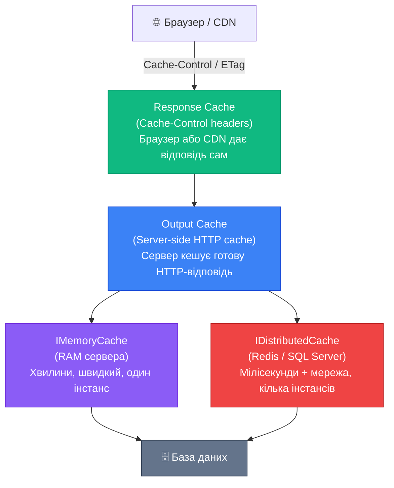
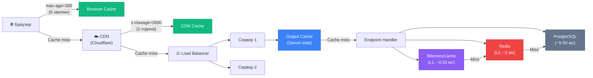

# Огляд кешування: чотири рівні і коли що обирати

Кешування — це зберігання результатів дорогих операцій у швидкодоступному місці, щоб повторні запити до тих самих даних не потребували повторного виконання цих операцій. «Дорогих» — з точки зору часу або ресурсів: SQL-запити, виклики зовнішніх API, складні обчислення.

Перед глибоким занурюванням у кожен механізм окремо — важливо зрозуміти загальну картину: яке кешування існує в ASP.NET Core, на якому рівні воно діє і в яких сценаріях кожен підходить.

---

## Чотири механізми: огляд

ASP.NET Core надає чотири незалежних механізми кешування, що діють на різних рівнях стека. Їх можна і потрібно використовувати разом — кожен обслуговує свій шар.

::mermaid

::

| Механізм | Де зберігається | Підтримка кількох інстансів | Авторизовані запити | Програмна інвалідація |
|---|---|---|---|---|
| **IMemoryCache** | RAM сервера | ❌ | ✅ | ✅ (Remove) |
| **IDistributedCache** | Redis / SQL / Memory | ✅ | ✅ | ✅ (Remove) |
| **Response Cache** | Браузер / CDN / Proxy | ✅ (через CDN) | ❌ | ❌ |
| **Output Cache** | Server store (RAM / Redis) | ✅ (з Redis store) | ✅ | ✅ (EvictByTag) |

---

## Коли що обирати

**`IMemoryCache`** — відправна точка для більшості одно-серверних застосунків. Зберігає будь-які .NET-об'єкти в RAM, без серіалізації. Ідеальний для lookup-таблиць (списки країн, категорій), результатів складних обчислень, hot-data що запитується десятки разів на секунду. Обмеження: при горизонтальному масштабуванні кожен сервер має власний ізольований кеш.

**`IDistributedCache` (Redis)** — логічний наступний крок при переході на кілька інстансів. Всі сервери читають з одного Redis, кеш консистентний. Потребує серіалізації в `byte[]` і мережевого запиту (~1–5 мс). Також підходить для зберігання сесій, rate-limit лічильників, розподілених блокувань.

**Response Cache** — HTTP-стандарт: додаємо заголовки `Cache-Control` і браузер або CDN (Cloudflare, CloudFront) зберігає відповідь на своєму боці. Взагалі не навантажує сервер при cache hit. Але: кешує тільки публічні GET-запити (без `Authorization`), не підтримує програмну інвалідацію з сервера.

**Output Cache** — серверна відповідь на обмеження Response Cache. Зберігає готові HTTP-відповіді на сервері, кешує навіть авторизовані запити (через vary by Authorization header), підтримує теги і `EvictByTagAsync` для групової інвалідації. Введений у .NET 7.

---

## Production-стек: всі механізми разом

У реальному проєкті всі чотири механізми доповнюють один одного:

::mermaid

::

**Порядок отримання даних:**
1. Браузер → Browser Cache (Response Cache) — ~0 мс
2. CDN Edge Server → CDN Cache (Response Cache) — ~10 мс
3. Сервер → Output Cache — ~0.1 мс
4. Handler → IMemoryCache — ~0.01 мс
5. Handler → Redis (IDistributedCache) — ~2 мс
6. Handler → PostgreSQL — ~5–50 мс

---

## Структура цього розділу

Кожен механізм розглянуто у власній статті:

::card-group

::card{title="IMemoryCache" icon="i-lucide-cpu" to="./02.memory-cache"}
In-process кеш у RAM сервера. Найшвидший механізм (наносекунди), підтримує будь-які об'єкти, Absolute/Sliding expiration, eviction callbacks, захист від Cache Stampede.
::

::card{title="IDistributedCache + Redis" icon="i-lucide-server" to="./03.distributed-cache"}
Розподілений кеш для multi-instance розгортання. Redis + StackExchange, серіалізація, теги, Lua-скрипти для атомарних операцій, патерн двох рівнів L1+L2.
::

::card{title="Response Cache" icon="i-lucide-globe" to="./04.response-cache"}
HTTP-рівень кешування через Cache-Control, ETag, Vary. Браузер і CDN кешують на своєму боці — нульове навантаження на сервер. Умовні запити, cache busting стратегії.
::

::card{title="Output Cache" icon="i-lucide-zap" to="./05.output-cache"}
Серверний кеш HTTP-відповідей (.NET 7+). Іменовані політики, теги, EvictByTagAsync, Vary по маршруту/заголовках/запиті, авторизовані запити, власні поліси.
::

::

---

## Головні правила (TL;DR)

::note
1. **Починайте з `IMemoryCache`** — простий, без залежностей, достатній для більшості задач на одному сервері.
2. **Переходьте на Redis** (`IDistributedCache`) лише коли є реальна потреба в multi-instance або потрібна персистентність кешу між перезапусками.
3. **Output Cache** — для GET ендпоінтів, що повертають однакові відповіді для різних клієнтів. Налаштовуйте теги з першого дня — інвалідація буде вдячна.
4. **Response Cache** — для справді публічних, незмінних даних. Налаштовуйте CDN для максимального ефекту.
5. **Cache invalidation** — найскладніша частина. Короткий TTL + явна інвалідація через теги краще, ніж довгий TTL без контролю.
::
