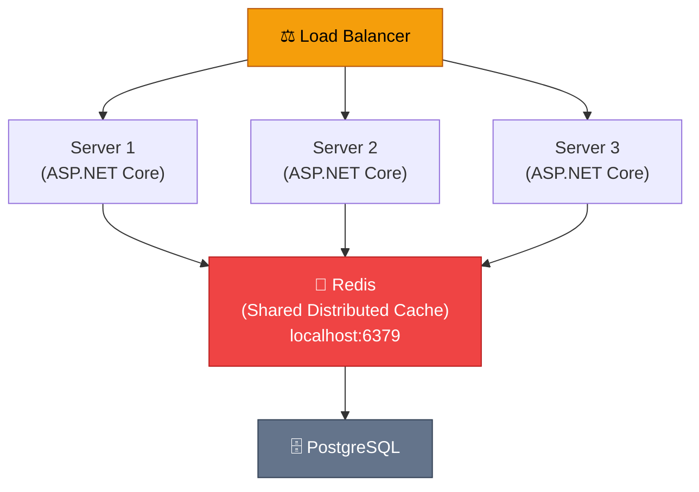

# IDistributedCache і Redis: розподілений кеш

Коли ваш застосунок масштабується горизонтально — запускається на двох, трьох або двадцяти серверах за load balancer — `IMemoryCache` перестає бути достатнім. Кожен сервер має власний незалежний кеш у RAM. Запит на сервер A читає дані з БД і зберігає в його локальний кеш. Наступний запит потрапляє на сервер B — cache miss, знову читає з БД. Кеші не синхронізовані.

`IDistributedCache` вирішує це через спільне сховище, доступне всім серверам одночасно. Найпоширеніша реалізація — **Redis**: in-memory база даних з відповідями за мілісекунди, персистентністю на диск і вбудованим pub/sub для повідомлень.

::mermaid



::

---

## Redis: короткий вступ

**Redis** (Remote Dictionary Server) — це in-memory база даних з підтримкою структур даних: рядки, хеші, списки, множини, відсортовані множини. Для кешування ми використовуємо в основному рядки (`string`) — але ми побачимо, як `Sets` стають у пригоді для тегів.

Встановлення Redis на macOS:

```bash
brew install redis
brew services start redis
redis-cli ping  # PONG — Redis запущений
```

Docker:

```bash
docker run -d --name redis -p 6379:6379 redis:7-alpine
redis-cli -h localhost ping
```

---

## Встановлення і реєстрація

```bash
# Redis через StackExchange.Redis (офіційна бібліотека)
dotnet add package Microsoft.Extensions.Caching.StackExchangeRedis

# Або якщо потрібний прямий доступ до Redis API
dotnet add package StackExchange.Redis
```

```csharp [Program.cs]
builder.Services.AddStackExchangeRedisCache(options =>
{
    // Рядок підключення: host:port,password=...,ssl=...,connectTimeout=...
    options.Configuration =
        builder.Configuration.GetConnectionString("Redis");

    // Необов'язковий префікс для всіх ключів
    // "ShopApi:" → ключ "products:all" зберігається як "ShopApi:products:all"
    // Корисно при кількох застосунках на одному Redis інстансі
    options.InstanceName = "ShopApi:";

    // Налаштування підключення через ConfigurationOptions для advanced-сценаріїв
    // options.ConfigurationOptions = new ConfigurationOptions
    // {
    //     EndPoints = { "localhost:6379" },
    //     Password = "secret",
    //     Ssl = true,
    //     AbortOnConnectFail = false,
    //     ConnectTimeout = 5000,
    //     SyncTimeout = 5000,
    //     ReconnectRetryPolicy = new LinearRetry(5000)
    // };
});
```

```json [appsettings.json]
{
  "ConnectionStrings": {
    "Redis": "localhost:6379,abortConnect=false,connectTimeout=5000,syncTimeout=5000"
  }
}
```

```json [appsettings.Production.json]
{
  "ConnectionStrings": {
    "Redis": "redis-primary:6379,redis-replica:6380,password=supersecret,ssl=true,abortConnect=false"
  }
}
```

`abortConnect=false` — критично важливий параметр: якщо Redis недоступний при старті — застосунок все одно запуститься (замість падіння). Redis стане доступним пізніше, і підключення відновиться автоматично.

---

## IDistributedCache: базові операції

`IDistributedCache` — низькорівневий інтерфейс, що працює з `byte[]`. Ніяких generics, ніякої автоматичної серіалізації:

```csharp [CacheBasics.cs]
using Microsoft.Extensions.Caching.Distributed;

public class BasicCacheExample
{
    private readonly IDistributedCache _cache;

    public BasicCacheExample(IDistributedCache cache) => _cache = cache;

    public async Task DemonstrationAsync()
    {
        // ─── SetAsync: записати byte[] ──────────────────────────
        var bytes = "hello world"u8.ToArray(); // UTF-8 literal
        await _cache.SetAsync("simple-key", bytes, new DistributedCacheEntryOptions
        {
            AbsoluteExpirationRelativeToNow = TimeSpan.FromMinutes(30),
            SlidingExpiration = TimeSpan.FromMinutes(10)
        });

        // ─── GetAsync: отримати byte[] або null ─────────────────
        var cachedBytes = await _cache.GetAsync("simple-key");
        if (cachedBytes is not null)
        {
            var text = System.Text.Encoding.UTF8.GetString(cachedBytes);
        }

        // ─── SetStringAsync / GetStringAsync: зручний шорткат ───
        // Це просто обгортки навколо Set/Get з UTF-8 конвертацією
        await _cache.SetStringAsync("string-key", "hello",
            new DistributedCacheEntryOptions
            {
                AbsoluteExpirationRelativeToNow = TimeSpan.FromMinutes(5)
            });

        var str = await _cache.GetStringAsync("string-key"); // null або "hello"

        // ─── RefreshAsync: скидає sliding expiration ───────────
        // Оновлює TTL без повернення значення (для підтримки активних записів)
        await _cache.RefreshAsync("string-key");

        // ─── RemoveAsync: видалити ──────────────────────────────
        await _cache.RemoveAsync("simple-key");
    }
}
```

---

## Обгортка: GetOrCreateAsync з JSON-серіалізацією

Оскільки `IDistributedCache` не має вбудованого `GetOrCreateAsync`, пишемо власну обгортку:

```csharp [Infrastructure/DistributedCacheExtensions.cs]
using Microsoft.Extensions.Caching.Distributed;
using System.Text.Json;

public static class DistributedCacheExtensions
{
    // Стандартні опції за замовчуванням
    private static readonly DistributedCacheEntryOptions DefaultOptions = new()
    {
        AbsoluteExpirationRelativeToNow = TimeSpan.FromMinutes(30),
        SlidingExpiration = TimeSpan.FromMinutes(10)
    };

    private static readonly JsonSerializerOptions JsonOptions = new()
    {
        PropertyNamingPolicy = JsonNamingPolicy.CamelCase,
        WriteIndented = false // Менше байтів у кеші
    };

    // GetOrCreateAsync: основний патерн
    public static async Task<T?> GetOrCreateAsync<T>(
        this IDistributedCache cache,
        string key,
        Func<CancellationToken, Task<T?>> factory,
        DistributedCacheEntryOptions? options = null,
        ILogger? logger = null,
        CancellationToken ct = default)
    {
        // 1. Спроба отримати з кешу
        var cachedBytes = await cache.GetAsync(key, ct);
        if (cachedBytes is not null)
        {
            logger?.LogDebug("Cache HIT: {Key}", key);
            return JsonSerializer.Deserialize<T>(cachedBytes, JsonOptions);
        }

        logger?.LogInformation("Cache MISS: {Key}", key);

        // 2. Виконуємо дорогу операцію
        var result = await factory(ct);
        if (result is null) return default;

        // 3. Серіалізуємо і зберігаємо
        var serialized = JsonSerializer.SerializeToUtf8Bytes(result, JsonOptions);
        await cache.SetAsync(key, serialized, options ?? DefaultOptions, ct);

        return result;
    }

    // Зручний метод для перевірки наявності ключа
    public static async Task<bool> ExistsAsync(
        this IDistributedCache cache,
        string key,
        CancellationToken ct = default)
    {
        var bytes = await cache.GetAsync(key, ct);
        return bytes is not null;
    }

    // Зручний метод запису з T замість byte[]
    public static async Task SetObjectAsync<T>(
        this IDistributedCache cache,
        string key,
        T value,
        DistributedCacheEntryOptions? options = null,
        CancellationToken ct = default)
    {
        var bytes = JsonSerializer.SerializeToUtf8Bytes(value, JsonOptions);
        await cache.SetAsync(key, bytes, options ?? DefaultOptions, ct);
    }

    // Зручний метод читання T
    public static async Task<T?> GetObjectAsync<T>(
        this IDistributedCache cache,
        string key,
        CancellationToken ct = default)
    {
        var bytes = await cache.GetAsync(key, ct);
        return bytes is null
            ? default
            : JsonSerializer.Deserialize<T>(bytes, JsonOptions);
    }
}
```

Використання у сервісі:

```csharp [Services/ProductService.cs]
public class ProductService
{
    private readonly IDistributedCache _cache;
    private readonly AppDbContext _db;
    private readonly ILogger<ProductService> _logger;

    private static readonly DistributedCacheEntryOptions ProductListOptions = new()
    {
        AbsoluteExpirationRelativeToNow = TimeSpan.FromMinutes(30),
        SlidingExpiration = TimeSpan.FromMinutes(10)
    };

    private static readonly DistributedCacheEntryOptions ProductDetailOptions = new()
    {
        AbsoluteExpirationRelativeToNow = TimeSpan.FromHours(1),
        SlidingExpiration = TimeSpan.FromMinutes(15)
    };

    public async Task<List<Product>?> GetAllAsync(CancellationToken ct)
    {
        return await _cache.GetOrCreateAsync(
            key: "products:all",
            factory: async cancelToken =>
                await _db.Products.AsNoTracking().ToListAsync(cancelToken),
            options: ProductListOptions,
            logger: _logger,
            ct: ct);
    }

    public async Task<Product?> GetByIdAsync(int id, CancellationToken ct)
    {
        return await _cache.GetOrCreateAsync(
            key: $"products:id:{id}",
            factory: async cancelToken =>
                await _db.Products.AsNoTracking()
                    .FirstOrDefaultAsync(p => p.Id == id, cancelToken),
            options: ProductDetailOptions,
            logger: _logger,
            ct: ct);
    }

    public async Task<Product> CreateAsync(CreateProductRequest req, CancellationToken ct)
    {
        var product = new Product { Name = req.Name, Price = req.Price };
        _db.Products.Add(product);
        await _db.SaveChangesAsync(ct);

        // Інвалідація кешу списку
        await _cache.RemoveAsync("products:all", ct);
        return product;
    }
}
```

---

## Теги і групова інвалідація через Redis Sets

`IDistributedCache` не підтримує теги нативно. Але Redis підтримує команду `SADD` (додати до множини) — і ми можемо реалізувати теги самостійно.

Ідея: для кожного тега зберігаємо `Set` (множину) Redis-ключів. При інвалідації тега — видаляємо всі ключі з цієї множини.

```csharp [Infrastructure/RedisTaggedCache.cs]
using StackExchange.Redis;
using System.Text.Json;

public class RedisTaggedCache
{
    private readonly IDistributedCache _cache;
    private readonly IConnectionMultiplexer _redis;
    private readonly string _instanceName;
    private readonly ILogger<RedisTaggedCache> _logger;

    private static readonly JsonSerializerOptions JsonOpts = new()
    {
        WriteIndented = false,
        PropertyNamingPolicy = JsonNamingPolicy.CamelCase
    };

    private static readonly DistributedCacheEntryOptions DefaultOptions = new()
    {
        AbsoluteExpirationRelativeToNow = TimeSpan.FromMinutes(30)
    };

    public RedisTaggedCache(
        IDistributedCache cache,
        IConnectionMultiplexer redis,
        IConfiguration config,
        ILogger<RedisTaggedCache> logger)
    {
        _cache = cache;
        _redis = redis;
        _logger = logger;
        // Той самий префікс, що й у AddStackExchangeRedisCache
        _instanceName = config["CacheInstanceName"] ?? "ShopApi:";
    }

    // ─── Відповідає за назви ключів ────────────────────────────
    private string CacheKey(string key)     => $"{_instanceName}{key}";
    private string TagKey(string tag)       => $"{_instanceName}tag:{tag}";

    // Записати в кеш + прив'язати до тегів
    public async Task SetAsync<T>(
        string key,
        T value,
        string[] tags,
        DistributedCacheEntryOptions? options = null,
        CancellationToken ct = default)
    {
        // 1. Зберігаємо значення через IDistributedCache (серіалізація + TTL)
        var bytes = JsonSerializer.SerializeToUtf8Bytes(value, JsonOpts);
        await _cache.SetAsync(key, bytes, options ?? DefaultOptions, ct);

        // 2. Додаємо ключ до кожного тег-множини в Redis
        var db = _redis.GetDatabase();
        var fullCacheKey = CacheKey(key); // З урахуванням instanceName

        foreach (var tag in tags)
        {
            var tagKey = TagKey(tag);
            // SADD tag:products "ShopApi:products:all"
            await db.SetAddAsync(tagKey, fullCacheKey);
            // Встановлюємо TTL для тег-множини (щоб не накопичувались вічно)
            await db.KeyExpireAsync(tagKey, TimeSpan.FromHours(24));
        }

        _logger.LogDebug("Cached '{Key}' with tags: [{Tags}]",
            key, string.Join(", ", tags));
    }

    // Отримати або створити з тегами
    public async Task<T?> GetOrCreateAsync<T>(
        string key,
        string[] tags,
        Func<CancellationToken, Task<T?>> factory,
        DistributedCacheEntryOptions? options = null,
        CancellationToken ct = default)
    {
        // 1. Перевіряємо кеш
        var cachedBytes = await _cache.GetAsync(key, ct);
        if (cachedBytes is not null)
        {
            _logger.LogDebug("Cache HIT: {Key}", key);
            return JsonSerializer.Deserialize<T>(cachedBytes, JsonOpts);
        }

        _logger.LogInformation("Cache MISS: {Key}", key);

        // 2. Виконуємо factory
        var result = await factory(ct);
        if (result is null) return default;

        // 3. Зберігаємо з тегами
        await SetAsync(key, result, tags, options, ct);

        return result;
    }

    // Інвалідувати всі ключі з тегом
    public async Task InvalidateTagAsync(string tag, CancellationToken ct = default)
    {
        var db = _redis.GetDatabase();
        var tagKey = TagKey(tag);

        // SMEMBERS tag:products → ["ShopApi:products:all", "ShopApi:products:id:1", ...]
        var keys = await db.SetMembersAsync(tagKey);

        if (keys.Length == 0)
        {
            _logger.LogDebug("Tag '{Tag}' is empty — nothing to invalidate", tag);
            return;
        }

        _logger.LogInformation(
            "Invalidating tag '{Tag}' — {Count} keys", tag, keys.Length);

        // Видаляємо всі ключі одним Pipeline (атомарно і швидко)
        var pipeline = db.CreateBatch();
        var deleteTasks = keys
            .Select(k => pipeline.KeyDeleteAsync(k.ToString()))
            .ToList();
        pipeline.Execute();
        await Task.WhenAll(deleteTasks);

        // Видаляємо тег-множину
        await db.KeyDeleteAsync(tagKey);
    }

    // Інвалідувати кілька тегів одразу
    public async Task InvalidateTagsAsync(
        IEnumerable<string> tags,
        CancellationToken ct = default)
    {
        await Task.WhenAll(tags.Select(t => InvalidateTagAsync(t, ct)));
    }
}
```

Реєстрація у DI:

```csharp [Program.cs]
// IConnectionMultiplexer — для прямого доступу до Redis API
builder.Services.AddSingleton<IConnectionMultiplexer>(_ =>
    ConnectionMultiplexer.Connect(
        builder.Configuration.GetConnectionString("Redis")!));

builder.Services.AddSingleton<RedisTaggedCache>();
builder.Services.AddConfiguration<string>("CacheInstanceName", "ShopApi:");
```

---

## IConnectionMultiplexer: прямий доступ до Redis

Для операцій що не підтримує `IDistributedCache` — `IConnectionMultiplexer` надає повний Redis API:

```csharp [Infrastructure/RedisService.cs]
using StackExchange.Redis;

public class RedisService
{
    private readonly IDatabase _db;

    public RedisService(IConnectionMultiplexer redis)
        => _db = redis.GetDatabase();

    // ─── Атомарний increment (rate limiting, лічильники) ───────
    public async Task<long> IncrementAsync(string key, TimeSpan? expiry = null)
    {
        var value = await _db.StringIncrementAsync(key);
        if (expiry.HasValue && value == 1)
            // TTL встановлюємо тільки при першому increment
            await _db.KeyExpireAsync(key, expiry.Value);
        return value;
    }

    // ─── Distributed Lock (через SET NX EX) ───────────────────
    public async Task<bool> TryAcquireLockAsync(
        string lockKey, string lockValue, TimeSpan expiry)
    {
        // SET lockKey lockValue NX EX {seconds}
        // NX = тільки якщо ключ не існує (атомарна операція)
        return await _db.StringSetAsync(lockKey, lockValue,
            expiry, When.NotExists);
    }

    public async Task ReleaseLockAsync(string lockKey, string lockValue)
    {
        // Перевіряємо що ми — власники блокування, потім видаляємо
        // Lua-скрипт для атомарності (check + delete в одній операції)
        const string script = @"
            if redis.call('get', KEYS[1]) == ARGV[1] then
                return redis.call('del', KEYS[1])
            else
                return 0
            end";

        await _db.ScriptEvaluateAsync(script,
            keys: [lockKey],
            values: [lockValue]);
    }

    // ─── Rate Limiting: перевірка лімітів ─────────────────────
    public async Task<(bool allowed, long remaining, TimeSpan reset)> CheckRateLimitAsync(
        string identifier,  // Наприклад, IP-адреса або userId
        int maxRequests,
        TimeSpan window)
    {
        var key = $"rate-limit:{identifier}:{DateTime.UtcNow:yyyyMMddHHmm}";

        var count = await _db.StringIncrementAsync(key);
        if (count == 1)
            await _db.KeyExpireAsync(key, window);

        var ttl = await _db.KeyTimeToLiveAsync(key);
        var remaining = Math.Max(0, maxRequests - count);

        return (count <= maxRequests, remaining, ttl ?? TimeSpan.Zero);
    }

    // ─── Pub/Sub: публікація повідомлення ─────────────────────
    public async Task PublishInvalidationAsync(string tag)
    {
        var pub = _db.Multiplexer.GetSubscriber();
        // Інші серверні інстанси підписані на цей канал і видалять свій IMemoryCache
        await pub.PublishAsync(RedisChannel.Literal("cache:invalidate"), tag);
    }
}
```

---

## Pub/Sub: синхронізація IMemoryCache між серверами

Найскладніший, але найефективніший патерн: спільний Redis + кожен сервер має IMemoryCache як L1-кеш. Redis Pub/Sub синхронізує інвалідацію між серверами:

```csharp [Infrastructure/CacheInvalidationSubscriber.cs]
using Microsoft.Extensions.Caching.Memory;
using StackExchange.Redis;

// IHostedService що підписується на Redis канал при старті
public class CacheInvalidationSubscriber : IHostedService
{
    private readonly IConnectionMultiplexer _redis;
    private readonly IMemoryCache _memoryCache;
    private readonly ILogger<CacheInvalidationSubscriber> _logger;
    private ISubscriber? _subscriber;

    public CacheInvalidationSubscriber(
        IConnectionMultiplexer redis,
        IMemoryCache memoryCache,
        ILogger<CacheInvalidationSubscriber> logger)
    {
        _redis = redis;
        _memoryCache = memoryCache;
        _logger = logger;
    }

    public async Task StartAsync(CancellationToken ct)
    {
        _subscriber = _redis.GetSubscriber();

        // Підписуємось на канал "cache:invalidate"
        await _subscriber.SubscribeAsync(
            RedisChannel.Literal("cache:invalidate"),
            (channel, message) =>
            {
                // Отримали повідомлення про інвалідацію тега/ключа
                var tag = message.ToString();
                _logger.LogInformation(
                    "Received cache invalidation signal for tag: {Tag}", tag);

                // Видаляємо з local IMemoryCache
                // (RedisTaggedCache вже видалила з Redis)
                _memoryCache.Remove($"tag-tracked:{tag}");

                // Якщо зберігали список ключів тега і в IMemoryCache — видаляємо
                if (_memoryCache.TryGetValue($"keys-for-tag:{tag}", out List<string>? keys))
                {
                    keys?.ForEach(k => _memoryCache.Remove(k));
                    _memoryCache.Remove($"keys-for-tag:{tag}");
                }
            });

        _logger.LogInformation("Subscribed to Redis cache invalidation channel");
    }

    public async Task StopAsync(CancellationToken ct)
    {
        if (_subscriber is not null)
            await _subscriber.UnsubscribeAllAsync();
    }
}
```

Реєстрація:

```csharp [Program.cs]
builder.Services.AddHostedService<CacheInvalidationSubscriber>();
```

---

## Двохрівневий кеш: L1 (Memory) + L2 (Redis)

Найоптимальніший патерн для high-traffic API з кількома серверами:

- **L1 (IMemoryCache):** < 0.01 мс, без мережевого запиту. TTL 1–5 хвилин.
- **L2 (Redis):** ~1–5 мс з мережею. TTL 30–60 хвилин.
- **L3 (Database):** 5–50+ мс. Єдине джерело правди.

```csharp [Infrastructure/TieredCache.cs]
public class TieredCache
{
    private readonly IMemoryCache _l1;
    private readonly IDistributedCache _l2;
    private readonly ILogger<TieredCache> _logger;

    // L1 живе коротко — лише для "гарячих" даних
    private static readonly TimeSpan L1Ttl = TimeSpan.FromMinutes(2);

    // L2 живе довго — Redis витримує і зберігає
    private static readonly DistributedCacheEntryOptions L2Options = new()
    {
        AbsoluteExpirationRelativeToNow = TimeSpan.FromMinutes(30)
    };

    private static readonly JsonSerializerOptions JsonOpts = new()
    {
        PropertyNamingPolicy = JsonNamingPolicy.CamelCase
    };

    public TieredCache(
        IMemoryCache l1,
        IDistributedCache l2,
        ILogger<TieredCache> logger)
    {
        _l1 = l1;
        _l2 = l2;
        _logger = logger;
    }

    public async Task<T?> GetOrCreateAsync<T>(
        string key,
        Func<CancellationToken, Task<T?>> factory,
        CancellationToken ct = default)
    {
        // ─── L1: IMemoryCache (наносекунди) ──────────────────────
        if (_l1.TryGetValue(key, out T? l1Value))
        {
            _logger.LogDebug("L1 HIT: {Key}", key);
            return l1Value;
        }

        // ─── L2: Redis (мілісекунди) ──────────────────────────────
        var l2Bytes = await _l2.GetAsync(key, ct);
        if (l2Bytes is not null)
        {
            _logger.LogDebug("L2 HIT: {Key}", key);
            var l2Value = JsonSerializer.Deserialize<T>(l2Bytes, JsonOpts);

            // Записуємо в L1 для наступних запитів (backfill)
            _l1.Set(key, l2Value, L1Ttl);
            return l2Value;
        }

        // ─── L3: Database (мілісекунди–секунди) ──────────────────
        _logger.LogInformation("L3 (DB) MISS: {Key}", key);
        var dbValue = await factory(ct);
        if (dbValue is null) return default;

        // Записуємо в обидва рівні
        _l1.Set(key, dbValue, L1Ttl);

        var bytes = JsonSerializer.SerializeToUtf8Bytes(dbValue, JsonOpts);
        await _l2.SetAsync(key, bytes, L2Options, ct);

        return dbValue;
    }

    public async Task RemoveAsync(string key, CancellationToken ct = default)
    {
        // Видаляємо з обох рівнів
        _l1.Remove(key);
        await _l2.RemoveAsync(key, ct);
    }
}
```

Реєстрація:

```csharp [Program.cs]
builder.Services.AddMemoryCache();
builder.Services.AddStackExchangeRedisCache(opts => { /* ... */ });
builder.Services.AddSingleton<TieredCache>();
```

---

## Rate Limiting з Redis

Класичний приклад практичного використання Redis: обмеження кількості запитів (rate limiting). Вбудований `IDistributedCache` не підходить — потрібен атомарний `INCR` з TTL. Використовуємо `IConnectionMultiplexer`:

```csharp [Middleware/RateLimitMiddleware.cs]
public class RateLimitMiddleware
{
    private readonly RequestDelegate _next;
    private readonly IDatabase _redis;
    private const int MaxRequests = 100;  // Запитів
    private static readonly TimeSpan Window = TimeSpan.FromMinutes(1); // За хвилину

    public RateLimitMiddleware(RequestDelegate next, IConnectionMultiplexer redis)
    {
        _next = next;
        _redis = redis.GetDatabase();
    }

    public async Task InvokeAsync(HttpContext ctx)
    {
        var ip = ctx.Connection.RemoteIpAddress?.ToString() ?? "unknown";
        var key = $"rate:{ip}:{DateTime.UtcNow:yyyyMMddHHmm}"; // Ключ per-minute

        var count = await _redis.StringIncrementAsync(key);
        if (count == 1)
            await _redis.KeyExpireAsync(key, Window); // TTL тільки при першому запиті

        var remaining = MaxRequests - count;

        ctx.Response.Headers["X-RateLimit-Limit"] = MaxRequests.ToString();
        ctx.Response.Headers["X-RateLimit-Remaining"] = Math.Max(0, remaining).ToString();

        if (count > MaxRequests)
        {
            ctx.Response.StatusCode = StatusCodes.Status429TooManyRequests;
            ctx.Response.Headers["Retry-After"] = "60";
            await ctx.Response.WriteAsJsonAsync(new
            {
                error = "Too many requests. Please retry after 60 seconds."
            });
            return;
        }

        await _next(ctx);
    }
}
```

---

## Підводні камені

::accordion

::accordion-item{label="⚠️ Redis недоступний — як не впасти" icon="i-lucide-alert-triangle"}
```csharp
// Проблема: якщо Redis недоступний — IDistributedCache.GetAsync кидає Exception
// Це може покласти весь застосунок навіть якщо Redis — тільки кеш (не критично)

// ✅ Рішення: try/catch навколо всіх Redis-операцій
public async Task<List<Product>?> GetAllSafeAsync(CancellationToken ct)
{
    try
    {
        return await _cache.GetOrCreateAsync<List<Product>>(
            "products:all",
            async cancelToken => await _db.Products.ToListAsync(cancelToken),
            ct: ct);
    }
    catch (Exception ex) when (ex is not OperationCanceledException)
    {
        // Redis недоступний — fallback на базу даних
        _logger.LogError(ex, "Redis unavailable — falling back to database");
        return await _db.Products.AsNoTracking().ToListAsync(ct);
    }
}
```
::

::accordion-item{label="⚠️ Серіалізація DateTime і часові зони" icon="i-lucide-clock"}
```csharp
// Проблема: DateTime без Kind або DateTimeKind.Local може
// десеріалізуватись неправильно на іншому сервері (інша часова зона)
var product = new Product { CreatedAt = DateTime.Now }; // ❌ Local time!

// ✅ Завжди зберігайте DateTime у UTC
var product = new Product { CreatedAt = DateTime.UtcNow }; // ✅

// ✅ Або використовуйте DateTimeOffset — він містить зсув
var product = new Product { CreatedAt = DateTimeOffset.UtcNow }; // ✅
```
::

::accordion-item{label="⚠️ Занадто великі об'єкти в Redis" icon="i-lucide-database"}
Redis ефективно зберігає об'єкти до кількох сотень тисяч байтів. Але серіалізація великих графів об'єктів (з навігаційними властивостями EF Core) може дати неочікувано великий JSON:

```csharp
// ❌ Потенційно мегабайти якщо Product має багато навігаційних властивостей
await _cache.SetObjectAsync("product:1", await _db.Products
    .Include(p => p.Category)
    .Include(p => p.Reviews) // 1000 відгуків!
    .FirstAsync());

// ✅ Кешуємо DTO, а не EF-entity
var dto = new ProductDto(product.Id, product.Name, product.Price);
await _cache.SetObjectAsync($"product:{id}", dto);
```
::

::

---

## Практичні завдання

### Рівень 1 — Базовий

**Завдання 1.1.** Запустіть Redis локально (Docker або Homebrew). Підключіть `AddStackExchangeRedisCache` до ShopApi. Реалізуйте `GET /products` і `GET /products/{id}` з кешуванням через `IDistributedCache`. Через `redis-cli` перевірте що ключі дійсно з'являються в Redis: `redis-cli KEYS "ShopApi:*"`, `redis-cli TTL "ShopApi:products:all"`.

**Завдання 1.2.** Додайте заголовки відповіді для діагностики: `X-Cache: HIT` або `X-Cache: MISS`, `X-Cache-Key: products:all`, `X-Cache-Age: 125` (секунди від запису). Для `X-Cache-Age`: зберігайте `DateTimeOffset.UtcNow` разом із даними і обчислюйте різницю при отриманні.

### Рівень 2 — Логіка

**Завдання 2.1.** Реалізуйте `RedisTaggedCache` з наданого прикладу. Перевірте інвалідацію тегів: при `PUT /products/{id}` — викликайте `InvalidateTagAsync("products")`. Через `redis-cli SMEMBERS "ShopApi:tag:products"` перевірте вміст тег-множини до та після інвалідації.

**Завдання 2.2.** Реалізуйте Rate Limiting через `RateLimitMiddleware`: 20 запитів на хвилину на IP. Логуйте IP і кількість запитів для кожного порушника. Додайте endpoint `GET /admin/rate-limits` що повертає список IP з `SCAN 0 MATCH "rate:*"`.

### Рівень 3 — Архітектура

**Завдання 3.1.** Реалізуйте двохрівневий кеш `TieredCache` з наданого прикладу. Напишіть тест що підтверджує: при першому запиті — MISS (обидва рівні), при другому — L1 HIT (з пам'яті), після `Remove()` і другому запиту — L2 HIT (з Redis, не з БД). Використайте `AddDistributedMemoryCache()` для тестового Redis.
